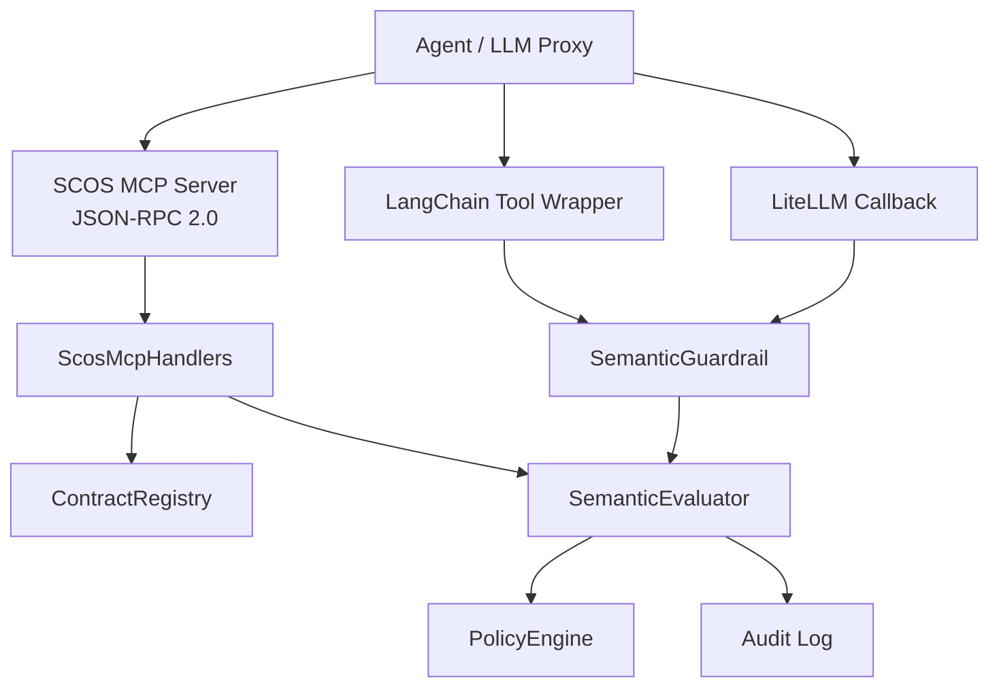
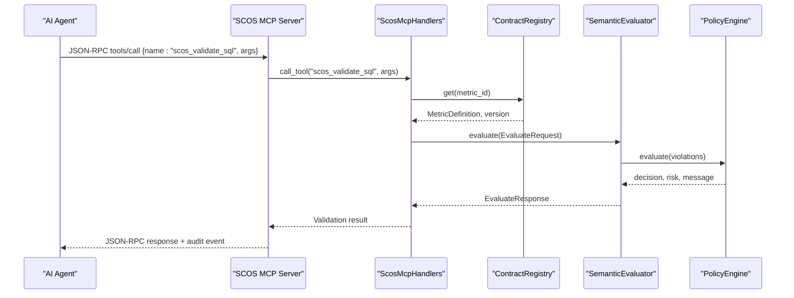
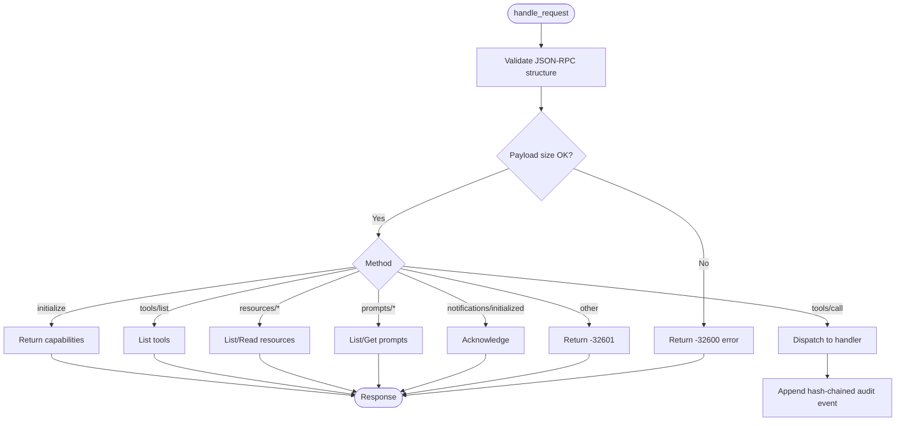
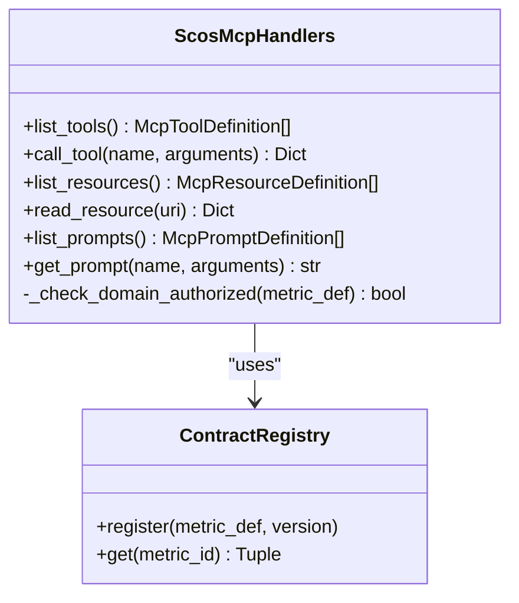
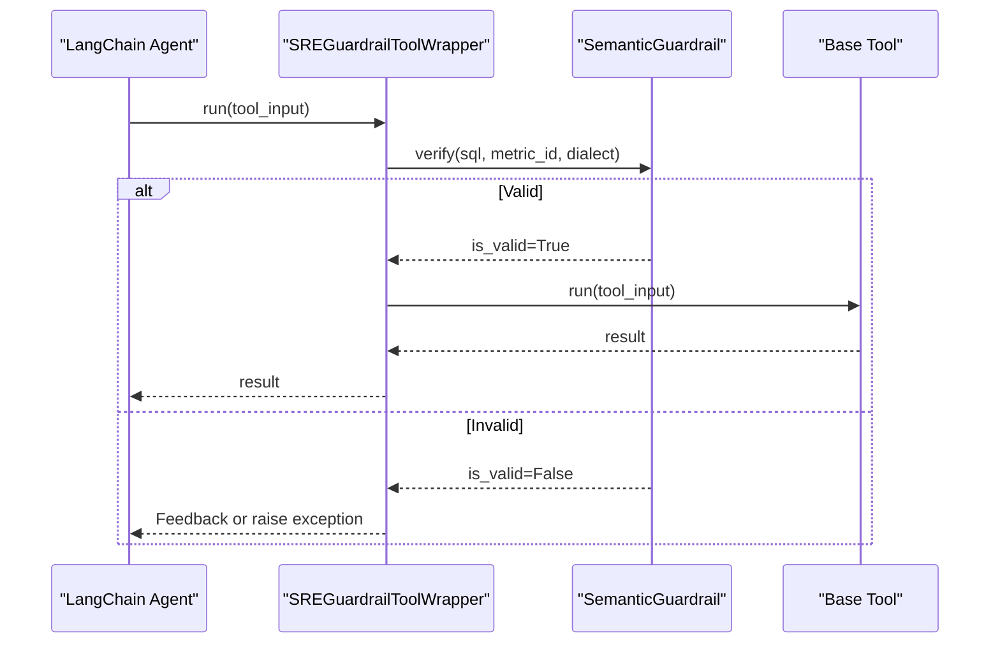
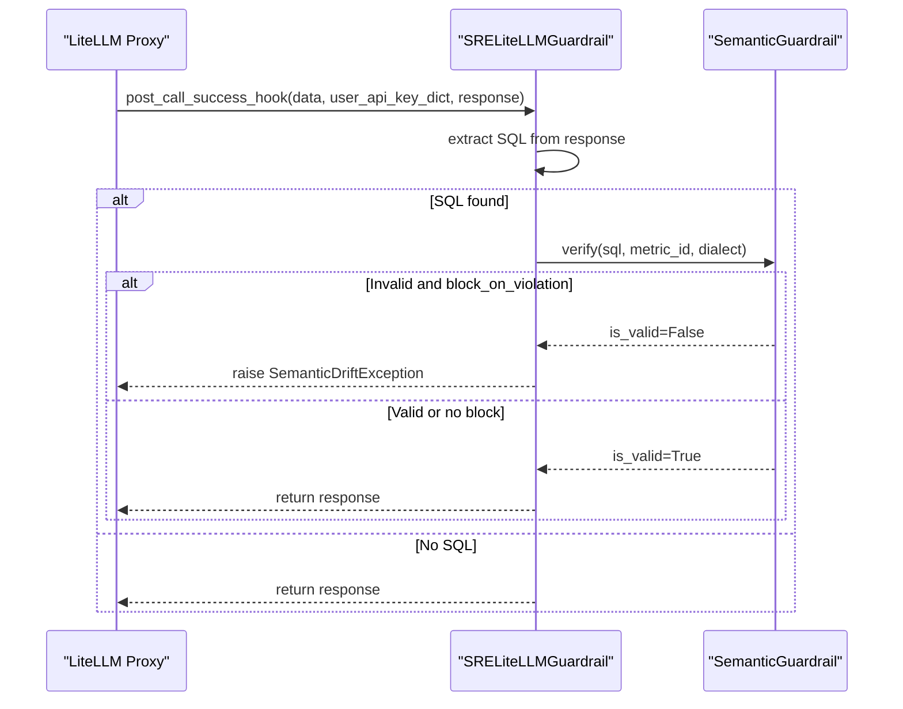
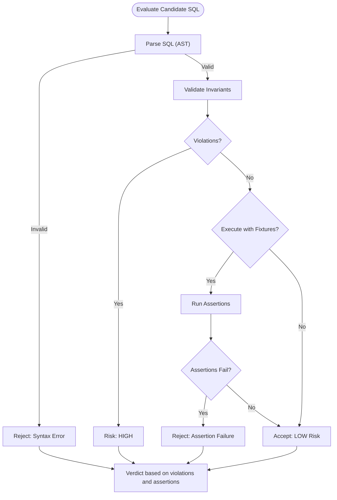
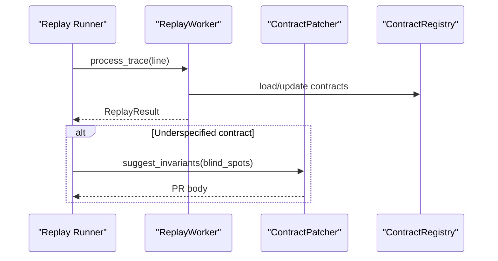
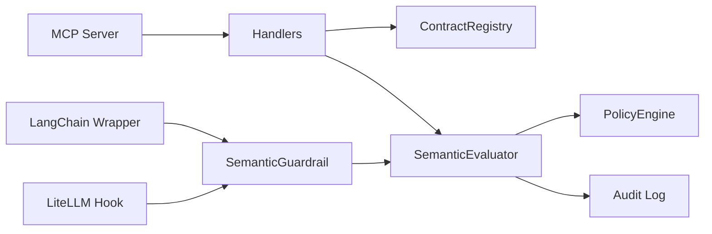

# AI Agent Integration

<cite>
**Referenced Files in This Document**
- [server.py](file://semantic_reliability/mcp/server.py)
- [handlers.py](file://semantic_reliability/mcp/handlers.py)
- [models.py](file://semantic_reliability/mcp/models.py)
- [security.py](file://semantic_reliability/mcp/security.py)
- [engine.py](file://semantic_reliability/firewall/engine.py)
- [langchain.py](file://semantic_reliability/integrations/langchain.py)
- [litellm.py](file://semantic_reliability/integrations/litellm.py)
- [guardrail.py](file://semantic_reliability/guardrail.py)
- [agent_eval.py](file://semantic_reliability/evaluation/agent_eval.py)
- [main.py](file://semantic_reliability/replay/main.py)
- [replay.py](file://semantic_reliability/benchmark/replay.py)
- [README.md](file://README.md)
- [semantic_firewall_sidecar.yaml](file://deploy/k8s/semantic_firewall_sidecar.yaml)
</cite>

## Table of Contents
1. Introduction
2. Project Structure
3. Core Components
4. Architecture Overview
5. Detailed Component Analysis
6. Dependency Analysis
7. Performance Considerations
8. Troubleshooting Guide
9. Conclusion
10. Appendices

## Introduction
This document explains how to integrate the Semantic Reliability Engine (SRE) with AI agents and text-to-SQL systems. It covers:
- The MCP (Model Context Protocol) server implementation, including JSON-RPC endpoints, message formats, and security controls
- Integration patterns for LangChain and LiteLLM
- Agent evaluation methodologies and trajectory replay capabilities
- The guardrail tool wrapper that intercepts and validates agent queries
- Setup instructions for different deployment scenarios and configuration options
- Performance considerations, rate limiting, and monitoring approaches for production deployments

## Project Structure
The integration surface spans several modules:
- MCP server and handlers expose a read-only contract consultation interface over JSON-RPC 2.0
- Guardrails enforce semantic correctness before execution
- Integrations provide drop-in hooks for LangChain tools and LiteLLM callbacks
- Evaluation and replay utilities support agent assessment and offline re-execution against updated contracts
- Deployment artifacts demonstrate Kubernetes sidecar usage

**Diagram sources**
- [server.py:16-180](file://semantic_reliability/mcp/server.py#L16-L180)
- [handlers.py:19-287](file://semantic_reliability/mcp/handlers.py#L19-L287)
- [engine.py:18-132](file://semantic_reliability/firewall/engine.py#L18-L132)
- [langchain.py:12-149](file://semantic_reliability/integrations/langchain.py#L12-L149)
- [litellm.py:13-95](file://semantic_reliability/integrations/litellm.py#L13-L95)
- [guardrail.py:45-153](file://semantic_reliability/guardrail.py#L45-L153)

**Section sources**
- [README.md:22-112](file://README.md#L22-L112)

## Core Components
- SCOS MCP Server: Implements JSON-RPC 2.0 methods for initialize, tools/list, tools/call, resources/list, resources/read, prompts/list, prompts/get, and notifications/initialized. It enforces payload size limits, maps errors to standard codes, and maintains a tamper-evident audit chain with signed checkpoints.
- ScosMcpHandlers: Provides read-only business contract tools such as listing metrics, retrieving contracts, validating SQL against invariants, explaining violations, and querying probe status. It includes domain authorization checks and AST complexity limits.
- SemanticGuardrail: A high-level API that loads metric contracts, evaluates candidate SQL via the firewall evaluator, computes drift scores, and raises or returns structured results.
- LangChain Integration: Wraps database tools to intercept SQL, validate it, and either execute or return feedback to the agent; also provides a callback hook for tracing.
- LiteLLM Integration: Extracts SQL from responses and validates it via post-call hooks, blocking on violation if configured.
- Evaluation & Replay: AgentSQL evaluator assesses syntax, contract compliance, runtime execution, and assertions; replay engine re-runs trajectories against updated contracts and can suggest invariant patches.

**Section sources**
- [server.py:16-257](file://semantic_reliability/mcp/server.py#L16-L257)
- [handlers.py:19-409](file://semantic_reliability/mcp/handlers.py#L19-L409)
- [guardrail.py:45-153](file://semantic_reliability/guardrail.py#L45-L153)
- [langchain.py:12-149](file://semantic_reliability/integrations/langchain.py#L12-L149)
- [litellm.py:13-95](file://semantic_reliability/integrations/litellm.py#L13-L95)
- [agent_eval.py:21-134](file://semantic_reliability/evaluation/agent_eval.py#L21-L134)
- [main.py:11-48](file://semantic_reliability/replay/main.py#L11-L48)
- [replay.py:70-125](file://semantic_reliability/benchmark/replay.py#L70-L125)

## Architecture Overview
The system places deterministic semantic validation at the boundary between AI-generated SQL and data warehouse execution. Agents call into SRE through three paths:
- MCP server for contract consultation and pre-flight validation
- LangChain tool wrapper for in-process interception
- LiteLLM callback for proxy-wide enforcement

**Diagram sources**
- [server.py:50-180](file://semantic_reliability/mcp/server.py#L50-L180)
- [handlers.py:147-240](file://semantic_reliability/mcp/handlers.py#L147-L240)
- [engine.py:46-132](file://semantic_reliability/firewall/engine.py#L46-L132)

## Detailed Component Analysis

### MCP Server Implementation
- JSON-RPC 2.0 methods:
  - initialize: Returns protocol version, server info, and capabilities
  - tools/list: Lists available tools with input schemas
  - tools/call: Dispatches to handler logic, records audit events with hash chaining
  - resources/list, resources/read: Exposes policy and contract resources
  - prompts/list, prompts/get: Provides prompt templates for guidance and repair
  - notifications/initialized: Acknowledges initialization
- Security controls:
  - Payload size limit enforced per request
  - Domain authorization for metrics and resources
  - Tamper-evident audit log using SHA-256 hash chaining
  - Signed checkpoints using HMAC-SHA256 with a signing secret
- Error handling:
  - Standard JSON-RPC error codes for invalid requests, invalid params, method not found, and internal errors

**Diagram sources**
- [server.py:50-180](file://semantic_reliability/mcp/server.py#L50-L180)
- [security.py:21-57](file://semantic_reliability/mcp/security.py#L21-L57)

**Section sources**
- [server.py:16-257](file://semantic_reliability/mcp/server.py#L16-L257)
- [models.py:9-121](file://semantic_reliability/mcp/models.py#L9-L121)
- [security.py:1-57](file://semantic_reliability/mcp/security.py#L1-L57)

### MCP Handlers and Tools
- Tools:
  - scos_list_metrics: Lists registered metrics with optional domain filtering
  - scos_get_contract: Retrieves full contract definition, canonical SQL, and invariants
  - scos_validate_sql: Validates candidate SQL against declared invariants; enforces length and AST complexity limits
  - scos_explain_violation: Provides remediation guidance without automatic rewriting
  - scos_get_probe_status: Returns active probes and health status for a metric
- Authorization:
  - Domain-based access control ensures callers can only access authorized metrics/resources
- Resources:
  - Policy resource exposing severity rules and defaults
  - Contract resources exposing definitions and invariants by domain and version
- Prompts:
  - Guidance and repair prompts to steer agent behavior toward compliant SQL generation

**Diagram sources**
- [handlers.py:19-409](file://semantic_reliability/mcp/handlers.py#L19-L409)
- [engine.py:18-44](file://semantic_reliability/firewall/engine.py#L18-L44)

**Section sources**
- [handlers.py:19-409](file://semantic_reliability/mcp/handlers.py#L19-L409)

### Guardrail Tool Wrapper (LangChain)
- Intercepts SQL executed by wrapped tools
- Validates SQL against metric contracts
- If invalid:
  - With raise_on_drift=False: Returns formatted diagnostic feedback to the agent for self-correction
  - With raise_on_drift=True: Raises SemanticDriftException
- Supports both synchronous and asynchronous execution paths
- Also provides a BaseCallbackHandler-compatible hook to observe and block drift during tool start events

**Diagram sources**
- [langchain.py:12-112](file://semantic_reliability/integrations/langchain.py#L12-L112)
- [guardrail.py:91-153](file://semantic_reliability/guardrail.py#L91-L153)

**Section sources**
- [langchain.py:12-149](file://semantic_reliability/integrations/langchain.py#L12-L149)
- [guardrail.py:13-153](file://semantic_reliability/guardrail.py#L13-L153)

### LiteLLM Integration
- Extracts SQL from LLM responses (tool calls or markdown code blocks)
- Validates via SemanticGuardrail
- Blocks on violation when configured
- Provides sync and async hooks compatible with LiteLLM callbacks

**Diagram sources**
- [litellm.py:13-95](file://semantic_reliability/integrations/litellm.py#L13-L95)
- [guardrail.py:91-153](file://semantic_reliability/guardrail.py#L91-L153)

**Section sources**
- [litellm.py:13-95](file://semantic_reliability/integrations/litellm.py#L13-L95)

### Agent Evaluation Methodologies
- Syntax and transpilation checks ensure SQL is valid for the target dialect
- Contract invariant validation detects missing filters, grain changes, and aggregation issues
- Optional DuckDB execution with fixtures enables runtime assertion testing
- Risk determination distinguishes critical failures, silent semantic breaches, and accepted queries
- Reports include verdicts, evidence, and actionable details

**Diagram sources**
- [agent_eval.py:35-134](file://semantic_reliability/evaluation/agent_eval.py#L35-L134)

**Section sources**
- [agent_eval.py:21-134](file://semantic_reliability/evaluation/agent_eval.py#L21-L134)

### Trajectory Replay Capabilities
- Replay worker reads audit logs and processes traces against updated contracts
- Detects underspecified contracts and suggests invariant patches
- Generates pull request bodies for contract improvements
- Offline replay engine re-evaluates trajectories and computes scorecards

**Diagram sources**
- [main.py:11-48](file://semantic_reliability/replay/main.py#L11-L48)
- [replay.py:70-125](file://semantic_reliability/benchmark/replay.py#L70-L125)

**Section sources**
- [main.py:11-48](file://semantic_reliability/replay/main.py#L11-L48)
- [replay.py:70-125](file://semantic_reliability/benchmark/replay.py#L70-L125)

## Dependency Analysis
- MCP server depends on handlers, models, and firewall components for evaluation and policy decisions
- Handlers depend on registry and contract validator for invariant checks
- Guardrail depends on firewall evaluator and policy engine for decisions
- Integrations wrap guardrail to intercept and validate agent queries
- Evaluation and replay depend on fixtures, runners, and patchers for testing and improvement

**Diagram sources**
- [server.py:16-180](file://semantic_reliability/mcp/server.py#L16-L180)
- [handlers.py:19-287](file://semantic_reliability/mcp/handlers.py#L19-L287)
- [engine.py:18-132](file://semantic_reliability/firewall/engine.py#L18-L132)
- [langchain.py:12-149](file://semantic_reliability/integrations/langchain.py#L12-L149)
- [litellm.py:13-95](file://semantic_reliability/integrations/litellm.py#L13-L95)
- [guardrail.py:45-153](file://semantic_reliability/guardrail.py#L45-L153)

**Section sources**
- [engine.py:18-132](file://semantic_reliability/firewall/engine.py#L18-L132)

## Performance Considerations
- Request size limits: Enforced at the MCP server and security layer to prevent oversized payloads
- SQL length and AST complexity limits: Prevent expensive parsing and analysis
- Deterministic evaluation: Avoids probabilistic judgments; uses AST normalization for fast, repeatable checks
- Audit logging: Hash-chained events are lightweight but should be monitored for volume
- Monitoring: Health and metrics endpoints enable observability; Prometheus metrics are supported where available

[No sources needed since this section provides general guidance]

## Troubleshooting Guide
Common issues and resolutions:
- Invalid JSON-RPC request: Ensure root payload is a JSON object with a string method field and params as an object
- Missing required arguments: Verify tool-specific parameters like metric_id and sql
- Domain authorization denied: Confirm caller identity and allowed domains match metric metadata
- SQL parse errors: Check dialect compatibility and query syntax
- Complexity limits exceeded: Reduce query complexity or split into smaller steps
- Audit signature verification failure: Ensure signing key is correctly configured and consistent across services

**Section sources**
- [server.py:50-180](file://semantic_reliability/mcp/server.py#L50-L180)
- [handlers.py:147-287](file://semantic_reliability/mcp/handlers.py#L147-L287)
- [models.py:85-108](file://semantic_reliability/mcp/models.py#L85-L108)
- [security.py:21-57](file://semantic_reliability/mcp/security.py#L21-L57)

## Conclusion
The Semantic Reliability Engine provides robust, deterministic safeguards for AI agents and text-to-SQL systems. Through MCP-based contract consultation, guardrail wrappers, and LiteLLM hooks, organizations can enforce business semantics before execution. Evaluation and replay capabilities enable continuous improvement of contracts and agent behavior. Production deployments benefit from built-in security controls, audit trails, and monitoring endpoints.

[No sources needed since this section summarizes without analyzing specific files]

## Appendices

### Setup Instructions
- Local demo: Initialize registry with benchmark corpus, create handlers and server, and run scenario validations
- CLI usage: Compile contracts, launch MCP server, run live benchmarks, and replay trajectories
- Kubernetes sidecar: Mount metric contracts via ConfigMap and deploy the firewall sidecar

**Section sources**
- [README.md:49-112](file://README.md#L49-L112)
- [semantic_firewall_sidecar.yaml:77-102](file://deploy/k8s/semantic_firewall_sidecar.yaml#L77-L102)

### Configuration Options
- MCP server:
  - Allowed domains for tenant scoping
  - Max request bytes
  - Signing secret for audit checkpoints
- Handlers:
  - Max SQL characters and AST node limits
- Guardrail:
  - Dialect selection
  - Raise on drift behavior
- LiteLLM:
  - Block on violation flag
  - Metric ID and dialect

**Section sources**
- [server.py:25-48](file://semantic_reliability/mcp/server.py#L25-L48)
- [handlers.py:22-27](file://semantic_reliability/mcp/handlers.py#L22-L27)
- [langchain.py:26-38](file://semantic_reliability/integrations/langchain.py#L26-L38)
- [litellm.py:27-37](file://semantic_reliability/integrations/litellm.py#L27-L37)

### Monitoring Approaches
- Health endpoint: Returns service status and loaded contracts
- Metrics endpoint: Exposes Prometheus metrics for requests, latency, decisions, violations, and blocked queries
- Structured audit logs: Emit hashed payloads and timestamps for traceability

**Section sources**
- [README.md:100-112](file://README.md#L100-L112)