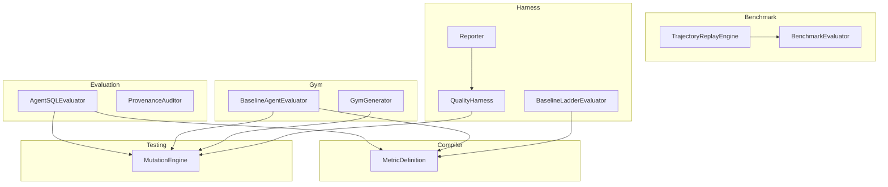
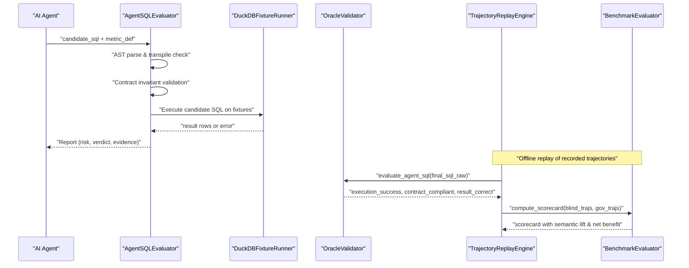
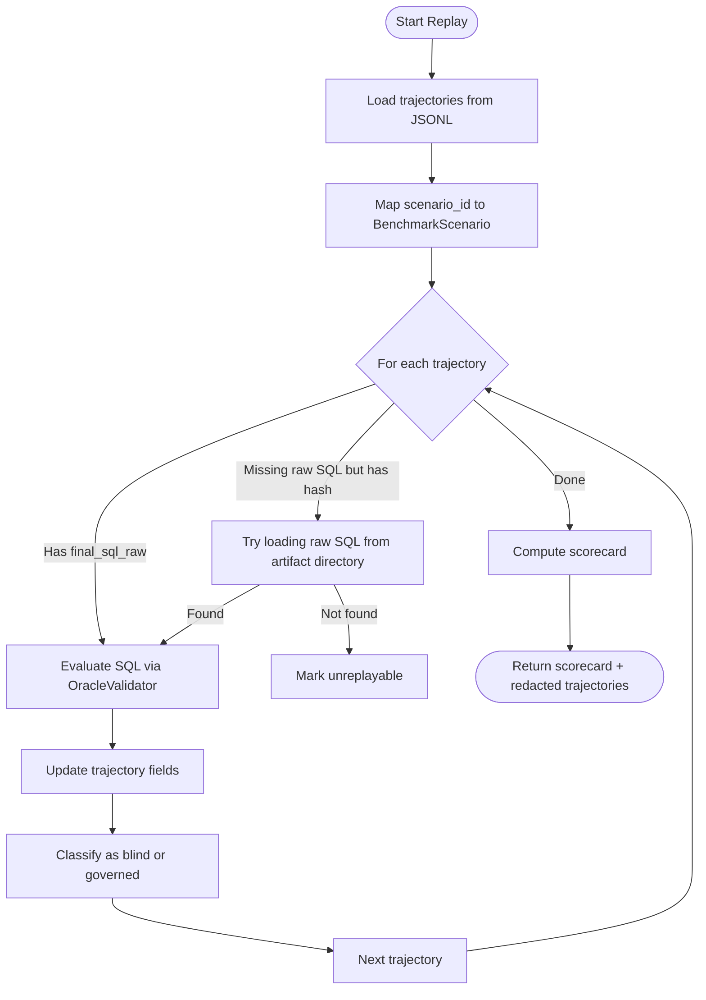
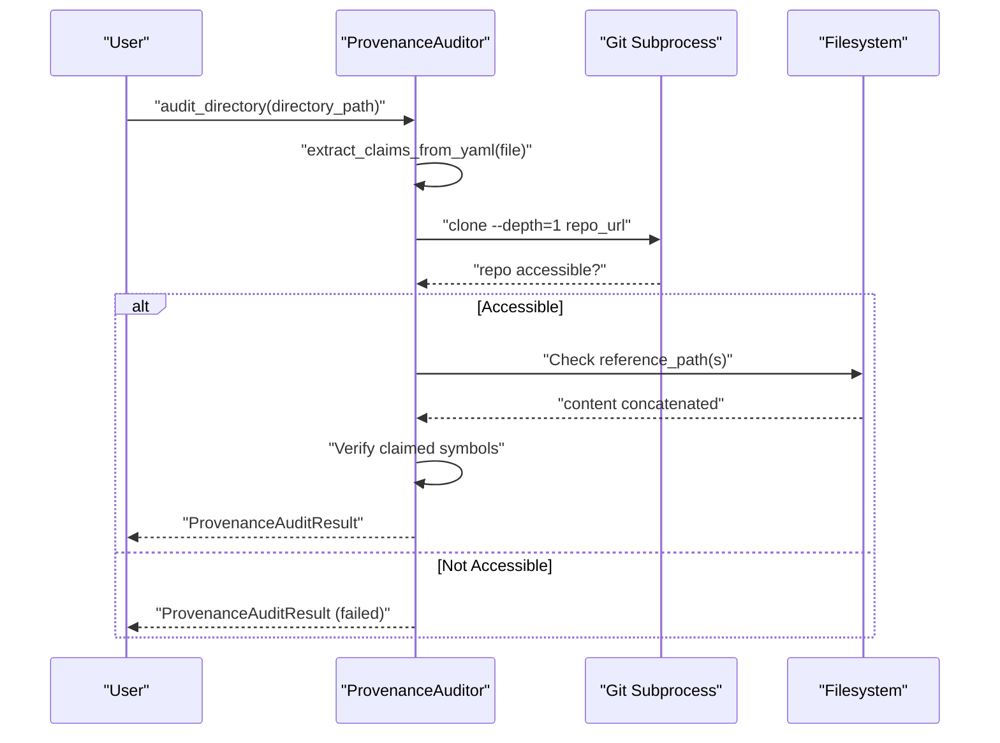
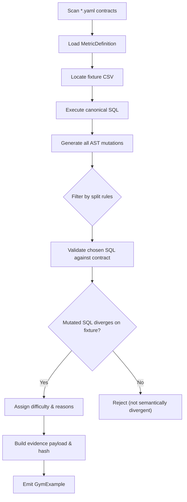
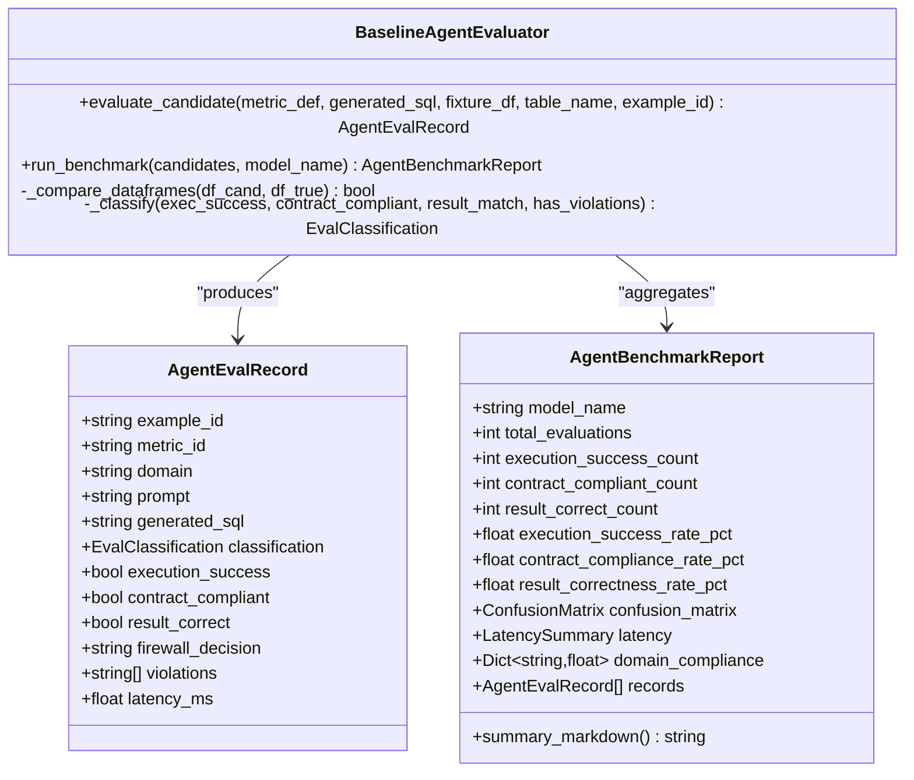
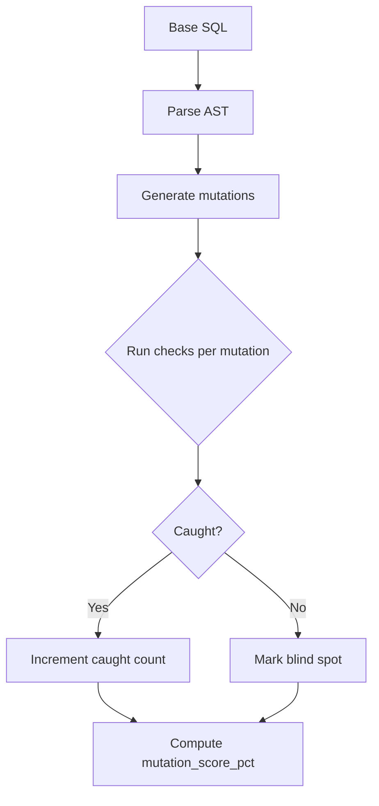
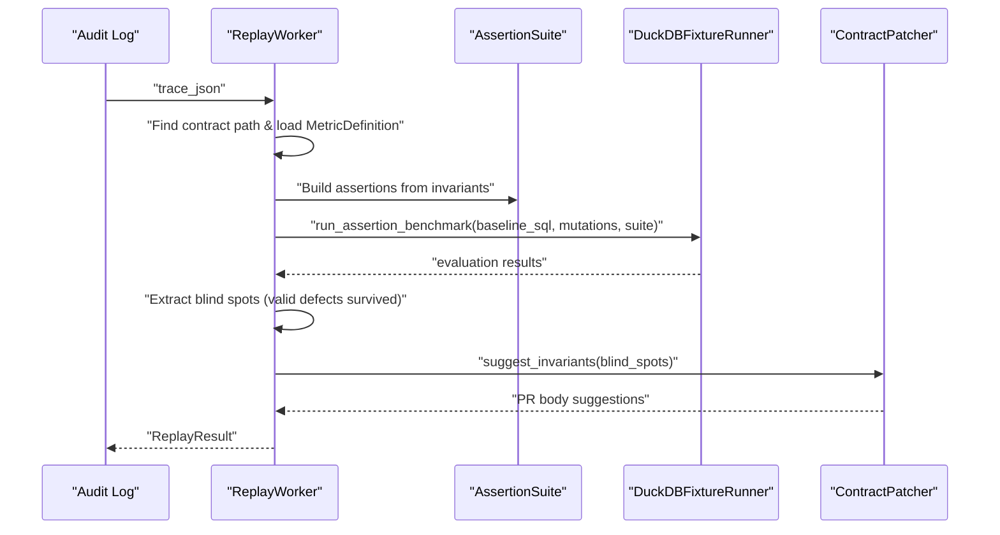
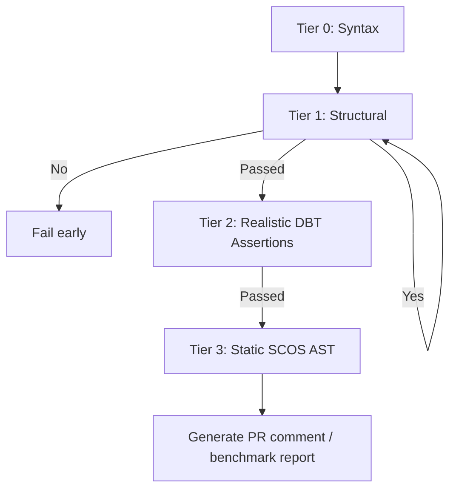
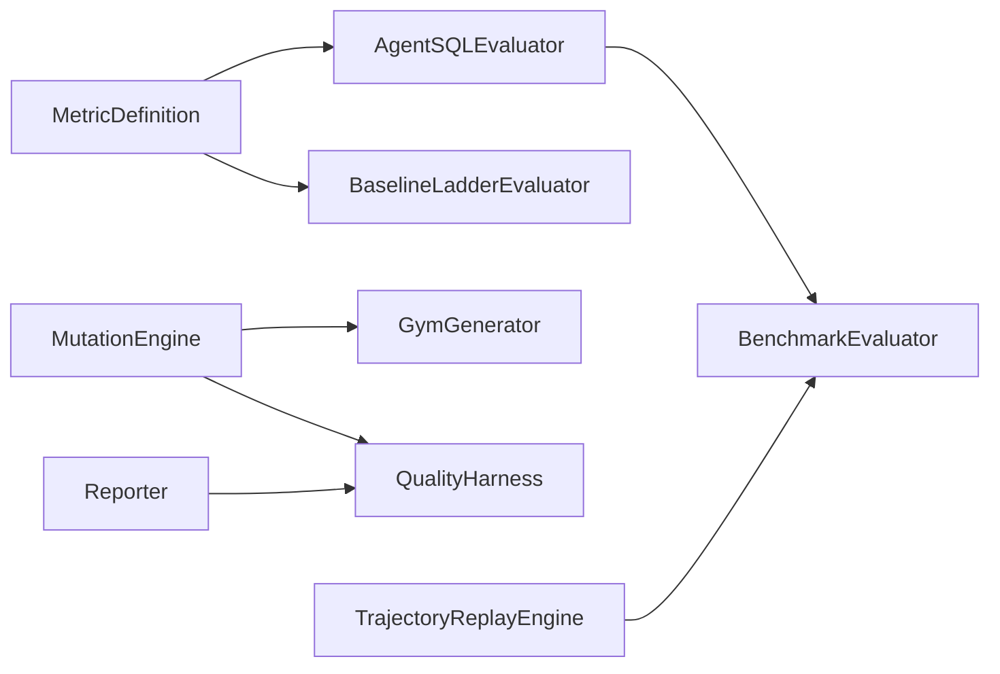

# Agent Evaluation Framework

<cite>
**Referenced Files in This Document**
- [agent_eval.py](file://semantic_reliability/evaluation/agent_eval.py)
- [provenance_auditor.py](file://semantic_reliability/evaluation/provenance_auditor.py)
- [replay.py](file://semantic_reliability/benchmark/replay.py)
- [main.py](file://semantic_reliability/replay/main.py)
- [worker.py](file://semantic_reliability/replay/worker.py)
- [evaluator.py](file://semantic_reliability/gym/evaluator.py)
- [generator.py](file://semantic_reliability/gym/generator.py)
- [quality_harness.py](file://semantic_reliability/harness/quality_harness.py)
- [engine.py](file://semantic_reliability/testing/mutations/engine.py)
- [schema.py](file://semantic_reliability/compiler/schema.py)
- [baseline_ladder.py](file://semantic_reliability/harness/baseline_ladder.py)
- [reporter.py](file://semantic_reliability/harness/reporter.py)
- [ci.yml](file://.github/workflows/ci.yml)
- [README.md](file://README.md)
</cite>

## Table of Contents
1. Introduction
2. Project Structure
3. Core Components
4. Architecture Overview
5. Detailed Component Analysis
6. Dependency Analysis
7. Performance Considerations
8. Troubleshooting Guide
9. Conclusion
10. Appendices

## Introduction
This document explains the AI agent evaluation framework for semantic reliability of Text-to-SQL agents. It covers:
- Trajectory replay to analyze and re-evaluate agent behavior sequences against updated contracts
- Provenance auditing to mechanically verify external sourcing claims and prevent fabricated references
- Automated test generation via mutation-based semantic gym datasets
- Evaluation metrics, scoring methodologies, and benchmark comparison tools
- Setup procedures for different scenarios, custom metric definitions, and result interpretation guidelines
- Performance optimization for large-scale evaluations and CI/CD integration

The framework enforces business-semantic correctness by validating generated SQL against declarative SCOS contracts, executing against fixtures, and comparing results to ground-truth baselines.

**Section sources**
- [README.md:14-46](file://README.md#L14-L46)

## Project Structure
The evaluation framework is organized into focused modules:
- Evaluation: agent SQL validation and provenance auditing
- Benchmark: trajectory replay and scorecard computation
- Gym: automated preference dataset generation with mutations
- Harness: quality harness, baseline ladder, reporting
- Compiler: metric contract schema and coverage
- Testing: AST-level mutation engine
- CLI and CI: entry points and continuous integration

**Diagram sources**
- [agent_eval.py:35-134](file://semantic_reliability/evaluation/agent_eval.py#L35-L134)
- [provenance_auditor.py:38-195](file://semantic_reliability/evaluation/provenance_auditor.py#L38-L195)
- [replay.py:56-126](file://semantic_reliability/benchmark/replay.py#L56-L126)
- [evaluator.py:113-294](file://semantic_reliability/gym/evaluator.py#L113-L294)
- [generator.py:26-206](file://semantic_reliability/gym/generator.py#L26-L206)
- [quality_harness.py:34-113](file://semantic_reliability/harness/quality_harness.py#L34-L113)
- [engine.py:8-52](file://semantic_reliability/testing/mutations/engine.py#L8-L52)
- [schema.py:83-98](file://semantic_reliability/compiler/schema.py#L83-L98)
- [baseline_ladder.py:25-210](file://semantic_reliability/harness/baseline_ladder.py#L25-L210)
- [reporter.py:8-129](file://semantic_reliability/harness/reporter.py#L8-L129)

**Section sources**
- [README.md:22-46](file://README.md#L22-L46)

## Core Components
- AgentSQL evaluator validates syntax, contract invariants, executes against fixtures, and classifies semantic risk and verdicts
- Provenance auditor extracts and verifies external repository claims, ensuring symbols exist in upstream code
- Trajectory replay engine loads recorded trajectories, re-evaluates against active contracts, and computes scorecards
- Baseline agent evaluator runs structured benchmarks with confusion matrix and latency summaries
- Mutation engine injects precise AST-level logical mutations to stress-test assertions and contracts
- Quality harness measures mutation catch rates and reports blind spots
- Baseline ladder evaluates queries across progressive tiers from syntax to static SCOS AST checks
- Reporter generates human-readable PR comments and benchmark reports

**Section sources**
- [agent_eval.py:35-134](file://semantic_reliability/evaluation/agent_eval.py#L35-L134)
- [provenance_auditor.py:38-195](file://semantic_reliability/evaluation/provenance_auditor.py#L38-L195)
- [replay.py:56-126](file://semantic_reliability/benchmark/replay.py#L56-L126)
- [evaluator.py:113-294](file://semantic_reliability/gym/evaluator.py#L113-L294)
- [engine.py:8-52](file://semantic_reliability/testing/mutations/engine.py#L8-L52)
- [quality_harness.py:34-113](file://semantic_reliability/harness/quality_harness.py#L34-L113)
- [baseline_ladder.py:25-210](file://semantic_reliability/harness/baseline_ladder.py#L25-L210)
- [reporter.py:8-129](file://semantic_reliability/harness/reporter.py#L8-L129)

## Architecture Overview
The evaluation pipeline integrates contract-aware validation, execution, and result comparison with provenance verification and replay capabilities.

**Diagram sources**
- [agent_eval.py:35-134](file://semantic_reliability/evaluation/agent_eval.py#L35-L134)
- [replay.py:56-126](file://semantic_reliability/benchmark/replay.py#L56-L126)
- [evaluator.py:113-294](file://semantic_reliability/gym/evaluator.py#L113-L294)

## Detailed Component Analysis

### Trajectory Replay Engine
- Loads JSONL trajectories and optional raw SQL artifacts
- Replays each trajectory against the active contract registry using an oracle validator
- Computes a scorecard comparing blind vs governed trajectories, including semantic lift and net governance benefit

**Diagram sources**
- [replay.py:16-126](file://semantic_reliability/benchmark/replay.py#L16-L126)

**Section sources**
- [replay.py:56-126](file://semantic_reliability/benchmark/replay.py#L56-L126)

### Provenance Auditing
- Extracts provenance claims from YAML headers or structured metadata
- Clones upstream repositories (shallow clone) and verifies referenced files and symbols
- Returns audit results indicating passed/failed status with reasons

**Diagram sources**
- [provenance_auditor.py:41-195](file://semantic_reliability/evaluation/provenance_auditor.py#L41-L195)

**Section sources**
- [provenance_auditor.py:38-195](file://semantic_reliability/evaluation/provenance_auditor.py#L38-L195)

### Automated Test Generation (Semantic Gym)
- Scans corpus YAML contracts and associated fixtures
- Generates mutation pairs (chosen vs rejected) with strict scientific gates
- Validates chosen SQL against its own contract and ensures divergence on fixtures
- Produces preference dataset entries with difficulty assignment and evidence hashes

**Diagram sources**
- [generator.py:26-206](file://semantic_reliability/gym/generator.py#L26-L206)

**Section sources**
- [generator.py:26-206](file://semantic_reliability/gym/generator.py#L26-L206)

### Baseline Agent Evaluator and Metrics
- Runs structured evaluations per example, classifying outcomes into a formal taxonomy
- Compares candidate SQL results to ground-truth baselines with order-insensitive, numeric-tolerant comparison
- Aggregates confusion matrix, latency percentiles, domain compliance, and markdown report

**Diagram sources**
- [evaluator.py:113-294](file://semantic_reliability/gym/evaluator.py#L113-L294)

**Section sources**
- [evaluator.py:113-294](file://semantic_reliability/gym/evaluator.py#L113-L294)

### Mutation Engine and Quality Harness
- Injects precise AST-level mutations targeting filters, boundaries, aggregations, joins, grain, null safety, and arithmetic
- Quality harness simulates or executes standard data quality checks against mutated SQL to compute mutation catch scores and identify blind spots

**Diagram sources**
- [engine.py:8-52](file://semantic_reliability/testing/mutations/engine.py#L8-L52)
- [quality_harness.py:34-113](file://semantic_reliability/harness/quality_harness.py#L34-L113)

**Section sources**
- [engine.py:8-52](file://semantic_reliability/testing/mutations/engine.py#L8-L52)
- [quality_harness.py:34-113](file://semantic_reliability/harness/quality_harness.py#L34-L113)

### Replay Worker and Contract Patcher
- Consumes firewall audit logs to evaluate mutation adequacy offline
- Builds assertion suites from contracts and detects underspecified contracts via blind spots
- Suggests invariants and generates PR bodies for remediation

**Diagram sources**
- [worker.py:62-168](file://semantic_reliability/replay/worker.py#L62-L168)
- [main.py:11-48](file://semantic_reliability/replay/main.py#L11-L48)

**Section sources**
- [worker.py:62-168](file://semantic_reliability/replay/worker.py#L62-L168)
- [main.py:11-48](file://semantic_reliability/replay/main.py#L11-L48)

### Baseline Ladder and Reporting
- Evaluates candidate SQL through progressive tiers: syntax, structural, realistic dbt assertions, static SCOS AST
- Reporter generates GitHub PR comment markdown highlighting semantic drift and benchmark details

**Diagram sources**
- [baseline_ladder.py:25-210](file://semantic_reliability/harness/baseline_ladder.py#L25-L210)
- [reporter.py:8-129](file://semantic_reliability/harness/reporter.py#L8-L129)

**Section sources**
- [baseline_ladder.py:25-210](file://semantic_reliability/harness/baseline_ladder.py#L25-L210)
- [reporter.py:8-129](file://semantic_reliability/harness/reporter.py#L8-L129)

## Dependency Analysis
Key dependencies and relationships:
- Agent evaluation depends on metric contracts and assertion suites
- Benchmark replay depends on trajectory protocol, oracle validation, and policy-driven scoring
- Gym generator depends on mutation engine and contract validation
- Quality harness depends on mutation engine and simulated or custom test runners
- Baseline ladder depends on contract schema and assertion registry
- Reporter depends on drift and benchmark outputs

**Diagram sources**
- [schema.py:83-98](file://semantic_reliability/compiler/schema.py#L83-L98)
- [agent_eval.py:35-134](file://semantic_reliability/evaluation/agent_eval.py#L35-L134)
- [baseline_ladder.py:25-210](file://semantic_reliability/harness/baseline_ladder.py#L25-L210)
- [engine.py:8-52](file://semantic_reliability/testing/mutations/engine.py#L8-L52)
- [generator.py:26-206](file://semantic_reliability/gym/generator.py#L26-L206)
- [quality_harness.py:34-113](file://semantic_reliability/harness/quality_harness.py#L34-L113)
- [replay.py:56-126](file://semantic_reliability/benchmark/replay.py#L56-L126)
- [evaluator.py:113-294](file://semantic_reliability/gym/evaluator.py#L113-L294)
- [reporter.py:8-129](file://semantic_reliability/harness/reporter.py#L8-L129)

**Section sources**
- [schema.py:83-98](file://semantic_reliability/compiler/schema.py#L83-L98)

## Performance Considerations
- Use in-memory DuckDB connections for fast local evaluation; close connections promptly to free resources
- Prefer shallow clones for provenance verification to reduce network and disk overhead
- Batch trajectory replay and avoid redundant parsing by caching parsed ASTs where possible
- Limit fixture sizes and use representative samples for large-scale evaluations
- Use split rules in gym generation to control mutation scope and reduce computational cost
- Leverage percentile latency metrics to monitor performance regressions in CI

[No sources needed since this section provides general guidance]

## Troubleshooting Guide
Common issues and resolutions:
- Syntax errors in generated SQL: ensure dialect-specific parsing and validate before execution
- Execution failures during replay: confirm raw SQL artifacts are present when required
- Missing upstream symbols in provenance audits: verify reference paths and repository accessibility
- Underspecified contracts detected in replay worker: add required invariants based on suggested blind spots
- Low mutation catch rates: augment assertion suites with semantic value assertions and population filters

**Section sources**
- [agent_eval.py:54-98](file://semantic_reliability/evaluation/agent_eval.py#L54-L98)
- [replay.py:91-111](file://semantic_reliability/benchmark/replay.py#L91-L111)
- [provenance_auditor.py:101-195](file://semantic_reliability/evaluation/provenance_auditor.py#L101-L195)
- [worker.py:119-159](file://semantic_reliability/replay/worker.py#L119-L159)

## Conclusion
The framework provides robust mechanisms for evaluating AI-generated SQL against business semantics, replaying agent trajectories, auditing provenance, and generating automated tests. It supports comprehensive metrics, scoring, and reporting suitable for both research and production environments. Integrating these components into CI/CD enables continuous validation and improvement of agent reliability.

[No sources needed since this section summarizes without analyzing specific files]

## Appendices

### Setup Procedures
- Install dependencies and run unit tests to verify environment readiness
- Execute dual-track benchmark and protocol verifier in CI to produce scorecards
- Run live agent benchmark with mock provider to generate trajectories for replay
- Perform zero-compute offline trajectory replay against updated contracts

**Section sources**
- [ci.yml:32-49](file://.github/workflows/ci.yml#L32-L49)
- [README.md:105-112](file://README.md#L105-L112)

### Custom Metric Definitions
- Define MetricDefinition with metric identifier, description, owner, grain, canonical SQL, dialect, tags, dimensions, invariants, probes, and provenance
- Use SemanticInvariants to enforce population, grain, aggregation, units, and time constraints
- Add ContractProvenance to link to upstream repositories and verified symbols

**Section sources**
- [schema.py:5-98](file://semantic_reliability/compiler/schema.py#L5-L98)

### Result Interpretation Guidelines
- Execution success rate indicates syntactic validity and executability
- Contract compliance rate reflects adherence to declared business invariants
- Result correctness rate measures output fidelity against ground-truth baselines
- Confusion matrix categorizes outcomes into compliant/violation vs match/mismatch
- Latency percentiles provide performance insights for tail latencies
- Semantic lift and net governance benefit quantify improvements from governed vs blind approaches

**Section sources**
- [evaluator.py:57-110](file://semantic_reliability/gym/evaluator.py#L57-L110)
- [evaluator.py:13-79](file://semantic_reliability/benchmark/evaluator.py#L13-L79)