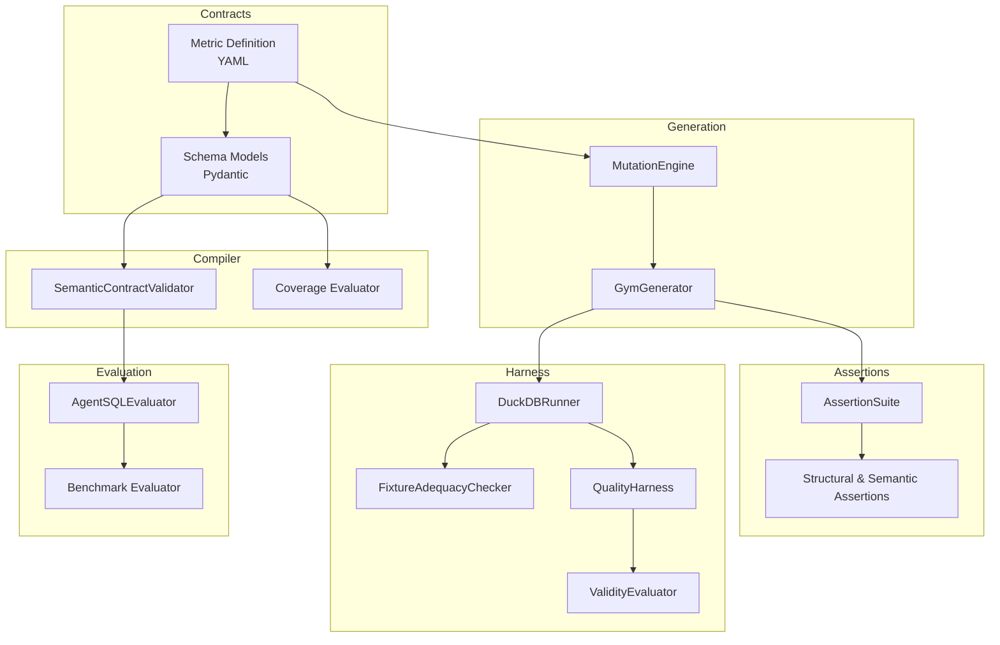
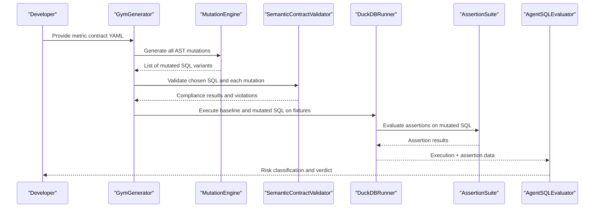
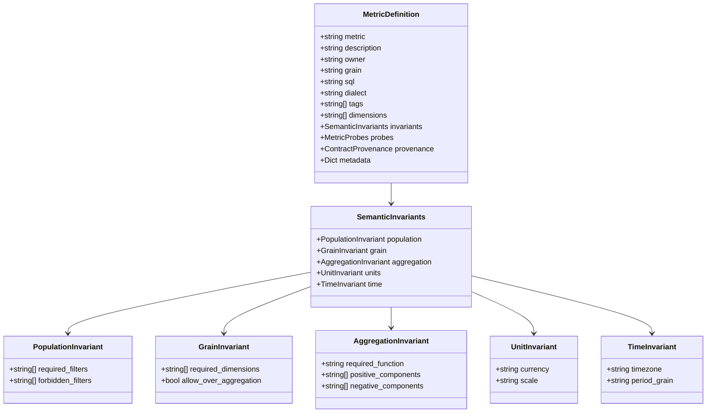
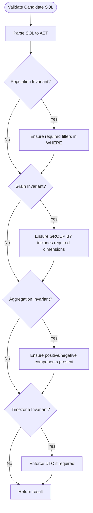
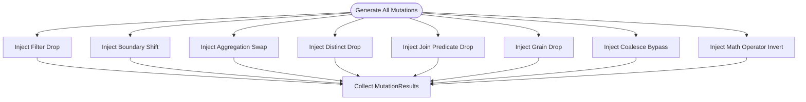
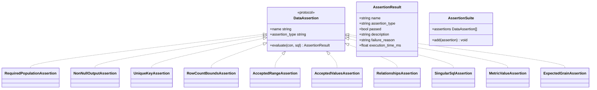
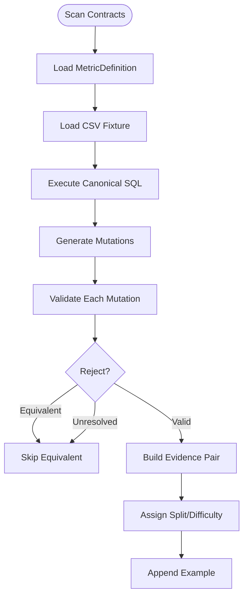
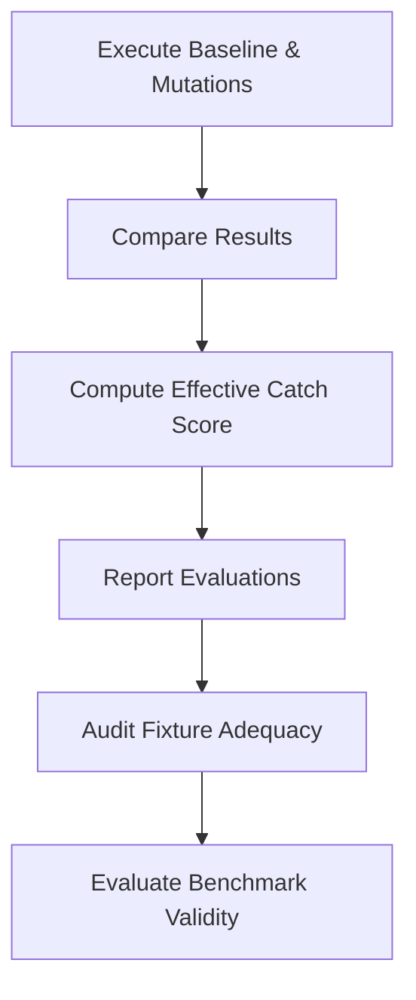
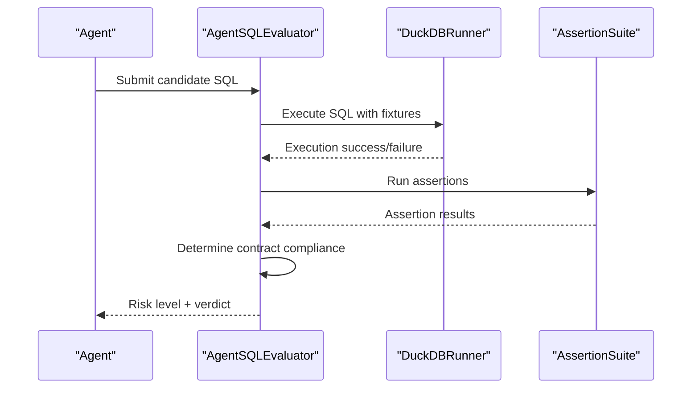
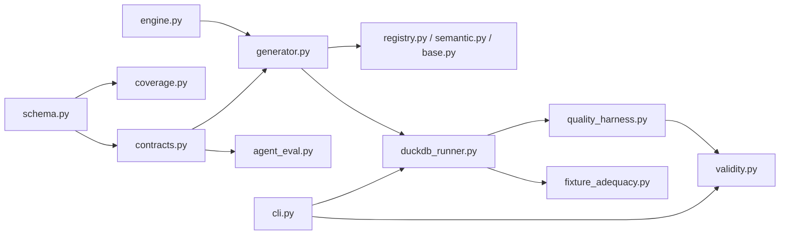

# Automated Test Generation

<cite>
**Referenced Files in This Document**
- [README.md](file://README.md)
- [contract.yaml (net_revenue)](file://benchmark_corpus/dev/net_revenue/contract.yaml)
- [schema.py](file://semantic_reliability/compiler/schema.py)
- [contracts.py](file://semantic_reliability/compiler/contracts.py)
- [coverage.py](file://semantic_reliability/compiler/coverage.py)
- [engine.py](file://semantic_reliability/testing/mutations/engine.py)
- [base.py](file://semantic_reliability/assertions/base.py)
- [registry.py](file://semantic_reliability/assertions/registry.py)
- [semantic.py](file://semantic_reliability/assertions/semantic.py)
- [generator.py](file://semantic_reliability/gym/generator.py)
- [evaluator.py](file://semantic_reliability/gym/evaluator.py)
- [duckdb_runner.py](file://semantic_reliability/harness/duckdb_runner.py)
- [quality_harness.py](file://semantic_reliability/harness/quality_harness.py)
- [fixture_adequacy.py](file://semantic_reliability/harness/fixture_adequacy.py)
- [validity.py](file://semantic_reliability/harness/validity.py)
- [agent_eval.py](file://semantic_reliability/evaluation/agent_eval.py)
- [cli.py](file://semantic_reliability/cli.py)
- [test_agent_eval.py](file://tests/test_agent_eval.py)
- [test_benchmark_validity.py](file://tests/test_benchmark_validity.py)
</cite>

## Table of Contents
1. Introduction
2. Project Structure
3. Core Components
4. Architecture Overview
5. Detailed Component Analysis
6. Dependency Analysis
7. Performance Considerations
8. Troubleshooting Guide
9. Conclusion
10. Appendices

## Introduction
This document explains how to generate comprehensive, automated test suites for validating AI agents that produce SQL from business contracts. It covers:
- Deriving tests from SCOS-style metric contracts with explicit semantic invariants
- Generating edge cases and boundary conditions via AST-level mutations
- Defining assertion strategies and coverage metrics
- Validating agent responses against expected outcomes
- Maintaining test suites as contracts evolve
- Customizing domain-specific testing requirements

The system uses deterministic contract validation and mutation-based generation to ensure tests remain grounded in business semantics rather than purely structural checks.

**Section sources**
- [README.md:14-45](file://README.md#L14-L45)

## Project Structure
At a high level, the repository provides:
- Contract definitions in YAML under benchmark corpus directories
- A compiler layer that parses and validates contracts and their invariants
- A mutation engine that generates realistic semantic defects
- An assertions framework to validate outputs structurally and semantically
- A gym generator that produces preference pairs and evidence-backed examples
- A harness that runs fixtures, measures adequacy, and computes catch scores
- Evaluation utilities to classify agent behavior and compute validity

**Diagram sources**
- [schema.py:83-97](file://semantic_reliability/compiler/schema.py#L83-L97)
- [contracts.py:26-134](file://semantic_reliability/compiler/contracts.py#L26-L134)
- [engine.py:8-52](file://semantic_reliability/testing/mutations/engine.py#L8-L52)
- [generator.py:26-202](file://semantic_reliability/gym/generator.py#L26-L202)
- [registry.py:70-93](file://semantic_reliability/assertions/registry.py#L70-L93)
- [duckdb_runner.py:239-255](file://semantic_reliability/harness/duckdb_runner.py#L239-L255)
- [quality_harness.py:34-113](file://semantic_reliability/harness/quality_harness.py#L34-L113)
- [fixture_adequacy.py:24-153](file://semantic_reliability/harness/fixture_adequacy.py#L24-L153)
- [validity.py:47-89](file://semantic_reliability/harness/validity.py#L47-L89)
- [agent_eval.py:89-114](file://semantic_reliability/evaluation/agent_eval.py#L89-L114)

**Section sources**
- [README.md:22-45](file://README.md#L22-L45)

## Core Components
- MetricDefinition and SemanticInvariants define the canonical SQL and business rules (population filters, grain dimensions, aggregation components, units, time).
- SemanticContractValidator enforces these invariants on candidate SQL using AST analysis.
- MutationEngine injects precise AST-level changes to simulate common semantic defects (filter drops, boundary shifts, aggregation swaps, join predicate drops, grain drops, coalesce bypasses, math operator inversions).
- AssertionSuite composes structural and semantic assertions to detect defects at runtime.
- GymGenerator builds preference datasets by pairing canonical SQL with mutated variants, filtering out equivalent or ungrounded cases.
- DuckDBRunner executes fixtures and mutations, computing effective catch scores and detailed evaluations.
- FixtureAdequacyChecker audits fixture datasets to ensure they can expose mutations.
- QualityHarness simulates or evaluates standard vs semantic checks to quantify blind spots.
- AgentSQLEvaluator classifies agent outputs into risk levels and verdicts based on execution success, contract compliance, and assertion results.
- BenchmarkValidityEvaluator applies policy thresholds to determine confidence and validity of benchmark results.

**Section sources**
- [schema.py:5-37](file://semantic_reliability/compiler/schema.py#L5-L37)
- [contracts.py:26-134](file://semantic_reliability/compiler/contracts.py#L26-L134)
- [engine.py:8-52](file://semantic_reliability/testing/mutations/engine.py#L8-L52)
- [registry.py:70-93](file://semantic_reliability/assertions/registry.py#L70-L93)
- [generator.py:26-202](file://semantic_reliability/gym/generator.py#L26-L202)
- [duckdb_runner.py:239-255](file://semantic_reliability/harness/duckdb_runner.py#L239-L255)
- [fixture_adequacy.py:24-153](file://semantic_reliability/harness/fixture_adequacy.py#L24-L153)
- [quality_harness.py:34-113](file://semantic_reliability/harness/quality_harness.py#L34-L113)
- [agent_eval.py:89-114](file://semantic_reliability/evaluation/agent_eval.py#L89-L114)
- [validity.py:47-89](file://semantic_reliability/harness/validity.py#L47-L89)

## Architecture Overview
The automated test generation pipeline transforms business contracts into executable, mutation-driven test suites and evaluates agent-generated SQL against them.

**Diagram sources**
- [generator.py:26-202](file://semantic_reliability/gym/generator.py#L26-L202)
- [engine.py:8-52](file://semantic_reliability/testing/mutations/engine.py#L8-L52)
- [contracts.py:26-134](file://semantic_reliability/compiler/contracts.py#L26-L134)
- [duckdb_runner.py:239-255](file://semantic_reliability/harness/duckdb_runner.py#L239-L255)
- [registry.py:70-93](file://semantic_reliability/assertions/registry.py#L70-L93)
- [agent_eval.py:89-114](file://semantic_reliability/evaluation/agent_eval.py#L89-L114)

## Detailed Component Analysis

### Contract Model and Invariants
- MetricDefinition encapsulates the canonical SQL, owner, grain, dialect, tags, dimensions, and optional probes/provenance metadata.
- SemanticInvariants declare population filters/dimensions, aggregation components, units, and time constraints.
- Coverage evaluator maps metric categories to required invariant dimensions to ensure contracts are sufficiently expressive.

**Diagram sources**
- [schema.py:5-37](file://semantic_reliability/compiler/schema.py#L5-L37)
- [schema.py:83-97](file://semantic_reliability/compiler/schema.py#L83-L97)

**Section sources**
- [schema.py:5-37](file://semantic_reliability/compiler/schema.py#L5-L37)
- [schema.py:83-97](file://semantic_reliability/compiler/schema.py#L83-L97)
- [coverage.py:71-102](file://semantic_reliability/compiler/coverage.py#L71-L102)

### Contract Validation
- SemanticContractValidator parses candidate SQL into an AST and checks:
  - Population invariants: presence of required filters in WHERE
  - Grain invariants: required grouping dimensions present
  - Aggregation invariants: inclusion of positive/negative components
  - Timezone invariants: enforce UTC when specified
- Returns structured violation details with severity and remediation guidance.

**Diagram sources**
- [contracts.py:26-134](file://semantic_reliability/compiler/contracts.py#L26-L134)

**Section sources**
- [contracts.py:26-134](file://semantic_reliability/compiler/contracts.py#L26-L134)

### Mutation-Based Test Generation
- MutationEngine performs AST-level injections to simulate realistic semantic defects:
  - Filter drop (remove conjunct or entire WHERE)
  - Boundary shift (> to >=, < to <=, = to !=)
  - Aggregation swap (SUM <-> AVG <-> COUNT)
  - Distinct drop (COUNT(DISTINCT) -> COUNT)
  - Join predicate drop (ON condition removed)
  - Grain drop (remove dimension from GROUP BY)
  - Coalesce bypass (remove default fallback)
  - Math operator invert (+ <-> -)
- These mutations form the basis of edge cases and boundary conditions for testing.

**Diagram sources**
- [engine.py:8-52](file://semantic_reliability/testing/mutations/engine.py#L8-L52)
- [engine.py:54-269](file://semantic_reliability/testing/mutations/engine.py#L54-L269)

**Section sources**
- [engine.py:8-52](file://semantic_reliability/testing/mutations/engine.py#L8-L52)
- [engine.py:54-269](file://semantic_reliability/testing/mutations/engine.py#L54-L269)

### Assertion Strategies
- AssertionResult defines standardized outcomes including pass/fail, failure reason, and execution time.
- AssertionSuite composes multiple assertions:
  - Structural: non-null output, unique keys, row count bounds, accepted ranges/values, relationships, singular SQL tests
  - Semantic: required population filters, metric value expectations, expected grain
- The registry allows building suites declaratively from configuration.

**Diagram sources**
- [base.py:6-25](file://semantic_reliability/assertions/base.py#L6-L25)
- [registry.py:70-93](file://semantic_reliability/assertions/registry.py#L70-L93)
- [semantic.py:8-36](file://semantic_reliability/assertions/semantic.py#L8-L36)

**Section sources**
- [base.py:6-25](file://semantic_reliability/assertions/base.py#L6-L25)
- [registry.py:70-93](file://semantic_reliability/assertions/registry.py#L70-L93)
- [semantic.py:8-36](file://semantic_reliability/assertions/semantic.py#L8-L36)

### Gym Generator and Evidence Pairs
- GymGenerator scans contract YAMLs, loads fixtures, validates canonical SQL, generates mutations, and constructs preference pairs with evidence.
- Rejection logic ensures only meaningful, contract-grounded divergences are included; equivalent-on-fixture or unresolvable preferences are excluded.
- Difficulty assignment and split rules help organize train/validation/holdout sets.

**Diagram sources**
- [generator.py:26-202](file://semantic_reliability/gym/generator.py#L26-L202)
- [split.py:1-20](file://semantic_reliability/gym/split.py#L1-L20)

**Section sources**
- [generator.py:26-202](file://semantic_reliability/gym/generator.py#L26-L202)
- [split.py:1-20](file://semantic_reliability/gym/split.py#L1-L20)

### Execution and Metrics
- DuckDBRunner executes baseline and mutated SQL against fixtures, computes variance, and reports effective catch scores.
- FixtureAdequacyChecker inspects tables for volume, categorical boundaries, numerical distributions, and multi-row grain multiplicity to ensure fixtures can expose mutations.
- QualityHarness simulates or evaluates standard vs semantic checks to identify blind spots and compute mutation scores.
- ValidityEvaluator applies policy thresholds to assess confidence and validity of benchmark outcomes.

**Diagram sources**
- [duckdb_runner.py:239-255](file://semantic_reliability/harness/duckdb_runner.py#L239-L255)
- [fixture_adequacy.py:24-153](file://semantic_reliability/harness/fixture_adequacy.py#L24-L153)
- [quality_harness.py:34-113](file://semantic_reliability/harness/quality_harness.py#L34-L113)
- [validity.py:47-89](file://semantic_reliability/harness/validity.py#L47-L89)

**Section sources**
- [duckdb_runner.py:239-255](file://semantic_reliability/harness/duckdb_runner.py#L239-L255)
- [fixture_adequacy.py:24-153](file://semantic_reliability/harness/fixture_adequacy.py#L24-L153)
- [quality_harness.py:34-113](file://semantic_reliability/harness/quality_harness.py#L34-L113)
- [validity.py:47-89](file://semantic_reliability/harness/validity.py#L47-L89)

### Agent Response Validation
- AgentSQLEvaluator executes candidate SQL, runs assertions, determines contract compliance, and assigns semantic risk and verdicts.
- Verdicts include acceptance for compliant outputs and rejection for execution failures or detected semantic defects.

**Diagram sources**
- [agent_eval.py:89-114](file://semantic_reliability/evaluation/agent_eval.py#L89-L114)

**Section sources**
- [agent_eval.py:89-114](file://semantic_reliability/evaluation/agent_eval.py#L89-L114)

## Dependency Analysis
The following diagram shows key dependencies between modules involved in automated test generation and evaluation.

**Diagram sources**
- [schema.py:83-97](file://semantic_reliability/compiler/schema.py#L83-L97)
- [contracts.py:26-134](file://semantic_reliability/compiler/contracts.py#L26-L134)
- [coverage.py:71-102](file://semantic_reliability/compiler/coverage.py#L71-L102)
- [engine.py:8-52](file://semantic_reliability/testing/mutations/engine.py#L8-L52)
- [generator.py:26-202](file://semantic_reliability/gym/generator.py#L26-L202)
- [registry.py:70-93](file://semantic_reliability/assertions/registry.py#L70-L93)
- [semantic.py:8-36](file://semantic_reliability/assertions/semantic.py#L8-L36)
- [base.py:6-25](file://semantic_reliability/assertions/base.py#L6-L25)
- [duckdb_runner.py:239-255](file://semantic_reliability/harness/duckdb_runner.py#L239-L255)
- [quality_harness.py:34-113](file://semantic_reliability/harness/quality_harness.py#L34-L113)
- [fixture_adequacy.py:24-153](file://semantic_reliability/harness/fixture_adequacy.py#L24-L153)
- [validity.py:47-89](file://semantic_reliability/harness/validity.py#L47-L89)
- [agent_eval.py:89-114](file://semantic_reliability/evaluation/agent_eval.py#L89-L114)
- [cli.py:240-426](file://semantic_reliability/cli.py#L240-L426)

**Section sources**
- [cli.py:240-426](file://semantic_reliability/cli.py#L240-L426)

## Performance Considerations
- Use in-memory DuckDB connections for fast fixture execution during generation and evaluation.
- Limit mutation scope to relevant AST nodes to reduce overhead.
- Filter out equivalent mutations early to avoid unnecessary execution.
- Ensure fixtures have sufficient diversity to expose mutations without excessive rows.
- Batch assertion evaluations per candidate SQL to minimize database round-trips.

[No sources needed since this section provides general guidance]

## Troubleshooting Guide
Common issues and resolutions:
- Execution failures: If candidate SQL fails to execute, the evaluator marks it CRITICAL and rejects execution. Inspect syntax and dialect compatibility.
- Silent semantic breaches: When contract is violated but assertions do not catch it, mark HIGH risk and add targeted assertions to cover the gap.
- Equivalent mutations: If mutations produce identical results on fixtures, expand fixture diversity or adjust assertions to differentiate outcomes.
- Low fixture adequacy: Improve fixture coverage across status values, categorical boundaries, numerical distributions, and multi-row grain multiplicity.
- Invalid benchmark validity: Increase fixture adequacy and contract coverage to meet policy thresholds for conclusive results.

**Section sources**
- [agent_eval.py:89-114](file://semantic_reliability/evaluation/agent_eval.py#L89-L114)
- [fixture_adequacy.py:24-153](file://semantic_reliability/harness/fixture_adequacy.py#L24-L153)
- [validity.py:47-89](file://semantic_reliability/harness/validity.py#L47-L89)

## Conclusion
Automated test generation in this framework converts business contracts into robust, mutation-driven test suites that validate agent-generated SQL against explicit semantic invariants. By combining AST-based validation, targeted mutations, and layered assertions, teams can detect subtle semantic drift, maintain test suites as contracts evolve, and customize testing for domain-specific requirements. Coverage metrics and validity policies ensure results are scientifically sound and actionable.

[No sources needed since this section summarizes without analyzing specific files]

## Appendices

### Example Contract Reference
- Net revenue contract demonstrates population filters, aggregation components, grain, and description.

**Section sources**
- [contract.yaml (net_revenue):1-19](file://benchmark_corpus/dev/net_revenue/contract.yaml#L1-L19)

### Test Case Templates
- Use MetricDefinition to define canonical SQL and invariants.
- Compose AssertionSuite with structural and semantic assertions tailored to your domain.
- Leverage GymGenerator to produce preference pairs with evidence hashes for reproducibility.

**Section sources**
- [schema.py:83-97](file://semantic_reliability/compiler/schema.py#L83-L97)
- [registry.py:70-93](file://semantic_reliability/assertions/registry.py#L70-L93)
- [generator.py:26-202](file://semantic_reliability/gym/generator.py#L26-L202)

### Coverage Metrics
- Effective catch score: ratio of detected valid defects to total valid defects.
- Fixture adequacy score: percentage of checks passing to ensure fixtures can expose mutations.
- Validity thresholds: policy-defined minimums for fixture adequacy and contract coverage to achieve conclusive results.

**Section sources**
- [duckdb_runner.py:239-255](file://semantic_reliability/harness/duckdb_runner.py#L239-L255)
- [fixture_adequacy.py:24-153](file://semantic_reliability/harness/fixture_adequacy.py#L24-L153)
- [validity.py:47-89](file://semantic_reliability/harness/validity.py#L47-L89)

### Customization Options
- Domain-specific splits: Assign mutations to train/val/holdout based on mutation type and domain to prevent leakage.
- Custom assertions: Add domain-specific semantic checks via the assertions registry.
- Provenance and tags: Attach provenance metadata and categorization tags to contracts for governance and traceability.

**Section sources**
- [split.py:1-20](file://semantic_reliability/gym/split.py#L1-L20)
- [registry.py:70-93](file://semantic_reliability/assertions/registry.py#L70-L93)
- [schema.py:83-97](file://semantic_reliability/compiler/schema.py#L83-L97)