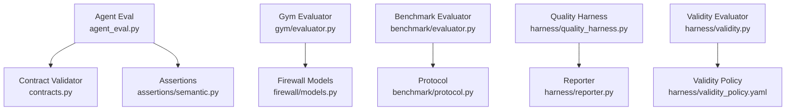
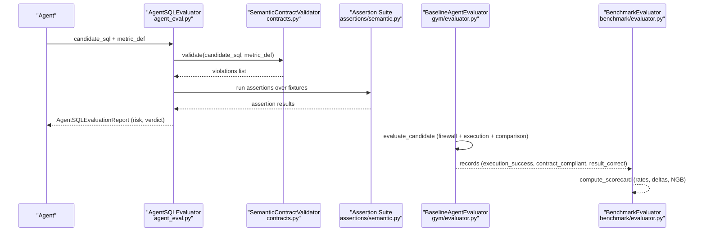
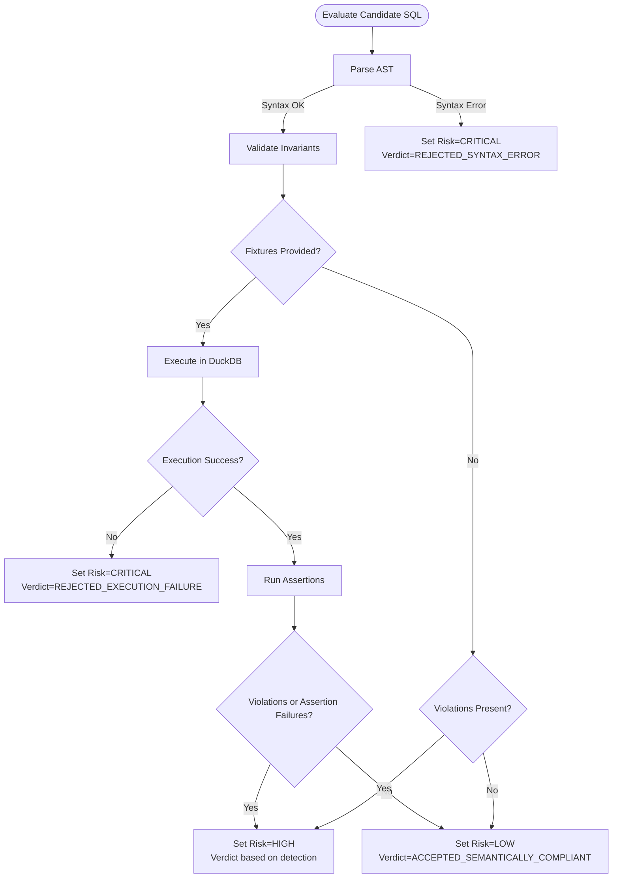
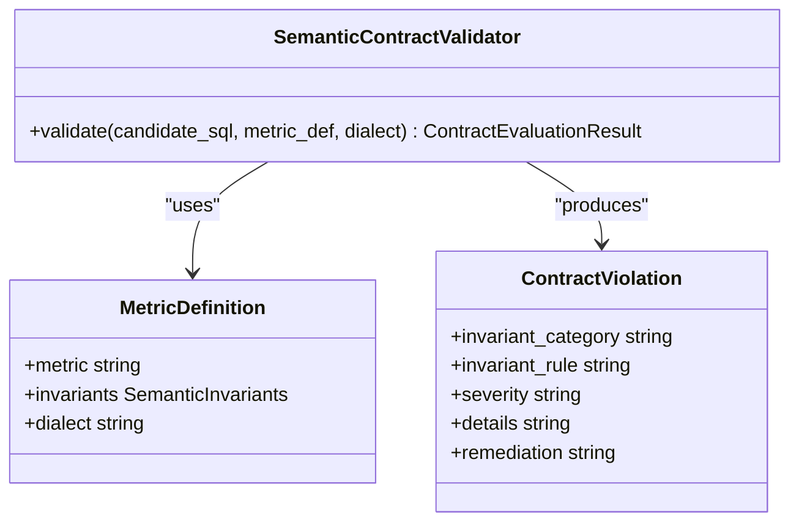
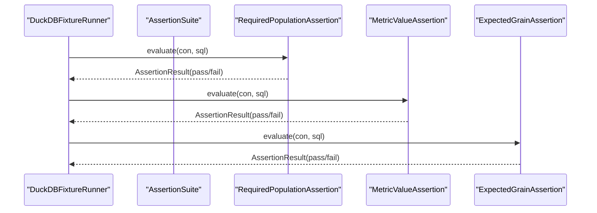
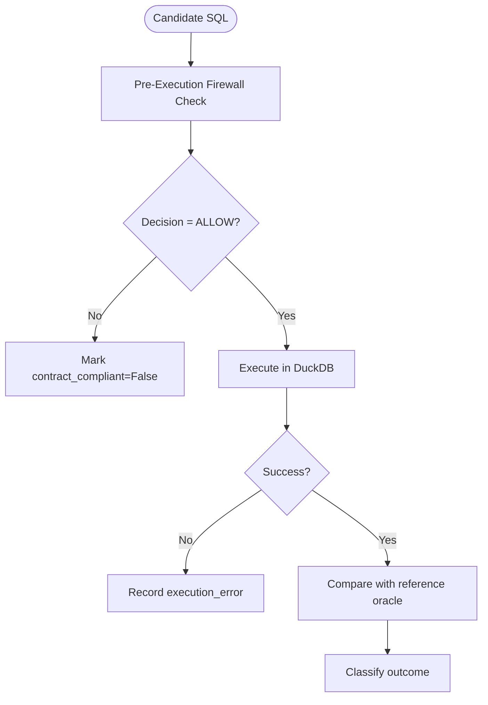
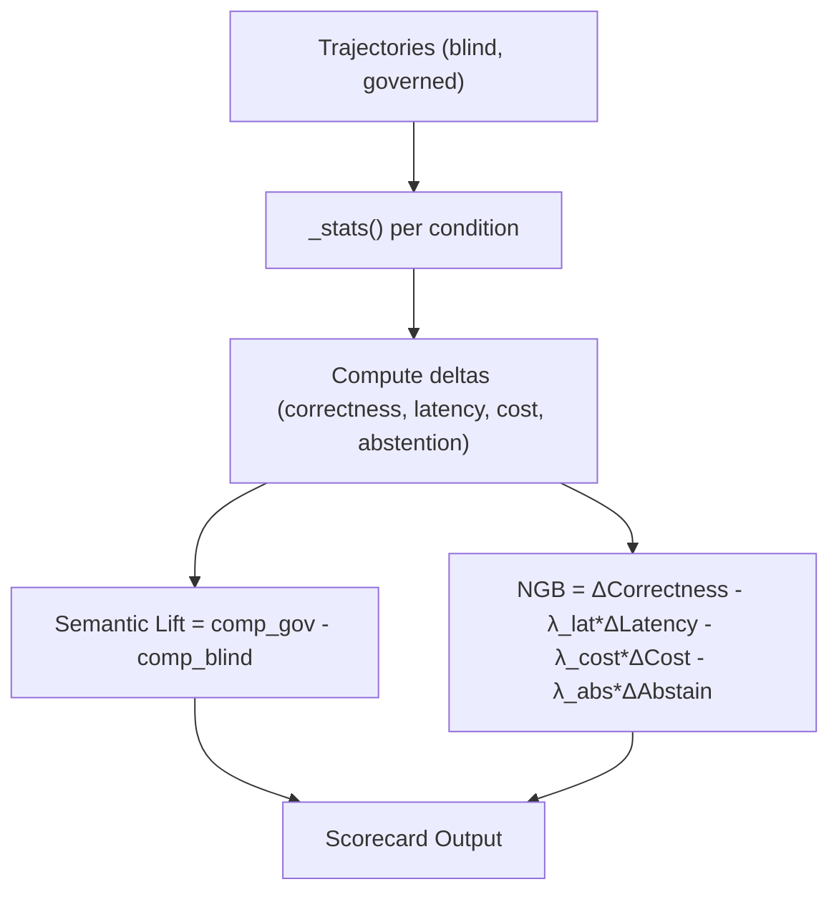
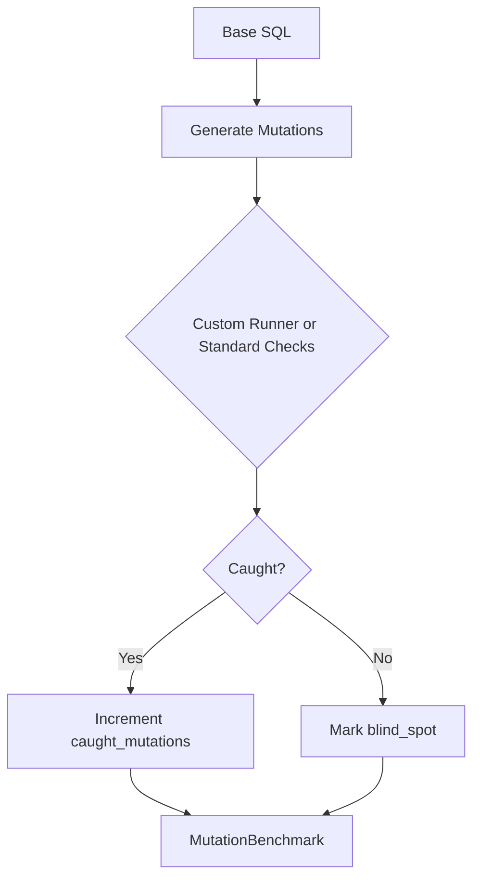
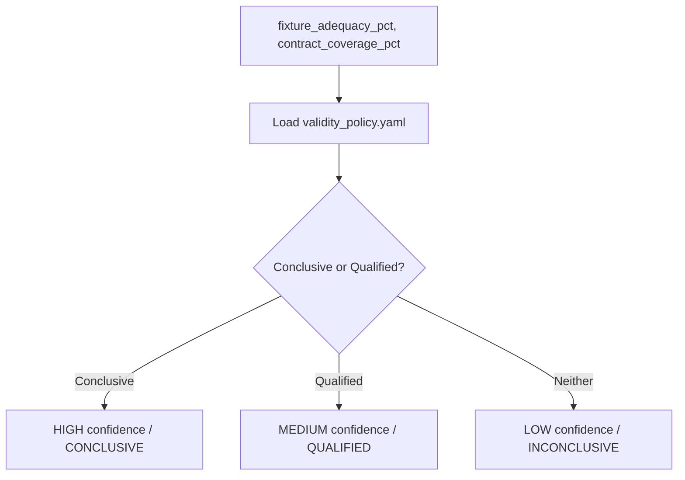
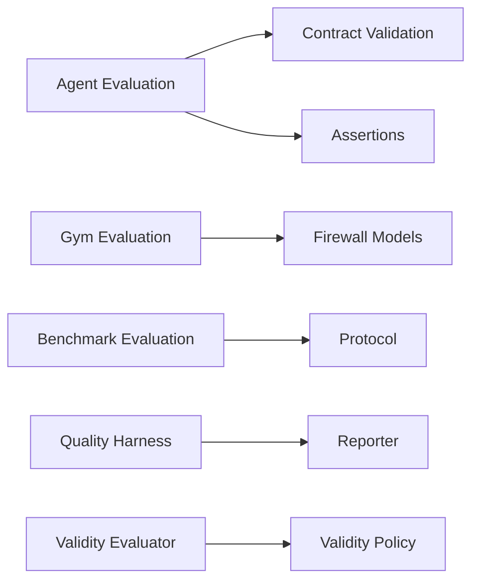

# Evaluation Metrics & Scoring

<cite>
**Referenced Files in This Document**
- [agent_eval.py](file://semantic_reliability/evaluation/agent_eval.py)
- [contracts.py](file://semantic_reliability/compiler/contracts.py)
- [semantic.py](file://semantic_reliability/assertions/semantic.py)
- [evaluator.py](file://semantic_reliability/gym/evaluator.py)
- [protocol.py](file://semantic_reliability/benchmark/protocol.py)
- [evaluator.py](file://semantic_reliability/benchmark/evaluator.py)
- [quality_harness.py](file://semantic_reliability/harness/quality_harness.py)
- [reporter.py](file://semantic_reliability/harness/reporter.py)
- [validity.py](file://semantic_reliability/harness/validity.py)
- [validity_policy.yaml](file://semantic_reliability/harness/validity_policy.yaml)
- [models.py](file://semantic_reliability/firewall/models.py)
</cite>

## Table of Contents
1. Introduction
2. Project Structure
3. Core Components
4. Architecture Overview
5. Detailed Component Analysis
6. Dependency Analysis
7. Performance Considerations
8. Troubleshooting Guide
9. Conclusion
10. Appendices

## Introduction
This document explains the evaluation metrics and scoring methodologies used to assess agent-generated SQL for semantic reliability. It covers:
- Semantic risk levels (CRITICAL, HIGH, MEDIUM, LOW) and how they are assigned
- Verdict classification system for individual evaluations
- Composite scoring algorithms that combine execution success, contract compliance, result correctness, latency, cost, and abstention behavior
- How contract violations, assertion failures, and execution errors contribute to overall quality scores
- How to interpret evaluation reports and compare agent performance across metrics
- Customization of scoring criteria and threshold configurations

## Project Structure
The evaluation pipeline spans several modules:
- Agent-level evaluation with semantic risk and verdicts
- Contract validation against declared invariants
- Assertion-based runtime checks over fixtures
- Benchmark aggregation and composite scoring
- Mutation testing to measure test suite robustness
- Validity policy to certify benchmark confidence

**Diagram sources**
- [agent_eval.py:14-134](file://semantic_reliability/evaluation/agent_eval.py#L14-L134)
- [contracts.py:26-135](file://semantic_reliability/compiler/contracts.py#L26-L135)
- [semantic.py:8-167](file://semantic_reliability/assertions/semantic.py#L8-L167)
- [evaluator.py:113-294](file://semantic_reliability/gym/evaluator.py#L113-L294)
- [models.py:6-51](file://semantic_reliability/firewall/models.py#L6-L51)
- [evaluator.py:7-80](file://semantic_reliability/benchmark/evaluator.py#L7-L80)
- [protocol.py:48-96](file://semantic_reliability/benchmark/protocol.py#L48-L96)
- [quality_harness.py:34-113](file://semantic_reliability/harness/quality_harness.py#L34-L113)
- [reporter.py:8-129](file://semantic_reliability/harness/reporter.py#L8-L129)
- [validity.py:47-127](file://semantic_reliability/harness/validity.py#L47-L127)
- [validity_policy.yaml:1-17](file://semantic_reliability/harness/validity_policy.yaml#L1-L17)

**Section sources**
- [agent_eval.py:14-134](file://semantic_reliability/evaluation/agent_eval.py#L14-L134)
- [evaluator.py:113-294](file://semantic_reliability/gym/evaluator.py#L113-L294)
- [evaluator.py:7-80](file://semantic_reliability/benchmark/evaluator.py#L7-L80)
- [quality_harness.py:34-113](file://semantic_reliability/harness/quality_harness.py#L34-L113)
- [validity.py:47-127](file://semantic_reliability/harness/validity.py#L47-L127)

## Core Components
- Semantic Risk Levels: CRITICAL, HIGH, MEDIUM, LOW are defined and applied during agent evaluation to reflect severity of issues found.
- Verdict Classification: Each evaluation returns a human-readable verdict indicating acceptance or rejection reasons.
- Contract Violations: Detected by validating candidate SQL against declared metric invariants (population, grain, aggregation, timezone).
- Assertion Failures: Runtime checks over fixtures validate population filters, metric values, and reporting grain.
- Execution Errors: Syntax or runtime failures are captured and escalated to high-severity risk.
- Composite Scores: Aggregated at benchmark level using rates, deltas, and weighted penalties to compute Net Governance Benefit.

**Section sources**
- [agent_eval.py:14-134](file://semantic_reliability/evaluation/agent_eval.py#L14-L134)
- [contracts.py:26-135](file://semantic_reliability/compiler/contracts.py#L26-L135)
- [semantic.py:8-167](file://semantic_reliability/assertions/semantic.py#L8-L167)
- [evaluator.py:113-294](file://semantic_reliability/gym/evaluator.py#L113-L294)
- [evaluator.py:7-80](file://semantic_reliability/benchmark/evaluator.py#L7-L80)

## Architecture Overview
End-to-end flow from agent SQL generation to scored report:

**Diagram sources**
- [agent_eval.py:35-134](file://semantic_reliability/evaluation/agent_eval.py#L35-L134)
- [contracts.py:26-135](file://semantic_reliability/compiler/contracts.py#L26-L135)
- [semantic.py:8-167](file://semantic_reliability/assertions/semantic.py#L8-L167)
- [evaluator.py:113-294](file://semantic_reliability/gym/evaluator.py#L113-L294)
- [evaluator.py:7-80](file://semantic_reliability/benchmark/evaluator.py#L7-L80)

## Detailed Component Analysis

### Semantic Risk Levels and Verdicts
- Risk assignment logic:
  - Execution failure with fixtures → CRITICAL
  - Contract violations present (with or without assertion failures) → HIGH
  - No violations and no assertion failures → LOW
  - MEDIUM is available in the enum but not directly assigned in this evaluator; it can be used elsewhere in the system (e.g., firewall risk levels)
- Verdicts:
  - REJECTED_SYNTAX_ERROR: invalid or non-transpilable SQL
  - REJECTED_EXECUTION_FAILURE: runtime error during execution
  - SILENT_SEMANTIC_BREACH_SURVIVED_TESTS: contract breached but assertions did not catch it
  - REJECTED_SEMANTIC_DEFECT_DETECTED: violations or assertion failures detected
  - ACCEPTED_SEMANTICALLY_COMPLIANT: fully compliant

**Diagram sources**
- [agent_eval.py:54-115](file://semantic_reliability/evaluation/agent_eval.py#L54-L115)

**Section sources**
- [agent_eval.py:14-134](file://semantic_reliability/evaluation/agent_eval.py#L14-L134)

### Contract Violations and Invariants
- Population invariant: ensures required business filters are present in WHERE clause
- Grain invariant: ensures required grouping dimensions are included
- Aggregation invariant: ensures positive/negative components are included in net calculations
- Timezone invariant: enforces UTC alignment when required

**Diagram sources**
- [contracts.py:26-135](file://semantic_reliability/compiler/contracts.py#L26-L135)

**Section sources**
- [contracts.py:26-135](file://semantic_reliability/compiler/contracts.py#L26-L135)

### Assertion Failures and Runtime Checks
- RequiredPopulationAssertion: verifies no source records violating business filters leak into output
- MetricValueAssertion: validates aggregate scalar outputs against expected ranges or tolerances
- ExpectedGrainAssertion: ensures strict reporting grain without duplication

**Diagram sources**
- [semantic.py:8-167](file://semantic_reliability/assertions/semantic.py#L8-L167)

**Section sources**
- [semantic.py:8-167](file://semantic_reliability/assertions/semantic.py#L8-L167)

### Execution Errors and Firewall Decisions
- Syntax errors: caught via AST parsing before execution
- Runtime errors: caught during DuckDB execution; recorded as execution failures
- Firewall decision: pre-execution check determines if query is allowed per policy; influences contract_compliant flag

**Diagram sources**
- [evaluator.py:121-177](file://semantic_reliability/gym/evaluator.py#L121-L177)
- [models.py:6-51](file://semantic_reliability/firewall/models.py#L6-L51)

**Section sources**
- [evaluator.py:121-177](file://semantic_reliability/gym/evaluator.py#L121-L177)
- [models.py:6-51](file://semantic_reliability/firewall/models.py#L6-L51)

### Composite Scoring Algorithms
- Rates computed per trajectory set:
  - execution_success_rate
  - contract_compliance_rate
  - result_correctness_rate
  - unsafe_query_rate
  - abstention_rate
  - appropriate_abstention_rate
- Deltas between governed and blind conditions:
  - delta_correctness
  - delta_latency_sec
  - delta_cost
  - delta_inapprop_abstain
- Semantic Lift:
  - difference in contract compliance rate between governed and blind
- Net Governance Benefit (NGB):
  - combines correctness improvement minus weighted penalties for latency, cost, and inappropriate abstentions

**Diagram sources**
- [evaluator.py:13-79](file://semantic_reliability/benchmark/evaluator.py#L13-L79)
- [protocol.py:76-96](file://semantic_reliability/benchmark/protocol.py#L76-L96)

**Section sources**
- [evaluator.py:13-79](file://semantic_reliability/benchmark/evaluator.py#L13-L79)
- [protocol.py:76-96](file://semantic_reliability/benchmark/protocol.py#L76-L96)

### Mutation Testing and Test Suite Robustness
- MutationEngine generates AST-level mutations to simulate bugs
- QualityHarness runs standard checks or custom runners to detect mutations
- Mutation score percentage measures robustness of the test suite

**Diagram sources**
- [quality_harness.py:34-113](file://semantic_reliability/harness/quality_harness.py#L34-L113)

**Section sources**
- [quality_harness.py:34-113](file://semantic_reliability/harness/quality_harness.py#L34-L113)

### Validity and Confidence Certification
- Validity thresholds determine whether benchmark results are conclusive, qualified, or inconclusive
- Based on fixture adequacy and contract coverage percentages
- Versioned policy allows customization of thresholds

**Diagram sources**
- [validity.py:47-127](file://semantic_reliability/harness/validity.py#L47-L127)
- [validity_policy.yaml:1-17](file://semantic_reliability/harness/validity_policy.yaml#L1-L17)

**Section sources**
- [validity.py:47-127](file://semantic_reliability/harness/validity.py#L47-L127)
- [validity_policy.yaml:1-17](file://semantic_reliability/harness/validity_policy.yaml#L1-L17)

## Dependency Analysis
Key relationships:
- Agent evaluation depends on contract validation and assertions
- Gym evaluation integrates firewall decisions and execution comparisons
- Benchmark aggregation depends on trajectory metadata and policy weights
- Validity certification depends on versioned policy thresholds

**Diagram sources**
- [agent_eval.py:35-134](file://semantic_reliability/evaluation/agent_eval.py#L35-L134)
- [contracts.py:26-135](file://semantic_reliability/compiler/contracts.py#L26-L135)
- [semantic.py:8-167](file://semantic_reliability/assertions/semantic.py#L8-L167)
- [evaluator.py:113-294](file://semantic_reliability/gym/evaluator.py#L113-L294)
- [models.py:6-51](file://semantic_reliability/firewall/models.py#L6-L51)
- [evaluator.py:7-80](file://semantic_reliability/benchmark/evaluator.py#L7-L80)
- [protocol.py:48-96](file://semantic_reliability/benchmark/protocol.py#L48-L96)
- [quality_harness.py:34-113](file://semantic_reliability/harness/quality_harness.py#L34-L113)
- [reporter.py:8-129](file://semantic_reliability/harness/reporter.py#L8-L129)
- [validity.py:47-127](file://semantic_reliability/harness/validity.py#L47-L127)
- [validity_policy.yaml:1-17](file://semantic_reliability/harness/validity_policy.yaml#L1-L17)

**Section sources**
- [agent_eval.py:35-134](file://semantic_reliability/evaluation/agent_eval.py#L35-L134)
- [evaluator.py:113-294](file://semantic_reliability/gym/evaluator.py#L113-L294)
- [evaluator.py:7-80](file://semantic_reliability/benchmark/evaluator.py#L7-L80)
- [quality_harness.py:34-113](file://semantic_reliability/harness/quality_harness.py#L34-L113)
- [validity.py:47-127](file://semantic_reliability/harness/validity.py#L47-L127)

## Performance Considerations
- Latency percentiles (p50, p95, p99) are tracked to understand tail latencies
- Mean tool calls and estimated costs are aggregated to inform governance trade-offs
- Floating-point tolerance is applied when comparing results to avoid false mismatches due to precision differences
- In-memory DuckDB execution reduces overhead for local evaluation

[No sources needed since this section provides general guidance]

## Troubleshooting Guide
Common issues and their indicators:
- Syntax errors: immediate rejection with CRITICAL risk and explicit error message
- Execution failures: flagged as CRITICAL risk; review SQL against dialect and fixtures
- Contract violations: identify missing filters, incorrect grouping, or omitted aggregation components; follow remediation hints
- Assertion failures: inspect which assertion failed (population leakage, value range, grain duplication)
- Unsafe queries: queries that execute successfully but violate contracts; reduce unsafe_query_rate by improving prompts or adding guardrails

**Section sources**
- [agent_eval.py:54-115](file://semantic_reliability/evaluation/agent_eval.py#L54-L115)
- [contracts.py:44-127](file://semantic_reliability/compiler/contracts.py#L44-L127)
- [semantic.py:19-167](file://semantic_reliability/assertions/semantic.py#L19-L167)

## Conclusion
The evaluation framework provides a comprehensive, multi-layered assessment of agent-generated SQL:
- Semantic risk levels and verdicts offer clear, actionable signals for each evaluation
- Contract validation and assertions ensure both static and dynamic correctness
- Composite scoring aggregates multiple dimensions into interpretable metrics like Semantic Lift and Net Governance Benefit
- Mutation testing and validity certification strengthen confidence in benchmark outcomes
- Configurable policies allow customization of thresholds and weights to align with organizational goals

[No sources needed since this section summarizes without analyzing specific files]

## Appendices

### Interpreting Evaluation Reports
- Primary metrics:
  - Execution Success Rate: proportion of executable queries
  - Contract Compliance Rate: proportion satisfying declared invariants
  - Result Correctness Rate: proportion matching reference oracle under fixtures
  - Latency Summary: mean and percentile latencies
- Confusion Matrix categories:
  - Contract Compliant & Result Match: ideal outcome
  - Contract Compliant but Result Mismatch: investigate data or comparison logic
  - Contract Violation but Result Match: potential small-fixture false positives
  - Contract Violation & Result Mismatch: clear defects
  - Unresolved: incomplete contract definitions
  - Execution Error: syntax/runtime failures

**Section sources**
- [evaluator.py:57-111](file://semantic_reliability/gym/evaluator.py#L57-L111)

### Comparing Agent Performance Across Metrics
- Use Semantic Lift to quantify improvement from governance
- Use Net Governance Benefit to balance correctness gains against latency, cost, and abstention penalties
- Compare domain-specific compliance rates to identify strengths and weaknesses

**Section sources**
- [evaluator.py:13-79](file://semantic_reliability/benchmark/evaluator.py#L13-L79)
- [protocol.py:76-96](file://semantic_reliability/benchmark/protocol.py#L76-L96)

### Customizing Scoring Criteria and Thresholds
- Adjust Net Governance Policy weights (lambda_latency, lambda_cost, lambda_abstention_penalty) to prioritize different trade-offs
- Modify validity thresholds in the policy file to change confidence certification criteria
- Extend assertion suites to add domain-specific checks (e.g., additional population filters or value bounds)

**Section sources**
- [protocol.py:76-96](file://semantic_reliability/benchmark/protocol.py#L76-L96)
- [validity_policy.yaml:1-17](file://semantic_reliability/harness/validity_policy.yaml#L1-L17)
- [semantic.py:8-167](file://semantic_reliability/assertions/semantic.py#L8-L167)