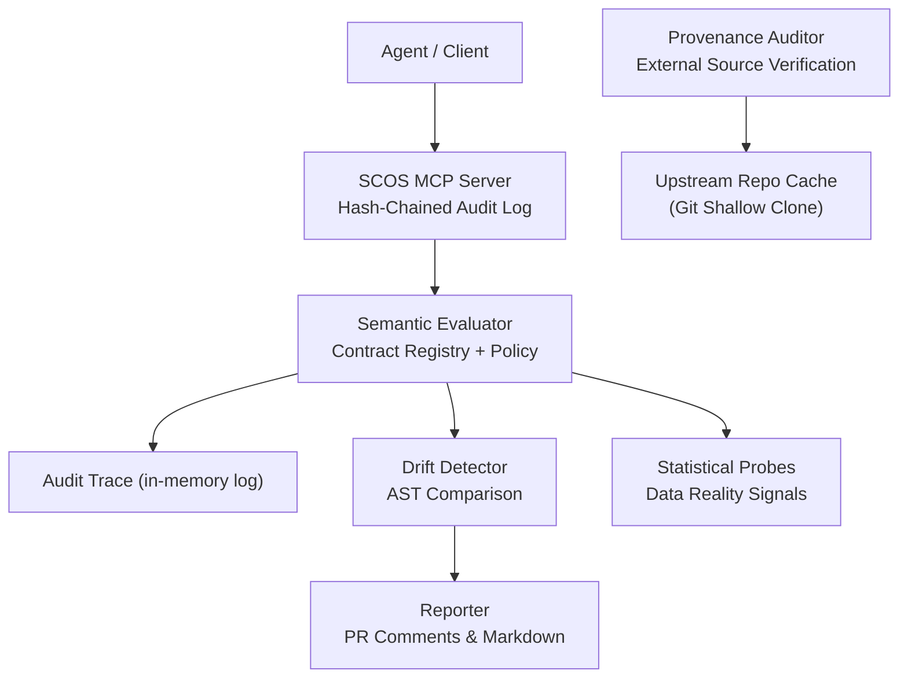
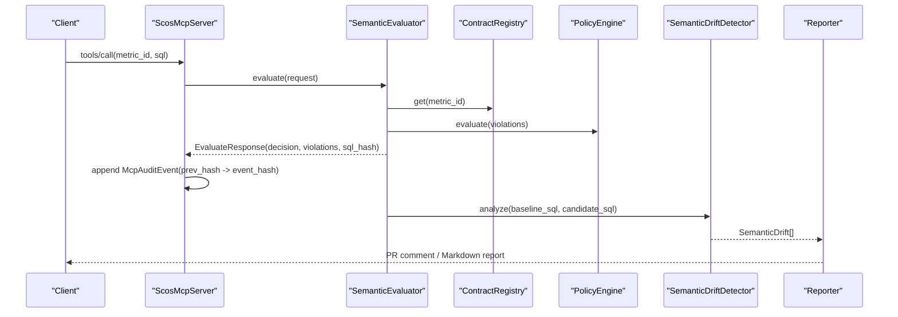
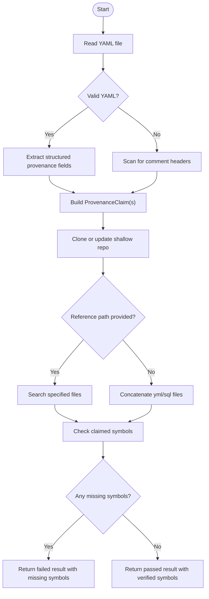
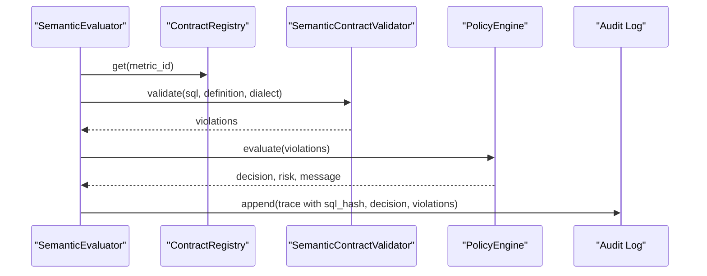
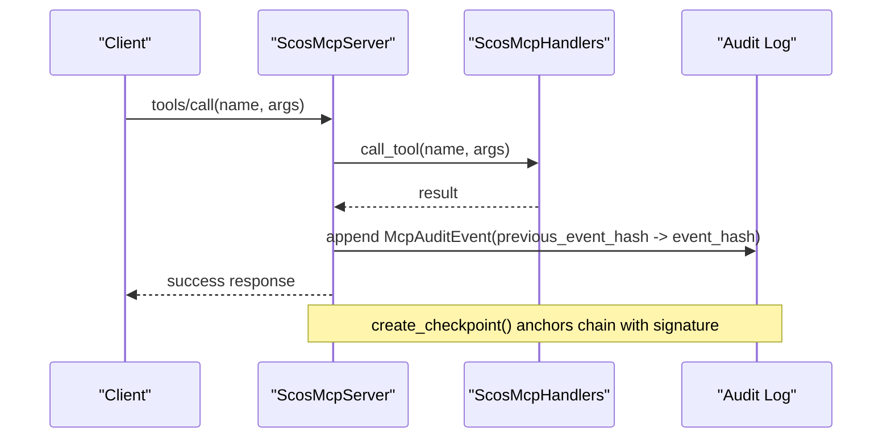
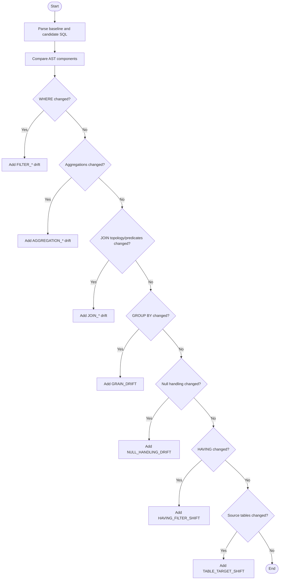
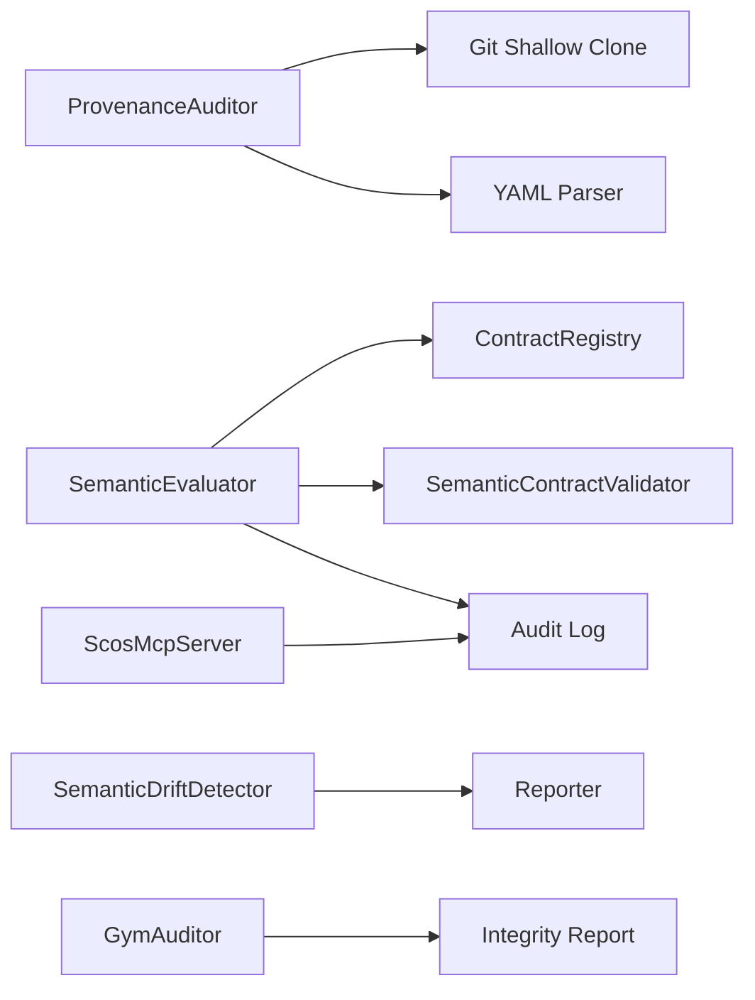

# Provenance Auditing

<cite>
**Referenced Files in This Document**
- [provenance_auditor.py](file://semantic_reliability/evaluation/provenance_auditor.py)
- [test_provenance_auditor.py](file://tests/test_provenance_auditor.py)
- [engine.py](file://semantic_reliability/firewall/engine.py)
- [server.py](file://semantic_reliability/mcp/server.py)
- [detector.py](file://semantic_reliability/testing/drift/detector.py)
- [reporter.py](file://semantic_reliability/harness/reporter.py)
- [auditor.py](file://semantic_reliability/gym/auditor.py)
- [enterprise_whitepaper.md](file://docs/ENTERPRISE_ARCHITECTURE_AND_CISO_WHITEPAPER.md)
</cite>

## Table of Contents
1. [Introduction](#introduction)
2. [Project Structure](#project-structure)
3. [Core Components](#core-components)
4. [Architecture Overview](#architecture-overview)
5. [Detailed Component Analysis](#detailed-component-analysis)
6. [Dependency Analysis](#dependency-analysis)
7. [Performance Considerations](#performance-considerations)
8. [Troubleshooting Guide](#troubleshooting-guide)
9. [Conclusion](#conclusion)
10. [Appendices](#appendices)

## Introduction
This document explains how to track query origins, transformations, and semantic changes throughout the agent processing pipeline using the repository’s provenance auditing capabilities. It covers:
- Extracting and verifying external provenance claims against upstream repositories
- Generating immutable audit trails for every evaluation decision
- Detecting semantic drift across SQL transformations
- Producing compliance-oriented reports and integrating with governance workflows
- Addressing security, privacy, and performance considerations when enabling audit collection

## Project Structure
Provenance auditing spans several modules:
- Evaluation-level provenance verification for external sources
- Firewall engine that records immutable audit traces per request
- MCP server that builds a tamper-evident hash chain over events
- Drift detection that captures semantic changes between baseline and candidate queries
- Reporting utilities that translate findings into human-readable outputs
- Gym dataset auditor that validates integrity and leakage in generated datasets

**Diagram sources**
- [server.py:50-128](file://semantic_reliability/mcp/server.py#L50-L128)
- [engine.py:55-131](file://semantic_reliability/firewall/engine.py#L55-L131)
- [detector.py:12-46](file://semantic_reliability/testing/drift/detector.py#L12-L46)
- [reporter.py:11-84](file://semantic_reliability/harness/reporter.py#L11-L84)
- [provenance_auditor.py:41-195](file://semantic_reliability/evaluation/provenance_auditor.py#L41-L195)

**Section sources**
- [server.py:50-128](file://semantic_reliability/mcp/server.py#L50-L128)
- [engine.py:55-131](file://semantic_reliability/firewall/engine.py#L55-L131)
- [detector.py:12-46](file://semantic_reliability/testing/drift/detector.py#L12-L46)
- [reporter.py:11-84](file://semantic_reliability/harness/reporter.py#L11-L84)
- [provenance_auditor.py:41-195](file://semantic_reliability/evaluation/provenance_auditor.py#L41-L195)

## Core Components
- ProvenanceAuditor: Extracts provenance claims from YAML headers or structured fields, then verifies them by cloning or updating a shallow copy of the referenced upstream repository and scanning for claimed symbols.
- SemanticEvaluator: Parses and validates SQL against metric contracts, applies policy decisions, and records an immutable audit trace per request.
- ScosMcpServer: Wraps tool calls with cryptographic hash chaining to produce tamper-evident audit logs and signed checkpoints.
- SemanticDriftDetector: Compares baseline and candidate SQL ASTs to detect structural and semantic changes across WHERE, JOINs, GROUP BY, aggregations, null handling, HAVING, and source tables.
- Reporter: Converts drift and benchmark results into PR comments and markdown reports suitable for CI/CD and governance review.
- GymAuditor: Validates exported datasets for integrity, leakage, and distribution balance to support reproducible audits.

**Section sources**
- [provenance_auditor.py:17-195](file://semantic_reliability/evaluation/provenance_auditor.py#L17-L195)
- [engine.py:47-131](file://semantic_reliability/firewall/engine.py#L47-L131)
- [server.py:16-220](file://semantic_reliability/mcp/server.py#L16-L220)
- [detector.py:9-246](file://semantic_reliability/testing/drift/detector.py#L9-L246)
- [reporter.py:8-129](file://semantic_reliability/harness/reporter.py#L8-L129)
- [auditor.py:10-138](file://semantic_reliability/gym/auditor.py#L10-L138)

## Architecture Overview
The provenance auditing architecture integrates pre-execution contract validation, runtime audit logging, post-execution drift analysis, and evidence anchoring.

**Diagram sources**
- [server.py:95-128](file://semantic_reliability/mcp/server.py#L95-L128)
- [engine.py:55-131](file://semantic_reliability/firewall/engine.py#L55-L131)
- [detector.py:12-46](file://semantic_reliability/testing/drift/detector.py#L12-L46)
- [reporter.py:11-84](file://semantic_reliability/harness/reporter.py#L11-L84)

## Detailed Component Analysis

### ProvenanceAuditor: External Source Verification
- Claim extraction: Reads YAML files to extract repository, organization, reference path, and symbols (columns, accepted values). Supports both structured provenance fields and comment-based headers.
- Verification: Clones or updates a shallow clone of the upstream repository into a cache directory, optionally restricts search to specified reference paths, and checks presence of claimed symbols in content.
- Results: Returns detailed outcomes including whether the repo is accessible, if files exist, which symbols were verified, which are missing, and pass/fail status with reasons.

**Diagram sources**
- [provenance_auditor.py:41-195](file://semantic_reliability/evaluation/provenance_auditor.py#L41-L195)

**Section sources**
- [provenance_auditor.py:41-195](file://semantic_reliability/evaluation/provenance_auditor.py#L41-L195)
- [test_provenance_auditor.py:8-67](file://tests/test_provenance_auditor.py#L8-L67)

### SemanticEvaluator: Immutable Audit Traces
- Request handling: Parses SQL, retrieves metric contract, runs invariant validation, and evaluates policy to determine ALLOW/AUDIT/REQUIRE_REVIEW/DENY.
- Audit recording: For each evaluation, records a trace containing trace ID, timestamp, agent ID, metric ID, contract version, SQL hash, decision, violation count, and violations list.
- Integration: The firewall engine appends these traces to an in-memory audit log and logs JSON entries for downstream consumption.

**Diagram sources**
- [engine.py:55-131](file://semantic_reliability/firewall/engine.py#L55-L131)

**Section sources**
- [engine.py:55-131](file://semantic_reliability/firewall/engine.py#L55-L131)

### ScosMcpServer: Tamper-Evident Hash Chain
- Request processing: Handles JSON-RPC methods, enforces payload size limits, and routes tool calls through handlers.
- Audit chaining: After each tool call, creates an audit event referencing the previous event’s hash, computes its own hash, and appends it to the log.
- Checkpoints and verification: Periodically signs checkpoints anchored to the last event hash; provides verification routines to ensure sequence integrity and signature validity.

**Diagram sources**
- [server.py:95-128](file://semantic_reliability/mcp/server.py#L95-L128)
- [server.py:182-220](file://semantic_reliability/mcp/server.py#L182-L220)

**Section sources**
- [server.py:50-220](file://semantic_reliability/mcp/server.py#L50-L220)

### SemanticDriftDetector: Transformation Lineage Tracking
- AST comparison: Parses baseline and candidate SQL into ASTs and compares key components: WHERE clauses, aggregation functions and expressions, JOIN topology and predicates, GROUP BY grain, COALESCE/null handling, HAVING filters, and source tables.
- Output: Produces structured drifts with severity, type, component, summary, details, business impact, original/candidate snippets, and remediation guidance.

**Diagram sources**
- [detector.py:12-246](file://semantic_reliability/testing/drift/detector.py#L12-L246)

**Section sources**
- [detector.py:12-246](file://semantic_reliability/testing/drift/detector.py#L12-L246)

### Reporter: Compliance-Friendly Outputs
- PR comments: Generates concise GitHub PR comments summarizing highest severity drifts and listing detailed differences with remediation steps.
- Benchmark reports: Produces comprehensive markdown reports covering mutation scores, caught vs uncaught mutations, and per-evaluation details.

**Section sources**
- [reporter.py:11-129](file://semantic_reliability/harness/reporter.py#L11-L129)

### Gym Dataset Auditor: Integrity and Leakage Checks
- Integrity: Detects duplicate example IDs, duplicate evidence hashes, conflicting preference labels, identical chosen/rejected pairs, and missing metadata.
- Leakage: Ensures train splits do not contain holdout mutation types or forbidden domains.
- Distribution: Computes percentages for mutation family, difficulty levels, and split distributions.

**Section sources**
- [auditor.py:10-138](file://semantic_reliability/gym/auditor.py#L10-L138)

## Dependency Analysis
- ProvenanceAuditor depends on Git operations and YAML parsing to verify external claims.
- SemanticEvaluator depends on ContractRegistry and SemanticContractValidator to enforce metric invariants and record audit traces.
- ScosMcpServer depends on handlers and maintains an in-memory audit log with cryptographic chaining.
- SemanticDriftDetector depends on SQL parsing and AST normalization to compare baseline and candidate queries.
- Reporter consumes drift and benchmark data to produce human-readable outputs.
- GymAuditor consumes exported dataset lines to validate integrity and distribution.

**Diagram sources**
- [provenance_auditor.py:41-195](file://semantic_reliability/evaluation/provenance_auditor.py#L41-L195)
- [engine.py:55-131](file://semantic_reliability/firewall/engine.py#L55-L131)
- [server.py:95-128](file://semantic_reliability/mcp/server.py#L95-L128)
- [detector.py:12-46](file://semantic_reliability/testing/drift/detector.py#L12-L46)
- [reporter.py:11-84](file://semantic_reliability/harness/reporter.py#L11-L84)
- [auditor.py:41-138](file://semantic_reliability/gym/auditor.py#L41-L138)

**Section sources**
- [provenance_auditor.py:41-195](file://semantic_reliability/evaluation/provenance_auditor.py#L41-L195)
- [engine.py:55-131](file://semantic_reliability/firewall/engine.py#L55-L131)
- [server.py:95-128](file://semantic_reliability/mcp/server.py#L95-L128)
- [detector.py:12-46](file://semantic_reliability/testing/drift/detector.py#L12-L46)
- [reporter.py:11-84](file://semantic_reliability/harness/reporter.py#L11-L84)
- [auditor.py:41-138](file://semantic_reliability/gym/auditor.py#L41-L138)

## Performance Considerations
- Network latency and rate limits: Upstream repository cloning can be slow or fail due to network issues; use caching directories and consider private mirrors or authenticated access where appropriate.
- Disk usage: Repeated clones accumulate cache; implement retention policies for temporary directories.
- CPU overhead: AST parsing and drift detection add latency; batch comparisons and limit scope to relevant components when possible.
- Audit log growth: In-memory logs grow with traffic; persist periodically and rotate to avoid memory pressure.
- Payload limits: Enforce maximum request sizes at the MCP layer to prevent resource exhaustion.

[No sources needed since this section provides general guidance]

## Troubleshooting Guide
- Provenance verification failures:
  - Repository inaccessible: Check network connectivity, authentication, and URL format; ensure cache directory permissions.
  - Reference path not found: Validate reference paths and ensure they exist in the cloned repository.
  - Missing symbols: Confirm claimed symbols match actual columns or values present in target files.
- Audit chain integrity:
  - Use verification routines to confirm sequence continuity and signatures; investigate gaps or mismatches indicating tampering or misconfiguration.
- Drift detection false positives:
  - Normalize ASTs and review equivalence rules; adjust tolerances or refine baselines if necessary.
- Reporting anomalies:
  - Ensure drift objects include required fields; validate input data formats before generating reports.

**Section sources**
- [provenance_auditor.py:101-195](file://semantic_reliability/evaluation/provenance_auditor.py#L101-L195)
- [server.py:182-220](file://semantic_reliability/mcp/server.py#L182-L220)
- [detector.py:12-246](file://semantic_reliability/testing/drift/detector.py#L12-L246)

## Conclusion
The repository provides a robust set of provenance auditing capabilities:
- Mechanical verification of external source claims prevents fabricated citations and ensures symbol-level accuracy.
- Immutable audit traces capture query origins, decisions, and violations with cryptographic chaining for tamper evidence.
- AST-based drift detection tracks semantic changes across transformations, enabling proactive governance.
- Reports and dataset auditors support compliance workflows and reproducibility.
Deployers should integrate these components into CI/CD and operational pipelines, configure secure caching and signing keys, and monitor performance and privacy implications.

[No sources needed since this section summarizes without analyzing specific files]

## Appendices

### Setup Examples
- Setting up provenance collectors:
  - Place YAML files with structured provenance fields or comment headers indicating repository, organization, and reference paths.
  - Run directory audits to extract claims and verify against upstream repositories using cached clones.
- Generating audit reports:
  - Execute evaluations via the MCP server to produce hash-chained audit events.
  - Use drift detection to compare baseline and candidate SQL, then generate PR comments and markdown reports.
- Integrating with governance workflows:
  - Persist audit logs and checkpoints to durable storage.
  - Configure policy engines to enforce strict modes for critical metrics.
  - Incorporate drift alerts and provenance failures into pull request gates and compliance dashboards.

[No sources needed since this section provides general guidance]

### Security and Privacy Considerations
- Secure upstream access: Use private repositories and authenticated Git credentials; restrict cache visibility.
- Signing secrets: Protect audit signing keys and rotate periodically; store securely outside application memory.
- Data minimization: Avoid logging sensitive payloads; record only hashed SQL and minimal identifiers.
- Access controls: Enforce tenant scoping and domain restrictions at the MCP layer.
- Compliance alignment: Follow enterprise whitepaper recommendations for evidence artifacts and chain-of-custody verification.

**Section sources**
- [server.py:25-49](file://semantic_reliability/mcp/server.py#L25-L49)
- [enterprise_whitepaper.md:150-179](file://docs/ENTERPRISE_ARCHITECTURE_AND_CISO_WHITEPAPER.md#L150-L179)