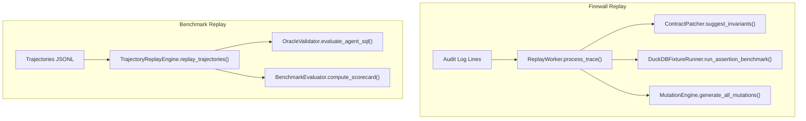
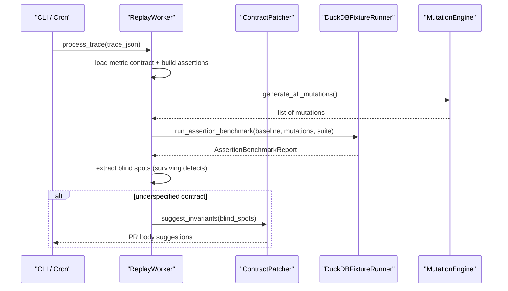
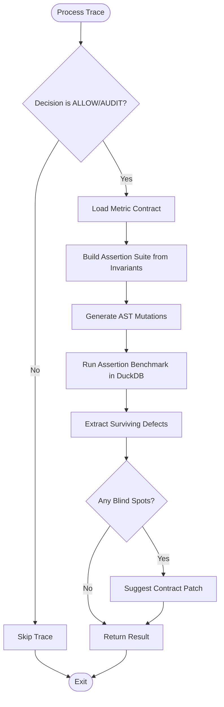
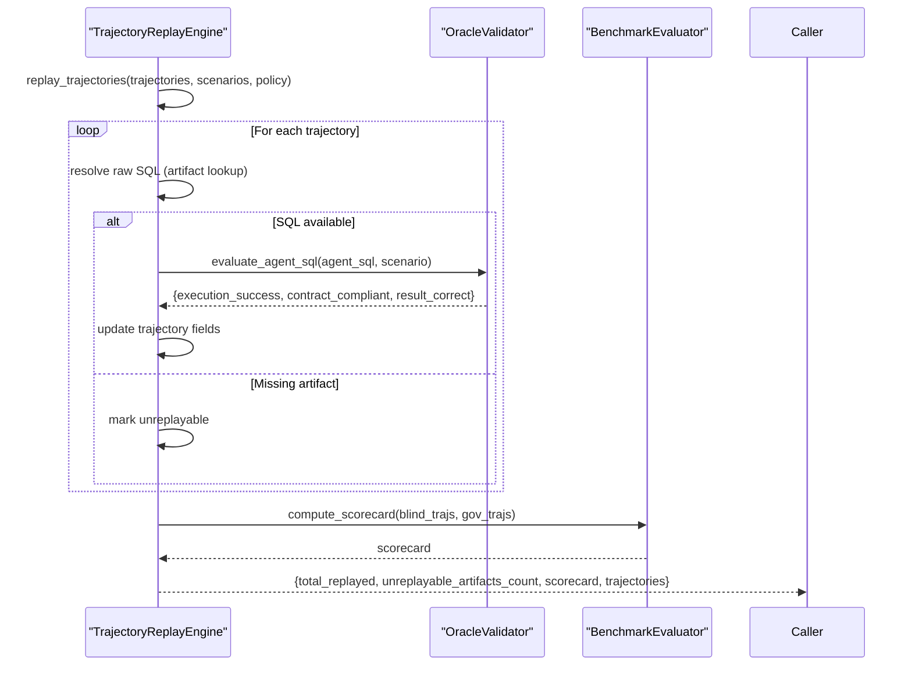
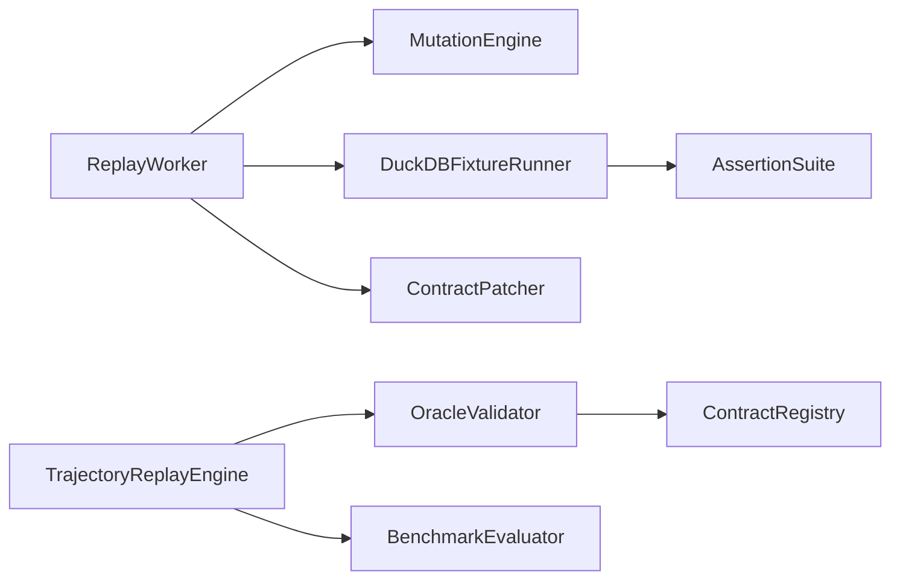

# Trajectory Replay

<cite>
**Referenced Files in This Document**
- [replay/main.py](file://semantic_reliability/replay/main.py)
- [replay/worker.py](file://semantic_reliability/replay/worker.py)
- [replay/patcher.py](file://semantic_reliability/replay/patcher.py)
- [benchmark/replay.py](file://semantic_reliability/benchmark/replay.py)
- [benchmark/protocol.py](file://semantic_reliability/benchmark/protocol.py)
- [benchmark/oracle.py](file://semantic_reliability/benchmark/oracle.py)
- [benchmark/scenarios.py](file://semantic_reliability/benchmark/scenarios.py)
- [harness/duckdb_runner.py](file://semantic_reliability/harness/duckdb_runner.py)
- [testing/mutations/engine.py](file://semantic_reliability/testing/mutations/engine.py)
- [evaluation/agent_eval.py](file://semantic_reliability/evaluation/agent_eval.py)
- [tests/test_replay.py](file://tests/test_replay.py)
</cite>

## Table of Contents
1. [Introduction](#introduction)
2. [Project Structure](#project-structure)
3. [Core Components](#core-components)
4. [Architecture Overview](#architecture-overview)
5. [Detailed Component Analysis](#detailed-component-analysis)
6. [Dependency Analysis](#dependency-analysis)
7. [Performance Considerations](#performance-considerations)
8. [Troubleshooting Guide](#troubleshooting-guide)
9. [Conclusion](#conclusion)
10. [Appendices](#appendices)

## Introduction
This document explains the trajectory replay functionality for agent evaluation and semantic reliability testing. It covers how to capture, store, and replay agent SQL generation sequences to analyze decisions, detect regressions, and identify performance bottlenecks. It also documents the trajectory data structure, the replay execution engines, and comparison mechanisms between original and replayed trajectories. Finally, it provides guidance on integrating with benchmark scenarios and automated regression testing workflows.

## Project Structure
The repository implements two complementary replay systems:
- Firewall Replay (Phase 8.2): Consumes firewall audit logs to evaluate whether queries have untested semantic blind spots by running AST mutations against fixtures and assertions.
- Benchmark Trajectory Replay (Phase 12.x): Replays recorded agent trajectories against updated contracts and golden oracles to detect regressions and measure correctness.

**Diagram sources**
- [replay/worker.py:69-159](file://semantic_reliability/replay/worker.py#L69-L159)
- [replay/patcher.py:14-79](file://semantic_reliability/replay/patcher.py#L14-L79)
- [harness/duckdb_runner.py:208-255](file://semantic_reliability/harness/duckdb_runner.py#L208-L255)
- [testing/mutations/engine.py:16-52](file://semantic_reliability/testing/mutations/engine.py#L16-L52)
- [benchmark/replay.py:70-125](file://semantic_reliability/benchmark/replay.py#L70-L125)
- [benchmark/oracle.py:52-97](file://semantic_reliability/benchmark/oracle.py#L52-L97)

**Section sources**
- [replay/main.py:11-47](file://semantic_reliability/replay/main.py#L11-L47)
- [benchmark/replay.py:16-53](file://semantic_reliability/benchmark/replay.py#L16-L53)

## Core Components
- ReplayWorker: Parses firewall audit log traces, loads metric contracts, builds assertion suites from invariants, generates AST mutations, executes them in DuckDB with fixtures, and identifies surviving defects (blind spots).
- ContractPatcher: Analyzes surviving mutation descriptions to suggest contract invariant additions and generate PR bodies.
- TrajectoryReplayEngine: Loads exported trajectories, optionally resolves raw SQL artifacts, re-evaluates agent SQL against active contracts and golden oracles, and computes scorecards.
- OracleValidator: Validates golden SQL and compares agent outputs to oracle results using order-insensitive, numeric-tolerant dataframe comparison.
- DuckDBFixtureRunner: Executes baseline vs mutated SQL under fixture data, evaluates assertions, classifies outcomes, and reports catch scores.
- MutationEngine: Injects precise AST-level logical mutations into SQL to simulate common bugs (filter drops, boundary shifts, aggregation swaps, grain drops, join predicate drops, coalesce bypass, math operator inversion).
- AgentSQLEvaluator: Evaluates candidate SQL against SCOS contracts and assertion suites, producing risk levels and verdicts.

**Section sources**
- [replay/worker.py:22-168](file://semantic_reliability/replay/worker.py#L22-L168)
- [replay/patcher.py:10-79](file://semantic_reliability/replay/patcher.py#L10-L79)
- [benchmark/replay.py:56-125](file://semantic_reliability/benchmark/replay.py#L56-L125)
- [benchmark/oracle.py:16-133](file://semantic_reliability/benchmark/oracle.py#L16-L133)
- [harness/duckdb_runner.py:56-256](file://semantic_reliability/harness/duckdb_runner.py#L56-L256)
- [testing/mutations/engine.py:8-269](file://semantic_reliability/testing/mutations/engine.py#L8-L269)
- [evaluation/agent_eval.py:21-134](file://semantic_reliability/evaluation/agent_eval.py#L21-L134)

## Architecture Overview
Two parallel replay pipelines operate on different inputs:

- Firewall Replay Pipeline:
  - Reads line-by-line audit logs containing ALLOW/AUDIT decisions and SQL.
  - Loads metric contracts and constructs assertion suites from invariants.
  - Generates AST mutations and runs them in DuckDB with fixtures.
  - Identifies surviving defects and suggests contract patches.

- Benchmark Trajectory Replay Pipeline:
  - Loads trajectories exported as JSONL with privacy redaction.
  - Optionally retrieves raw SQL artifacts by hash.
  - Re-evaluates agent SQL against current contracts and golden oracles.
  - Computes scorecards comparing blind vs governed agents.

**Diagram sources**
- [replay/main.py:11-47](file://semantic_reliability/replay/main.py#L11-L47)
- [replay/worker.py:69-159](file://semantic_reliability/replay/worker.py#L69-L159)
- [replay/patcher.py:14-79](file://semantic_reliability/replay/patcher.py#L14-L79)
- [harness/duckdb_runner.py:208-255](file://semantic_reliability/harness/duckdb_runner.py#L208-L255)
- [testing/mutations/engine.py:16-52](file://semantic_reliability/testing/mutations/engine.py#L16-L52)

## Detailed Component Analysis

### Trajectory Data Model
Agent trajectories are captured as structured records that include scenario context, tool calls, final SQL (hashed and optionally raw), execution metadata, and flags indicating compliance and correctness. They support privacy-preserving export by stripping raw SQL.

Key fields:
- scenario_id, agent_type, model_id, prompt_hash
- tool_calls: list of ToolCallRecord (tool, arguments_hash, result_summary, latency_ms)
- draft_count, final_sql_hash, final_sql_raw (excluded from export)
- execution_success, contract_compliant, result_correct
- abstained, appropriate_abstention, ceiling_reached
- latency_ms, estimated_cost_usd, audit_chain_verified
- metadata: provider, model_snapshot, system_prompt_hash, temperature, seed, backend_fingerprint, rollout_index

Export utilities:
- redact_for_export(): returns a safe dictionary without raw SQL
- export_trajectories(): writes JSONL and optionally saves raw SQL artifacts by hash

**Section sources**
- [benchmark/protocol.py:28-73](file://semantic_reliability/benchmark/protocol.py#L28-L73)
- [benchmark/replay.py:16-53](file://semantic_reliability/benchmark/replay.py#L16-L53)

### Replay Execution Engines

#### Firewall Replay Engine
- Input: Audit log lines with decision, trace_id, metric_id, sql/original_sql.
- Processing:
  - Filters only ALLOW/AUDIT decisions.
  - Loads metric contract YAML and parses MetricDefinition.
  - Builds assertion suite from invariants (e.g., required population filters) plus a non-zero metric value assertion.
  - Generates AST mutations via MutationEngine.
  - Executes baseline and mutated SQL in DuckDB with fixtures; evaluates assertions.
  - Extracts blind spots where valid defects survived tests.
- Output: ReplayResult including catch_score, total_valid_defects, undetected_defects, blind_spots, and contract_underspecified flag.

**Diagram sources**
- [replay/worker.py:69-159](file://semantic_reliability/replay/worker.py#L69-L159)
- [harness/duckdb_runner.py:208-255](file://semantic_reliability/harness/duckdb_runner.py#L208-L255)
- [testing/mutations/engine.py:16-52](file://semantic_reliability/testing/mutations/engine.py#L16-L52)

**Section sources**
- [replay/worker.py:62-168](file://semantic_reliability/replay/worker.py#L62-L168)
- [tests/test_replay.py:31-97](file://tests/test_replay.py#L31-L97)

#### Benchmark Trajectory Replay Engine
- Input: List of AgentTrajectory objects and BenchmarkScenario definitions.
- Processing:
  - Maps trajectories to scenarios by scenario_id.
  - Resolves raw SQL from artifacts if not embedded in trajectory.
  - Evaluates agent SQL via OracleValidator against contracts and golden SQL.
  - Updates trajectory fields with execution_success, contract_compliant, result_correct.
  - Computes scorecards comparing blind vs governed trajectories.
- Output: Summary including total_replayed, unreplayable_artifacts_count, scorecard, and redacted trajectories.

**Diagram sources**
- [benchmark/replay.py:70-125](file://semantic_reliability/benchmark/replay.py#L70-L125)
- [benchmark/oracle.py:52-97](file://semantic_reliability/benchmark/oracle.py#L52-L97)

**Section sources**
- [benchmark/replay.py:56-125](file://semantic_reliability/benchmark/replay.py#L56-L125)
- [benchmark/oracle.py:16-133](file://semantic_reliability/benchmark/oracle.py#L16-L133)

### Comparison Mechanisms
- Oracle-based comparison: Order-insensitive, numeric-tolerant canonical row comparison between agent output and golden SQL results. Handles NULLs, rounding, and column ordering differences.
- Assertion-based comparison: Structural and semantic assertions evaluate mutated queries against fixtures to detect defects; surviving defects indicate blind spots.
- Risk classification: AgentSQL evaluation produces risk levels and verdicts based on syntax errors, contract violations, assertion failures, and execution success.

**Section sources**
- [benchmark/oracle.py:99-133](file://semantic_reliability/benchmark/oracle.py#L99-L133)
- [harness/duckdb_runner.py:116-206](file://semantic_reliability/harness/duckdb_runner.py#L116-L206)
- [evaluation/agent_eval.py:35-134](file://semantic_reliability/evaluation/agent_eval.py#L35-L134)

### Capturing Agent Interactions
To capture agent interactions for replay:
- Record tool calls with hashed arguments and summaries to preserve privacy.
- Capture final SQL and its SHA-256 hash; optionally store raw SQL in a protected artifacts directory keyed by hash.
- Include metadata such as provider, model snapshot, temperature, seed, backend fingerprint, and rollout index for reproducibility.
- Export trajectories to JSONL using redaction utilities to strip sensitive fields.

Integration points:
- Use adapters to produce AgentTrajectory instances during live runs.
- Store artifacts alongside trajectory exports for later retrieval during replay.

**Section sources**
- [benchmark/protocol.py:28-73](file://semantic_reliability/benchmark/protocol.py#L28-L73)
- [benchmark/replay.py:16-53](file://semantic_reliability/benchmark/replay.py#L16-L53)
- [benchmark/adapters.py:224-248](file://semantic_reliability/benchmark/adapters.py#L224-L248)

### Analyzing Decision Points and Performance Bottlenecks
- Decision points:
  - Firewall decisions (ALLOW/AUDIT/DENY) determine which traces are replayed.
  - Scenario expected behavior (PRODUCE_SQL, ABSTAIN, ASK_CLARIFICATION, REQUIRE_REVIEW) influences contract compliance checks.
- Performance bottlenecks:
  - Latency per trajectory and per tool call can be tracked in metadata and ToolCallRecord.
  - Unexecutable mutations and runtime errors increase processing time; monitor counts in benchmark reports.
  - Fixture loading and DuckDB execution costs scale with dataset size; consider minimizing fixture tables and leveraging in-memory connections.

**Section sources**
- [replay/worker.py:72-83](file://semantic_reliability/replay/worker.py#L72-L83)
- [benchmark/oracle.py:70-83](file://semantic_reliability/benchmark/oracle.py#L70-L83)
- [benchmark/protocol.py:36-46](file://semantic_reliability/benchmark/protocol.py#L36-L46)
- [harness/duckdb_runner.py:69-100](file://semantic_reliability/harness/duckdb_runner.py#L69-L100)

### Integration with Benchmark Scenarios and Automated Regression Testing
- Benchmark scenarios define prompts, schema contexts, target metrics, and golden SQL for clear-contract cases; ambiguous, missing-contract, and conflict scenarios guide expected behaviors like abstention or clarification.
- Automated regression testing:
  - Export trajectories after agent runs.
  - On contract updates, replay trajectories to detect regressions in execution, compliance, and correctness.
  - Use scorecards to compare blind vs governed agents and track improvements over time.
  - Integrate CI steps to run replay cycles and fail builds when regressions are detected.

**Section sources**
- [benchmark/scenarios.py:1-213](file://semantic_reliability/benchmark/scenarios.py#L1-L213)
- [benchmark/replay.py:70-125](file://semantic_reliability/benchmark/replay.py#L70-L125)

## Dependency Analysis

**Diagram sources**
- [replay/worker.py:62-168](file://semantic_reliability/replay/worker.py#L62-L168)
- [testing/mutations/engine.py:8-269](file://semantic_reliability/testing/mutations/engine.py#L8-L269)
- [harness/duckdb_runner.py:56-256](file://semantic_reliability/harness/duckdb_runner.py#L56-L256)
- [benchmark/replay.py:56-125](file://semantic_reliability/benchmark/replay.py#L56-L125)
- [benchmark/oracle.py:16-133](file://semantic_reliability/benchmark/oracle.py#L16-L133)

**Section sources**
- [replay/worker.py:62-168](file://semantic_reliability/replay/worker.py#L62-L168)
- [benchmark/replay.py:56-125](file://semantic_reliability/benchmark/replay.py#L56-L125)

## Performance Considerations
- Minimize fixture sizes: Use representative subsets to reduce DuckDB execution time.
- Batch mutations: The mutation engine generates multiple mutations per query; ensure efficient iteration and early termination where possible.
- Connection reuse: Reuse DuckDB connections within a replay cycle to avoid overhead.
- Artifact resolution: Pre-index raw SQL artifacts by hash to speed up lookups during replay.
- Monitoring: Track latency_ms and tool call counts to identify slow paths and optimize agent workflows.

[No sources needed since this section provides general guidance]

## Troubleshooting Guide
Common issues and resolutions:
- Missing contract file: Ensure metric_id maps to a valid YAML contract path; verify contract_dir configuration.
- No fixtures found: Provide fixture_dir or rely on default examples/fixtures; confirm CSV files exist and match table names.
- Denied traces: Only ALLOW/AUDIT traces are replayed; verify firewall decisions before replay.
- Unreplayable artifacts: If final_sql_hash exists but raw SQL artifact is missing, detailed re-evaluation cannot proceed; ensure artifacts are stored correctly.
- Runtime errors: Inspect assertion benchmark reports for RUNTIME_ERROR classifications; fix SQL syntax or schema mismatches.
- Silent survivors: When contract violations exist but assertions do not catch them, add targeted assertions or strengthen invariants.

**Section sources**
- [replay/worker.py:85-98](file://semantic_reliability/replay/worker.py#L85-L98)
- [benchmark/replay.py:91-111](file://semantic_reliability/benchmark/replay.py#L91-L111)
- [harness/duckdb_runner.py:125-144](file://semantic_reliability/harness/duckdb_runner.py#L125-L144)
- [evaluation/agent_eval.py:54-98](file://semantic_reliability/evaluation/agent_eval.py#L54-L98)

## Conclusion
Trajectory replay enables robust analysis and debugging of agent SQL generation by capturing interactions, replaying decisions against updated contracts, and detecting regressions through oracle comparisons and mutation testing. The dual pipeline approach supports both firewall-driven blind spot detection and benchmark-driven regression testing. By integrating these capabilities into CI workflows and maintaining comprehensive trajectory artifacts, teams can improve semantic reliability, enforce contracts, and continuously validate agent behavior.

[No sources needed since this section summarizes without analyzing specific files]

## Appendices

### Example Workflows

#### Capturing Agent Interactions
- During agent execution, record tool calls with hashed arguments and summaries.
- Capture final SQL and compute its hash; store raw SQL in a protected artifacts directory keyed by hash.
- Populate metadata for reproducibility (provider, model snapshot, temperature, seed, backend fingerprint).

**Section sources**
- [benchmark/protocol.py:28-73](file://semantic_reliability/benchmark/protocol.py#L28-L73)
- [benchmark/replay.py:16-53](file://semantic_reliability/benchmark/replay.py#L16-L53)

#### Running Firewall Replay Cycle
- Prepare audit log file with ALLOW/AUDIT traces.
- Configure contract_dir and optional fixture_dir.
- Execute run_replay_cycle to process traces, detect blind spots, and generate patch suggestions.

**Section sources**
- [replay/main.py:11-47](file://semantic_reliability/replay/main.py#L11-L47)
- [tests/test_replay.py:85-97](file://tests/test_replay.py#L85-L97)

#### Replaying Benchmarked Trajectories
- Export trajectories to JSONL with privacy redaction.
- Provide raw artifacts directory if needed for SQL resolution.
- Run TrajectoryReplayEngine with scenarios and policy to compute scorecards and detect regressions.

**Section sources**
- [benchmark/replay.py:56-125](file://semantic_reliability/benchmark/replay.py#L56-L125)
- [benchmark/scenarios.py:1-213](file://semantic_reliability/benchmark/scenarios.py#L1-L213)