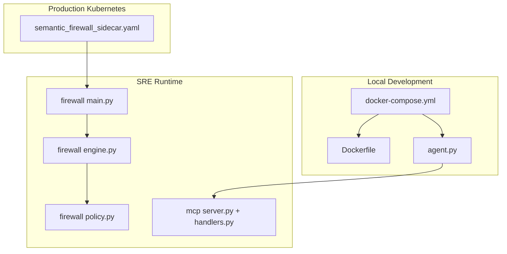
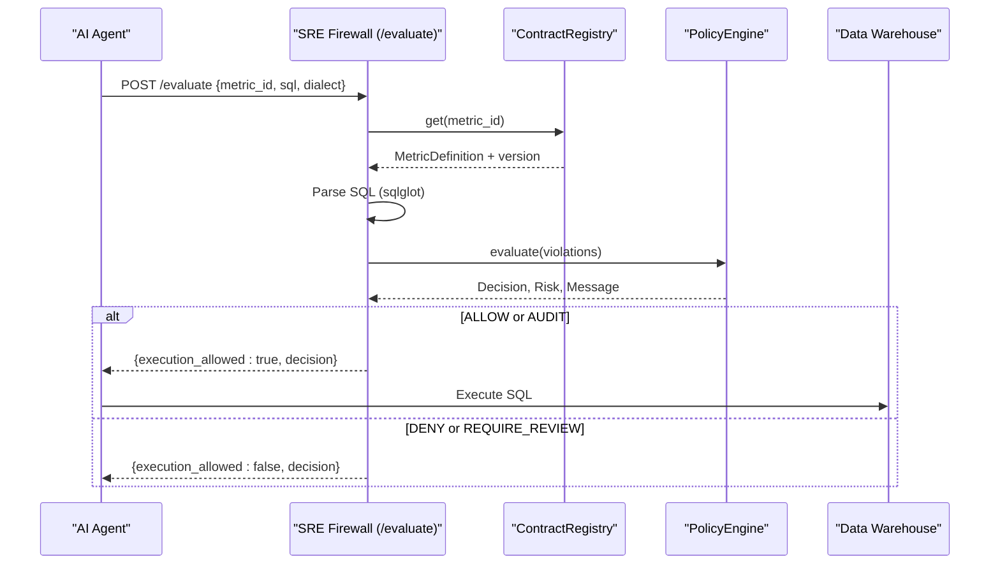
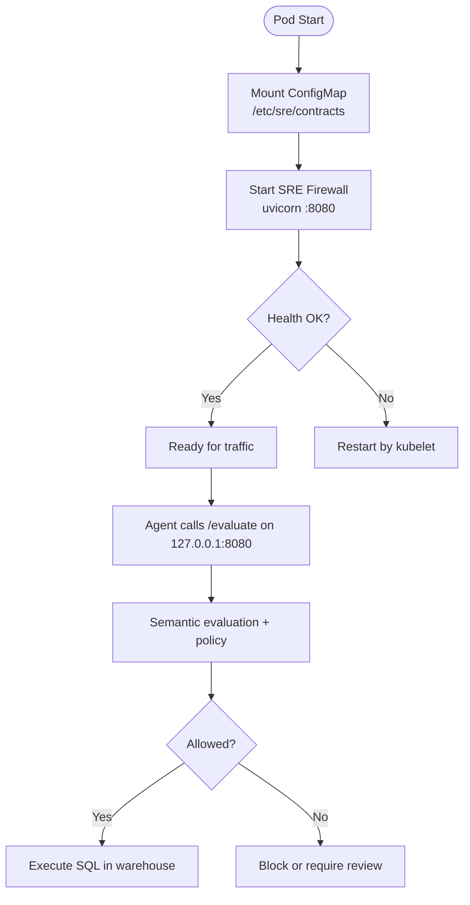
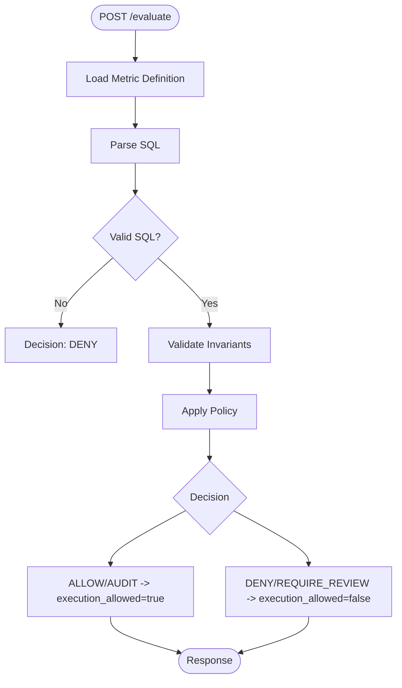
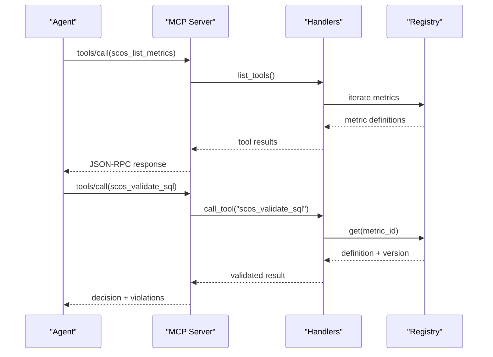
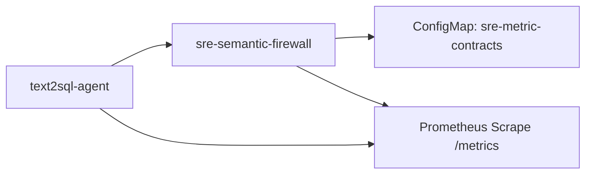

# Deployment Patterns

<cite>
**Referenced Files in This Document**
- [docker-compose.yml](file://demo/docker-compose.yml)
- [Dockerfile](file://demo/Dockerfile)
- [agent.py](file://demo/agent.py)
- [semantic_firewall_sidecar.yaml](file://deploy/k8s/semantic_firewall_sidecar.yaml)
- [main.py](file://semantic_reliability/firewall/main.py)
- [engine.py](file://semantic_reliability/firewall/engine.py)
- [policy.py](file://semantic_reliability/firewall/policy.py)
- [server.py](file://semantic_reliability/mcp/server.py)
- [handlers.py](file://semantic_reliability/mcp/handlers.py)
- [contract.yaml](file://benchmark_corpus/dev/net_revenue/contract.yaml)
- [README.md](file://README.md)
</cite>

## Table of Contents
1. Introduction
2. Project Structure
3. Core Components
4. Architecture Overview
5. Detailed Component Analysis
6. Dependency Analysis
7. Performance Considerations
8. Troubleshooting Guide
9. Conclusion

## Introduction
This document describes deployment patterns for AI agent integration using the Semantic Reliability Engine (SRE). It covers:
- Docker-based development environments with docker-compose for local testing and debugging
- Kubernetes sidecar deployment for production with semantic firewall integration
- Scaling, resource allocation, monitoring, configuration management, secrets handling, and health checks
- Networking, service discovery, and load balancing strategies for high availability

The SRE provides a runtime semantic firewall that validates AI-generated SQL against declarative metric contracts before execution, enabling safe agentic analytics at scale.

## Project Structure
Key deployment artifacts:
- Local development stack via docker-compose with an MCP server and demo agent
- Production Kubernetes manifest defining a sidecar pattern where the primary agent calls the SRE firewall on localhost
- A hardened container image with non-root user and health checks
- Prometheus metrics endpoints for observability

**Diagram sources**
- [docker-compose.yml:8-51](file://demo/docker-compose.yml#L8-L51)
- [Dockerfile:1-33](file://demo/Dockerfile#L1-L33)
- [semantic_firewall_sidecar.yaml:1-103](file://deploy/k8s/semantic_firewall_sidecar.yaml#L1-L103)
- [main.py:23-69](file://semantic_reliability/firewall/main.py#L23-L69)
- [engine.py:18-132](file://semantic_reliability/firewall/engine.py#L18-L132)
- [policy.py:32-68](file://semantic_reliability/firewall/policy.py#L32-L68)
- [server.py:16-257](file://semantic_reliability/mcp/server.py#L16-L257)
- [handlers.py:131-289](file://semantic_reliability/mcp/handlers.py#L131-L289)

**Section sources**
- [docker-compose.yml:1-52](file://demo/docker-compose.yml#L1-L52)
- [Dockerfile:1-33](file://demo/Dockerfile#L1-L33)
- [semantic_firewall_sidecar.yaml:1-103](file://deploy/k8s/semantic_firewall_sidecar.yaml#L1-L103)

## Core Components
- SRE Firewall API (FastAPI): Exposes /evaluate for pre-execution validation, /health for liveness/readiness, and /metrics for Prometheus scraping.
- Contract Registry: Loads YAML metric contracts into memory; supports dynamic loading from a directory or ConfigMap.
- Policy Engine: Maps violations to decisions (ALLOW, AUDIT, REQUIRE_REVIEW, DENY) based on severity and strict mode.
- MCP Server: JSON-RPC 2.0 interface for agents to list metrics, validate SQL, and read resources with domain scoping and audit hash chaining.
- Demo Agent: Demonstrates valid, invalid, and missing-contract scenarios by calling MCP tools.

**Section sources**
- [main.py:23-69](file://semantic_reliability/firewall/main.py#L23-L69)
- [engine.py:18-132](file://semantic_reliability/firewall/engine.py#L18-L132)
- [policy.py:32-68](file://semantic_reliability/firewall/policy.py#L32-L68)
- [server.py:16-257](file://semantic_reliability/mcp/server.py#L16-L257)
- [handlers.py:131-289](file://semantic_reliability/mcp/handlers.py#L131-L289)
- [agent.py:21-85](file://demo/agent.py#L21-L85)

## Architecture Overview
Two deployment modes are supported:

- Local development with docker-compose:
  - Runs an MCP server and a demo agent in a shared bridge network
  - Binds MCP server port to localhost for developer access
  - Applies security hardening (no-new-privileges, drop all capabilities) and resource limits

- Production with Kubernetes sidecar:
  - Primary agent container calls the SRE firewall over localhost (127.0.0.1:8080)
  - Sidecar loads contracts from a mounted ConfigMap
  - Liveness/readiness probes target /health
  - Prometheus annotations enable metrics scraping

**Diagram sources**
- [main.py:36-53](file://semantic_reliability/firewall/main.py#L36-L53)
- [engine.py:54-116](file://semantic_reliability/firewall/engine.py#L54-L116)
- [policy.py:38-67](file://semantic_reliability/firewall/policy.py#L38-L67)

**Section sources**
- [semantic_firewall_sidecar.yaml:23-76](file://deploy/k8s/semantic_firewall_sidecar.yaml#L23-L76)
- [docker-compose.yml:8-51](file://demo/docker-compose.yml#L8-L51)

## Detailed Component Analysis

### Docker Compose Development Stack
- Services:
  - scos-mcp-server: Builds from the project root using demo/Dockerfile, runs the MCP server with contracts from benchmark_corpus/dev, exposes port 8000 on localhost
  - analytics-agent-demo: Depends on the MCP server, runs the demo agent
- Networking: Shared bridge network sre_demo_net
- Security: no-new-privileges and cap_drop ALL
- Resources: CPU and memory limits per service
- Environment: PYTHONUNBUFFERED=1 for log flushing

Operational notes:
- Use docker compose up --build to start
- The agent communicates with the MCP server over the internal network

**Section sources**
- [docker-compose.yml:3-51](file://demo/docker-compose.yml#L3-L51)
- [Dockerfile:1-33](file://demo/Dockerfile#L1-L33)
- [agent.py:21-85](file://demo/agent.py#L21-L85)

### Kubernetes Sidecar Deployment
- Deployment:
  - Two containers in one Pod: text2sql-agent and sre-semantic-firewall
  - Agent sets SRE_FIREWALL_URL to http://127.0.0.1:8080/evaluate
  - Sidecar runs uvicorn serving FastAPI app on 0.0.0.0:8080
- Configuration:
  - Contracts mounted via ConfigMap at /etc/sre/contracts (read-only)
  - Environment variables control strict mode and contract directory
- Health:
  - Liveness and readiness probes call /health on port 8080
- Monitoring:
  - Prometheus scrape annotations configured for port 8080 path /metrics
- Scaling:
  - Replicas set to 2 for high availability

**Diagram sources**
- [semantic_firewall_sidecar.yaml:23-76](file://deploy/k8s/semantic_firewall_sidecar.yaml#L23-L76)
- [main.py:56-69](file://semantic_reliability/firewall/main.py#L56-L69)

**Section sources**
- [semantic_firewall_sidecar.yaml:1-103](file://deploy/k8s/semantic_firewall_sidecar.yaml#L1-L103)

### SRE Firewall API and Evaluation Flow
- Endpoints:
  - POST /evaluate: Validates SQL against contracts and returns decision
  - GET /health: Returns status and loaded metrics
  - GET /metrics: Exposes Prometheus metrics when available
- Evaluation logic:
  - Load metric definition from registry
  - Parse SQL with sqlglot
  - Validate against contract invariants
  - Apply policy to determine decision and risk
  - Record immutable audit trace

**Diagram sources**
- [main.py:36-53](file://semantic_reliability/firewall/main.py#L36-L53)
- [engine.py:54-116](file://semantic_reliability/firewall/engine.py#L54-L116)
- [policy.py:38-67](file://semantic_reliability/firewall/policy.py#L38-L67)

**Section sources**
- [main.py:23-69](file://semantic_reliability/firewall/main.py#L23-L69)
- [engine.py:18-132](file://semantic_reliability/firewall/engine.py#L18-L132)
- [policy.py:1-68](file://semantic_reliability/firewall/policy.py#L1-L68)

### MCP Server Integration for Agents
- Tools exposed:
  - scos_list_metrics: Lists available metrics with domain and owner
  - scos_validate_sql: Validates SQL against a metric’s contract
  - scos_get_contract: Retrieves contract details
  - Additional tools for probes and remediation guidance
- Security:
  - Domain authorization scoping enforced
  - Audit event hash chaining ensures tamper-evident logs
- Usage:
  - Demo agent demonstrates valid, invalid, and missing-contract flows

**Diagram sources**
- [server.py:91-128](file://semantic_reliability/mcp/server.py#L91-L128)
- [handlers.py:131-289](file://semantic_reliability/mcp/handlers.py#L131-L289)

**Section sources**
- [server.py:16-257](file://semantic_reliability/mcp/server.py#L16-L257)
- [handlers.py:131-289](file://semantic_reliability/mcp/handlers.py#L131-L289)
- [agent.py:21-85](file://demo/agent.py#L21-L85)

### Contract Model and Examples
- Contracts define metric identity, grain, owner, canonical SQL, and invariants (e.g., required filters, aggregation rules)
- Example: net_revenue contract specifies population filters and aggregation components

**Section sources**
- [contract.yaml:1-19](file://benchmark_corpus/dev/net_revenue/contract.yaml#L1-L19)

## Dependency Analysis
- Local development:
  - docker-compose orchestrates two services sharing a bridge network
  - Agent depends on MCP server availability
- Production:
  - Kubernetes Deployment manages replicas and Pod lifecycle
  - Sidecar shares Pod network namespace with agent (localhost communication)
  - ConfigMap provides immutable contract definitions
  - Prometheus annotations integrate with cluster monitoring

**Diagram sources**
- [semantic_firewall_sidecar.yaml:23-76](file://deploy/k8s/semantic_firewall_sidecar.yaml#L23-L76)
- [semantic_firewall_sidecar.yaml:77-103](file://deploy/k8s/semantic_firewall_sidecar.yaml#L77-L103)
- [main.py:65-69](file://semantic_reliability/firewall/main.py#L65-L69)

**Section sources**
- [docker-compose.yml:3-51](file://demo/docker-compose.yml#L3-L51)
- [semantic_firewall_sidecar.yaml:1-103](file://deploy/k8s/semantic_firewall_sidecar.yaml#L1-L103)

## Performance Considerations
- Resource requests and limits:
  - Agent: requests 500m CPU, 1Gi memory; limits 2 CPU, 4Gi memory
  - Sidecar: requests 100m CPU, 256Mi memory; limits 500m CPU, 512Mi memory
- Concurrency and scaling:
  - Increase Deployment replicas for horizontal scaling
  - Tune Uvicorn workers if needed for higher throughput
- Observability:
  - Prometheus counters and histograms expose request rates, decisions, violations, latency, and blocked queries
- Network locality:
  - Sidecar uses localhost to minimize latency and avoid external network hops

[No sources needed since this section provides general guidance]

## Troubleshooting Guide
- Health checks:
  - Ensure /health responds with healthy status and lists loaded contracts
  - Verify liveness/readiness probe paths and ports match the sidecar configuration
- Metrics:
  - Confirm Prometheus scrape annotations and endpoint exposure
  - If prometheus_client is unavailable, /metrics returns a fallback message
- Common issues:
  - Unknown metric contract: ensure the metric_id exists in the mounted ConfigMap
  - Strict mode: adjust SRE_STRICT_MODE to allow audit mode during rollout
  - Port conflicts: verify 8080 is free inside the sidecar container

**Section sources**
- [main.py:56-69](file://semantic_reliability/firewall/main.py#L56-L69)
- [semantic_firewall_sidecar.yaml:45-75](file://deploy/k8s/semantic_firewall_sidecar.yaml#L45-L75)

## Conclusion
The repository provides robust deployment patterns for integrating AI agents with semantic guardrails:
- Local development via docker-compose enables fast iteration and debugging
- Production Kubernetes sidecar deployments enforce semantic policies close to the agent with minimal latency
- Clear resource boundaries, health checks, and Prometheus metrics support reliable operations
- Contracts are managed via ConfigMaps for immutability and environment-specific configurations

For quickstart references and architecture context, see the project README.

**Section sources**
- [README.md:22-45](file://README.md#L22-L45)
- [README.md:93-112](file://README.md#L93-L112)