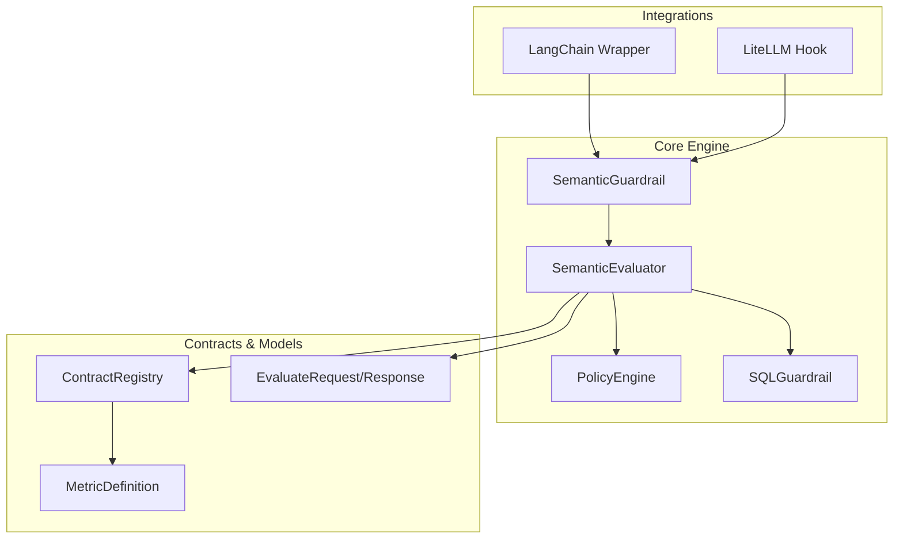
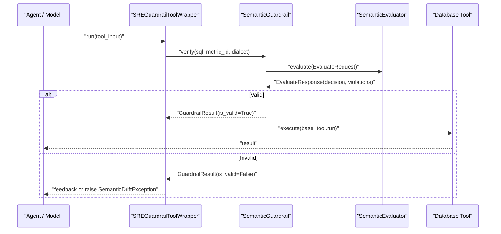
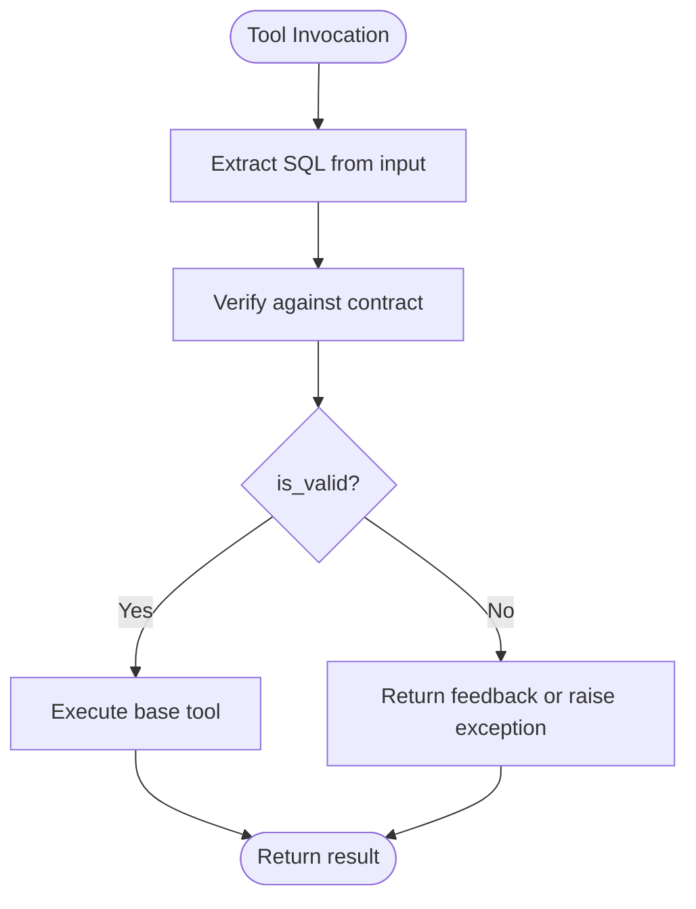
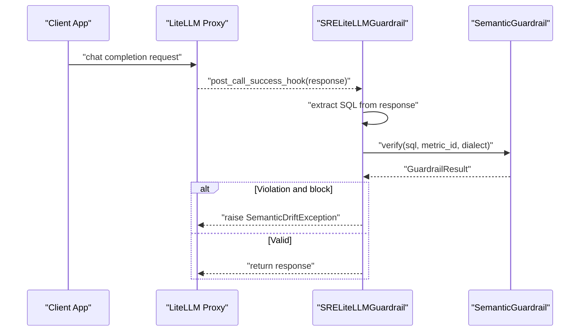
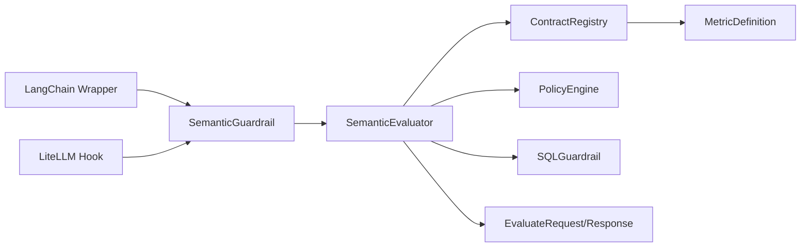

# Framework Integrations

<cite>
**Referenced Files in This Document**
- [README.md](file://README.md)
- [langchain.py](file://semantic_reliability/integrations/langchain.py)
- [litellm.py](file://semantic_reliability/integrations/litellm.py)
- [guardrail.py](file://semantic_reliability/guardrail.py)
- [engine.py](file://semantic_reliability/firewall/engine.py)
- [models.py](file://semantic_reliability/firewall/models.py)
- [schema.py](file://semantic_reliability/compiler/schema.py)
- [sql_guardrail.py](file://semantic_reliability/runtime/sql_guardrail.py)
- [handlers.py](file://semantic_reliability/mcp/handlers.py)
- [agent.py](file://demo/agent.py)
- [test_guardrail_and_integrations.py](file://tests/test_guardrail_and_integrations.py)
</cite>

## Table of Contents
1. [Introduction](#introduction)
2. [Project Structure](#project-structure)
3. [Core Components](#core-components)
4. [Architecture Overview](#architecture-overview)
5. [Detailed Component Analysis](#detailed-component-analysis)
6. [Dependency Analysis](#dependency-analysis)
7. [Performance Considerations](#performance-considerations)
8. [Troubleshooting Guide](#troubleshooting-guide)
9. [Conclusion](#conclusion)
10. [Appendices](#appendices)

## Introduction
This document explains how to integrate the Semantic Reliability Engine (SRE) with popular AI frameworks to ensure that AI-generated SQL queries adhere to business metric contracts before execution. It covers:
- LangChain integration: tool registration, prompt templates, and chain composition patterns for agent-driven SQL generation with guardrails.
- LiteLLM integration: multi-model support and routing strategies with a post-call hook to validate LLM outputs.
- Guardrail tool wrapper implementation: intercepting and validating agent queries before execution, including self-correction feedback.
- Setup instructions, configuration options, and troubleshooting guidance for production deployments.
- Code examples demonstrating common integration patterns and best practices.

The SRE enforces deterministic semantic correctness by parsing generated SQL into an AST and comparing it against SCOS metric contracts, returning structured decisions and remediation hints.

**Section sources**
- [README.md:22-45](file://README.md#L22-L45)
- [README.md:49-89](file://README.md#L49-L89)

## Project Structure
The integrations are implemented as thin wrappers around the core guardrail engine:
- LangChain integration provides a tool wrapper and callback handler to intercept and validate SQL at tool call boundaries.
- LiteLLM integration provides a custom guardrail hook that inspects model responses and validates embedded SQL.
- The core guardrail uses a contract registry, semantic evaluator, policy engine, and runtime structural guardrail to enforce safety and compliance.

**Diagram sources**
- [langchain.py:12-111](file://semantic_reliability/integrations/langchain.py#L12-L111)
- [litellm.py:13-95](file://semantic_reliability/integrations/litellm.py#L13-L95)
- [guardrail.py:45-153](file://semantic_reliability/guardrail.py#L45-L153)
- [engine.py:18-132](file://semantic_reliability/firewall/engine.py#L18-L132)
- [sql_guardrail.py:71-102](file://semantic_reliability/runtime/sql_guardrail.py#L71-L102)
- [schema.py:83-98](file://semantic_reliability/compiler/schema.py#L83-L98)
- [models.py:20-51](file://semantic_reliability/firewall/models.py#L20-L51)

**Section sources**
- [langchain.py:12-111](file://semantic_reliability/integrations/langchain.py#L12-L111)
- [litellm.py:13-95](file://semantic_reliability/integrations/litellm.py#L13-L95)
- [guardrail.py:45-153](file://semantic_reliability/guardrail.py#L45-L153)
- [engine.py:18-132](file://semantic_reliability/firewall/engine.py#L18-L132)
- [sql_guardrail.py:71-102](file://semantic_reliability/runtime/sql_guardrail.py#L71-L102)
- [schema.py:83-98](file://semantic_reliability/compiler/schema.py#L83-L98)
- [models.py:20-51](file://semantic_reliability/firewall/models.py#L20-L51)

## Core Components
- SemanticGuardrail: High-level API to verify SQL against metric contracts, compute drift scores, and raise exceptions when violations occur.
- ContractRegistry: Loads and manages metric definitions from YAML files or directories.
- SemanticEvaluator: Parses SQL, validates against contracts, applies policy decisions, and records audit traces.
- PolicyEngine: Determines ALLOW/AUDIT/REQUIRE_REVIEW/DENY based on violation severity and strict mode.
- SQLGuardrail: Structural guardrail enforcing SELECT-only statements and safe LIMITs.
- Integration Wrappers:
  - SREGuardrailToolWrapper: LangChain tool wrapper that intercepts SQL, validates, and either executes or returns feedback.
  - SREGuardrailCallback: LangChain callback to observe and optionally block SQL queries during tool start events.
  - SRELiteLLMGuardrail: LiteLLM hook to extract and validate SQL from model responses.

**Section sources**
- [guardrail.py:13-153](file://semantic_reliability/guardrail.py#L13-L153)
- [engine.py:18-132](file://semantic_reliability/firewall/engine.py#L18-L132)
- [sql_guardrail.py:34-102](file://semantic_reliability/runtime/sql_guardrail.py#L34-L102)
- [langchain.py:12-149](file://semantic_reliability/integrations/langchain.py#L12-L149)
- [litellm.py:13-95](file://semantic_reliability/integrations/litellm.py#L13-L95)

## Architecture Overview
The integration architecture ensures that any SQL generated by agents or models is validated against business metric contracts before execution. The flow includes:
- Tool invocation or model response capture.
- SQL extraction and validation via SemanticGuardrail.
- Policy decision and optional exception raising or feedback return.
- Execution only if allowed; otherwise, agent self-correction or retry.

**Diagram sources**
- [langchain.py:60-97](file://semantic_reliability/integrations/langchain.py#L60-L97)
- [guardrail.py:91-136](file://semantic_reliability/guardrail.py#L91-L136)
- [engine.py:54-116](file://semantic_reliability/firewall/engine.py#L54-L116)

**Section sources**
- [langchain.py:60-97](file://semantic_reliability/integrations/langchain.py#L60-L97)
- [guardrail.py:91-136](file://semantic_reliability/guardrail.py#L91-L136)
- [engine.py:54-116](file://semantic_reliability/firewall/engine.py#L54-L116)

## Detailed Component Analysis

### LangChain Integration
- Tool Registration: Wrap any database execution tool with SREGuardrailToolWrapper to intercept SQL, validate it against the metric contract, and either execute or return diagnostic feedback.
- Prompt Templates: Use MCP prompt templates to guide LLM query generation with explicit invariants and repair prompts to fix violations without silent rewrites.
- Chain Composition Patterns: Compose chains where tools are guarded, and callbacks can observe and block invalid queries early.

Key behaviors:
- Extracts SQL from string or dict inputs.
- Validates via SemanticGuardrail.verify.
- Returns formatted feedback for self-correction or raises SemanticDriftException depending on configuration.
- Supports both sync and async execution paths.

**Diagram sources**
- [langchain.py:48-111](file://semantic_reliability/integrations/langchain.py#L48-L111)

Setup and usage:
- Initialize the wrapper with a base tool and contract path.
- Configure raise_on_drift to control behavior on violations.
- Optionally use SREGuardrailCallback to observe tool start events and block on drift.

Best practices:
- Provide clear metric_id and dialect to ensure accurate validation.
- Use raise_on_drift=False in development to enable agent self-correction loops.
- Log intercepted queries for auditing and debugging.

**Section sources**
- [langchain.py:12-149](file://semantic_reliability/integrations/langchain.py#L12-L149)
- [handlers.py:355-408](file://semantic_reliability/mcp/handlers.py#L355-L408)
- [test_guardrail_and_integrations.py:57-96](file://tests/test_guardrail_and_integrations.py#L57-L96)

### LiteLLM Integration
- Multi-model Support: Register SRELiteLLMGuardrail as a LiteLLM callback to intercept responses across providers.
- Routing Strategies: Combine with LiteLLM’s provider routing to enforce guardrails uniformly regardless of model selection.
- Post-call Hook: Extract SQL from tool calls or markdown code blocks and validate; raise exception or allow response based on configuration.

Key behaviors:
- Extracts SQL from choices/message/tool_calls or content text.
- Validates via SemanticGuardrail.verify.
- Raises SemanticDriftException when block_on_violation is True and violations are detected.

**Diagram sources**
- [litellm.py:39-95](file://semantic_reliability/integrations/litellm.py#L39-L95)
- [guardrail.py:91-136](file://semantic_reliability/guardrail.py#L91-L136)

Setup and usage:
- Instantiate SRELiteLLMGuardrail with contract_path and optional metric_id/dialect.
- Assign to litellm.callbacks to enable global enforcement.
- Configure block_on_violation to control exception behavior.

Best practices:
- Ensure consistent metric_id and dialect across routes.
- Monitor logs for extraction failures and adjust extraction logic as needed.
- Use structured prompts to encourage LLMs to output SQL in predictable formats.

**Section sources**
- [litellm.py:13-95](file://semantic_reliability/integrations/litellm.py#L13-L95)
- [test_guardrail_and_integrations.py:98-124](file://tests/test_guardrail_and_integrations.py#L98-L124)

### Guardrail Tool Wrapper Implementation
- Intercepting Queries: The wrapper extracts SQL from various input formats and validates using SemanticGuardrail.
- Validating Before Execution: If valid, forwards to the underlying tool; if invalid, returns feedback or raises an exception.
- Self-Correction Feedback: Provides detailed diagnostics to help agents regenerate compliant SQL.

Configuration options:
- contract_path: Path to SCOS metric contract YAML or directory.
- metric_id: Target metric identifier for evaluation.
- dialect: SQL dialect for parsing and validation.
- raise_on_drift: Boolean to control whether to raise exceptions or return feedback.

Error handling:
- SemanticDriftException carries structured results with violations and remediation hints.
- Logging captures intercepted queries for observability.

**Section sources**
- [langchain.py:26-111](file://semantic_reliability/integrations/langchain.py#L26-L111)
- [guardrail.py:13-26](file://semantic_reliability/guardrail.py#L13-L26)

### Prompt Templates and Chain Composition
- Prompt Templates: MCP handlers expose prompts to guide LLMs with explicit invariants and repair instructions.
- Chain Composition: Combine guarded tools with callbacks to build robust agent workflows that enforce semantic correctness throughout the chain.

Usage patterns:
- scos_generate_sql_guidance: Injects metric invariants into prompts to steer generation.
- scos_repair_contract_violation: Explains violations and instructs regeneration without silent rewrites.

**Section sources**
- [handlers.py:355-408](file://semantic_reliability/mcp/handlers.py#L355-L408)

## Dependency Analysis
The integrations depend on core components for contract management, evaluation, and policy decisions.

**Diagram sources**
- [langchain.py:12-111](file://semantic_reliability/integrations/langchain.py#L12-L111)
- [litellm.py:13-95](file://semantic_reliability/integrations/litellm.py#L13-L95)
- [guardrail.py:45-153](file://semantic_reliability/guardrail.py#L45-L153)
- [engine.py:18-132](file://semantic_reliability/firewall/engine.py#L18-L132)
- [sql_guardrail.py:71-102](file://semantic_reliability/runtime/sql_guardrail.py#L71-L102)
- [schema.py:83-98](file://semantic_reliability/compiler/schema.py#L83-L98)
- [models.py:20-51](file://semantic_reliability/firewall/models.py#L20-L51)

**Section sources**
- [engine.py:18-132](file://semantic_reliability/firewall/engine.py#L18-L132)
- [models.py:20-51](file://semantic_reliability/firewall/models.py#L20-L51)
- [schema.py:83-98](file://semantic_reliability/compiler/schema.py#L83-L98)

## Performance Considerations
- Parsing Overhead: SQL parsing occurs per query; batch processing or caching parsed ASTs may reduce overhead in high-throughput scenarios.
- Policy Evaluation: Strict mode increases blocking frequency; tune strict_mode based on operational risk tolerance.
- Extraction Efficiency: LiteLLM extraction relies on regex; ensure consistent output formatting to minimize retries.
- Audit Logging: Enable logging judiciously to avoid performance degradation in production.

[No sources needed since this section provides general guidance]

## Troubleshooting Guide
Common issues and resolutions:
- Unparseable SQL: The evaluator denies execution and returns parse error messages; verify dialect and syntax.
- Missing Metric Contract: Ensure contract_path points to a valid YAML file or directory containing metric definitions.
- Extraction Failures: Adjust LiteLLM prompt templates to produce predictable SQL formats; check logs for extraction errors.
- Unexpected Blocks: Review violations and remediation hints; update prompts or contracts as needed.

Operational tips:
- Use raise_on_drift=False during development to enable agent self-correction loops.
- Monitor SemanticDriftException occurrences and log details for analysis.
- Validate contracts regularly to reflect evolving business rules.

**Section sources**
- [engine.py:54-84](file://semantic_reliability/firewall/engine.py#L54-L84)
- [guardrail.py:91-136](file://semantic_reliability/guardrail.py#L91-L136)
- [litellm.py:39-71](file://semantic_reliability/integrations/litellm.py#L39-L71)

## Conclusion
The Semantic Reliability Engine provides robust, deterministic guardrails for AI-generated SQL across LangChain and LiteLLM integrations. By wrapping tools and hooks, enforcing contracts, and offering actionable feedback, SRE enables safe, reliable analytics pipelines in production environments. Adopting these patterns ensures that agents and models generate semantically correct queries aligned with business metrics.

[No sources needed since this section summarizes without analyzing specific files]

## Appendices

### Setup Instructions
- Install dependencies and configure environment variables for your LLM providers.
- Prepare SCOS metric contracts in YAML format under a known directory.
- Initialize guards and wrappers as shown in the quickstart examples.

**Section sources**
- [README.md:49-89](file://README.md#L49-L89)

### Configuration Options
- SemanticGuardrail:
  - contract_path: Path to contract YAML or directory.
  - metric_id: Target metric identifier.
  - dialect: SQL dialect for parsing.
- SREGuardrailToolWrapper:
  - raise_on_drift: Control exception vs feedback behavior.
- SRELiteLLMGuardrail:
  - block_on_violation: Control exception behavior in hooks.

**Section sources**
- [guardrail.py:53-89](file://semantic_reliability/guardrail.py#L53-L89)
- [langchain.py:26-38](file://semantic_reliability/integrations/langchain.py#L26-L38)
- [litellm.py:27-37](file://semantic_reliability/integrations/litellm.py#L27-L37)

### Best Practices for Production Deployments
- Centralize contract management and versioning.
- Enforce strict mode in critical environments; relax for staging.
- Implement comprehensive logging and monitoring for guardrail events.
- Regularly review and update prompts to improve LLM output quality.

[No sources needed since this section provides general guidance]