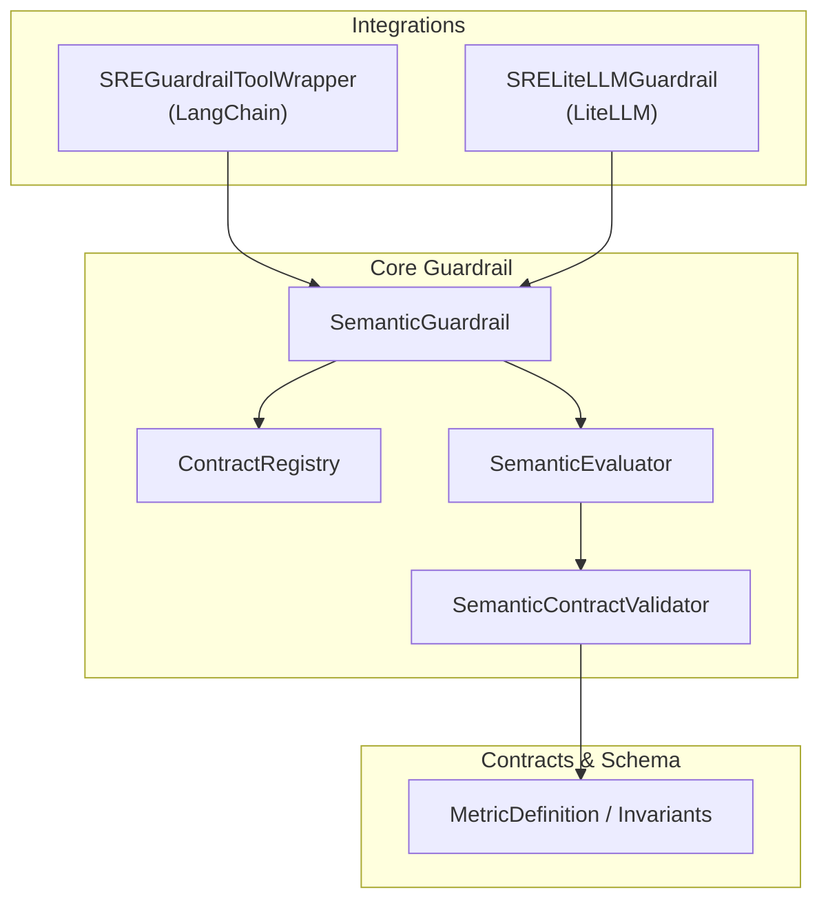
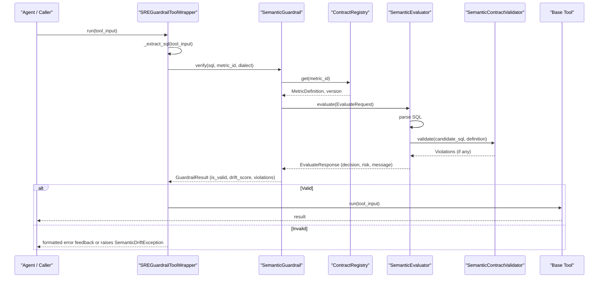
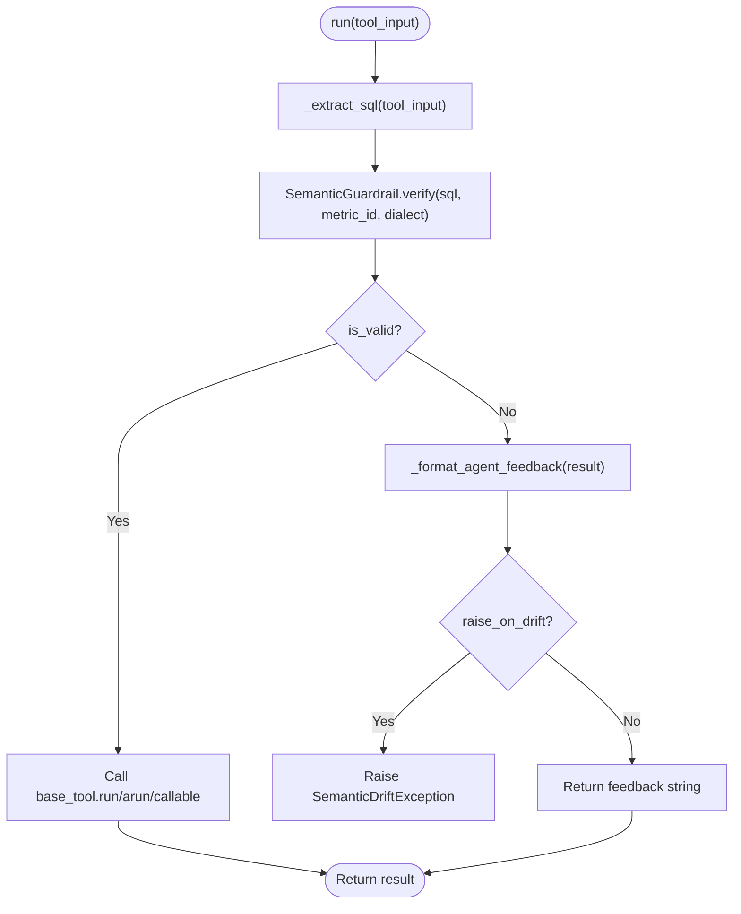
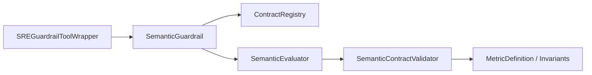

# Guardrail Tool Wrapper

<cite>
**Referenced Files in This Document**
- [guardrail.py](file://semantic_reliability/guardrail.py)
- [langchain.py](file://semantic_reliability/integrations/langchain.py)
- [litellm.py](file://semantic_reliability/integrations/litellm.py)
- [engine.py](file://semantic_reliability/firewall/engine.py)
- [contracts.py](file://semantic_reliability/compiler/contracts.py)
- [schema.py](file://semantic_reliability/compiler/schema.py)
- [test_guardrail_and_integrations.py](file://tests/test_guardrail_and_integrations.py)
</cite>

## Table of Contents
1. [Introduction](#introduction)
2. [Project Structure](#project-structure)
3. [Core Components](#core-components)
4. [Architecture Overview](#architecture-overview)
5. [Detailed Component Analysis](#detailed-component-analysis)
6. [Dependency Analysis](#dependency-analysis)
7. [Performance Considerations](#performance-considerations)
8. [Troubleshooting Guide](#troubleshooting-guide)
9. [Conclusion](#conclusion)
10. [Appendices](#appendices)

## Introduction
This document explains the core guardrail tool wrapper functionality that enables semantic validation across different frameworks. It focuses on the SREGuardrailToolWrapper implementation, SQL extraction logic, contract loading, and the end-to-end validation flow. It also covers error handling strategies (including SemanticDriftException), custom feedback formatting, examples for extending the wrapper for custom tools, implementing custom validation rules, and integrating with different database backends. Finally, it provides troubleshooting guidance and performance optimization techniques.

## Project Structure
The guardrail system is composed of:
- A high-level guardrail API that loads contracts and evaluates SQL against policy-backed invariants.
- Framework integrations that wrap existing tools or hooks to enforce semantic checks before execution.
- Contract registry and validator components that parse and enforce business invariants defined in YAML.
- Tests that demonstrate usage patterns and expected behaviors.

**Diagram sources**
- [langchain.py:12-111](file://semantic_reliability/integrations/langchain.py#L12-L111)
- [litellm.py:13-95](file://semantic_reliability/integrations/litellm.py#L13-L95)
- [guardrail.py:46-158](file://semantic_reliability/guardrail.py#L46-L158)
- [engine.py:19-133](file://semantic_reliability/firewall/engine.py#L19-L133)
- [contracts.py:26-135](file://semantic_reliability/compiler/contracts.py#L26-L135)
- [schema.py:5-98](file://semantic_reliability/compiler/schema.py#L5-L98)

**Section sources**
- [guardrail.py:46-158](file://semantic_reliability/guardrail.py#L46-L158)
- [engine.py:19-133](file://semantic_reliability/firewall/engine.py#L19-L133)
- [contracts.py:26-135](file://semantic_reliability/compiler/contracts.py#L26-L135)
- [schema.py:5-98](file://semantic_reliability/compiler/schema.py#L5-L98)
- [langchain.py:12-111](file://semantic_reliability/integrations/langchain.py#L12-L111)
- [litellm.py:13-95](file://semantic_reliability/integrations/litellm.py#L13-L95)

## Core Components
- SemanticGuardrail: High-level entry point to load contracts from files/directories or MetricDefinition objects, evaluate candidate SQL, and optionally intercept execution by raising exceptions on violations.
- SREGuardrailToolWrapper: Wraps a base tool (e.g., LangChain SQL tool) to validate SQL before execution. Supports synchronous and asynchronous flows, configurable raise-on-drift behavior, and agent-friendly feedback.
- SRELiteLLMGuardrail: LiteLLM hook that extracts SQL from LLM responses and validates them; can block on violation.
- ContractRegistry: Loads and stores metric definitions from YAML files, supporting versioning and directory scanning.
- SemanticEvaluator: Orchestrates evaluation by parsing SQL, running contract validation, applying policy decisions, and recording audit traces.
- SemanticContractValidator: Enforces declarative invariants (population filters, grain dimensions, aggregation components, timezone constraints).

Key responsibilities:
- Extract SQL from varied inputs (strings, dicts, complex objects).
- Load and register contracts.
- Validate SQL against invariants and compute drift scores.
- Provide consistent feedback and exception types for integration points.

**Section sources**
- [guardrail.py:14-158](file://semantic_reliability/guardrail.py#L14-L158)
- [langchain.py:12-111](file://semantic_reliability/integrations/langchain.py#L12-L111)
- [litellm.py:13-95](file://semantic_reliability/integrations/litellm.py#L13-L95)
- [engine.py:19-133](file://semantic_reliability/firewall/engine.py#L19-L133)
- [contracts.py:26-135](file://semantic_reliability/compiler/contracts.py#L26-L135)

## Architecture Overview
The validation flow integrates framework-specific wrappers with a centralized guardrail engine:

**Diagram sources**
- [langchain.py:48-111](file://semantic_reliability/integrations/langchain.py#L48-L111)
- [guardrail.py:92-158](file://semantic_reliability/guardrail.py#L92-L158)
- [engine.py:55-117](file://semantic_reliability/firewall/engine.py#L55-L117)
- [contracts.py:29-135](file://semantic_reliability/compiler/contracts.py#L29-L135)

## Detailed Component Analysis

### SREGuardrailToolWrapper
Responsibilities:
- Intercept tool calls and extract SQL from various input formats.
- Validate SQL using SemanticGuardrail.
- Forward valid queries to the underlying tool; return structured feedback or raise exceptions on invalid queries.

SQL extraction logic (_extract_sql):
- Handles string inputs directly.
- Handles dictionary inputs by looking up common keys ("query", "sql", "input") and falling back to string representation.
- For other object types, coerces to string.

Validation flow:
- Calls SemanticGuardrail.verify with metric_id and dialect.
- If not valid:
  - Formats agent-friendly feedback via _format_agent_feedback.
  - Optionally raises SemanticDriftException if configured.
  - Otherwise returns the feedback string to allow self-correction loops.
- If valid:
  - Invokes the base tool’s run/arun/callable interface.

Asynchronous support:
- arun mirrors run behavior for async base tools.

Customization points:
- raise_on_drift controls whether to raise exceptions or return feedback.
- metric_id and dialect can be set per wrapper instance.
- name and description are forwarded from the base tool when available.

**Diagram sources**
- [langchain.py:48-111](file://semantic_reliability/integrations/langchain.py#L48-L111)
- [guardrail.py:92-158](file://semantic_reliability/guardrail.py#L92-L158)

**Section sources**
- [langchain.py:12-111](file://semantic_reliability/integrations/langchain.py#L12-L111)
- [test_guardrail_and_integrations.py:57-96](file://tests/test_guardrail_and_integrations.py#L57-L96)

### SemanticGuardrail
Responsibilities:
- Load contracts from file paths, directories, or MetricDefinition objects.
- Evaluate candidate SQL against registered metrics and policies.
- Compute drift score and produce GuardrailResult with decision, risk, and remediation hints.
- Provide intercept method to block execution by raising SemanticDriftException on violations.

Contract loading:
- Accepts single contract file or directory; scans YAML files and registers each metric with version metadata.
- Raises errors for missing files or empty directories.

Evaluation:
- Builds EvaluateRequest and delegates to SemanticEvaluator.
- Computes semantic drift distance between candidate and canonical SQL when possible; falls back to binary decision based on compliance.

Intercept:
- Convenience method to validate and raise on non-compliant SQL.

**Section sources**
- [guardrail.py:14-158](file://semantic_reliability/guardrail.py#L14-L158)
- [engine.py:19-133](file://semantic_reliability/firewall/engine.py#L19-L133)

### Contract Registry and Evaluation Engine
ContractRegistry:
- Scans directories for YAML files containing metric definitions.
- Registers metrics with versions and supports retrieval by metric_id.

SemanticEvaluator:
- Parses SQL using sqlglot; denies unparseable SQL.
- Runs SemanticContractValidator to check invariants.
- Applies PolicyEngine to determine decision and risk.
- Records immutable audit traces including SQL hash and violations.

**Section sources**
- [engine.py:19-133](file://semantic_reliability/firewall/engine.py#L19-L133)
- [contracts.py:26-135](file://semantic_reliability/compiler/contracts.py#L26-L135)

### SemanticContractValidator
Validates candidate SQL against declared invariants:
- Population invariant: ensures required filters exist and forbidden filters do not appear.
- Grain invariant: ensures required grouping dimensions are present.
- Aggregation invariant: ensures positive/negative components are included in net calculations.
- Timezone invariant: enforces UTC alignment where required.

Returns structured violations with severity and remediation guidance.

**Section sources**
- [contracts.py:26-135](file://semantic_reliability/compiler/contracts.py#L26-L135)
- [schema.py:5-98](file://semantic_reliability/compiler/schema.py#L5-L98)

### LiteLLM Integration
SRELiteLLMGuardrail:
- Extracts SQL from LLM responses (tool call arguments or markdown code blocks).
- Validates extracted SQL via SemanticGuardrail.
- Can block execution by raising SemanticDriftException on violations.

**Section sources**
- [litellm.py:13-95](file://semantic_reliability/integrations/litellm.py#L13-L95)
- [test_guardrail_and_integrations.py:98-124](file://tests/test_guardrail_and_integrations.py#L98-L124)

## Dependency Analysis
The wrapper depends on:
- SemanticGuardrail for contract-based validation and drift scoring.
- ContractRegistry for loading metric definitions from YAML.
- SemanticEvaluator for orchestrating parsing, validation, and policy decisions.
- SemanticContractValidator for enforcing invariants.
- Optional integrations (LangChain, LiteLLM) for framework-specific interception.

**Diagram sources**
- [langchain.py:12-111](file://semantic_reliability/integrations/langchain.py#L12-L111)
- [guardrail.py:46-158](file://semantic_reliability/guardrail.py#L46-L158)
- [engine.py:19-133](file://semantic_reliability/firewall/engine.py#L19-L133)
- [contracts.py:26-135](file://semantic_reliability/compiler/contracts.py#L26-L135)
- [schema.py:5-98](file://semantic_reliability/compiler/schema.py#L5-L98)

**Section sources**
- [langchain.py:12-111](file://semantic_reliability/integrations/langchain.py#L12-L111)
- [guardrail.py:46-158](file://semantic_reliability/guardrail.py#L46-L158)
- [engine.py:19-133](file://semantic_reliability/firewall/engine.py#L19-L133)
- [contracts.py:26-135](file://semantic_reliability/compiler/contracts.py#L26-L135)
- [schema.py:5-98](file://semantic_reliability/compiler/schema.py#L5-L98)

## Performance Considerations
- Caching contracts: ContractRegistry loads YAML files once per instance; reuse instances to avoid repeated I/O.
- Minimal parsing overhead: SQL parsing occurs only for candidate queries; ensure dialect is specified to reduce ambiguity.
- Drift distance computation: semantic_drift_distance may be expensive; consider caching results for identical candidate-contract pairs.
- Async execution: Use arun for async base tools to avoid blocking threads during long-running queries.
- Logging: Keep logging levels appropriate; excessive warnings can impact throughput in high-volume environments.

[No sources needed since this section provides general guidance]

## Troubleshooting Guide
Common issues and resolutions:
- Unparseable SQL: The evaluator denies execution and returns a parse error message. Ensure SQL conforms to the specified dialect.
- Missing contract: ContractRegistry.get raises an error if the metric_id is unknown. Verify metric registration and correct metric_id.
- Violation feedback: When raise_on_drift=False, the wrapper returns a structured error message; use it to guide LLM self-correction.
- Exception handling: When raise_on_drift=True, catch SemanticDriftException to handle blocked execution gracefully.
- Dialect mismatch: Specify the correct dialect in wrapper initialization to ensure accurate parsing and validation.

Error types and messages:
- SemanticDriftException includes drift score, decision, violations, and optional remediation hint.
- GuardrailResult encapsulates validation status, drift score, violations, decision, risk, metric_id, SQL, and raw response.

**Section sources**
- [guardrail.py:14-44](file://semantic_reliability/guardrail.py#L14-L44)
- [guardrail.py:92-158](file://semantic_reliability/guardrail.py#L92-L158)
- [engine.py:55-117](file://semantic_reliability/firewall/engine.py#L55-L117)
- [test_guardrail_and_integrations.py:22-55](file://tests/test_guardrail_and_integrations.py#L22-L55)

## Conclusion
The guardrail tool wrapper provides robust semantic validation for SQL generated by AI agents across multiple frameworks. By intercepting tool calls, extracting SQL, and validating against declarative contracts, it prevents silent metric corruption and enforces business invariants. The design supports flexible configuration, clear feedback, and extensibility for custom tools and validation rules.

[No sources needed since this section summarizes without analyzing specific files]

## Appendices

### Extending the Wrapper for Custom Tools
- Implement a wrapper class similar to SREGuardrailToolWrapper:
  - Add _extract_sql to handle your tool’s input format.
  - Call SemanticGuardrail.verify and handle results accordingly.
  - Forward to your tool’s run/arun/callable interface when valid.
  - Configure raise_on_drift based on your application’s error-handling strategy.

Example pattern:
- Wrap a custom SQL executor with contract validation.
- Return structured feedback for self-correction loops or raise exceptions for strict enforcement.

**Section sources**
- [langchain.py:48-111](file://semantic_reliability/integrations/langchain.py#L48-L111)
- [guardrail.py:92-158](file://semantic_reliability/guardrail.py#L92-L158)

### Implementing Custom Validation Rules
- Extend SemanticContractValidator to add new invariant checks:
  - Define new invariant categories and rules.
  - Integrate into the validation pipeline to produce violations with severity and remediation guidance.
- Register additional probes in MetricDefinition to monitor runtime semantics.

**Section sources**
- [contracts.py:26-135](file://semantic_reliability/compiler/contracts.py#L26-L135)
- [schema.py:5-98](file://semantic_reliability/compiler/schema.py#L5-L98)

### Integrating with Different Database Backends
- Specify dialect in wrapper initialization to match your backend (e.g., duckdb, postgres, bigquery).
- Ensure canonical SQL in contracts uses the same dialect or configure dialect mapping appropriately.
- Use SemanticEvaluator’s parse step to detect dialect-specific syntax issues early.

**Section sources**
- [langchain.py:26-38](file://semantic_reliability/integrations/langchain.py#L26-L38)
- [engine.py:55-85](file://semantic_reliability/firewall/engine.py#L55-L85)