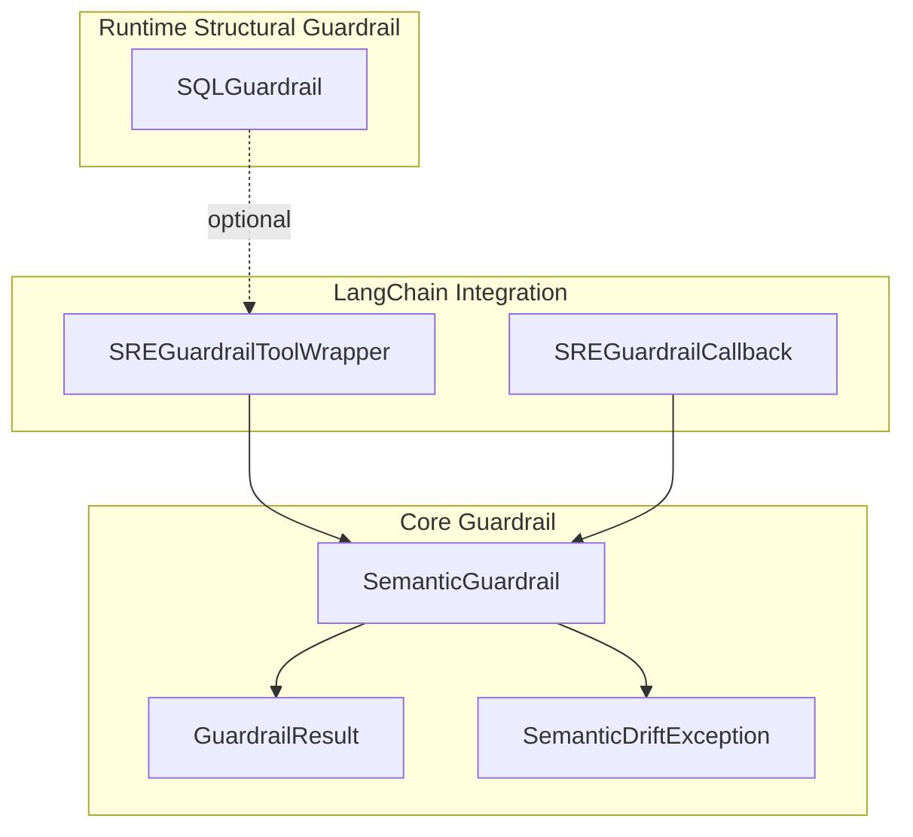
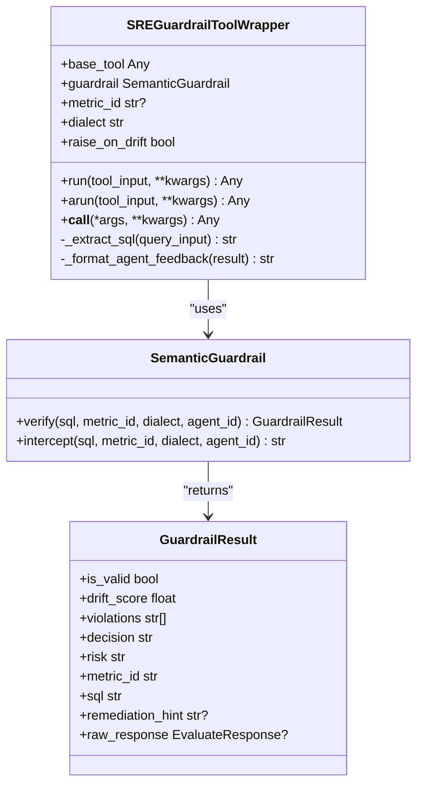
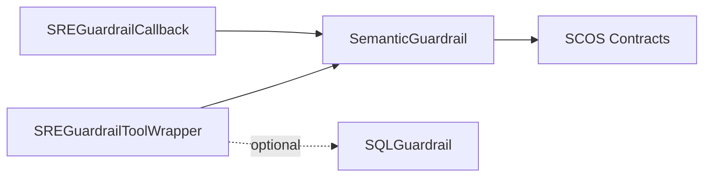

# LangChain Integration

<cite>
**Referenced Files in This Document**
- [langchain.py](file://semantic_reliability/integrations/langchain.py)
- [guardrail.py](file://semantic_reliability/guardrail.py)
- [sql_guardrail.py](file://semantic_reliability/runtime/sql_guardrail.py)
- [test_guardrail_and_integrations.py](file://tests/test_guardrail_and_integrations.py)
- [contract.yaml](file://benchmark_corpus/dev/net_revenue/contract.yaml)
</cite>

## Table of Contents
1. [Introduction](#introduction)
2. [Project Structure](#project-structure)
3. [Core Components](#core-components)
4. [Architecture Overview](#architecture-overview)
5. [Detailed Component Analysis](#detailed-component-analysis)
6. [Dependency Analysis](#dependency-analysis)
7. [Performance Considerations](#performance-considerations)
8. [Troubleshooting Guide](#troubleshooting-guide)
9. [Conclusion](#conclusion)
10. [Appendices](#appendices)

## Introduction
This document explains how to integrate the Semantic Reliability Engine (SRE) with LangChain to enforce semantic contracts on SQL queries generated by AI agents. It focuses on:
- SREGuardrailToolWrapper: a wrapper that intercepts SQL from LangChain tools, validates it against SCOS contracts, and either executes or returns structured feedback.
- SREGuardrailCallback: a callback hook for observing semantic drift events during chain execution.
- Configuration options such as contract_path, metric_id, dialect, and raise_on_drift.
- Practical usage patterns including wrapping existing SQL tools, building guarded chains, handling drift exceptions, and implementing custom feedback loops.

## Project Structure
The LangChain integration lives under semantic_reliability/integrations/langchain.py and relies on the core guardrail logic in semantic_reliability/guardrail.py. A runtime structural guardrail is available in semantic_reliability/runtime/sql_guardrail.py for AST-level enforcement. Tests demonstrate end-to-end behavior and usage patterns.



**Diagram sources**
- [langchain.py:12-148](file://semantic_reliability/integrations/langchain.py#L12-L148)
- [guardrail.py:13-153](file://semantic_reliability/guardrail.py#L13-L153)
- [sql_guardrail.py:71-102](file://semantic_reliability/runtime/sql_guardrail.py#L71-L102)

**Section sources**
- [langchain.py:1-148](file://semantic_reliability/integrations/langchain.py#L1-L148)
- [guardrail.py:1-153](file://semantic_reliability/guardrail.py#L1-L153)
- [sql_guardrail.py:1-102](file://semantic_reliability/runtime/sql_guardrail.py#L1-L102)

## Core Components
- SREGuardrailToolWrapper: Wraps any LangChain tool that runs SQL. It extracts the SQL, verifies it against a metric contract, and either forwards execution or returns agent-friendly feedback. Supports synchronous run() and asynchronous arun().
- SREGuardrailCallback: Implements a BaseCallbackHandler-compatible interface to observe SQL queries at tool start, evaluate them, and optionally block execution on drift.
- SemanticGuardrail: Loads contracts and evaluates SQL against invariants, returning a GuardrailResult with validity, drift score, violations, decision, risk, and remediation hints.
- SQLGuardrail: Enforces structural constraints (SELECT-only, LIMIT caps) using an AST parser.

Key configuration parameters:
- contract_path: Path to a SCOS contract YAML file or directory containing multiple contracts.
- metric_id: Optional override to target a specific metric when multiple are registered.
- dialect: SQL dialect used for parsing and evaluation (default duckdb).
- raise_on_drift: When True, raises SemanticDriftException on violation; otherwise returns formatted feedback to the agent.

**Section sources**
- [langchain.py:26-97](file://semantic_reliability/integrations/langchain.py#L26-L97)
- [guardrail.py:45-153](file://semantic_reliability/guardrail.py#L45-L153)
- [sql_guardrail.py:71-102](file://semantic_reliability/runtime/sql_guardrail.py#L71-L102)

## Architecture Overview
The integration sits between LangChain tools and the underlying database. On each call:
1. The wrapper extracts the SQL string from the tool input.
2. SemanticGuardrail.verify evaluates the SQL against the specified metric contract.
3. If valid, the base tool executes; if invalid, either feedback is returned or an exception is raised based on configuration.
4. The callback can independently observe and optionally block SQL at tool start.

```mermaid
sequenceDiagram
participant Agent as "LangChain Agent"
participant Tool as "SREGuardrailToolWrapper"
participant Guardrail as "SemanticGuardrail"
participant DB as "Base SQL Tool / Database"
Agent->>Tool : run(tool_input)
Tool->>Tool : _extract_sql(tool_input)
Tool->>Guardrail : verify(sql, metric_id, dialect)
Guardrail-->>Tool : GuardrailResult
alt Valid
Tool->>DB : execute(base_tool.run/arun)
DB-->>Agent : result
else Invalid
Tool->>Tool : _format_agent_feedback(result)
opt raise_on_drift=True
Tool-->>Agent : SemanticDriftException
else raise_on_drift=False
Tool-->>Agent : Feedback message
end
end
```

**Diagram sources**
- [langchain.py:60-97](file://semantic_reliability/integrations/langchain.py#L60-L97)
- [guardrail.py:91-136](file://semantic_reliability/guardrail.py#L91-L136)

## Detailed Component Analysis

### SREGuardrailToolWrapper
Responsibilities:
- Intercept SQL from any LangChain tool that accepts a query string or dict.
- Validate via SemanticGuardrail.verify with configurable metric_id and dialect.
- Provide two execution modes:
  - Non-blocking: return a structured error message to guide the LLM to self-correct.
  - Blocking: raise SemanticDriftException to halt execution immediately.
- Support both sync run() and async arun(), forwarding to the underlying tool’s corresponding method.

Configuration:
- contract_path: Required path to a contract YAML or directory.
- metric_id: Optional override to select a specific metric.
- dialect: SQL dialect for parsing (default duckdb).
- raise_on_drift: Boolean to switch between feedback vs exception.

Behavior highlights:
- Extracts SQL from string or dict inputs.
- Logs warnings on interception.
- Forwards name/description metadata to preserve tool identity.

Usage patterns:
- Wrap QuerySQLDataBaseTool or similar tools to add semantic checks without changing agent code.
- Use raise_on_drift=False for self-correction loops where the agent retries with improved SQL.
- Use raise_on_drift=True for strict pipelines that must fail fast on drift.

**Section sources**
- [langchain.py:12-111](file://semantic_reliability/integrations/langchain.py#L12-L111)
- [test_guardrail_and_integrations.py:57-95](file://tests/test_guardrail_and_integrations.py#L57-L95)

#### Class Diagram


**Diagram sources**
- [langchain.py:12-111](file://semantic_reliability/integrations/langchain.py#L12-L111)
- [guardrail.py:28-153](file://semantic_reliability/guardrail.py#L28-L153)

### SREGuardrailCallback
Responsibilities:
- Hook into LangChain’s tool lifecycle via on_tool_start.
- Detect SQL-like inputs by keywords (SELECT/FROM/WHERE/JOIN).
- Verify SQL against the configured contract and record traces.
- Optionally block execution by raising SemanticDriftException when block_on_drift is enabled.

Configuration:
- contract_path: Required path to a contract YAML or directory.
- metric_id: Optional override to target a specific metric.
- dialect: SQL dialect for parsing (default duckdb).
- block_on_drift: When True, raises SemanticDriftException on violation; otherwise logs and records traces.

Observability:
- Maintains a traces list capturing SQL, validity, drift score, and violations for downstream monitoring or dashboards.

**Section sources**
- [langchain.py:114-148](file://semantic_reliability/integrations/langchain.py#L114-L148)

#### Sequence Diagram: Callback Flow
```mermaid
sequenceDiagram
participant Chain as "LangChain Chain"
participant Callback as "SREGuardrailCallback"
participant Guardrail as "SemanticGuardrail"
Chain->>Callback : on_tool_start(serialized, input_str)
alt Input looks like SQL
Callback->>Guardrail : verify(input_str, metric_id, dialect)
Guardrail-->>Callback : GuardrailResult
Callback->>Callback : append trace
opt block_on_drift=True and invalid
Callback-->>Chain : raise SemanticDriftException
else allow
Chain-->>Chain : continue execution
end
else Not SQL
Chain-->>Chain : continue execution
end
```

**Diagram sources**
- [langchain.py:132-148](file://semantic_reliability/integrations/langchain.py#L132-L148)
- [guardrail.py:91-136](file://semantic_reliability/guardrail.py#L91-L136)

### SemanticGuardrail and Runtime Enforcement
- SemanticGuardrail loads contracts from YAML files or directories, registers metrics, and evaluates SQL against invariants.
- Returns GuardrailResult with clear signals for validity, drift score, violations, decision, risk, and remediation hints.
- Runtime SQLGuardrail enforces structural safety (SELECT-only, LIMIT caps) via AST parsing.

Contract example:
- The net_revenue contract defines required filters, aggregation components, grain, and canonical SQL.

**Section sources**
- [guardrail.py:45-153](file://semantic_reliability/guardrail.py#L45-L153)
- [sql_guardrail.py:71-102](file://semantic_reliability/runtime/sql_guardrail.py#L71-L102)
- [contract.yaml:1-19](file://benchmark_corpus/dev/net_revenue/contract.yaml#L1-L19)

## Dependency Analysis
- SREGuardrailToolWrapper depends on SemanticGuardrail for validation and may forward to any callable base tool.
- SREGuardrailCallback depends on SemanticGuardrail for observation and optional blocking.
- Both rely on contract definitions to define business invariants.
- Optional structural enforcement via SQLGuardrail can be layered before semantic checks.



**Diagram sources**
- [langchain.py:12-148](file://semantic_reliability/integrations/langchain.py#L12-L148)
- [guardrail.py:45-153](file://semantic_reliability/guardrail.py#L45-L153)
- [sql_guardrail.py:71-102](file://semantic_reliability/runtime/sql_guardrail.py#L71-L102)

**Section sources**
- [langchain.py:1-148](file://semantic_reliability/integrations/langchain.py#L1-L148)
- [guardrail.py:1-153](file://semantic_reliability/guardrail.py#L1-L153)
- [sql_guardrail.py:1-102](file://semantic_reliability/runtime/sql_guardrail.py#L1-L102)

## Performance Considerations
- Minimize repeated contract loading: reuse a single SemanticGuardrail instance per process or thread pool.
- Prefer passing metric_id explicitly to avoid scanning all contracts when many are registered.
- Use dialect consistently to reduce parse overhead.
- For high-throughput scenarios, consider caching GuardrailResult for identical SQL strings if your environment allows deterministic results.
- Combine with SQLGuardrail to quickly reject non-SELECT statements and enforce LIMIT caps before semantic evaluation.

[No sources needed since this section provides general guidance]

## Troubleshooting Guide
Common issues and resolutions:
- Unparseable SQL: Ensure the dialect matches the target SQL flavor. SemanticGuardrail will deny execution and provide a parse error message.
- Missing required filters or dimensions: Review contract invariants and adjust the generated SQL accordingly. The feedback message includes specific violations and remediation hints.
- Unexpected drift scores: Drift score increases with number and severity of violations. Adjust SQL to satisfy all invariants.
- Callback not triggering: Confirm that the input contains SQL-like keywords so the callback recognizes it as SQL.
- Exception vs feedback confusion: Set raise_on_drift=True to fail fast; set False to receive feedback for agent self-correction.

Operational tips:
- Inspect traces in SREGuardrailCallback.traces to audit queries and decisions.
- Use logging to capture intercepted queries and outcomes for debugging.
- Validate contracts locally before deploying to production environments.

**Section sources**
- [guardrail.py:91-136](file://semantic_reliability/guardrail.py#L91-L136)
- [langchain.py:60-97](file://semantic_reliability/integrations/langchain.py#L60-L97)
- [langchain.py:132-148](file://semantic_reliability/integrations/langchain.py#L132-L148)

## Conclusion
The SRE LangChain integration enables robust, contract-driven protection for AI-generated SQL. By wrapping tools with SREGuardrailToolWrapper and observing chains with SREGuardrailCallback, teams can ensure that every query adheres to business semantics, prevent silent metric corruption, and provide actionable feedback to agents for self-correction. Proper configuration of contract_path, metric_id, dialect, and drift-handling flags ensures flexibility across environments and use cases.

[No sources needed since this section summarizes without analyzing specific files]

## Appendices

### Setup and Configuration
- Define or obtain a SCOS contract YAML describing metric invariants (e.g., required filters, aggregation rules, grain).
- Initialize SREGuardrailToolWrapper with:
  - base_tool: Your existing LangChain SQL tool.
  - contract_path: Path to the contract YAML or directory.
  - metric_id: Optional override to target a specific metric.
  - dialect: SQL dialect (default duckdb).
  - raise_on_drift: Choose between feedback or exception behavior.
- Add SREGuardrailCallback to your chain to observe and optionally block SQL at tool start.

**Section sources**
- [langchain.py:26-97](file://semantic_reliability/integrations/langchain.py#L26-L97)
- [langchain.py:114-148](file://semantic_reliability/integrations/langchain.py#L114-L148)
- [contract.yaml:1-19](file://benchmark_corpus/dev/net_revenue/contract.yaml#L1-L19)

### Practical Examples
- Wrapping an existing SQL tool:
  - Create a mock or real SQL tool, then wrap it with SREGuardrailToolWrapper using a contract path and desired settings.
  - Call run() or arun() with SQL strings or dicts; invalid queries return feedback or raise exceptions based on configuration.
- Creating guarded chains:
  - Attach SREGuardrailCallback to your chain to log and optionally block SQL at tool start.
- Handling drift exceptions:
  - Catch SemanticDriftException to implement retry logic, alerting, or fallback strategies.
- Custom feedback loops:
  - Use raise_on_drift=False to feed back structured errors to the agent, prompting regeneration of compliant SQL.

**Section sources**
- [test_guardrail_and_integrations.py:57-95](file://tests/test_guardrail_and_integrations.py#L57-L95)
- [langchain.py:60-97](file://semantic_reliability/integrations/langchain.py#L60-L97)
- [guardrail.py:13-25](file://semantic_reliability/guardrail.py#L13-L25)