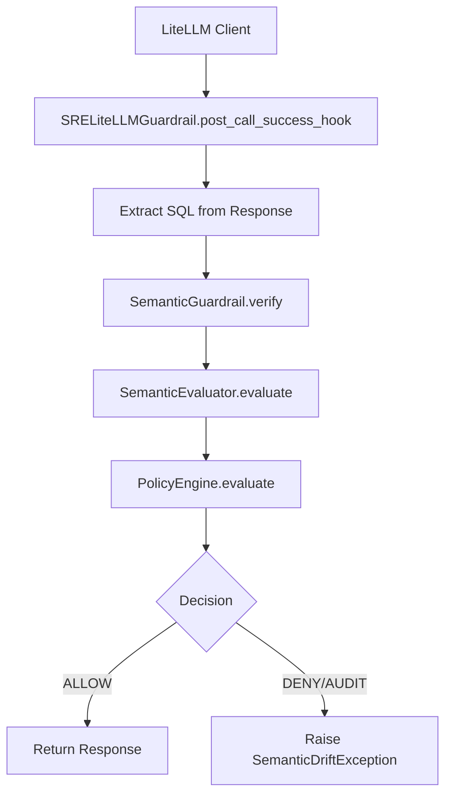
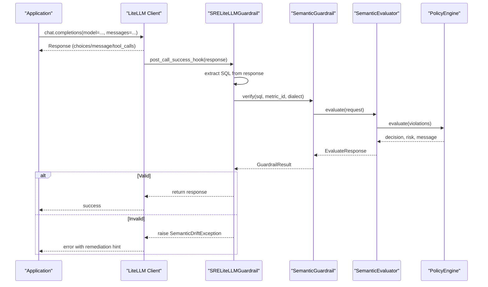
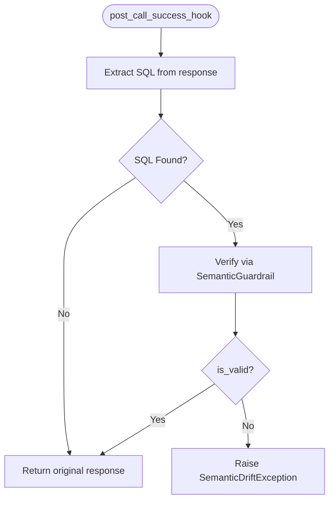
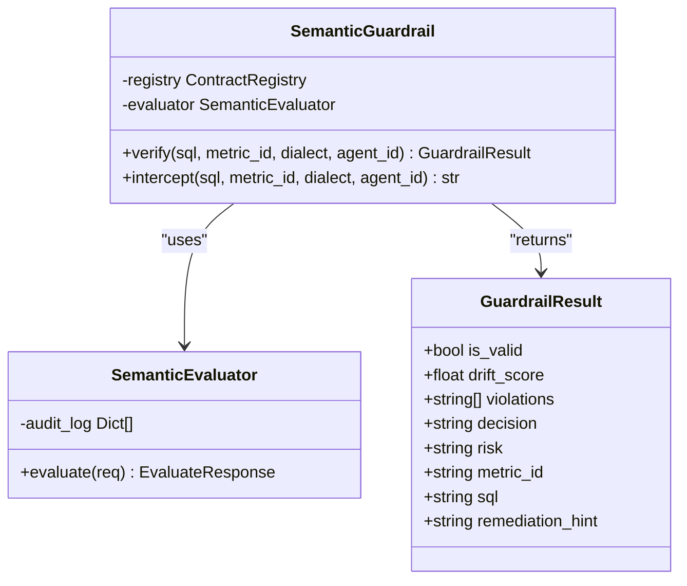
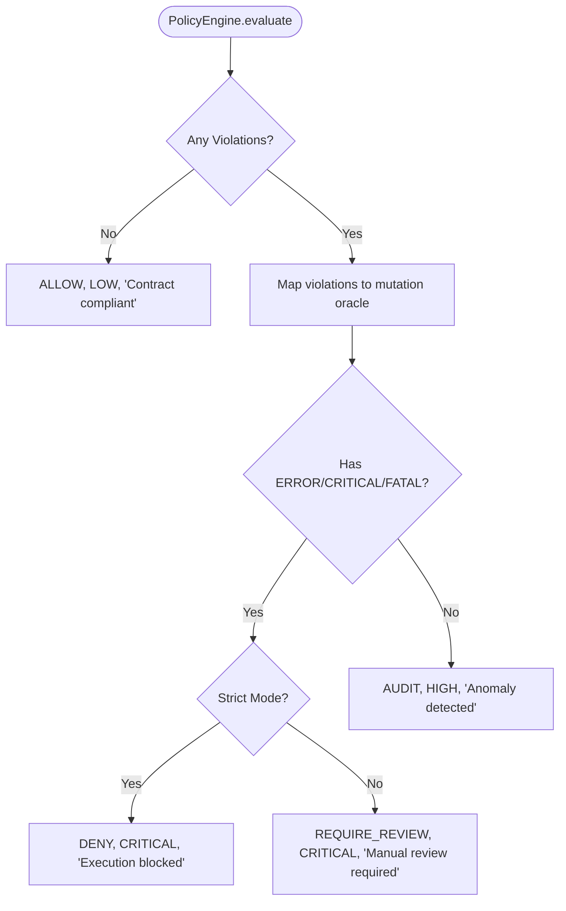
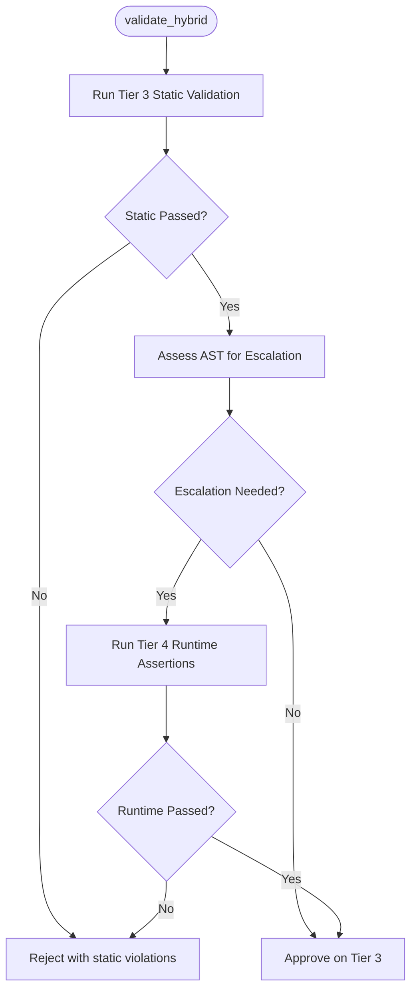
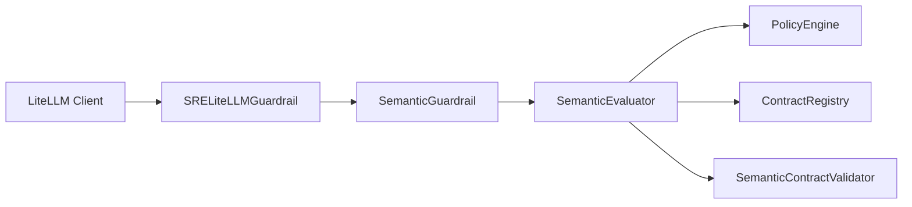

# LiteLLM Integration

<cite>
**Referenced Files in This Document**
- [README.md](file://README.md)
- [litellm.py](file://semantic_reliability/integrations/litellm.py)
- [guardrail.py](file://semantic_reliability/guardrail.py)
- [engine.py](file://semantic_reliability/firewall/engine.py)
- [policy.py](file://semantic_reliability/firewall/policy.py)
- [models.py](file://semantic_reliability/firewall/models.py)
- [hybrid_router.py](file://semantic_reliability/firewall/hybrid_router.py)
- [langchain.py](file://semantic_reliability/integrations/langchain.py)
- [llm_client.py](file://semantic_reliability/benchmark/llm_client.py)
- [handlers.py](file://semantic_reliability/mcp/handlers.py)
- [server.py](file://semantic_reliability/mcp/server.py)
- [test_guardrail_and_integrations.py](file://tests/test_guardrail_and_integrations.py)
</cite>

## Table of Contents
1. [Introduction](#introduction)
2. [Project Structure](#project-structure)
3. [Core Components](#core-components)
4. [Architecture Overview](#architecture-overview)
5. [Detailed Component Analysis](#detailed-component-analysis)
6. [Dependency Analysis](#dependency-analysis)
7. [Performance Considerations](#performance-considerations)
8. [Troubleshooting Guide](#troubleshooting-guide)
9. [Conclusion](#conclusion)
10. [Appendices](#appendices)

## Introduction
This document explains how to integrate the Semantic Reliability Engine (SRE) with LiteLLM to enforce semantic guardrails on multi-model LLM calls, implement routing strategies for model selection and fallbacks, and maintain semantic compliance across providers. It covers:
- Configuring LiteLLM clients with SRE guardrails
- Setting up model routing policies and fallback mechanisms when semantic validation fails
- Provider configuration options and rate limiting considerations
- Cost optimization strategies using pre-execution checks and hybrid validation
- Examples for guarded chat completions, streaming responses with semantic validation, and handling provider-specific errors
- Monitoring model performance while maintaining semantic compliance

## Project Structure
The integration centers around a LiteLLM-compatible guardrail hook that intercepts LLM responses, extracts generated SQL, validates it against SCOS contracts, and either allows execution or blocks it based on policy. The core engine provides deterministic AST-based semantic evaluation, policy decisions, and optional runtime escalation.

**Diagram sources**
- [litellm.py:13-95](file://semantic_reliability/integrations/litellm.py#L13-L95)
- [guardrail.py:45-153](file://semantic_reliability/guardrail.py#L45-L153)
- [engine.py:46-132](file://semantic_reliability/firewall/engine.py#L46-L132)
- [policy.py:32-68](file://semantic_reliability/firewall/policy.py#L32-L68)

**Section sources**
- [README.md:81-89](file://README.md#L81-L89)
- [litellm.py:13-95](file://semantic_reliability/integrations/litellm.py#L13-L95)

## Core Components
- SRELiteLLMGuardrail: A LiteLLM callback hook that parses LLM responses, extracts SQL, and enforces semantic guardrails.
- SemanticGuardrail: High-level API to verify SQL against metric contracts and compute drift scores.
- SemanticEvaluator: Parses SQL, runs contract validation, and records audit traces.
- PolicyEngine: Determines ALLOW, AUDIT, REQUIRE_REVIEW, or DENY based on violations and strict mode.
- HybridValidator: Adaptive router that escalates complex queries to runtime oracle for deeper validation.

Key responsibilities:
- Intercept and validate LLM-generated SQL before warehouse execution
- Provide structured feedback and exceptions for semantic violations
- Support both synchronous and asynchronous hooks
- Enable adaptive escalation for complex queries

**Section sources**
- [litellm.py:13-95](file://semantic_reliability/integrations/litellm.py#L13-L95)
- [guardrail.py:45-153](file://semantic_reliability/guardrail.py#L45-L153)
- [engine.py:46-132](file://semantic_reliability/firewall/engine.py#L46-L132)
- [policy.py:32-68](file://semantic_reliability/firewall/policy.py#L32-L68)
- [hybrid_router.py:34-156](file://semantic_reliability/firewall/hybrid_router.py#L34-L156)

## Architecture Overview
The system integrates at the LiteLLM layer to ensure all LLM-generated SQL is validated against business contracts before execution. It supports multiple providers through LiteLLM’s unified interface and can be extended with custom routing and fallback logic.

**Diagram sources**
- [litellm.py:39-95](file://semantic_reliability/integrations/litellm.py#L39-L95)
- [guardrail.py:91-153](file://semantic_reliability/guardrail.py#L91-L153)
- [engine.py:54-132](file://semantic_reliability/firewall/engine.py#L54-L132)
- [policy.py:38-68](file://semantic_reliability/firewall/policy.py#L38-L68)

## Detailed Component Analysis

### LiteLLM Guardrail Hook
- Purpose: Intercept LLM responses, extract SQL, and enforce semantic validation.
- Extraction Logic: Supports tool call arguments and markdown code blocks containing SQL.
- Hooks: Provides both sync and async post-call hooks compatible with LiteLLM callbacks.
- Behavior: Raises SemanticDriftException when block_on_violation is enabled and violations are detected.

**Diagram sources**
- [litellm.py:39-95](file://semantic_reliability/integrations/litellm.py#L39-L95)

**Section sources**
- [litellm.py:13-95](file://semantic_reliability/integrations/litellm.py#L13-L95)
- [test_guardrail_and_integrations.py:98-123](file://tests/test_guardrail_and_integrations.py#L98-L123)

### Semantic Guardrail and Evaluation
- Contract Loading: Loads SCOS contracts from YAML files or directories into an in-memory registry.
- Verification: Parses SQL, validates against invariants, computes drift score, and returns structured results.
- Interception: Offers an intercept method that raises exceptions on invalid SQL.

**Diagram sources**
- [guardrail.py:28-153](file://semantic_reliability/guardrail.py#L28-L153)
- [engine.py:46-132](file://semantic_reliability/firewall/engine.py#L46-L132)

**Section sources**
- [guardrail.py:45-153](file://semantic_reliability/guardrail.py#L45-L153)
- [engine.py:46-132](file://semantic_reliability/firewall/engine.py#L46-L132)

### Policy Engine and Decisions
- Violation Mapping: Maps invariant types to mutation oracle categories for richer diagnostics.
- Decision Logic: In strict mode, critical violations result in DENY; otherwise, may require review or allow with audit.
- Risk Levels: LOW, MEDIUM, HIGH, CRITICAL based on violation severity.

**Diagram sources**
- [policy.py:32-68](file://semantic_reliability/firewall/policy.py#L32-L68)

**Section sources**
- [policy.py:32-68](file://semantic_reliability/firewall/policy.py#L32-L68)
- [models.py:6-51](file://semantic_reliability/firewall/models.py#L6-L51)

### Hybrid Validation Router
- Static First: Runs fast AST-based validation (Tier 3) to reject clearly non-compliant queries.
- Escalation Triggers: Detects complex patterns (multiple CTEs, subqueries, window functions, CASE expressions) to escalate to runtime oracle (Tier 4).
- Runtime Checks: Executes assertions against a DuckDB connection if provided.

**Diagram sources**
- [hybrid_router.py:62-156](file://semantic_reliability/firewall/hybrid_router.py#L62-L156)

**Section sources**
- [hybrid_router.py:34-156](file://semantic_reliability/firewall/hybrid_router.py#L34-L156)

### LangChain Integration (Alternative Path)
- Tool Wrapper: Wraps database tools to intercept SQL and enforce guardrails.
- Callback Handler: Observes tool invocations and optionally blocks on drift.
- Feedback: Returns structured error messages to agents for self-correction.

**Section sources**
- [langchain.py:12-149](file://semantic_reliability/integrations/langchain.py#L12-L149)

## Dependency Analysis
The integration depends on LiteLLM’s callback mechanism and SRE’s internal components for contract validation and policy enforcement.

**Diagram sources**
- [litellm.py:13-95](file://semantic_reliability/integrations/litellm.py#L13-L95)
- [guardrail.py:45-153](file://semantic_reliability/guardrail.py#L45-L153)
- [engine.py:18-132](file://semantic_reliability/firewall/engine.py#L18-L132)

**Section sources**
- [litellm.py:13-95](file://semantic_reliability/integrations/litellm.py#L13-L95)
- [engine.py:18-132](file://semantic_reliability/firewall/engine.py#L18-L132)

## Performance Considerations
- Fast-Path Validation: Static AST checks run in under 1ms with zero bytes scanned, rejecting invalid queries early.
- Adaptive Escalation: Complex queries are escalated to runtime checks only when necessary, balancing accuracy and cost.
- Cost Estimation: Dry-run adapters can estimate compute costs and enforce byte budgets to optimize spending.
- Rate Limiting: Use LiteLLM’s built-in rate limiting features alongside SRE’s pre-execution checks to prevent overload.

Recommendations:
- Enable strict mode in production to block critical violations immediately.
- Use hybrid validation for high-risk metrics to catch subtle semantic drift.
- Monitor latency and escalation rates to tune routing policies.

[No sources needed since this section provides general guidance]

## Troubleshooting Guide
Common issues and resolutions:
- SQL Extraction Failures: Ensure LLM responses include SQL in tool call arguments or markdown code blocks.
- Contract Not Found: Verify metric_id matches registered contracts and dialect is supported.
- Policy Denials: Review violations and adjust prompts or contracts to align with business invariants.
- Streaming Responses: For streaming, apply guardrails per chunk or buffer until complete SQL is available.

Provider-Specific Errors:
- OpenAI/Anthropic: Handle JSON parsing errors and malformed tool calls gracefully.
- Ollama/vLLM: Validate base URLs and authentication headers.
- LiteLLM Proxy: Configure callbacks globally to enforce guardrails across all models.

Monitoring:
- Track decision distribution (ALLOW/DENY/AUDIT) and drift scores over time.
- Log trace IDs and violation details for auditability.
- Use MCP server endpoints to query validation results and contracts.

**Section sources**
- [litellm.py:39-95](file://semantic_reliability/integrations/litellm.py#L39-L95)
- [guardrail.py:91-153](file://semantic_reliability/guardrail.py#L91-L153)
- [handlers.py:153-175](file://semantic_reliability/mcp/handlers.py#L153-L175)
- [server.py:50-153](file://semantic_reliability/mcp/server.py#L50-L153)

## Conclusion
Integrating SRE with LiteLLM enables robust semantic guardrails across multi-model LLM workflows. By leveraging static AST validation, adaptive runtime escalation, and policy-driven decisions, organizations can ensure SQL generated by AI agents adheres to business contracts while optimizing cost and performance. The modular design supports easy extension for new providers, routing strategies, and monitoring capabilities.

[No sources needed since this section summarizes without analyzing specific files]

## Appendices

### Configuration Options
- LiteLLM Guardrail:
  - contract_path: Path to SCOS contract YAML or directory
  - metric_id: Optional target metric for validation
  - dialect: SQL dialect (e.g., duckdb, bigquery)
  - block_on_violation: Whether to raise exceptions on invalid SQL

- Policy Engine:
  - strict_mode: Enforce DENY on critical violations

- Hybrid Validator:
  - force_escalate: Force runtime checks regardless of AST complexity
  - duckdb_conn: Connection for runtime assertions
  - runtime_suite: Assertion suite for deep validation

**Section sources**
- [litellm.py:27-37](file://semantic_reliability/integrations/litellm.py#L27-L37)
- [policy.py:32-36](file://semantic_reliability/firewall/policy.py#L32-L36)
- [hybrid_router.py:62-71](file://semantic_reliability/firewall/hybrid_router.py#L62-L71)

### Example Workflows
- Guarded Chat Completions: Register SRELiteLLMGuardrail as a LiteLLM callback to validate all responses.
- Streaming Responses: Buffer streamed chunks until complete SQL is extracted, then validate.
- Fallback Mechanisms: On semantic failure, route to alternative models or prompt re-generation.

**Section sources**
- [README.md:81-89](file://README.md#L81-L89)
- [litellm.py:73-95](file://semantic_reliability/integrations/litellm.py#L73-L95)

### Monitoring and Metrics
- Track validation outcomes and drift scores per model/provider
- Log escalation reasons and runtime assertion failures
- Use MCP server to expose validation APIs for dashboards

**Section sources**
- [engine.py:118-132](file://semantic_reliability/firewall/engine.py#L118-L132)
- [server.py:104-128](file://semantic_reliability/mcp/server.py#L104-L128)