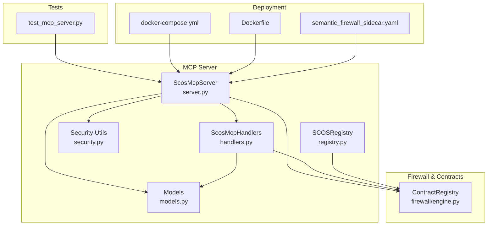
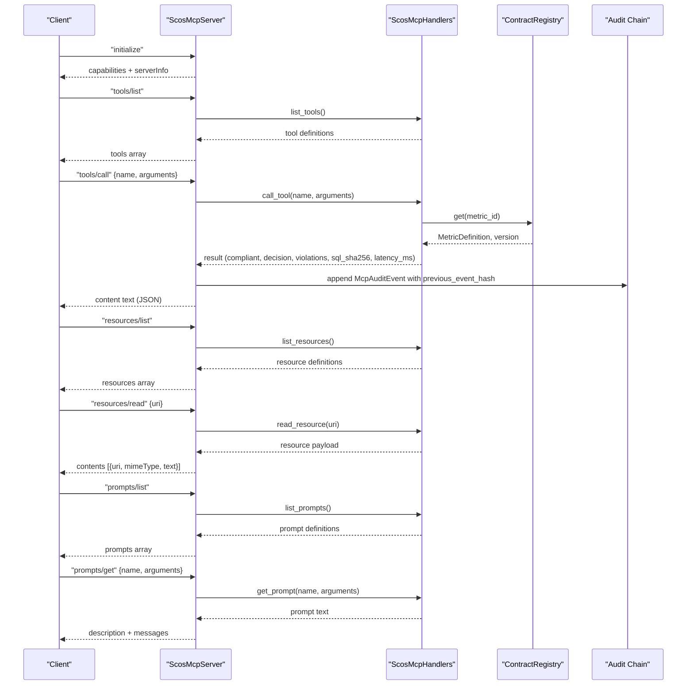
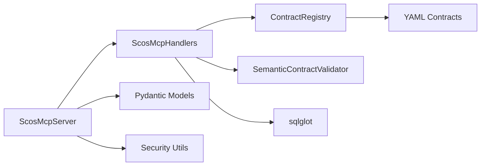

# MCP Server Implementation

<cite>
**Referenced Files in This Document**
- [server.py](file://semantic_reliability/mcp/server.py)
- [handlers.py](file://semantic_reliability/mcp/handlers.py)
- [models.py](file://semantic_reliability/mcp/models.py)
- [security.py](file://semantic_reliability/mcp/security.py)
- [registry.py](file://semantic_reliability/mcp/registry.py)
- [engine.py](file://semantic_reliability/firewall/engine.py)
- [test_mcp_server.py](file://tests/test_mcp_server.py)
- [docker-compose.yml](file://demo/docker-compose.yml)
- [Dockerfile](file://demo/Dockerfile)
- [semantic_firewall_sidecar.yaml](file://deploy/k8s/semantic_firewall_sidecar.yaml)
</cite>

## Table of Contents
1. [Introduction](#introduction)
2. [Project Structure](#project-structure)
3. [Core Components](#core-components)
4. [Architecture Overview](#architecture-overview)
5. [Detailed Component Analysis](#detailed-component-analysis)
6. [Dependency Analysis](#dependency-analysis)
7. [Performance Considerations](#performance-considerations)
8. [Troubleshooting Guide](#troubleshooting-guide)
9. [Conclusion](#conclusion)
10. [Appendices](#appendices)

## Introduction
This document provides comprehensive documentation for the Model Context Protocol (MCP) server implementation that exposes a JSON-RPC 2.0 interface to query, validate, and inspect semantic contracts for business metrics. It covers protocol methods, security controls, audit hash-chaining, cryptographic verification, client identity management, integration examples, deployment considerations, performance tuning, and monitoring approaches for production environments.

The server implements:
- JSON-RPC 2.0 methods: initialize, tools/list, tools/call, resources/list, resources/read, prompts/list, prompts/get
- Domain-scoped authorization and request size limits
- Tamper-evident audit logging with hash chaining and signed checkpoints
- Read-only access to metric contracts, invariants, and policy definitions
- Structured error handling with standard JSON-RPC error codes

## Project Structure
The MCP server is implemented under semantic_reliability/mcp with supporting modules for models, handlers, security utilities, and registry resolution. Integration tests demonstrate usage patterns and expected behavior. Deployment artifacts show how to run the server in containers and Kubernetes sidecars.

**Diagram sources**
- [server.py:16-48](file://semantic_reliability/mcp/server.py#L16-L48)
- [handlers.py:19-28](file://semantic_reliability/mcp/handlers.py#L19-L28)
- [models.py:9-121](file://semantic_reliability/mcp/models.py#L9-L121)
- [security.py:1-57](file://semantic_reliability/mcp/security.py#L1-L57)
- [registry.py:10-71](file://semantic_reliability/mcp/registry.py#L10-L71)
- [engine.py:18-43](file://semantic_reliability/firewall/engine.py#L18-L43)
- [test_mcp_server.py:10-34](file://tests/test_mcp_server.py#L10-L34)
- [docker-compose.yml:8-30](file://demo/docker-compose.yml#L8-L30)
- [Dockerfile:1-33](file://demo/Dockerfile#L1-L33)
- [semantic_firewall_sidecar.yaml:77-102](file://deploy/k8s/semantic_firewall_sidecar.yaml#L77-L102)

**Section sources**
- [server.py:16-48](file://semantic_reliability/mcp/server.py#L16-L48)
- [handlers.py:19-28](file://semantic_reliability/mcp/handlers.py#L19-L28)
- [models.py:9-121](file://semantic_reliability/mcp/models.py#L9-L121)
- [security.py:1-57](file://semantic_reliability/mcp/security.py#L1-L57)
- [registry.py:10-71](file://semantic_reliability/mcp/registry.py#L10-L71)
- [engine.py:18-43](file://semantic_reliability/firewall/engine.py#L18-L43)
- [test_mcp_server.py:10-34](file://tests/test_mcp_server.py#L10-L34)
- [docker-compose.yml:8-30](file://demo/docker-compose.yml#L8-L30)
- [Dockerfile:1-33](file://demo/Dockerfile#L1-L33)
- [semantic_firewall_sidecar.yaml:77-102](file://deploy/k8s/semantic_firewall_sidecar.yaml#L77-L102)

## Core Components
- ScosMcpServer: JSON-RPC 2.0 request dispatcher, audit chain manager, checkpoint creator/verifier, stdio loop runner
- ScosMcpHandlers: Tool, resource, and prompt implementations with domain scoping and SQL validation
- Models: Pydantic data structures for caller identity, tool/resource/prompt definitions, audit events, checkpoints, and validation results
- Security: Utilities for hashing SQL, enforcing payload/SQL limits, and structured audit logging
- Registry: SCOS contract registry with URN mapping and URI resolution
- ContractRegistry: In-memory registry used by handlers to fetch metric definitions and versions

Key responsibilities:
- Enforce JSON-RPC 2.0 method routing and parameter validation
- Apply domain scoping to restrict access to metrics/resources/prompts
- Validate candidate SQL against declared invariants without executing it
- Maintain tamper-evident audit logs with hash chaining and signed checkpoints
- Provide read-only exposure of policies, contracts, and invariants via resources

**Section sources**
- [server.py:16-257](file://semantic_reliability/mcp/server.py#L16-L257)
- [handlers.py:19-409](file://semantic_reliability/mcp/handlers.py#L19-L409)
- [models.py:9-121](file://semantic_reliability/mcp/models.py#L9-L121)
- [security.py:1-57](file://semantic_reliability/mcp/security.py#L1-L57)
- [registry.py:10-71](file://semantic_reliability/mcp/registry.py#L10-L71)
- [engine.py:18-43](file://semantic_reliability/firewall/engine.py#L18-L43)

## Architecture Overview
The MCP server exposes a JSON-RPC 2.0 API over stdio or can be integrated into larger systems. Requests are validated, routed to handlers, and responses are returned with standardized error codes. Audit events are appended to an in-memory chain with cryptographic hashes; periodic checkpoints sign the chain state using HMAC-SHA256.

**Diagram sources**
- [server.py:50-180](file://semantic_reliability/mcp/server.py#L50-L180)
- [handlers.py:37-409](file://semantic_reliability/mcp/handlers.py#L37-L409)
- [engine.py:18-43](file://semantic_reliability/firewall/engine.py#L18-L43)

## Detailed Component Analysis

### JSON-RPC 2.0 Methods
- initialize: Returns server info and capabilities (tools, resources, prompts). Supports protocolVersion negotiation.
- tools/list: Lists available tools with input schemas.
- tools/call: Dispatches to handler functions for metric listing, contract retrieval, SQL validation, violation explanation, and probe status.
- resources/list: Lists policy and contract resources with URIs.
- resources/read: Reads policy or contract/invariant payloads by URI.
- prompts/list: Lists prompt templates with required arguments.
- prompts/get: Retrieves prompt text populated with metric invariants and user intent.

Error handling uses JSON-RPC 2.0 error codes:
- -32600 Invalid Request (malformed payload, missing method)
- -32601 Method not found
- -32602 Invalid params (missing or invalid fields)
- -32603 Internal error (unexpected exceptions)

Request size enforcement:
- Max request bytes enforced at server entry; returns -32600 if exceeded.

**Section sources**
- [server.py:50-180](file://semantic_reliability/mcp/server.py#L50-L180)
- [server.py:222-237](file://semantic_reliability/mcp/server.py#L222-L237)
- [test_mcp_server.py:37-181](file://tests/test_mcp_server.py#L37-L181)

### Tools and Handler Logic
Tools exposed:
- scos_list_metrics: Lists metrics with optional domain filter; returns metric_id, version, domain, owner, grain, description.
- scos_get_contract: Retrieves full metric definition including canonical SQL, invariants, probes; enforces domain authorization.
- scos_validate_sql: Validates candidate SQL against metric invariants without execution; returns compliant flag, decision (ALLOW/REQUIRE_REVIEW/DENY), violations, sql_sha256, latency_ms.
- scos_explain_violation: Provides remediation guidance for a specific violated rule.
- scos_get_probe_status: Returns active probes and health status for a metric.

Domain scoping:
- Allowed domains configured at server initialization restrict which metrics/resources/prompts are accessible.
- Unauthorized access returns structured errors indicating access denied.

SQL validation safeguards:
- Payload length limit (MAX_SQL_CHARS) prevents oversized inputs.
- AST complexity limit (MAX_AST_NODES) prevents excessive parsing overhead.
- Parsing errors return DENY with syntax_error details.

**Section sources**
- [handlers.py:37-287](file://semantic_reliability/mcp/handlers.py#L37-L287)
- [handlers.py:289-351](file://semantic_reliability/mcp/handlers.py#L289-L351)
- [handlers.py:355-409](file://semantic_reliability/mcp/handlers.py#L355-L409)
- [test_mcp_server.py:68-110](file://tests/test_mcp_server.py#L68-L110)
- [test_mcp_server.py:198-230](file://tests/test_mcp_server.py#L198-L230)

### Resources and Prompts
Resources:
- Policy resource: scos://policies/semantic-gate/1.0 returns policy metadata and severity rules.
- Contract resources: scos://contracts/{domain}/{metric_id}/{version} returns full contract; /invariants returns only invariants.

Prompts:
- scos_generate_sql_guidance: Generates guidance incorporating metric invariants and user intent.
- scos_repair_contract_violation: Produces repair instructions for failed SQL based on violations.

**Section sources**
- [handlers.py:289-351](file://semantic_reliability/mcp/handlers.py#L289-L351)
- [handlers.py:355-409](file://semantic_reliability/mcp/handlers.py#L355-L409)

### Audit Hash-Chaining Mechanism
Tamper-evident audit log:
- Each McpAuditEvent includes previous_event_hash and computes event_hash over canonical JSON fields.
- The first event links to a genesis hash constant.
- verify_audit_chain checks each event’s previous link and recomputes hashes to detect tampering.

Signed checkpoints:
- create_checkpoint captures sequence_end, last_event_hash, and signs the checkpoint envelope with HMAC-SHA256 using a signing secret (environment variable or explicit key).
- verify_checkpoint validates signature, bounds, and chain integrity.

Security utility logging:
- log_audit_event emits structured JSON with redacted SQL (hash only) and previous hash linkage.

**Section sources**
- [server.py:109-127](file://semantic_reliability/mcp/server.py#L109-L127)
- [server.py:182-220](file://semantic_reliability/mcp/server.py#L182-L220)
- [models.py:43-108](file://semantic_reliability/mcp/models.py#L43-L108)
- [security.py:21-57](file://semantic_reliability/mcp/security.py#L21-L57)
- [test_mcp_server.py:112-139](file://tests/test_mcp_server.py#L112-L139)

### Client Identity Management
CallerIdentity supports:
- client_id, tenant_id, allowed_domains, role, authenticated flags
- Passed into handle_request to bind audit events to tenants/domains and enable per-client scoping

Usage example:
- Tests pass CallerIdentity with client_id and tenant_id when invoking tools/call to associate audit entries with callers.

**Section sources**
- [models.py:9-16](file://semantic_reliability/mcp/models.py#L9-L16)
- [server.py:50-58](file://semantic_reliability/mcp/server.py#L50-L58)
- [test_mcp_server.py:82-88](file://tests/test_mcp_server.py#L82-L88)

### Example Request/Response Formats
- initialize:
  - Request: {"jsonrpc": "2.0", "id": 1, "method": "initialize", "params": {"protocolVersion": "2024-11-05"}}
  - Response: {"jsonrpc": "2.0", "id": 1, "result": {"protocolVersion": "...", "serverInfo": {"name": "scos-mcp-server", "version": "1.0.0"}, "capabilities": {"tools": {...}, "resources": {...}, "prompts": {...}}}}
- tools/list:
  - Request: {"jsonrpc": "2.0", "id": 2, "method": "tools/list", "params": {}}
  - Response: {"jsonrpc": "2.0", "id": 2, "result": {"tools": [...]}}
- tools/call:
  - Request: {"jsonrpc": "2.0", "id": 3, "method": "tools/call", "params": {"name": "scos_validate_sql", "arguments": {"metric_id": "net_revenue", "sql": "...", "dialect": "duckdb"}}}
  - Response: {"jsonrpc": "2.0", "id": 3, "result": {"content": [{"type": "text", "text": "<JSON string of validation result>"}]}}
- resources/list:
  - Request: {"jsonrpc": "2.0", "id": 4, "method": "resources/list", "params": {}}
  - Response: {"jsonrpc": "2.0", "id": 4, "result": {"resources": [...]}}
- resources/read:
  - Request: {"jsonrpc": "2.0", "id": 5, "method": "resources/read", "params": {"uri": "scos://policies/semantic-gate/1.0"}}
  - Response: {"jsonrpc": "2.0", "id": 5, "result": {"contents": [{"uri": "...", "mimeType": "application/json", "text": "<JSON string>"}]}}
- prompts/list:
  - Request: {"jsonrpc": "2.0", "id": 6, "method": "prompts/list", "params": {}}
  - Response: {"jsonrpc": "2.0", "id": 6, "result": {"prompts": [...]}}
- prompts/get:
  - Request: {"jsonrpc": "2.0", "id": 7, "method": "prompts/get", "params": {"name": "scos_generate_sql_guidance", "arguments": {"metric_id": "net_revenue", "user_intent": "..."}}}
  - Response: {"jsonrpc": "2.0", "id": 7, "result": {"description": "...", "messages": [{"role": "user", "content": {"type": "text", "text": "..."}}]}}

Error examples:
- Invalid request: {"jsonrpc": "2.0", "id": null, "error": {"code": -32600, "message": "Invalid Request: ..."}}
- Method not found: {"jsonrpc": "2.0", "id": 1, "error": {"code": -32601, "message": "Method not found: 'unknown_rpc'"}}
- Invalid params: {"jsonrpc": "2.0", "id": 2, "error": {"code": -32602, "message": "Invalid params: ..."}}

**Section sources**
- [server.py:50-180](file://semantic_reliability/mcp/server.py#L50-L180)
- [server.py:222-237](file://semantic_reliability/mcp/server.py#L222-L237)
- [test_mcp_server.py:37-181](file://tests/test_mcp_server.py#L37-L181)

### Integration Setup
- Local stdio mode: Use run_stdio to read JSON-RPC requests from stdin and write responses to stdout.
- Docker Compose: Run the server with command sre mcp-serve --contracts <dir> --port 8000; expose port 8000.
- Kubernetes sidecar: Mount metric contracts via ConfigMap; deploy as sidecar alongside analytics workloads.

Environment variables:
- SRE_AUDIT_SIGNING_KEY: Required for generating and verifying checkpoint signatures.

**Section sources**
- [server.py:239-257](file://semantic_reliability/mcp/server.py#L239-L257)
- [docker-compose.yml:8-30](file://demo/docker-compose.yml#L8-L30)
- [Dockerfile:1-33](file://demo/Dockerfile#L1-L33)
- [semantic_firewall_sidecar.yaml:77-102](file://deploy/k8s/semantic_firewall_sidecar.yaml#L77-L102)
- [models.py:95-108](file://semantic_reliability/mcp/models.py#L95-L108)

## Dependency Analysis
The MCP server depends on:
- ContractRegistry for metric definitions and versions
- SemanticContractValidator for invariant-based SQL validation
- sqlglot for SQL parsing and AST analysis
- Pydantic models for structured data and validation
- Logging for audit trails and operational visibility

**Diagram sources**
- [server.py:9-11](file://semantic_reliability/mcp/server.py#L9-L11)
- [handlers.py:8-16](file://semantic_reliability/mcp/handlers.py#L8-L16)
- [engine.py:18-43](file://semantic_reliability/firewall/engine.py#L18-L43)

**Section sources**
- [server.py:9-11](file://semantic_reliability/mcp/server.py#L9-L11)
- [handlers.py:8-16](file://semantic_reliability/mcp/handlers.py#L8-L16)
- [engine.py:18-43](file://semantic_reliability/firewall/engine.py#L18-L43)

## Performance Considerations
- SQL parsing and AST traversal: Limits on SQL length and AST node count prevent excessive CPU/memory usage.
- Validation without execution: tools/call performs static validation only; no database queries executed.
- In-memory registries: Fast lookups for metrics and contracts; consider persistence strategies for large-scale deployments.
- Audit chain operations: Append-only with O(1) amortized cost; verification is O(n) over chain length.
- Checkpoint signing: HMAC-SHA256 computation is lightweight; perform periodically rather than per-request.

Recommendations:
- Tune MAX_SQL_CHARS and MAX_AST_NODES based on workload characteristics.
- Use domain scoping to reduce search space for metrics and resources.
- Offload heavy validation to background workers if needed; keep server path fast.
- Monitor latency_ms in validation results to identify slow paths.

[No sources needed since this section provides general guidance]

## Troubleshooting Guide
Common issues and resolutions:
- Parse errors: Ensure JSON-RPC payload is valid; check for malformed JSON or missing fields.
- Method not found: Verify method names match supported endpoints.
- Invalid params: Confirm required parameters like name, metric_id, sql are present and correctly typed.
- Access denied: Check allowed_domains configuration and metric metadata domain tags.
- SQL too complex: Reduce predicate count or simplify query structure to stay within AST node limits.
- Audit chain verification failures: Ensure previous_event_hash linkage is intact; re-create checkpoints after any chain modification.

Operational tips:
- Enable structured audit logging to capture tool_name, payload hashes, latency, and timestamps.
- Use verify_audit_chain and verify_checkpoint to assert integrity during incident response.
- Inspect error messages for precise failure reasons; map to appropriate remediation steps.

**Section sources**
- [server.py:50-180](file://semantic_reliability/mcp/server.py#L50-L180)
- [handlers.py:147-240](file://semantic_reliability/mcp/handlers.py#L147-L240)
- [security.py:21-57](file://semantic_reliability/mcp/security.py#L21-L57)
- [test_mcp_server.py:170-230](file://tests/test_mcp_server.py#L170-L230)

## Conclusion
The MCP server provides a secure, auditable, and standards-compliant interface for interacting with semantic metric contracts. It enforces strict request validation, domain scoping, and SQL safety checks while maintaining tamper-evident audit logs and signed checkpoints. With straightforward integration patterns and robust error handling, it supports both local development and production deployments across containerized and Kubernetes environments.

[No sources needed since this section summarizes without analyzing specific files]

## Appendices

### Cryptographic Verification System
- Event hashing: SHA-256 over canonical JSON fields plus previous_event_hash ensures chain integrity.
- Checkpoint signing: HMAC-SHA256 over checkpoint envelope fields using a secret key enables verifiable anchoring.
- Verification workflow:
  - Rebuild chain hashes and compare with stored values
  - Validate checkpoint signature against current chain state
  - Ensure sequence boundaries align with audit log length

**Section sources**
- [models.py:43-108](file://semantic_reliability/mcp/models.py#L43-L108)
- [server.py:182-220](file://semantic_reliability/mcp/server.py#L182-L220)
- [security.py:21-57](file://semantic_reliability/mcp/security.py#L21-L57)

### Monitoring Approaches
- Log structured audit events with tool_name, payload hashes, latency, and timestamps.
- Track error rates by JSON-RPC error code to identify misuse or misconfiguration.
- Measure latency_ms from validation results to monitor performance regressions.
- Periodically create and store checkpoints for long-term integrity assurance.

**Section sources**
- [security.py:37-57](file://semantic_reliability/mcp/security.py#L37-L57)
- [handlers.py:147-240](file://semantic_reliability/mcp/handlers.py#L147-L240)
- [server.py:182-220](file://semantic_reliability/mcp/server.py#L182-L220)