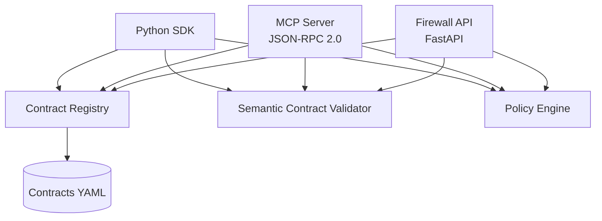
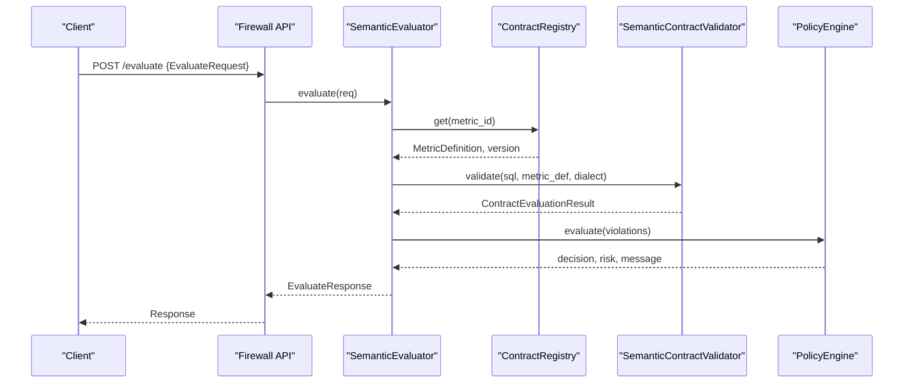
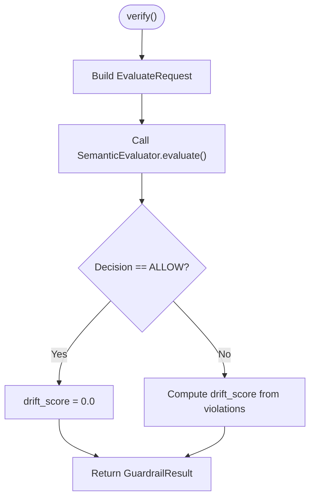
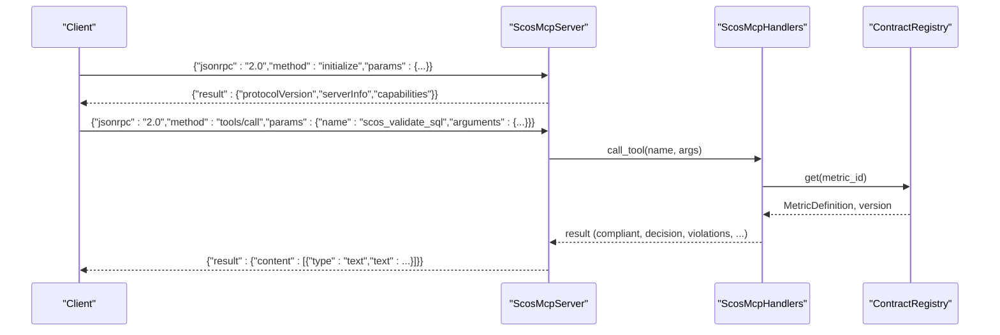
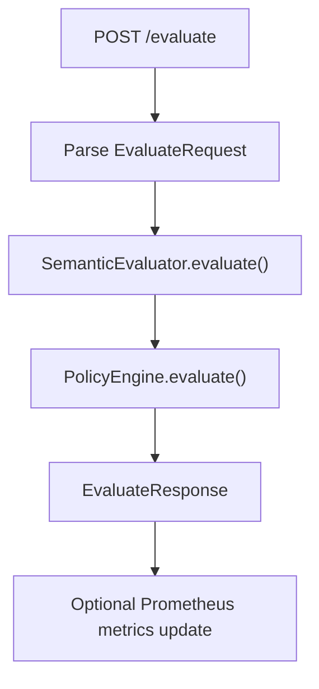
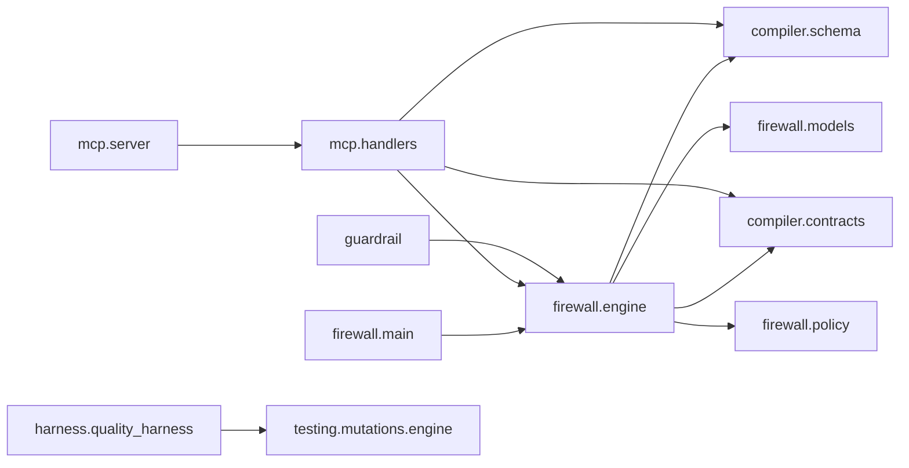

# API Reference

<cite>
**Referenced Files in This Document**
- [__init__.py](file://semantic_reliability/__init__.py)
- [schema.py](file://semantic_reliability/compiler/schema.py)
- [contracts.py](file://semantic_reliability/compiler/contracts.py)
- [engine.py](file://semantic_reliability/firewall/engine.py)
- [models.py](file://semantic_reliability/firewall/models.py)
- [main.py](file://semantic_reliability/firewall/main.py)
- [server.py](file://semantic_reliability/mcp/server.py)
- [handlers.py](file://semantic_reliability/mcp/handlers.py)
- [models.py](file://semantic_reliability/mcp/models.py)
- [registry.py](file://semantic_reliability/mcp/registry.py)
- [guardrail.py](file://semantic_reliability/guardrail.py)
- [quality_harness.py](file://semantic_reliability/harness/quality_harness.py)
- [protocol.py](file://semantic_reliability/benchmark/protocol.py)
- [detector.py](file://semantic_reliability/testing/drift/detector.py)
- [scos-v1.schema.json](file://spec/scos-v1.schema.json)
</cite>

## Table of Contents
1. Introduction
2. Project Structure
3. Core Components
4. Architecture Overview
5. Detailed Component Analysis
6. Dependency Analysis
7. Performance Considerations
8. Troubleshooting Guide
9. Conclusion
10. Appendices

## Introduction
This API Reference documents the public interfaces, data models, and protocols exposed by the Semantic Reliability Engine. It covers:
- Python SDK classes and methods with parameters and return types
- MCP protocol specification (JSON-RPC 2.0 endpoints, request/response schemas, error codes)
- Firewall HTTP API endpoints (methods, URL patterns, authentication notes)
- Data model definitions with field descriptions and validation rules
- Code examples for integration patterns
- Versioning, deprecation policy, and backward compatibility guidance

## Project Structure
The repository exposes three primary integration surfaces:
- Python SDK: High-level guardrails, compilers, evaluators, and harness utilities
- MCP Server: JSON-RPC 2.0 server exposing tools, resources, and prompts for AI agents
- Firewall API: FastAPI service providing contract evaluation and observability

**Diagram sources**
- [engine.py:18-43](file://semantic_reliability/firewall/engine.py#L18-L43)
- [handlers.py:19-97](file://semantic_reliability/mcp/handlers.py#L19-L97)
- [main.py:23-33](file://semantic_reliability/firewall/main.py#L23-L33)
- [schema.py:83-97](file://semantic_reliability/compiler/schema.py#L83-L97)

**Section sources**
- [__init__.py:1-21](file://semantic_reliability/__init__.py#L1-L21)
- [main.py:23-33](file://semantic_reliability/firewall/main.py#L23-L33)
- [server.py:16-49](file://semantic_reliability/mcp/server.py#L16-L49)

## Core Components
- Python SDK
  - SemanticGuardrail: Validates or intercepts SQL against SCOS contracts; returns structured results or raises exceptions on violations
  - MetricCompiler and SemanticDriftDetector: Compile metric definitions and detect semantic drift between baseline and candidate SQL
  - QualityHarness: Evaluates test suites against mutated SQL to compute mutation scores
- MCP Server
  - ScosMcpServer: JSON-RPC 2.0 server implementing initialize, tools/list, tools/call, resources/list, resources/read, prompts/list, prompts/get
  - ScosMcpHandlers: Tool/resource/prompt handlers with domain authorization and safety limits
  - Models: CallerIdentity, McpToolDefinition, McpResourceDefinition, McpPromptDefinition, McpAuditEvent, AuditCheckpoint, SqlValidationResult
- Firewall API
  - Evaluate endpoint: POST /evaluate evaluates SQL against registered contracts and policies
  - Health and metrics: GET /health, GET /metrics (Prometheus if available)
  - Models: EvaluateRequest, EvaluateResponse, Violation, Decision, RiskLevel

**Section sources**
- [guardrail.py:28-153](file://semantic_reliability/guardrail.py#L28-L153)
- [quality_harness.py:8-113](file://semantic_reliability/harness/quality_harness.py#L8-L113)
- [server.py:16-257](file://semantic_reliability/mcp/server.py#L16-L257)
- [handlers.py:19-409](file://semantic_reliability/mcp/handlers.py#L19-L409)
- [models.py:6-51](file://semantic_reliability/firewall/models.py#L6-L51)
- [main.py:36-70](file://semantic_reliability/firewall/main.py#L36-L70)

## Architecture Overview
End-to-end flow from client to evaluation and audit:

**Diagram sources**
- [main.py:36-53](file://semantic_reliability/firewall/main.py#L36-L53)
- [engine.py:46-116](file://semantic_reliability/firewall/engine.py#L46-L116)
- [contracts.py:26-135](file://semantic_reliability/compiler/contracts.py#L26-L135)

## Detailed Component Analysis

### Python SDK: SemanticGuardrail
- Purpose: Enforce SCOS contracts before execution; provide remediation hints
- Key methods:
  - verify(sql, metric_id=None, dialect="duckdb", agent_id="agent-guardrail") -> GuardrailResult
  - intercept(sql, metric_id=None, dialect="duckdb", agent_id="agent-guardrail") -> str (raises SemanticDriftException on violation)
- Return types:
  - GuardrailResult fields: is_valid, drift_score, violations, decision, risk, metric_id, sql, remediation_hint, raw_response
- Behavior:
  - Builds EvaluateRequest internally and delegates to SemanticEvaluator
  - Computes drift score based on violations and decision
  - Raises SemanticDriftException when not valid

**Diagram sources**
- [guardrail.py:91-136](file://semantic_reliability/guardrail.py#L91-L136)
- [engine.py:54-116](file://semantic_reliability/firewall/engine.py#L54-L116)

**Section sources**
- [guardrail.py:13-153](file://semantic_reliability/guardrail.py#L13-L153)

### Python SDK: QualityHarness and MutationBenchmark
- Purpose: Measure robustness of test suites against injected mutations
- Methods:
  - simulate_standard_checks(mutated_sql, mutation_type) -> Dict[str, str]
  - evaluate_model(base_sql, dialect=None, custom_test_runner=None) -> MutationBenchmark
- Returns:
  - MutationBenchmark fields: total_mutations, caught_mutations, uncaught_mutations, mutation_score_pct, evaluations
- Notes:
  - Uses MutationEngine to generate mutations
  - Supports custom test runner for real check suites

**Section sources**
- [quality_harness.py:8-113](file://semantic_reliability/harness/quality_harness.py#L8-L113)

### Python SDK: Semantic Drift Detection
- Class: SemanticDriftDetector
- Method: analyze(original_sql, candidate_sql, dialect=None) -> List[SemanticDrift]
- Coverage: WHERE clause changes, aggregation shifts, join topology, GROUP BY grain, null handling, HAVING, source tables

**Section sources**
- [detector.py:9-246](file://semantic_reliability/testing/drift/detector.py#L9-L246)

### MCP Protocol Specification (JSON-RPC 2.0)
- Server capabilities:
  - initialize: returns protocolVersion, serverInfo, capabilities
  - tools/list: lists available tools
  - tools/call: executes a tool with arguments
  - resources/list: lists resources
  - resources/read: reads resource content by URI
  - prompts/list: lists prompts
  - prompts/get: retrieves prompt text with arguments
  - notifications/initialized: no-op notification
- Error codes:
  - -32700 Parse error
  - -32600 Invalid Request
  - -32601 Method not found
  - -32602 Invalid Params
  - -32603 Internal error
- Security and auditing:
  - Domain authorization via allowed_domains
  - Hash-chained audit events per call
  - Checkpoint signing with HMAC-SHA256 using SRE_AUDIT_SIGNING_KEY

**Diagram sources**
- [server.py:50-177](file://semantic_reliability/mcp/server.py#L50-L177)
- [handlers.py:101-287](file://semantic_reliability/mcp/handlers.py#L101-L287)
- [registry.py:10-71](file://semantic_reliability/mcp/registry.py#L10-L71)

**Section sources**
- [server.py:16-257](file://semantic_reliability/mcp/server.py#L16-L257)
- [handlers.py:19-409](file://semantic_reliability/mcp/handlers.py#L19-L409)
- [models.py:9-121](file://semantic_reliability/mcp/models.py#L9-L121)

### Firewall API Endpoints
- POST /evaluate
  - Request body: EvaluateRequest
  - Response: EvaluateResponse
  - Authentication: Not enforced in code; integrate with your gateway for authN/authZ
  - Observability: Prometheus counters/histograms if installed
- GET /health
  - Returns status, number of loaded contracts, and list of metric IDs
- GET /metrics
  - Returns Prometheus metrics if prometheus_client is available

**Diagram sources**
- [main.py:36-70](file://semantic_reliability/firewall/main.py#L36-L70)
- [engine.py:54-116](file://semantic_reliability/firewall/engine.py#L54-L116)

**Section sources**
- [main.py:23-70](file://semantic_reliability/firewall/main.py#L23-L70)
- [models.py:20-51](file://semantic_reliability/firewall/models.py#L20-L51)

### Data Models

#### SCOS v1 Schema
- Root properties: scos_version, id, metric, version, description, owner, domain, grain, dialect, sql, tags, invariants, probes, metadata
- Invariants: population (required/forbidden filters), temporal (timezone, period_grain), aggregation (required aggregations), deduction (required subtractions)
- Probes: population predicates with min/max rates, implications with antecedent/consequent/min_confidence, null_drift with column and max_null_rate

**Section sources**
- [scos-v1.schema.json:1-163](file://spec/scos-v1.schema.json#L1-L163)

#### SDK Models
- MetricDefinition: metric, description, owner, grain, sql, dialect, tags, dimensions, invariants, probes, provenance, metadata
- SemanticInvariants: population, grain, aggregation, units, time
- PopulationProbe, ImplicationProbe, NullDriftProbe, MetricProbes, ContractProvenance

**Section sources**
- [schema.py:5-97](file://semantic_reliability/compiler/schema.py#L5-L97)

#### Firewall Models
- EvaluateRequest: request_id, metric_id, sql, dialect, agent_id, question
- EvaluateResponse: request_id, trace_id, decision, execution_allowed, contract_compliant, risk, violations, contract_version, message
- Violation: rule, expected, found, severity, invariant_type, mutation_equivalent
- Decision: ALLOW, AUDIT, REQUIRE_REVIEW, DENY
- RiskLevel: LOW, MEDIUM, HIGH, CRITICAL

**Section sources**
- [models.py:6-51](file://semantic_reliability/firewall/models.py#L6-L51)

#### MCP Models
- CallerIdentity: client_id, tenant_id, allowed_domains, role, authenticated
- McpToolDefinition: name, description, inputSchema
- McpResourceDefinition: uri, name, description, mimeType
- McpPromptDefinition: name, description, arguments
- McpAuditEvent: event_id, sequence_num, timestamp_utc, method, tool_name, resource_uri, metric_id, tenant_id, domain, sql_sha256, decision, latency_ms, client_id, key_id, previous_event_hash, event_hash
- AuditCheckpoint: checkpoint_id, sequence_end, last_event_hash, checkpoint_timestamp, key_id, total_events_verified, checkpoint_signature
- SqlValidationResult: metric_id, contract_version, compliant, decision, violations, execution_performed, policy_version, sql_sha256, latency_ms

**Section sources**
- [models.py:9-121](file://semantic_reliability/mcp/models.py#L9-L121)

#### Benchmark Protocol Models
- ScenarioClass, BenchmarkScenario, ToolCallRecord, TrajectoryMetadata, AgentTrajectory, NetGovernancePolicy, FrozenProtocolConfig

**Section sources**
- [protocol.py:8-96](file://semantic_reliability/benchmark/protocol.py#L8-L96)

### Integration Patterns and Examples

- Firewall API: Evaluate SQL
  - Endpoint: POST /evaluate
  - Request schema: EvaluateRequest
  - Response schema: EvaluateResponse
  - Example pattern:
    - Send JSON payload with metric_id, sql, dialect, agent_id
    - Inspect response.decision and response.execution_allowed
    - Use response.violations to understand contract breaches
    - Integrate with upstream auth gateway for authentication

- MCP: Initialize and call tool
  - Initialize:
    - Method: initialize
    - Params: optional protocolVersion
    - Response includes serverInfo and capabilities
  - Tools:
    - tools/list: returns available tools
    - tools/call: invoke scos_validate_sql with metric_id, sql, dialect
    - Handle response.content.text containing JSON result
  - Resources:
    - resources/list: returns resource URIs
    - resources/read: read scos://contracts/{domain}/{metric}/{version} or invariants
  - Prompts:
    - prompts/list: returns prompt templates
    - prompts/get: retrieve templated prompts for generation or repair

- Python SDK: Guardrail verification
  - Instantiate SemanticGuardrail from contract path or definition
  - Call verify(sql, metric_id, dialect, agent_id) to get GuardrailResult
  - If result.is_valid is False, handle remediation_hint and violations
  - Use intercept(sql, ...) to raise SemanticDriftException on violation

- Python SDK: Mutation benchmarking
  - Use QualityHarness.evaluate_model(base_sql, dialect, custom_test_runner)
  - Inspect MutationBenchmark.mutation_score_pct and evaluations for blind spots

**Section sources**
- [main.py:36-70](file://semantic_reliability/firewall/main.py#L36-L70)
- [server.py:50-177](file://semantic_reliability/mcp/server.py#L50-L177)
- [handlers.py:101-287](file://semantic_reliability/mcp/handlers.py#L101-L287)
- [guardrail.py:91-153](file://semantic_reliability/guardrail.py#L91-L153)
- [quality_harness.py:66-113](file://semantic_reliability/harness/quality_harness.py#L66-L113)

## Dependency Analysis
Key dependencies and relationships:
- Firewall API depends on ContractRegistry, SemanticEvaluator, PolicyEngine
- MCP Server depends on ScosMcpHandlers, ContractRegistry, and audit models
- SDK depends on compiler schema, firewall engine, and drift detector
- Contracts are loaded from YAML files and validated via sqlglot AST analysis

**Diagram sources**
- [main.py:23-33](file://semantic_reliability/firewall/main.py#L23-L33)
- [engine.py:18-132](file://semantic_reliability/firewall/engine.py#L18-L132)
- [handlers.py:19-409](file://semantic_reliability/mcp/handlers.py#L19-L409)
- [guardrail.py:45-153](file://semantic_reliability/guardrail.py#L45-L153)
- [quality_harness.py:34-113](file://semantic_reliability/harness/quality_harness.py#L34-L113)

**Section sources**
- [engine.py:18-132](file://semantic_reliability/firewall/engine.py#L18-L132)
- [handlers.py:19-409](file://semantic_reliability/mcp/handlers.py#L19-L409)
- [main.py:23-33](file://semantic_reliability/firewall/main.py#L23-L33)

## Performance Considerations
- MCP safety limits:
  - MAX_SQL_CHARS: prevents oversized payloads
  - MAX_AST_NODES: prevents complex AST parsing overhead
  - MAX_REQUEST_BYTES: enforces request size limit
- Firewall observability:
  - Prometheus counters and histograms for requests, decisions, violations, latency, blocked queries
- Evaluation efficiency:
  - AST-based validation avoids executing SQL
  - Policy evaluation short-circuits based on violation severities

**Section sources**
- [handlers.py:19-23](file://semantic_reliability/mcp/handlers.py#L19-L23)
- [server.py:22-23](file://semantic_reliability/mcp/server.py#L22-L23)
- [main.py:10-21](file://semantic_reliability/firewall/main.py#L10-L21)

## Troubleshooting Guide
Common issues and resolutions:
- Invalid Request or Missing Method:
  - Ensure JSON-RPC 2.0 structure with method and params
  - Verify supported methods: initialize, tools/list, tools/call, resources/list, resources/read, prompts/list, prompts/get
- Invalid Params:
  - For tools/call, ensure name and arguments are provided and correctly typed
  - For resources/read, include uri parameter
- Unknown Metric Contract:
  - Confirm metric_id exists in registry and domain authorization allows access
- SQL Parse Errors:
  - Ensure dialect matches the SQL syntax
  - Fix invalid SELECT statements or unsupported constructs
- Domain Authorization Denied:
  - Configure allowed_domains at server initialization to include the metric’s domain
- Audit Chain Verification Failures:
  - Ensure SRE_AUDIT_SIGNING_KEY is set consistently across processes
  - Verify previous_event_hash chain integrity

**Section sources**
- [server.py:50-180](file://semantic_reliability/mcp/server.py#L50-L180)
- [handlers.py:101-287](file://semantic_reliability/mcp/handlers.py#L101-L287)
- [engine.py:54-116](file://semantic_reliability/firewall/engine.py#L54-L116)
- [models.py:85-108](file://semantic_reliability/mcp/models.py#L85-L108)

## Conclusion
The Semantic Reliability Engine provides a robust, auditable framework for enforcing business metric contracts across AI-generated SQL. The Python SDK offers high-level guardrails and quality measurement tools. The MCP server enables standardized interaction for AI agents with strong security and audit capabilities. The Firewall API delivers runtime enforcement with observability. Together, these components ensure reliable, compliant analytical SQL generation and execution.

## Appendices

### API Versioning and Compatibility
- SCOS v1 schema is fixed to version "1.0.0" in the spec
- MCP server declares PROTOCOL_VERSION and SERVER_VERSION
- Firewall API version is declared in FastAPI app metadata
- Backward compatibility:
  - New fields should be optional with defaults
  - Deprecate fields gradually with warnings
  - Maintain support for older versions during transition periods

**Section sources**
- [scos-v1.schema.json:9-12](file://spec/scos-v1.schema.json#L9-L12)
- [server.py:19-21](file://semantic_reliability/mcp/server.py#L19-L21)
- [main.py:23-27](file://semantic_reliability/firewall/main.py#L23-L27)