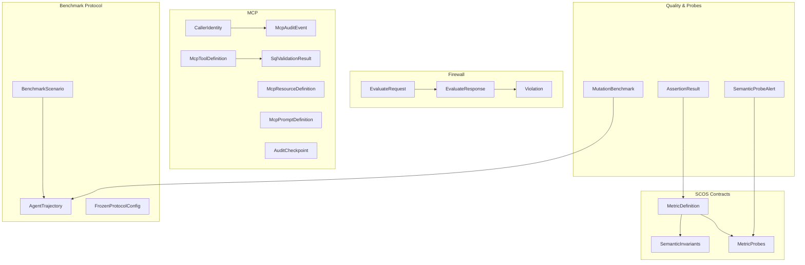
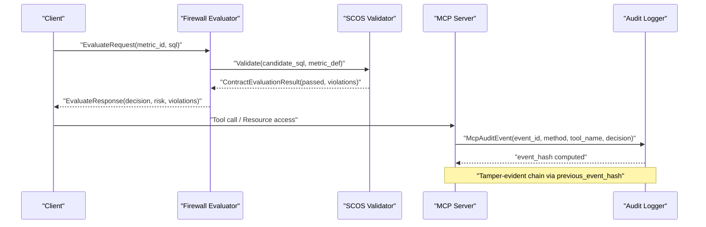
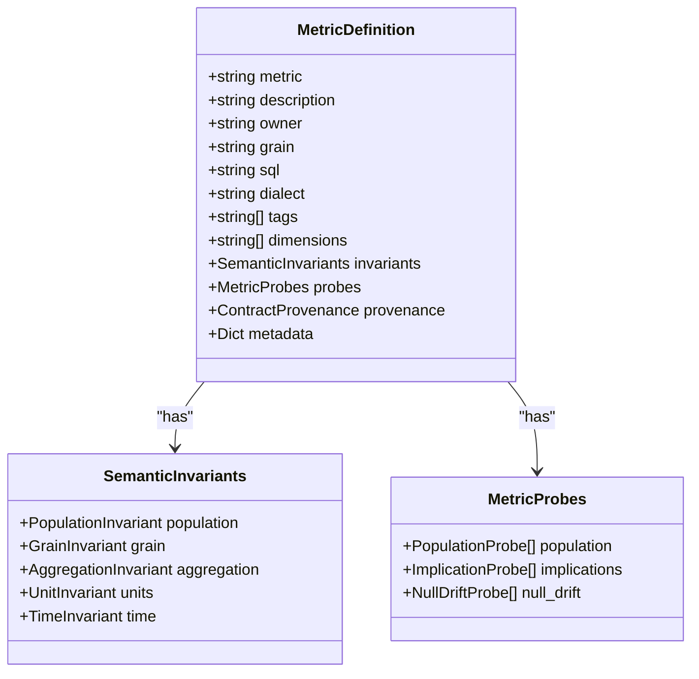
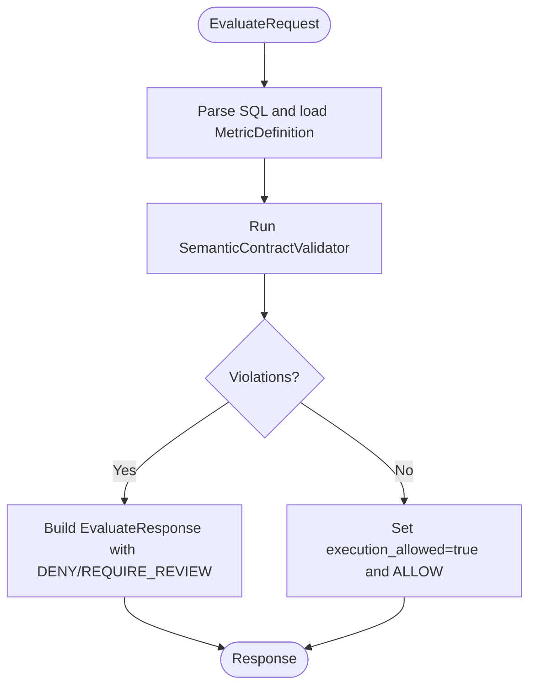
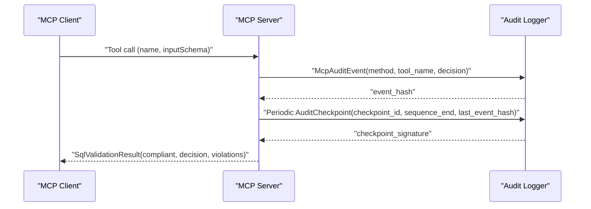
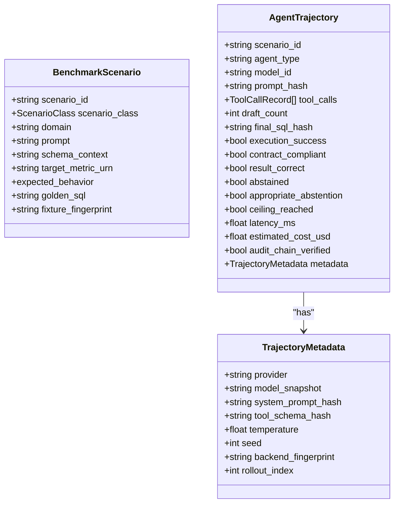
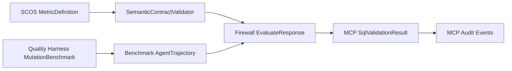

# Data Models

<cite>
**Referenced Files in This Document**
- [scos-v1.schema.json](file://spec/scos-v1.schema.json)
- [schema.py](file://semantic_reliability/compiler/schema.py)
- [contracts.py](file://semantic_reliability/compiler/contracts.py)
- [models.py (firewall)](file://semantic_reliability/firewall/models.py)
- [models.py (mcp)](file://semantic_reliability/mcp/models.py)
- [protocol.py](file://semantic_reliability/benchmark/protocol.py)
- [quality_harness.py](file://semantic_reliability/harness/quality_harness.py)
- [signals.py](file://semantic_reliability/probes/signals.py)
- [base.py](file://semantic_reliability/assertions/base.py)
- [contract.yaml (net_revenue example)](file://benchmark_corpus/dev/net_revenue/contract.yaml)
- [semantic_assertions.yaml (net_revenue example)](file://benchmark_corpus/dev/net_revenue/semantic_assertions.yaml)
</cite>

## Table of Contents
1. Introduction
2. Project Structure
3. Core Components
4. Architecture Overview
5. Detailed Component Analysis
6. Dependency Analysis
7. Performance Considerations
8. Troubleshooting Guide
9. Conclusion
10. Appendices

## Introduction
This document provides comprehensive data model documentation for the system, focusing on Pydantic models, JSON schemas, and data structures used across SCOS contracts, firewall request/response handling, MCP protocol messages, benchmarking protocols, probes, and assertions. It details field descriptions, validation rules, relationships, serialization formats, versioning strategies, backward compatibility guarantees, and extension points for custom data types.

## Project Structure
The data models are organized by subsystem:
- SCOS contract schema and Pydantic definitions define canonical metric contracts, semantic invariants, and runtime probes.
- Firewall models govern SQL evaluation requests/responses with decisions and violations.
- MCP models define tool/resource/prompt definitions, audit events, checkpoints, and SQL validation results.
- Benchmark protocol models capture agent trajectories, scenarios, and frozen configuration for reproducibility.
- Quality harness models evaluate mutation robustness of test suites.
- Probes and assertions models represent runtime signals and assertion outcomes.

**Diagram sources**
- [schema.py:83-97](file://semantic_reliability/compiler/schema.py#L83-L97)
- [schema.py:31-37](file://semantic_reliability/compiler/schema.py#L31-L37)
- [schema.py:65-69](file://semantic_reliability/compiler/schema.py#L65-L69)
- [models.py (firewall):20-50](file://semantic_reliability/firewall/models.py#L20-L50)
- [models.py (mcp):9-121](file://semantic_reliability/mcp/models.py#L9-L121)
- [protocol.py:15-95](file://semantic_reliability/benchmark/protocol.py#L15-L95)
- [quality_harness.py:25-32](file://semantic_reliability/harness/quality_harness.py#L25-L32)
- [signals.py:5-17](file://semantic_reliability/probes/signals.py#L5-L17)
- [base.py:6-14](file://semantic_reliability/assertions/base.py#L6-L14)

**Section sources**
- [schema.py:83-97](file://semantic_reliability/compiler/schema.py#L83-L97)
- [models.py (firewall):20-50](file://semantic_reliability/firewall/models.py#L20-L50)
- [models.py (mcp):9-121](file://semantic_reliability/mcp/models.py#L9-L121)
- [protocol.py:15-95](file://semantic_reliability/benchmark/protocol.py#L15-L95)
- [quality_harness.py:25-32](file://semantic_reliability/harness/quality_harness.py#L25-L32)
- [signals.py:5-17](file://semantic_reliability/probes/signals.py#L5-L17)
- [base.py:6-14](file://semantic_reliability/assertions/base.py#L6-L14)

## Core Components
- SCOS Contract Model: MetricDefinition encapsulates metric identity, canonical SQL, dialect, tags, dimensions, invariants, probes, provenance, and metadata. SemanticInvariants defines population, grain, aggregation, units, and time constraints. MetricProbes defines population, implication, and null drift checks.
- Firewall Request/Response: EvaluateRequest carries SQL to evaluate; EvaluateResponse includes decision, risk, violations, and compliance flags. Violation captures rule mismatch details and optional mutation equivalence mapping.
- MCP Protocol Models: CallerIdentity binds tenant/domain/role; McpToolDefinition/McpResourceDefinition/McpPromptDefinition describe server capabilities; McpAuditEvent/AuditCheckpoint provide tamper-evident audit trails; SqlValidationResult reports policy-compliant evaluation outcomes.
- Benchmark Protocol: BenchmarkScenario defines immutable scenario inputs; AgentTrajectory records tool calls, final SQL hash, execution success, and cost/latency; FrozenProtocolConfig ensures reproducibility.
- Quality Harness: MutationBenchmark aggregates mutation catch rates; MutationEvaluation details per-mutation check outcomes.
- Probes and Assertions: SemanticProbeAlert signals statistical reality shifts; AssertionResult represents individual assertion outcomes.

**Section sources**
- [schema.py:83-97](file://semantic_reliability/compiler/schema.py#L83-L97)
- [schema.py:31-37](file://semantic_reliability/compiler/schema.py#L31-L37)
- [schema.py:65-69](file://semantic_reliability/compiler/schema.py#L65-L69)
- [models.py (firewall):20-50](file://semantic_reliability/firewall/models.py#L20-L50)
- [models.py (mcp):9-121](file://semantic_reliability/mcp/models.py#L9-L121)
- [protocol.py:15-95](file://semantic_reliability/benchmark/protocol.py#L15-L95)
- [quality_harness.py:25-32](file://semantic_reliability/harness/quality_harness.py#L25-L32)
- [signals.py:5-17](file://semantic_reliability/probes/signals.py#L5-L17)
- [base.py:6-14](file://semantic_reliability/assertions/base.py#L6-L14)

## Architecture Overview
The data flow spans contract definition, evaluation, auditing, and observability:
- SCOS contracts define ground-truth metrics and invariants.
- Firewall evaluates candidate SQL against contracts and returns decisions and violations.
- MCP server exposes tools/resources/prompts and logs tamper-evident audit events and checkpoints.
- Benchmark protocol captures agent trajectories and tool usage for evaluation.
- Probes and assertions monitor runtime data quality and semantic drift.

**Diagram sources**
- [models.py (firewall):20-50](file://semantic_reliability/firewall/models.py#L20-L50)
- [contracts.py:26-134](file://semantic_reliability/compiler/contracts.py#L26-L134)
- [models.py (mcp):43-121](file://semantic_reliability/mcp/models.py#L43-L121)

## Detailed Component Analysis

### SCOS Contract Models
- MetricDefinition fields:
  - metric: unique identifier slug
  - description: human-readable purpose
  - owner: responsible team/domain
  - grain: reporting granularity
  - sql: canonical ground-truth query
  - dialect: SQL dialect for parsing/validation
  - tags: categorization labels
  - dimensions: allowed slice/dice dimensions
  - invariants: semantic constraints (population, grain, aggregation, units, time)
  - probes: runtime statistical expectations (population, implications, null_drift)
  - provenance: verifiable upstream sourcing metadata
  - metadata: arbitrary custom key-value store
- SemanticInvariants:
  - population.required_filters/forbidden_filters
  - grain.required_dimensions/allow_over_aggregation
  - aggregation.required_function/positive_components/negative_components
  - units.currency/scale
  - time.timezone/period_grain
- MetricProbes:
  - PopulationProbe: column/target_value/baseline_rate/tolerance
  - ImplicationProbe: condition_column/condition_value/implication_column/implication_operator/implication_value/baseline_confidence/tolerance_drop
  - NullDriftProbe: column/baseline_null_rate/tolerance

Validation rules and constraints:
- Dialect must be one of supported engines; defaults vary by context.
- Invariant filters and dimensions are validated against parsed AST or normalized strings.
- Probe rates and confidence values constrained to [0.0, 1.0].
- Timezone enforcement ensures UTC alignment when required.

Serialization and versioning:
- JSON Schema v1.0.0 defines strict structure for contracts; scos_version enum enforces spec version.
- Backward compatibility: new optional fields (metadata, provenance) do not break older consumers; required fields remain stable.

Extension points:
- Custom invariants can be added via additional properties under invariants; validators should parse and enforce them.
- Probes can be extended with new probe types while maintaining list-based composition.

**Diagram sources**
- [schema.py:83-97](file://semantic_reliability/compiler/schema.py#L83-L97)
- [schema.py:31-37](file://semantic_reliability/compiler/schema.py#L31-L37)
- [schema.py:65-69](file://semantic_reliability/compiler/schema.py#L65-L69)

**Section sources**
- [schema.py:83-97](file://semantic_reliability/compiler/schema.py#L83-L97)
- [schema.py:31-37](file://semantic_reliability/compiler/schema.py#L31-L37)
- [schema.py:65-69](file://semantic_reliability/compiler/schema.py#L65-L69)
- [scos-v1.schema.json:1-163](file://spec/scos-v1.schema.json#L1-L163)

### Firewall Request/Response Models
- EvaluateRequest:
  - request_id: unique request identifier
  - metric_id: target metric
  - sql: candidate SQL to evaluate
  - dialect: SQL dialect (default duckdb)
  - agent_id: caller agent identifier
  - question: optional natural language context
- Violation:
  - rule: violated invariant rule
  - expected: expected value/pattern
  - found: actual value/pattern
  - severity: severity level
  - invariant_type: category of invariant
  - mutation_equivalent: maps failure to mutation operator
- EvaluateResponse:
  - request_id: correlates to request
  - trace_id: tracing identifier
  - decision: ALLOW/AUDIT/REQUIRE_REVIEW/DENY
  - execution_allowed: boolean flag
  - contract_compliant: boolean flag
  - risk: LOW/MEDIUM/HIGH/CRITICAL
  - violations: list of violations
  - contract_version: version of contract used
  - message: optional human-readable message

Business constraints:
- Decision is derived from violation severity and policy; execution_allowed gates downstream execution.
- Risk levels guide escalation paths.

Validation rules:
- Enums restrict decision/risk to predefined sets.
- Optional fields allow flexible messaging without breaking contracts.

**Diagram sources**
- [models.py (firewall):20-50](file://semantic_reliability/firewall/models.py#L20-L50)
- [contracts.py:26-134](file://semantic_reliability/compiler/contracts.py#L26-L134)

**Section sources**
- [models.py (firewall):20-50](file://semantic_reliability/firewall/models.py#L20-L50)
- [contracts.py:26-134](file://semantic_reliability/compiler/contracts.py#L26-L134)

### MCP Protocol Models
- CallerIdentity: client_id, tenant_id, allowed_domains, role, authenticated
- McpToolDefinition: name, description, inputSchema
- McpResourceDefinition: uri, name, description, mimeType
- McpPromptDefinition: name, description, arguments (list of McpPromptArgument)
- McpAuditEvent: event_id, sequence_num, timestamp_utc, method, tool_name, resource_uri, metric_id, tenant_id, domain, sql_sha256, decision, latency_ms, client_id, key_id, previous_event_hash, event_hash; compute_hash() produces SHA-256 over canonical payload
- AuditCheckpoint: checkpoint_id, sequence_end, last_event_hash, checkpoint_timestamp, key_id, total_events_verified, checkpoint_signature; compute_signature() uses HMAC-SHA256 with environment or explicit signing key
- SqlValidationResult: metric_id, contract_version, compliant, decision, violations, execution_performed, policy_version, sql_sha256, latency_ms

Validation and security:
- Audit events are tamper-evident via chained hashes; checkpoints sign sequences using HMAC.
- Signing requires configured key; missing key raises error.

Serialization:
- Canonical JSON for hashing uses sorted keys and compact separators.
- Policy version indicates schema conformance.

**Diagram sources**
- [models.py (mcp):9-121](file://semantic_reliability/mcp/models.py#L9-L121)

**Section sources**
- [models.py (mcp):9-121](file://semantic_reliability/mcp/models.py#L9-L121)

### Benchmark Protocol Models
- ScenarioClass: CLEAR_CONTRACT, AMBIGUOUS_METRIC, MISSING_CONTRACT, CONTRACT_CONFLICT
- BenchmarkScenario: scenario_id, scenario_class, domain, prompt, schema_context, target_metric_urn, expected_behavior, golden_sql, fixture_fingerprint
- ToolCallRecord: tool, arguments_hash, result_summary, latency_ms
- TrajectoryMetadata: provider, model_snapshot, system_prompt_hash, tool_schema_hash, temperature, seed, backend_fingerprint, rollout_index
- AgentTrajectory: scenario_id, agent_type, model_id, prompt_hash, tool_calls, draft_count, final_sql_hash, final_sql_raw (excluded from export), execution_success, contract_compliant, result_correct, abstained, appropriate_abstention, ceiling_reached, latency_ms, estimated_cost_usd, audit_chain_verified, metadata
- NetGovernancePolicy: weights for latency/cost/abstention penalty, version
- FrozenProtocolConfig: protocol_version, scenario_commit, contract_commit, model_id, temperature, max_tool_calls, max_iterations, num_rollouts, fixture_version, policy_version

Validation and reproducibility:
- Expected behavior is a literal set ensuring controlled agent responses.
- Redaction strips raw SQL for safe export.
- Frozen config locks run parameters for exact reproducibility.

**Diagram sources**
- [protocol.py:15-95](file://semantic_reliability/benchmark/protocol.py#L15-L95)

**Section sources**
- [protocol.py:15-95](file://semantic_reliability/benchmark/protocol.py#L15-L95)

### Quality Harness Models
- TestCheckResult: check_name, passed, details
- MutationEvaluation: mutation, caught, catching_checks, failed_checks, check_results, blind_spot
- MutationBenchmark: total_mutations, caught_mutations, uncaught_mutations, mutation_score_pct, evaluations

Validation and scoring:
- Scores computed as percentage of caught mutations; evaluations detail per-mutation outcomes.
- Simulated checks demonstrate typical blind spots and detection patterns.

**Section sources**
- [quality_harness.py:8-32](file://semantic_reliability/harness/quality_harness.py#L8-L32)
- [quality_harness.py:34-113](file://semantic_reliability/harness/quality_harness.py#L34-L113)

### Probes and Assertions Models
- SemanticProbeAlert: signal_type, contract, baseline, current, relative_change, confidence, likely_causes, action_required
- AssertionResult: name, assertion_type, passed, description, failure_reason, execution_time_ms

Validation and signaling:
- Confidence is restricted to high/medium/low literals.
- Alerts include actionable guidance for human review.

**Section sources**
- [signals.py:5-17](file://semantic_reliability/probes/signals.py#L5-L17)
- [base.py:6-14](file://semantic_reliability/assertions/base.py#L6-L14)

## Dependency Analysis
- SCOS schema drives contract validation; MetricDefinition composes SemanticInvariants and MetricProbes.
- Firewall depends on SCOS validator to produce EvaluateResponse with decisions and violations.
- MCP audit models depend on cryptographic primitives for tamper evidence; SqlValidationResult ties back to SCOS policy versions.
- Benchmark protocol models record tool usage and outcomes, linking to SCOS via target_metric_urn and golden_sql.
- Quality harness integrates with mutation engine to assess test suite resilience.

**Diagram sources**
- [schema.py:83-97](file://semantic_reliability/compiler/schema.py#L83-L97)
- [contracts.py:26-134](file://semantic_reliability/compiler/contracts.py#L26-L134)
- [models.py (firewall):20-50](file://semantic_reliability/firewall/models.py#L20-L50)
- [models.py (mcp):43-121](file://semantic_reliability/mcp/models.py#L43-L121)
- [protocol.py:48-67](file://semantic_reliability/benchmark/protocol.py#L48-L67)
- [quality_harness.py:25-32](file://semantic_reliability/harness/quality_harness.py#L25-L32)

**Section sources**
- [schema.py:83-97](file://semantic_reliability/compiler/schema.py#L83-L97)
- [contracts.py:26-134](file://semantic_reliability/compiler/contracts.py#L26-L134)
- [models.py (firewall):20-50](file://semantic_reliability/firewall/models.py#L20-L50)
- [models.py (mcp):43-121](file://semantic_reliability/mcp/models.py#L43-L121)
- [protocol.py:48-67](file://semantic_reliability/benchmark/protocol.py#L48-L67)
- [quality_harness.py:25-32](file://semantic_reliability/harness/quality_harness.py#L25-L32)

## Performance Considerations
- AST parsing and normalization in validators can be costly; caching parsed ASTs per dialect improves throughput.
- Audit event hashing and checkpoint signatures involve cryptographic operations; batch processing reduces overhead.
- Benchmark trajectory exports exclude raw SQL to minimize payload size and improve I/O performance.
- Probe computations should be sampled or bounded to avoid excessive database scans.

[No sources needed since this section provides general guidance]

## Troubleshooting Guide
Common validation errors and remedies:
- Missing required filters in WHERE clause: add specified predicates to satisfy population invariants.
- Incorrect grouping dimensions: include required dimensions in GROUP BY to meet grain invariants.
- Omitted positive/negative components: ensure net aggregation includes all required terms.
- Non-UTC timezone usage: align timestamps to UTC when required by time invariants.
- Audit signature generation failures: configure SRE_AUDIT_SIGNING_KEY or pass explicit signing_key.

Data validation errors:
- Enum mismatches for decision/risk/confidence: use allowed values.
- Probe rate out of range: ensure values within [0.0, 1.0].

Extension points:
- Add custom invariants under SemanticInvariants and implement corresponding checks in validators.
- Extend MetricProbes with new probe types and integrate into runtime monitoring.

**Section sources**
- [contracts.py:44-127](file://semantic_reliability/compiler/contracts.py#L44-L127)
- [models.py (mcp):95-108](file://semantic_reliability/mcp/models.py#L95-L108)

## Conclusion
The system’s data models provide a robust foundation for defining, validating, and observing business metrics through SCOS contracts, enforcing SQL safety via firewall decisions, exposing capabilities and auditing via MCP, evaluating agent behaviors through benchmark protocols, and measuring test suite resilience with quality harness models. Strict schemas and enums ensure consistency, while extension points enable customization and evolution.

[No sources needed since this section summarizes without analyzing specific files]

## Appendices

### JSON Schema Definitions and Examples
- SCOS v1.0.0 schema defines required fields and nested structures for invariants and probes. Example contract demonstrates metric identity, invariants, and canonical SQL.

Example references:
- [scos-v1.schema.json:1-163](file://spec/scos-v1.schema.json#L1-L163)
- [contract.yaml (net_revenue example):1-19](file://benchmark_corpus/dev/net_revenue/contract.yaml#L1-L19)
- [semantic_assertions.yaml (net_revenue example):1-18](file://benchmark_corpus/dev/net_revenue/semantic_assertions.yaml#L1-L18)

**Section sources**
- [scos-v1.schema.json:1-163](file://spec/scos-v1.schema.json#L1-L163)
- [contract.yaml (net_revenue example):1-19](file://benchmark_corpus/dev/net_revenue/contract.yaml#L1-L19)
- [semantic_assertions.yaml (net_revenue example):1-18](file://benchmark_corpus/dev/net_revenue/semantic_assertions.yaml#L1-L18)