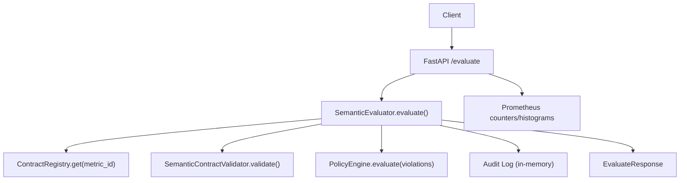
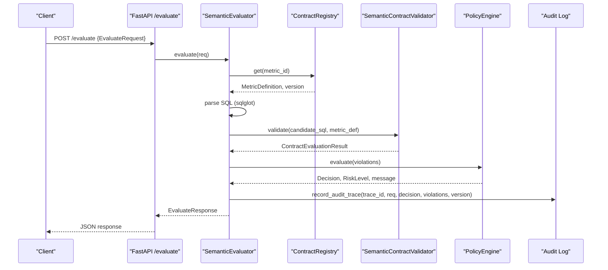
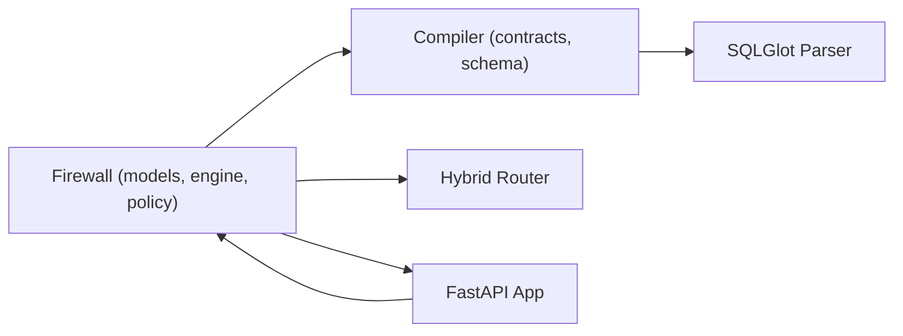
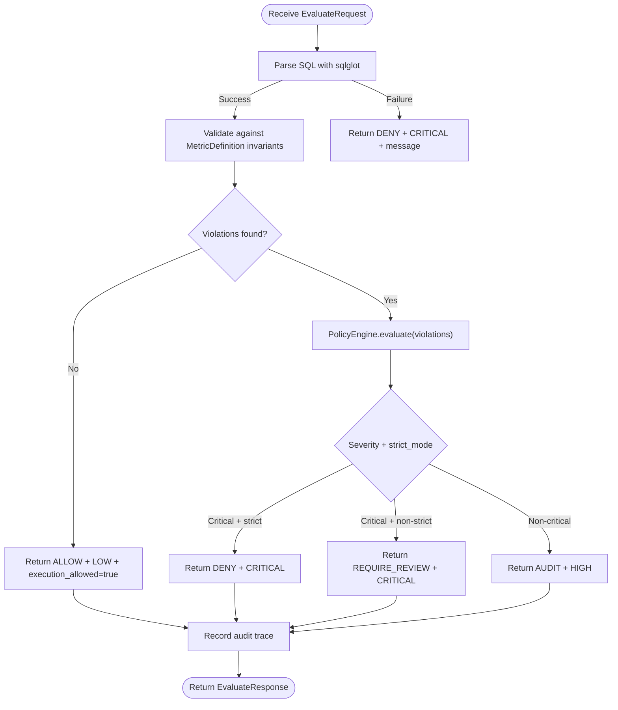

# Firewall Request/Response Models

<cite>
**Referenced Files in This Document**
- [models.py](file://semantic_reliability/firewall/models.py)
- [engine.py](file://semantic_reliability/firewall/engine.py)
- [policy.py](file://semantic_reliability/firewall/policy.py)
- [hybrid_router.py](file://semantic_reliability/firewall/hybrid_router.py)
- [main.py](file://semantic_reliability/firewall/main.py)
- [contracts.py](file://semantic_reliability/compiler/contracts.py)
- [schema.py](file://semantic_reliability/compiler/schema.py)
- [test_firewall.py](file://tests/test_firewall.py)
- [contract.yaml](file://benchmark_corpus/dev/net_revenue/contract.yaml)
</cite>

## Table of Contents
1. [Introduction](#introduction)
2. [Project Structure](#project-structure)
3. [Core Components](#core-components)
4. [Architecture Overview](#architecture-overview)
5. [Detailed Component Analysis](#detailed-component-analysis)
6. [Dependency Analysis](#dependency-analysis)
7. [Performance Considerations](#performance-considerations)
8. [Troubleshooting Guide](#troubleshooting-guide)
9. [Conclusion](#conclusion)
10. [Appendices](#appendices)

## Introduction
This document describes the firewall engine data models and processing pipeline that enforce semantic contracts on SQL queries generated by AI agents. It focuses on:
- Request models for SQL inputs, context parameters, and agent identity
- Response models covering execution decisions, policy outcomes, and audit trails
- Decision models representing governance outcomes (ALLOW, AUDIT, REQUIRE_REVIEW, DENY)
- Validation rules, error handling patterns, and security constraints
- Typical request/response flows through the firewall pipeline
- Serialization formats, API boundaries, and integration points
- Performance considerations for high-throughput scenarios and caching strategies

## Project Structure
The firewall subsystem is organized around a small set of focused modules:
- Data models and enums define the contract boundary between callers and the firewall
- The engine orchestrates parsing, validation, policy evaluation, and audit logging
- The policy engine computes governance decisions based on violations and strictness mode
- A hybrid router provides static-first verification with adaptive escalation to runtime checks
- A FastAPI application exposes HTTP endpoints for evaluation, health, and metrics

**Diagram sources**
- [main.py:23-53](file://semantic_reliability/firewall/main.py#L23-L53)
- [engine.py:47-117](file://semantic_reliability/firewall/engine.py#L47-L117)
- [policy.py:32-68](file://semantic_reliability/firewall/policy.py#L32-L68)

**Section sources**
- [main.py:23-70](file://semantic_reliability/firewall/main.py#L23-L70)
- [engine.py:19-133](file://semantic_reliability/firewall/engine.py#L19-L133)

## Core Components
- EvaluateRequest: Captures the incoming SQL query, target metric, dialect, and agent identity
- EvaluateResponse: Carries decision, risk, compliance status, violations, trace ID, and message
- Violation: Describes a specific invariant breach with rule, expected/found values, severity, and mutation equivalence
- Decision/RiskLevel: Enumerated governance outcomes and risk levels
- ContractRegistry: In-memory registry of metric definitions loaded from YAML contracts
- SemanticEvaluator: Orchestrates parsing, validation, policy evaluation, and audit recording
- PolicyEngine: Maps violations to governance decisions and enriches with mutation oracle mapping
- HybridValidator: Static-first verification with optional runtime escalation

Key responsibilities:
- Enforce semantic invariants defined per metric
- Provide deterministic ALLOW/DENY/AUDIT/REQUIRE_REVIEW decisions
- Record immutable audit traces per request
- Expose a stable HTTP API for integration

**Section sources**
- [models.py:6-51](file://semantic_reliability/firewall/models.py#L6-L51)
- [engine.py:19-133](file://semantic_reliability/firewall/engine.py#L19-L133)
- [policy.py:1-68](file://semantic_reliability/firewall/policy.py#L1-L68)
- [hybrid_router.py:19-156](file://semantic_reliability/firewall/hybrid_router.py#L19-L156)

## Architecture Overview
The firewall processes each request as follows:
- Parse and validate SQL against the target metric’s declared invariants
- Compute violations using AST-based checks
- Apply policy rules to determine governance outcome
- Record an immutable audit trace including SQL hash and decision
- Return a structured response suitable for serialization over HTTP

**Diagram sources**
- [main.py:36-53](file://semantic_reliability/firewall/main.py#L36-L53)
- [engine.py:55-117](file://semantic_reliability/firewall/engine.py#L55-L117)
- [contracts.py:26-135](file://semantic_reliability/compiler/contracts.py#L26-L135)
- [policy.py:32-68](file://semantic_reliability/firewall/policy.py#L32-L68)

## Detailed Component Analysis

### Request Model: EvaluateRequest
- Fields:
  - request_id: Unique identifier for the request
  - metric_id: Target metric whose contract must be enforced
  - sql: Candidate SQL to evaluate
  - dialect: SQL dialect used for parsing (default duckdb)
  - agent_id: Identity of the calling agent or service
  - question: Optional natural language question context
- Purpose:
  - Provides all necessary context to locate the correct metric contract and perform semantic validation
  - Enables per-agent observability and policy enforcement

Validation and constraints:
- Dialect defaults to duckdb; ensure compatibility with parser
- Agent_id is required for audit and metrics labeling

Security considerations:
- Treat agent_id as untrusted; use it only for identification and metrics
- Do not execute arbitrary code; rely on declarative contracts and AST analysis

**Section sources**
- [models.py:20-27](file://semantic_reliability/firewall/models.py#L20-L27)
- [main.py:36-53](file://semantic_reliability/firewall/main.py#L36-L53)

### Response Model: EvaluateResponse
- Fields:
  - request_id: Echoed from request
  - trace_id: Unique trace for this evaluation
  - decision: Governance outcome (ALLOW, AUDIT, REQUIRE_REVIEW, DENY)
  - execution_allowed: Boolean derived from decision
  - contract_compliant: True if zero violations
  - risk: Risk level associated with the decision
  - violations: List of Violation objects describing invariant breaches
  - contract_version: Version of the metric contract used
  - message: Human-readable explanation or error details
- Purpose:
  - Communicates the final decision and supporting evidence
  - Enables downstream systems to act accordingly (allow, block, escalate)

Error handling:
- Unparseable SQL yields DENY with CRITICAL risk and a descriptive message
- Missing metric contract raises an error upstream; caller should handle appropriately

**Section sources**
- [models.py:29-51](file://semantic_reliability/firewall/models.py#L29-L51)
- [engine.py:55-117](file://semantic_reliability/firewall/engine.py#L55-L117)

### Decision and Risk Models
- Decision:
  - ALLOW: Execution permitted without further action
  - AUDIT: Execution permitted but logged for audit
  - REQUIRE_REVIEW: Requires manual review before execution
  - DENY: Execution blocked
- RiskLevel:
  - LOW, MEDIUM, HIGH, CRITICAL
- Usage:
  - PolicyEngine maps violation severity and strict_mode to a Decision and RiskLevel
  - Tests assert behavior across compliant, non-compliant, and strict/non-strict modes

**Section sources**
- [models.py:6-18](file://semantic_reliability/firewall/models.py#L6-L18)
- [policy.py:32-68](file://semantic_reliability/firewall/policy.py#L32-L68)
- [test_firewall.py:28-72](file://tests/test_firewall.py#L28-L72)

### Violation Model
- Fields:
  - rule: Identifier of the violated invariant rule
  - expected: Description of what was expected
  - found: Details about what was actually present
  - severity: Severity classification (e.g., ERROR, CRITICAL)
  - invariant_type: Category of invariant (population, grain, aggregation, etc.)
  - mutation_equivalent: Mapping to a mutation operator for analysis
- Purpose:
  - Standardizes violation reporting across the pipeline
  - Supports downstream analytics and remediation guidance

Enrichment:
- PolicyEngine augments violations with mutation_equivalent based on rule/invariant type

**Section sources**
- [models.py:29-39](file://semantic_reliability/firewall/models.py#L29-L39)
- [policy.py:17-29](file://semantic_reliability/firewall/policy.py#L17-L29)
- [engine.py:87-99](file://semantic_reliability/firewall/engine.py#L87-L99)

### Contract Registry and Metric Definitions
- ContractRegistry:
  - Loads metric definitions from YAML files under a configured directory
  - Stores tuples of MetricDefinition and version keyed by metric_id
  - Raises ValueError when an unknown metric_id is requested
- MetricDefinition:
  - Declares metric identity, owner, grain, canonical SQL, dialect, tags, dimensions
  - Includes SemanticInvariants defining population, grain, aggregation, units, time constraints
  - Supports probes and provenance metadata

Typical contract example:
- net_revenue defines required filters, aggregation components, and grouping semantics

**Section sources**
- [engine.py:19-45](file://semantic_reliability/firewall/engine.py#L19-L45)
- [schema.py:5-98](file://semantic_reliability/compiler/schema.py#L5-L98)
- [contract.yaml:1-19](file://benchmark_corpus/dev/net_revenue/contract.yaml#L1-L19)

### Semantic Evaluator
Responsibilities:
- Resolve metric definition and version
- Parse SQL using sqlglot with specified dialect
- Validate candidate SQL against metric invariants
- Compute violations and map them to policy decisions
- Record immutable audit traces with SQL hash and decision
- Return EvaluateResponse with comprehensive context

Error handling:
- Unknown metric contract: handled via registry.get raising ValueError
- SQL parse errors: return DENY with CRITICAL risk and descriptive message
- Other exceptions during parsing: return DENY with CRITICAL risk

**Section sources**
- [engine.py:47-133](file://semantic_reliability/firewall/engine.py#L47-L133)

### Policy Engine
Responsibilities:
- Map violations to governance decisions based on severity and strict_mode
- Enrich violations with mutation_equivalent for deeper analysis
- Determine risk level and human-readable message

Decision logic:
- No violations: ALLOW, LOW risk
- Any critical/error violations:
  - Strict mode: DENY, CRITICAL risk
  - Non-strict: REQUIRE_REVIEW, CRITICAL risk
- Otherwise: AUDIT, HIGH risk

**Section sources**
- [policy.py:1-68](file://semantic_reliability/firewall/policy.py#L1-L68)

### Hybrid Validator (Static-First Verification)
Responsibilities:
- Run static SCOS AST linter first for fast path
- Assess AST characteristics to decide whether to escalate to runtime relational oracle
- Execute runtime assertions if needed and aggregate results

Escalation triggers:
- Multiple nested CTEs or deep subqueries
- Window functions requiring relational execution
- Complex conditional branches needing runtime contrastive evaluation

Output:
- HybridValidationResult includes routing tier, decision, escalation reason, static/runtime results, latency, and synthetic bytes scanned

**Section sources**
- [hybrid_router.py:19-156](file://semantic_reliability/firewall/hybrid_router.py#L19-L156)

### API Boundaries and Serialization
- Endpoint: POST /evaluate
  - Request body: EvaluateRequest serialized as JSON
  - Response body: EvaluateResponse serialized as JSON
- Health endpoint: GET /health returns status and loaded metrics
- Metrics endpoint: GET /metrics returns Prometheus metrics if available

Serialization format:
- Pydantic models are automatically serialized to JSON by FastAPI
- All fields are typed and validated at boundaries

Integration points:
- External systems can call /evaluate to gate SQL execution
- Prometheus metrics enable monitoring and alerting

**Section sources**
- [main.py:23-70](file://semantic_reliability/firewall/main.py#L23-L70)

## Dependency Analysis
The firewall depends on compiler components for contract validation and schema definitions:

**Diagram sources**
- [engine.py:11-15](file://semantic_reliability/firewall/engine.py#L11-L15)
- [contracts.py:1-135](file://semantic_reliability/compiler/contracts.py#L1-L135)
- [schema.py:1-98](file://semantic_reliability/compiler/schema.py#L1-L98)
- [hybrid_router.py:1-156](file://semantic_reliability/firewall/hybrid_router.py#L1-L156)
- [main.py:1-70](file://semantic_reliability/firewall/main.py#L1-L70)

**Section sources**
- [engine.py:11-15](file://semantic_reliability/firewall/engine.py#L11-L15)
- [contracts.py:1-135](file://semantic_reliability/compiler/contracts.py#L1-L135)
- [schema.py:1-98](file://semantic_reliability/compiler/schema.py#L1-L98)

## Performance Considerations
- Static-first path:
  - AST parsing and invariant checks are fast and avoid warehouse execution
  - Hybrid validator returns quickly for simple queries without escalation
- Caching strategies:
  - ContractRegistry is in-memory; consider preloading contracts at startup
  - Cache parsed ASTs or normalized forms for repeated queries if needed
  - Use metric_id to short-circuit lookups; ensure unique metric identifiers
- High-throughput tuning:
  - Enable Prometheus metrics to monitor latency and decision distribution
  - Avoid unnecessary string operations; reuse parsed structures where possible
  - Consider connection pooling for any runtime escalation paths
- Escalation cost:
  - Runtime escalation incurs additional compute; limit to complex queries
  - Track latency_ms and bytes_scanned in hybrid results for observability

[No sources needed since this section provides general guidance]

## Troubleshooting Guide
Common issues and resolutions:
- Unknown metric contract:
  - Ensure metric_id exists in registry; verify contract files are loadable
  - Check YAML structure matches MetricDefinition schema
- SQL parse errors:
  - Validate dialect matches the SQL syntax
  - Fix malformed SQL; firewall will DENY with CRITICAL risk
- Unexpected DENY decisions:
  - Review violations list for missing filters, dimensions, or aggregation components
  - Adjust strict_mode if you need REVIEW instead of DENY for critical issues
- Audit trail gaps:
  - Confirm evaluator records traces; inspect in-memory log for debugging
  - Ensure trace_id is propagated to clients for correlation

Operational tips:
- Use /health to verify loaded contracts and metrics
- Use /metrics to observe request volume, decision distribution, and latency
- Inspect test cases for expected behaviors across different scenarios

**Section sources**
- [engine.py:55-133](file://semantic_reliability/firewall/engine.py#L55-L133)
- [policy.py:32-68](file://semantic_reliability/firewall/policy.py#L32-L68)
- [test_firewall.py:28-100](file://tests/test_firewall.py#L28-L100)
- [main.py:56-70](file://semantic_reliability/firewall/main.py#L56-L70)

## Conclusion
The firewall engine provides a robust, policy-driven gate for AI-generated SQL. It enforces semantic contracts through AST-based validation, applies governance decisions via a configurable policy engine, and produces comprehensive responses with audit trails. The hybrid router enhances safety by escalating complex queries to runtime checks while maintaining low latency for simple cases. With clear API boundaries, standardized models, and observability hooks, the system integrates smoothly into production pipelines and supports high-throughput environments.

[No sources needed since this section summarizes without analyzing specific files]

## Appendices

### Typical Request/Response Flows

#### Compliant Query Flow
- Client sends EvaluateRequest with valid SQL and known metric_id
- Evaluator parses SQL, validates invariants, finds no violations
- Policy returns ALLOW with LOW risk
- Audit trace recorded; response indicates execution allowed

#### Missing Filter Flow
- Client sends EvaluateRequest missing required filter
- Validator detects population invariant violation
- Policy returns DENY (strict) or REQUIRE_REVIEW (non-strict) with CRITICAL risk
- Audit trace includes violation details and mutation equivalence

#### Unparseable SQL Flow
- Client sends malformed SQL
- Parser raises exception; evaluator returns DENY with CRITICAL risk and parse error message
- Audit trace recorded with decision and message

**Diagram sources**
- [engine.py:55-117](file://semantic_reliability/firewall/engine.py#L55-L117)
- [policy.py:32-68](file://semantic_reliability/firewall/policy.py#L32-L68)

### Security Constraints
- Input validation:
  - SQL is parsed and analyzed; never executed directly by the firewall
  - Dialect must match expected syntax; mismatches cause parse errors
- Policy enforcement:
  - Strict mode blocks critical violations; non-strict requires review
- Auditability:
  - Immutable traces include SQL hash, agent_id, decision, and violations
- Integration safety:
  - Use agent_id for identification only; do not trust external inputs beyond model validation

**Section sources**
- [engine.py:55-133](file://semantic_reliability/firewall/engine.py#L55-L133)
- [policy.py:32-68](file://semantic_reliability/firewall/policy.py#L32-L68)