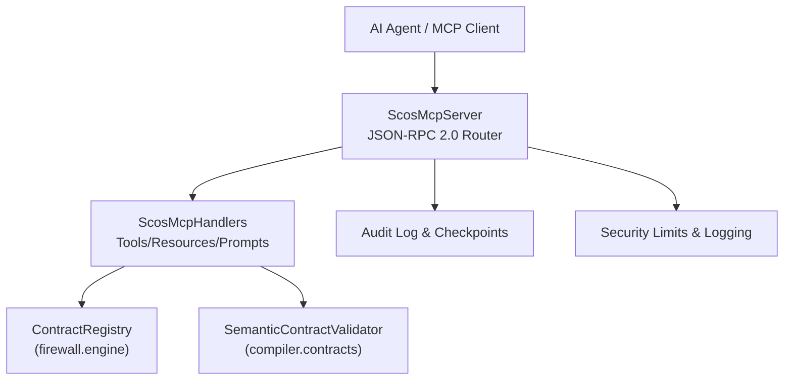
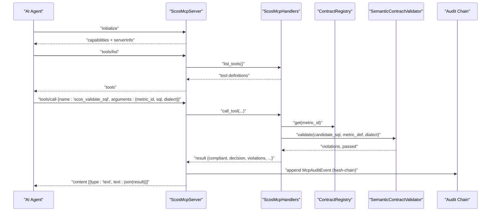
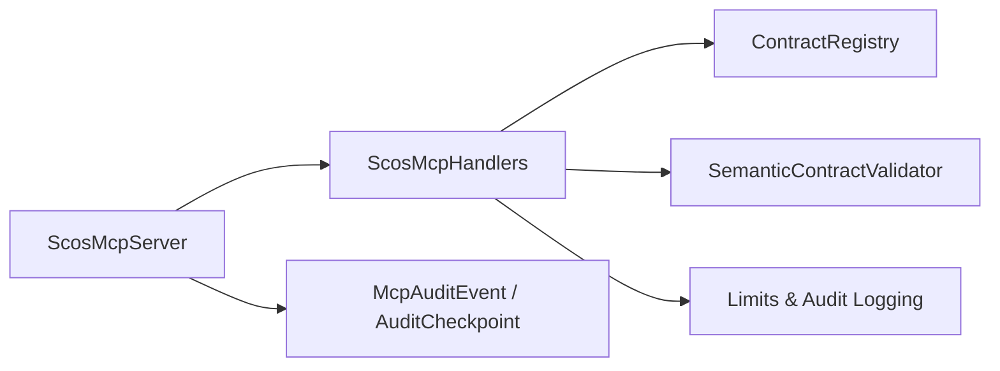

# MCP Protocol Models

<cite>
**Referenced Files in This Document**
- [models.py](file://semantic_reliability/mcp/models.py)
- [server.py](file://semantic_reliability/mcp/server.py)
- [handlers.py](file://semantic_reliability/mcp/handlers.py)
- [registry.py](file://semantic_reliability/mcp/registry.py)
- [security.py](file://semantic_reliability/mcp/security.py)
- [engine.py](file://semantic_reliability/firewall/engine.py)
- [test_mcp_server.py](file://tests/test_mcp_server.py)
- [MCP_SECURITY_AND_THREAT_MODEL.md](file://docs/MCP_SECURITY_AND_THREAT_MODEL.md)
</cite>

## Table of Contents
1. [Introduction](#introduction)
2. [Project Structure](#project-structure)
3. [Core Components](#core-components)
4. [Architecture Overview](#architecture-overview)
5. [Detailed Component Analysis](#detailed-component-analysis)
6. [Dependency Analysis](#dependency-analysis)
7. [Performance Considerations](#performance-considerations)
8. [Troubleshooting Guide](#troubleshooting-guide)
9. [Conclusion](#conclusion)
10. [Appendices](#appendices)

## Introduction
This document describes the Model Context Protocol (MCP) data models and interactions implemented by the SCOS semantic reliability engine for AI agent tool use. It covers:
- Tool call models with method signatures, parameter schemas, and return types
- Result models for success, error, and partial results
- Session management via JSON-RPC 2.0 request/response lifecycle and audit state
- JSON-RPC 2.0 message formats, protocol capabilities, and authentication binding
- Typical MCP interaction flows between agents and the semantic reliability engine
- Error handling strategies, limits, timeouts, and retry considerations
- Security model for untrusted agent code execution and resource access controls

## Project Structure
The MCP implementation is organized into focused modules:
- Data models and schemas define typed structures for tools, resources, prompts, audits, and validation results
- Server implements JSON-RPC 2.0 routing, capability negotiation, and tamper-evident audit chaining
- Handlers implement read-only business logic for metrics, contracts, SQL validation, prompts, and resources
- Registry provides URI resolution for contracts and policies
- Security module enforces payload limits, SQL length limits, and structured audit logging
- Firewall engine supplies contract registry and evaluation utilities used by handlers

**Diagram sources**
- [server.py:16-257](file://semantic_reliability/mcp/server.py#L16-L257)
- [handlers.py:19-409](file://semantic_reliability/mcp/handlers.py#L19-L409)
- [engine.py:19-133](file://semantic_reliability/firewall/engine.py#L19-L133)
- [security.py:1-57](file://semantic_reliability/mcp/security.py#L1-L57)

**Section sources**
- [server.py:16-257](file://semantic_reliability/mcp/server.py#L16-L257)
- [handlers.py:19-409](file://semantic_reliability/mcp/handlers.py#L19-L409)
- [engine.py:19-133](file://semantic_reliability/firewall/engine.py#L19-L133)
- [security.py:1-57](file://semantic_reliability/mcp/security.py#L1-L57)

## Core Components
- ScosMcpServer: JSON-RPC 2.0 server implementing initialize, tools/list, tools/call, resources/list, resources/read, prompts/list, prompts/get, and notifications/initialized. Enforces payload size limits and maps errors to standard JSON-RPC codes. Maintains a hash-chained audit log and signed checkpoints.
- ScosMcpHandlers: Read-only tool implementations for listing metrics, retrieving contracts, validating SQL against declared invariants, explaining violations, and retrieving probe status. Also exposes resources and prompts bound by domain authorization.
- Data Models: CallerIdentity, McpToolDefinition, McpResourceDefinition, McpPromptDefinition, McpAuditEvent, AuditCheckpoint, SqlValidationResult.
- Security: Enforces payload and SQL length limits, hashes SQL in logs, emits structured audit events with cryptographic chaining.
- Registry: Resolves scos:// URIs to metric definitions and invariants; supports URN mapping.

**Section sources**
- [server.py:16-257](file://semantic_reliability/mcp/server.py#L16-L257)
- [handlers.py:19-409](file://semantic_reliability/mcp/handlers.py#L19-L409)
- [models.py:9-121](file://semantic_reliability/mcp/models.py#L9-L121)
- [security.py:16-57](file://semantic_reliability/mcp/security.py#L16-L57)
- [registry.py:10-71](file://semantic_reliability/mcp/registry.py#L10-L71)

## Architecture Overview
The MCP server acts as a read-only semantic consultant. Agents interact via JSON-RPC 2.0 messages. The server validates requests, dispatches to handlers, performs AST-based SQL validation against declared invariants, and returns structured decisions without executing SQL. Every tool call is recorded in a tamper-evident audit chain with periodic signed checkpoints.

**Diagram sources**
- [server.py:50-180](file://semantic_reliability/mcp/server.py#L50-L180)
- [handlers.py:101-287](file://semantic_reliability/mcp/handlers.py#L101-L287)
- [engine.py:19-133](file://semantic_reliability/firewall/engine.py#L19-L133)

## Detailed Component Analysis

### JSON-RPC 2.0 Message Formats and Capabilities
- Request envelope: jsonrpc version "2.0", id, method, params object
- Supported methods:
  - initialize: negotiates protocolVersion and returns serverInfo and capabilities
  - tools/list: lists available tools with input schemas
  - tools/call: invokes a named tool with arguments
  - resources/list: lists available resources (contracts, policies)
  - resources/read: reads resource content by URI
  - prompts/list: lists prompt templates
  - prompts/get: retrieves a prompt template with arguments
  - notifications/initialized: no-op notification
- Response envelope: jsonrpc version "2.0", id, result or error with code/message
- Capability flags indicate listChanged and subscribe support for tools, resources, prompts

Typical example flows are validated in tests that exercise initialize, tools/list, and tools/call scenarios.

**Section sources**
- [server.py:50-180](file://semantic_reliability/mcp/server.py#L50-L180)
- [test_mcp_server.py:37-89](file://tests/test_mcp_server.py#L37-L89)

### Tool Call Models: Signatures, Parameters, Returns
- scos_list_metrics
  - Parameters: optional domain filter
  - Returns: list of metrics with metadata (id, version, domain, owner, grain, description), count
- scos_get_contract
  - Parameters: required metric_id, optional domain
  - Returns: full contract details including canonical SQL, invariants, probes, found flag
- scos_validate_sql
  - Parameters: required metric_id, sql, optional dialect
  - Returns: compliant boolean, decision (ALLOW/REQUIRE_REVIEW/DENY), violations array, execution_performed false, policy_version, sql_sha256, latency_ms
- scos_explain_violation
  - Parameters: required metric_id, rule
  - Returns: violated_rule, remediation guidance, automatic_rewrite_applied false
- scos_get_probe_status
  - Parameters: required metric_id
  - Returns: status, active_probes, last_evaluated_utc

All tool calls are read-only and never execute SQL on downstream systems.

**Section sources**
- [handlers.py:37-287](file://semantic_reliability/mcp/handlers.py#L37-L287)
- [test_mcp_server.py:51-110](file://tests/test_mcp_server.py#L51-L110)

### Result Models: Success, Error, Partial Results
- Success responses wrap tool results in JSON-RPC result envelopes. For tools/call, the result is serialized as a JSON string inside a content array with type text.
- Error responses follow JSON-RPC 2.0 error codes:
  - -32700 parse error (malformed JSON)
  - -32600 invalid request (non-object root, missing method)
  - -32601 method not found
  - -32602 invalid params (missing or wrong types)
  - -32603 internal error (unexpected exceptions)
- Partial results:
  - Validation returns structured failures with violations and decision when constraints are not met
  - Domain-scoped access returns explicit access denied payloads within tool results

**Section sources**
- [server.py:222-237](file://semantic_reliability/mcp/server.py#L222-L237)
- [handlers.py:121-287](file://semantic_reliability/mcp/handlers.py#L121-L287)
- [test_mcp_server.py:170-196](file://tests/test_mcp_server.py#L170-L196)

### Session Management: Connection State and Context Persistence
- No persistent session state is maintained across requests. Each request is processed independently with an optional CallerIdentity for tenant and domain scoping.
- Context persistence is achieved through:
  - In-memory ContractRegistry loaded at startup
  - Audit log and checkpoints retained in process memory for integrity verification
  - Optional signing secret derived from environment or generated at runtime

Domain scoping can be enforced per server instance via allowed_domains configuration.

**Section sources**
- [server.py:25-49](file://semantic_reliability/mcp/server.py#L25-L49)
- [handlers.py:25-34](file://semantic_reliability/mcp/handlers.py#L25-L34)
- [test_mcp_server.py:141-168](file://tests/test_mcp_server.py#L141-L168)

### Authentication Mechanisms
- CallerIdentity binds client_id, tenant_id, role, and allowed_domains to each request.
- Domain authorization restricts access to metrics and resources based on configured allowed domains.
- No transport-level authentication is implemented in the server; integration should provide CallerIdentity via the hosting layer.

**Section sources**
- [models.py:9-16](file://semantic_reliability/mcp/models.py#L9-L16)
- [handlers.py:25-34](file://semantic_reliability/mcp/handlers.py#L25-L34)
- [test_mcp_server.py:82-88](file://tests/test_mcp_server.py#L82-L88)

### Audit Hash-Chaining and Checkpoints
- Every tools/call appends a McpAuditEvent with sequence_num, timestamp, method, tool_name, metric_id, tenant_id, domain, sql_sha256, decision, latency_ms, client_id, key_id, previous_event_hash, and event_hash.
- Event hash is computed over canonical JSON excluding previous_event_hash and event_hash fields.
- Checkpoints anchor the chain with HMAC-SHA256 signature over checkpoint envelope using a signing key.

Verification functions ensure chain integrity and checkpoint validity.

**Section sources**
- [models.py:43-108](file://semantic_reliability/mcp/models.py#L43-L108)
- [server.py:109-220](file://semantic_reliability/mcp/server.py#L109-L220)
- [test_mcp_server.py:112-139](file://tests/test_mcp_server.py#L112-L139)

### Resources and Prompts
- Resources expose policy documents and per-metric contract/invariant definitions via scos:// URIs.
- Prompts provide templated guidance for generating or repairing SQL under contract constraints.

**Section sources**
- [handlers.py:289-409](file://semantic_reliability/mcp/handlers.py#L289-L409)
- [registry.py:47-71](file://semantic_reliability/mcp/registry.py#L47-L71)

## Dependency Analysis
- ScosMcpServer depends on:
  - ScosMcpHandlers for tool/resource/prompt logic
  - ContractRegistry for metric definitions
  - McpAuditEvent/AuditCheckpoint for audit integrity
- ScosMcpHandlers depend on:
  - ContractRegistry for metric retrieval
  - SemanticContractValidator for invariant checking
  - sqlglot for AST parsing and complexity checks
- Security module provides limits and structured audit logging
- Tests validate JSON-RPC behavior, domain scoping, and audit chain integrity

**Diagram sources**
- [server.py:16-257](file://semantic_reliability/mcp/server.py#L16-L257)
- [handlers.py:19-409](file://semantic_reliability/mcp/handlers.py#L19-L409)
- [engine.py:19-133](file://semantic_reliability/firewall/engine.py#L19-L133)
- [security.py:1-57](file://semantic_reliability/mcp/security.py#L1-L57)

**Section sources**
- [server.py:16-257](file://semantic_reliability/mcp/server.py#L16-L257)
- [handlers.py:19-409](file://semantic_reliability/mcp/handlers.py#L19-L409)
- [engine.py:19-133](file://semantic_reliability/firewall/engine.py#L19-L133)
- [security.py:1-57](file://semantic_reliability/mcp/security.py#L1-L57)

## Performance Considerations
- Payload size limit: configurable max_request_bytes defaults to 1,000,000 bytes
- SQL length limit: MAX_SQL_LENGTH = 50,000 characters enforced by security module
- AST complexity limit: MAX_AST_NODES = 500 nodes enforced during validation
- Timeouts: REQUEST_TIMEOUT_SEC = 5.0 defined in security module; server does not enforce per-request timeout internally—apply at transport layer if needed
- Retry logic: Not implemented in server; clients should implement retries with backoff for transient network issues
- Resource usage: All operations are read-only and do not execute SQL; performance dominated by AST parsing and invariant evaluation

[No sources needed since this section provides general guidance]

## Troubleshooting Guide
Common issues and resolutions:
- Invalid request format: Ensure JSON-RPC envelope includes jsonrpc "2.0", numeric/string id, string method, and object params
- Method not found: Use supported methods listed in initialize capabilities
- Invalid parameters: Validate required fields per tool schema; tools/call requires name and arguments dict
- Access denied: Confirm caller tenant/domain alignment with allowed_domains configuration
- SQL validation failures: Review violations returned; update SQL to satisfy declared invariants
- Audit chain verification failure: Inspect McpAuditEvent fields and ensure previous_event_hash continuity; verify signing key consistency for checkpoints

Error codes reference:
- -32700 parse error
- -32600 invalid request
- -32601 method not found
- -32602 invalid params
- -32603 internal error

**Section sources**
- [server.py:50-180](file://semantic_reliability/mcp/server.py#L50-L180)
- [test_mcp_server.py:170-196](file://tests/test_mcp_server.py#L170-L196)

## Conclusion
The SCOS MCP implementation provides a secure, read-only interface for AI agents to discover metrics, retrieve contracts, validate SQL against declared invariants, and receive remediation guidance. It enforces strict limits, maintains tamper-evident audit trails, and scopes access by domain. Clients should integrate CallerIdentity for authentication context and apply transport-level timeouts and retries as appropriate.

[No sources needed since this section summarizes without analyzing specific files]

## Appendices

### Example MCP Interactions
- Initialize: negotiate protocol version and capabilities
- List tools: discover available tools and their input schemas
- Call validate SQL: submit candidate SQL for a metric; receive compliance decision and violations
- Read resources: fetch policy or contract definitions via scos:// URIs
- Get prompts: retrieve templated guidance for SQL generation or repair

These flows are exercised in tests demonstrating successful and failing validations, domain scoping, and audit chain verification.

**Section sources**
- [test_mcp_server.py:37-139](file://tests/test_mcp_server.py#L37-L139)

### Security Considerations for Untrusted Agent Code Execution
- Zero arbitrary execution: SQL is parsed and validated only; execution_performed is always false
- Zero silent rewrites: Violations are reported declaratively; no automatic fixes applied
- Zero direct data access: Only schemas, invariants, and probe bounds are returned
- Threat mitigations include spoofing prevention via serverInfo and CallerIdentity binding, tamper resistance via immutable registry and hash chains, repudiation protection via audit logs, information disclosure prevention via SQL hashing, DoS mitigation via payload/AST limits, and privilege elevation prevention via AST-based validation without interpolation

**Section sources**
- [MCP_SECURITY_AND_THREAT_MODEL.md:7-28](file://docs/MCP_SECURITY_AND_THREAT_MODEL.md#L7-L28)
- [security.py:16-57](file://semantic_reliability/mcp/security.py#L16-L57)
- [handlers.py:147-240](file://semantic_reliability/mcp/handlers.py#L147-L240)