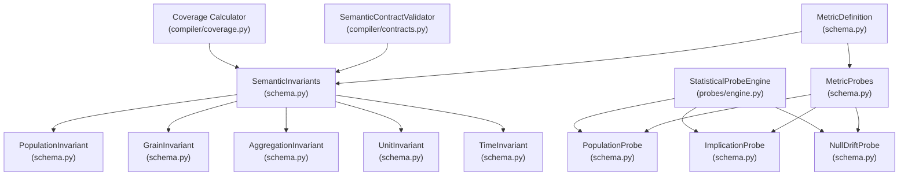
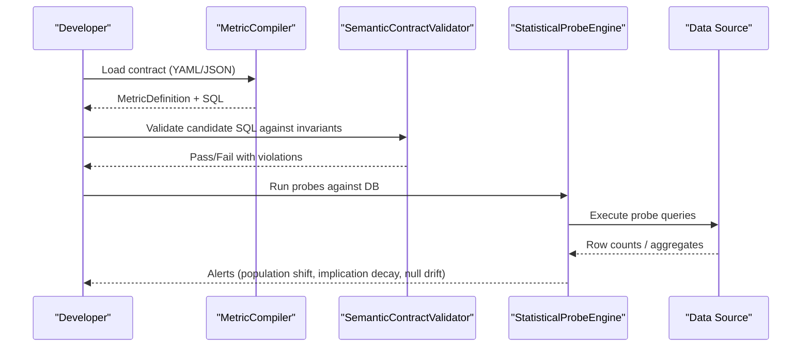
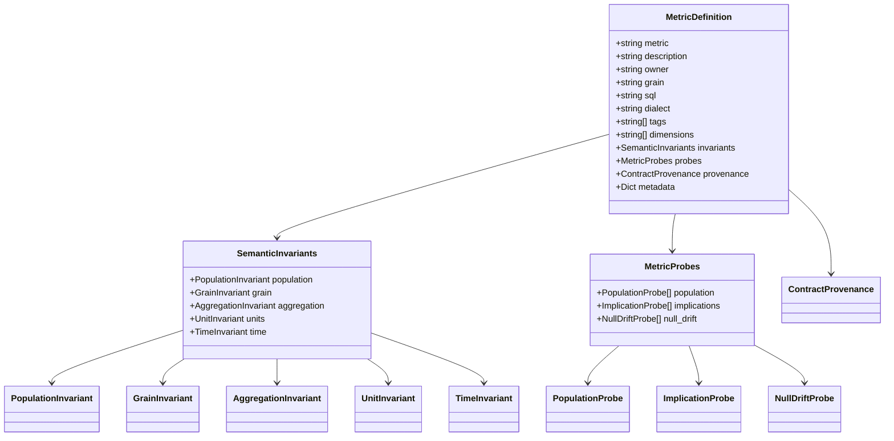

# SCOS Contract Models

<cite>
**Referenced Files in This Document**
- [SCOS_V1_SPECIFICATION.md](file://spec/SCOS_V1_SPECIFICATION.md)
- [scos-v1.schema.json](file://spec/scos-v1.schema.json)
- [schema.py](file://semantic_reliability/compiler/schema.py)
- [contracts.py](file://semantic_reliability/compiler/contracts.py)
- [coverage.py](file://semantic_reliability/compiler/coverage.py)
- [engine.py](file://semantic_reliability/probes/engine.py)
- [signals.py](file://semantic_reliability/probes/signals.py)
- [net_revenue.yaml](file://examples/metrics/net_revenue.yaml)
- [monthly_active_users.yaml](file://examples/metrics/monthly_active_users.yaml)
- [test_contracts.py](file://tests/test_contracts.py)
- [test_probes.py](file://tests/test_probes.py)
- [provenance_auditor.py](file://semantic_reliability/evaluation/provenance_auditor.py)
</cite>

## Table of Contents
1. [Introduction](#introduction)
2. [Project Structure](#project-structure)
3. [Core Components](#core-components)
4. [Architecture Overview](#architecture-overview)
5. [Detailed Component Analysis](#detailed-component-analysis)
6. [Dependency Analysis](#dependency-analysis)
7. [Performance Considerations](#performance-considerations)
8. [Troubleshooting Guide](#troubleshooting-guide)
9. [Conclusion](#conclusion)
10. [Appendices](#appendices)

## Introduction
This document explains the Semantic Contract Open Standard (SCOS) contract models implemented in this repository. It focuses on:
- The MetricDefinition model as the core contract structure, including identity, canonical SQL, dialect, and metadata.
- Semantic invariant models that enforce structural and business rules at compile time: PopulationInvariant, GrainInvariant, AggregationInvariant, UnitInvariant, and TimeInvariant.
- Statistical probe models that monitor runtime data quality and semantic drift: PopulationProbe, ImplicationProbe, and NullDriftProbe.
- Provenance tracking for audit trails and version control integration.
It provides field descriptions, validation rules, default values, and usage examples grounded in actual contracts and tests.

## Project Structure
The SCOS implementation is centered around a Pydantic-based schema layer and supporting components:
- Schema definitions define MetricDefinition and all related models.
- Contract validation enforces invariants against candidate SQL.
- Statistical probes execute runtime checks over live or snapshot data.
- Coverage utilities assess whether contracts adequately declare required semantic dimensions.
- Examples demonstrate real-world metric contracts.

**Diagram sources**
- [schema.py:5-96](file://semantic_reliability/compiler/schema.py#L5-L96)
- [engine.py:11-36](file://semantic_reliability/probes/engine.py#L11-L36)
- [contracts.py:92-113](file://semantic_reliability/compiler/contracts.py#L92-L113)
- [coverage.py:71-127](file://semantic_reliability/compiler/coverage.py#L71-L127)

**Section sources**
- [schema.py:5-96](file://semantic_reliability/compiler/schema.py#L5-L96)
- [engine.py:11-36](file://semantic_reliability/probes/engine.py#L11-L36)
- [contracts.py:92-113](file://semantic_reliability/compiler/contracts.py#L92-L113)
- [coverage.py:71-127](file://semantic_reliability/compiler/coverage.py#L71-L127)

## Core Components
- MetricDefinition: The top-level contract object containing identity, canonical SQL, dialect, tags, dimensions, invariants, probes, provenance, and metadata.
- SemanticInvariants: Groups of declarative rules enforcing population filters, grain, aggregation behavior, units, and temporal semantics.
- MetricProbes: Declarative runtime expectations for population rates, logical implications, and null drift.
- StatisticalProbeEngine: Executes probes against a connection to produce structured alerts.
- SemanticContractValidator: Validates candidate SQL against declared invariants and returns violations.
- Coverage Calculator: Evaluates how well a contract declares required semantic dimensions for known metric categories.

Key fields and defaults are defined in the schema; JSON schema defines additional constraints for YAML/JSON contracts.

**Section sources**
- [schema.py:5-96](file://semantic_reliability/compiler/schema.py#L5-L96)
- [scos-v1.schema.json:1-163](file://spec/scos-v1.schema.json#L1-L163)

## Architecture Overview
SCOS separates concerns into four layers:
- Identity & Registry: scos_version, id, metric, version, owner, domain, grain, dialect.
- Canonical Representation: sql (ground truth), dialect.
- Semantic Invariants: Static enforcement of WHERE clause predicates, grouping dimensions, aggregation composition, currency/scale, and temporal boundaries.
- Statistical Probes: Runtime monitoring of population distributions, business rule implications, and null quality.

**Diagram sources**
- [engine.py:11-36](file://semantic_reliability/probes/engine.py#L11-L36)
- [contracts.py:92-113](file://semantic_reliability/compiler/contracts.py#L92-L113)

## Detailed Component Analysis

### MetricDefinition Model
Purpose:
- Central contract artifact describing a business metric, its canonical SQL, and governance metadata.

Key fields:
- metric: Unique identifier slug.
- description: Human-readable purpose.
- owner: Responsible team/domain.
- grain: Reporting granularity (e.g., customer_month).
- sql: Canonical ground-truth query.
- dialect: Target SQL dialect (default postgres in code; JSON schema allows multiple options).
- tags: Categorization tags.
- dimensions: Allowed slice/dice dimensions.
- invariants: SemanticInvariants block.
- probes: MetricProbes block.
- provenance: Optional verifiable upstream sourcing metadata.
- metadata: Arbitrary custom metadata.

Validation and defaults:
- Defined via Pydantic Field with defaults where applicable.
- JSON schema enforces required fields and patterns for scos_version, id, metric, version, etc.

Usage example:
- See net_revenue.yaml and monthly_active_users.yaml for concrete contracts.

**Section sources**
- [schema.py:83-96](file://semantic_reliability/compiler/schema.py#L83-L96)
- [scos-v1.schema.json:1-163](file://spec/scos-v1.schema.json#L1-L163)
- [net_revenue.yaml:1-22](file://examples/metrics/net_revenue.yaml#L1-L22)
- [monthly_active_users.yaml:1-21](file://examples/metrics/monthly_active_users.yaml#L1-L21)

### Semantic Invariant Models

#### PopulationInvariant
Purpose:
- Enforce presence/absence of WHERE clause predicates.

Fields:
- required_filters: List of predicate strings that must be present.
- forbidden_filters: List of predicate strings that must never appear.

Validation behavior:
- Checked by SemanticContractValidator during candidate SQL validation.

Example usage:
- Tests validate missing required filters trigger violations.

**Section sources**
- [schema.py:5-8](file://semantic_reliability/compiler/schema.py#L5-L8)
- [contracts.py:92-113](file://semantic_reliability/compiler/contracts.py#L92-L113)
- [test_contracts.py:45-60](file://tests/test_contracts.py#L45-L60)

#### GrainInvariant
Purpose:
- Define reporting grain via required grouping dimensions and control over-aggregation.

Fields:
- required_dimensions: Grouping columns/expressions defining the grain.
- allow_over_aggregation: Whether higher-level aggregations are permitted (default False).

Validation behavior:
- Validator checks that candidate SQL groups by required dimensions.

Example usage:
- Tests assert grain drops cause violations.

**Section sources**
- [schema.py:10-13](file://semantic_reliability/compiler/schema.py#L10-L13)
- [test_contracts.py:62-76](file://tests/test_contracts.py#L62-L76)

#### AggregationInvariant
Purpose:
- Constrain aggregate functions and net composition (positive/negative components).

Fields:
- required_function: Expected top-level aggregate function (e.g., SUM, AVG, COUNT).
- positive_components: Conditions/values that must be added.
- negative_components: Conditions/values that must be subtracted.

Validation behavior:
- Validator ensures required function and presence of positive/negative components in candidate SQL.

Example usage:
- Tests assert missing negative component triggers violation.

**Section sources**
- [schema.py:15-18](file://semantic_reliability/compiler/schema.py#L15-L18)
- [contracts.py:92-113](file://semantic_reliability/compiler/contracts.py#L92-L113)
- [test_contracts.py:78-91](file://tests/test_contracts.py#L78-L91)

#### UnitInvariant
Purpose:
- Specify currency and scale for monetary metrics.

Fields:
- currency: Expected currency code (e.g., USD, EUR).
- scale: Scale definition (default "standard").

Usage:
- Used by coverage calculator to mark currency dimension as declared when present.

**Section sources**
- [schema.py:21-23](file://semantic_reliability/compiler/schema.py#L21-L23)
- [coverage.py:104-108](file://semantic_reliability/compiler/coverage.py#L104-L108)

#### TimeInvariant
Purpose:
- Declare timezone and period grain for temporal consistency.

Fields:
- timezone: Expected timestamp timezone (default "UTC").
- period_grain: Calendar vs fiscal period (e.g., calendar_month).

Usage:
- Coverage calculator marks time-related dimensions when declared.

**Section sources**
- [schema.py:26-28](file://semantic_reliability/compiler/schema.py#L26-L28)
- [coverage.py:107-111](file://semantic_reliability/compiler/coverage.py#L107-L111)

### Statistical Probe Models

#### PopulationProbe
Purpose:
- Monitor whether a filter predicate selects an expected proportion of the population.

Fields:
- column: Column to evaluate.
- target_value: Optional specific value to match.
- baseline_rate: Expected ratio (0.0–1.0).
- tolerance: Absolute tolerance for deviation.

Runtime behavior:
- StatisticalProbeEngine computes current rate and compares to baseline within tolerance.
- Emits SemanticProbeAlert on significant shifts.

Example usage:
- Tests simulate drift and assert alert generation.

**Section sources**
- [schema.py:39-45](file://semantic_reliability/compiler/schema.py#L39-L45)
- [engine.py:23-71](file://semantic_reliability/probes/engine.py#L23-L71)
- [test_probes.py:54-80](file://tests/test_probes.py#L54-L80)

#### ImplicationProbe
Purpose:
- Enforce business rule implications (e.g., “Active” implies “Revenue > 0”).

Fields:
- condition_column, condition_value: Antecedent condition.
- implication_column, implication_operator, implication_value: Consequent check.
- baseline_confidence: Expected P(consequent | antecedent).
- tolerance_drop: Alert if confidence drops beyond threshold.

Runtime behavior:
- Engine computes conditional confidence and raises alert if it decays beyond tolerance.

Example usage:
- Tests construct drifted data and assert implication decay alerts.

**Section sources**
- [schema.py:47-55](file://semantic_reliability/compiler/schema.py#L47-L55)
- [engine.py:73-110](file://semantic_reliability/probes/engine.py#L73-L110)
- [test_probes.py:82-118](file://tests/test_probes.py#L82-L118)

#### NullDriftProbe
Purpose:
- Monitor null rates of critical semantic columns.

Fields:
- column: Column to monitor.
- baseline_null_rate: Expected null percentage (default 0.0).
- tolerance: Max acceptable absolute null rate deviation.

Runtime behavior:
- Engine calculates current null rate and emits alert if deviation exceeds tolerance.

Example usage:
- Tests verify null drift detection.

**Section sources**
- [schema.py:58-63](file://semantic_reliability/compiler/schema.py#L58-L63)
- [engine.py:112-117](file://semantic_reliability/probes/engine.py#L112-L117)
- [test_probes.py:121-151](file://tests/test_probes.py#L121-L151)

### Provenance Tracking System
Purpose:
- Provide verifiable upstream sourcing and audit trails for contracts.

Key elements:
- ContractProvenance includes repository URL, organization, reference path, commit SHA, verification timestamp, verified symbols, and license.
- ProvenanceAuditor extracts claims from YAML/JSON and verifies symbols exist in referenced repositories.

Integration points:
- MetricDefinition carries optional provenance.
- Audit results include passed/failed status and reasons.

**Section sources**
- [schema.py:72-81](file://semantic_reliability/compiler/schema.py#L72-L81)
- [provenance_auditor.py:176-207](file://semantic_reliability/evaluation/provenance_auditor.py#L176-L207)

## Dependency Analysis
- MetricDefinition composes SemanticInvariants and MetricProbes.
- SemanticContractValidator depends on SemanticInvariants to validate candidate SQL.
- StatisticalProbeEngine depends on MetricProbes to run runtime checks.
- Coverage Calculator inspects SemanticInvariants to compute coverage scores per metric category.

**Diagram sources**
- [schema.py:5-96](file://semantic_reliability/compiler/schema.py#L5-L96)

**Section sources**
- [schema.py:5-96](file://semantic_reliability/compiler/schema.py#L5-L96)

## Performance Considerations
- Invariant checks operate on SQL text and AST-like patterns; keep required/forbidden filters concise to reduce false positives and improve performance.
- Probes execute SQL against data sources; prefer targeted columns and efficient filters to minimize overhead.
- Use appropriate tolerances to avoid excessive alert noise while catching meaningful drift.

[No sources needed since this section provides general guidance]

## Troubleshooting Guide
Common issues and resolutions:
- Missing required filters: Ensure candidate SQL includes all required_filters; validator will report specific missing predicates.
- Grain mismatch: Verify GROUP BY matches required_dimensions; over-aggregation may be disallowed unless configured.
- Missing aggregation components: Include both positive and negative components as declared; validator reports omitted components.
- Probe alerts: Investigate upstream changes causing population shifts, implication decay, or null drift; adjust baseline/tolerance if legitimate change occurred.

**Section sources**
- [test_contracts.py:45-91](file://tests/test_contracts.py#L45-L91)
- [test_probes.py:54-151](file://tests/test_probes.py#L54-L151)

## Conclusion
SCOS provides a robust, declarative framework for governing business metrics through executable contracts. MetricDefinition centralizes identity, canonical SQL, and governance metadata. SemanticInvariants enforce static correctness across population, grain, aggregation, units, and time. StatisticalProbes offer continuous runtime assurance against data drift and semantic decoupling. Provenance tracking enables auditable, version-controlled contracts. Together, these models deliver deterministic, verifiable metric governance across CI/CD, runtime firewalls, and AI agent workflows.

[No sources needed since this section summarizes without analyzing specific files]

## Appendices

### Example Contracts
- Net Revenue: Demonstrates canonical SQL with explicit filtering and aggregation.
- Monthly Active Users: Shows event-based active user counting with time window and bot exclusion.

**Section sources**
- [net_revenue.yaml:1-22](file://examples/metrics/net_revenue.yaml#L1-L22)
- [monthly_active_users.yaml:1-21](file://examples/metrics/monthly_active_users.yaml#L1-L21)

### Specification Reference
- SCOS v1 specification outlines identity, canonical representation, invariants, and probes.
- JSON schema defines strict validation rules for contracts.

**Section sources**
- [SCOS_V1_SPECIFICATION.md:1-134](file://spec/SCOS_V1_SPECIFICATION.md#L1-L134)
- [scos-v1.schema.json:1-163](file://spec/scos-v1.schema.json#L1-L163)