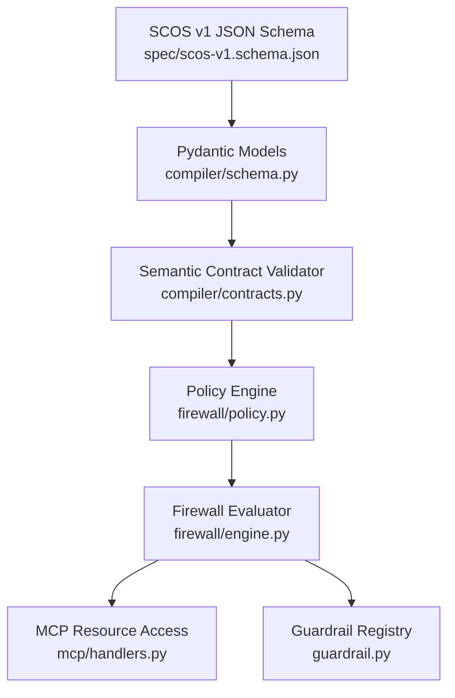
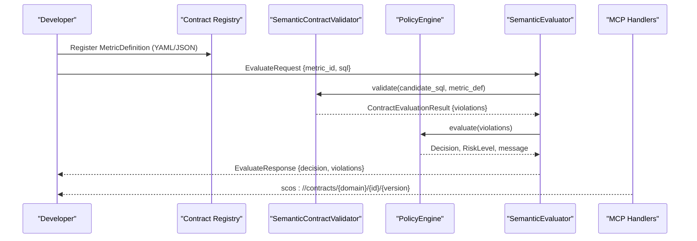
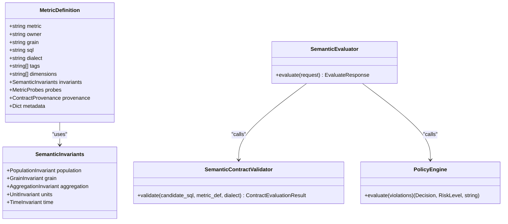

# Validation Schemas

<cite>
**Referenced Files in This Document**
- [SCOS_V1_SPECIFICATION.md](file://spec/SCOS_V1_SPECIFICATION.md)
- [scos-v1.schema.json](file://spec/scos-v1.schema.json)
- [schema.py](file://semantic_reliability/compiler/schema.py)
- [contracts.py](file://semantic_reliability/compiler/contracts.py)
- [policy.py](file://semantic_reliability/firewall/policy.py)
- [engine.py](file://semantic_reliability/firewall/engine.py)
- [models.py](file://semantic_reliability/firewall/models.py)
- [sql_guardrail.py](file://semantic_reliability/runtime/sql_guardrail.py)
- [coverage.py](file://semantic_reliability/compiler/coverage.py)
- [handlers.py](file://semantic_reliability/mcp/handlers.py)
- [guardrail.py](file://semantic_reliability/guardrail.py)
- [test_scos_spec.py](file://tests/test_scos_spec.py)
- [net_revenue_contract.yaml](file://examples/metrics/net_revenue_contract.yaml)
- [contract.yaml](file://benchmark_corpus/dev/net_revenue/contract.yaml)
</cite>

## Table of Contents
1. Introduction
2. Project Structure
3. Core Components
4. Architecture Overview
5. Detailed Component Analysis
6. Dependency Analysis
7. Performance Considerations
8. Troubleshooting Guide
9. Conclusion

## Introduction
This document explains the JSON schemas and validation rules that enforce data integrity across the system, focusing on the SCOS v1 schema and the runtime enforcement pipeline. It covers:
- The SCOS v1 JSON schema: required fields, optional properties, and constraints
- Validation policies for contract validity checks, semantic consistency verification, and business rule enforcement
- Custom validators beyond standard Pydantic capabilities
- Schema versioning strategies, backward compatibility guarantees, and migration paths
- Examples of valid and invalid contract definitions with explanations of failures
- Performance implications and optimization techniques for large-scale deployments

## Project Structure
The validation system is organized around a declarative schema (JSON Schema), typed models (Pydantic), AST-based semantic validation, and a policy-driven firewall that gates execution.

**Diagram sources**
- [scos-v1.schema.json:1-163](file://spec/scos-v1.schema.json#L1-L163)
- [schema.py:1-98](file://semantic_reliability/compiler/schema.py#L1-L98)
- [contracts.py:1-42](file://semantic_reliability/compiler/contracts.py#L1-L42)
- [policy.py:1-68](file://semantic_reliability/firewall/policy.py#L1-L68)
- [engine.py:87-117](file://semantic_reliability/firewall/engine.py#L87-L117)
- [handlers.py:315-349](file://semantic_reliability/mcp/handlers.py#L315-L349)
- [guardrail.py:65-95](file://semantic_reliability/guardrail.py#L65-L95)

**Section sources**
- [SCOS_V1_SPECIFICATION.md:90-134](file://spec/SCOS_V1_SPECIFICATION.md#L90-L134)
- [scos-v1.schema.json:1-163](file://spec/scos-v1.schema.json#L1-L163)

## Core Components
- SCOS v1 JSON Schema defines the canonical contract structure and constraints for contracts consumed by tools and agents.
- Pydantic models define the runtime representation of metric definitions, invariants, and probes.
- SemanticContractValidator parses SQL into an AST and enforces declared invariants (population filters, aggregation components, temporal semantics).
- PolicyEngine maps violations to governance decisions (ALLOW, AUDIT, REQUIRE_REVIEW, DENY) and risk levels.
- Firewall engine orchestrates evaluation, records audit traces, and returns structured responses.
- MCP handlers expose contracts and invariants via a resource protocol for agent access.
- Guardrail loads contracts from files or directories and registers them for evaluation.

**Section sources**
- [schema.py:1-98](file://semantic_reliability/compiler/schema.py#L1-L98)
- [contracts.py:26-113](file://semantic_reliability/compiler/contracts.py#L26-L113)
- [policy.py:32-68](file://semantic_reliability/firewall/policy.py#L32-L68)
- [engine.py:87-117](file://semantic_reliability/firewall/engine.py#L87-L117)
- [handlers.py:315-349](file://semantic_reliability/mcp/handlers.py#L315-L349)
- [guardrail.py:65-95](file://semantic_reliability/guardrail.py#L65-L95)

## Architecture Overview
End-to-end flow from contract definition to runtime enforcement:

**Diagram sources**
- [engine.py:87-117](file://semantic_reliability/firewall/engine.py#L87-L117)
- [contracts.py:26-113](file://semantic_reliability/compiler/contracts.py#L26-L113)
- [policy.py:32-68](file://semantic_reliability/firewall/policy.py#L32-L68)
- [handlers.py:315-349](file://semantic_reliability/mcp/handlers.py#L315-L349)

## Detailed Component Analysis

### SCOS v1 JSON Schema: Required Fields, Optional Properties, Constraints
- Required fields: scos_version, metric, owner, grain, sql
- Optional fields include id, version, description, domain, dialect, tags, invariants, probes, metadata
- Constraint highlights:
  - scos_version must be "1.0.0"
  - id must match URN pattern urn:scos:<domain>:<slug>
  - metric must be alphanumeric with underscores
  - version follows SemVer pattern
  - dialect restricted to supported engines
  - probes.population items require predicate and rate bounds
  - probes.implications require antecedent, consequent, min_confidence
  - probes.null_drift require column and max_null_rate

Examples of schema usage:
- Valid contract example: see examples/metrics/net_revenue_contract.yaml
- Minimal benchmark contract: see benchmark_corpus/dev/net_revenue/contract.yaml

Validation tests demonstrate both passing and failing cases against the schema.

**Section sources**
- [scos-v1.schema.json:1-163](file://spec/scos-v1.schema.json#L1-L163)
- [test_scos_spec.py:16-67](file://tests/test_scos_spec.py#L16-L67)
- [net_revenue_contract.yaml:1-39](file://examples/metrics/net_revenue_contract.yaml#L1-L39)
- [contract.yaml:1-19](file://benchmark_corpus/dev/net_revenue/contract.yaml#L1-L19)

### Runtime Models and Invariants (Pydantic)
- MetricDefinition captures core identity, SQL, dialect, tags, dimensions, invariants, probes, provenance, and metadata
- SemanticInvariants groups population, grain, aggregation, units, and time constraints
- Probes model population, implications, and null drift expectations
- These models provide type safety and default behaviors used throughout the pipeline

**Section sources**
- [schema.py:1-98](file://semantic_reliability/compiler/schema.py#L1-L98)

### Semantic Contract Validation (AST-Based)
- Parses candidate SQL using sqlglot with the configured dialect
- Enforces:
  - Population invariants: required_filters present; forbidden_filters absent
  - Aggregation invariants: presence of positive/negative components in net calculations
  - Temporal and unit invariants where applicable
- Produces ContractViolation entries with category, rule, severity, details, and remediation guidance

**Section sources**
- [contracts.py:26-113](file://semantic_reliability/compiler/contracts.py#L26-L113)

### Policy Engine and Governance Decisions
- Maps violations to mutation oracle categories for traceability
- Determines decision based on violation severities and strict mode:
  - ALLOW when no violations
  - DENY or REQUIRE_REVIEW for critical errors depending on strict_mode
  - AUDIT for non-critical anomalies
- Returns risk level and human-readable message

**Section sources**
- [policy.py:1-68](file://semantic_reliability/firewall/policy.py#L1-L68)

### Firewall Evaluation Flow
- Loads metric definition from registry
- Runs SemanticContractValidator
- Converts internal violations to firewall Violation objects
- Applies PolicyEngine to compute decision and risk
- Records immutable audit trace and returns EvaluateResponse

**Section sources**
- [engine.py:87-117](file://semantic_reliability/firewall/engine.py#L87-L117)
- [models.py:20-51](file://semantic_reliability/firewall/models.py#L20-L51)

### MCP Resource Exposure
- Exposes policy and contract resources via URI scheme
- Supports reading full contracts or invariants-only for specific versions
- Enforces domain authorization before returning contract content

**Section sources**
- [handlers.py:315-349](file://semantic_reliability/mcp/handlers.py#L315-L349)

### Guardrail Loading and Registration
- Loads contracts from file or directory
- Registers MetricDefinition instances with versioned keys
- Initializes evaluator for subsequent validations

**Section sources**
- [guardrail.py:65-95](file://semantic_reliability/guardrail.py#L65-L95)

### Coverage and Completeness Checks
- Evaluates whether a metric’s invariants cover expected dimensions per domain requirements
- Reports missing dimensions and coverage score

**Section sources**
- [coverage.py:1-26](file://semantic_reliability/compiler/coverage.py#L1-L26)
- [coverage.py:71-102](file://semantic_reliability/compiler/coverage.py#L71-L102)

## Dependency Analysis
Key dependencies and relationships:

**Diagram sources**
- [schema.py:1-98](file://semantic_reliability/compiler/schema.py#L1-L98)
- [contracts.py:26-113](file://semantic_reliability/compiler/contracts.py#L26-L113)
- [policy.py:32-68](file://semantic_reliability/firewall/policy.py#L32-L68)
- [engine.py:87-117](file://semantic_reliability/firewall/engine.py#L87-L117)

**Section sources**
- [schema.py:1-98](file://semantic_reliability/compiler/schema.py#L1-L98)
- [contracts.py:26-113](file://semantic_reliability/compiler/contracts.py#L26-L113)
- [policy.py:32-68](file://semantic_reliability/firewall/policy.py#L32-L68)
- [engine.py:87-117](file://semantic_reliability/firewall/engine.py#L87-L117)

## Performance Considerations
- AST parsing cost: Each candidate SQL is parsed with sqlglot; minimize repeated parsing by caching results per metric and dialect.
- String matching vs AST analysis: Some invariant checks use substring matching for performance; prefer targeted AST traversal for complex queries to reduce false positives and improve accuracy.
- Batch evaluations: Group multiple SQL candidates per metric to amortize registry lookups and policy computations.
- Strict mode impact: In strict mode, critical violations immediately block execution; tune strict_mode to balance safety and throughput.
- Probe overhead: Runtime statistical probes can be expensive; schedule them asynchronously and cache baseline rates.
- Concurrency: Use thread-safe registries and limit concurrent evaluations per database connection to avoid contention.

[No sources needed since this section provides general guidance]

## Troubleshooting Guide
Common validation failures and remedies:
- Missing required filters: Ensure WHERE clause includes all required_filters defined in population invariants.
- Forbidden filters present: Remove any predicates listed in forbidden_filters.
- Missing aggregation components: Include positive_components and subtract negative_components as declared in aggregation invariants.
- Incorrect dialect: Set dialect to match the target engine; mismatches cause parse or AST traversal issues.
- Invalid schema payload: Validate YAML/JSON against scos-v1.schema.json; ensure required fields are present and patterns match.

Diagnostic steps:
- Inspect ContractEvaluationResult.violations for invariant_category, invariant_rule, severity, details, and remediation.
- Review PolicyEngine output for decision and risk level.
- Use MCP resource reads to verify registered contracts and invariants.

**Section sources**
- [contracts.py:26-113](file://semantic_reliability/compiler/contracts.py#L26-L113)
- [policy.py:32-68](file://semantic_reliability/firewall/policy.py#L32-L68)
- [engine.py:87-117](file://semantic_reliability/firewall/engine.py#L87-L117)
- [handlers.py:315-349](file://semantic_reliability/mcp/handlers.py#L315-L349)

## Conclusion
The system combines a robust SCOS v1 JSON schema with typed models and AST-based semantic validation to enforce business metric contracts at runtime. The policy engine ensures consistent governance decisions, while MCP exposure enables agent integration. For large-scale deployments, optimize parsing and probe execution, and carefully tune strict mode to meet reliability and performance goals.

[No sources needed since this section summarizes without analyzing specific files]

## Appendices

### Example Contracts
- Valid comprehensive contract: examples/metrics/net_revenue_contract.yaml
- Minimal benchmark contract: benchmark_corpus/dev/net_revenue/contract.yaml

**Section sources**
- [net_revenue_contract.yaml:1-39](file://examples/metrics/net_revenue_contract.yaml#L1-L39)
- [contract.yaml:1-19](file://benchmark_corpus/dev/net_revenue/contract.yaml#L1-L19)

### Schema Versioning and Migration Strategy
- Version field in contracts uses SemVer to track evolution; scos_version remains locked to "1.0.0" for conformance.
- Backward compatibility: Add new optional fields (e.g., metadata, tags) without breaking existing consumers.
- Migration path: Introduce new invariants or probes gradually; maintain legacy behavior via defaults and feature flags until consumers adopt updated schemas.
- Enforcement: Tests validate schema conformance and reject incomplete payloads.

**Section sources**
- [scos-v1.schema.json:1-163](file://spec/scos-v1.schema.json#L1-L163)
- [test_scos_spec.py:16-67](file://tests/test_scos_spec.py#L16-L67)