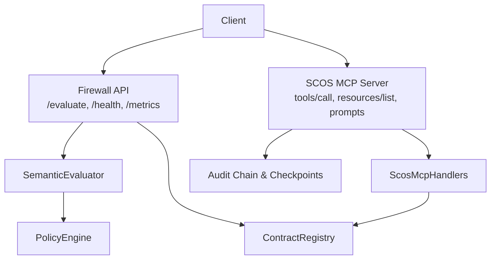
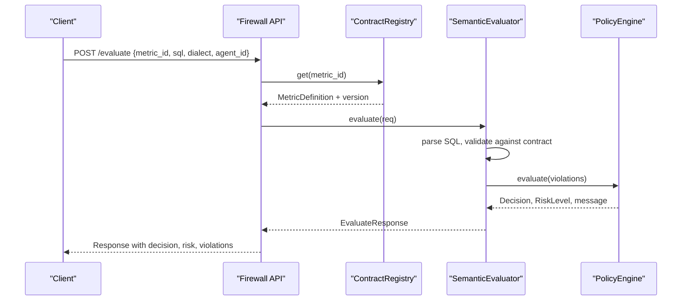
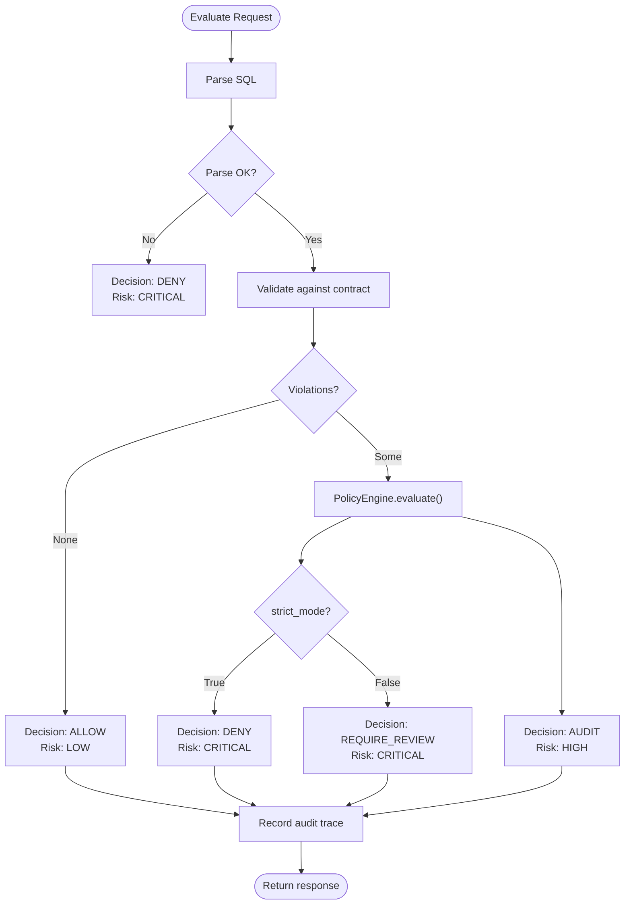
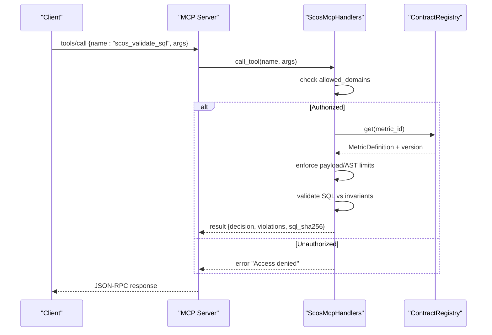
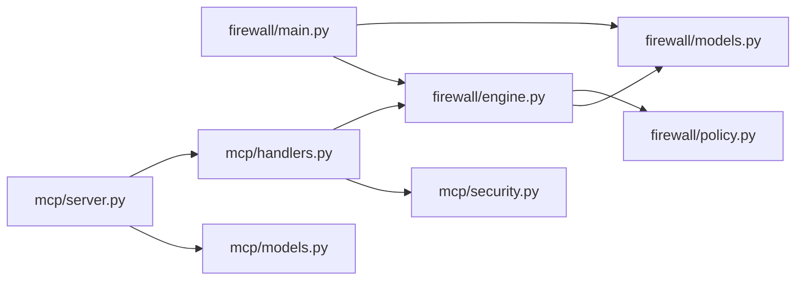

# Authentication and Authorization

<cite>
**Referenced Files in This Document**
- [main.py](file://semantic_reliability/firewall/main.py)
- [engine.py](file://semantic_reliability/firewall/engine.py)
- [policy.py](file://semantic_reliability/firewall/policy.py)
- [models.py](file://semantic_reliability/firewall/models.py)
- [handlers.py](file://semantic_reliability/mcp/handlers.py)
- [server.py](file://semantic_reliability/mcp/server.py)
- [security.py](file://semantic_reliability/mcp/security.py)
- [models.py](file://semantic_reliability/mcp/models.py)
</cite>

## Table of Contents
1. Introduction
2. Project Structure
3. Core Components
4. Architecture Overview
5. Detailed Component Analysis
6. Dependency Analysis
7. Performance Considerations
8. Troubleshooting Guide
9. Conclusion

## Introduction
This document explains the authentication and authorization mechanisms, access control policies, request validation, audit trails, and governance configuration for the Firewall API and the SCOS MCP Server. It focuses on how requests are validated, how policy decisions are enforced, how agent_id is used for tracing and metrics, and how to integrate securely with these services.

## Project Structure
The security surface spans two main components:
- Firewall API (FastAPI): evaluates SQL against metric contracts and enforces policy decisions.
- SCOS MCP Server: a read-only JSON-RPC 2.0 server that exposes contract and validation tools with domain-scoped authorization and tamper-evident audit chains.

**Diagram sources**
- [main.py:23-69](file://semantic_reliability/firewall/main.py#L23-L69)
- [engine.py:19-133](file://semantic_reliability/firewall/engine.py#L19-L133)
- [policy.py:32-68](file://semantic_reliability/firewall/policy.py#L32-L68)
- [handlers.py:19-409](file://semantic_reliability/mcp/handlers.py#L19-L409)
- [server.py:16-257](file://semantic_reliability/mcp/server.py#L16-L257)

**Section sources**
- [main.py:23-69](file://semantic_reliability/firewall/main.py#L23-L69)
- [server.py:16-257](file://semantic_reliability/mcp/server.py#L16-L257)

## Core Components
- Firewall API endpoints:
  - POST /evaluate: validates SQL against metric contracts and returns a decision.
  - GET /health: service health and loaded contract count.
  - GET /metrics: Prometheus metrics export when available.
- Policy engine:
  - Determines ALLOW, AUDIT, REQUIRE_REVIEW, or DENY based on violations and strict_mode.
- Contract registry:
  - Loads metric contracts from YAML files and provides lookups by metric_id.
- MCP handlers and server:
  - Domain-scoped authorization for accessing metrics and contracts.
  - Request size limits, SQL length limits, AST complexity checks.
  - Tamper-evident audit chain with signed checkpoints.

Key data models:
- EvaluateRequest includes agent_id for tracing and per-agent metrics.
- Decision and RiskLevel enums drive enforcement behavior.
- CallerIdentity supports tenant and domain scoping in MCP.

**Section sources**
- [main.py:23-69](file://semantic_reliability/firewall/main.py#L23-L69)
- [engine.py:19-133](file://semantic_reliability/firewall/engine.py#L19-L133)
- [policy.py:32-68](file://semantic_reliability/firewall/policy.py#L32-L68)
- [models.py:6-51](file://semantic_reliability/firewall/models.py#L6-L51)
- [handlers.py:19-409](file://semantic_reliability/mcp/handlers.py#L19-L409)
- [server.py:16-257](file://semantic_reliability/mcp/server.py#L16-L257)
- [models.py:9-121](file://semantic_reliability/mcp/models.py#L9-L121)

## Architecture Overview
The Firewall API evaluates SQL before execution using semantic contracts and policy rules. The MCP Server provides secure, domain-scoped access to contracts and validation tools with cryptographic audit trails.

**Diagram sources**
- [main.py:36-53](file://semantic_reliability/firewall/main.py#L36-L53)
- [engine.py:55-117](file://semantic_reliability/firewall/engine.py#L55-L117)
- [policy.py:38-68](file://semantic_reliability/firewall/policy.py#L38-L68)

## Detailed Component Analysis

### Firewall API: Request Validation and Enforcement
- Input validation:
  - Pydantic model EvaluateRequest enforces required fields including agent_id, metric_id, sql, and optional question.
  - Dialect defaults to duckdb if not provided.
- Evaluation flow:
  - Parses SQL via an AST parser; parse failures result in immediate DENY.
  - Validates SQL against metric contract invariants; violations are mapped to structured Violation objects.
  - PolicyEngine evaluates violations to produce a final decision and risk level.
- Audit trail:
  - Each evaluation records an immutable trace including trace_id, agent_id, metric_id, contract_version, SQL hash, decision, violation count, and violations.
- Metrics:
  - Per-request counters and histograms track total requests, decisions, violations, latency, and blocked executions. agent_id is used as a label for per-agent tracking.

**Diagram sources**
- [engine.py:55-117](file://semantic_reliability/firewall/engine.py#L55-L117)
- [policy.py:38-68](file://semantic_reliability/firewall/policy.py#L38-L68)

**Section sources**
- [main.py:36-53](file://semantic_reliability/firewall/main.py#L36-L53)
- [engine.py:55-133](file://semantic_reliability/firewall/engine.py#L55-L133)
- [policy.py:38-68](file://semantic_reliability/firewall/policy.py#L38-L68)
- [models.py:20-51](file://semantic_reliability/firewall/models.py#L20-L51)

### Access Control Policies and Domain Scoping (MCP)
- Domain authorization:
  - Handlers enforce allowed_domains per caller context. If set, only metrics tagged with authorized domains are visible or accessible.
  - Unauthorized access attempts return explicit “Access denied” responses.
- Tool-level controls:
  - scos_list_metrics: lists metrics filtered by domain if requested.
  - scos_get_contract: retrieves full contract details for authorized domains.
  - scos_validate_sql: validates SQL against invariants with payload and AST complexity limits.
  - scos_explain_violation: provides remediation guidance without automatic rewrites.
  - scos_get_probe_status: returns probe definitions and status for authorized metrics.

**Diagram sources**
- [handlers.py:29-34](file://semantic_reliability/mcp/handlers.py#L29-L34)
- [handlers.py:101-240](file://semantic_reliability/mcp/handlers.py#L101-L240)
- [server.py:95-128](file://semantic_reliability/mcp/server.py#L95-L128)

**Section sources**
- [handlers.py:29-34](file://semantic_reliability/mcp/handlers.py#L29-L34)
- [handlers.py:101-240](file://semantic_reliability/mcp/handlers.py#L101-L240)
- [server.py:95-128](file://semantic_reliability/mcp/server.py#L95-L128)

### Security Headers, CORS, and Transport Security
- HTTP headers and CORS:
  - The codebase does not define custom security headers or CORS middleware in the analyzed files.
  - To add security headers and CORS, configure them at the FastAPI application layer or via reverse proxy/load balancer settings.
- Transport security:
  - Deploy behind TLS-terminating proxies or load balancers to ensure encrypted transport.
- Content-type and metrics:
  - The /metrics endpoint returns Prometheus text format when prometheus_client is available; otherwise returns a fallback message.

Recommendations:
- Add security headers (e.g., Content-Security-Policy, X-Content-Type-Options) via middleware or reverse proxy.
- Configure CORS explicitly to restrict origins to trusted clients.
- Enforce HTTPS everywhere.

[No sources needed since this section provides general guidance]

### Request Validation and Limits
- Firewall API:
  - Pydantic validation ensures required fields in EvaluateRequest.
  - SQL parsing failure results in immediate DENY.
- MCP Server:
  - Payload size limit enforced at the server level.
  - SQL length limit enforced in handlers.
  - AST node count limit enforced to prevent overly complex queries.
  - Structured errors map to standard JSON-RPC error codes.

**Section sources**
- [models.py:20-27](file://semantic_reliability/firewall/models.py#L20-L27)
- [engine.py:55-85](file://semantic_reliability/firewall/engine.py#L55-L85)
- [handlers.py:147-214](file://semantic_reliability/mcp/handlers.py#L147-L214)
- [server.py:50-74](file://semantic_reliability/mcp/server.py#L50-L74)

### Policy Engine Configuration: Strict Mode and Governance Rules
- Strict mode:
  - When enabled, critical violations lead to DENY.
  - When disabled, critical violations lead to REQUIRE_REVIEW.
  - Non-critical anomalies lead to AUDIT with logging.
- Governance rules:
  - Violations are enriched with mutation oracle mappings to support testing and remediation strategies.
  - Risk levels guide downstream workflows (block, review, or log).

Configuration options:
- PolicyEngine(strict_mode=True) is used by default in the Firewall API.
- MCP resource exposure includes policy metadata such as allowed and blocking severities.

**Section sources**
- [policy.py:32-68](file://semantic_reliability/firewall/policy.py#L32-L68)
- [handlers.py:315-323](file://semantic_reliability/mcp/handlers.py#L315-L323)

### agent_id Usage for Tracing and Rate Limiting
- Tracing:
  - agent_id is included in every EvaluateRequest and recorded in audit traces for per-agent attribution.
- Metrics:
  - Prometheus REQUESTS counter labels include agent_id for per-agent request counting.
- Rate limiting:
  - The codebase does not implement rate limiting logic. Use external rate limiting (e.g., reverse proxy or gateway) keyed by agent_id or client identity.

Best practices:
- Assign stable, unique agent_id values per client or workload.
- Combine agent_id with request_id for end-to-end tracing.
- Implement rate limiting at the edge to protect backend services.

**Section sources**
- [main.py:14-18](file://semantic_reliability/firewall/main.py#L14-L18)
- [main.py:36-53](file://semantic_reliability/firewall/main.py#L36-L53)
- [engine.py:119-133](file://semantic_reliability/firewall/engine.py#L119-L133)
- [models.py:20-27](file://semantic_reliability/firewall/models.py#L20-L27)

### Audit Trail Generation and Compliance Reporting
- Firewall API:
  - Immutable audit traces record trace_id, timestamp, agent_id, metric_id, contract_version, SQL hash, decision, violation count, and violations.
  - Logs are emitted as structured JSON for ingestion into SIEM or compliance systems.
- MCP Server:
  - Tamper-evident audit chain: each event hashes previous_event_hash to form a chain.
  - Signed checkpoints: periodic anchors over the chain using HMAC-SHA256 with a signing key.
  - Verification utilities allow integrity checks of the audit log and checkpoints.

Compliance reporting:
- Export audit logs and checkpoints to compliance tooling.
- Use SQL hashes to correlate events without exposing raw SQL content.
- Leverage decision and risk fields to generate compliance summaries.

**Section sources**
- [engine.py:119-133](file://semantic_reliability/firewall/engine.py#L119-L133)
- [security.py:21-56](file://semantic_reliability/mcp/security.py#L21-L56)
- [server.py:109-220](file://semantic_reliability/mcp/server.py#L109-L220)
- [models.py:43-108](file://semantic_reliability/mcp/models.py#L43-L108)

### Integration Patterns for Secure API Consumption
- Use HTTPS and authenticate clients at the network edge (mTLS, API keys, OAuth).
- For Firewall API:
  - Include agent_id and request_id in every request.
  - Respect decision and execution_allowed flags before executing SQL.
  - Monitor metrics and alerts for DENY spikes and high-risk decisions.
- For MCP Server:
  - Scope access by allowed_domains to minimize blast radius.
  - Validate payloads and respect SQL length and AST complexity limits.
  - Periodically verify audit chains and checkpoints for integrity.

[No sources needed since this section provides general guidance]

## Dependency Analysis

**Diagram sources**
- [main.py:6-8](file://semantic_reliability/firewall/main.py#L6-L8)
- [engine.py:11-14](file://semantic_reliability/firewall/engine.py#L11-L14)
- [policy.py:1-2](file://semantic_reliability/firewall/policy.py#L1-L2)
- [handlers.py:8-16](file://semantic_reliability/mcp/handlers.py#L8-L16)
- [server.py:9-11](file://semantic_reliability/mcp/server.py#L9-L11)
- [models.py:1-5](file://semantic_reliability/mcp/models.py#L1-L5)
- [security.py:1-6](file://semantic_reliability/mcp/security.py#L1-L6)

**Section sources**
- [main.py:6-8](file://semantic_reliability/firewall/main.py#L6-L8)
- [engine.py:11-14](file://semantic_reliability/firewall/engine.py#L11-L14)
- [handlers.py:8-16](file://semantic_reliability/mcp/handlers.py#L8-L16)
- [server.py:9-11](file://semantic_reliability/mcp/server.py#L9-L11)

## Performance Considerations
- Parsing and validation overhead:
  - SQL parsing and AST traversal incur CPU cost; keep SQL within limits to avoid excessive complexity.
- Policy evaluation:
  - Minimal overhead; primarily rule checks and enrichment.
- Metrics:
  - Prometheus counters and histograms add negligible overhead but provide valuable observability.
- Audit logging:
  - Structured JSON logging is efficient; consider sampling or batching in high-throughput environments.

[No sources needed since this section provides general guidance]

## Troubleshooting Guide
Common issues and resolutions:
- SQL parse errors:
  - Result in DENY with CRITICAL risk; fix syntax or dialect mismatch.
- Unknown metric_id:
  - Ensure metric_id exists in the contract registry; register or load correct contracts.
- Domain access denied:
  - Verify allowed_domains configuration matches metric domain tags.
- Payload too large or SQL too long:
  - Reduce payload size or simplify SQL; adhere to configured limits.
- Audit chain verification failures:
  - Check signing key configuration and ensure no tampering occurred; regenerate checkpoints after recovery.

**Section sources**
- [engine.py:55-85](file://semantic_reliability/firewall/engine.py#L55-L85)
- [handlers.py:147-214](file://semantic_reliability/mcp/handlers.py#L147-L214)
- [server.py:197-220](file://semantic_reliability/mcp/server.py#L197-L220)

## Conclusion
The Firewall API and SCOS MCP Server provide robust, policy-driven protection for AI-generated SQL. Requests are validated against declarative contracts, decisions are enforced via a configurable policy engine, and comprehensive audit trails enable compliance and forensics. While authentication and CORS are not implemented in the analyzed code, they can be added at the application or infrastructure layers. Integrators should adopt best practices for transport security, domain scoping, rate limiting, and monitoring to ensure secure and reliable consumption of these APIs.