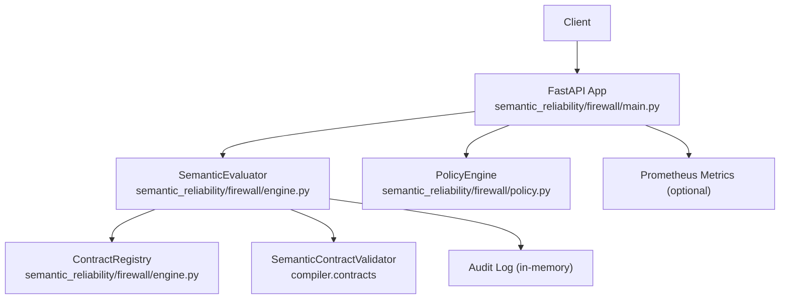
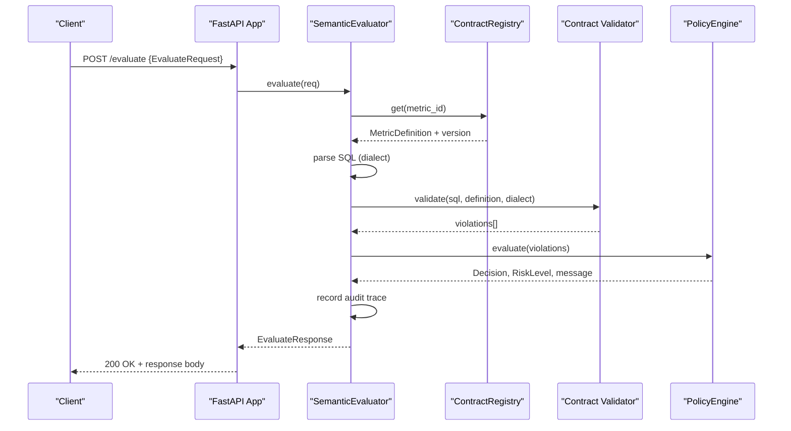
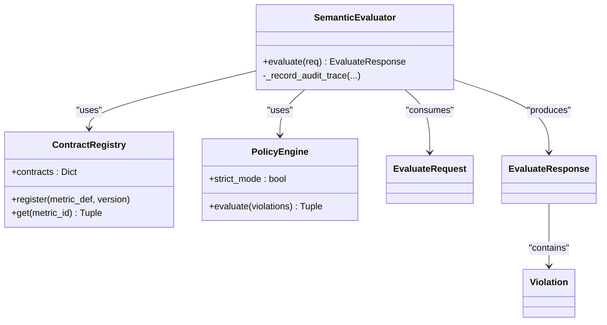

# Firewall REST API

<cite>
**Referenced Files in This Document**
- [main.py](file://semantic_reliability/firewall/main.py)
- [engine.py](file://semantic_reliability/firewall/engine.py)
- [models.py](file://semantic_reliability/firewall/models.py)
- [policy.py](file://semantic_reliability/firewall/policy.py)
- [hybrid_router.py](file://semantic_reliability/firewall/hybrid_router.py)
- [contract.yaml](file://benchmark_corpus/dev/net_revenue/contract.yaml)
- [test_firewall.py](file://tests/test_firewall.py)
</cite>

## Table of Contents
1. [Introduction](#introduction)
2. [Project Structure](#project-structure)
3. [Core Components](#core-components)
4. [Architecture Overview](#architecture-overview)
5. [Detailed Component Analysis](#detailed-component-analysis)
6. [Dependency Analysis](#dependency-analysis)
7. [Performance Considerations](#performance-considerations)
8. [Troubleshooting Guide](#troubleshooting-guide)
9. [Conclusion](#conclusion)
10. [Appendices](#appendices)

## Introduction
This document specifies the Firewall REST API for semantic policy enforcement of SQL queries. It covers HTTP endpoints, request/response schemas, authentication and authorization notes, error handling, metrics, and integration guidance for CI/CD and real-time query validation. The API evaluates AI-generated or agent-driven SQL against declarative metric contracts (SCOS), enforces governance policies, and emits audit traces and Prometheus metrics when available.

## Project Structure
The Firewall module exposes a FastAPI application with three endpoints:
- POST /evaluate: Evaluate SQL against a metric contract and policy
- GET /health: Service health and loaded contract metadata
- GET /metrics: Prometheus metrics export (optional)

**Diagram sources**
- [main.py:23-69](file://semantic_reliability/firewall/main.py#L23-L69)
- [engine.py:18-132](file://semantic_reliability/firewall/engine.py#L18-L132)
- [policy.py:32-68](file://semantic_reliability/firewall/policy.py#L32-L68)

**Section sources**
- [main.py:23-69](file://semantic_reliability/firewall/main.py#L23-L69)

## Core Components
- ContractRegistry: Loads metric contracts from YAML files and provides lookup by metric_id.
- SemanticEvaluator: Parses SQL, validates against SCOS invariants, applies policy decisions, records audit traces.
- PolicyEngine: Maps violations to governance outcomes (ALLOW, AUDIT, REQUIRE_REVIEW, DENY) and risk levels.
- HybridValidator: Static-first verification with adaptive escalation to runtime relational checks (used internally by other components; not exposed as an HTTP endpoint).

Key data models:
- EvaluateRequest: request_id, metric_id, sql, dialect, agent_id, question
- Violation: rule, expected, found, severity, invariant_type, mutation_equivalent
- EvaluateResponse: request_id, trace_id, decision, execution_allowed, contract_compliant, risk, violations, contract_version, message

**Section sources**
- [engine.py:18-132](file://semantic_reliability/firewall/engine.py#L18-L132)
- [policy.py:32-68](file://semantic_reliability/firewall/policy.py#L32-L68)
- [models.py:6-51](file://semantic_reliability/firewall/models.py#L6-L51)

## Architecture Overview
The evaluation flow:
1. Receive POST /evaluate with EvaluateRequest.
2. Resolve metric contract via ContractRegistry.
3. Parse SQL using configured dialect.
4. Validate SQL against SCOS invariants (population, grain, aggregation, etc.).
5. Apply PolicyEngine to determine decision and risk.
6. Record immutable audit trace.
7. Return EvaluateResponse.
8. Optionally emit Prometheus counters/histograms.

**Diagram sources**
- [main.py:36-53](file://semantic_reliability/firewall/main.py#L36-L53)
- [engine.py:54-116](file://semantic_reliability/firewall/engine.py#L54-L116)
- [policy.py:38-68](file://semantic_reliability/firewall/policy.py#L38-L68)

## Detailed Component Analysis

### Endpoint: POST /evaluate
- Purpose: Evaluate SQL against a metric contract and policy.
- Method: POST
- Path: /evaluate
- Request Body: EvaluateRequest
  - Fields:
    - request_id: string (required)
    - metric_id: string (required)
    - sql: string (required)
    - dialect: string (default duckdb)
    - agent_id: string (required)
    - question: string (optional)
- Response Body: EvaluateResponse
  - Fields:
    - request_id: string
    - trace_id: string
    - decision: enum ALLOW | AUDIT | REQUIRE_REVIEW | DENY
    - execution_allowed: boolean
    - contract_compliant: boolean
    - risk: enum LOW | MEDIUM | HIGH | CRITICAL
    - violations: array of Violation
    - contract_version: string
    - message: string (optional)
- Status Codes:
  - 200 OK: Successful evaluation
  - 4xx/5xx: Not explicitly raised by the endpoint; errors are returned within the response body (e.g., parse errors produce DENY with descriptive message).
- Headers: None required by default.
- Query Parameters: None.

Behavior details:
- If metric contract is unknown, returns DENY with a descriptive message.
- If SQL cannot be parsed, returns DENY with a parse error message.
- Violations are mapped to mutation-equivalent operators for traceability.
- Audit traces are recorded per request.

Example request:
{
  "request_id": "req-001",
  "metric_id": "net_revenue",
  "sql": "SELECT customer_id, SUM(amount) AS net_revenue FROM transactions WHERE status = 'active' GROUP BY customer_id",
  "agent_id": "langchain-analyst-1"
}

Example responses:
- Compliant SQL:
{
  "request_id": "req-001",
  "trace_id": "sre-...",
  "decision": "ALLOW",
  "execution_allowed": true,
  "contract_compliant": true,
  "risk": "LOW",
  "violations": [],
  "contract_version": "1.0.0",
  "message": "Contract compliant. Execution allowed."
}
- Missing required filter:
{
  "request_id": "req-002",
  "trace_id": "sre-...",
  "decision": "DENY",
  "execution_allowed": false,
  "contract_compliant": false,
  "risk": "CRITICAL",
  "violations": [
    {
      "rule": "required_filters",
      "expected": "Satisfy population contract",
      "found": "...",
      "severity": "ERROR",
      "invariant_type": "population",
      "mutation_equivalent": "FILTER_DROP"
    }
  ],
  "contract_version": "1.0.0",
  "message": "Critical semantic defect detected. Execution blocked by policy."
}
- Unparseable SQL:
{
  "request_id": "req-004",
  "trace_id": "sre-...",
  "decision": "DENY",
  "execution_allowed": false,
  "contract_compliant": false,
  "risk": "CRITICAL",
  "violations": [],
  "contract_version": "N/A",
  "message": "SQL Parse Error: ..."
}

Notes on authentication and authorization:
- No built-in authentication or authorization middleware is present in the firewall app. Consumers should place the service behind an API gateway or reverse proxy that enforces authentication (e.g., JWT, mTLS) and authorization scopes.

Rate limiting and CORS:
- Not implemented in the firewall app. Configure at the deployment layer (reverse proxy, ingress, or API gateway).

Security headers:
- Not set by default. Configure via your deployment environment (HSTS, CSP, X-Frame-Options, etc.).

**Section sources**
- [main.py:36-53](file://semantic_reliability/firewall/main.py#L36-L53)
- [engine.py:54-116](file://semantic_reliability/firewall/engine.py#L54-L116)
- [models.py:20-51](file://semantic_reliability/firewall/models.py#L20-L51)
- [test_firewall.py:28-100](file://tests/test_firewall.py#L28-L100)

### Endpoint: GET /health
- Purpose: Health check and basic service info.
- Method: GET
- Path: /health
- Response Body:
  - status: string ("healthy")
  - contracts_loaded: integer (number of loaded contracts)
  - metrics: array of strings (list of metric IDs)
- Status Code: 200 OK

Example response:
{
  "status": "healthy",
  "contracts_loaded": 1,
  "metrics": ["net_revenue"]
}

**Section sources**
- [main.py:56-62](file://semantic_reliability/firewall/main.py#L56-L62)

### Endpoint: GET /metrics
- Purpose: Export Prometheus metrics if prometheus_client is installed.
- Method: GET
- Path: /metrics
- Response:
  - When available: Prometheus text format metrics
  - When unavailable: Plain text indicating metrics are unavailable
- Status Code: 200 OK

Metrics emitted:
- sre_requests_total: total requests evaluated (label: agent_id)
- sre_decisions_total: decisions made (label: decision)
- sre_contract_violations_total: violations caught (label: rule)
- sre_evaluation_latency_seconds: histogram of evaluation latency
- sre_execution_blocked_total: count of blocked executions

**Section sources**
- [main.py:10-21](file://semantic_reliability/firewall/main.py#L10-L21)
- [main.py:65-69](file://semantic_reliability/firewall/main.py#L65-L69)

## Dependency Analysis
The firewall depends on:
- ContractRegistry for loading metric definitions from YAML files under benchmark_corpus.
- SemanticContractValidator for AST-based invariant checking.
- PolicyEngine for governance decisions based on violation severity and strict mode.
- Optional Prometheus client for metrics.

**Diagram sources**
- [engine.py:18-132](file://semantic_reliability/firewall/engine.py#L18-L132)
- [policy.py:32-68](file://semantic_reliability/firewall/policy.py#L32-L68)
- [models.py:20-51](file://semantic_reliability/firewall/models.py#L20-L51)

**Section sources**
- [engine.py:18-132](file://semantic_reliability/firewall/engine.py#L18-L132)
- [policy.py:32-68](file://semantic_reliability/firewall/policy.py#L32-L68)
- [models.py:20-51](file://semantic_reliability/firewall/models.py#L20-L51)

## Performance Considerations
- Evaluation latency is measured and exposed as a Prometheus histogram.
- Static AST validation runs before any runtime execution, minimizing compute cost.
- In-memory registry avoids repeated disk reads after startup.
- For high-throughput deployments, consider:
  - Horizontal scaling behind a load balancer
  - Enabling Prometheus metrics collection
  - Tuning concurrency limits at the web server layer

[No sources needed since this section provides general guidance]

## Troubleshooting Guide
Common issues and resolutions:
- Unknown metric_id: Ensure the metric contract exists and is discoverable under the configured contract directory.
- SQL parse errors: Verify SQL syntax and dialect compatibility.
- Critical violations: Review contract invariants (population filters, grain dimensions, aggregation functions) and adjust SQL accordingly.
- Strict vs non-strict mode: In strict mode, critical violations result in DENY; otherwise, they may require review.

Audit trail:
- Each evaluation records an immutable trace including trace_id, agent_id, metric_id, contract_version, decision, and violations. Use trace_id to correlate logs and metrics.

**Section sources**
- [engine.py:54-132](file://semantic_reliability/firewall/engine.py#L54-L132)
- [policy.py:38-68](file://semantic_reliability/firewall/policy.py#L38-L68)
- [test_firewall.py:74-100](file://tests/test_firewall.py#L74-L100)

## Conclusion
The Firewall REST API provides a focused control plane for enforcing semantic correctness of SQL queries through declarative contracts and policy rules. It offers clear request/response semantics, robust error signaling, audit trails, and optional Prometheus metrics. Deploy behind an API gateway to add authentication, authorization, rate limiting, and security headers as needed.

[No sources needed since this section summarizes without analyzing specific files]

## Appendices

### Appendix A: Policy Enforcement Details
- Governance decisions:
  - ALLOW: No violations; execution permitted.
  - AUDIT: Non-critical anomalies; execution permitted but logged.
  - REQUIRE_REVIEW: Critical anomalies in non-strict mode; manual review required.
  - DENY: Critical anomalies in strict mode or parse failures; execution blocked.
- Risk levels: LOW, MEDIUM, HIGH, CRITICAL.
- Mutation mapping: Violations include mutation-equivalent labels for traceability.

**Section sources**
- [policy.py:32-68](file://semantic_reliability/firewall/policy.py#L32-L68)
- [models.py:6-18](file://semantic_reliability/firewall/models.py#L6-L18)

### Appendix B: Contract Configuration
- Contracts are YAML files defining metric identity, owner, grain, invariants, and example SQL.
- Example contract reference:
  - [contract.yaml](file://benchmark_corpus/dev/net_revenue/contract.yaml)

**Section sources**
- [contract.yaml:1-19](file://benchmark_corpus/dev/net_revenue/contract.yaml#L1-L19)

### Appendix C: Integration Examples

#### CI/CD Pipeline Integration
- Pre-merge gate:
  - Invoke POST /evaluate with generated SQL and appropriate metric_id.
  - Fail the pipeline if decision is DENY or execution_allowed is false.
- Post-merge validation:
  - Run periodic evaluations against updated contracts to detect drift.

#### Real-Time Query Validation
- Agent workflow:
  - Before executing SQL, call POST /evaluate.
  - If ALLOW, proceed to execute; if AUDIT, proceed with logging; if DENY or REQUIRE_REVIEW, halt and notify.

[No sources needed since this section provides conceptual guidance]