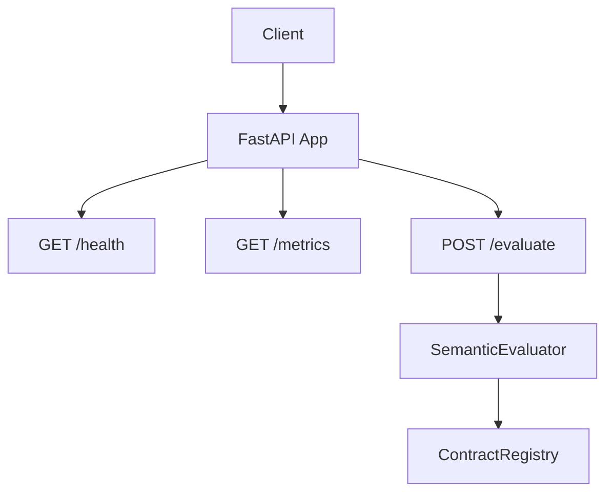
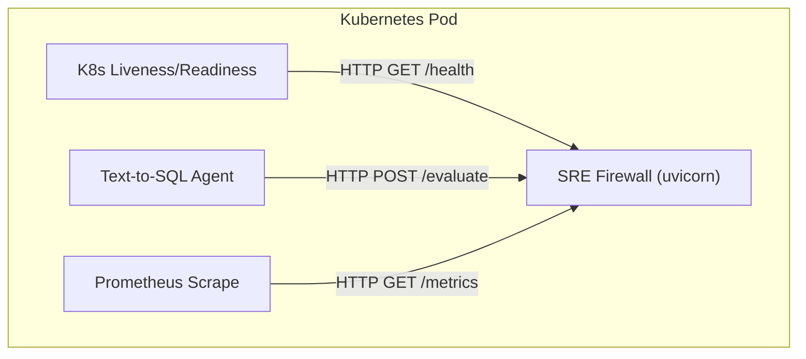
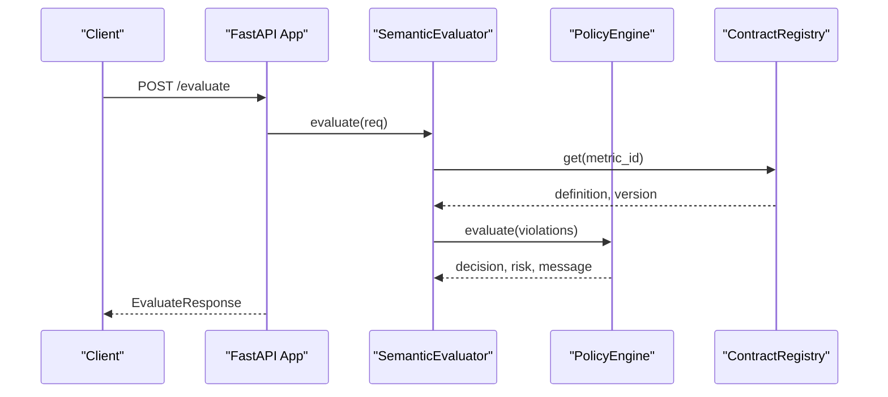
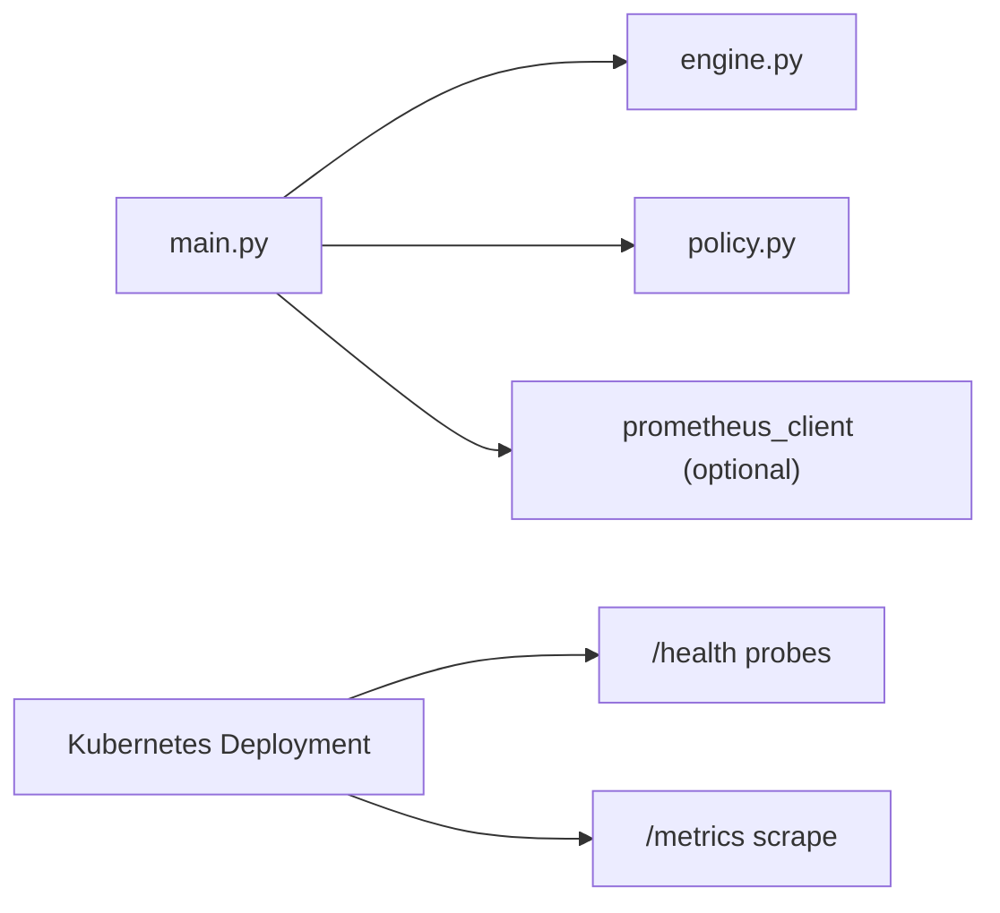

# Health and Monitoring Endpoints

<cite>
**Referenced Files in This Document**
- [main.py](file://semantic_reliability/firewall/main.py)
- [engine.py](file://semantic_reliability/firewall/engine.py)
- [semantic_firewall_sidecar.yaml](file://deploy/k8s/semantic_firewall_sidecar.yaml)
</cite>

## Table of Contents
1. [Introduction](#introduction)
2. [Project Structure](#project-structure)
3. [Core Components](#core-components)
4. [Architecture Overview](#architecture-overview)
5. [Detailed Component Analysis](#detailed-component-analysis)
6. [Dependency Analysis](#dependency-analysis)
7. [Performance Considerations](#performance-considerations)
8. [Troubleshooting Guide](#troubleshooting-guide)
9. [Conclusion](#conclusion)
10. [Appendices](#appendices)

## Introduction
This document describes the health check and monitoring endpoints exposed by the Semantic Reliability Engine’s firewall service. It covers:
- GET /health for service status verification, contract loading status, and listing available metrics
- GET /metrics for Prometheus metrics export, including request counts, decision tracking, violation monitoring, and latency measurements
- Metric labels, counters, and histograms
- Examples of monitoring setup, alerting configuration, and integration with observability tools
- Fallback behavior when the Prometheus client is not available

## Project Structure
The HTTP endpoints are implemented in the firewall module using FastAPI. The service exposes:
- POST /evaluate to evaluate SQL against semantic contracts
- GET /health to report health and loaded contracts
- GET /metrics to expose Prometheus metrics

**Diagram sources**
- [main.py:23-69](file://semantic_reliability/firewall/main.py#L23-L69)
- [engine.py:19-44](file://semantic_reliability/firewall/engine.py#L19-L44)

**Section sources**
- [main.py:23-69](file://semantic_reliability/firewall/main.py#L23-L69)
- [engine.py:19-44](file://semantic_reliability/firewall/engine.py#L19-L44)

## Core Components
- ContractRegistry: Loads metric contracts from a directory into memory and provides lookup by metric ID.
- SemanticEvaluator: Evaluates incoming SQL requests against loaded contracts and policy rules, producing decisions and violations.
- Prometheus instrumentation: Conditionally enabled via try/import; records request counts, latencies, decisions, violations, and blocked executions.

Key responsibilities:
- Health endpoint reports service status and lists loaded metrics (contract keys).
- Metrics endpoint exports Prometheus-compatible text if the client is installed; otherwise returns a fallback message.

**Section sources**
- [engine.py:19-44](file://semantic_reliability/firewall/engine.py#L19-L44)
- [main.py:10-21](file://semantic_reliability/firewall/main.py#L10-L21)

## Architecture Overview
The firewall service integrates with Kubernetes for liveness/readiness probes and Prometheus scraping.

**Diagram sources**
- [semantic_firewall_sidecar.yaml:18-21](file://deploy/k8s/semantic_firewall_sidecar.yaml#L18-L21)
- [semantic_firewall_sidecar.yaml:64-75](file://deploy/k8s/semantic_firewall_sidecar.yaml#L64-L75)
- [main.py:23-69](file://semantic_reliability/firewall/main.py#L23-L69)

## Detailed Component Analysis

### GET /health
Purpose:
- Verify that the service is running and responsive
- Report how many contracts were successfully loaded
- List the available metric IDs (contract keys)

Behavior:
- Returns a JSON object with:
  - status: "healthy"
  - contracts_loaded: number of loaded contracts
  - metrics: list of metric IDs

Operational notes:
- Used by Kubernetes liveness and readiness probes to determine pod health
- Does not depend on Prometheus availability

Example usage:
- curl http://host:8080/health

Expected response fields:
- status: string
- contracts_loaded: integer
- metrics: array of strings

**Section sources**
- [main.py:56-62](file://semantic_reliability/firewall/main.py#L56-L62)
- [semantic_firewall_sidecar.yaml:64-75](file://deploy/k8s/semantic_firewall_sidecar.yaml#L64-L75)

### GET /metrics
Purpose:
- Export Prometheus metrics in the standard text format for scraping

Metrics exported:
- sre_requests_total (Counter): Total requests to the firewall, labeled by agent_id
- sre_evaluation_latency_seconds (Histogram): Time to evaluate a request
- sre_decisions_total (Counter): Decisions made, labeled by decision
- sre_contract_violations_total (Counter): Violations caught, labeled by rule
- sre_execution_blocked_total (Counter): Queries blocked

Labels:
- agent_id: identifies the calling agent
- decision: value indicating ALLOW, DENY, AUDIT, etc.
- rule: name or identifier of the violated invariant rule

Fallback behavior:
- If prometheus_client is not installed, the endpoint returns a plain text message indicating metrics are unavailable

Prometheus scrape annotations:
- The deployment includes annotations to enable automatic scraping at port 8080 and path /metrics

Example usage:
- curl http://host:8080/metrics

**Section sources**
- [main.py:10-21](file://semantic_reliability/firewall/main.py#L10-L21)
- [main.py:36-53](file://semantic_reliability/firewall/main.py#L36-L53)
- [main.py:65-69](file://semantic_reliability/firewall/main.py#L65-L69)
- [semantic_firewall_sidecar.yaml:18-21](file://deploy/k8s/semantic_firewall_sidecar.yaml#L18-L21)

### POST /evaluate (context for metrics)
Purpose:
- Evaluate an incoming SQL query against semantic contracts and policy

Metrics recorded during evaluation:
- sre_requests_total incremented per request
- sre_evaluation_latency_seconds observed for duration
- sre_decisions_total incremented based on decision
- sre_contract_violations_total incremented per violation
- sre_execution_blocked_total incremented when execution is not allowed

Flow:
- Request arrives
- Optional Prometheus counters updated
- Evaluation runs
- Latency measured and histogram observed
- Decision and violations recorded
- Response returned

**Diagram sources**
- [main.py:36-53](file://semantic_reliability/firewall/main.py#L36-L53)
- [engine.py:55-117](file://semantic_reliability/firewall/engine.py#L55-L117)

**Section sources**
- [main.py:36-53](file://semantic_reliability/firewall/main.py#L36-L53)
- [engine.py:55-117](file://semantic_reliability/firewall/engine.py#L55-L117)

## Dependency Analysis
- The firewall app depends on:
  - FastAPI for HTTP routing
  - ContractRegistry for loading and serving metric contracts
  - PolicyEngine for evaluating violations and determining decisions
  - Prometheus client (optional) for metrics instrumentation

- Kubernetes integration:
  - Liveness and readiness probes call /health
  - Prometheus annotations configure scraping of /metrics

**Diagram sources**
- [main.py:23-69](file://semantic_reliability/firewall/main.py#L23-L69)
- [engine.py:19-44](file://semantic_reliability/firewall/engine.py#L19-L44)
- [semantic_firewall_sidecar.yaml:18-21](file://deploy/k8s/semantic_firewall_sidecar.yaml#L18-L21)
- [semantic_firewall_sidecar.yaml:64-75](file://deploy/k8s/semantic_firewall_sidecar.yaml#L64-L75)

**Section sources**
- [main.py:23-69](file://semantic_reliability/firewall/main.py#L23-L69)
- [engine.py:19-44](file://semantic_reliability/firewall/engine.py#L19-L44)
- [semantic_firewall_sidecar.yaml:18-21](file://deploy/k8s/semantic_firewall_sidecar.yaml#L18-L21)
- [semantic_firewall_sidecar.yaml:64-75](file://deploy/k8s/semantic_firewall_sidecar.yaml#L64-L75)

## Performance Considerations
- Latency measurement uses a high-resolution timer to observe per-request evaluation time
- Counters are lightweight increments and should have minimal overhead
- Histogram buckets are managed by the Prometheus client library; ensure appropriate bucket configuration at the application level if customizing
- Avoid excessive logging in hot paths; audit traces are logged but can be tuned based on environment needs

[No sources needed since this section provides general guidance]

## Troubleshooting Guide
Common issues and resolutions:
- /health returns healthy but no metrics listed:
  - Ensure contracts directory exists and contains valid YAML files
  - Check logs for warnings about unparseable contracts
- /metrics returns a message indicating Prometheus client unavailable:
  - Install prometheus_client in the runtime environment
  - Verify the import succeeds so PROMETHEUS_AVAILABLE becomes True
- No data in Prometheus after enabling scraping:
  - Confirm annotations prometheus.io/scrape, prometheus.io/port, and prometheus.io/path are set correctly
  - Validate that the container exposes port 8080 and the path /metrics is reachable

Operational checks:
- Use curl to verify endpoints:
  - GET /health
  - GET /metrics
- Inspect Kubernetes events and pod logs for startup errors

**Section sources**
- [engine.py:27-36](file://semantic_reliability/firewall/engine.py#L27-L36)
- [main.py:10-21](file://semantic_reliability/firewall/main.py#L10-L21)
- [main.py:65-69](file://semantic_reliability/firewall/main.py#L65-L69)
- [semantic_firewall_sidecar.yaml:18-21](file://deploy/k8s/semantic_firewall_sidecar.yaml#L18-L21)

## Conclusion
The firewall service provides robust operational visibility through:
- A simple health endpoint for liveness/readiness and contract status
- A Prometheus-compatible metrics endpoint exposing request volume, latency, decisions, violations, and blocks
- Graceful fallback when Prometheus client is absent
- Built-in Kubernetes integration for probes and scraping

These capabilities enable reliable monitoring, alerting, and observability integrations in production environments.

[No sources needed since this section summarizes without analyzing specific files]

## Appendices

### Monitoring Setup Example
- Enable Prometheus scraping via annotations:
  - prometheus.io/scrape: "true"
  - prometheus.io/port: "8080"
  - prometheus.io/path: "/metrics"
- Configure liveness and readiness probes to call /health

**Section sources**
- [semantic_firewall_sidecar.yaml:18-21](file://deploy/k8s/semantic_firewall_sidecar.yaml#L18-L21)
- [semantic_firewall_sidecar.yaml:64-75](file://deploy/k8s/semantic_firewall_sidecar.yaml#L64-L75)

### Alerting Configuration Ideas
- Alert on elevated sre_contract_violations_total rate
- Alert on increased sre_execution_blocked_total spikes
- Alert on high sre_evaluation_latency_seconds quantiles
- Alert if /health indicates zero contracts_loaded over time

[No sources needed since this section provides general guidance]

### Integration with Observability Tools
- Prometheus: scrape /metrics and visualize dashboards
- Grafana: build dashboards for latency, decisions, violations, and blocked queries
- Logging: correlate Prometheus metrics with structured logs emitted by the evaluator

[No sources needed since this section provides general guidance]