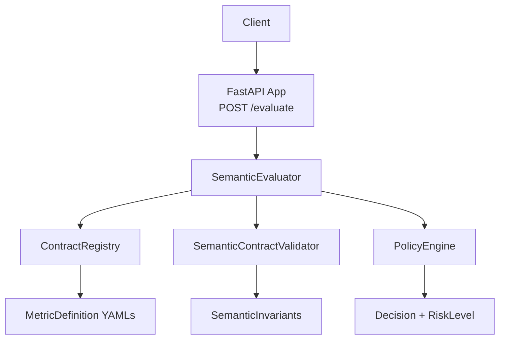
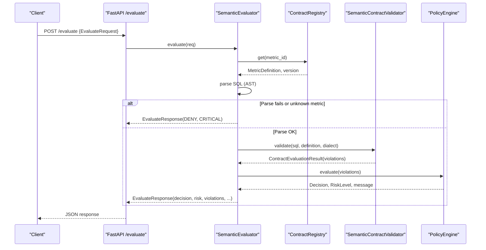
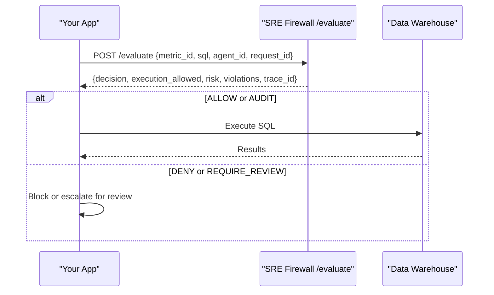
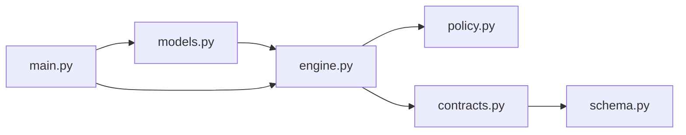

# Query Validation Endpoints

<cite>
**Referenced Files in This Document**
- [main.py](file://semantic_reliability/firewall/main.py)
- [engine.py](file://semantic_reliability/firewall/engine.py)
- [models.py](file://semantic_reliability/firewall/models.py)
- [policy.py](file://semantic_reliability/firewall/policy.py)
- [contracts.py](file://semantic_reliability/compiler/contracts.py)
- [schema.py](file://semantic_reliability/compiler/schema.py)
- [test_firewall.py](file://tests/test_firewall.py)
- [contract.yaml](file://benchmark_corpus/dev/net_revenue/contract.yaml)
</cite>

## Table of Contents
1. [Introduction](#introduction)
2. [Project Structure](#project-structure)
3. [Core Components](#core-components)
4. [Architecture Overview](#architecture-overview)
5. [Detailed Component Analysis](#detailed-component-analysis)
6. [Dependency Analysis](#dependency-analysis)
7. [Performance Considerations](#performance-considerations)
8. [Troubleshooting Guide](#troubleshooting-guide)
9. [Conclusion](#conclusion)
10. [Appendices](#appendices)

## Introduction
This document provides detailed API documentation for the query validation endpoints, focusing on the POST /evaluate endpoint. It explains how SQL queries are validated against semantic contracts, how policy enforcement determines execution decisions, and how to integrate this service into real-time applications that need runtime governance over AI-generated analytical SQL.

The endpoint accepts a request describing the target metric contract and candidate SQL, performs semantic invariant checks, applies policy rules, and returns a structured response with decision, risk, violations, and audit metadata.

## Project Structure
The evaluation service is implemented as a FastAPI application that:
- Loads metric contracts from a directory (defaulting to the benchmark corpus).
- Parses and validates incoming SQL using an AST-based approach.
- Enforces semantic invariants defined by SCOS-style metric contracts.
- Applies policy rules to determine ALLOW, AUDIT, REQUIRE_REVIEW, or DENY decisions.
- Emits Prometheus metrics when available.

**Diagram sources**
- [main.py:23-53](file://semantic_reliability/firewall/main.py#L23-L53)
- [engine.py:18-132](file://semantic_reliability/firewall/engine.py#L18-L132)
- [policy.py:32-68](file://semantic_reliability/firewall/policy.py#L32-L68)
- [contracts.py:26-135](file://semantic_reliability/compiler/contracts.py#L26-L135)
- [schema.py:5-98](file://semantic_reliability/compiler/schema.py#L5-L98)

**Section sources**
- [main.py:23-70](file://semantic_reliability/firewall/main.py#L23-L70)

## Core Components
- EvaluateRequest: The input payload containing request_id, metric_id, sql, dialect, agent_id, and optional question.
- EvaluateResponse: The output payload containing request_id, trace_id, decision, execution_allowed, contract_compliant, risk, violations, contract_version, and message.
- ContractRegistry: In-memory registry that loads MetricDefinition objects from YAML files.
- SemanticEvaluator: Orchestrates parsing, contract validation, policy evaluation, and audit logging.
- SemanticContractValidator: Checks SQL against declared invariants (population, grain, aggregation, timezone).
- PolicyEngine: Maps violations to decisions and risk levels, optionally mapping violations to mutation operators.

Key behaviors:
- Unparseable SQL or unknown metric results in immediate DENY with CRITICAL risk.
- Violations are enriched with mutation-equivalent labels for observability.
- Strict mode blocks execution on critical violations; non-strict mode requires review instead.

**Section sources**
- [models.py:20-51](file://semantic_reliability/firewall/models.py#L20-L51)
- [engine.py:18-132](file://semantic_reliability/firewall/engine.py#L18-L132)
- [contracts.py:26-135](file://semantic_reliability/compiler/contracts.py#L26-L135)
- [policy.py:32-68](file://semantic_reliability/firewall/policy.py#L32-L68)

## Architecture Overview
The POST /evaluate endpoint implements a deterministic, AST-based validation pipeline:

**Diagram sources**
- [main.py:36-53](file://semantic_reliability/firewall/main.py#L36-L53)
- [engine.py:54-116](file://semantic_reliability/firewall/engine.py#L54-L116)
- [contracts.py:29-135](file://semantic_reliability/compiler/contracts.py#L29-L135)
- [policy.py:38-68](file://semantic_reliability/firewall/policy.py#L38-L68)

## Detailed Component Analysis

### Endpoint: POST /evaluate
- Path: /evaluate
- Method: POST
- Request body: EvaluateRequest
- Response body: EvaluateResponse
- Status codes:
  - 200: Successful evaluation (always returns a structured decision, even if DENY)
  - 4xx/5xx: HTTP-level errors (e.g., malformed JSON), not part of the domain model

Behavior:
- Validates presence of required fields via Pydantic.
- Resolves the metric contract by metric_id.
- Parses SQL using the specified dialect.
- Runs semantic invariant checks.
- Applies policy to compute decision and risk.
- Records audit traces and emits metrics (if enabled).

**Section sources**
- [main.py:36-53](file://semantic_reliability/firewall/main.py#L36-L53)

### Request Schema: EvaluateRequest
Fields:
- request_id: string (required) — Unique identifier for the request.
- metric_id: string (required) — Identifier of the metric contract to validate against.
- sql: string (required) — Candidate SQL to evaluate.
- dialect: string (optional, default "duckdb") — SQL dialect used for parsing.
- agent_id: string (required) — Identifier of the calling agent/system.
- question: string (optional) — Human-readable question context.

Notes:
- Dialect must be supported by the underlying parser.
- metric_id must correspond to a loaded contract.

**Section sources**
- [models.py:20-27](file://semantic_reliability/firewall/models.py#L20-L27)

### Response Schema: EvaluateResponse
Fields:
- request_id: string — Echoed from request.
- trace_id: string — Unique trace ID for audit correlation.
- decision: enum — One of ALLOW, AUDIT, REQUIRE_REVIEW, DENY.
- execution_allowed: boolean — True for ALLOW/AUDIT; False otherwise.
- contract_compliant: boolean — True if zero violations detected.
- risk: enum — LOW, MEDIUM, HIGH, CRITICAL.
- violations: array of Violation — Details of each invariant violation.
- contract_version: string — Version of the resolved contract.
- message: string (optional) — Human-readable explanation (e.g., parse error details).

Violation object fields:
- rule: string — Rule description.
- expected: string — What was expected per contract.
- found: string — What was observed in the SQL.
- severity: string — Severity level (e.g., ERROR, CRITICAL).
- invariant_type: string — Category of invariant violated.
- mutation_equivalent: string (optional) — Mapping to a mutation operator for observability.

**Section sources**
- [models.py:29-51](file://semantic_reliability/firewall/models.py#L29-L51)

### Evaluation Process and Semantic Contract Checking
Steps:
1. Resolve metric contract by metric_id.
2. Parse SQL using the specified dialect.
3. Validate SQL against SemanticInvariants:
   - Population: Required and forbidden filters.
   - Grain: Required grouping dimensions.
   - Aggregation: Positive/negative components and expected functions.
   - Timezone: Expected timezone alignment.
4. Map violations to mutation-equivalent labels for observability.
5. Apply policy to determine decision and risk.
6. Record immutable audit trace.

Complexity considerations:
- Parsing and AST traversal scale with SQL size and complexity.
- Invariant checks operate on normalized forms and substring matching for performance.

**Section sources**
- [engine.py:54-116](file://semantic_reliability/firewall/engine.py#L54-L116)
- [contracts.py:29-135](file://semantic_reliability/compiler/contracts.py#L29-L135)
- [schema.py:5-98](file://semantic_reliability/compiler/schema.py#L5-L98)

### Policy Enforcement Mechanisms
Policy rules:
- No violations: ALLOW, LOW risk.
- Violations present:
  - If any violation has high severity (ERROR/CRITICAL/FATAL):
    - Strict mode: DENY, CRITICAL risk.
    - Non-strict mode: REQUIRE_REVIEW, CRITICAL risk.
  - Otherwise: AUDIT, HIGH risk.

Additional enrichment:
- Each violation is mapped to a mutation-equivalent label (e.g., FILTER_DROP, GRAIN_DROP, AGGREGATION_SWAP, NULL_COALESCE_DROP, MATH_OPERATOR_INVERT).

**Section sources**
- [policy.py:32-68](file://semantic_reliability/firewall/policy.py#L32-L68)

### Example Scenarios

#### Scenario A: Valid Query (ALLOW)
- Request:
  - metric_id: "net_revenue"
  - sql: Includes required filters, correct grouping, and proper aggregation per contract.
  - dialect: "duckdb"
  - agent_id: "agent-1"
  - request_id: "req-001"
- Response:
  - decision: "ALLOW"
  - execution_allowed: true
  - contract_compliant: true
  - risk: "LOW"
  - violations: []
  - contract_version: "1.0.0"
  - message: null

Reference behavior:
- Tests assert ALLOW for compliant SQL.

**Section sources**
- [test_firewall.py:28-40](file://tests/test_firewall.py#L28-L40)
- [contract.yaml:1-19](file://benchmark_corpus/dev/net_revenue/contract.yaml#L1-L19)

#### Scenario B: Missing Required Filter (DENY)
- Request:
  - metric_id: "net_revenue"
  - sql: Omits required filter(s) such as status = 'active'.
  - dialect: "duckdb"
  - agent_id: "agent-2"
  - request_id: "req-002"
- Response:
  - decision: "DENY"
  - execution_allowed: false
  - contract_compliant: false
  - risk: "CRITICAL"
  - violations: includes population invariant violation
  - contract_version: "1.0.0"
  - message: null

Reference behavior:
- Tests assert DENY and presence of mutation-equivalent mapping for filter-related violations.

**Section sources**
- [test_firewall.py:43-57](file://tests/test_firewall.py#L43-L57)

#### Scenario C: Non-Strict Mode Requires Review
- Request: Same as Scenario B but policy configured in non-strict mode.
- Response:
  - decision: "REQUIRE_REVIEW"
  - execution_allowed: false
  - risk: "CRITICAL"
  - violations: same as above

Reference behavior:
- Tests assert REQUIRE_REVIEW when strict_mode is disabled.

**Section sources**
- [test_firewall.py:60-72](file://tests/test_firewall.py#L60-L72)

#### Scenario D: Unparseable SQL (DENY)
- Request:
  - sql: Invalid syntax.
- Response:
  - decision: "DENY"
  - execution_allowed: false
  - risk: "CRITICAL"
  - message: Contains parse error details

Reference behavior:
- Tests assert DENY and parse error message.

**Section sources**
- [test_firewall.py:74-85](file://tests/test_firewall.py#L74-L85)

### Error Handling and Status Codes
- Domain-level errors (invalid SQL, unknown metric) return structured responses with decision=DENY and risk=CRITICAL.
- HTTP-level errors (e.g., malformed JSON) will result in standard HTTP error responses from the framework.
- Metrics:
  - Requests counter incremented per call.
  - Decisions counter incremented per decision.
  - Violations counter incremented per violation rule.
  - Blocked counter incremented when execution_allowed is false.

**Section sources**
- [engine.py:54-84](file://semantic_reliability/firewall/engine.py#L54-L84)
- [main.py:36-53](file://semantic_reliability/firewall/main.py#L36-L53)

### Integration Examples

#### Real-Time Application Flow
- Your application generates SQL via an AI agent.
- Before execution, send a POST /evaluate request with the SQL and metric_id.
- If decision is ALLOW or AUDIT, proceed to execute; otherwise, block or route for manual review.
- Use trace_id to correlate logs and audits across systems.

Example flow:

[No sources needed since this diagram shows conceptual workflow, not actual code structure]

#### Using the Service in CI/CD
- Integrate /evaluate as a gate before deploying models or running reports.
- Fail builds when decision is DENY or when violations exceed thresholds.

[No sources needed since this section provides general guidance]

## Dependency Analysis
The evaluation pipeline depends on:
- ContractRegistry for loading MetricDefinition from YAML.
- SemanticContractValidator for AST-based invariant checks.
- PolicyEngine for decision and risk computation.
- FastAPI for HTTP exposure and optional Prometheus metrics.

**Diagram sources**
- [main.py:6-8](file://semantic_reliability/firewall/main.py#L6-L8)
- [engine.py:10-13](file://semantic_reliability/firewall/engine.py#L10-L13)
- [contracts.py:1-7](file://semantic_reliability/compiler/contracts.py#L1-L7)
- [schema.py:1-37](file://semantic_reliability/compiler/schema.py#L1-L37)
- [policy.py:1-2](file://semantic_reliability/firewall/policy.py#L1-L2)

**Section sources**
- [main.py:6-8](file://semantic_reliability/firewall/main.py#L6-L8)
- [engine.py:10-13](file://semantic_reliability/firewall/engine.py#L10-L13)

## Performance Considerations
- Parsing and AST operations dominate latency; keep SQL concise and avoid unnecessary complexity.
- Contract resolution is O(1) after initial load; ensure contracts are preloaded at startup.
- Metrics collection adds minimal overhead when Prometheus client is installed.
- For high-throughput scenarios, consider caching parsed ASTs per SQL hash if appropriate.

[No sources needed since this section provides general guidance]

## Troubleshooting Guide
Common issues:
- Unknown metric_id: Ensure the metric contract is loaded in the registry and the metric_id matches exactly.
- SQL parse errors: Verify dialect compatibility and syntax correctness.
- Unexpected DENY: Inspect violations and their invariant_type to identify missing filters, incorrect grouping, or aggregation mismatches.
- Audit trail: Use trace_id to locate the corresponding entry in the evaluator’s audit log for deeper inspection.

Operational tips:
- Check /health to verify contracts_loaded and available metrics.
- Use /metrics to observe request counts, decisions, violations, and blocked queries.

**Section sources**
- [engine.py:54-84](file://semantic_reliability/firewall/engine.py#L54-L84)
- [main.py:56-70](file://semantic_reliability/firewall/main.py#L56-L70)

## Conclusion
The POST /evaluate endpoint provides robust, deterministic validation of AI-generated SQL against business-defined semantic contracts. By combining AST-based invariant checking with policy-driven decisions, it enables safe integration of agentic analytics into production workflows while maintaining strong governance and auditability.

[No sources needed since this section summarizes without analyzing specific files]

## Appendices

### Appendix A: Semantic Invariants Reference
- Population:
  - required_filters: Filters that must appear in WHERE.
  - forbidden_filters: Filters that must never appear.
- Grain:
  - required_dimensions: Dimensions that must be grouped.
  - allow_over_aggregation: Whether higher-level aggregations are permitted.
- Aggregation:
  - required_function: Expected aggregate function.
  - positive_components: Values to add.
  - negative_components: Values to subtract.
- Units:
  - currency: Expected currency.
  - scale: Scale definition.
- Time:
  - timezone: Expected timezone (e.g., UTC).
  - period_grain: Calendar vs fiscal period definitions.

**Section sources**
- [schema.py:5-37](file://semantic_reliability/compiler/schema.py#L5-L37)

### Appendix B: Mutation Equivalents
Violations can be mapped to mutation operators for observability:
- FILTER_DROP: Related to population/filter issues.
- GRAIN_DROP: Related to grain/grouping issues.
- AGGREGATION_SWAP: Related to aggregation/function issues.
- NULL_COALESCE_DROP: Related to null/coalesce handling.
- MATH_OPERATOR_INVERT: Related to negative/deduction logic.

**Section sources**
- [policy.py:4-29](file://semantic_reliability/firewall/policy.py#L4-L29)