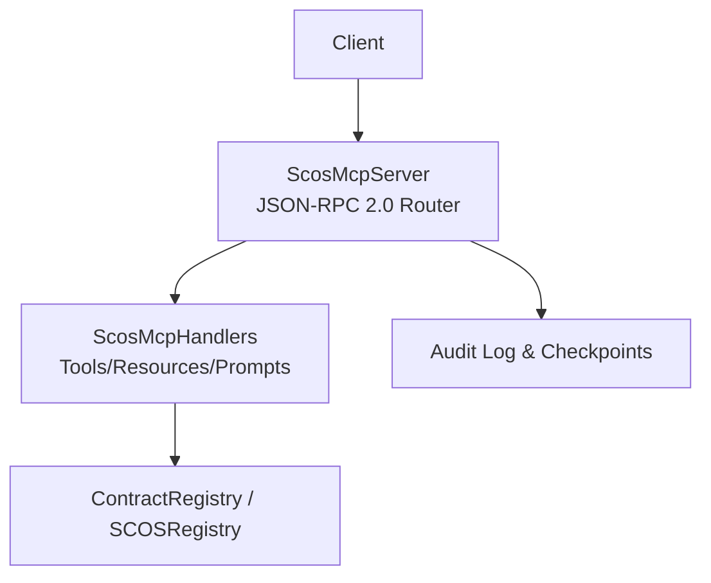
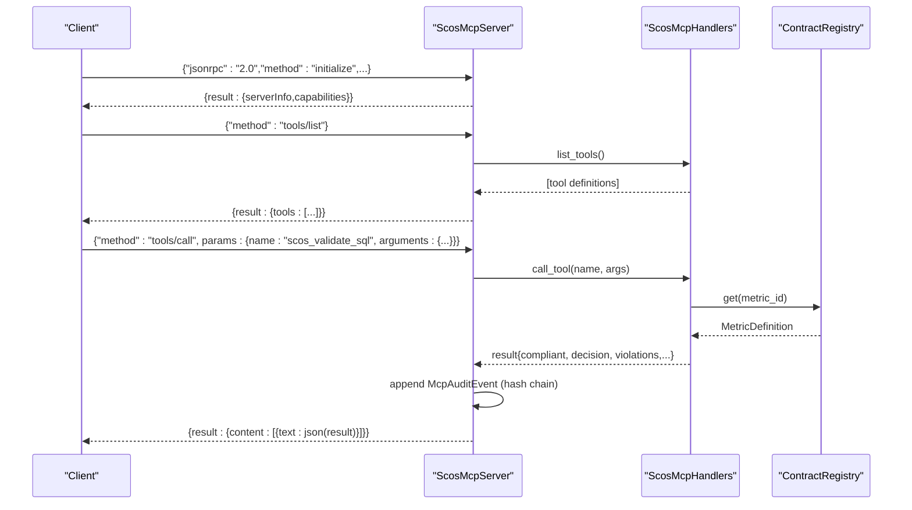
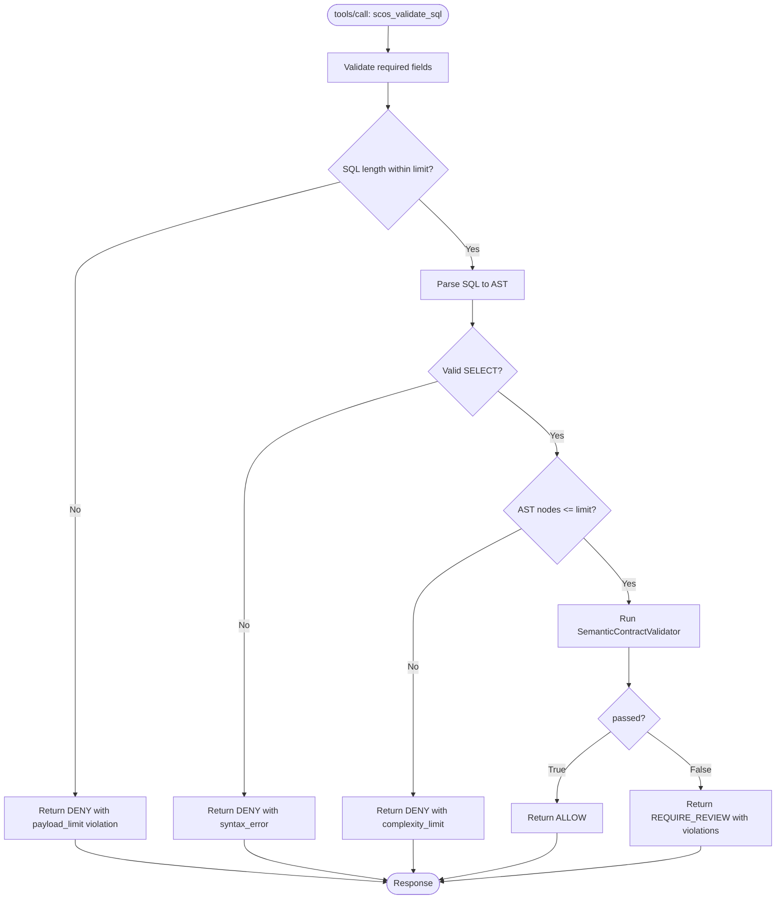
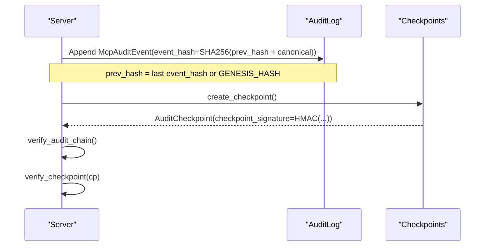
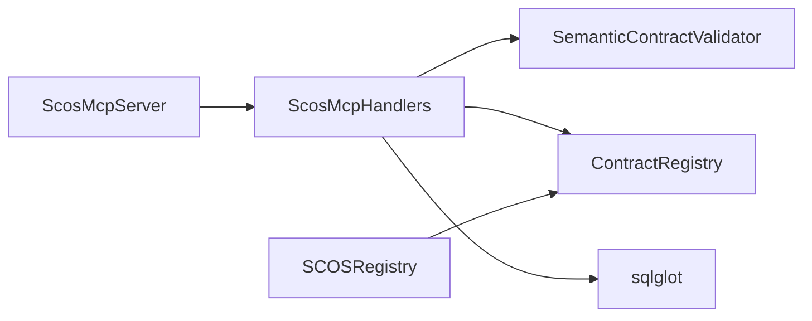

# MCP Protocol

<cite>
**Referenced Files in This Document**
- [server.py](file://semantic_reliability/mcp/server.py)
- [handlers.py](file://semantic_reliability/mcp/handlers.py)
- [models.py](file://semantic_reliability/mcp/models.py)
- [security.py](file://semantic_reliability/mcp/security.py)
- [registry.py](file://semantic_reliability/mcp/registry.py)
- [test_mcp_server.py](file://tests/test_mcp_server.py)
- [MCP_SECURITY_AND_THREAT_MODEL.md](file://docs/MCP_SECURITY_AND_THREAT_MODEL.md)
</cite>

## Table of Contents
1. Introduction
2. Project Structure
3. Core Components
4. Architecture Overview
5. Detailed Component Analysis
6. Dependency Analysis
7. Performance Considerations
8. Troubleshooting Guide
9. Conclusion
10. Appendices

## Introduction
This document specifies the Model Context Protocol (MCP) implemented by the SCOS server. It covers JSON-RPC 2.0 endpoints, message schemas, protocol versioning, and tool capabilities. The server is a read-only semantic consultant that validates analytical SQL against declared metric contracts without executing queries or rewriting code. It provides structured violations, remediation guidance, and tamper-evident audit logs with signed checkpoints.

## Project Structure
The MCP implementation is organized into focused modules:
- Server: JSON-RPC 2.0 request handling, method routing, response formatting, and audit chaining
- Handlers: Tool definitions, resource listings, prompt templates, and domain-scoped access control
- Models: Pydantic data models for tools, resources, prompts, audit events, and checkpoints
- Security: Limits enforcement, SQL hashing, and structured audit logging utilities
- Registry: Read-only contract discovery and URI resolution for scos:// resources

**Diagram sources**
- [server.py:16-48](file://semantic_reliability/mcp/server.py#L16-L48)
- [handlers.py:19-34](file://semantic_reliability/mcp/handlers.py#L19-L34)
- [registry.py:10-17](file://semantic_reliability/mcp/registry.py#L10-L17)

**Section sources**
- [server.py:16-48](file://semantic_reliability/mcp/server.py#L16-L48)
- [handlers.py:19-34](file://semantic_reliability/mcp/handlers.py#L19-L34)
- [registry.py:10-17](file://semantic_reliability/mcp/registry.py#L10-L17)

## Core Components
- ScosMcpServer: Implements JSON-RPC 2.0 methods, enforces payload size limits, routes to handlers, and builds hash-chained audit events.
- ScosMcpHandlers: Exposes tools, resources, and prompts; applies domain authorization; performs AST-based validation and invariant checks.
- Models: Define typed structures for caller identity, tool/resource/prompt definitions, audit events, and checkpoints.
- Security: Enforces payload and SQL length limits, hashes SQL for safe logging, and emits structured audit events.
- Registry: Provides read-only access to metric contracts and resolves scos:// URIs.

Key behaviors:
- Zero execution: Tools never execute SQL; they validate and return decisions.
- No silent rewrites: Violations are returned with explicit rules and severity.
- Domain scoping: Access can be restricted to authorized domains per server configuration.
- Tamper-evident audit: Every tool call appends a hashed event; checkpoints sign chain state.

**Section sources**
- [server.py:50-180](file://semantic_reliability/mcp/server.py#L50-L180)
- [handlers.py:37-287](file://semantic_reliability/mcp/handlers.py#L37-L287)
- [models.py:9-121](file://semantic_reliability/mcp/models.py#L9-L121)
- [security.py:16-57](file://semantic_reliability/mcp/security.py#L16-L57)
- [registry.py:10-71](file://semantic_reliability/mcp/registry.py#L10-L71)

## Architecture Overview
The server exposes a small set of JSON-RPC 2.0 methods over stdio or an HTTP transport wrapper. Clients initialize the session, list available tools/resources/prompts, and invoke tools via tools/call. All tool calls are audited with cryptographic chaining and optional signed checkpoints.

**Diagram sources**
- [server.py:76-128](file://semantic_reliability/mcp/server.py#L76-L128)
- [handlers.py:147-240](file://semantic_reliability/mcp/handlers.py#L147-L240)

**Section sources**
- [server.py:76-128](file://semantic_reliability/mcp/server.py#L76-L128)
- [handlers.py:147-240](file://semantic_reliability/mcp/handlers.py#L147-L240)

## Detailed Component Analysis

### JSON-RPC 2.0 Endpoints
All endpoints use JSON-RPC 2.0 envelopes with standard error codes.

- initialize
  - Method: initialize
  - Purpose: Negotiate protocol version and announce server capabilities
  - Request params: protocolVersion (string)
  - Response: serverInfo (name, version), capabilities (tools, resources, prompts flags)
  - Notes: Server advertises protocol version 2024-11-05

- tools/list
  - Method: tools/list
  - Purpose: Discover available tools and their input schemas
  - Response: tools array of tool definitions

- tools/call
  - Method: tools/call
  - Purpose: Invoke a specific tool with name and arguments
  - Request params: name (string), arguments (object)
  - Response: content array containing text field with JSON-encoded tool result
  - Errors: Invalid params (-32602), unknown method (-32601), internal error (-32603)

- resources/list
  - Method: resources/list
  - Purpose: List available scos:// resources (contracts, policies)
  - Response: resources array

- resources/read
  - Method: resources/read
  - Purpose: Read a resource by URI
  - Request params: uri (string)
  - Response: contents array with uri, mimeType, text

- prompts/list
  - Method: prompts/list
  - Purpose: List available prompt templates
  - Response: prompts array

- prompts/get
  - Method: prompts/get
  - Purpose: Retrieve a prompt template with arguments
  - Request params: name (string), arguments (object)
  - Response: description and messages array

- notifications/initialized
  - Method: notifications/initialized
  - Purpose: Notification from client indicating initialization completed
  - Response: empty object

Authentication and Authorization:
- CallerIdentity supports client_id, tenant_id, allowed_domains, role, authenticated flag
- Domain scoping enforced per handler based on allowed_domains configured at server construction

Rate Limiting and Connection Management:
- max_request_bytes enforced at server level
- SQL length and AST complexity limits enforced in handlers
- Stdio loop provided for local integration; HTTP transport can wrap handle_request

Error Codes:
- -32700 Parse error (invalid JSON)
- -32600 Invalid request (not object, missing method, invalid params)
- -32601 Method not found
- -32602 Invalid params
- -32603 Internal error

Protocol Versioning:
- PROTOCOL_VERSION = "2024-11-05"
- Backward compatibility: initialize returns negotiated protocolVersion; clients should check capabilities

**Section sources**
- [server.py:50-180](file://semantic_reliability/mcp/server.py#L50-L180)
- [handlers.py:37-409](file://semantic_reliability/mcp/handlers.py#L37-L409)
- [test_mcp_server.py:37-196](file://tests/test_mcp_server.py#L37-L196)

### Available Tools
The following tools are exposed by handlers:

- scos_list_metrics
  - Description: List registered metrics with domain, grain, owner, and description
  - Input schema: object with optional domain filter
  - Output: metrics array and count

- scos_get_contract
  - Description: Retrieve full metric contract including canonical SQL and invariants
  - Input schema: required metric_id, optional domain
  - Output: metric metadata, dialect, canonical_sql, invariants, probes, version

- scos_validate_sql
  - Description: Validate candidate SQL against metric invariants without execution
  - Input schema: required metric_id, sql; optional dialect
  - Output: compliant boolean, decision (ALLOW/REQUIRE_REVIEW/DENY), violations, policy_version, sql_sha256, latency_ms

- scos_explain_violation
  - Description: Provide remediation guidance for a specific violated rule
  - Input schema: required metric_id, rule
  - Output: violated_rule, remediation_guidance, automatic_rewrite_applied=false

- scos_get_probe_status
  - Description: Return active statistical reality probes and health status
  - Input schema: required metric_id
  - Output: status, active_probes, last_evaluated_utc

Notes:
- Tools are read-only; execution_performed is always false
- Domain authorization enforced per metric
- AST parsing and node counting protect against excessive complexity

**Section sources**
- [handlers.py:37-97](file://semantic_reliability/mcp/handlers.py#L37-L97)
- [handlers.py:101-287](file://semantic_reliability/mcp/handlers.py#L101-L287)

### Data Models and JSON Schemas
Core models define the structure of requests, responses, and audit records.

- CallerIdentity
  - Fields: client_id, tenant_id, allowed_domains, role, authenticated
  - Purpose: Bind requests to tenants/domains for authorization

- McpToolDefinition
  - Fields: name, description, inputSchema
  - Purpose: Describe tool capabilities and parameter constraints

- McpResourceDefinition
  - Fields: uri, name, description, mimeType
  - Purpose: Declare readable resources under scos://

- McpPromptArgument and McpPromptDefinition
  - Fields: name, description, required; name, description, arguments
  - Purpose: Define prompt templates and their parameters

- McpAuditEvent
  - Fields: event_id, sequence_num, timestamp_utc, method, tool_name, resource_uri, metric_id, tenant_id, domain, sql_sha256, decision, latency_ms, client_id, key_id, previous_event_hash, event_hash
  - Behavior: compute_hash uses SHA-256 over canonical JSON including previous_event_hash

- AuditCheckpoint
  - Fields: checkpoint_id, sequence_end, last_event_hash, checkpoint_timestamp, key_id, total_events_verified, checkpoint_signature
  - Behavior: compute_signature uses HMAC-SHA256 over canonical envelope with signing key

- SqlValidationResult
  - Fields: metric_id, contract_version, compliant, decision, violations, execution_performed, policy_version, sql_sha256, latency_ms
  - Purpose: Standardized validation outcome used by tools

Validation Rules:
- Payload size limit enforced at server level
- SQL length limit enforced in handlers
- AST node count limit enforced in handlers
- Domain authorization enforced per metric/resource

**Section sources**
- [models.py:9-121](file://semantic_reliability/mcp/models.py#L9-L121)
- [security.py:16-57](file://semantic_reliability/mcp/security.py#L16-L57)

### Security and Audit
Security principles:
- Read-only semantics: no execution, no silent rewrites, no raw data exposure
- Threat mitigations: spoofing protection via serverInfo and CallerIdentity binding; tamper resistance via immutable registry; repudiation via hash-chained audit; information disclosure prevention via SQL hashing; DoS protection via size and complexity limits; privilege elevation prevention via AST parsing only

Audit model:
- Each tool call appends McpAuditEvent with computed event_hash
- Previous hash forms a chain; genesis hash anchors the first entry
- Periodic AuditCheckpoint signs chain state using HMAC-SHA256 with a signing key

Limits:
- MAX_REQUEST_BYTES at server level
- MAX_SQL_LENGTH and MAX_AST_NODES in handlers
- Structured audit logger redacts raw SQL from logs

**Section sources**
- [MCP_SECURITY_AND_THREAT_MODEL.md:7-69](file://docs/MCP_SECURITY_AND_THREAT_MODEL.md#L7-L69)
- [server.py:109-127](file://semantic_reliability/mcp/server.py#L109-L127)
- [security.py:16-57](file://semantic_reliability/mcp/security.py#L16-L57)

### Example Workflows

#### SQL Validation Flow

**Diagram sources**
- [handlers.py:147-240](file://semantic_reliability/mcp/handlers.py#L147-L240)

**Section sources**
- [handlers.py:147-240](file://semantic_reliability/mcp/handlers.py#L147-L240)

#### Audit Chain and Checkpoint

**Diagram sources**
- [server.py:182-220](file://semantic_reliability/mcp/server.py#L182-L220)
- [models.py:43-108](file://semantic_reliability/mcp/models.py#L43-L108)

**Section sources**
- [server.py:182-220](file://semantic_reliability/mcp/server.py#L182-L220)
- [models.py:43-108](file://semantic_reliability/mcp/models.py#L43-L108)

## Dependency Analysis
The MCP layer depends on:
- ContractRegistry for metric definitions and versions
- SemanticContractValidator for invariant evaluation
- sqlglot for AST parsing and complexity checks
- Optional SCOSRegistry for file-backed contract loading and URI resolution

**Diagram sources**
- [handlers.py:1-16](file://semantic_reliability/mcp/handlers.py#L1-L16)
- [registry.py:1-17](file://semantic_reliability/mcp/registry.py#L1-L17)

**Section sources**
- [handlers.py:1-16](file://semantic_reliability/mcp/handlers.py#L1-L16)
- [registry.py:1-17](file://semantic_reliability/mcp/registry.py#L1-L17)

## Performance Considerations
- Enforce payload size limits to prevent large request abuse
- Limit SQL string length to avoid excessive processing
- Cap AST node count to mitigate complex query attacks
- Use efficient hashing for audit events and checkpoints
- Avoid unnecessary serialization; return compact results where possible

[No sources needed since this section provides general guidance]

## Troubleshooting Guide
Common issues and resolutions:
- Invalid Request (-32600): Ensure root payload is a JSON object and contains a valid method string
- Method Not Found (-32601): Verify method names match supported endpoints
- Invalid Params (-32602): Confirm required fields exist and types match schemas
- Internal Error (-32603): Inspect server logs for unexpected exceptions during tool invocation
- Domain Access Denied: Configure allowed_domains or ensure metric domain matches scope
- SQL Validation Failures: Review violations and adjust SQL to satisfy invariants

Operational checks:
- Verify audit chain integrity with verify_audit_chain()
- Create and verify checkpoints to anchor log state
- Ensure signing key is configured for checkpoint signatures

**Section sources**
- [server.py:50-180](file://semantic_reliability/mcp/server.py#L50-L180)
- [server.py:182-220](file://semantic_reliability/mcp/server.py#L182-L220)
- [test_mcp_server.py:170-196](file://tests/test_mcp_server.py#L170-L196)

## Conclusion
The SCOS MCP server provides a secure, read-only interface for validating analytical SQL against business metric contracts. It enforces strict limits, returns structured violations, and maintains tamper-evident audit trails with signed checkpoints. Clients should rely on tools/list and tools/call to discover capabilities and perform validations, while honoring domain scoping and protocol version negotiation.

[No sources needed since this section summarizes without analyzing specific files]

## Appendices

### Endpoint Reference Summary
- initialize: negotiate protocol and capabilities
- tools/list: discover tools and schemas
- tools/call: invoke tools with name and arguments
- resources/list: list scos:// resources
- resources/read: read resource by URI
- prompts/list: list prompt templates
- prompts/get: retrieve prompt template with arguments
- notifications/initialized: client notification

**Section sources**
- [server.py:76-176](file://semantic_reliability/mcp/server.py#L76-L176)

### Tool Schemas and Responses
- scos_list_metrics: input domain filter; output metrics array and count
- scos_get_contract: input metric_id; output contract details and invariants
- scos_validate_sql: input metric_id, sql, dialect; output compliance decision and violations
- scos_explain_violation: input metric_id, rule; output remediation guidance
- scos_get_probe_status: input metric_id; output probe status and bounds

**Section sources**
- [handlers.py:37-97](file://semantic_reliability/mcp/handlers.py#L37-L97)
- [handlers.py:101-287](file://semantic_reliability/mcp/handlers.py#L101-L287)

### Client Implementation Examples
Below are example patterns for common tasks. Replace placeholders with actual values and adapt to your language’s JSON-RPC client library.

- Initialize session
  - Method: initialize
  - Params: {protocolVersion: "2024-11-05"}
  - Response: serverInfo and capabilities

- List tools
  - Method: tools/list
  - Response: tools array with inputSchema for each tool

- Call scos_validate_sql
  - Method: tools/call
  - Params: {name: "scos_validate_sql", arguments: {metric_id: "...", sql: "...", dialect: "..."}}
  - Response: content[0].text contains JSON with compliant, decision, violations, sql_sha256, latency_ms

- Read contract resource
  - Method: resources/read
  - Params: {uri: "scos://contracts/{domain}/{metric_id}/{version}"}
  - Response: contents[0].text contains contract JSON

- Get prompt template
  - Method: prompts/get
  - Params: {name: "scos_generate_sql_guidance", arguments: {metric_id: "...", user_intent: "..."}}
  - Response: messages[0].content.text contains prompt text

Note: These examples describe request/response shapes and flows. For concrete code samples in Python, JavaScript, Go, or other languages, construct JSON-RPC 2.0 envelopes according to the endpoint specifications above.

**Section sources**
- [server.py:76-176](file://semantic_reliability/mcp/server.py#L76-L176)
- [handlers.py:37-409](file://semantic_reliability/mcp/handlers.py#L37-L409)

### Migration and Compatibility Notes
- Protocol version: 2024-11-05; clients should negotiate via initialize
- Capabilities indicate support for tools, resources, and prompts
- Deprecated endpoints: none currently exposed beyond standard JSON-RPC methods
- Backward compatibility: maintain support for existing tool names and schemas; introduce new tools via tools/list updates

**Section sources**
- [server.py:19-22](file://semantic_reliability/mcp/server.py#L19-L22)
- [server.py:76-89](file://semantic_reliability/mcp/server.py#L76-L89)