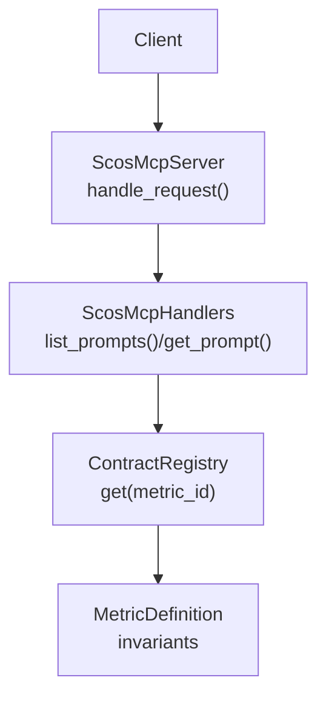
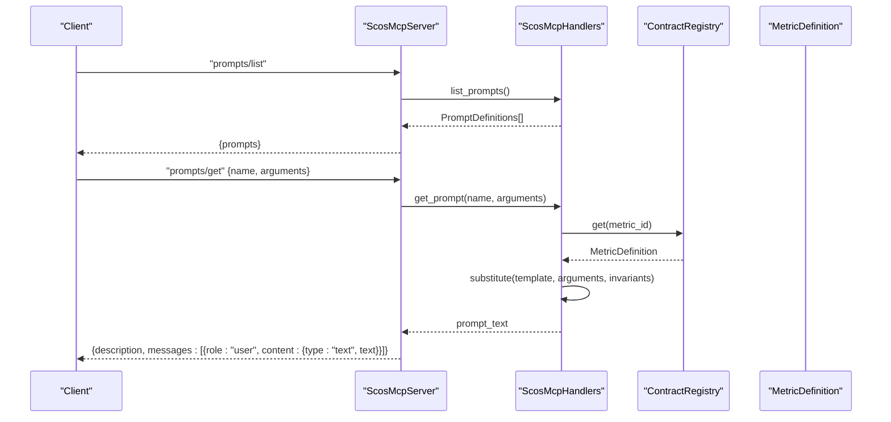
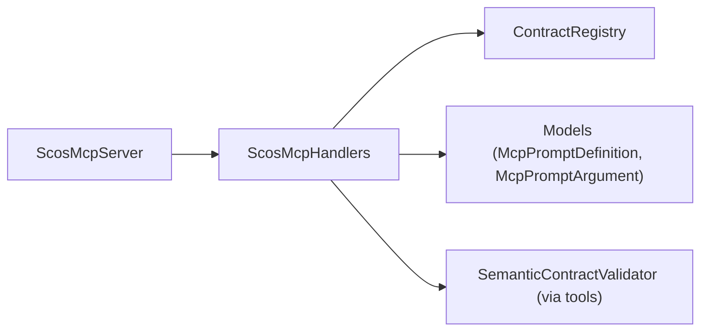

# Prompts API

<cite>
**Referenced Files in This Document**
- [handlers.py](file://semantic_reliability/mcp/handlers.py)
- [server.py](file://semantic_reliability/mcp/server.py)
- [models.py](file://semantic_reliability/mcp/models.py)
- [registry.py](file://semantic_reliability/mcp/registry.py)
- [test_mcp_server.py](file://tests/test_mcp_server.py)
- [adapters.py](file://semantic_reliability/benchmark/adapters.py)
- [protocol.py](file://semantic_reliability/benchmark/protocol.py)
- [agent.py](file://demo/agent.py)
</cite>

## Table of Contents
1. [Introduction](#introduction)
2. [Project Structure](#project-structure)
3. [Core Components](#core-components)
4. [Architecture Overview](#architecture-overview)
5. [Detailed Component Analysis](#detailed-component-analysis)
6. [Dependency Analysis](#dependency-analysis)
7. [Performance Considerations](#performance-considerations)
8. [Troubleshooting Guide](#troubleshooting-guide)
9. [Conclusion](#conclusion)
10. [Appendices](#appendices)

## Introduction
This document explains the MCP prompts API for the SCOS (Semantic Contracts for Operational Semantics) system, focusing on the prompts/list and prompts/get endpoints. It covers prompt templates, parameter substitution, message generation, integration with the semantic analysis workflow, and guidance for creating custom prompts. It also provides examples of how prompts are used within agent workflows and AI system integrations.

## Project Structure
The prompts API is implemented as part of the MCP server layer:
- Server routing and JSON-RPC handling for prompts/list and prompts/get
- Handlers that define available prompts and generate prompt messages
- Models that describe prompt definitions and arguments
- Registry integration to resolve metric contracts and invariants at runtime

**Diagram sources**
- [server.py:151-170](file://semantic_reliability/mcp/server.py#L151-L170)
- [handlers.py:355-408](file://semantic_reliability/mcp/handlers.py#L355-L408)
- [registry.py:39-45](file://semantic_reliability/mcp/registry.py#L39-L45)

**Section sources**
- [server.py:151-170](file://semantic_reliability/mcp/server.py#L151-L170)
- [handlers.py:355-408](file://semantic_reliability/mcp/handlers.py#L355-L408)
- [registry.py:39-45](file://semantic_reliability/mcp/registry.py#L39-L45)

## Core Components
- ScosMcpServer: Implements JSON-RPC methods including prompts/list and prompts/get, validates parameters, and returns standardized responses.
- ScosMcpHandlers: Declares available prompts and generates prompt text by substituting parameters into templates and injecting metric invariants.
- Models: Define structures for prompt definitions and arguments.
- ContractRegistry: Provides access to metric definitions and their invariants used during prompt generation.

Key responsibilities:
- prompts/list: Returns a list of available prompt definitions with names, descriptions, and required arguments.
- prompts/get: Resolves a named prompt, validates required arguments, substitutes parameters, injects contract invariants, and returns a user message ready for LLM consumption.

**Section sources**
- [server.py:151-170](file://semantic_reliability/mcp/server.py#L151-L170)
- [handlers.py:355-408](file://semantic_reliability/mcp/handlers.py#L355-L408)
- [models.py:31-40](file://semantic_reliability/mcp/models.py#L31-L40)
- [registry.py:39-45](file://semantic_reliability/mcp/registry.py#L39-L45)

## Architecture Overview
The prompts API integrates with the broader semantic analysis workflow by embedding metric invariants directly into generated prompts. This ensures that LLM-generated SQL adheres to declared business rules before execution.

**Diagram sources**
- [server.py:151-170](file://semantic_reliability/mcp/server.py#L151-L170)
- [handlers.py:355-408](file://semantic_reliability/mcp/handlers.py#L355-L408)
- [registry.py:39-45](file://semantic_reliability/mcp/registry.py#L39-L45)

## Detailed Component Analysis

### prompts/list Endpoint
- Purpose: Enumerate available prompts with metadata and argument schemas.
- Behavior: Delegates to handlers.list_prompts(), which returns a list of McpPromptDefinition objects.
- Response format: JSON object containing an array of prompt definitions.

Usage notes:
- Clients can use this endpoint to discover supported prompts and validate required arguments before calling prompts/get.

**Section sources**
- [server.py:151-153](file://semantic_reliability/mcp/server.py#L151-L153)
- [handlers.py:355-374](file://semantic_reliability/mcp/handlers.py#L355-L374)
- [models.py:31-40](file://semantic_reliability/mcp/models.py#L31-L40)

### prompts/get Endpoint
- Purpose: Generate a fully substituted prompt message for a given prompt name and arguments.
- Behavior:
  - Validates presence of required arguments.
  - Resolves metric definition via registry when needed (e.g., to fetch invariants).
  - Substitutes parameters into the prompt template.
  - Injects metric invariants into the prompt text.
  - Returns a standardized response with a user message containing the generated prompt text.

Parameter substitution and message generation:
- scos_generate_sql_guidance:
  - Required arguments: metric_id, user_intent.
  - Template behavior: Builds a user-facing instruction that includes the target metric ID, user intent, and the full set of invariants from the metric definition. Ensures the LLM is guided to produce SQL that respects reporting grain and population filters.
- scos_repair_contract_violation:
  - Required arguments: metric_id, failed_sql, violations.
  - Template behavior: Produces a repair instruction that includes the failing SQL and detected violations, directing the LLM to regenerate compliant SQL without silent rewrites.

Error handling:
- Missing required arguments result in a JSON-RPC error with code -32602.
- Unknown prompt names raise an error indicating the prompt is not recognized.

**Section sources**
- [server.py:155-170](file://semantic_reliability/mcp/server.py#L155-L170)
- [handlers.py:376-408](file://semantic_reliability/mcp/handlers.py#L376-L408)
- [registry.py:39-45](file://semantic_reliability/mcp/registry.py#L39-L45)

### Prompt Templates and Parameter Substitution
- Templates are defined within handlers.get_prompt() for each prompt name.
- Parameters are extracted from the arguments dict and validated.
- Invariant injection occurs by resolving the metric definition and serializing its invariants into the prompt text.
- The resulting prompt text is wrapped in a user message with type "text".

Complexity considerations:
- Prompt generation is O(1) relative to the number of invariants; complexity scales with the size of the serialized invariants payload.
- No external network calls are made during prompt generation; all data is resolved locally via the registry.

**Section sources**
- [handlers.py:376-408](file://semantic_reliability/mcp/handlers.py#L376-L408)
- [models.py:31-40](file://semantic_reliability/mcp/models.py#L31-L40)

### Integration with Semantic Analysis Workflow
Prompts are designed to enforce semantic correctness by embedding metric invariants directly into LLM instructions. This aligns with the broader workflow where agents:
- Retrieve contracts and invariants via tools/resources.
- Validate candidate SQL against invariants using validation tools.
- Use prompts to guide generation and repair processes.

Example integration patterns:
- Agent-driven SQL generation:
  - System prompt instructs the agent to consult contracts and validate SQL before finalizing output.
  - If conflicts or missing contracts are detected, the agent abstains or requests clarification.
- Repair loop:
  - When validation fails, the agent uses the repair prompt to regenerate SQL that satisfies all invariants.

**Section sources**
- [adapters.py:119-126](file://semantic_reliability/benchmark/adapters.py#L119-L126)
- [protocol.py:48-67](file://semantic_reliability/benchmark/protocol.py#L48-L67)

### Creating Custom Prompts
To add a new prompt:
1. Define a new McpPromptDefinition in handlers.list_prompts():
   - Provide a unique name, description, and argument schema (names, descriptions, required flags).
2. Implement logic in handlers.get_prompt():
   - Handle the new prompt name branch.
   - Validate required arguments.
   - Optionally resolve metric definitions to inject invariants or other context.
   - Return a string template with parameter substitution and invariant injection.
3. Ensure clients can discover and call the new prompt via prompts/list and prompts/get.

Best practices:
- Keep prompts concise and explicit about constraints.
- Always include metric-specific invariants to prevent hallucinated queries.
- Avoid silent rewrites; instruct the LLM to regenerate compliant SQL explicitly.
- Validate inputs early to fail fast with clear errors.

**Section sources**
- [handlers.py:355-408](file://semantic_reliability/mcp/handlers.py#L355-L408)
- [models.py:31-40](file://semantic_reliability/mcp/models.py#L31-L40)

### Examples of Prompt Usage in Agent Workflows
- Guided SQL generation:
  - Use scos_generate_sql_guidance to provide the LLM with metric invariants and user intent, ensuring generated SQL respects population filters and reporting grain.
- Violation repair:
  - After validation failure, use scos_repair_contract_violation to supply failing SQL and violation details, prompting the LLM to regenerate compliant SQL.

Integration pattern example:
- A benchmark adapter sets a system prompt that requires the agent to call tools to read contracts and validate SQL. If the agent cannot resolve a unique contract or encounters conflicts, it abstains rather than generating unsafe SQL.

**Section sources**
- [adapters.py:119-126](file://semantic_reliability/benchmark/adapters.py#L119-L126)
- [agent.py:21-85](file://demo/agent.py#L21-L85)

## Dependency Analysis
The prompts API depends on:
- ContractRegistry for resolving metric definitions and invariants.
- SemanticContractValidator indirectly through tool flows that inform prompt usage (repair prompts rely on validation results).
- Models for structured prompt definitions and arguments.

**Diagram sources**
- [server.py:151-170](file://semantic_reliability/mcp/server.py#L151-L170)
- [handlers.py:355-408](file://semantic_reliability/mcp/handlers.py#L355-L408)
- [registry.py:39-45](file://semantic_reliability/mcp/registry.py#L39-L45)
- [models.py:31-40](file://semantic_reliability/mcp/models.py#L31-L40)

**Section sources**
- [server.py:151-170](file://semantic_reliability/mcp/server.py#L151-L170)
- [handlers.py:355-408](file://semantic_reliability/mcp/handlers.py#L355-L408)
- [registry.py:39-45](file://semantic_reliability/mcp/registry.py#L39-L45)
- [models.py:31-40](file://semantic_reliability/mcp/models.py#L31-L40)

## Performance Considerations
- Prompt generation is lightweight and local; performance is dominated by registry resolution and serialization of invariants.
- For high-throughput scenarios, consider caching metric definitions if repeated lookups occur frequently.
- Avoid overly large invariants payloads; keep metric definitions concise to minimize prompt size and token usage.

[No sources needed since this section provides general guidance]

## Troubleshooting Guide
Common issues and resolutions:
- Missing required arguments:
  - Symptom: JSON-RPC error -32602 with message indicating invalid params.
  - Resolution: Ensure prompts/get includes all required arguments as defined in the prompt’s argument schema.
- Unknown prompt name:
  - Symptom: Error indicating the prompt is not recognized.
  - Resolution: Verify the prompt name exists in prompts/list and matches exactly.
- Unauthorized domain access:
  - Symptom: Access denied errors when resolving metrics outside allowed domains.
  - Resolution: Configure allowed_domains appropriately or adjust metric metadata/domain tags.

Validation-related behaviors:
- AST complexity limits and payload size checks apply to tool calls; while not directly part of prompts, these constraints influence the overall workflow and may affect prompt usage when guiding SQL generation.

**Section sources**
- [server.py:155-170](file://semantic_reliability/mcp/server.py#L155-L170)
- [handlers.py:376-408](file://semantic_reliability/mcp/handlers.py#L376-L408)
- [test_mcp_server.py:170-196](file://tests/test_mcp_server.py#L170-L196)

## Conclusion
The MCP prompts API provides a robust mechanism for generating context-aware prompts that embed metric invariants, ensuring LLM-generated SQL adheres to declared business rules. By integrating prompts with tools and resources, agents can reliably generate, validate, and repair SQL within a governed workflow. Custom prompts can be added by extending the handler logic and defining appropriate argument schemas, enabling flexible and secure integration with AI systems.

[No sources needed since this section summarizes without analyzing specific files]

## Appendices

### API Reference Summary
- prompts/list:
  - Method: "prompts/list"
  - Params: {}
  - Response: {prompts: [McpPromptDefinition...]}
- prompts/get:
  - Method: "prompts/get"
  - Params: {name: string, arguments: {metric_id?: string, user_intent?: string, failed_sql?: string, violations?: string}}
  - Response: {description: string, messages: [{role: "user", content: {type: "text", text: string}}]}

**Section sources**
- [server.py:151-170](file://semantic_reliability/mcp/server.py#L151-L170)
- [handlers.py:355-408](file://semantic_reliability/mcp/handlers.py#L355-L408)
- [models.py:31-40](file://semantic_reliability/mcp/models.py#L31-L40)