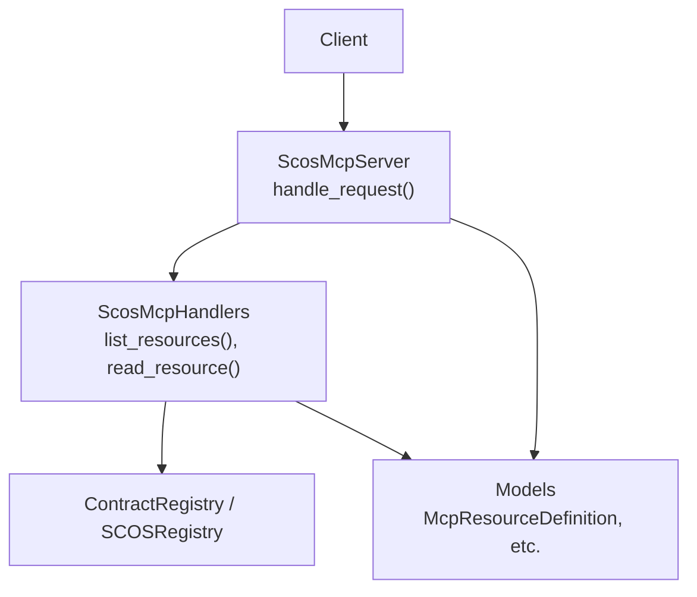
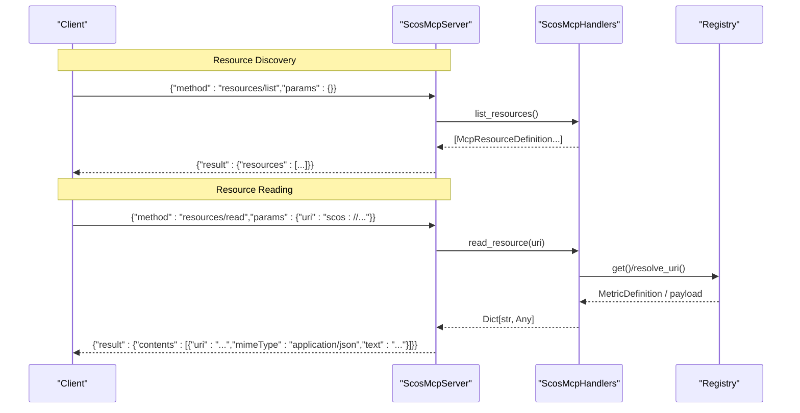
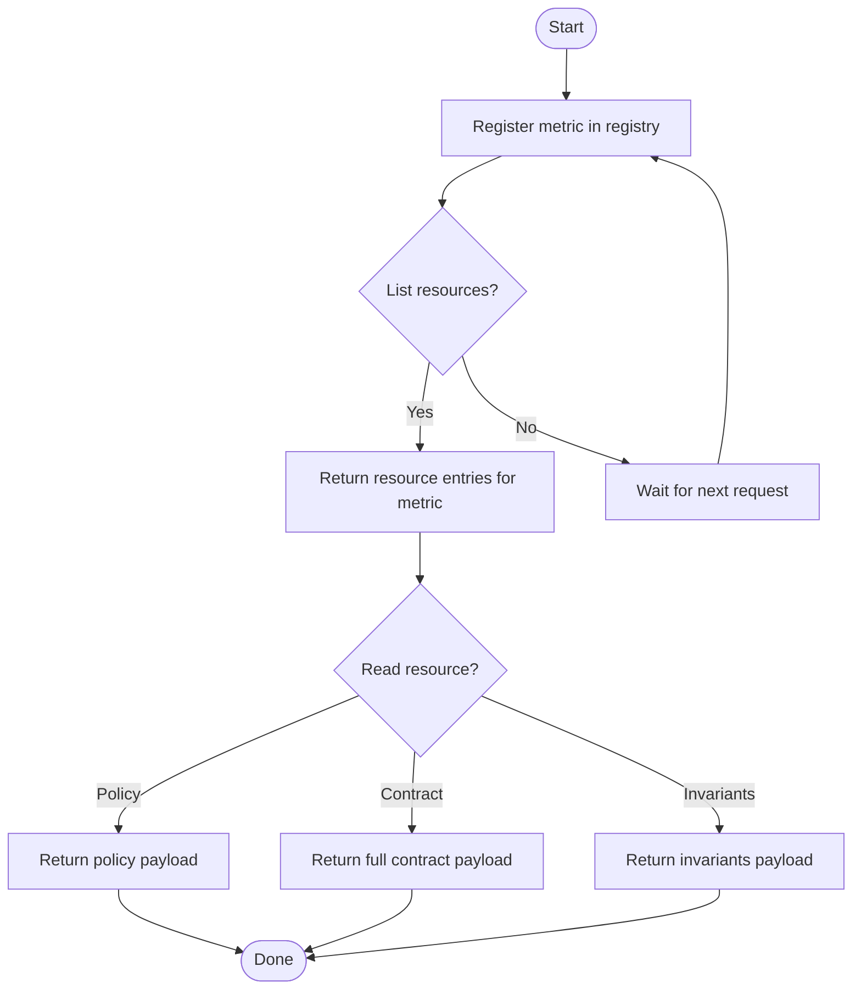
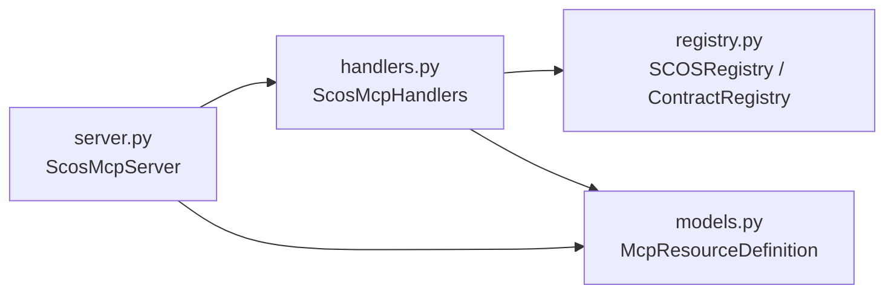

# Resources API

<cite>
**Referenced Files in This Document**
- [server.py](file://semantic_reliability/mcp/server.py)
- [handlers.py](file://semantic_reliability/mcp/handlers.py)
- [models.py](file://semantic_reliability/mcp/models.py)
- [registry.py](file://semantic_reliability/mcp/registry.py)
- [test_mcp_server.py](file://tests/test_mcp_server.py)
- [contract.yaml](file://benchmark_corpus/dev/net_revenue/contract.yaml)
- [net_revenue.yaml](file://examples/metrics/net_revenue.yaml)
</cite>

## Table of Contents
1. [Introduction](#introduction)
2. [Project Structure](#project-structure)
3. [Core Components](#core-components)
4. [Architecture Overview](#architecture-overview)
5. [Detailed Component Analysis](#detailed-component-analysis)
6. [Dependency Analysis](#dependency-analysis)
7. [Performance Considerations](#performance-considerations)
8. [Troubleshooting Guide](#troubleshooting-guide)
9. [Conclusion](#conclusion)
10. [Appendices](#appendices)

## Introduction
This document describes the Model Context Protocol (MCP) resources API implemented by the SCOS server, focusing on the resources/list and resources/read endpoints. It explains resource URIs, content types, data formats, discovery, reading operations, error handling, lifecycle, caching strategies, and performance considerations. It also provides examples for accessing contracts, metrics, and other managed resources through the protocol.

## Project Structure
The MCP resources API is implemented across a small set of modules:
- Server entrypoint that routes JSON-RPC methods to handlers
- Handlers that implement business logic for listing and reading resources
- Models that define request/response shapes and metadata
- Registry utilities that resolve scos:// URIs to contract definitions

**Diagram sources**
- [server.py:16-180](file://semantic_reliability/mcp/server.py#L16-L180)
- [handlers.py:19-351](file://semantic_reliability/mcp/handlers.py#L19-L351)
- [registry.py:10-70](file://semantic_reliability/mcp/registry.py#L10-L70)
- [models.py:18-40](file://semantic_reliability/mcp/models.py#L18-L40)

**Section sources**
- [server.py:16-180](file://semantic_reliability/mcp/server.py#L16-L180)
- [handlers.py:19-351](file://semantic_reliability/mcp/handlers.py#L19-L351)
- [registry.py:10-70](file://semantic_reliability/mcp/registry.py#L10-L70)
- [models.py:18-40](file://semantic_reliability/mcp/models.py#L18-L40)

## Core Components
- ScosMcpServer: Implements JSON-RPC 2.0 routing for MCP methods including resources/list and resources/read. Declares capabilities indicating no subscription or listChanged notifications for resources.
- ScosMcpHandlers: Provides list_resources() and read_resource(uri), enforcing domain authorization and returning structured payloads.
- Models: Define McpResourceDefinition with uri, name, description, and mimeType.
- Registry: Offers URI resolution for scos:// URIs and supports both ContractRegistry and SCOSRegistry patterns.

Key responsibilities:
- Discovery: List available resources via resources/list.
- Reading: Read resource contents via resources/read with a scos:// URI.
- Authorization: Enforce allowed domains per metric/resource.
- Error handling: Return standardized JSON-RPC errors for invalid requests and not-found resources.

**Section sources**
- [server.py:76-149](file://semantic_reliability/mcp/server.py#L76-L149)
- [handlers.py:291-351](file://semantic_reliability/mcp/handlers.py#L291-L351)
- [models.py:24-29](file://semantic_reliability/mcp/models.py#L24-L29)
- [registry.py:47-70](file://semantic_reliability/mcp/registry.py#L47-L70)

## Architecture Overview
The resources API follows a simple request-response flow over JSON-RPC 2.0. The server validates the method and parameters, delegates to handlers, and returns either a success envelope or an error envelope.

**Diagram sources**
- [server.py:130-149](file://semantic_reliability/mcp/server.py#L130-L149)
- [handlers.py:291-351](file://semantic_reliability/mcp/handlers.py#L291-L351)
- [registry.py:47-70](file://semantic_reliability/mcp/registry.py#L47-L70)

## Detailed Component Analysis

### Resource Discovery: resources/list
- Endpoint: JSON-RPC method resources/list with empty params.
- Behavior: Returns all discoverable resources, including:
  - A policy resource: scos://policies/semantic-gate/1.0
  - For each registered metric (subject to domain authorization):
    - scos://contracts/{domain}/{metric_id}/{version}
    - scos://contracts/{domain}/{metric_id}/{version}/invariants
- Response format: Array of McpResourceDefinition objects with uri, name, description, and mimeType.
- Domain scoping: Only metrics whose domain is authorized are listed.

Example response shape (conceptual):
- resources: [{ uri, name, description, mimeType }, ...]

**Section sources**
- [server.py:130-132](file://semantic_reliability/mcp/server.py#L130-L132)
- [handlers.py:291-313](file://semantic_reliability/mcp/handlers.py#L291-L313)
- [models.py:24-29](file://semantic_reliability/mcp/models.py#L24-L29)

### Resource Reading: resources/read
- Endpoint: JSON-RPC method resources/read with params.uri.
- Supported URIs:
  - scos://policies/semantic-gate/1.0
  - scos://contracts/{domain}/{metric_id}/{version}
  - scos://contracts/{domain}/{metric_id}/{version}/invariants
- Behavior:
  - Policy resource returns enforcement policy metadata.
  - Contract resource returns full metric definition and version.
  - Invariants-only resource returns only the invariants structure.
- Domain authorization: Access denied if the caller’s scope excludes the metric’s domain.
- Content type: All responses use mimeType application/json; text contains a JSON stringified payload.

Response shape:
- contents: [{ uri, mimeType: "application/json", text: "<JSON string>" }]

Error handling:
- Missing uri parameter returns JSON-RPC -32602.
- Unknown or unsupported URI raises ValueError, mapped to -32602.
- Unauthorized access returns an error object within the payload for contract reads.

**Section sources**
- [server.py:134-149](file://semantic_reliability/mcp/server.py#L134-L149)
- [handlers.py:315-351](file://semantic_reliability/mcp/handlers.py#L315-L351)
- [models.py:24-29](file://semantic_reliability/mcp/models.py#L24-L29)

### Resource URIs and Data Formats
- Base scheme: scos://
- Policy resource:
  - URI: scos://policies/semantic-gate/1.0
  - Payload includes policy_version, strict_mode_default, allowed_severities, blocking_severities.
- Contract resources:
  - URI: scos://contracts/{domain}/{metric_id}/{version}
  - Payload includes uri, metric_id, version, and a full contract object.
- Invariants-only resource:
  - URI: scos://contracts/{domain}/{metric_id}/{version}/invariants
  - Payload includes uri, metric_id, and invariants map.

Data model references:
- McpResourceDefinition defines the resource metadata returned by list.
- Contract payloads derive from MetricDefinition serialization.

Examples of contract structures can be found in example YAML files used by the compiler and tests.

**Section sources**
- [handlers.py:291-351](file://semantic_reliability/mcp/handlers.py#L291-L351)
- [models.py:24-29](file://semantic_reliability/mcp/models.py#L24-L29)
- [contract.yaml:1-19](file://benchmark_corpus/dev/net_revenue/contract.yaml#L1-L19)
- [net_revenue.yaml:1-22](file://examples/metrics/net_revenue.yaml#L1-L22)

### Resource Lifecycle
- Creation: Resources are discovered dynamically based on registered metrics at runtime. Each metric yields two resources (full contract and invariants-only).
- Availability: New metrics become visible after registration in the underlying registry.
- Deletion: Removing a metric from the registry removes its associated resources from subsequent list calls.
- Versioning: Resources include a version field for contracts; clients should handle version changes gracefully.

Lifecycle diagram:

[No sources needed since this diagram shows conceptual workflow, not actual code structure]

### Caching Strategies
- Handler-level caching: None explicitly implemented for resource reads; reads resolve directly against the registry on each call.
- Registry-level caching:
  - SCOSRegistry maintains in-memory caches for loaded metrics and raw definitions to avoid repeated file parsing.
  - ContractRegistry (used by the server) exposes contracts for iteration and lookup; caching behavior depends on its implementation.
- Implication: Frequent reads may incur registry lookups; consider client-side caching for stable resources like policies and contracts.

**Section sources**
- [registry.py:13-17](file://semantic_reliability/mcp/registry.py#L13-L17)
- [registry.py:19-34](file://semantic_reliability/mcp/registry.py#L19-L34)
- [handlers.py:291-351](file://semantic_reliability/mcp/handlers.py#L291-L351)

### Performance Considerations
- No subscriptions: The server declares resources capability without subscribe or listChanged, so clients must poll resources/list when necessary.
- Payload size limits: The server enforces a maximum request payload size; large resource lists should be handled efficiently by clients.
- Authorization checks: Domain authorization is performed per resource read; minimize unnecessary reads for unauthorized scopes.
- AST complexity: While not part of resources, related tool validations enforce limits on SQL complexity; similar constraints apply to overall system throughput.

**Section sources**
- [server.py:22-23](file://semantic_reliability/mcp/server.py#L22-L23)
- [server.py:76-89](file://semantic_reliability/mcp/server.py#L76-L89)
- [handlers.py:29-33](file://semantic_reliability/mcp/handlers.py#L29-L33)

## Dependency Analysis
The resources API depends on:
- Server routing and JSON-RPC framing
- Handler logic for resource enumeration and retrieval
- Registry abstractions for metric definitions and URI resolution
- Models for consistent resource metadata

**Diagram sources**
- [server.py:16-180](file://semantic_reliability/mcp/server.py#L16-L180)
- [handlers.py:19-351](file://semantic_reliability/mcp/handlers.py#L19-L351)
- [registry.py:10-70](file://semantic_reliability/mcp/registry.py#L10-L70)
- [models.py:18-40](file://semantic_reliability/mcp/models.py#L18-L40)

**Section sources**
- [server.py:16-180](file://semantic_reliability/mcp/server.py#L16-L180)
- [handlers.py:19-351](file://semantic_reliability/mcp/handlers.py#L19-L351)
- [registry.py:10-70](file://semantic_reliability/mcp/registry.py#L10-L70)
- [models.py:18-40](file://semantic_reliability/mcp/models.py#L18-L40)

## Performance Considerations
- Polling strategy: Since listChanged is disabled, clients should cache resource listings and refresh periodically or on demand.
- Selective reads: Use resources/list to discover only needed resources before calling resources/read to reduce network overhead.
- Domain scoping: Configure allowed_domains to limit exposure and reduce validation overhead.
- Client-side caching: Cache stable resources such as policies and contracts to avoid repeated reads.

[No sources needed since this section provides general guidance]

## Troubleshooting Guide
Common issues and resolutions:
- Missing uri parameter:
  - Symptom: JSON-RPC error -32602 with message about missing 'uri'.
  - Resolution: Ensure resources/read includes a valid uri in params.
- Unsupported URI:
  - Symptom: JSON-RPC error -32602 with message about resource not found.
  - Resolution: Verify URI format matches supported patterns (policy or contracts).
- Access denied:
  - Symptom: Error object in payload indicating access denied for resource.
  - Resolution: Adjust allowed_domains or caller identity to include the metric’s domain.
- Empty resource list:
  - Symptom: resources/list returns no contract resources.
  - Resolution: Ensure metrics are registered in the underlying registry and have valid domain metadata.

Validation references:
- Error mapping and parameter validation are enforced in the server’s request handler.
- Tests demonstrate expected error codes and behaviors for invalid requests and domain scoping.

**Section sources**
- [server.py:134-149](file://semantic_reliability/mcp/server.py#L134-L149)
- [handlers.py:315-351](file://semantic_reliability/mcp/handlers.py#L315-L351)
- [test_mcp_server.py:170-181](file://tests/test_mcp_server.py#L170-L181)
- [test_mcp_server.py:141-168](file://tests/test_mcp_server.py#L141-L168)

## Conclusion
The MCP resources API provides a clean, JSON-RPC-based interface for discovering and reading SCOS-managed resources. It supports policy and contract resources with well-defined URIs, consistent JSON content types, and robust error handling. Domain authorization ensures secure access, while registry-backed discovery keeps resources aligned with the current metric catalog. Clients should adopt polling with caching to optimize performance and reliability.

[No sources needed since this section summarizes without analyzing specific files]

## Appendices

### Example Requests and Responses

- Discover resources:
  - Request: {"jsonrpc":"2.0","id":1,"method":"resources/list","params":{}}
  - Response: {"result":{"resources":[{"uri":"scos://policies/semantic-gate/1.0","name":"...","description":"...","mimeType":"application/json"}, ...]}}

- Read policy:
  - Request: {"jsonrpc":"2.0","id":2,"method":"resources/read","params":{"uri":"scos://policies/semantic-gate/1.0"}}
  - Response: {"result":{"contents":[{"uri":"scos://policies/semantic-gate/1.0","mimeType":"application/json","text":"{...}"}]}}

- Read contract:
  - Request: {"jsonrpc":"2.0","id":3,"method":"resources/read","params":{"uri":"scos://contracts/finance/net_revenue/1.0.0"}}
  - Response: {"result":{"contents":[{"uri":"scos://contracts/finance/net_revenue/1.0.0","mimeType":"application/json","text":"{...}"}]}}

- Read invariants-only:
  - Request: {"jsonrpc":"2.0","id":4,"method":"resources/read","params":{"uri":"scos://contracts/finance/net_revenue/1.0.0/invariants"}}
  - Response: {"result":{"contents":[{"uri":"scos://contracts/finance/net_revenue/1.0.0/invariants","mimeType":"application/json","text":"{...}"}]}}

[No sources needed since this section provides conceptual examples]