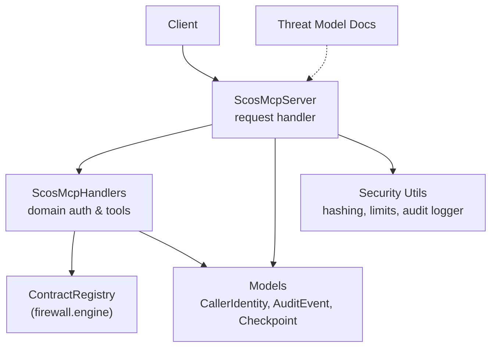
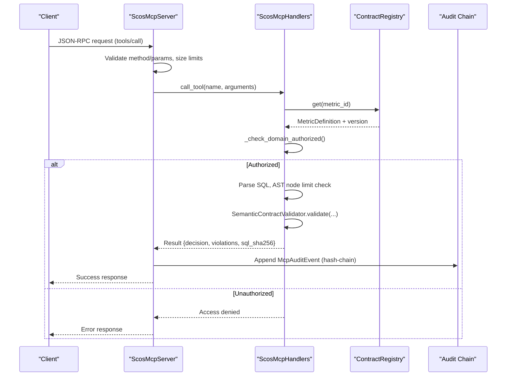
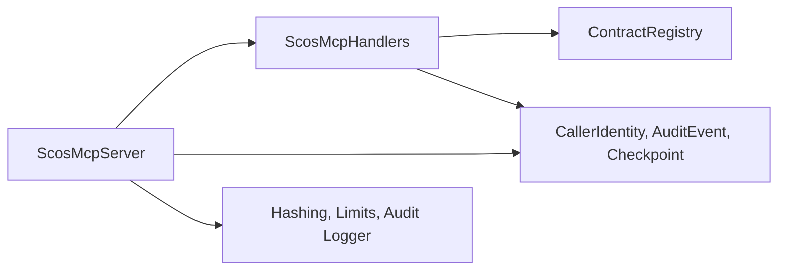

# Security Model and Authentication

<cite>
**Referenced Files in This Document**
- [security.py](file://semantic_reliability/mcp/security.py)
- [server.py](file://semantic_reliability/mcp/server.py)
- [handlers.py](file://semantic_reliability/mcp/handlers.py)
- [models.py](file://semantic_reliability/mcp/models.py)
- [engine.py](file://semantic_reliability/firewall/engine.py)
- [MCP_SECURITY_AND_THREAT_MODEL.md](file://docs/MCP_SECURITY_AND_THREAT_MODEL.md)
- [test_mcp_server.py](file://tests/test_mcp_server.py)
</cite>

## Table of Contents
1. Introduction
2. Project Structure
3. Core Components
4. Architecture Overview
5. Detailed Component Analysis
6. Dependency Analysis
7. Performance Considerations
8. Troubleshooting Guide
9. Conclusion
10. Appendices

## Introduction
This document explains the security model and authentication mechanisms for the SCOS Model Context Protocol (MCP) server. It covers:
- CallerIdentity validation and tenant scoping
- Domain-scoped access control
- Tenant isolation boundaries
- Tamper-evident audit hash-chaining and signed checkpoints
- Cryptographic signature verification
- Secure client implementation patterns
- Error handling for unauthorized access
- Production security best practices, threat mitigation, rate limiting considerations, and compliance requirements

The MCP server is intentionally read-only and never executes SQL against downstream systems. It validates queries against declared metric contracts and returns structured guidance without silent rewrites or direct data access.

## Project Structure
Security-related components are implemented across a small set of focused modules:
- Server entry point and request routing with JSON-RPC 2.0
- Handlers enforcing domain-scoped authorization and input limits
- Data models defining CallerIdentity, audit events, and checkpoints
- Security utilities for hashing, logging, and payload limits
- Firewall engine providing contract registry and policy evaluation
- Documentation describing threat model and tool permissions

**Diagram sources**
- [server.py:16-128](file://semantic_reliability/mcp/server.py#L16-L128)
- [handlers.py:19-287](file://semantic_reliability/mcp/handlers.py#L19-L287)
- [models.py:9-108](file://semantic_reliability/mcp/models.py#L9-L108)
- [security.py:1-57](file://semantic_reliability/mcp/security.py#L1-L57)
- [engine.py:19-44](file://semantic_reliability/firewall/engine.py#L19-L44)
- [MCP_SECURITY_AND_THREAT_MODEL.md:1-69](file://docs/MCP_SECURITY_AND_THREAT_MODEL.md#L1-L69)

**Section sources**
- [server.py:16-128](file://semantic_reliability/mcp/server.py#L16-L128)
- [handlers.py:19-287](file://semantic_reliability/mcp/handlers.py#L19-L287)
- [models.py:9-108](file://semantic_reliability/mcp/models.py#L9-L108)
- [security.py:1-57](file://semantic_reliability/mcp/security.py#L1-L57)
- [engine.py:19-44](file://semantic_reliability/firewall/engine.py#L19-L44)
- [MCP_SECURITY_AND_THREAT_MODEL.md:1-69](file://docs/MCP_SECURITY_AND_THREAT_MODEL.md#L1-L69)

## Core Components
- ScosMcpServer: JSON-RPC 2.0 request router, request size enforcement, audit chain creation, checkpoint management, and response formatting.
- ScosMcpHandlers: Tool implementations with domain-scoped authorization, AST complexity limits, and structured validation results.
- CallerIdentity: Authenticated caller context including client_id, tenant_id, allowed_domains, role, and authenticated flag.
- McpAuditEvent and AuditCheckpoint: Tamper-evident hash-chained audit records and HMAC-SHA256 signed checkpoints.
- Security utilities: SHA-256 hashing for SQL, payload and SQL length limits, and structured audit logging.
- ContractRegistry: Immutable in-memory registry of metric definitions used by handlers to enforce contracts.

Key responsibilities:
- Enforce strict input validation and size limits at the server boundary.
- Apply domain-scoped access control before any tool execution path.
- Record tamper-evident audit events with cryptographic chaining.
- Provide signed checkpoints to anchor chain state.
- Return standardized error codes and messages for invalid or unauthorized requests.

**Section sources**
- [server.py:16-221](file://semantic_reliability/mcp/server.py#L16-L221)
- [handlers.py:19-287](file://semantic_reliability/mcp/handlers.py#L19-L287)
- [models.py:9-108](file://semantic_reliability/mcp/models.py#L9-L108)
- [security.py:1-57](file://semantic_reliability/mcp/security.py#L1-L57)
- [engine.py:19-44](file://semantic_reliability/firewall/engine.py#L19-L44)

## Architecture Overview
The MCP server implements a layered security architecture:
- Transport layer: JSON-RPC 2.0 over stdio or external transport; request parsing and size checks.
- Authorization layer: CallerIdentity binding and domain-scoped filtering via handlers.
- Validation layer: AST parsing and complexity limits; semantic contract validation without execution.
- Audit layer: Hash-chained events and signed checkpoints for tamper evidence.
- Policy layer: Read-only tools that return decisions and remediation guidance.

**Diagram sources**
- [server.py:50-128](file://semantic_reliability/mcp/server.py#L50-L128)
- [handlers.py:101-240](file://semantic_reliability/mcp/handlers.py#L101-L240)
- [engine.py:19-44](file://semantic_reliability/firewall/engine.py#L19-L44)

## Detailed Component Analysis

### CallerIdentity and Tenant Isolation
- CallerIdentity carries client_id, tenant_id, allowed_domains, role, and authenticated status.
- The server binds each request to an active CallerIdentity; if none provided, defaults are used.
- Tenant isolation is enforced by passing tenant_id into audit events and by restricting tool access based on allowed_domains configured per server instance.

Practical implications:
- Each tenant’s requests are independently scoped and audited with tenant_id.
- Domain-scoped servers can be instantiated per business unit to restrict visibility to specific domains.

**Section sources**
- [models.py:9-16](file://semantic_reliability/mcp/models.py#L9-L16)
- [server.py:50-58](file://semantic_reliability/mcp/server.py#L50-L58)
- [server.py:110-126](file://semantic_reliability/mcp/server.py#L110-L126)

### Domain-Scoped Access Control
- Handlers enforce domain authorization using allowed_domains configuration.
- Tools filter metrics and resources by domain; unauthorized access returns explicit errors.
- Tests demonstrate domain scoping for listing metrics and denying access to out-of-scope contracts.

Best practices:
- Configure allowed_domains per deployment to isolate business units.
- Always validate domain authorization before returning sensitive metadata.

**Section sources**
- [handlers.py:25-33](file://semantic_reliability/mcp/handlers.py#L25-L33)
- [handlers.py:101-145](file://semantic_reliability/mcp/handlers.py#L101-L145)
- [handlers.py:291-351](file://semantic_reliability/mcp/handlers.py#L291-L351)
- [test_mcp_server.py:141-168](file://tests/test_mcp_server.py#L141-L168)

### Audit Hash-Chaining and Signed Checkpoints
- Every tools/call appends a McpAuditEvent with previous_event_hash linking to prior event; genesis hash anchors the chain.
- Event hashes are computed over canonical JSON fields excluding raw SQL; only sql_sha256 is recorded.
- Periodic AuditCheckpoints capture sequence_end, last_event_hash, and compute HMAC-SHA256 signatures using a signing key.
- Verification methods ensure chain integrity and checkpoint authenticity.

Operational notes:
- Use environment variable or explicit signing secret for checkpoint signatures.
- Verify chains after processing batches to detect tampering.

**Section sources**
- [server.py:109-126](file://semantic_reliability/mcp/server.py#L109-L126)
- [server.py:182-220](file://semantic_reliability/mcp/server.py#L182-L220)
- [models.py:43-108](file://semantic_reliability/mcp/models.py#L43-L108)
- [test_mcp_server.py:112-139](file://tests/test_mcp_server.py#L112-L139)

### Cryptographic Signature Verification
- Checkpoint signatures are HMAC-SHA256 over a canonical envelope including checkpoint_id, sequence_end, last_event_hash, timestamp, and key_id.
- Verification compares computed signature against stored checkpoint_signature and ensures sequence bounds match current audit log length.
- If no signing key is configured, signature generation raises an error to prevent weak configurations.

Production guidance:
- Store signing keys securely and rotate periodically.
- Validate checkpoints externally for compliance reporting.

**Section sources**
- [models.py:85-108](file://semantic_reliability/mcp/models.py#L85-L108)
- [server.py:182-220](file://semantic_reliability/mcp/server.py#L182-L220)

### Input Limits and Payload Protection
- Server enforces max_request_bytes on raw payloads.
- Handlers enforce MAX_SQL_CHARS and MAX_AST_NODES to prevent complex or oversized inputs.
- Security utilities provide additional payload and SQL length checks and structured audit logging with hashed SQL.

Mitigations:
- Reject oversized or overly complex queries early to reduce resource usage.
- Log only hashed SQL to avoid PII leakage.

**Section sources**
- [server.py:22-23](file://semantic_reliability/mcp/server.py#L22-L23)
- [handlers.py:22-23](file://semantic_reliability/mcp/handlers.py#L22-L23)
- [handlers.py:156-203](file://semantic_reliability/mcp/handlers.py#L156-L203)
- [security.py:16-34](file://semantic_reliability/mcp/security.py#L16-L34)

### Error Handling for Unauthorized Access
- Domain authorization failures return explicit “Access denied” responses.
- Invalid JSON-RPC requests map to standard error codes (-32600, -32601, -32602).
- Malformed SQL yields structured denial with violation details and no execution.

Client guidance:
- Inspect decision and violations to guide query correction.
- Handle domain-scoped errors by adjusting allowed_domains or requesting appropriate scopes.

**Section sources**
- [handlers.py:121-145](file://semantic_reliability/mcp/handlers.py#L121-L145)
- [handlers.py:174-175](file://semantic_reliability/mcp/handlers.py#L174-L175)
- [server.py:60-73](file://semantic_reliability/mcp/server.py#L60-L73)
- [test_mcp_server.py:170-196](file://tests/test_mcp_server.py#L170-L196)

### Secure Client Implementation Patterns
Recommended steps for secure clients:
- Authenticate and bind CallerIdentity with client_id, tenant_id, and allowed_domains.
- Enforce local payload size limits before sending requests.
- Respect domain scoping; only request metrics within authorized domains.
- Parse structured validation results and act on decisions (ALLOW, REQUIRE_REVIEW, DENY).
- Record and verify audit events locally if required for compliance.

Example flow:
- Initialize connection and negotiate protocol version.
- List metrics filtered by domain.
- Validate candidate SQL and iterate until compliant.
- Create and verify checkpoints periodically for audit anchoring.

**Section sources**
- [server.py:76-89](file://semantic_reliability/mcp/server.py#L76-L89)
- [handlers.py:37-97](file://semantic_reliability/mcp/handlers.py#L37-L97)
- [handlers.py:147-240](file://semantic_reliability/mcp/handlers.py#L147-L240)
- [test_mcp_server.py:68-89](file://tests/test_mcp_server.py#L68-L89)

### Threat Mitigation Strategies
- Spoofing: Bind requests to CallerIdentity and present signed protocol metadata.
- Tampering: Immutable registry and read-only tools; no write/update/patch endpoints.
- Repudiation: Hash-chained audit events and signed checkpoints.
- Information Disclosure: Hashed SQL in logs; no raw data returned.
- Denial of Service: Request size caps, SQL length limits, AST node ceilings.
- Elevation of Privilege: AST-based validation; no execution privileges; multi-statement/DML rejected.

**Section sources**
- [MCP_SECURITY_AND_THREAT_MODEL.md:18-28](file://docs/MCP_SECURITY_AND_THREAT_MODEL.md#L18-L28)
- [handlers.py:177-203](file://semantic_reliability/mcp/handlers.py#L177-L203)
- [server.py:22-23](file://semantic_reliability/mcp/server.py#L22-L23)

### Rate Limiting Considerations
- No built-in per-client rate limiter is implemented in the MCP server.
- Recommended production measures:
  - Deploy behind a gateway or reverse proxy with rate limiting and quotas.
  - Enforce per-tenant request budgets and throttling policies.
  - Monitor latency_ms in audit events to detect anomalies.
  - Combine with circuit breakers and backpressure controls.

[No sources needed since this section provides general guidance]

### Compliance Requirements
- Tamper-evident audit trails support regulatory audits and incident investigations.
- Signed checkpoints enable periodic attestation of chain integrity.
- Domain-scoped access aligns with least privilege principles.
- Avoidance of raw data exposure supports privacy regulations.

**Section sources**
- [server.py:182-220](file://semantic_reliability/mcp/server.py#L182-L220)
- [models.py:85-108](file://semantic_reliability/mcp/models.py#L85-L108)
- [MCP_SECURITY_AND_THREAT_MODEL.md:43-69](file://docs/MCP_SECURITY_AND_THREAT_MODEL.md#L43-L69)

## Dependency Analysis
The security model depends on clear separation between server routing, handler authorization, and immutable contract definitions.

**Diagram sources**
- [server.py:16-128](file://semantic_reliability/mcp/server.py#L16-L128)
- [handlers.py:19-287](file://semantic_reliability/mcp/handlers.py#L19-L287)
- [models.py:9-108](file://semantic_reliability/mcp/models.py#L9-L108)
- [security.py:1-57](file://semantic_reliability/mcp/security.py#L1-L57)
- [engine.py:19-44](file://semantic_reliability/firewall/engine.py#L19-L44)

**Section sources**
- [server.py:16-128](file://semantic_reliability/mcp/server.py#L16-L128)
- [handlers.py:19-287](file://semantic_reliability/mcp/handlers.py#L19-L287)
- [models.py:9-108](file://semantic_reliability/mcp/models.py#L9-L108)
- [security.py:1-57](file://semantic_reliability/mcp/security.py#L1-L57)
- [engine.py:19-44](file://semantic_reliability/firewall/engine.py#L19-L44)

## Performance Considerations
- Early rejection of oversized or overly complex SQL reduces CPU and memory usage.
- AST node counting prevents pathological queries from consuming resources.
- Structured audit logging uses minimal fields and hashed SQL to keep logs compact and safe.
- Latency tracking enables monitoring and alerting on slow paths.

[No sources needed since this section provides general guidance]

## Troubleshooting Guide
Common issues and resolutions:
- Invalid Request: Ensure JSON-RPC structure includes method and params as objects.
- Method Not Found: Only supported methods are initialize, tools/list, tools/call, resources/list, resources/read, prompts/list, prompts/get, notifications/initialized.
- Invalid Params: Validate required fields like metric_id and sql for tools.
- Access Denied: Confirm allowed_domains configuration and metric metadata domain alignment.
- Complexity Limit: Reduce AST complexity or split queries; respect MAX_AST_NODES.
- Audit Chain Verification Failures: Ensure no tampering occurred; regenerate checkpoints after verifying chain integrity.

**Section sources**
- [server.py:60-73](file://semantic_reliability/mcp/server.py#L60-L73)
- [server.py:175-180](file://semantic_reliability/mcp/server.py#L175-L180)
- [handlers.py:121-145](file://semantic_reliability/mcp/handlers.py#L121-L145)
- [handlers.py:156-203](file://semantic_reliability/mcp/handlers.py#L156-L203)
- [test_mcp_server.py:170-196](file://tests/test_mcp_server.py#L170-L196)

## Conclusion
The SCOS MCP server implements a robust, read-only security model centered on CallerIdentity validation, domain-scoped access control, tenant isolation, and tamper-evident auditing. By combining strict input limits, AST-based validation, and cryptographic hash-chaining with signed checkpoints, it mitigates common threats while supporting compliance and operational transparency. Production deployments should add rate limiting, secure key management, and external verification of audit chains to meet enterprise security and regulatory requirements.

[No sources needed since this section summarizes without analyzing specific files]

## Appendices

### API Methods and Security Behavior
- initialize: Returns server capabilities and protocol version; no sensitive data exposed.
- tools/list: Lists available tools; respects allowed_domains when exposing resources.
- tools/call: Executes domain-authorized tools with input validation and audit recording.
- resources/list/read: Provides policy and contract metadata; domain-scoped access enforced.
- prompts/list/get: Supplies guidance templates; no execution or data exposure.

**Section sources**
- [server.py:76-173](file://semantic_reliability/mcp/server.py#L76-L173)
- [handlers.py:37-97](file://semantic_reliability/mcp/handlers.py#L37-L97)
- [handlers.py:291-409](file://semantic_reliability/mcp/handlers.py#L291-L409)

### Example Test Cases for Security Behaviors
- Compliant SQL validation returns ALLOW with execution_performed false.
- Violation detection returns REQUIRE_REVIEW with detailed violations.
- Domain scoping filters metrics and denies unauthorized access.
- Audit chain verification and signed checkpoint creation/validation succeed.

**Section sources**
- [test_mcp_server.py:68-89](file://tests/test_mcp_server.py#L68-L89)
- [test_mcp_server.py:91-109](file://tests/test_mcp_server.py#L91-L109)
- [test_mcp_server.py:112-139](file://tests/test_mcp_server.py#L112-L139)
- [test_mcp_server.py:141-168](file://tests/test_mcp_server.py#L141-L168)