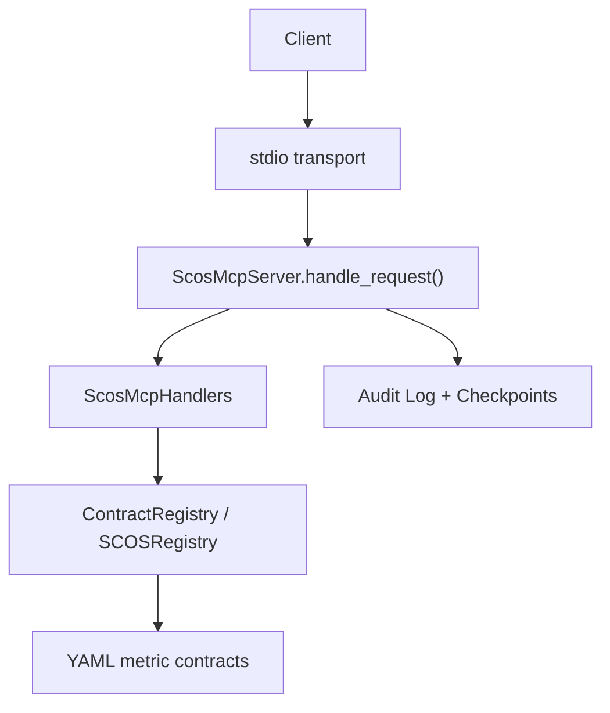
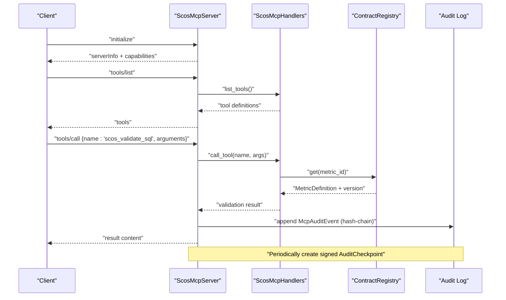
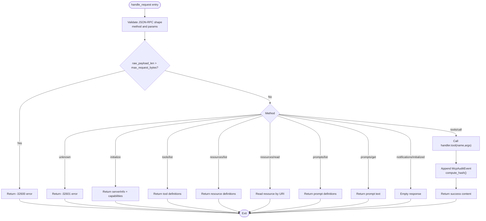
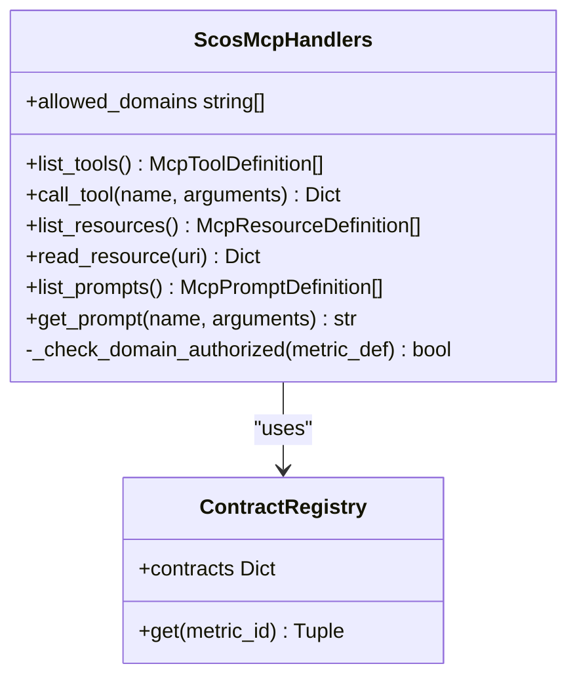
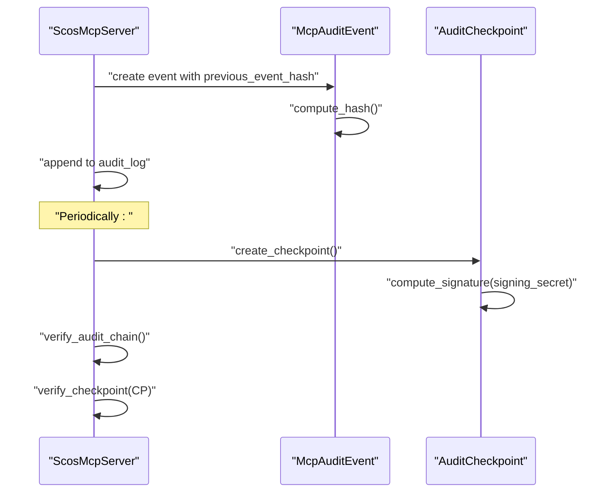
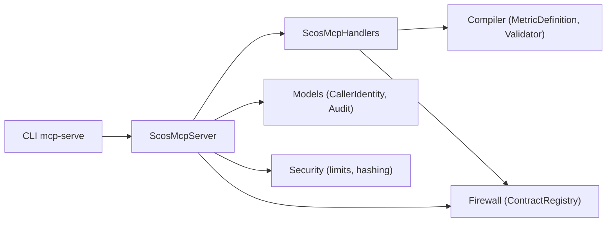

# Server Setup and Configuration

<cite>
**Referenced Files in This Document**
- [server.py](file://semantic_reliability/mcp/server.py)
- [handlers.py](file://semantic_reliability/mcp/handlers.py)
- [models.py](file://semantic_reliability/mcp/models.py)
- [security.py](file://semantic_reliability/mcp/security.py)
- [registry.py](file://semantic_reliability/mcp/registry.py)
- [engine.py](file://semantic_reliability/firewall/engine.py)
- [cli.py](file://semantic_reliability/cli.py)
- [README.md](file://README.md)
- [MCP_SECURITY_AND_THREAT_MODEL.md](file://docs/MCP_SECURITY_AND_THREAT_MODEL.md)
- [semantic_firewall_sidecar.yaml](file://deploy/k8s/semantic_firewall_sidecar.yaml)
- [test_mcp_server.py](file://tests/test_mcp_server.py)
</cite>

## Table of Contents
1. Introduction
2. Project Structure
3. Core Components
4. Architecture Overview
5. Detailed Component Analysis
6. Dependency Analysis
7. Performance Considerations
8. Troubleshooting Guide
9. Conclusion
10. Appendices

## Introduction
This document explains how to set up and configure the SCOS Model Context Protocol (MCP) server for production-grade, read-only semantic guidance over JSON-RPC 2.0. It focuses on the ScosMcpServer class initialization parameters, registry configuration, contract directory setup, domain restrictions, request size limits, signing secrets, environment variables, deployment options, integration patterns, connection handling via stdio, audit log management, security considerations, performance tuning, and monitoring capabilities.

## Project Structure
The MCP server is implemented under the mcp package with supporting components in firewall and CLI:
- ScosMcpServer: JSON-RPC 2.0 request handling, audit chain, checkpoints, and stdio transport
- ScosMcpHandlers: Tool/resource/prompt definitions and authorization enforcement
- Models: Caller identity, audit events, checkpoints, and validation results
- Security utilities: SQL hashing, payload limits, structured audit logging
- Registry abstractions: ContractRegistry (firewall) and SCOSRegistry (mcp)
- CLI: Command to start the MCP server and load contracts
- Deployment: Kubernetes sidecar example for related services

**Diagram sources**
- [server.py:50-180](file://semantic_reliability/mcp/server.py#L50-L180)
- [handlers.py:101-287](file://semantic_reliability/mcp/handlers.py#L101-L287)
- [engine.py:18-43](file://semantic_reliability/firewall/engine.py#L18-L43)
- [registry.py:10-71](file://semantic_reliability/mcp/registry.py#L10-L71)

**Section sources**
- [README.md:93-112](file://README.md#L93-L112)
- [cli.py:789-808](file://semantic_reliability/cli.py#L789-L808)

## Core Components
- ScosMcpServer: Initializes registry, allowed domains, max request bytes, and signing secret; handles initialize/tools/resources/prompts methods; enforces payload size; appends hash-chained audit events; creates signed checkpoints; provides stdio loop.
- ScosMcpHandlers: Exposes tools (list metrics, get contract, validate SQL, explain violation, probe status), resources (policy and per-metric contracts/invariants), and prompts; enforces domain authorization; applies AST-based complexity and syntax checks; returns decisions without executing SQL.
- Models: CallerIdentity for tenant/domain scoping; McpAuditEvent and AuditCheckpoint for tamper-evident logs; SqlValidationResult for tool responses.
- Security: Hashing SQL for logs, enforcing payload and SQL length limits, structured audit logger.
- Registry: ContractRegistry loads YAML contracts into memory; SCOSRegistry resolves URIs and lists metrics.

Key initialization parameters for ScosMcpServer:
- registry: Optional prebuilt ContractRegistry instance
- contract_dir: Optional path to a directory containing YAML metric contracts; if provided, a ContractRegistry is created from it
- allowed_domains: Optional list of domains to restrict access to metrics/resources
- max_request_bytes: Per-request payload size limit enforced before parsing
- signing_secret: Secret used to sign periodic AuditCheckpoints; falls back to SRE_AUDIT_SIGNING_KEY env var or a generated random value

Environment variables:
- SRE_AUDIT_SIGNING_KEY: Used by models and server for cryptographic checkpoint signatures

Deployment entry point:
- CLI command mcp-serve starts the server and loads contracts from a directory, then runs stdio mode

**Section sources**
- [server.py:25-48](file://semantic_reliability/mcp/server.py#L25-L48)
- [handlers.py:25-33](file://semantic_reliability/mcp/handlers.py#L25-L33)
- [models.py:9-15](file://semantic_reliability/mcp/models.py#L9-L15)
- [models.py:43-108](file://semantic_reliability/mcp/models.py#L43-L108)
- [security.py:16-57](file://semantic_reliability/mcp/security.py#L16-L57)
- [engine.py:18-43](file://semantic_reliability/firewall/engine.py#L18-L43)
- [registry.py:10-71](file://semantic_reliability/mcp/registry.py#L10-L71)
- [cli.py:789-808](file://semantic_reliability/cli.py#L789-L808)

## Architecture Overview
The MCP server exposes a read-only interface that validates and guides SQL generation against declared business invariants without executing queries. Requests are processed through a strict JSON-RPC 2.0 handler, which dispatches to handlers that enforce domain scoping and complexity limits. Every interaction is recorded as a hash-chained audit event, periodically anchored by signed checkpoints.

**Diagram sources**
- [server.py:50-180](file://semantic_reliability/mcp/server.py#L50-L180)
- [handlers.py:147-240](file://semantic_reliability/mcp/handlers.py#L147-L240)
- [engine.py:18-43](file://semantic_reliability/firewall/engine.py#L18-L43)
- [models.py:43-108](file://semantic_reliability/mcp/models.py#L43-L108)

## Detailed Component Analysis

### ScosMcpServer Initialization and Request Handling
- Initialization accepts registry or contract_dir; sets allowed_domains; configures max_request_bytes; derives signing_secret from parameter or environment; initializes empty audit_log and checkpoints.
- handle_request validates JSON-RPC structure, method presence, params type, and payload size; dispatches to initialize, tools/list, tools/call, resources/list, resources/read, prompts/list, prompts/get, notifications/initialized; maps errors to standard JSON-RPC codes.
- On successful tools/call, appends a McpAuditEvent with previous_event_hash and computes event_hash; returns content-wrapped result.
- create_checkpoint anchors current chain state and signs using signing_secret; verify_audit_chain and verify_checkpoint provide integrity verification.
- run_stdio reads lines from stdin, parses JSON, calls handle_request with raw_payload_len, writes responses to stdout.

**Diagram sources**
- [server.py:50-180](file://semantic_reliability/mcp/server.py#L50-L180)
- [server.py:182-220](file://semantic_reliability/mcp/server.py#L182-L220)
- [server.py:239-257](file://semantic_reliability/mcp/server.py#L239-L257)

**Section sources**
- [server.py:25-48](file://semantic_reliability/mcp/server.py#L25-L48)
- [server.py:50-180](file://semantic_reliability/mcp/server.py#L50-L180)
- [server.py:182-220](file://semantic_reliability/mcp/server.py#L182-L220)
- [server.py:239-257](file://semantic_reliability/mcp/server.py#L239-L257)

### ScosMcpHandlers: Tools, Resources, Prompts, and Authorization
- Domain authorization: _check_domain_authorized filters metrics based on allowed_domains; unauthorized access returns explicit denial messages without leaking existence.
- Tools:
  - scos_list_metrics: Lists metrics with domain, grain, owner, description; supports domain filter.
  - scos_get_contract: Returns canonical SQL, invariants, probes, dialect, version; domain check enforced.
  - scos_validate_sql: Enforces SQL length and AST node limits; parses SQL via sqlglot; validates against SemanticContractValidator; returns decision ALLOW/REQUIRE_REVIEW/DENY with violations and latency; never executes SQL.
  - scos_explain_violation: Provides remediation guidance for a specific rule without silent rewrites.
  - scos_get_probe_status: Returns active probes and health status for a metric.
- Resources:
  - Policy resource: scos://policies/semantic-gate/1.0
  - Contract resources: scos://contracts/{domain}/{metric_id}/{version} and invariants endpoint
- Prompts:
  - scos_generate_sql_guidance: Builds guidance including invariants for a metric and user intent.
  - scos_repair_contract_violation: Generates repair instructions given failed SQL and violations.

**Diagram sources**
- [handlers.py:19-33](file://semantic_reliability/mcp/handlers.py#L19-L33)
- [handlers.py:37-97](file://semantic_reliability/mcp/handlers.py#L37-L97)
- [handlers.py:101-287](file://semantic_reliability/mcp/handlers.py#L101-L287)
- [handlers.py:291-351](file://semantic_reliability/mcp/handlers.py#L291-L351)
- [handlers.py:355-409](file://semantic_reliability/mcp/handlers.py#L355-L409)
- [engine.py:18-43](file://semantic_reliability/firewall/engine.py#L18-L43)

**Section sources**
- [handlers.py:25-33](file://semantic_reliability/mcp/handlers.py#L25-L33)
- [handlers.py:37-97](file://semantic_reliability/mcp/handlers.py#L37-L97)
- [handlers.py:101-287](file://semantic_reliability/mcp/handlers.py#L101-L287)
- [handlers.py:291-351](file://semantic_reliability/mcp/handlers.py#L291-L351)
- [handlers.py:355-409](file://semantic_reliability/mcp/handlers.py#L355-L409)

### Audit Logging and Checkpointing
- Each tools/call appends an McpAuditEvent with sequence_num, timestamp_utc, method, tool_name, metric_id, tenant_id, domain, sql_sha256, decision, latency_ms, client_id, key_id, previous_event_hash, and computed event_hash.
- create_checkpoint captures last_event_hash and sequence_end, computes HMAC-SHA256 signature using signing_secret (or SRE_AUDIT_SIGNING_KEY), and stores in checkpoints.
- verify_audit_chain ensures each event references the correct previous hash and self-hashes match; verify_checkpoint validates signature and chain consistency.

**Diagram sources**
- [server.py:104-128](file://semantic_reliability/mcp/server.py#L104-L128)
- [server.py:182-220](file://semantic_reliability/mcp/server.py#L182-L220)
- [models.py:43-108](file://semantic_reliability/mcp/models.py#L43-L108)

**Section sources**
- [server.py:104-128](file://semantic_reliability/mcp/server.py#L104-L128)
- [server.py:182-220](file://semantic_reliability/mcp/server.py#L182-L220)
- [models.py:43-108](file://semantic_reliability/mcp/models.py#L43-L108)

### Environment Variables and Signing Secrets
- SRE_AUDIT_SIGNING_KEY: Required for generating and verifying AuditCheckpoint signatures; can be passed explicitly to server or resolved at runtime.
- The server uses this environment variable when signing_secret is not provided; models also rely on it for checkpoint signature computation.

**Section sources**
- [server.py:48](file://semantic_reliability/mcp/server.py#L48)
- [models.py:95-108](file://semantic_reliability/mcp/models.py#L95-L108)

### Connection Handling via stdio
- run_stdio reads JSON lines from stdin, parses them, enforces payload size, processes requests, and writes JSON responses to stdout with flush.
- Suitable for local MCP client integration and process-bound deployments where clients communicate via standard streams.

**Section sources**
- [server.py:239-257](file://semantic_reliability/mcp/server.py#L239-L257)

### Registry Configuration and Contract Directory Setup
- ContractRegistry loads YAML files recursively from a directory into memory; each file must contain a metric definition; versions are extracted from metadata.
- SCOSRegistry provides URN mapping and URI resolution for contracts and policies; useful for programmatic access to metric definitions and invariants.

**Section sources**
- [engine.py:18-43](file://semantic_reliability/firewall/engine.py#L18-L43)
- [registry.py:10-71](file://semantic_reliability/mcp/registry.py#L10-L71)

### Domain Restrictions and Tenant Scoping
- allowed_domains restricts access to metrics/resources by matching metric metadata domain; unauthorized access returns explicit denial without revealing metric existence.
- CallerIdentity binds client_id, tenant_id, role, and optional allowed_domains for per-request scoping.

**Section sources**
- [handlers.py:25-33](file://semantic_reliability/mcp/handlers.py#L25-L33)
- [models.py:9-15](file://semantic_reliability/mcp/models.py#L9-L15)

### Integration Patterns
- CLI-driven startup: Use sre mcp-serve --contracts <dir> to launch the server in stdio mode with contracts loaded from the specified directory.
- Programmatic instantiation: Create ContractRegistry with a contract_dir or pass a prebuilt registry to ScosMcpServer; optionally set allowed_domains and signing_secret; call run_stdio for stdio transport.
- Benchmark harness integration: The live benchmark constructs ScosMcpHandlers with a ContractRegistry and integrates with adapters for guided agent evaluation.

**Section sources**
- [cli.py:789-808](file://semantic_reliability/cli.py#L789-L808)
- [README.md:93-112](file://README.md#L93-L112)
- [cli.py:851-948](file://semantic_reliability/cli.py#L851-L948)

## Dependency Analysis
- ScosMcpServer depends on ContractRegistry (from firewall.engine), ScosMcpHandlers, and models (CallerIdentity, McpAuditEvent, AuditCheckpoint).
- ScosMcpHandlers depends on MetricDefinition and SemanticContractValidator from compiler modules, and ContractRegistry for metric lookups.
- Security utilities provide hashing and limits; audit logger emits structured events.
- CLI wires together ContractRegistry loading and server startup.

**Diagram sources**
- [server.py:9-13](file://semantic_reliability/mcp/server.py#L9-L13)
- [handlers.py:8-16](file://semantic_reliability/mcp/handlers.py#L8-L16)
- [engine.py:18-43](file://semantic_reliability/firewall/engine.py#L18-L43)
- [security.py:1-57](file://semantic_reliability/mcp/security.py#L1-L57)
- [cli.py:789-808](file://semantic_reliability/cli.py#L789-L808)

**Section sources**
- [server.py:9-13](file://semantic_reliability/mcp/server.py#L9-L13)
- [handlers.py:8-16](file://semantic_reliability/mcp/handlers.py#L8-L16)
- [engine.py:18-43](file://semantic_reliability/firewall/engine.py#L18-L43)
- [security.py:1-57](file://semantic_reliability/mcp/security.py#L1-L57)
- [cli.py:789-808](file://semantic_reliability/cli.py#L789-L808)

## Performance Considerations
- Request size limits: max_request_bytes protects against oversized payloads; default is 1,000,000 bytes.
- SQL constraints: MAX_SQL_CHARS (50,000) and MAX_AST_NODES (500) prevent excessive parsing and complex AST traversal.
- No execution: All tools return execution_performed=false; validation is purely static/AST-based, reducing runtime overhead.
- Efficient registry: In-memory ContractRegistry avoids repeated disk I/O after initial load.
- Structured logging: Audit logger outputs minimal, hashed data to reduce I/O and privacy risks.

[No sources needed since this section provides general guidance]

## Troubleshooting Guide
Common issues and resolutions:
- Invalid JSON-RPC request: Ensure root payload is a JSON object with a string method field; otherwise receive -32600.
- Missing params or invalid types: Params must be a JSON object; otherwise receive -32602.
- Unknown method: Receive -32601; verify supported methods (initialize, tools/list, tools/call, resources/list, resources/read, prompts/list, prompts/get, notifications/initialized).
- Payload too large: Reduce request size below max_request_bytes.
- Domain access denied: Configure allowed_domains appropriately; unauthorized metrics return explicit denial messages.
- Missing required arguments: Tools like scos_get_contract, scos_validate_sql, scos_explain_violation require specific fields; ensure they are present.
- Signature errors: Provide SRE_AUDIT_SIGNING_KEY or signing_secret to generate/verify checkpoints.

**Section sources**
- [server.py:50-180](file://semantic_reliability/mcp/server.py#L50-L180)
- [handlers.py:121-287](file://semantic_reliability/mcp/handlers.py#L121-L287)
- [models.py:95-108](file://semantic_reliability/mcp/models.py#L95-L108)
- [test_mcp_server.py:37-179](file://tests/test_mcp_server.py#L37-L179)

## Conclusion
The SCOS MCP server provides a secure, read-only, contract-grounded interface for validating and guiding analytical SQL generation. With configurable registries, domain restrictions, strict request limits, and tamper-evident audit chains, it is suitable for production deployments requiring strong governance and compliance. Use the CLI to start the server with your contracts, configure environment variables for signing, and integrate via stdio or programmatic instantiation. Monitor performance through structured audit logs and enforce limits to maintain stability.

[No sources needed since this section summarizes without analyzing specific files]

## Appendices

### Example Instantiations and Usage Patterns
- CLI usage:
  - sre mcp-serve --contracts benchmark_corpus
- Programmatic usage:
  - Instantiate ContractRegistry with a contract_dir or pass a prebuilt registry to ScosMcpServer
  - Set allowed_domains to restrict access
  - Optionally set signing_secret or configure SRE_AUDIT_SIGNING_KEY
  - Call run_stdio() for stdio transport
- Tests demonstrate:
  - initialize, tools/list, tools/call flows
  - Domain-scoped servers denying unauthorized access
  - Standard JSON-RPC error codes

**Section sources**
- [README.md:93-112](file://README.md#L93-L112)
- [cli.py:789-808](file://semantic_reliability/cli.py#L789-L808)
- [test_mcp_server.py:37-179](file://tests/test_mcp_server.py#L37-L179)

### Security Considerations for Production Deployments
- Read-only boundary: Zero execution privileges; no silent rewrites; no direct data access.
- Threat mitigations: Spoofing protection via protocol metadata and CallerIdentity binding; tamper resistance via immutable registry and hash-chained audits; repudiation prevention via signed checkpoints; information disclosure prevention via SQL hashing; DoS protection via payload and AST limits; privilege elevation prevention via AST parsing and rejection of DDL/DML.
- Monitoring: Structured audit logger emits minimal, hashed events; use external log aggregation to track latency, decisions, and violations.

**Section sources**
- [MCP_SECURITY_AND_THREAT_MODEL.md:7-69](file://docs/MCP_SECURITY_AND_THREAT_MODEL.md#L7-L69)
- [security.py:1-57](file://semantic_reliability/mcp/security.py#L1-L57)

### Deployment Options
- Local development: Run via CLI mcp-serve with contracts directory; connect clients via stdio.
- Containerized: Use Docker image and expose HTTP service for related firewall sidecar; mount contracts as read-only volumes; configure environment variables for strict mode and contracts directory.
- Kubernetes: Sidecar pattern with liveness/readiness probes; resource requests/limits; volume mounts for contracts.

**Section sources**
- [semantic_firewall_sidecar.yaml:41-75](file://deploy/k8s/semantic_firewall_sidecar.yaml#L41-L75)
- [README.md:93-112](file://README.md#L93-L112)