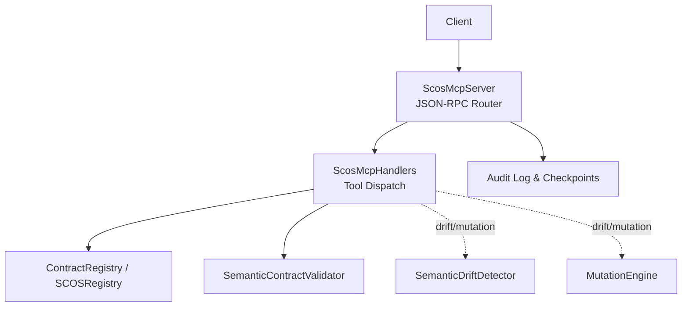
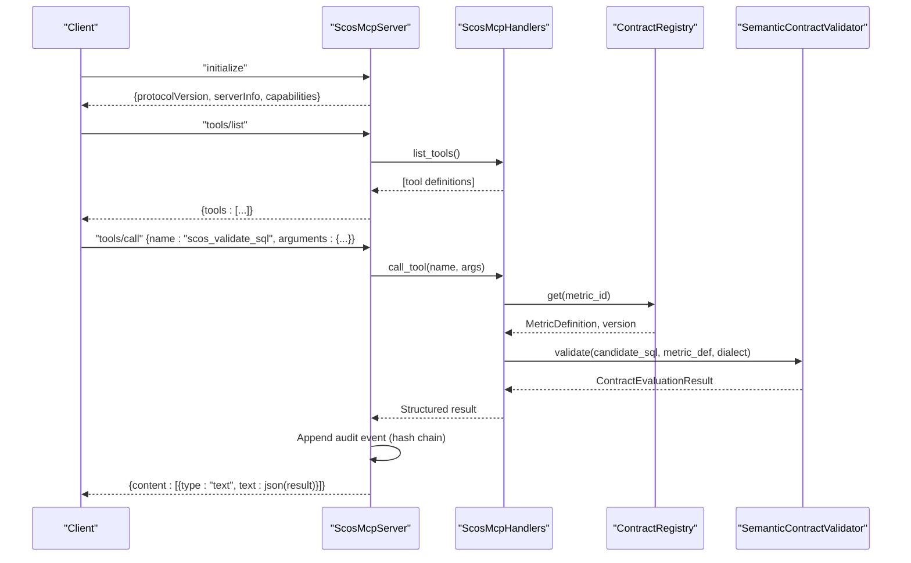
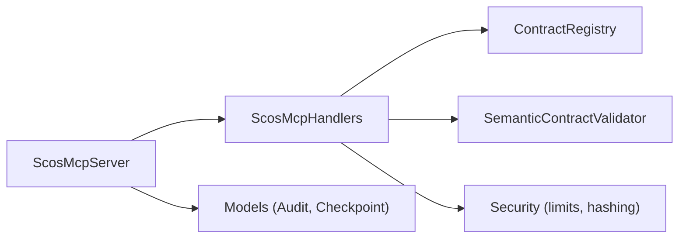

# Tools API Reference

<cite>
**Referenced Files in This Document**
- [server.py](file://semantic_reliability/mcp/server.py)
- [handlers.py](file://semantic_reliability/mcp/handlers.py)
- [models.py](file://semantic_reliability/mcp/models.py)
- [contracts.py](file://semantic_reliability/compiler/contracts.py)
- [detector.py](file://semantic_reliability/testing/drift/detector.py)
- [engine.py](file://semantic_reliability/testing/mutations/engine.py)
- [security.py](file://semantic_reliability/mcp/security.py)
- [test_mcp_server.py](file://tests/test_mcp_server.py)
</cite>

## Table of Contents
1. [Introduction](#introduction)
2. [Project Structure](#project-structure)
3. [Core Components](#core-components)
4. [Architecture Overview](#architecture-overview)
5. [Detailed Component Analysis](#detailed-component-analysis)
6. [Dependency Analysis](#dependency-analysis)
7. [Performance Considerations](#performance-considerations)
8. [Troubleshooting Guide](#troubleshooting-guide)
9. [Conclusion](#conclusion)
10. [Appendices](#appendices)

## Introduction
This document provides a complete API reference for the Model Context Protocol (MCP) tools exposed by the SCOS server. It covers:
- The tools/list endpoint for discovering available tools
- The tools/call endpoint for executing operations
- JSON schema definitions, validation rules, and example requests/responses
- Client implementation examples in multiple programming languages
- Error handling patterns and security considerations

The repository implements five MCP tools focused on semantic reliability: scos_list_metrics, scos_get_contract, scos_validate_sql, scos_explain_violation, and scos_get_probe_status. These tools enable listing metrics, retrieving contracts, validating SQL against declared invariants, explaining violations, and inspecting probe status.

Note: The requested tool names semantic_check, contract_validation, drift_detection, and mutation_testing do not exist as MCP tools in this codebase. Instead, their functionality is provided via the existing MCP tools and underlying modules:
- Semantic checking/validation is performed by scos_validate_sql using SemanticContractValidator.
- Drift detection is implemented by SemanticDriftDetector.
- Mutation testing is implemented by MutationEngine.
These are invoked indirectly through MCP tools or CLI; they are not directly exposed as MCP tools.

## Project Structure
The MCP subsystem consists of:
- Server: JSON-RPC 2.0 request routing, error mapping, audit chaining, and stdio transport
- Handlers: Tool definitions, dispatch, domain authorization, resource and prompt exposure
- Models: Pydantic schemas for tools, resources, prompts, audit events, checkpoints, and results
- Security: Limits, hashing, structured audit logging
- Registry: Read-only contract registry with URN/URI resolution
- Underlying engines: Contract validation, drift detection, mutation generation

**Diagram sources**
- [server.py:50-180](file://semantic_reliability/mcp/server.py#L50-L180)
- [handlers.py:37-287](file://semantic_reliability/mcp/handlers.py#L37-L287)
- [models.py:43-121](file://semantic_reliability/mcp/models.py#L43-L121)

**Section sources**
- [server.py:16-257](file://semantic_reliability/mcp/server.py#L16-L257)
- [handlers.py:19-409](file://semantic_reliability/mcp/handlers.py#L19-L409)
- [models.py:9-121](file://semantic_reliability/mcp/models.py#L9-L121)

## Core Components
- ScosMcpServer: Implements JSON-RPC 2.0 methods initialize, tools/list, tools/call, resources/list, resources/read, prompts/list, prompts/get, and notifications/initialized. Enforces payload size limits, maps errors to standard codes, and records tamper-evident audit events.
- ScosMcpHandlers: Declares tool input schemas, validates arguments, enforces domain authorization, and returns structured results.
- Models: Define tool/resource/prompt schemas, audit event structure, checkpoint signatures, and validation result shapes.
- Security: Enforces max payload and SQL length, hashes SQL for logs, and emits structured audit events.

Key behaviors:
- tools/list returns all registered tools with JSON Schema input definitions.
- tools/call routes to handler functions that validate inputs, enforce limits, and return standardized results.
- Domain scoping restricts access to metrics/resources based on allowed_domains.

**Section sources**
- [server.py:50-180](file://semantic_reliability/mcp/server.py#L50-L180)
- [handlers.py:37-287](file://semantic_reliability/mcp/handlers.py#L37-L287)
- [security.py:16-57](file://semantic_reliability/mcp/security.py#L16-L57)

## Architecture Overview
The MCP server exposes a JSON-RPC 2.0 interface over stdio. Clients call tools/list to discover capabilities and tools/call to execute operations. All tool calls are audited with hash-chained events and optional signed checkpoints.

**Diagram sources**
- [server.py:76-128](file://semantic_reliability/mcp/server.py#L76-L128)
- [handlers.py:147-240](file://semantic_reliability/mcp/handlers.py#L147-L240)
- [contracts.py:26-135](file://semantic_reliability/compiler/contracts.py#L26-L135)

## Detailed Component Analysis

### Endpoint: tools/list
- Purpose: Discover available MCP tools and their input schemas.
- Method: POST (or stdio) JSON-RPC method "tools/list".
- Request params: {}
- Response: { "tools": [ { "name": string, "description": string, "inputSchema": object } ] }
- Example response fields:
  - name: One of scos_list_metrics, scos_get_contract, scos_validate_sql, scos_explain_violation, scos_get_probe_status
  - description: Human-readable purpose
  - inputSchema: JSON Schema describing required/optional parameters per tool

Notes:
- Tools are defined centrally in handlers.list_tools().
- Each tool’s inputSchema specifies required fields and types.

**Section sources**
- [handlers.py:37-97](file://semantic_reliability/mcp/handlers.py#L37-L97)
- [server.py:91-93](file://semantic_reliability/mcp/server.py#L91-L93)

### Endpoint: tools/call
- Purpose: Execute a named tool with typed arguments.
- Method: "tools/call"
- Request params:
  - name: string (required)
  - arguments: object (required)
- Response: { "content": [{ "type": "text", "text": json_string }] }
- Error handling:
  - Invalid request: -32600
  - Method not found: -32601
  - Invalid params: -32602
  - Internal error: -32603

Security and limits:
- Payload size limit enforced at server level.
- SQL length and AST complexity limits enforced within handlers.
- Domain authorization enforced per metric/resource.

Audit:
- Every successful tool call appends a hash-chained audit event including tool_name, metric_id, decision, latency_ms, sql_sha256, tenant_id, client_id.

**Section sources**
- [server.py:95-128](file://semantic_reliability/mcp/server.py#L95-L128)
- [server.py:222-237](file://semantic_reliability/mcp/server.py#L222-L237)
- [security.py:16-57](file://semantic_reliability/mcp/security.py#L16-L57)

### Tool: scos_list_metrics
- Description: List registered SCOS business metrics with domain, granularity, and description.
- Input schema:
  - type: object
  - properties:
    - domain: string (optional) — filter by business domain
- Return value:
  - metrics: array of objects with fields: metric_id, version, domain, owner, grain, description
  - count: integer
- Validation rules:
  - Optional domain filter applied case-insensitively
  - Domain authorization enforced if allowed_domains configured
- Example request:
  - { "name": "scos_list_metrics", "arguments": { "domain": "finance" } }
- Example response:
  - { "metrics": [ { "metric_id": "...", "version": "...", "domain": "...", "owner": "...", "grain": "...", "description": "..." } ], "count": 1 }

**Section sources**
- [handlers.py:39-48](file://semantic_reliability/mcp/handlers.py#L39-L48)
- [handlers.py:102-119](file://semantic_reliability/mcp/handlers.py#L102-L119)

### Tool: scos_get_contract
- Description: Retrieve the complete SCOS metric contract, ground-truth SQL, and declared invariants.
- Input schema:
  - type: object
  - properties:
    - metric_id: string (required)
    - domain: string (optional)
- Return value:
  - metric_id, version, domain, owner, grain, dialect, canonical_sql, invariants, probes, found: boolean
- Validation rules:
  - metric_id required
  - Domain authorization enforced
- Example request:
  - { "name": "scos_get_contract", "arguments": { "metric_id": "net_revenue" } }
- Example response:
  - { "metric_id": "net_revenue", "version": "1.0.0", "domain": "finance", "owner": "finance", "grain": "customer_month", "dialect": "duckdb", "canonical_sql": "...", "invariants": {...}, "probes": {...}, "found": true }

**Section sources**
- [handlers.py:49-60](file://semantic_reliability/mcp/handlers.py#L49-L60)
- [handlers.py:121-145](file://semantic_reliability/mcp/handlers.py#L121-L145)

### Tool: scos_validate_sql
- Description: Validate candidate analytical SQL against declared business metric invariants before execution.
- Input schema:
  - type: object
  - properties:
    - metric_id: string (required)
    - sql: string (required)
    - dialect: string (optional)
- Return value:
  - metric_id, contract_version, domain, compliant: boolean, decision: "ALLOW" | "REQUIRE_REVIEW" | "DENY", violations: array of { rule, category, severity }, execution_performed: false, policy_version, sql_sha256: string, latency_ms: number
- Validation rules:
  - Required fields: metric_id, sql
  - SQL length limit enforced (default 50,000 chars)
  - AST node count limit enforced (default 500)
  - Must parse as SELECT statement
  - Domain authorization enforced
- Example request:
  - { "name": "scos_validate_sql", "arguments": { "metric_id": "net_revenue", "sql": "SELECT ...", "dialect": "duckdb" } }
- Example responses:
  - Compliant: { "compliant": true, "decision": "ALLOW", "violations": [], "execution_performed": false, "sql_sha256": "...", "latency_ms": 1.23 }
  - Violations: { "compliant": false, "decision": "REQUIRE_REVIEW", "violations": [{ "rule": "...", "category": "...", "severity": "HIGH" }], "execution_performed": false, "sql_sha256": "...", "latency_ms": 2.45 }
  - Deny (syntax/complexity): { "compliant": false, "decision": "DENY", "violations": [{ "rule": "syntax_error" | "complexity_limit", "details": "...", "severity": "CRITICAL" }], "execution_performed": false, "sql_sha256": "...", "latency_ms": 0.0 }

Underlying logic:
- Uses SemanticContractValidator.validate to check population, grain, aggregation, timezone invariants.
- Returns structured violations with categories and severities.

**Section sources**
- [handlers.py:61-73](file://semantic_reliability/mcp/handlers.py#L61-L73)
- [handlers.py:147-240](file://semantic_reliability/mcp/handlers.py#L147-L240)
- [contracts.py:26-135](file://semantic_reliability/compiler/contracts.py#L26-L135)

### Tool: scos_explain_violation
- Description: Generate formal semantic remediation guidance for a specific contract violation without silent rewrites.
- Input schema:
  - type: object
  - properties:
    - metric_id: string (required)
    - rule: string (required)
- Return value:
  - metric_id, contract_version, violated_rule, remediation_guidance: string, automatic_rewrite_applied: false
- Validation rules:
  - Required fields: metric_id, rule
  - Domain authorization enforced
- Example request:
  - { "name": "scos_explain_violation", "arguments": { "metric_id": "net_revenue", "rule": "Required filter: `status = 'active'`" } }
- Example response:
  - { "metric_id": "net_revenue", "contract_version": "1.0.0", "violated_rule": "Required filter: `status = 'active'`", "remediation_guidance": "...", "automatic_rewrite_applied": false }

**Section sources**
- [handlers.py:74-85](file://semantic_reliability/mcp/handlers.py#L74-L85)
- [handlers.py:242-262](file://semantic_reliability/mcp/handlers.py#L242-L262)

### Tool: scos_get_probe_status
- Description: Retrieve latest statistical reality probe definitions and runtime distribution bounds.
- Input schema:
  - type: object
  - properties:
    - metric_id: string (required)
- Return value:
  - metric_id, contract_version, domain, status: "HEALTHY", active_probes: object, last_evaluated_utc: number
- Validation rules:
  - Required field: metric_id
  - Domain authorization enforced
- Example request:
  - { "name": "scos_get_probe_status", "arguments": { "metric_id": "net_revenue" } }
- Example response:
  - { "metric_id": "net_revenue", "contract_version": "1.0.0", "domain": "finance", "status": "HEALTHY", "active_probes": {}, "last_evaluated_utc": 1710000000.0 }

**Section sources**
- [handlers.py:86-96](file://semantic_reliability/mcp/handlers.py#L86-L96)
- [handlers.py:264-285](file://semantic_reliability/mcp/handlers.py#L264-L285)

### Related Engines (Not MCP Tools)
While not exposed as MCP tools, these components underpin semantic reliability:
- SemanticDriftDetector: Compares baseline vs candidate SQL ASTs to detect structural and semantic drift across WHERE, aggregations, joins, GROUP BY, null handling, HAVING, tables.
- MutationEngine: Generates AST-level logical mutations (filter drop, boundary shift, aggregation swap, distinct drop, join predicate drop, grain drop, coalesce bypass, math operator invert).

Use cases:
- Drift detection can be used in CI pipelines to compare model changes.
- Mutation testing helps assess robustness of assertions and contracts.

**Section sources**
- [detector.py:9-46](file://semantic_reliability/testing/drift/detector.py#L9-L46)
- [engine.py:8-52](file://semantic_reliability/testing/mutations/engine.py#L8-L52)

## Dependency Analysis
- ScosMcpServer depends on ScosMcpHandlers for tool dispatch and on models for audit structures.
- ScosMcpHandlers depends on ContractRegistry for metric definitions and on SemanticContractValidator for validation.
- Security module provides limits and audit logging utilities.
- Tests validate JSON-RPC behavior, error codes, domain scoping, and AST complexity handling.

**Diagram sources**
- [server.py:25-48](file://semantic_reliability/mcp/server.py#L25-L48)
- [handlers.py:19-34](file://semantic_reliability/mcp/handlers.py#L19-L34)
- [models.py:43-121](file://semantic_reliability/mcp/models.py#L43-L121)
- [security.py:16-57](file://semantic_reliability/mcp/security.py#L16-L57)

**Section sources**
- [server.py:25-48](file://semantic_reliability/mcp/server.py#L25-L48)
- [handlers.py:19-34](file://semantic_reliability/mcp/handlers.py#L19-L34)

## Performance Considerations
- SQL length limit: Default 50,000 characters; exceeding returns DENY with payload_limit violation.
- AST complexity limit: Default 500 nodes; exceeding returns DENY with complexity_limit violation.
- Latency tracking: Each tool returns latency_ms for observability.
- Audit overhead: Hash-chained audit events appended per tool call; consider batching or sampling in high-throughput scenarios.
- Domain filtering: Reduces processing by early-exiting unauthorized domains.

[No sources needed since this section provides general guidance]

## Troubleshooting Guide
Common issues and resolutions:
- Invalid Request (-32600): Ensure root payload is a JSON object and contains valid method and params.
- Method not found (-32601): Verify method name; only initialize, tools/list, tools/call, resources/*, prompts/* are supported.
- Invalid Params (-32602): Check required fields per tool inputSchema; ensure arguments is an object.
- Access denied: If allowed_domains is configured, ensure metric’s domain is authorized.
- Malformed SQL: scos_validate_sql returns structured failure with syntax_error and decision DENY.
- AST too complex: Reduce query complexity or split into simpler steps.

Error code mapping:
- -32700: Parse error (malformed JSON)
- -32600: Invalid Request
- -32601: Method not found
- -32602: Invalid Params
- -32603: Internal error

**Section sources**
- [server.py:56-80](file://semantic_reliability/mcp/server.py#L56-L80)
- [server.py:175-180](file://semantic_reliability/mcp/server.py#L175-L180)
- [handlers.py:147-240](file://semantic_reliability/mcp/handlers.py#L147-L240)
- [test_mcp_server.py:170-196](file://tests/test_mcp_server.py#L170-L196)

## Conclusion
The SCOS MCP server provides a robust, secure, and auditable interface for semantic reliability operations. While the requested tool names semantic_check, contract_validation, drift_detection, and mutation_testing are not direct MCP tools, their capabilities are delivered via scos_validate_sql and supporting engines. Clients should use tools/list to discover capabilities and tools/call to execute operations, adhering to input schemas and error handling patterns documented here.

[No sources needed since this section summarizes without analyzing specific files]

## Appendices

### JSON Schema Definitions
- scos_list_metrics inputSchema:
  - type: object
  - properties:
    - domain: string (optional)
- scos_get_contract inputSchema:
  - type: object
  - properties:
    - metric_id: string (required)
    - domain: string (optional)
- scos_validate_sql inputSchema:
  - type: object
  - properties:
    - metric_id: string (required)
    - sql: string (required)
    - dialect: string (optional)
- scos_explain_violation inputSchema:
  - type: object
  - properties:
    - metric_id: string (required)
    - rule: string (required)
- scos_get_probe_status inputSchema:
  - type: object
  - properties:
    - metric_id: string (required)

**Section sources**
- [handlers.py:37-97](file://semantic_reliability/mcp/handlers.py#L37-L97)

### Example Requests and Responses
- tools/list:
  - Request: { "jsonrpc": "2.0", "id": 2, "method": "tools/list", "params": {} }
  - Response: { "jsonrpc": "2.0", "id": 2, "result": { "tools": [...] } }
- tools/call (scos_validate_sql compliant):
  - Request: { "jsonrpc": "2.0", "id": 3, "method": "tools/call", "params": { "name": "scos_validate_sql", "arguments": { "metric_id": "net_revenue", "sql": "SELECT ...", "dialect": "duckdb" } } }
  - Response: { "jsonrpc": "2.0", "id": 3, "result": { "content": [{ "type": "text", "text": "{...}" }] } }

**Section sources**
- [test_mcp_server.py:51-88](file://tests/test_mcp_server.py#L51-L88)

### Client Implementation Examples

- Python (requests-style pseudo-code):
  - Initialize: send { "jsonrpc": "2.0", "id": 1, "method": "initialize", "params": { "protocolVersion": "2024-11-05" } }
  - List tools: send { "jsonrpc": "2.0", "id": 2, "method": "tools/list", "params": {} }
  - Call tool: send { "jsonrpc": "2.0", "id": 3, "method": "tools/call", "params": { "name": "scos_validate_sql", "arguments": { "metric_id": "net_revenue", "sql": "...", "dialect": "duckdb" } } }
  - Handle response: parse content.text as JSON to extract result fields

- JavaScript (fetch-style pseudo-code):
  - Use fetch to POST JSON-RPC messages to the MCP server endpoint or read/write via stdio in local integration
  - Implement retry and error handling for -32600/-32601/-32602/-32603

- Bash (stdio):
  - Echo JSON lines to stdin and read from stdout
  - Example: echo '{"jsonrpc":"2.0","id":1,"method":"initialize","params":{"protocolVersion":"2024-11-05"}}' | python -m semantic_reliability.mcp.server

[No sources needed since this section provides general guidance]

### Error Handling Patterns
- Always check for error.code in responses
- Map -32600 to invalid request format
- Map -32601 to unsupported method
- Map -32602 to missing/invalid parameters
- Map -32603 to internal server errors
- For tool-specific failures (e.g., scos_validate_sql), inspect decision and violations in the structured result

**Section sources**
- [server.py:56-80](file://semantic_reliability/mcp/server.py#L56-L80)
- [server.py:175-180](file://semantic_reliability/mcp/server.py#L175-L180)
- [handlers.py:147-240](file://semantic_reliability/mcp/handlers.py#L147-L240)