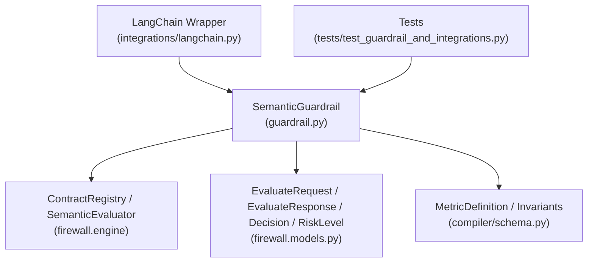
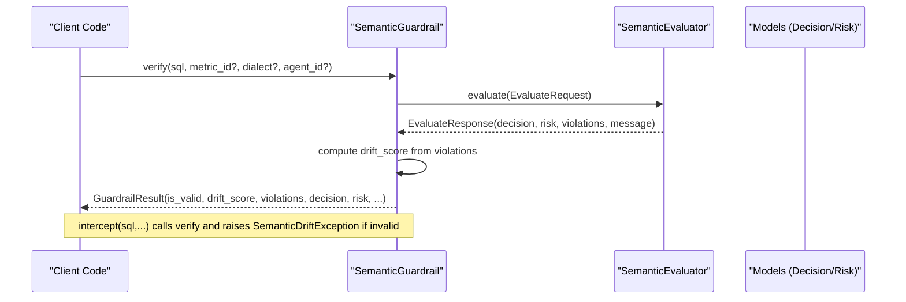
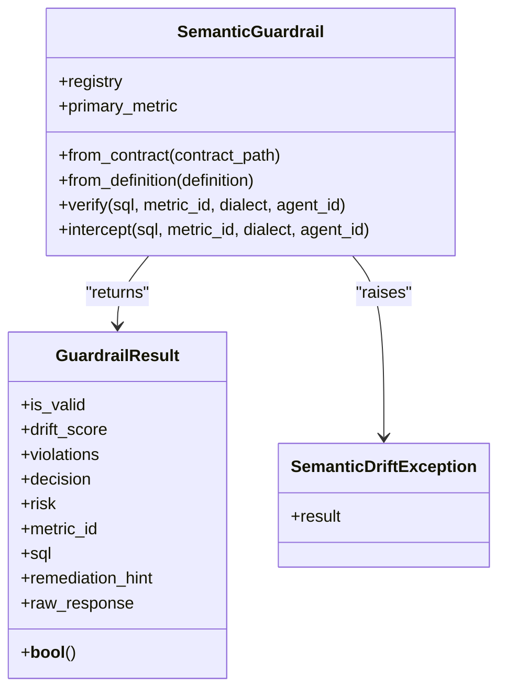
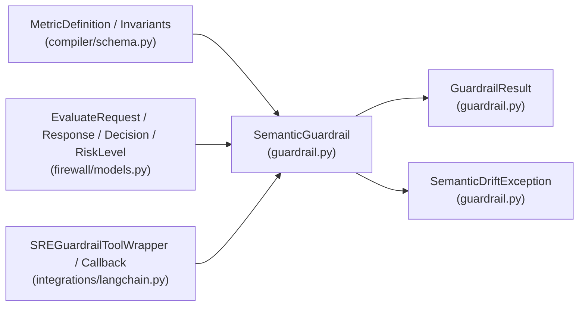

# Core Classes

<cite>
**Referenced Files in This Document**
- [guardrail.py](file://semantic_reliability/guardrail.py)
- [models.py](file://semantic_reliability/firewall/models.py)
- [schema.py](file://semantic_reliability/compiler/schema.py)
- [langchain.py](file://semantic_reliability/integrations/langchain.py)
- [test_guardrail_and_integrations.py](file://tests/test_guardrail_and_integrations.py)
</cite>

## Table of Contents
1. [Introduction](#introduction)
2. [Project Structure](#project-structure)
3. [Core Components](#core-components)
4. [Architecture Overview](#architecture-overview)
5. [Detailed Component Analysis](#detailed-component-analysis)
6. [Dependency Analysis](#dependency-analysis)
7. [Performance Considerations](#performance-considerations)
8. [Troubleshooting Guide](#troubleshooting-guide)
9. [Conclusion](#conclusion)
10. [Appendices](#appendices)

## Introduction
This document provides comprehensive documentation for the core Python SDK classes that power semantic contract enforcement for text-to-SQL workflows: SemanticGuardrail, GuardrailResult, and SemanticDriftException. It explains initialization parameters, configuration options, lifecycle methods, result interpretation, exception handling patterns, and practical usage examples. It also includes guidance on threading considerations and performance optimization for production environments.

## Project Structure
The core SDK lives under semantic_reliability/guardrail.py and integrates with:
- Contract definitions and metric schemas (compiler/schema.py)
- Evaluation request/response models and decision/risk enums (firewall/models.py)
- Integration wrappers for LangChain (integrations/langchain.py)
- Tests demonstrating usage patterns (tests/test_guardrail_and_integrations.py)

**Diagram sources**
- [guardrail.py:45-152](file://semantic_reliability/guardrail.py#L45-L152)
- [models.py:6-51](file://semantic_reliability/firewall/models.py#L6-L51)
- [schema.py:83-97](file://semantic_reliability/compiler/schema.py#L83-L97)
- [langchain.py:12-149](file://semantic_reliability/integrations/langchain.py#L12-L149)
- [test_guardrail_and_integrations.py:22-54](file://tests/test_guardrail_and_integrations.py#L22-L54)

**Section sources**
- [guardrail.py:45-152](file://semantic_reliability/guardrail.py#L45-L152)
- [models.py:6-51](file://semantic_reliability/firewall/models.py#L6-L51)
- [schema.py:83-97](file://semantic_reliability/compiler/schema.py#L83-L97)
- [langchain.py:12-149](file://semantic_reliability/integrations/langchain.py#L12-L149)
- [test_guardrail_and_integrations.py:22-54](file://tests/test_guardrail_and_integrations.py#L22-L54)

## Core Components
- SemanticGuardrail: High-level orchestrator that loads SCOS contracts, evaluates candidate SQL against metric invariants, and returns structured results or raises exceptions when violations are detected.
- GuardrailResult: Immutable dataclass representing evaluation outcomes including validity, drift score, violations, decision, risk, and metadata.
- SemanticDriftException: Exception raised by intercept() to block execution when a query violates semantic invariants; carries the GuardrailResult for rich diagnostics.

Key responsibilities:
- Load and register metric contracts from YAML files, directories, MetricDefinition objects, or dictionaries.
- Evaluate SQL queries deterministically using AST-based checks and policy decisions.
- Provide both non-blocking verification (verify) and blocking interception (intercept).

**Section sources**
- [guardrail.py:13-43](file://semantic_reliability/guardrail.py#L13-L43)
- [guardrail.py:45-152](file://semantic_reliability/guardrail.py#L45-L152)
- [models.py:6-51](file://semantic_reliability/firewall/models.py#L6-L51)
- [schema.py:83-97](file://semantic_reliability/compiler/schema.py#L83-L97)

## Architecture Overview
The guardrail pipeline transforms a candidate SQL into a structured evaluation and enforces business semantics before execution.

**Diagram sources**
- [guardrail.py:91-152](file://semantic_reliability/guardrail.py#L91-L152)
- [models.py:20-51](file://semantic_reliability/firewall/models.py#L20-L51)

## Detailed Component Analysis

### SemanticGuardrail
Purpose:
- Initialize from multiple contract sources (YAML file, directory, MetricDefinition, dict).
- Evaluate SQL against metric invariants and return structured results.
- Intercept and block execution when violations occur.

Initialization parameters and behavior:
- contract_source: Accepts str/Path to a YAML file or directory, a MetricDefinition object, or a dict. For directories, all valid SCOS contracts are loaded; an error is raised if none are found.
- primary_metric: Automatically set based on the loaded contract(s); used as default target for verify/intercept when metric_id is not provided.
- evaluator: Internal SemanticEvaluator instance created with the registered contracts.

Lifecycle methods:
- from_contract(contract_path): Factory method to initialize from a contract path.
- from_definition(definition): Factory method to initialize from a MetricDefinition object.
- verify(sql, metric_id=None, dialect="duckdb", agent_id="agent-guardrail"): Evaluates SQL and returns GuardrailResult. Computes drift_score based on violation count and compliance status.
- intercept(sql, metric_id=None, dialect="duckdb", agent_id="agent-guardrail"): Returns SQL if valid; otherwise raises SemanticDriftException.

Configuration options:
- dialect: Target SQL dialect for evaluation (default duckdb).
- agent_id: Identifier for the caller/agent performing the evaluation.
- metric_id: Optional override of the primary metric for a specific evaluation.

Error handling:
- Raises FileNotFoundError if contract source path does not exist.
- Raises ValueError if a directory contains no valid SCOS contracts.
- Raises SemanticDriftException via intercept() when violations are detected.

Usage patterns:
- Instantiate via from_contract or from_definition.
- Use verify() for non-blocking validation and inspection.
- Use intercept() to enforce hard blocks on invalid SQL.

**Section sources**
- [guardrail.py:53-89](file://semantic_reliability/guardrail.py#L53-L89)
- [guardrail.py:91-152](file://semantic_reliability/guardrail.py#L91-L152)

#### Class Diagram

**Diagram sources**
- [guardrail.py:13-43](file://semantic_reliability/guardrail.py#L13-L43)
- [guardrail.py:45-152](file://semantic_reliability/guardrail.py#L45-L152)

### GuardrailResult
Data structure:
- is_valid: Boolean indicating whether the SQL satisfies the contract.
- drift_score: Float in [0, 1] representing severity of drift; 0.0 for compliant queries, scaled penalty for violations.
- violations: List of human-readable violation descriptions.
- decision: String enum value (ALLOW, AUDIT, REQUIRE_REVIEW, DENY).
- risk: String enum value (LOW, MEDIUM, HIGH, CRITICAL).
- metric_id: The metric identifier evaluated.
- sql: The candidate SQL string.
- remediation_hint: Optional guidance for fixing violations.
- raw_response: Optional underlying EvaluateResponse for advanced diagnostics.

Behavior:
- __bool__: Enables boolean context checks (e.g., if result).

Interpretation:
- is_valid and decision together determine whether execution should proceed.
- drift_score quantifies severity; higher values indicate more severe deviations.
- violations list provides actionable details for developers or agents.

**Section sources**
- [guardrail.py:28-43](file://semantic_reliability/guardrail.py#L28-L43)
- [models.py:6-51](file://semantic_reliability/firewall/models.py#L6-L51)

### SemanticDriftException
Purpose:
- Blocks execution when a candidate SQL violates semantic invariants.
- Carries GuardrailResult for rich diagnostic information.

Construction:
- Accepts a GuardrailResult and formats a detailed message including drift score, decision, violations, and optional remediation hint.

Handling pattern:
- Catch SemanticDriftException to handle blocked executions gracefully.
- Inspect exception.result for structured diagnostics and remediation hints.

**Section sources**
- [guardrail.py:13-26](file://semantic_reliability/guardrail.py#L13-L26)

## Dependency Analysis
The core components depend on:
- Contract schema definitions (MetricDefinition and invariants) to understand expected SQL semantics.
- Firewall models (EvaluateRequest, EvaluateResponse, Decision, RiskLevel) to standardize evaluation inputs and outputs.
- Integrations (LangChain wrapper) to embed guardrails into agent toolchains.

**Diagram sources**
- [schema.py:83-97](file://semantic_reliability/compiler/schema.py#L83-L97)
- [models.py:6-51](file://semantic_reliability/firewall/models.py#L6-L51)
- [guardrail.py:45-152](file://semantic_reliability/guardrail.py#L45-L152)
- [langchain.py:12-149](file://semantic_reliability/integrations/langchain.py#L12-L149)

**Section sources**
- [schema.py:83-97](file://semantic_reliability/compiler/schema.py#L83-L97)
- [models.py:6-51](file://semantic_reliability/firewall/models.py#L6-L51)
- [guardrail.py:45-152](file://semantic_reliability/guardrail.py#L45-L152)
- [langchain.py:12-149](file://semantic_reliability/integrations/langchain.py#L12-L149)

## Performance Considerations
- Reuse SemanticGuardrail instances: Construct once per process or per metric scope and reuse across evaluations to avoid repeated contract loading and registry setup.
- Batch evaluations: When possible, group SQL validations to minimize overhead; however, each verify() call is independent and deterministic.
- Dialect selection: Ensure dialect matches your warehouse to reduce parsing mismatches and false positives.
- Logging and tracing: Use raw_response for detailed diagnostics in development; in production, log only necessary fields to reduce I/O.
- Concurrency: The guardrail is stateless after construction; it can be safely used concurrently within a single process. Avoid sharing mutable state externally. If running in multi-threaded contexts, ensure thread-safe access to shared resources like logs or metrics collectors.
- Asynchronous integration: LangChain wrapper supports async arun(); use async paths where appropriate to avoid blocking event loops.

[No sources needed since this section provides general guidance]

## Troubleshooting Guide
Common issues and resolutions:
- FileNotFoundError: Ensure contract_path points to a valid YAML file or directory containing SCOS contracts.
- ValueError: Directory must contain at least one valid SCOS contract YAML; fix or remove invalid files.
- SemanticDriftException: Review violations and remediation_hint in the exception’s result; adjust SQL to satisfy required filters/invariants.
- False positives/negatives: Verify metric invariants and probes align with business expectations; update contract definitions accordingly.

Practical examples:
- Contract validation: Instantiate guardrail from a contract file and call verify() to inspect is_valid and drift_score.
- Result interpretation: Check decision and risk to decide whether to allow, audit, require review, or deny execution.
- Exception handling: Wrap intercept() calls in try/except to catch SemanticDriftException and present user-friendly feedback.

**Section sources**
- [guardrail.py:53-89](file://semantic_reliability/guardrail.py#L53-L89)
- [guardrail.py:91-152](file://semantic_reliability/guardrail.py#L91-L152)
- [test_guardrail_and_integrations.py:22-54](file://tests/test_guardrail_and_integrations.py#L22-L54)

## Conclusion
The core SDK provides a robust, deterministic mechanism to enforce semantic contracts on generated SQL. SemanticGuardrail offers flexible initialization and two modes of operation—non-blocking verification and blocking interception—while GuardrailResult and SemanticDriftException provide clear, actionable outcomes. Integrations enable seamless embedding into agent toolchains, and best practices around reuse, concurrency, and logging support production-grade deployments.

[No sources needed since this section summarizes without analyzing specific files]

## Appendices

### Practical Usage Patterns
- Instantiate from contract file:
  - Use from_contract(path) to load SCOS contracts and set primary_metric automatically.
- Validate SQL without blocking:
  - Call verify(sql) and inspect is_valid, drift_score, violations, decision, risk.
- Block invalid SQL:
  - Call intercept(sql) and catch SemanticDriftException to handle violations.
- Integrate with LangChain:
  - Use SREGuardrailToolWrapper to wrap SQL tools; configure raise_on_drift to either return diagnostic messages or raise exceptions.
  - Use SREGuardrailCallback to observe and optionally block SQL during tool execution.

**Section sources**
- [test_guardrail_and_integrations.py:22-54](file://tests/test_guardrail_and_integrations.py#L22-L54)
- [langchain.py:12-149](file://semantic_reliability/integrations/langchain.py#L12-L149)