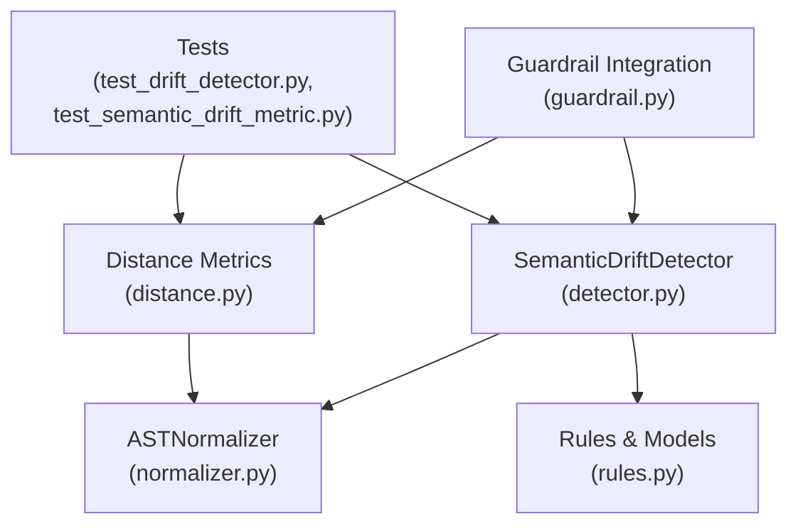
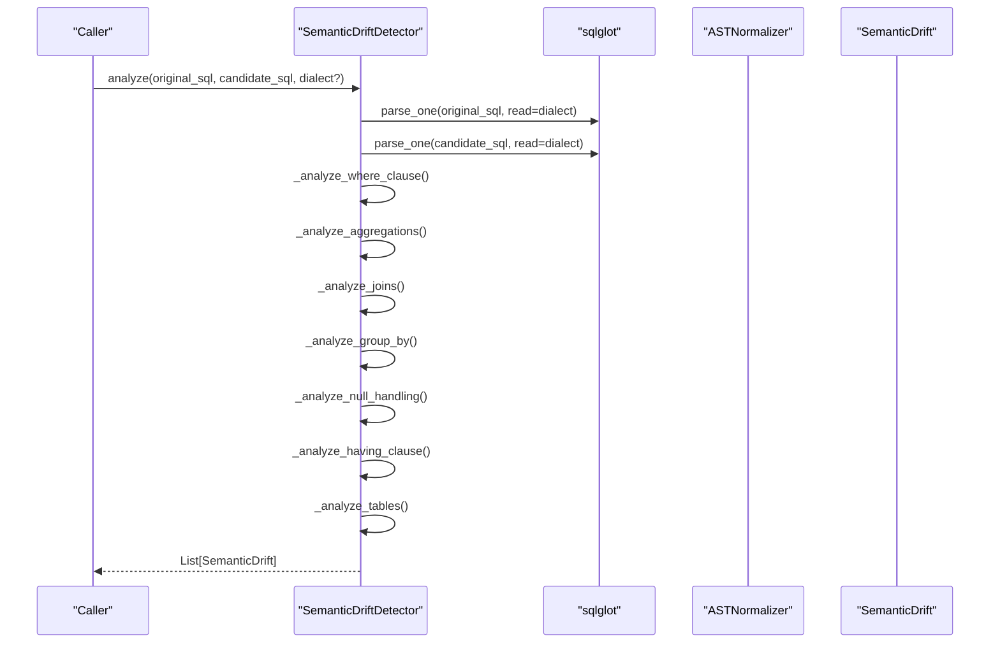
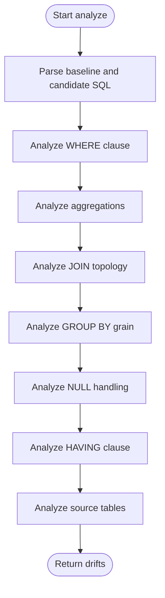
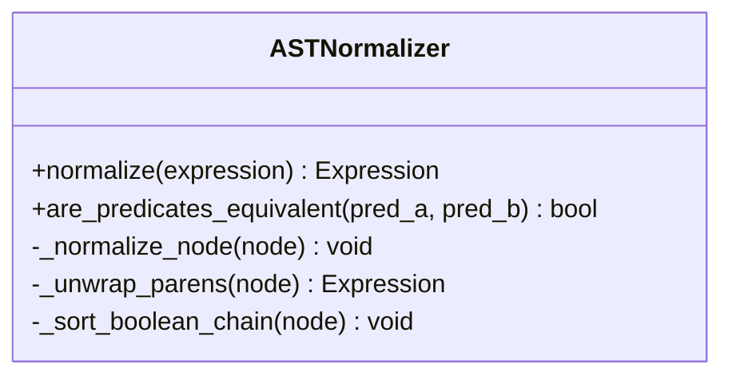
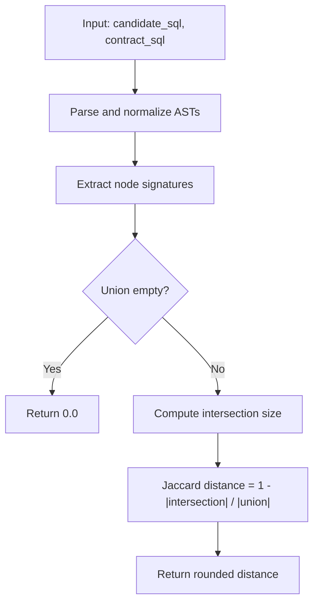
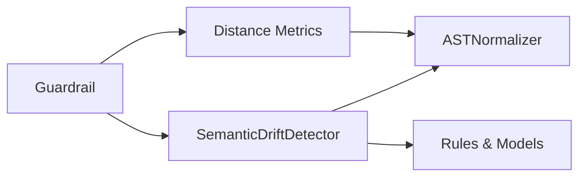

# Drift Detector

<cite>
**Referenced Files in This Document**
- [detector.py](file://semantic_reliability/testing/drift/detector.py)
- [normalizer.py](file://semantic_reliability/testing/drift/normalizer.py)
- [rules.py](file://semantic_reliability/testing/drift/rules.py)
- [distance.py](file://semantic_reliability/testing/drift/distance.py)
- [guardrail.py](file://semantic_reliability/guardrail.py)
- [test_drift_detector.py](file://tests/test_drift_detector.py)
- [test_semantic_drift_metric.py](file://tests/test_semantic_drift_metric.py)
</cite>

## Table of Contents
1. [Introduction](#introduction)
2. [Project Structure](#project-structure)
3. [Core Components](#core-components)
4. [Architecture Overview](#architecture-overview)
5. [Detailed Component Analysis](#detailed-component-analysis)
6. [Dependency Analysis](#dependency-analysis)
7. [Performance Considerations](#performance-considerations)
8. [Troubleshooting Guide](#troubleshooting-guide)
9. [Conclusion](#conclusion)
10. [Appendices](#appendices)

## Introduction
This document explains the AST-based semantic drift detection system centered on the SemanticDriftDetector class. It covers how baseline and candidate SQL queries are parsed into ASTs, normalized to eliminate cosmetic differences, and compared across key relational-algebra components (filters, aggregations, joins, grouping, null handling, post-aggregation filters, and source tables). It also documents the severity classification system, rule evaluation logic, and the normalizer that handles SQL dialect differences and canonicalization. Practical workflows, examples, performance tuning guidelines, and memory considerations for large-scale analysis are included.

## Project Structure
The drift detection capability is implemented under testing/drift with supporting modules for rules, normalization, and distance metrics. Integration points exist in guardrail and tests that demonstrate usage and expected behaviors.

**Diagram sources**
- [detector.py:9-46](file://semantic_reliability/testing/drift/detector.py#L9-L46)
- [normalizer.py:6-92](file://semantic_reliability/testing/drift/normalizer.py#L6-L92)
- [rules.py:6-41](file://semantic_reliability/testing/drift/rules.py#L6-L41)
- [distance.py:33-63](file://semantic_reliability/testing/drift/distance.py#L33-L63)
- [guardrail.py:10-11](file://semantic_reliability/guardrail.py#L10-L11)
- [test_drift_detector.py:1-84](file://tests/test_drift_detector.py#L1-L84)
- [test_semantic_drift_metric.py:1-98](file://tests/test_semantic_drift_metric.py#L1-L98)

**Section sources**
- [detector.py:9-46](file://semantic_reliability/testing/drift/detector.py#L9-L46)
- [normalizer.py:6-92](file://semantic_reliability/testing/drift/normalizer.py#L6-L92)
- [rules.py:6-41](file://semantic_reliability/testing/drift/rules.py#L6-L41)
- [distance.py:33-63](file://semantic_reliability/testing/drift/distance.py#L33-L63)
- [guardrail.py:10-11](file://semantic_reliability/guardrail.py#L10-L11)
- [test_drift_detector.py:1-84](file://tests/test_drift_detector.py#L1-L84)
- [test_semantic_drift_metric.py:1-98](file://tests/test_semantic_drift_metric.py#L1-L98)

## Core Components
- SemanticDriftDetector: Parses baseline and candidate SQL into ASTs and runs a series of component-level checks to produce a list of SemanticDrift findings.
- ASTNormalizer: Canonicalizes AST expressions by unwrapping redundant parentheses, flattening/sorting boolean chains, and lowering aliases to ensure stable comparisons.
- Rules and Models: Defines drift types, severities, and the SemanticDrift data model used to report findings.
- Distance Metrics: Computes a Jaccard-style semantic drift distance over normalized AST node signatures for quantitative comparison.
- Guardrail Integration: Uses both detector and distance metric to evaluate candidate SQL against contracts and make allow/deny/review decisions.

Key responsibilities:
- Initialization parameters: The detector’s analyze method accepts original_sql, candidate_sql, and an optional dialect string for parsing. There are no explicit rule set or strategy configuration parameters; rule evaluation is embedded within the detector methods.
- Normalization options: Provided by ASTNormalizer for predicate equivalence and signature extraction.
- Comparison strategies: Structural and semantic checks per relational algebra component plus a quantitative distance metric.

**Section sources**
- [detector.py:9-46](file://semantic_reliability/testing/drift/detector.py#L9-L46)
- [normalizer.py:6-92](file://semantic_reliability/testing/drift/normalizer.py#L6-L92)
- [rules.py:6-41](file://semantic_reliability/testing/drift/rules.py#L6-L41)
- [distance.py:33-63](file://semantic_reliability/testing/drift/distance.py#L33-L63)
- [guardrail.py:10-11](file://semantic_reliability/guardrail.py#L10-L11)

## Architecture Overview
The system follows a layered approach:
- Parsing layer: sqlglot parses SQL strings into ASTs using an optional dialect.
- Normalization layer: ASTNormalizer canonicalizes expressions to reduce false positives from formatting and commutative variations.
- Detection layer: SemanticDriftDetector inspects specific AST components and emits SemanticDrift objects with severity and remediation guidance.
- Quantification layer: distance module computes a normalized drift score between two SQL statements based on normalized AST node sets.
- Integration layer: Guardrail uses both structured drift findings and drift scores to enforce policy decisions.

**Diagram sources**
- [detector.py:12-46](file://semantic_reliability/testing/drift/detector.py#L12-L46)
- [normalizer.py:78-92](file://semantic_reliability/testing/drift/normalizer.py#L78-L92)

## Detailed Component Analysis

### SemanticDriftDetector
Responsibilities:
- Parse baseline and candidate SQL into ASTs using an optional dialect.
- Run targeted analyses across WHERE clauses, aggregations, joins, GROUP BY, null handling, HAVING, and source tables.
- Emit SemanticDrift instances with severity, type, component context, summary, details, business impact, snippets, and remediation hints.

Initialization parameters:
- original_sql: Baseline SQL string.
- candidate_sql: Candidate SQL string to compare against baseline.
- dialect: Optional parser dialect for sqlglot.

Comparison strategies:
- Structural checks: presence/absence of clauses and join predicates.
- Semantic checks: equivalence of filter predicates via ASTNormalizer, aggregation function/expression changes, grain dimension shifts, null handling differences, and table lineage changes.

**Diagram sources**
- [detector.py:12-46](file://semantic_reliability/testing/drift/detector.py#L12-L46)

**Section sources**
- [detector.py:12-46](file://semantic_reliability/testing/drift/detector.py#L12-L46)
- [detector.py:48-91](file://semantic_reliability/testing/drift/detector.py#L48-L91)
- [detector.py:93-131](file://semantic_reliability/testing/drift/detector.py#L93-L131)
- [detector.py:133-164](file://semantic_reliability/testing/drift/detector.py#L133-L164)
- [detector.py:166-187](file://semantic_reliability/testing/drift/detector.py#L166-L187)
- [detector.py:189-205](file://semantic_reliability/testing/drift/detector.py#L189-L205)
- [detector.py:207-225](file://semantic_reliability/testing/drift/detector.py#L207-L225)
- [detector.py:227-245](file://semantic_reliability/testing/drift/detector.py#L227-L245)

### ASTNormalizer
Responsibilities:
- Normalize AST nodes to eliminate cosmetic differences:
  - Unwrap redundant parentheses.
  - Flatten and sort AND/OR chains to handle commutativity.
  - Lowercase alias identifiers for stable comparisons.
- Provide predicate equivalence checking by normalizing and comparing SQL representations.

Usage:
- Used by detector to determine if WHERE/HAVING predicates have changed semantically.
- Used by distance module to extract normalized node signatures for Jaccard distance computation.

**Diagram sources**
- [normalizer.py:6-92](file://semantic_reliability/testing/drift/normalizer.py#L6-L92)

**Section sources**
- [normalizer.py:6-92](file://semantic_reliability/testing/drift/normalizer.py#L6-L92)

### Rules and Severity Classification
- DriftSeverity: Enumerates severity levels from FATAL to INFO.
- DriftType: Enumerates categories such as FILTER_REMOVAL, SEMANTIC_LOGIC_SHIFT, AGGREGATION_FUNCTION_SHIFT, GRAIN_DRIFT, etc.
- SemanticDrift: Pydantic model capturing severity, drift type, component, summary, details, business impact, snippets, and remediation.

Severity mapping highlights:
- FATAL: Missing join predicates, complete removal of population filters.
- CRITICAL: Changes to filter logic or reporting grain.
- HIGH: Aggregation function/expression shifts, join count changes, HAVING changes, table target shifts.
- MEDIUM: Reduction in null-handling safeguards.

**Section sources**
- [rules.py:6-41](file://semantic_reliability/testing/drift/rules.py#L6-L41)

### Distance Metrics
- ast_node_signatures: Extracts a normalized set of AST node signatures from a SQL string, ignoring cosmetic nodes like aliases and parentheses.
- semantic_drift_distance: Computes Jaccard distance between candidate and contract SQL node sets, returning a value in [0, 1].

Use cases:
- Quick quantitative measure of semantic divergence.
- Integration with guardrail to compute drift_score alongside structural checks.

**Diagram sources**
- [distance.py:33-63](file://semantic_reliability/testing/drift/distance.py#L33-L63)

**Section sources**
- [distance.py:33-63](file://semantic_reliability/testing/drift/distance.py#L33-L63)

### Guardrail Integration
- Imports SemanticDriftDetector and semantic_drift_distance.
- Uses them to evaluate candidate SQL against metric contracts and produce a decision (allow/deny/review) along with drift_score and violations.

Integration flow:
- Load metric definition from contract registry.
- Compute drift_score via distance metric.
- Optionally run structural checks via detector.
- Return GuardrailResult with decision, risk, and remediation hint.

**Section sources**
- [guardrail.py:10-11](file://semantic_reliability/guardrail.py#L10-L11)

## Dependency Analysis
The detector depends on:
- sqlglot for parsing and AST traversal.
- ASTNormalizer for canonicalization and predicate equivalence.
- Rules models for standardized reporting.

The distance module depends on:
- ASTNormalizer for signature extraction.
- sqlglot for parsing.

Guardrail integrates both detector and distance module to provide end-to-end enforcement.

**Diagram sources**
- [detector.py:1-7](file://semantic_reliability/testing/drift/detector.py#L1-L7)
- [distance.py:1-6](file://semantic_reliability/testing/drift/distance.py#L1-L6)
- [guardrail.py:10-11](file://semantic_reliability/guardrail.py#L10-L11)

**Section sources**
- [detector.py:1-7](file://semantic_reliability/testing/drift/detector.py#L1-L7)
- [distance.py:1-6](file://semantic_reliability/testing/drift/distance.py#L1-L6)
- [guardrail.py:10-11](file://semantic_reliability/guardrail.py#L10-L11)

## Performance Considerations
- Parsing overhead: Each analyze call parses two SQL strings. For large batches, reuse dialect settings and avoid repeated parsing where possible.
- AST traversal cost: The detector performs multiple find/find_all traversals. Prefer batching calls when analyzing many candidates against the same baseline.
- Normalization cost: Predicate equivalence and signature extraction involve deep copies and recursive normalization. Cache normalized forms when reusing inputs.
- Memory management:
  - Avoid retaining large intermediate ASTs beyond the scope of analysis.
  - Use streaming or chunked processing for large corpora to limit peak memory.
  - Clear references to AST nodes after analysis to allow garbage collection.
- Optimization opportunities:
  - Early exits: If critical issues are found (e.g., missing join predicates), short-circuit further checks when appropriate.
  - Parallelization: Process independent candidate queries concurrently while respecting resource limits.
  - Dialect selection: Specify minimal necessary dialect to reduce parsing ambiguity.

[No sources needed since this section provides general guidance]

## Troubleshooting Guide
Common issues and resolutions:
- False positives due to formatting or commutativity:
  - Ensure ASTNormalizer is used for predicate equivalence checks; it flattens AND/OR chains and lowers aliases.
- Unexpected drift on equivalent rewrites:
  - Verify that both queries are parsed with correct dialects; mismatched dialects can affect AST structure.
- High drift scores on unrelated queries:
  - Confirm that the contract SQL represents the intended metric definition; unrelated queries will naturally yield high distances.
- Join predicate mutation:
  - Check for missing ON/USING clauses; these are flagged as fatal because they can cause Cartesian explosions.

Validation via tests:
- Filter removal and logic shift detection.
- Aggregation function and expression shifts.
- Grain drift detection.
- Join predicate mutation detection.
- Zero drift for identical SQL.
- Jaccard distance behavior for equivalent rewrites and drifted queries.

**Section sources**
- [test_drift_detector.py:17-83](file://tests/test_drift_detector.py#L17-L83)
- [test_semantic_drift_metric.py:40-68](file://tests/test_semantic_drift_metric.py#L40-L68)

## Conclusion
The SemanticDriftDetector provides robust, AST-based semantic drift detection for SQL queries by systematically inspecting relational-algebra components and leveraging normalization to minimize false positives. Combined with a quantitative distance metric and guardrail integration, it enables both qualitative and quantitative assessment of semantic changes, supporting safe evolution of metric definitions and query pipelines.

[No sources needed since this section summarizes without analyzing specific files]

## Appendices

### Practical Examples and Workflows
- Basic drift detection workflow:
  - Call analyze with baseline and candidate SQL and an optional dialect.
  - Inspect returned SemanticDrift list for severity and drift type.
  - Use remediation hints to guide fixes.
- Custom rule creation:
  - Extend the detector by adding new analysis methods and emitting SemanticDrift entries with appropriate severity and type.
  - Integrate with guardrail to incorporate custom rules into policy decisions.
- Result interpretation:
  - FATAL indicates severe risks like missing join predicates or dropped filters.
  - CRITICAL signals significant semantic shifts such as filter logic or grain changes.
  - HIGH flags important changes in aggregations, joins, HAVING, or table targets.
  - MEDIUM/LOW/INFO indicate lower-risk adjustments like reduced null handling.

**Section sources**
- [detector.py:12-46](file://semantic_reliability/testing/drift/detector.py#L12-L46)
- [rules.py:6-41](file://semantic_reliability/testing/drift/rules.py#L6-L41)
- [test_drift_detector.py:17-83](file://tests/test_drift_detector.py#L17-L83)
- [test_semantic_drift_metric.py:40-68](file://tests/test_semantic_drift_metric.py#L40-L68)