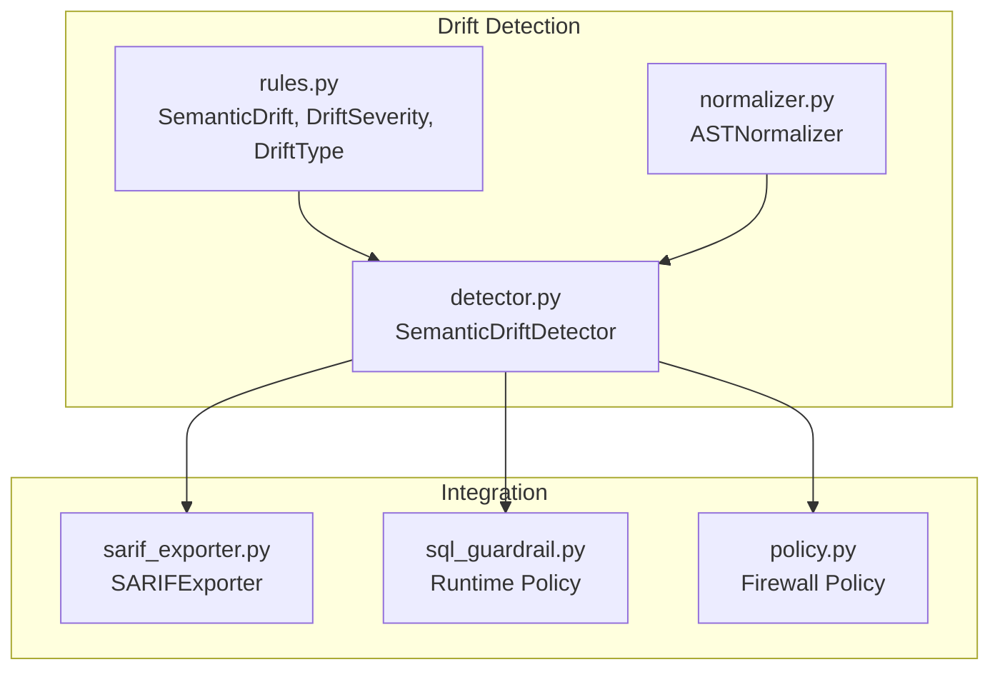
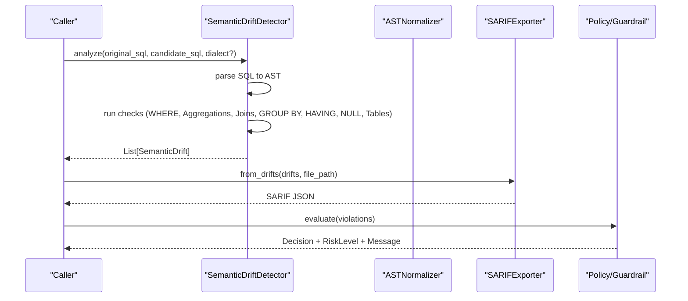
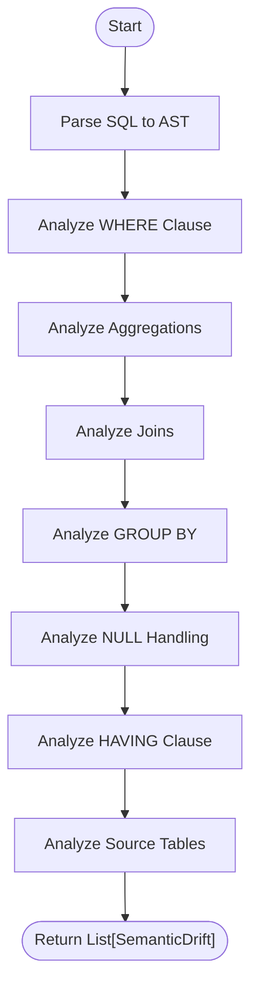
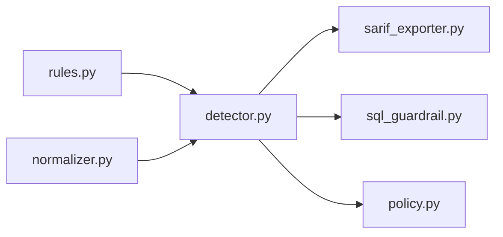

# Drift Rules and Severity Classification

<cite>
**Referenced Files in This Document**
- [rules.py](file://semantic_reliability/testing/drift/rules.py)
- [detector.py](file://semantic_reliability/testing/drift/detector.py)
- [normalizer.py](file://semantic_reliability/testing/drift/normalizer.py)
- [sarif_exporter.py](file://semantic_reliability/harness/sarif_exporter.py)
- [test_drift_detector.py](file://tests/test_drift_detector.py)
- [sql_guardrail.py](file://semantic_reliability/runtime/sql_guardrail.py)
- [policy.py](file://semantic_reliability/firewall/policy.py)
- [__init__.py](file://semantic_reliability/drift/__init__.py)
</cite>

## Table of Contents
1. Introduction
2. Project Structure
3. Core Components
4. Architecture Overview
5. Detailed Component Analysis
6. Dependency Analysis
7. Performance Considerations
8. Troubleshooting Guide
9. Conclusion
10. Appendices

## Introduction
This document explains the drift detection rule system used to compare baseline SQL with candidate SQL and report semantic differences. It focuses on:
- The SemanticDrift model that captures each detected drift
- The DriftSeverity hierarchy from FATAL to LOW (and INFO) and their business impact implications
- The DriftType taxonomy including FILTER_REMOVAL, AGGREGATION_FUNCTION_SHIFT, JOIN_PREDICATE_MUTATION, GRAIN_DRIFT, and others
- How rules evaluate SQL AST components and generate reports
- Examples of rule configuration via SARIF export and severity threshold management in runtime policies
- Relationships between drift types and remediation strategies

## Project Structure
The drift detection subsystem is implemented under testing/drift with supporting exports and integrations:
- Data models and enums for severity and drift types
- A detector that parses SQL into an AST and inspects relational algebra components
- A normalizer that canonicalizes expressions to reduce false positives
- Exporters and policy evaluators that map severities to actionable outputs

**Diagram sources**
- [rules.py:6-41](file://semantic_reliability/testing/drift/rules.py#L6-L41)
- [detector.py:9-46](file://semantic_reliability/testing/drift/detector.py#L9-L46)
- [normalizer.py:6-93](file://semantic_reliability/testing/drift/normalizer.py#L6-L93)
- [sarif_exporter.py:9-100](file://semantic_reliability/harness/sarif_exporter.py#L9-L100)
- [sql_guardrail.py:37-69](file://semantic_reliability/runtime/sql_guardrail.py#L37-L69)
- [policy.py:35-67](file://semantic_reliability/firewall/policy.py#L35-L67)

**Section sources**
- [rules.py:6-41](file://semantic_reliability/testing/drift/rules.py#L6-L41)
- [detector.py:9-46](file://semantic_reliability/testing/drift/detector.py#L9-L46)
- [normalizer.py:6-93](file://semantic_reliability/testing/drift/normalizer.py#L6-L93)
- [sarif_exporter.py:9-100](file://semantic_reliability/harness/sarif_exporter.py#L9-L100)
- [sql_guardrail.py:37-69](file://semantic_reliability/runtime/sql_guardrail.py#L37-L69)
- [policy.py:35-67](file://semantic_reliability/firewall/policy.py#L35-L67)

## Core Components
- SemanticDrift: Captures a single detected drift with severity, type, component context, summary, details, business impact, optional snippets, and remediation guidance.
- DriftSeverity: Enumerates severity levels from FATAL to INFO, enabling consistent classification and downstream gating.
- DriftType: Enumerates specific semantic changes such as filter removal/addition, aggregation shifts, join predicate mutations, grain drift, null handling drift, having filter shift, and table target shift.
- SemanticDriftDetector: Parses baseline and candidate SQL into ASTs and runs a series of targeted checks across WHERE, aggregations, joins, GROUP BY, HAVING, NULL handling, and source tables.
- ASTNormalizer: Canonicalizes boolean chains, unwraps parentheses, and lowercases aliases to avoid cosmetic differences triggering false positives.

**Section sources**
- [rules.py:6-41](file://semantic_reliability/testing/drift/rules.py#L6-L41)
- [detector.py:9-46](file://semantic_reliability/testing/drift/detector.py#L9-L46)
- [normalizer.py:6-93](file://semantic_reliability/testing/drift/normalizer.py#L6-L93)

## Architecture Overview
The detector orchestrates AST-level comparisons and produces a list of SemanticDrift instances. Downstream consumers can:
- Export findings to SARIF for code scanning tools
- Enforce runtime policies that block or require review based on severity thresholds

**Diagram sources**
- [detector.py:12-46](file://semantic_reliability/testing/drift/detector.py#L12-L46)
- [sarif_exporter.py:16-89](file://semantic_reliability/harness/sarif_exporter.py#L16-L89)
- [sql_guardrail.py:37-69](file://semantic_reliability/runtime/sql_guardrail.py#L37-L69)
- [policy.py:35-67](file://semantic_reliability/firewall/policy.py#L35-L67)

## Detailed Component Analysis

### Severity Classification Hierarchy and Business Impact
- FATAL: Highest risk; typically indicates catastrophic data integrity issues (e.g., missing join predicates causing Cartesian products).
- CRITICAL: Significant logic change that alters metric definitions or reporting grain.
- HIGH: Notable changes to filters, aggregations, joins, or source tables that can materially affect results.
- MEDIUM: Moderate risks such as reduced null handling safety.
- LOW: Minor deviations with limited immediate impact.
- INFO: Informational observations that may not require action.

These severities are mapped to standard tooling levels (e.g., SARIF error/warning/note/none) and gate execution in runtime policies.

**Section sources**
- [rules.py:6-13](file://semantic_reliability/testing/drift/rules.py#L6-L13)
- [sarif_exporter.py:26-33](file://semantic_reliability/harness/sarif_exporter.py#L26-L33)
- [sql_guardrail.py:48-69](file://semantic_reliability/runtime/sql_guardrail.py#L48-L69)
- [policy.py:46-67](file://semantic_reliability/firewall/policy.py#L46-L67)

### Drift Types and Rule Evaluation Logic
Each DriftType corresponds to a specific AST inspection path in the detector:

- FILTER_REMOVAL: Detected when a baseline WHERE clause is absent in the candidate. Severity: FATAL. Business impact: unfiltered aggregation inflates metrics. Remediation: restore population constraints or create a dedicated unfiltered model.
- FILTER_ADDITION: New WHERE filters introduced where none existed. Severity: HIGH. Business impact: restricted population reduces volumes. Remediation: confirm intent against business definition.
- SEMANTIC_LOGIC_SHIFT: WHERE predicates changed but still present. Severity: CRITICAL. Business impact: different entities included/excluded. Remediation: verify approved metric update.
- AGGREGATION_FUNCTION_SHIFT: Aggregation functions differ (e.g., SUM vs AVG). Severity: HIGH. Business impact: mathematical computation changed. Remediation: align with canonical formula.
- AGGREGATION_EXPRESSION_SHIFT: Same function but payload expression changed. Severity: HIGH. Business impact: underlying operands modified. Remediation: review arithmetic and CASE conditions.
- JOIN_PREDICATE_MUTATION: Missing ON/USING on non-CROSS joins. Severity: FATAL. Business impact: Cartesian explosion duplicates counts. Remediation: add explicit ON clause.
- JOIN_TYPE_SHIFT: Join count altered. Severity: HIGH. Business impact: cardinality changes, potential fan-out or record loss. Remediation: verify join cardinality.
- GRAIN_DRIFT: GROUP BY dimensions changed. Severity: CRITICAL. Business impact: output grain breaks downstream models. Remediation: restore required grouping dimensions.
- NULL_HANDLING_DRIFT: Fewer COALESCE calls than baseline. Severity: MEDIUM. Business impact: NULL propagation risks. Remediation: retain NULL-safe fallbacks.
- HAVING_FILTER_SHIFT: Post-aggregation filter added/removed/changed. Severity: HIGH. Business impact: group retention altered. Remediation: confirm post-aggregation thresholds.
- TABLE_TARGET_SHIFT: Source tables changed. Severity: HIGH. Business impact: upstream dependency shifts. Remediation: verify lineage and sources.

**Diagram sources**
- [detector.py:12-46](file://semantic_reliability/testing/drift/detector.py#L12-L46)

**Section sources**
- [detector.py:48-245](file://semantic_reliability/testing/drift/detector.py#L48-L245)

### AST Normalization and Equivalence Checking
To prevent false positives from commutative or cosmetic variations:
- Unwraps redundant parentheses
- Flattens and sorts AND/OR chains
- Lowercases alias identifiers
- Compares normalized SQL strings for equivalence

This ensures that logically equivalent predicates are not flagged as drift.

**Section sources**
- [normalizer.py:6-93](file://semantic_reliability/testing/drift/normalizer.py#L6-L93)

### Rule Configuration and Customization
- Built-in rules are defined by DriftType and evaluated automatically by the detector.
- SARIF export maps severities to standard levels (error/warning/note/none), enabling integration with code scanning tools and CI gates.
- Runtime policies can enforce strict mode (block on critical/fatal) or require review.

Example usage patterns:
- Generate SARIF reports from drift results for CI pipelines
- Configure policy evaluation to DENY or REQUIRE_REVIEW based on severity thresholds

**Section sources**
- [sarif_exporter.py:16-89](file://semantic_reliability/harness/sarif_exporter.py#L16-L89)
- [sql_guardrail.py:37-69](file://semantic_reliability/runtime/sql_guardrail.py#L37-L69)
- [policy.py:35-67](file://semantic_reliability/firewall/policy.py#L35-L67)

### Examples and Validation
Tests demonstrate expected behavior for key drift scenarios:
- Filter removal triggers FATAL FILTER_REMOVAL
- Filter logic shift triggers CRITICAL SEMANTIC_LOGIC_SHIFT
- Aggregation function shift triggers HIGH AGGREGATION_FUNCTION_SHIFT
- Grain drift triggers GRAIN_DRIFT
- Missing join predicate triggers FATAL JOIN_PREDICATE_MUTATION
- Identical SQL yields no drift

**Section sources**
- [test_drift_detector.py:17-83](file://tests/test_drift_detector.py#L17-L83)

## Dependency Analysis
The detector depends on sqlglot for AST parsing and uses the normalizer to ensure robust comparisons. Outputs feed into exporters and policy evaluators.

**Diagram sources**
- [rules.py:6-41](file://semantic_reliability/testing/drift/rules.py#L6-L41)
- [detector.py:1-46](file://semantic_reliability/testing/drift/detector.py#L1-L46)
- [normalizer.py:1-93](file://semantic_reliability/testing/drift/normalizer.py#L1-L93)
- [sarif_exporter.py:1-100](file://semantic_reliability/harness/sarif_exporter.py#L1-L100)
- [sql_guardrail.py:37-69](file://semantic_reliability/runtime/sql_guardrail.py#L37-L69)
- [policy.py:35-67](file://semantic_reliability/firewall/policy.py#L35-L67)

**Section sources**
- [detector.py:1-46](file://semantic_reliability/testing/drift/detector.py#L1-L46)
- [sarif_exporter.py:1-100](file://semantic_reliability/harness/sarif_exporter.py#L1-L100)
- [sql_guardrail.py:37-69](file://semantic_reliability/runtime/sql_guardrail.py#L37-L69)
- [policy.py:35-67](file://semantic_reliability/firewall/policy.py#L35-L67)

## Performance Considerations
- AST parsing and traversal scale with query complexity; large queries increase node counts.
- Normalization flattens boolean chains and unwraps parentheses; this adds overhead but reduces false positives.
- Prefer minimal dialect-specific parsing options to avoid unnecessary transformations.
- Batch multiple comparisons if possible to amortize parser initialization costs.

[No sources needed since this section provides general guidance]

## Troubleshooting Guide
Common issues and resolutions:
- False positives due to formatting or commutative operators: rely on AST normalization; ensure predicates are logically equivalent after normalization.
- Unexpected drift on aliases: aliases are lowercased during normalization; verify case-insensitive expectations.
- High-severity blocks in CI: adjust policy thresholds or fix root causes indicated by drift details and remediation hints.
- Missing join predicates: always include explicit ON/USING clauses to avoid FATAL detections.

**Section sources**
- [normalizer.py:17-93](file://semantic_reliability/testing/drift/normalizer.py#L17-L93)
- [detector.py:133-164](file://semantic_reliability/testing/drift/detector.py#L133-L164)
- [sarif_exporter.py:26-54](file://semantic_reliability/harness/sarif_exporter.py#L26-L54)
- [sql_guardrail.py:48-69](file://semantic_reliability/runtime/sql_guardrail.py#L48-L69)
- [policy.py:46-67](file://semantic_reliability/firewall/policy.py#L46-L67)

## Conclusion
The drift detection system provides a robust, AST-based approach to identifying semantic changes in SQL with clear severity classifications and actionable remediation guidance. By combining precise rule evaluations, normalization for stability, and integration with reporting and policy enforcement, teams can maintain metric reliability and prevent silent regressions.

[No sources needed since this section summarizes without analyzing specific files]

## Appendices

### Relationship Between Drift Types and Remediation Strategies
- FILTER_REMOVAL → Restore population constraints or create a dedicated unfiltered model
- FILTER_ADDITION → Confirm filtering intent against business definition
- SEMANTIC_LOGIC_SHIFT → Verify approved metric update
- AGGREGATION_FUNCTION_SHIFT / AGGREGATION_EXPRESSION_SHIFT → Align with canonical formula and review operands
- JOIN_PREDICATE_MUTATION → Add explicit ON clause to avoid Cartesian explosion
- JOIN_TYPE_SHIFT → Verify join cardinality
- GRAIN_DRIFT → Restore required grouping dimensions
- NULL_HANDLING_DRIFT → Retain NULL-safe fallbacks
- HAVING_FILTER_SHIFT → Confirm post-aggregation thresholds
- TABLE_TARGET_SHIFT → Verify upstream model lineage and sources

**Section sources**
- [detector.py:48-245](file://semantic_reliability/testing/drift/detector.py#L48-L245)

### Public API Surface
The drift module exposes core classes for import and reuse:
- SemanticDrift, DriftSeverity, DriftType, SemanticDriftDetector

**Section sources**
- [__init__.py:1-4](file://semantic_reliability/drift/__init__.py#L1-L4)