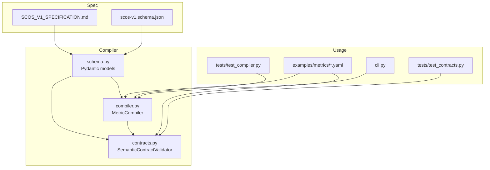
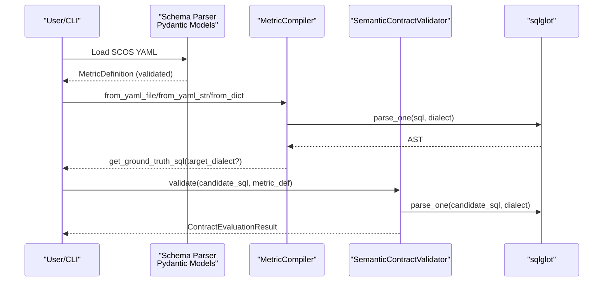
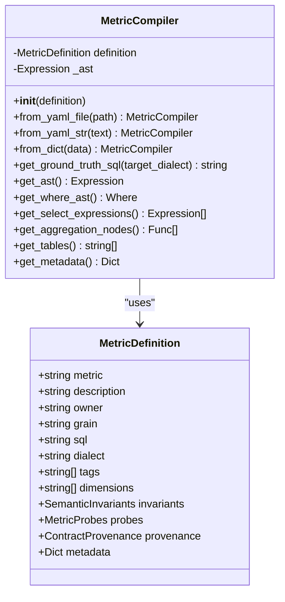
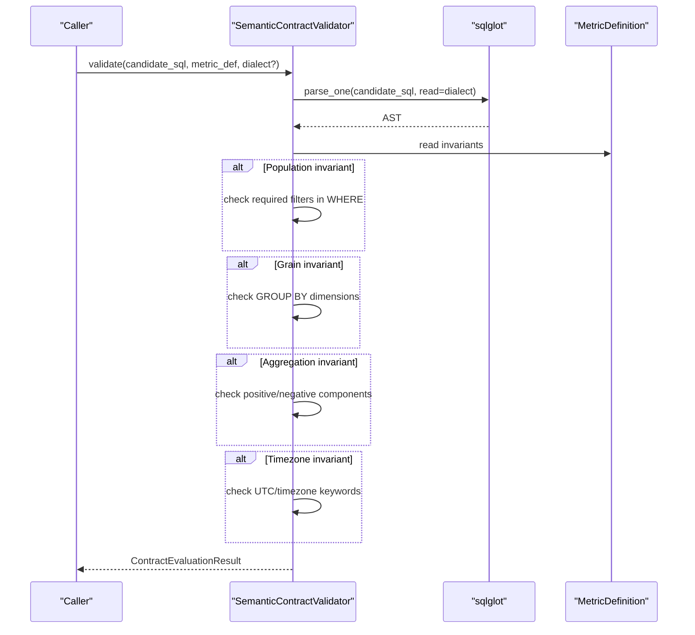
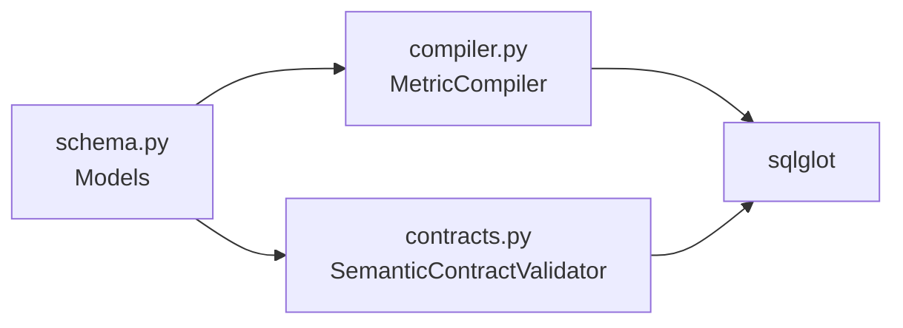

# Metric Compiler

<cite>
**Referenced Files in This Document**
- [compiler.py](file://semantic_reliability/compiler/compiler.py)
- [contracts.py](file://semantic_reliability/compiler/contracts.py)
- [schema.py](file://semantic_reliability/compiler/schema.py)
- [SCOS_V1_SPECIFICATION.md](file://spec/SCOS_V1_SPECIFICATION.md)
- [scos-v1.schema.json](file://spec/scos-v1.schema.json)
- [net_revenue_contract.yaml](file://examples/metrics/net_revenue_contract.yaml)
- [monthly_active_users.yaml](file://examples/metrics/monthly_active_users.yaml)
- [test_compiler.py](file://tests/test_compiler.py)
- [test_contracts.py](file://tests/test_contracts.py)
- [cli.py](file://semantic_reliability/cli.py)
</cite>

## Table of Contents
1. [Introduction](#introduction)
2. [Project Structure](#project-structure)
3. [Core Components](#core-components)
4. [Architecture Overview](#architecture-overview)
5. [Detailed Component Analysis](#detailed-component-analysis)
6. [Dependency Analysis](#dependency-analysis)
7. [Performance Considerations](#performance-considerations)
8. [Troubleshooting Guide](#troubleshooting-guide)
9. [Conclusion](#conclusion)
10. [Appendices](#appendices)

## Introduction
This document explains the MetricCompiler and related compilation functionality that transforms SCOS YAML metric contracts into executable SQL across multiple dialects, validates candidate SQL against semantic invariants, and provides utilities to inspect compiled ASTs. It also documents the ContractValidator for enforcing policy-driven semantic rules and the SchemaParser (Pydantic models) used to parse and validate SCOS YAML definitions. The guide includes examples, best practices, and version compatibility notes based on the SCOS v1 specification.

## Project Structure
The compiler lives under semantic_reliability/compiler and is composed of:
- schema.py: Pydantic models defining SCOS contract structure and semantic invariants/probes.
- compiler.py: MetricCompiler class that parses canonical SQL into an AST and supports multi-dialect transpilation.
- contracts.py: SemanticContractValidator that checks candidate SQL against declared invariants.

Supporting files include:
- spec/SCOS_V1_SPECIFICATION.md and scos-v1.schema.json: The SCOS standard and JSON schema.
- examples/metrics/*.yaml: Example metric contracts demonstrating real-world usage.
- tests/*: Unit tests validating compiler behavior and contract validation.
- cli.py: CLI commands that use MetricCompiler for compilation and reporting.

**Diagram sources**
- [compiler.py:10-72](file://semantic_reliability/compiler/compiler.py#L10-L72)
- [contracts.py:26-135](file://semantic_reliability/compiler/contracts.py#L26-L135)
- [schema.py:5-98](file://semantic_reliability/compiler/schema.py#L5-L98)
- [SCOS_V1_SPECIFICATION.md:1-134](file://spec/SCOS_V1_SPECIFICATION.md#L1-L134)
- [scos-v1.schema.json:1-163](file://spec/scos-v1.schema.json#L1-L163)
- [net_revenue_contract.yaml:1-39](file://examples/metrics/net_revenue_contract.yaml#L1-L39)
- [monthly_active_users.yaml:1-21](file://examples/metrics/monthly_active_users.yaml#L1-L21)
- [test_compiler.py:1-60](file://tests/test_compiler.py#L1-L60)
- [test_contracts.py:1-92](file://tests/test_contracts.py#L1-L92)
- [cli.py:552-583](file://semantic_reliability/cli.py#L552-L583)

**Section sources**
- [compiler.py:10-72](file://semantic_reliability/compiler/compiler.py#L10-L72)
- [contracts.py:26-135](file://semantic_reliability/compiler/contracts.py#L26-L135)
- [schema.py:5-98](file://semantic_reliability/compiler/schema.py#L5-L98)
- [SCOS_V1_SPECIFICATION.md:1-134](file://spec/SCOS_V1_SPECIFICATION.md#L1-L134)
- [scos-v1.schema.json:1-163](file://spec/scos-v1.schema.json#L1-L163)
- [net_revenue_contract.yaml:1-39](file://examples/metrics/net_revenue_contract.yaml#L1-L39)
- [monthly_active_users.yaml:1-21](file://examples/metrics/monthly_active_users.yaml#L1-L21)
- [test_compiler.py:1-60](file://tests/test_compiler.py#L1-L60)
- [test_contracts.py:1-92](file://tests/test_contracts.py#L1-L92)
- [cli.py:552-583](file://semantic_reliability/cli.py#L552-L583)

## Core Components
- MetricDefinition and related models define the contract schema and semantic invariants/probes. They are validated via Pydantic at load time.
- MetricCompiler compiles a MetricDefinition’s canonical SQL into an AST using sqlglot and can transpile to other dialects.
- SemanticContractValidator enforces population, grain, aggregation, and timezone invariants defined in the contract against candidate SQL.

Key responsibilities:
- Parse and validate SCOS YAML into strongly-typed models.
- Build and expose AST nodes for analysis.
- Generate formatted SQL for the canonical or target dialect.
- Validate candidate SQL against declared invariants and return structured results.

**Section sources**
- [schema.py:5-98](file://semantic_reliability/compiler/schema.py#L5-L98)
- [compiler.py:10-72](file://semantic_reliability/compiler/compiler.py#L10-L72)
- [contracts.py:26-135](file://semantic_reliability/compiler/contracts.py#L26-L135)

## Architecture Overview
The compilation pipeline starts with a SCOS YAML contract, which is parsed into a MetricDefinition. MetricCompiler then parses the canonical SQL into an AST and optionally transpiles it to another dialect. Candidate SQL can be validated against the contract’s invariants using SemanticContractValidator.

**Diagram sources**
- [compiler.py:13-47](file://semantic_reliability/compiler/compiler.py#L13-L47)
- [contracts.py:29-135](file://semantic_reliability/compiler/contracts.py#L29-L135)
- [schema.py:83-98](file://semantic_reliability/compiler/schema.py#L83-L98)

## Detailed Component Analysis

### MetricCompiler
Purpose:
- Initialize from YAML, string, or dict by constructing a MetricDefinition.
- Parse canonical SQL into an AST using the specified dialect.
- Provide methods to extract metadata, tables, aggregations, WHERE clauses, and select expressions.
- Transpile the canonical SQL to another dialect when requested.

Initialization parameters:
- definition: MetricDefinition containing metric identity, owner, grain, canonical SQL, dialect, tags, dimensions, invariants, probes, provenance, and metadata.

Compilation process:
- _compile_ast() uses sqlglot.parse_one with the contract’s dialect to build an AST.
- get_ground_truth_sql() returns pretty-printed SQL; if target_dialect differs, it transpiles via sqlglot.sql(dialect=target_dialect).

AST inspection:
- get_where_ast(): finds WHERE node.
- get_select_expressions(): lists SELECT expressions.
- get_aggregation_nodes(): lists aggregate functions.
- get_tables(): lists referenced tables.

Error handling:
- If parsing fails, raises ValueError with context about the metric name.

Examples:
- From YAML file: see CLI usage path.
- From YAML string/dict: unit tests demonstrate creation and basic assertions.
- Multi-dialect transpilation: test shows generating Snowflake SQL from a Postgres contract.

Best practices:
- Always set a correct dialect in the contract to ensure accurate AST parsing and transpilation.
- Use get_metadata() to persist non-SQL contract attributes alongside generated artifacts.

**Section sources**
- [compiler.py:10-72](file://semantic_reliability/compiler/compiler.py#L10-L72)
- [test_compiler.py:23-59](file://tests/test_compiler.py#L23-L59)
- [cli.py:571-583](file://semantic_reliability/cli.py#L571-L583)

#### Class Diagram: MetricCompiler and Dependencies

**Diagram sources**
- [compiler.py:10-72](file://semantic_reliability/compiler/compiler.py#L10-L72)
- [schema.py:83-98](file://semantic_reliability/compiler/schema.py#L83-L98)

### SemanticContractValidator
Purpose:
- Validate candidate SQL against declared semantic invariants in the contract.
- Enforce population filters, grouping grain, aggregation components, and timezone requirements.

Validation flow:
- Parses candidate SQL into AST using the contract’s dialect (or provided dialect).
- Checks required filters in WHERE clause presence.
- Ensures GROUP BY includes required dimensions.
- Verifies positive/negative aggregation components appear in the query text.
- Validates timezone constraints (e.g., UTC requirement).

Results:
- Returns ContractEvaluationResult with passed flag, metric name, list of ContractViolation objects, and count of evaluated invariants.

Error handling:
- Invariant checks are robust to minor formatting differences; violations include remediation guidance.

Examples:
- Passing contract validation for ground-truth SQL.
- Detecting missing required filter, dropped grouping dimension, and missing negative component.

**Section sources**
- [contracts.py:26-135](file://semantic_reliability/compiler/contracts.py#L26-L135)
- [test_contracts.py:36-92](file://tests/test_contracts.py#L36-L92)

#### Sequence Diagram: Contract Validation Flow

**Diagram sources**
- [contracts.py:29-135](file://semantic_reliability/compiler/contracts.py#L29-L135)
- [schema.py:31-37](file://semantic_reliability/compiler/schema.py#L31-L37)

### SchemaParser (Pydantic Models)
Purpose:
- Define and validate SCOS YAML structures including identity fields, canonical SQL, dialect, tags, dimensions, invariants, probes, provenance, and metadata.
- Provide typed accessors for semantic invariants and statistical probes.

Key models:
- MetricDefinition: top-level contract model.
- SemanticInvariants: composition of population, grain, aggregation, units, and time invariants.
- PopulationInvariant, GrainInvariant, AggregationInvariant, UnitInvariant, TimeInvariant: specific rule categories.
- MetricProbes, PopulationProbe, ImplicationProbe, NullDriftProbe: runtime observability expectations.
- ContractProvenance: verifiable upstream sourcing metadata.

Validation:
- Pydantic enforces types, defaults, and constraints during construction.
- SCOS v1 schema defines additional structural constraints and allowed dialect values.

**Section sources**
- [schema.py:5-98](file://semantic_reliability/compiler/schema.py#L5-L98)
- [scos-v1.schema.json:1-163](file://spec/scos-v1.schema.json#L1-L163)

### Compilation Process: SCOS YAML to Executable SQL
End-to-end flow:
1. Load SCOS YAML into MetricDefinition (schema validation).
2. MetricCompiler parses canonical SQL into AST using the contract’s dialect.
3. Optionally transpile AST to target dialect for execution or testing.
4. Validate candidate SQL against invariants to ensure semantic compliance.

Multi-dialect generation:
- Use get_ground_truth_sql(target_dialect=...) to produce dialect-specific SQL while preserving semantics.

Examples:
- See example contracts for net_revenue and monthly_active_users showing different dialects and invariants.
- Tests demonstrate transpilation to Snowflake and error handling for invalid SQL.

**Section sources**
- [compiler.py:13-47](file://semantic_reliability/compiler/compiler.py#L13-L47)
- [net_revenue_contract.yaml:1-39](file://examples/metrics/net_revenue_contract.yaml#L1-L39)
- [monthly_active_users.yaml:1-21](file://examples/metrics/monthly_active_users.yaml#L1-L21)
- [test_compiler.py:45-59](file://tests/test_compiler.py#L45-L59)

## Dependency Analysis
- MetricCompiler depends on sqlglot for AST parsing and transpilation and on MetricDefinition for contract data.
- SemanticContractValidator depends on sqlglot and MetricDefinition to enforce invariants.
- Both rely on Pydantic models for schema validation.

**Diagram sources**
- [compiler.py:1-72](file://semantic_reliability/compiler/compiler.py#L1-L72)
- [contracts.py:1-135](file://semantic_reliability/compiler/contracts.py#L1-L135)
- [schema.py:1-98](file://semantic_reliability/compiler/schema.py#L1-L98)

**Section sources**
- [compiler.py:1-72](file://semantic_reliability/compiler/compiler.py#L1-L72)
- [contracts.py:1-135](file://semantic_reliability/compiler/contracts.py#L1-L135)
- [schema.py:1-98](file://semantic_reliability/compiler/schema.py#L1-L98)

## Performance Considerations
- AST parsing and transpilation are performed per metric; cache MetricCompiler instances where possible to avoid repeated parsing.
- Prefer reusing the same MetricDefinition across validations to minimize overhead.
- For large-scale evaluations, batch candidate SQL validations and reuse dialect settings.
- Keep canonical SQL concise and well-structured to reduce AST complexity and improve transpilation accuracy.

[No sources needed since this section provides general guidance]

## Troubleshooting Guide
Common issues and resolutions:
- Invalid canonical SQL: MetricCompiler raises ValueError during initialization. Ensure the SQL is valid for the specified dialect.
- Missing required filters: ContractValidator reports CRITICAL violations; add the required predicates to the WHERE clause.
- Dropped grouping dimensions: Violation indicates missing GROUP BY elements; include all required dimensions.
- Missing aggregation components: Violation indicates omitted positive/negative components; ensure they are included in calculations.
- Timezone mismatch: If UTC is required, avoid non-UTC timezone conversions; align timestamps to UTC.

Operational tips:
- Use get_metadata() to capture contract context alongside generated SQL for traceability.
- Leverage CLI compile command to quickly generate dialect-specific SQL for review.

**Section sources**
- [compiler.py:37-47](file://semantic_reliability/compiler/compiler.py#L37-L47)
- [contracts.py:44-128](file://semantic_reliability/compiler/contracts.py#L44-L128)
- [cli.py:571-583](file://semantic_reliability/cli.py#L571-L583)

## Conclusion
The MetricCompiler and associated components provide a robust foundation for compiling SCOS YAML contracts into executable SQL, validating candidate queries against semantic invariants, and supporting multi-dialect transpilation. By adhering to the SCOS v1 specification and following best practices for contract authoring, teams can ensure consistent, governed metric computation across environments and tools.

[No sources needed since this section summarizes without analyzing specific files]

## Appendices

### Examples: Contract Compilation and Multi-Dialect Generation
- Net revenue contract demonstrates population filters, grain dimensions, aggregation components, units, and timezone constraints.
- Monthly active users contract illustrates a different dialect and simpler invariants.

Use cases:
- Compile canonical SQL to a target dialect for testing or deployment.
- Validate candidate SQL produced by code changes or AI agents against invariants before execution.

**Section sources**
- [net_revenue_contract.yaml:1-39](file://examples/metrics/net_revenue_contract.yaml#L1-L39)
- [monthly_active_users.yaml:1-21](file://examples/metrics/monthly_active_users.yaml#L1-L21)
- [test_compiler.py:23-59](file://tests/test_compiler.py#L23-L59)
- [test_contracts.py:36-92](file://tests/test_contracts.py#L36-L92)

### Best Practices for Contract Authoring and Optimization
- Specify the correct dialect to ensure accurate AST parsing and transpilation.
- Define precise invariants for population, grain, aggregation, and time to prevent semantic drift.
- Include meaningful descriptions, owners, and tags for governance and discoverability.
- Keep canonical SQL readable and normalized to aid transpilation and maintenance.
- Use probes to monitor runtime data quality and detect anomalies early.

[No sources needed since this section provides general guidance]

### Version Compatibility and Migration Considerations
- SCOS v1.0.0 requires scos_version: "1.0.0" and follows the JSON schema for strict validation.
- Dialect enum values are constrained; ensure contracts use supported dialects.
- When migrating between SCOS versions, update scos_version and adjust invariants/probes to match new capabilities.
- Maintain backward compatibility by keeping canonical SQL stable and documenting breaking changes in contract metadata.

**Section sources**
- [SCOS_V1_SPECIFICATION.md:92-134](file://spec/SCOS_V1_SPECIFICATION.md#L92-L134)
- [scos-v1.schema.json:8-51](file://spec/scos-v1.schema.json#L8-L51)