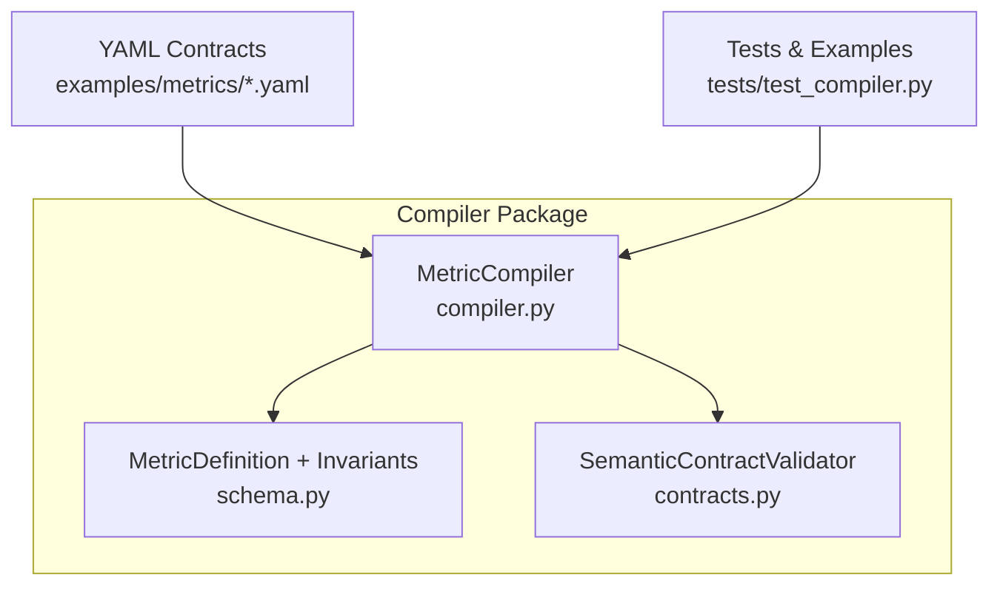
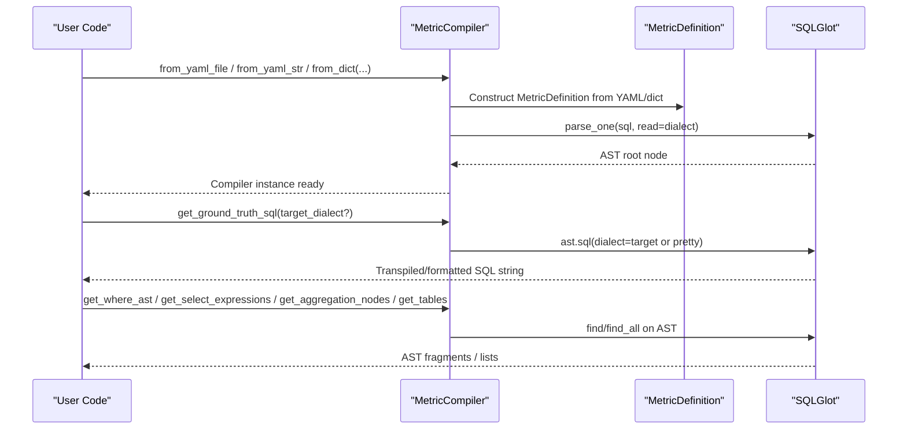
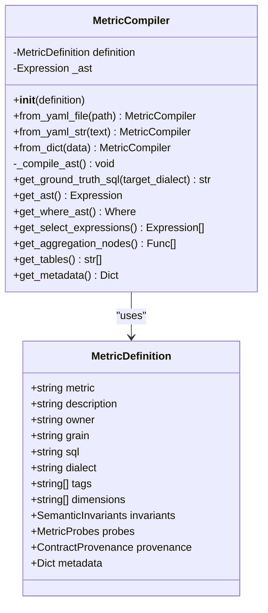
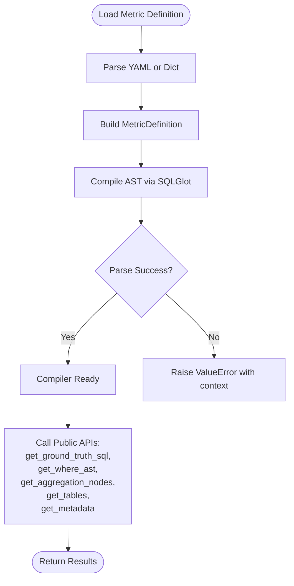
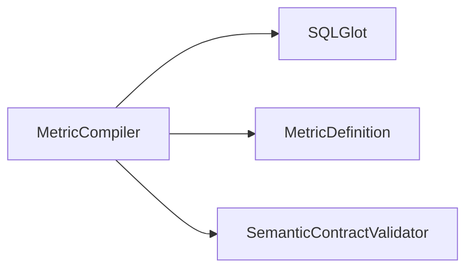

# MetricCompiler Core

<cite>
**Referenced Files in This Document**
- [compiler.py](file://semantic_reliability/compiler/compiler.py)
- [schema.py](file://semantic_reliability/compiler/schema.py)
- [contracts.py](file://semantic_reliability/compiler/contracts.py)
- [test_compiler.py](file://tests/test_compiler.py)
- [net_revenue.yaml](file://examples/metrics/net_revenue.yaml)
- [monthly_active_users.yaml](file://examples/metrics/monthly_active_users.yaml)
</cite>

## Table of Contents
1. [Introduction](#introduction)
2. [Project Structure](#project-structure)
3. [Core Components](#core-components)
4. [Architecture Overview](#architecture-overview)
5. [Detailed Component Analysis](#detailed-component-analysis)
6. [Dependency Analysis](#dependency-analysis)
7. [Performance Considerations](#performance-considerations)
8. [Troubleshooting Guide](#troubleshooting-guide)
9. [Conclusion](#conclusion)
10. [Appendices](#appendices)

## Introduction
This document provides comprehensive documentation for the MetricCompiler class, the central component of the compilation pipeline that transforms canonical business metric definitions into SQL ASTs and exposes utilities for transpilation, analysis, and metadata access. It covers initialization methods, internal AST compilation using SQLGlot, multi-dialect transpilation, and all public APIs for extracting WHERE clauses, SELECT expressions, aggregation nodes, table dependencies, and contract metadata. Practical usage patterns are illustrated with examples from YAML contracts and tests.

## Project Structure
The MetricCompiler lives in the compiler package alongside schema models and contract validation utilities. The key files are:
- compiler.py: MetricCompiler implementation
- schema.py: Pydantic models defining MetricDefinition and semantic invariants
- contracts.py: SemanticContractValidator for policy-driven checks against declared invariants
- tests/test_compiler.py: Usage examples and assertions demonstrating initialization, transpilation, and error handling
- examples/metrics/*.yaml: Real-world metric contracts used as inputs to the compiler

**Diagram sources**
- [compiler.py:10-71](file://semantic_reliability/compiler/compiler.py#L10-L71)
- [schema.py:83-97](file://semantic_reliability/compiler/schema.py#L83-L97)
- [contracts.py:26-135](file://semantic_reliability/compiler/contracts.py#L26-L135)

**Section sources**
- [compiler.py:10-71](file://semantic_reliability/compiler/compiler.py#L10-L71)
- [schema.py:83-97](file://semantic_reliability/compiler/schema.py#L83-L97)
- [contracts.py:26-135](file://semantic_reliability/compiler/contracts.py#L26-L135)
- [test_compiler.py:1-60](file://tests/test_compiler.py#L1-L60)
- [net_revenue.yaml:1-22](file://examples/metrics/net_revenue.yaml#L1-L22)
- [monthly_active_users.yaml:1-21](file://examples/metrics/monthly_active_users.yaml#L1-L21)

## Core Components
- MetricCompiler: Parses and compiles a MetricDefinition into an SQL AST using SQLGlot; provides transpilation and analysis APIs.
- MetricDefinition: Pydantic model describing the canonical metric (name, owner, grain, SQL, dialect, tags, dimensions, invariants, probes, provenance, metadata).
- SemanticInvariants and related models: Declarative policies for population filters, grain grouping, aggregation components, units, and time constraints.
- SemanticContractValidator: Validates candidate SQL against declared invariants to detect violations and suggest remediation.

Key responsibilities:
- Initialization via multiple constructors (from_yaml_file, from_yaml_str, from_dict)
- Internal AST compilation with SQLGlot and dialect-aware parsing
- Multi-dialect SQL generation via transpilation
- AST introspection for WHERE, SELECT, aggregations, tables
- Metadata extraction excluding raw SQL

**Section sources**
- [compiler.py:10-71](file://semantic_reliability/compiler/compiler.py#L10-L71)
- [schema.py:5-97](file://semantic_reliability/compiler/schema.py#L5-L97)
- [contracts.py:26-135](file://semantic_reliability/compiler/contracts.py#L26-L135)

## Architecture Overview
The MetricCompiler encapsulates a single responsibility: compile a canonical metric definition into an AST and expose it for analysis and transpilation.

**Diagram sources**
- [compiler.py:13-71](file://semantic_reliability/compiler/compiler.py#L13-L71)
- [schema.py:83-97](file://semantic_reliability/compiler/schema.py#L83-L97)

## Detailed Component Analysis

### MetricCompiler Class
Purpose:
- Parse and validate canonical SQL into an AST using SQLGlot based on the declared dialect.
- Provide APIs to generate formatted SQL for different database dialects and to inspect the AST for analysis.

Initialization methods:
- __init__(definition): Stores MetricDefinition and triggers AST compilation.
- from_yaml_file(path): Loads YAML file, constructs MetricDefinition, returns compiled compiler.
- from_yaml_str(text): Parses YAML string, constructs MetricDefinition, returns compiled compiler.
- from_dict(data): Constructs MetricDefinition directly from dict, returns compiled compiler.

Internal compilation:
- _compile_ast(): Uses sqlglot.parse_one with the metric’s dialect; raises ValueError with context if parsing fails.

Public APIs:
- get_ground_truth_sql(target_dialect=None): Returns pretty-formatted SQL; transpiles to target_dialect when provided and differs from source dialect.
- get_ast(): Returns a copy of the root AST node for safe manipulation.
- get_where_ast(): Finds and returns the WHERE clause node if present.
- get_select_expressions(): Returns all SELECT expression nodes found in the AST.
- get_aggregation_nodes(): Returns all aggregation function nodes (SUM, AVG, COUNT, etc.).
- get_tables(): Returns names of all referenced tables in FROM/JOIN clauses.
- get_metadata(): Returns non-SQL metadata by dumping MetricDefinition excluding the raw SQL field.

Error handling:
- Parsing errors during AST compilation raise ValueError with a message indicating the metric name and underlying parse exception.

Practical usage patterns:
- Load metrics from YAML contracts and generate SQL for different databases.
- Inspect WHERE clauses and aggregations to validate query structure.
- Extract table dependencies for data lineage or permission checks.
- Retrieve metadata for governance and reporting without exposing raw SQL.

**Diagram sources**
- [compiler.py:10-71](file://semantic_reliability/compiler/compiler.py#L10-L71)
- [schema.py:83-97](file://semantic_reliability/compiler/schema.py#L83-L97)

**Section sources**
- [compiler.py:13-71](file://semantic_reliability/compiler/compiler.py#L13-L71)
- [test_compiler.py:23-59](file://tests/test_compiler.py#L23-L59)

### Schema Models and Invariants
- MetricDefinition: Central contract describing the canonical metric, including SQL and dialect.
- SemanticInvariants: Declares required filters, grouping dimensions, aggregation components, units, and time constraints.
- Supporting models: PopulationInvariant, GrainInvariant, AggregationInvariant, UnitInvariant, TimeInvariant, MetricProbes, ContractProvenance.

These models enable declarative policy enforcement and provide rich metadata for governance and observability.

**Section sources**
- [schema.py:5-97](file://semantic_reliability/compiler/schema.py#L5-L97)

### Contract Validation
SemanticContractValidator evaluates candidate SQL against declared invariants:
- Population invariant: Checks presence of required filters in WHERE.
- Grain invariant: Ensures GROUP BY includes required dimensions.
- Aggregation invariant: Verifies positive/negative components appear in net calculations.
- Timezone invariant: Enforces UTC alignment when required.

Returns ContractEvaluationResult with pass/fail status, list of violations, and counts of rules checked.

**Section sources**
- [contracts.py:26-135](file://semantic_reliability/compiler/contracts.py#L26-L135)

### Data Flow and Processing Logic

**Diagram sources**
- [compiler.py:13-71](file://semantic_reliability/compiler/compiler.py#L13-L71)

**Section sources**
- [compiler.py:13-71](file://semantic_reliability/compiler/compiler.py#L13-L71)

## Dependency Analysis
MetricCompiler depends on:
- SQLGlot for parsing and transpiling SQL across dialects.
- MetricDefinition for structured configuration and metadata.
- Optional integration with SemanticContractValidator for policy checks.

**Diagram sources**
- [compiler.py:1-71](file://semantic_reliability/compiler/compiler.py#L1-L71)
- [schema.py:83-97](file://semantic_reliability/compiler/schema.py#L83-L97)
- [contracts.py:26-135](file://semantic_reliability/compiler/contracts.py#L26-L135)

**Section sources**
- [compiler.py:1-71](file://semantic_reliability/compiler/compiler.py#L1-L71)
- [schema.py:83-97](file://semantic_reliability/compiler/schema.py#L83-L97)
- [contracts.py:26-135](file://semantic_reliability/compiler/contracts.py#L26-L135)

## Performance Considerations
- AST Compilation: Parsing occurs once per MetricDefinition during initialization. For large-scale tasks, reuse MetricCompiler instances to avoid repeated parsing overhead.
- Transpilation: get_ground_truth_sql performs dialect conversion only when target_dialect differs from the source dialect; otherwise returns formatted SQL efficiently.
- AST Introspection: Methods like get_where_ast, get_aggregation_nodes, and get_tables traverse the AST using SQLGlot’s find/find_all; these operations are generally fast but can be optimized by caching results if repeatedly accessed.
- Memory: get_ast returns a copy of the root node to prevent accidental mutation; ensure copies are released appropriately in long-running processes.
- Error Handling: Early failure on invalid SQL prevents downstream processing costs; wrap initialization in try/except to handle malformed contracts gracefully.

[No sources needed since this section provides general guidance]

## Troubleshooting Guide
Common issues and strategies:
- Invalid SQL in contracts: Raises ValueError during AST compilation with context about the metric name and parse error. Validate SQL syntax before loading contracts.
- Dialect mismatches: Ensure the declared dialect matches the actual SQL syntax; use get_ground_truth_sql with target_dialect to generate compatible SQL for other databases.
- Missing WHERE or GROUP BY: Use get_where_ast and inspect aggregation nodes to verify structural requirements; integrate with SemanticContractValidator to enforce invariants.
- Large datasets: Cache compiled compilers and their metadata; avoid re-parsing identical contracts; batch transpilations where possible.

**Section sources**
- [compiler.py:37-41](file://semantic_reliability/compiler/compiler.py#L37-L41)
- [test_compiler.py:51-59](file://tests/test_compiler.py#L51-L59)

## Conclusion
MetricCompiler is a focused, robust component that compiles canonical metric definitions into SQL ASTs and exposes powerful APIs for transpilation and analysis. By leveraging SQLGlot and declarative invariants, it supports multi-dialect SQL generation, deep AST inspection, and policy-driven validation. Proper initialization, error handling, and performance practices ensure scalability and reliability in large-scale compilation tasks.

[No sources needed since this section summarizes without analyzing specific files]

## Appendices

### Practical Examples

- Loading a metric from YAML and generating SQL:
  - Use from_yaml_file or from_yaml_str to create a MetricCompiler instance.
  - Call get_ground_truth_sql to retrieve formatted SQL; optionally specify target_dialect for transpilation.

- Generating SQL for different dialects:
  - Example: Load a Postgres metric and transpile to Snowflake using get_ground_truth_sql(target_dialect="snowflake").

- AST manipulation patterns:
  - Access WHERE clause via get_where_ast.
  - Extract aggregation functions via get_aggregation_nodes.
  - Discover table dependencies via get_tables.
  - Retrieve metadata via get_metadata for governance and reporting.

- Contract validation:
  - Use SemanticContractValidator.validate(candidate_sql, metric_def) to check compliance with declared invariants and receive actionable violations.

**Section sources**
- [test_compiler.py:23-48](file://tests/test_compiler.py#L23-L48)
- [net_revenue.yaml:1-22](file://examples/metrics/net_revenue.yaml#L1-L22)
- [monthly_active_users.yaml:1-21](file://examples/metrics/monthly_active_users.yaml#L1-L21)
- [contracts.py:26-135](file://semantic_reliability/compiler/contracts.py#L26-L135)