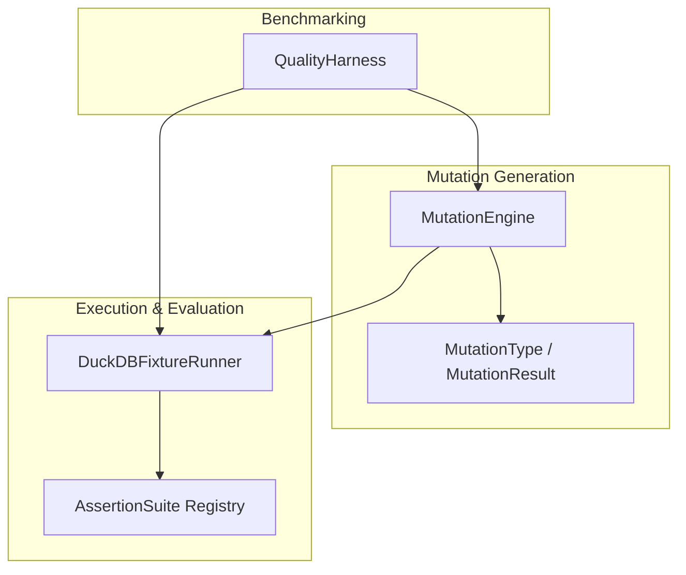
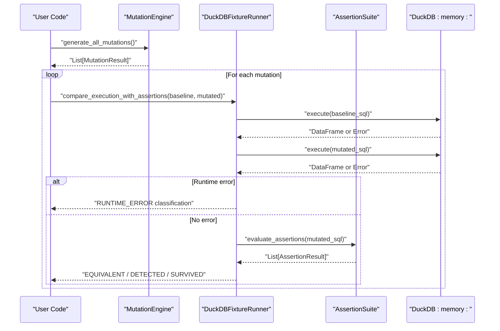
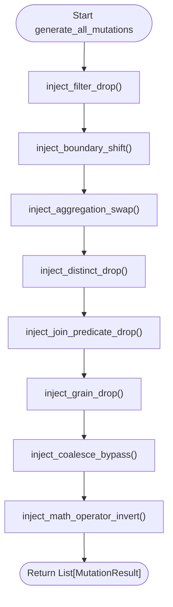
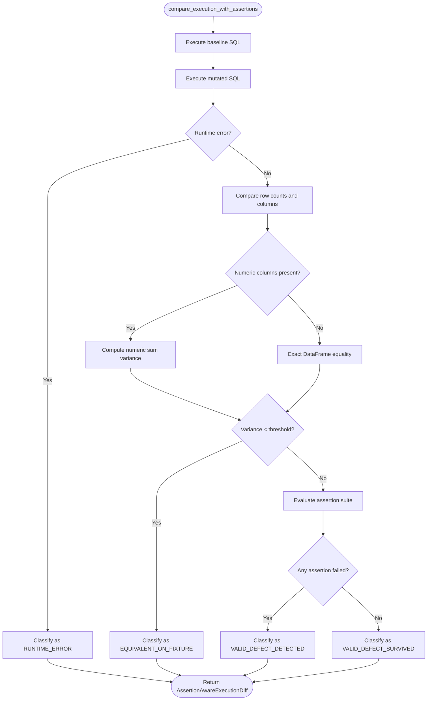
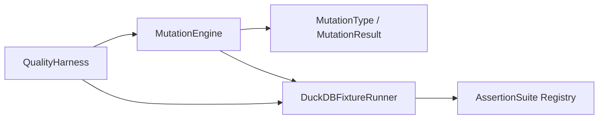

# Mutation Engine

<cite>
**Referenced Files in This Document**
- [engine.py](file://semantic_reliability/testing/mutations/engine.py)
- [mutators.py](file://semantic_reliability/testing/mutations/mutators.py)
- [duckdb_runner.py](file://semantic_reliability/harness/duckdb_runner.py)
- [quality_harness.py](file://semantic_reliability/harness/quality_harness.py)
- [registry.py](file://semantic_reliability/assertions/registry.py)
- [test_mutations.py](file://tests/test_mutations.py)
- [test_duckdb_runner.py](file://tests/test_duckdb_runner.py)
</cite>

## Table of Contents
1. [Introduction](#introduction)
2. [Project Structure](#project-structure)
3. [Core Components](#core-components)
4. [Architecture Overview](#architecture-overview)
5. [Detailed Component Analysis](#detailed-component-analysis)
6. [Dependency Analysis](#dependency-analysis)
7. [Performance Considerations](#performance-considerations)
8. [Troubleshooting Guide](#troubleshooting-guide)
9. [Conclusion](#conclusion)
10. [Appendices](#appendices)

## Introduction
This document explains the MutationEngine class and the surrounding mutation testing framework for SQL models. It covers:
- Initialization parameters and how to configure mutators, execution strategies, and result collection
- The mutation generation process across multiple SQL operators (filter, boundary, aggregation, distinct, join, grain, coalesce, arithmetic)
- Execution of mutations in isolated environments using DuckDB
- Extensibility via a registry-like pattern for assertions and test suites
- End-to-end examples for creating, executing, and analyzing mutation tests
- Best practices for writing effective mutation tests and optimizing performance

## Project Structure
The mutation testing capability is implemented across a small set of focused modules:
- AST-level mutation injection and orchestration
- Data types and enums describing mutations
- In-memory execution with fixtures and assertion evaluation
- Benchmarking and reporting utilities
- Assertion suite registry for structural and semantic checks

**Diagram sources**
- [engine.py:8-52](file://semantic_reliability/testing/mutations/engine.py#L8-L52)
- [mutators.py:8-27](file://semantic_reliability/testing/mutations/mutators.py#L8-L27)
- [duckdb_runner.py:56-256](file://semantic_reliability/harness/duckdb_runner.py#L56-L256)
- [registry.py:22-161](file://semantic_reliability/assertions/registry.py#L22-L161)
- [quality_harness.py:34-113](file://semantic_reliability/harness/quality_harness.py#L34-L113)

**Section sources**
- [engine.py:8-52](file://semantic_reliability/testing/mutations/engine.py#L8-L52)
- [mutators.py:8-27](file://semantic_reliability/testing/mutations/mutators.py#L8-L27)
- [duckdb_runner.py:56-256](file://semantic_reliability/harness/duckdb_runner.py#L56-L256)
- [registry.py:22-161](file://semantic_reliability/assertions/registry.py#L22-L161)
- [quality_harness.py:34-113](file://semantic_reliability/harness/quality_harness.py#L34-L113)

## Core Components
- MutationEngine: Parses SQL into an AST and applies targeted logical mutations to detect weaknesses in tests and data quality checks.
- MutationType and MutationResult: Enumerates supported mutation categories and encapsulates details about each mutation.
- DuckDBFixtureRunner: Executes baseline and mutated queries in an isolated in-memory database with optional fixtures and evaluates assertion suites to classify outcomes.
- QualityHarness: Orchestrates mutation benchmarking by running all mutations against a model and computing a catch score based on provided or simulated checks.
- AssertionSuite Registry: Loads and manages collections of structural and semantic assertions used to validate query outputs.

Key responsibilities:
- MutationEngine focuses on precise AST manipulations to simulate realistic bugs.
- DuckDBFixtureRunner provides fast, deterministic execution and empirical equivalence detection.
- QualityHarness aggregates results into actionable metrics.
- AssertionSuite Registry enables declarative configuration of validation rules.

**Section sources**
- [engine.py:8-52](file://semantic_reliability/testing/mutations/engine.py#L8-L52)
- [mutators.py:8-27](file://semantic_reliability/testing/mutations/mutators.py#L8-L27)
- [duckdb_runner.py:56-256](file://semantic_reliability/harness/duckdb_runner.py#L56-L256)
- [quality_harness.py:34-113](file://semantic_reliability/harness/quality_harness.py#L34-L113)
- [registry.py:22-161](file://semantic_reliability/assertions/registry.py#L22-L161)

## Architecture Overview
The system follows a pipeline:
1. Parse base SQL into an AST.
2. Generate mutations by applying targeted AST transformations.
3. Execute both baseline and mutated SQL in an isolated DuckDB environment.
4. Compare outputs empirically and evaluate assertion suites.
5. Classify each mutation as equivalent, detected, runtime error, or surviving defect.
6. Aggregate results into reports and scores.

**Diagram sources**
- [engine.py:16-52](file://semantic_reliability/testing/mutations/engine.py#L16-L52)
- [duckdb_runner.py:116-206](file://semantic_reliability/harness/duckdb_runner.py#L116-L206)
- [registry.py:22-161](file://semantic_reliability/assertions/registry.py#L22-L161)

## Detailed Component Analysis

### MutationEngine
Responsibilities:
- Initialize with base SQL and optional dialect; parse into AST once.
- Provide a unified method to generate all applicable mutations.
- Implement specific mutation injectors for common SQL bug patterns.

Initialization parameters:
- base_sql: The original SQL string to mutate.
- dialect: Optional SQL dialect for parsing.

Generated mutation operators:
- Filter drop: Removes or weakens WHERE conditions.
- Boundary shift: Mutates inequality/equality operators.
- Aggregation swap: Swaps SUM/AVG/COUNT semantics.
- Distinct drop: Removes DISTINCT from COUNT(DISTINCT).
- Join predicate drop: Removes ON condition to risk Cartesian explosion.
- Grain drop: Drops a column from GROUP BY to over-aggregate.
- Coalesce bypass: Removes default fallback to expose NULL propagation.
- Math operator invert: Flips addition/subtraction operands.

Output:
- A list of MutationResult objects containing type, description, original and mutated SQL, target node, and category.

Extensibility note:
- New mutation operators can be added as additional inject_* methods and integrated into generate_all_mutations.

**Section sources**
- [engine.py:8-52](file://semantic_reliability/testing/mutations/engine.py#L8-L52)
- [engine.py:54-269](file://semantic_reliability/testing/mutations/engine.py#L54-L269)

#### Mutation Operators Flow

**Diagram sources**
- [engine.py:16-52](file://semantic_reliability/testing/mutations/engine.py#L16-L52)

### Mutation Types and Results
- MutationType enumerates supported mutation categories.
- MutationResult captures metadata for each mutation, including original and mutated SQL, target node, and category.

These types are consumed by runners and harnesses to categorize and report outcomes consistently.

**Section sources**
- [mutators.py:8-27](file://semantic_reliability/testing/mutations/mutators.py#L8-L27)

### DuckDB Fixture Runner
Responsibilities:
- Create an isolated in-memory DuckDB instance.
- Load fixtures from CSV paths or pandas DataFrames; provide a default fixture if none supplied.
- Execute queries safely and capture errors.
- Compare baseline vs mutated outputs empirically (row counts, numeric variance).
- Evaluate assertion suites on mutated queries.
- Classify outcomes into categories: EQUIVALENT_ON_FIXTURE, RUNTIME_ERROR, VALID_DEFECT_DETECTED, VALID_DEFECT_SURVIVED, CONTRACT_ONLY_DETECTION.
- Run benchmarks aggregating evaluations into a comprehensive report.

Key methods:
- execute_query(sql): Runs SQL and returns DataFrame or error message.
- compare_execution_with_assertions(...): Compares baseline and mutated SQL, runs assertions, and classifies outcome.
- run_assertion_benchmark(...): Iterates mutations, collects evaluations, computes effective catch score.

Configuration options:
- fixtures: Optional mapping of table names to CSV paths or DataFrames.
- assertion_suite: Optional AssertionSuite; defaults to a standard structural suite when not provided.

**Section sources**
- [duckdb_runner.py:56-256](file://semantic_reliability/harness/duckdb_runner.py#L56-L256)

#### Execution Classification Flow

**Diagram sources**
- [duckdb_runner.py:116-206](file://semantic_reliability/harness/duckdb_runner.py#L116-L206)

### Quality Harness
Responsibilities:
- Orchestrate mutation benchmarking by generating all mutations and evaluating them against either a custom test runner or simulated checks.
- Compute a mutation catch score and produce detailed evaluations per mutation.

Usage:
- evaluate_model(base_sql, dialect=None, custom_test_runner=None) returns a MutationBenchmark summarizing caught vs uncaught mutations.

Simulated checks demonstrate typical blind spots in standard data observability tooling and show where semantic assertions add value.

**Section sources**
- [quality_harness.py:34-113](file://semantic_reliability/harness/quality_harness.py#L34-L113)

### Assertion Suite Registry
Responsibilities:
- Manage collections of structural and semantic assertions.
- Load suites from YAML files or use built-in presets.
- Provide standardized suites mimicking common dbt test configurations and richer semantic checks.

Built-in suites:
- Standard structural suite: non-null, uniqueness, row count bounds.
- Realistic dbt suite: adds ranges, values, relationships, and custom SQL tests.
- Semantic reliability suite: includes population filters, grain enforcement, and metric value tolerances.

Extensibility:
- Add new assertion types by implementing the base assertion interface and registering them in the loader logic.

**Section sources**
- [registry.py:22-161](file://semantic_reliability/assertions/registry.py#L22-L161)

## Dependency Analysis
High-level dependencies:
- MutationEngine depends on sqlglot for AST manipulation and uses MutationType/MutationResult for structured outputs.
- DuckDBFixtureRunner depends on duckdb and pandas for execution and comparison, and integrates with AssertionSuite for validation.
- QualityHarness depends on MutationEngine and optionally a custom test runner to compute catch metrics.
- AssertionSuite Registry composes concrete assertion implementations for structural and semantic checks.

**Diagram sources**
- [engine.py:1-52](file://semantic_reliability/testing/mutations/engine.py#L1-L52)
- [mutators.py:8-27](file://semantic_reliability/testing/mutations/mutators.py#L8-L27)
- [duckdb_runner.py:56-256](file://semantic_reliability/harness/duckdb_runner.py#L56-L256)
- [registry.py:22-161](file://semantic_reliability/assertions/registry.py#L22-L161)
- [quality_harness.py:34-113](file://semantic_reliability/harness/quality_harness.py#L34-L113)

**Section sources**
- [engine.py:1-52](file://semantic_reliability/testing/mutations/engine.py#L1-L52)
- [mutators.py:8-27](file://semantic_reliability/testing/mutations/mutators.py#L8-L27)
- [duckdb_runner.py:56-256](file://semantic_reliability/harness/duckdb_runner.py#L56-L256)
- [registry.py:22-161](file://semantic_reliability/assertions/registry.py#L22-L161)
- [quality_harness.py:34-113](file://semantic_reliability/harness/quality_harness.py#L34-L113)

## Performance Considerations
- Use in-memory DuckDB for fast, isolated execution without disk I/O overhead.
- Keep fixtures minimal but representative to reduce execution time while maintaining coverage.
- Prefer structural assertions for quick feedback; add semantic assertions judiciously to balance cost and effectiveness.
- Avoid overly broad assertions that scan large datasets unnecessarily.
- Reuse the same DuckDB connection within a single benchmark run to avoid repeated setup costs.
- Limit mutation scope to relevant SQL constructs to reduce unnecessary evaluations.

[No sources needed since this section provides general guidance]

## Troubleshooting Guide
Common issues and resolutions:
- Runtime errors during mutation execution:
  - Inspect the RUNTIME_ERROR classification and associated error messages to identify invalid SQL introduced by mutations.
  - Validate that the base SQL is syntactically correct and compatible with the specified dialect.
- Equivalent-on-fixture classifications:
  - Indicates no observable difference under current fixtures; consider expanding fixture diversity or adding semantic assertions to detect subtle changes.
- Surviving defects:
  - Review assertion coverage; add semantic assertions such as required population filters, expected grains, and metric value tolerances to catch logical drift.
- Performance bottlenecks:
  - Reduce dataset size, limit numeric comparisons to essential columns, and ensure indexes or simple queries are used where appropriate.

**Section sources**
- [duckdb_runner.py:116-206](file://semantic_reliability/harness/duckdb_runner.py#L116-L206)
- [registry.py:107-161](file://semantic_reliability/assertions/registry.py#L107-L161)

## Conclusion
The MutationEngine and its supporting components provide a robust framework for SQL mutation testing:
- Precise AST-level mutations simulate realistic bugs across filtering, boundaries, aggregations, joins, grouping, null safety, and arithmetic.
- Isolated execution with DuckDB enables fast, repeatable evaluation with empirical equivalence detection.
- Assertion suites offer flexible validation ranging from structural checks to rich semantic guarantees.
- Benchmarking tools aggregate results into actionable metrics, highlighting blind spots and guiding improvements in test design.

Adopting these practices helps uncover hidden defects early and strengthens the reliability of data pipelines.

[No sources needed since this section summarizes without analyzing specific files]

## Appendices

### Examples: Creating and Running Mutation Tests
- Basic mutation generation and validation:
  - Instantiate MutationEngine with base SQL and dialect (optional).
  - Call generate_all_mutations to obtain a list of MutationResult.
  - Verify mutated SQL parses cleanly using a parser.
- Execution and classification:
  - Use DuckDBFixtureRunner to execute baseline and mutated queries.
  - Provide fixtures via CSV or DataFrames; otherwise, default fixtures are used.
  - Optionally supply an AssertionSuite; otherwise, a standard structural suite is applied.
  - Collect evaluations and compute effective catch score.

References:
- Example usage patterns and assertions are demonstrated in the test files.

**Section sources**
- [test_mutations.py:1-64](file://tests/test_mutations.py#L1-L64)
- [test_duckdb_runner.py:1-72](file://tests/test_duckdb_runner.py#L1-L72)

### Best Practices for Effective Mutation Tests
- Define clear semantic assertions:
  - Enforce population filters, expected grains, and metric value tolerances to catch logical drift.
- Diversify fixtures:
  - Include edge cases, boundary values, and realistic distributions to improve detection power.
- Balance structural and semantic checks:
  - Use structural assertions for speed; add semantic assertions for critical business logic.
- Iterate on surviving defects:
  - Analyze surviving mutations to strengthen assertions and improve test coverage.
- Optimize execution:
  - Keep fixtures small, avoid expensive operations, and reuse connections within runs.

[No sources needed since this section provides general guidance]