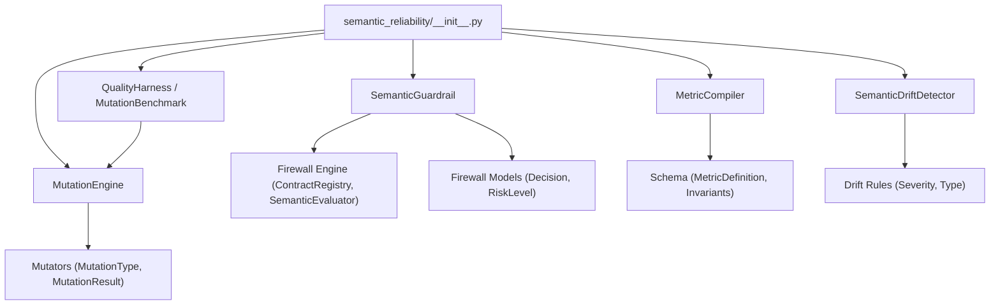
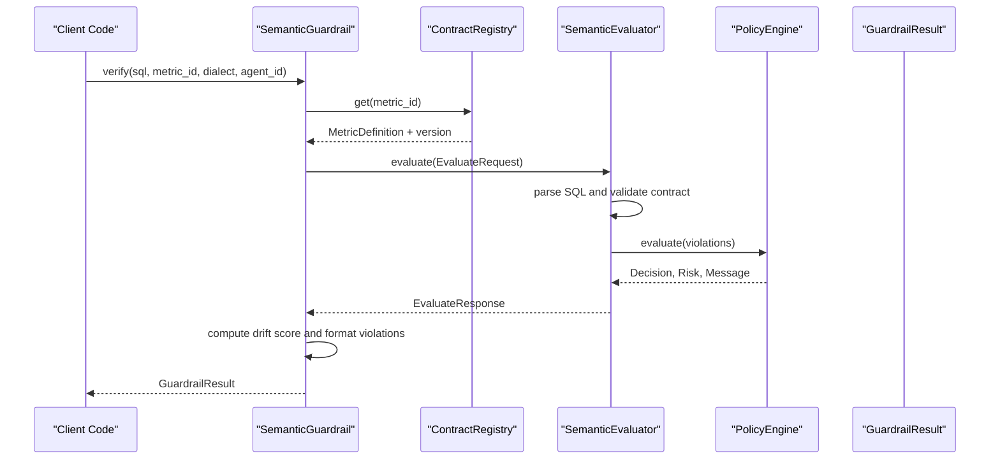
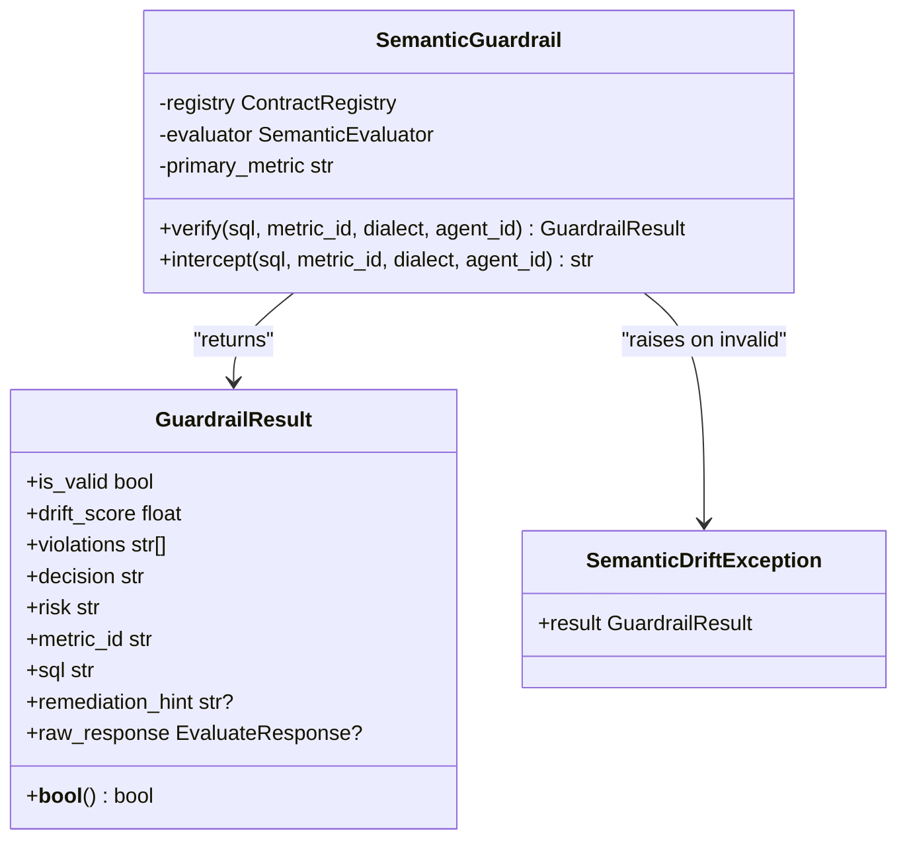
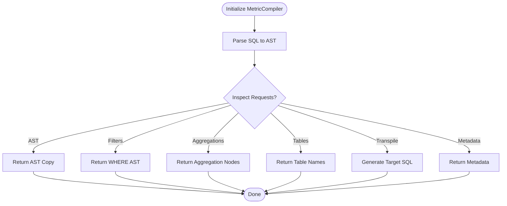
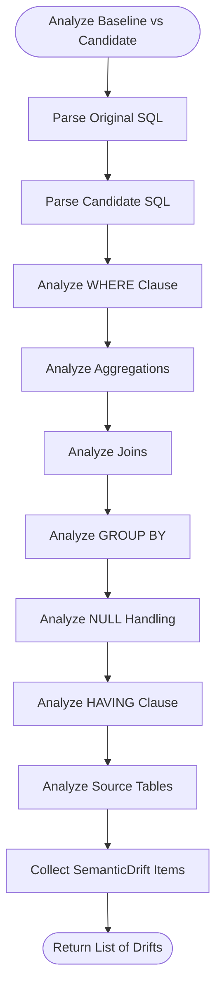
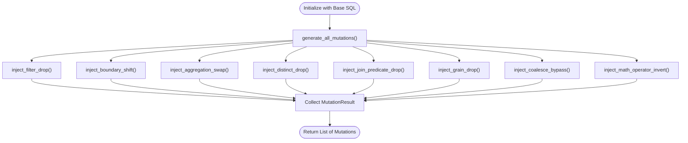
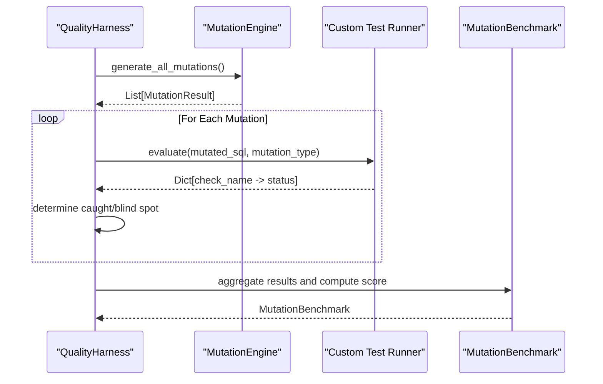
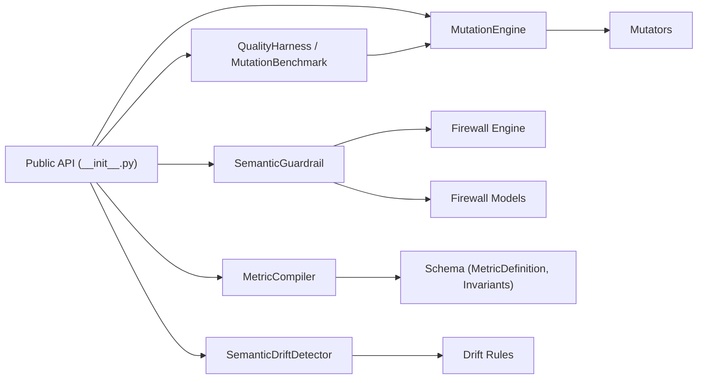

# Python SDK

<cite>
**Referenced Files in This Document**
- [__init__.py](file://semantic_reliability/__init__.py)
- [guardrail.py](file://semantic_reliability/guardrail.py)
- [compiler.py](file://semantic_reliability/compiler/compiler.py)
- [schema.py](file://semantic_reliability/compiler/schema.py)
- [detector.py](file://semantic_reliability/testing/drift/detector.py)
- [rules.py](file://semantic_reliability/testing/drift/rules.py)
- [engine.py](file://semantic_reliability/testing/mutations/engine.py)
- [mutators.py](file://semantic_reliability/testing/mutations/mutators.py)
- [quality_harness.py](file://semantic_reliability/harness/quality_harness.py)
- [firewall_engine.py](file://semantic_reliability/firewall/engine.py)
- [firewall_models.py](file://semantic_reliability/firewall/models.py)
</cite>

## Table of Contents
1. [Introduction](#introduction)
2. [Project Structure](#project-structure)
3. [Core Components](#core-components)
4. [Architecture Overview](#architecture-overview)
5. [Detailed Component Analysis](#detailed-component-analysis)
6. [Dependency Analysis](#dependency-analysis)
7. [Performance Considerations](#performance-considerations)
8. [Troubleshooting Guide](#troubleshooting-guide)
9. [Conclusion](#conclusion)
10. [Appendices](#appendices)

## Introduction
This document provides comprehensive documentation for the Python SDK that powers semantic reliability for data metrics and text-to-SQL agents. It covers all public classes, methods, interfaces, initialization parameters, configuration options, lifecycle management, error handling patterns, and practical integration examples. The core components include:
- SemanticGuardrail: contract-aware SQL validation and interception
- MetricCompiler: canonical metric compilation to AST and transpilation
- SemanticDriftDetector: structural and semantic drift analysis between baseline and candidate SQL
- MutationEngine: AST-level mutation injection for chaos engineering of data pipelines
- QualityHarness and MutationBenchmark: evaluation harness and scoring for test suite robustness against mutations

The SDK is designed for production usage with deterministic contract enforcement, clear audit trails, and extensible policies.

## Project Structure
At a high level, the SDK exposes a curated public API surface via the package root, which re-exports key classes and types for easy import. Internally, it composes several subsystems:
- Compiler: defines metric contracts and compiles canonical SQL into AST
- Firewall: evaluates queries against contracts and enforces policy decisions
- Drift Detection: compares baseline and candidate SQL to identify semantic drift
- Mutations: injects realistic logical changes to stress-test assertions
- Harness: orchestrates mutation testing and computes coverage scores

**Diagram sources**
- [__init__.py:5-9](file://semantic_reliability/__init__.py#L5-L9)
- [guardrail.py:45-152](file://semantic_reliability/guardrail.py#L45-L152)
- [compiler.py:10-72](file://semantic_reliability/compiler/compiler.py#L10-L72)
- [detector.py:9-46](file://semantic_reliability/testing/drift/detector.py#L9-L46)
- [engine.py:8-52](file://semantic_reliability/testing/mutations/engine.py#L8-L52)
- [quality_harness.py:34-113](file://semantic_reliability/harness/quality_harness.py#L34-L113)
- [firewall_engine.py:18-132](file://semantic_reliability/firewall/engine.py#L18-L132)
- [firewall_models.py:6-51](file://semantic_reliability/firewall/models.py#L6-L51)

**Section sources**
- [__init__.py:1-21](file://semantic_reliability/__init__.py#L1-L21)

## Core Components
This section summarizes each public class with method signatures, parameter descriptions, return types, and usage guidance.

- SemanticGuardrail
  - Purpose: Enforce business metric contracts on generated SQL; block or allow execution based on policy.
  - Initialization: Accepts a contract source as a path, directory, MetricDefinition object, or dict.
  - Key Methods:
    - verify(sql, metric_id=None, dialect="duckdb", agent_id="agent-guardrail") -> GuardrailResult
      - Parameters:
        - sql: Candidate SQL string to validate
        - metric_id: Optional override for target metric contract
        - dialect: SQL dialect used for parsing
        - agent_id: Identifier for audit tracing
      - Returns: GuardrailResult with validity, drift score, violations, decision, risk, and hints
    - intercept(sql, metric_id=None, dialect="duckdb", agent_id="agent-guardrail") -> str
      - Behavior: Returns SQL if valid; raises SemanticDriftException otherwise
  - Error Handling: Raises SemanticDriftException when contract violations are detected
  - Usage Example Pattern: Initialize from contract YAML or definition; call verify or intercept before executing SQL

- MetricCompiler
  - Purpose: Compile canonical metric definitions into AST and provide utilities for inspection and transpilation
  - Initialization: Requires a MetricDefinition
  - Key Methods:
    - get_ground_truth_sql(target_dialect=None) -> str
      - Returns formatted canonical SQL, optionally transpiled to target dialect
    - get_ast() -> Expression
      - Returns copy of AST root node
    - get_where_ast() -> Optional[Where]
      - Returns WHERE filter AST if present
    - get_select_expressions() -> List[Expression]
      - Returns selected columns/aggregations
    - get_aggregation_nodes() -> List[Func]
      - Returns aggregation functions found in AST
    - get_tables() -> List[str]
      - Returns referenced table names
    - get_metadata() -> Dict[str, Any]
      - Returns non-SQL metadata from definition
  - Usage Example Pattern: Load MetricDefinition from YAML or dict; compile and inspect AST; transpile to target dialect

- SemanticDriftDetector
  - Purpose: Analyze structural and semantic differences between baseline and candidate SQL
  - Key Method:
    - analyze(original_sql, candidate_sql, dialect=None) -> List[SemanticDrift]
      - Parameters:
        - original_sql: Baseline SQL
        - candidate_sql: Candidate SQL to compare
        - dialect: Optional SQL dialect for parsing
      - Returns: List of SemanticDrift objects describing severity, type, component, summary, details, business impact, snippets, and remediation
  - Usage Example Pattern: Parse both SQLs; run analyze; review drift list to detect population, aggregation, join, grain, null-handling, having, and table changes

- MutationEngine
  - Purpose: Inject precise AST-level logical mutations into SQL models to simulate common bugs and assess test robustness
  - Initialization: base_sql and optional dialect
  - Key Methods:
    - generate_all_mutations() -> List[MutationResult]
      - Runs multiple mutation generators and returns valid mutated results
    - Individual injectors:
      - inject_filter_drop()
      - inject_boundary_shift()
      - inject_aggregation_swap()
      - inject_distinct_drop()
      - inject_join_predicate_drop()
      - inject_grain_drop()
      - inject_coalesce_bypass()
      - inject_math_operator_invert()
  - Usage Example Pattern: Instantiate with base SQL; generate mutations; evaluate with tests or harness

- QualityHarness and MutationBenchmark
  - Purpose: Evaluate test suites against injected mutations to compute a mutation score indicating robustness
  - Key Methods:
    - QualityHarness.simulate_standard_checks(mutated_sql, mutation_type) -> Dict[str, str]
      - Simulates standard checks and indicates which catch specific mutation types
    - QualityHarness.evaluate_model(base_sql, dialect=None, custom_test_runner=None) -> MutationBenchmark
      - Generates mutations and runs checks; returns benchmark with totals, caught counts, and percentage
  - Data Models:
    - TestCheckResult: check_name, passed, details
    - MutationEvaluation: mutation, caught, catching_checks, failed_checks, check_results, blind_spot
    - MutationBenchmark: total_mutations, caught_mutations, uncaught_mutations, mutation_score_pct, evaluations
  - Usage Example Pattern: Provide base SQL; optionally supply custom test runner; obtain benchmark to measure coverage

**Section sources**
- [guardrail.py:13-152](file://semantic_reliability/guardrail.py#L13-L152)
- [compiler.py:10-72](file://semantic_reliability/compiler/compiler.py#L10-L72)
- [detector.py:9-46](file://semantic_reliability/testing/drift/detector.py#L9-L46)
- [engine.py:8-52](file://semantic_reliability/testing/mutations/engine.py#L8-L52)
- [quality_harness.py:8-113](file://semantic_reliability/harness/quality_harness.py#L8-L113)

## Architecture Overview
The SDK integrates contract-driven validation, drift detection, and mutation testing to ensure semantic reliability across data pipelines and AI-generated SQL.

**Diagram sources**
- [guardrail.py:91-136](file://semantic_reliability/guardrail.py#L91-L136)
- [firewall_engine.py:46-132](file://semantic_reliability/firewall/engine.py#L46-L132)
- [firewall_models.py:20-51](file://semantic_reliability/firewall/models.py#L20-L51)

## Detailed Component Analysis

### SemanticGuardrail
- Responsibilities:
  - Load metric contracts from file, directory, or programmatic definition
  - Evaluate candidate SQL against declared invariants and policy
  - Return structured results or raise exceptions for violations
- Lifecycle:
  - Initialize once per contract set; reuse evaluator for performance
  - Call verify for batch validations; use intercept for strict blocking
- Error Handling:
  - SemanticDriftException includes result context and remediation hint
- Best Practices:
  - Use metric_id to target specific contracts in multi-metric registries
  - Set agent_id for audit traceability
  - Prefer verify for logging and analytics; use intercept for hard gates

**Diagram sources**
- [guardrail.py:28-43](file://semantic_reliability/guardrail.py#L28-L43)
- [guardrail.py:45-152](file://semantic_reliability/guardrail.py#L45-L152)

**Section sources**
- [guardrail.py:13-152](file://semantic_reliability/guardrail.py#L13-L152)

### MetricCompiler
- Responsibilities:
  - Parse and store canonical SQL as AST
  - Provide utilities to inspect filters, aggregations, tables, and metadata
  - Transpile to target dialects for compatibility
- Lifecycle:
  - Construct from MetricDefinition; cache AST internally
  - Reuse compiler instance for repeated inspections/transpilations
- Performance:
  - AST parsing occurs once during construction; subsequent calls are lightweight

**Diagram sources**
- [compiler.py:10-72](file://semantic_reliability/compiler/compiler.py#L10-L72)

**Section sources**
- [compiler.py:10-72](file://semantic_reliability/compiler/compiler.py#L10-L72)
- [schema.py:83-98](file://semantic_reliability/compiler/schema.py#L83-L98)

### SemanticDriftDetector
- Responsibilities:
  - Compare baseline and candidate SQL across relational algebra components
  - Identify drift in filters, aggregations, joins, grouping, null handling, having clauses, and table targets
- Output:
  - List of SemanticDrift with severity, type, component, summary, details, business impact, snippets, and remediation
- Usage:
  - Ideal for pre-deployment checks and change reviews

**Diagram sources**
- [detector.py:9-46](file://semantic_reliability/testing/drift/detector.py#L9-L46)
- [detector.py:48-246](file://semantic_reliability/testing/drift/detector.py#L48-L246)
- [rules.py:6-41](file://semantic_reliability/testing/drift/rules.py#L6-L41)

**Section sources**
- [detector.py:9-246](file://semantic_reliability/testing/drift/detector.py#L9-L246)
- [rules.py:6-41](file://semantic_reliability/testing/drift/rules.py#L6-L41)

### MutationEngine
- Responsibilities:
  - Generate realistic mutations targeting common failure modes in SQL logic
  - Support categories: population filtering, boundary conditions, mathematical calculation, join cardinality, reporting grain, null safety, arithmetic logic
- Output:
  - List of MutationResult with mutation type, description, original and mutated SQL, target node, and category
- Usage:
  - Combine with QualityHarness to measure assertion robustness

**Diagram sources**
- [engine.py:8-52](file://semantic_reliability/testing/mutations/engine.py#L8-L52)
- [engine.py:54-269](file://semantic_reliability/testing/mutations/engine.py#L54-L269)
- [mutators.py:8-27](file://semantic_reliability/testing/mutations/mutators.py#L8-L27)

**Section sources**
- [engine.py:8-269](file://semantic_reliability/testing/mutations/engine.py#L8-L269)
- [mutators.py:8-27](file://semantic_reliability/testing/mutations/mutators.py#L8-L27)

### QualityHarness and MutationBenchmark
- Responsibilities:
  - Simulate or execute test suites against mutated SQL
  - Compute mutation score to quantify test suite effectiveness
- Key Inputs:
  - base_sql: Canonical SQL to mutate
  - dialect: Optional SQL dialect
  - custom_test_runner: Optional function to evaluate mutated SQL and return check results mapping
- Outputs:
  - MutationBenchmark with totals, caught/uncaught counts, percentage, and detailed evaluations
- Usage:
  - Integrate into CI/CD to enforce minimum mutation coverage thresholds

**Diagram sources**
- [quality_harness.py:34-113](file://semantic_reliability/harness/quality_harness.py#L34-L113)
- [engine.py:8-52](file://semantic_reliability/testing/mutations/engine.py#L8-L52)

**Section sources**
- [quality_harness.py:8-113](file://semantic_reliability/harness/quality_harness.py#L8-L113)

## Dependency Analysis
The SDK’s public API depends on internal subsystems for contract enforcement, drift detection, and mutation testing.

**Diagram sources**
- [__init__.py:5-9](file://semantic_reliability/__init__.py#L5-L9)
- [guardrail.py:7-10](file://semantic_reliability/guardrail.py#L7-L10)
- [compiler.py:7-7](file://semantic_reliability/compiler/compiler.py#L7-L7)
- [detector.py:5-6](file://semantic_reliability/testing/drift/detector.py#L5-L6)
- [engine.py:5-5](file://semantic_reliability/testing/mutations/engine.py#L5-L5)
- [quality_harness.py:4-5](file://semantic_reliability/harness/quality_harness.py#L4-L5)

**Section sources**
- [__init__.py:5-9](file://semantic_reliability/__init__.py#L5-L9)
- [guardrail.py:7-10](file://semantic_reliability/guardrail.py#L7-L10)
- [compiler.py:7-7](file://semantic_reliability/compiler/compiler.py#L7-L7)
- [detector.py:5-6](file://semantic_reliability/testing/drift/detector.py#L5-L6)
- [engine.py:5-5](file://semantic_reliability/testing/mutations/engine.py#L5-L5)
- [quality_harness.py:4-5](file://semantic_reliability/harness/quality_harness.py#L4-L5)

## Performance Considerations
- Contract Evaluation:
  - Reuse SemanticGuardrail instances to avoid reloading contracts and rebuilding evaluators
  - Batch verify calls where possible to reduce overhead
- AST Operations:
  - MetricCompiler parses SQL once; subsequent AST queries are efficient
  - Avoid repeated parsing by caching compiled compilers per metric
- Drift Detection:
  - Parsing both baseline and candidate SQL incurs cost; minimize redundant comparisons
  - Use dialect consistently to avoid extra conversions
- Mutation Testing:
  - generate_all_mutations creates copies of AST; limit scope to relevant metrics
  - Custom test runners should be optimized; consider parallelization at higher layers if safe
- Threading:
  - The SDK does not expose explicit threading primitives; ensure thread-safety at application layer
  - If using concurrent workers, isolate instances per thread to prevent shared state contention
- Production Best Practices:
  - Configure agent_id for consistent audit traces
  - Use strict mode policies for critical paths; relax only with documented approvals
  - Monitor drift scores and mutation scores over time to detect regressions

## Troubleshooting Guide
Common issues and resolutions:
- Contract Not Found:
  - Ensure metric_id matches registered contracts; verify registry contents
  - Check that contract files are valid YAML and contain required fields
- SQL Parse Errors:
  - Validate SQL syntax and dialect; incorrect dialect can cause parse failures
  - Review firewall engine responses for detailed messages
- Semantic Drift Exceptions:
  - Capture SemanticDriftException.result to inspect violations and remediation hints
  - Address reported invariant breaches before allowing execution
- Mutation Score Low:
  - Add targeted assertions for mutation categories that remain blind spots
  - Use QualityHarness to identify which checks fail to catch specific mutations
- Audit Logs:
  - Inspect SemanticEvaluator.audit_log for trace_id, decision, and violation details
  - Correlate logs with request_id and agent_id for debugging

**Section sources**
- [guardrail.py:13-26](file://semantic_reliability/guardrail.py#L13-L26)
- [firewall_engine.py:54-132](file://semantic_reliability/firewall/engine.py#L54-L132)
- [quality_harness.py:37-113](file://semantic_reliability/harness/quality_harness.py#L37-L113)

## Conclusion
The Python SDK provides a robust framework for ensuring semantic reliability of data metrics and AI-generated SQL. By combining contract-driven validation, drift detection, and mutation testing, teams can proactively prevent silent metric corruption and strengthen their assertion suites. Adopting the recommended practices—reusing instances, configuring policies, monitoring drift and mutation scores, and integrating into CI/CD—will improve reliability and maintainability in production environments.

## Appendices

### Practical Integration Patterns
- Contract Validation:
  - Initialize SemanticGuardrail from a contract YAML or MetricDefinition
  - Call verify to obtain GuardrailResult; log drift_score and violations
  - Use intercept to block invalid SQL in agent workflows
- Drift Detection:
  - Use SemanticDriftDetector.analyze to compare baseline and candidate SQL
  - Review returned SemanticDrift items to understand impacts and remediation steps
- Mutation Testing:
  - Use MutationEngine.generate_all_mutations to produce realistic mutations
  - Run QualityHarness.evaluate_model to compute mutation score and identify blind spots
  - Integrate custom_test_runner to align with your organization’s assertion framework
- Quality Assessment:
  - Track MutationBenchmark.mutation_score_pct over time to measure improvement
  - Investigate blind_spot entries to enhance test coverage

[No sources needed since this section provides general guidance]