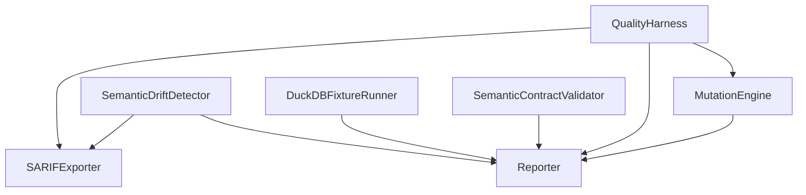
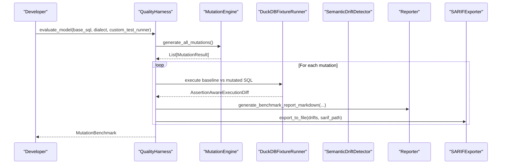
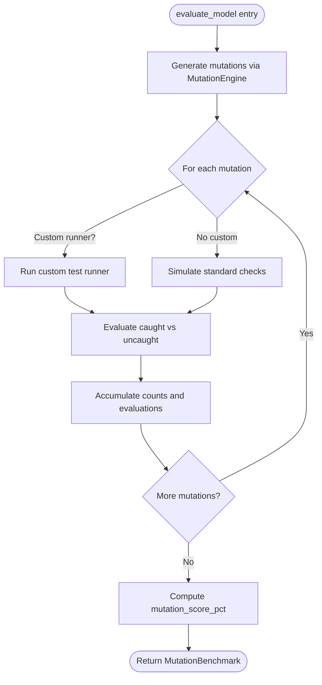
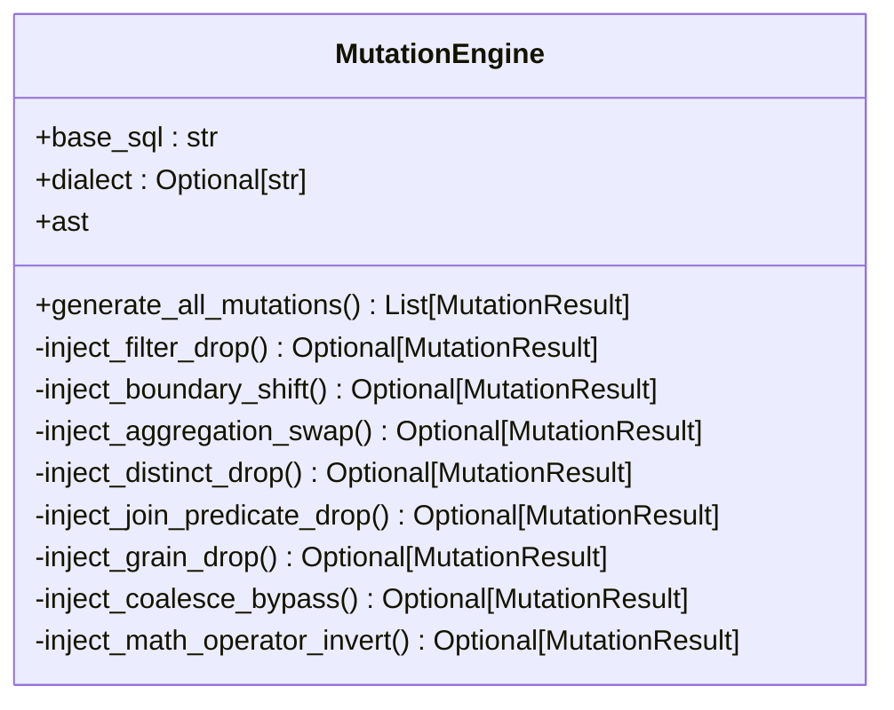
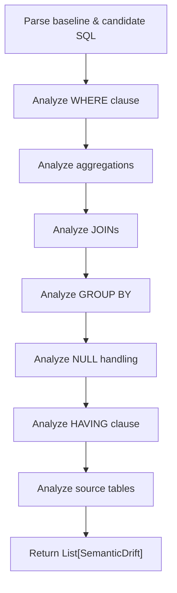
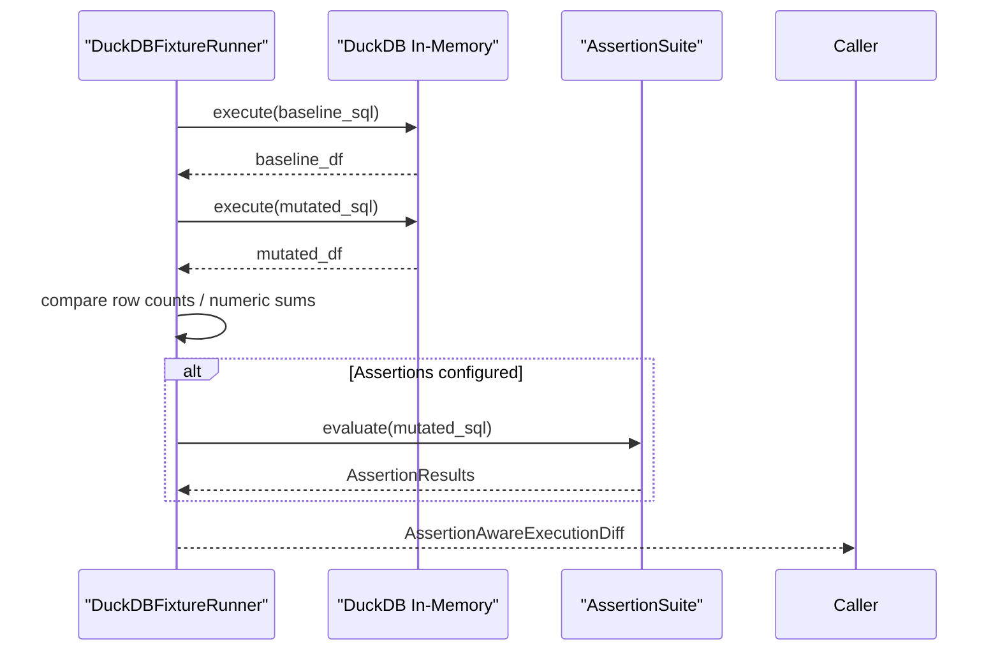
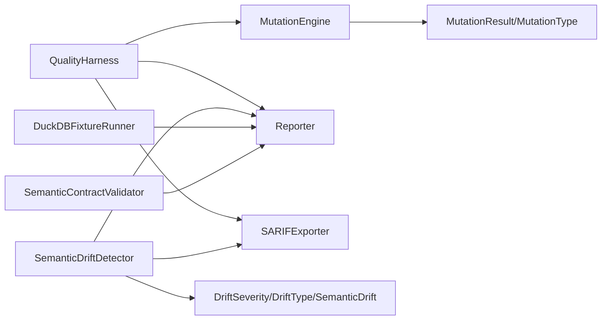

# Quality Harness

<cite>
**Referenced Files in This Document**
- [quality_harness.py](file://semantic_reliability/harness/quality_harness.py)
- [reporter.py](file://semantic_reliability/harness/reporter.py)
- [sarif_exporter.py](file://semantic_reliability/harness/sarif_exporter.py)
- [duckdb_runner.py](file://semantic_reliability/harness/duckdb_runner.py)
- [detector.py](file://semantic_reliability/testing/drift/detector.py)
- [rules.py](file://semantic_reliability/testing/drift/rules.py)
- [engine.py](file://semantic_reliability/testing/mutations/engine.py)
- [mutators.py](file://semantic_reliability/testing/mutations/mutators.py)
- [contracts.py](file://semantic_reliability/compiler/contracts.py)
- [cli.py](file://semantic_reliability/cli.py)
- [README.md](file://README.md)
</cite>

## Table of Contents
1. [Introduction](#introduction)
2. [Project Structure](#project-structure)
3. [Core Components](#core-components)
4. [Architecture Overview](#architecture-overview)
5. [Detailed Component Analysis](#detailed-component-analysis)
6. [Dependency Analysis](#dependency-analysis)
7. [Performance Considerations](#performance-considerations)
8. [Troubleshooting Guide](#troubleshooting-guide)
9. [Conclusion](#conclusion)
10. [Appendices](#appendices)

## Introduction
This document explains the QualityHarness class and the surrounding quality assessment framework for semantic reliability. It covers:
- Harness initialization parameters and integration points (test suites, reporting options, execution backends).
- The end-to-end workflow: contract validation, drift detection, and mutation testing orchestration.
- The reporter system for generating human-readable reports and GitHub PR comments.
- The SARIF exporter for CI/CD integration with code scanning and security tools.
- Practical examples for setup, report generation, and automated workflows.
- Guidance on interpreting metrics and establishing continuous quality monitoring.

## Project Structure
The quality harness lives under the harness package and integrates with drift detection, mutation engines, assertion-based execution, and reporting/export utilities.

**Diagram sources**
- [quality_harness.py:34-113](file://semantic_reliability/harness/quality_harness.py#L34-L113)
- [engine.py:8-52](file://semantic_reliability/testing/mutations/engine.py#L8-L52)
- [detector.py:9-46](file://semantic_reliability/testing/drift/detector.py#L9-L46)
- [duckdb_runner.py:56-256](file://semantic_reliability/harness/duckdb_runner.py#L56-L256)
- [reporter.py:8-129](file://semantic_reliability/harness/reporter.py#L8-L129)
- [sarif_exporter.py:9-100](file://semantic_reliability/harness/sarif_exporter.py#L9-L100)
- [contracts.py:26-135](file://semantic_reliability/compiler/contracts.py#L26-L135)

**Section sources**
- [quality_harness.py:34-113](file://semantic_reliability/harness/quality_harness.py#L34-L113)
- [engine.py:8-52](file://semantic_reliability/testing/mutations/engine.py#L8-L52)
- [detector.py:9-46](file://semantic_reliability/testing/drift/detector.py#L9-L46)
- [duckdb_runner.py:56-256](file://semantic_reliability/harness/duckdb_runner.py#L56-L256)
- [reporter.py:8-129](file://semantic_reliability/harness/reporter.py#L8-L129)
- [sarif_exporter.py:9-100](file://semantic_reliability/harness/sarif_exporter.py#L9-L100)
- [contracts.py:26-135](file://semantic_reliability/compiler/contracts.py#L26-L135)

## Core Components
- QualityHarness: Orchestrates mutation-based evaluation to compute a mutation score that measures how robust a test suite is against semantic changes.
- MutationEngine: Generates AST-level mutations across filters, aggregations, joins, grouping, null handling, and arithmetic operators.
- SemanticDriftDetector: Compares baseline and candidate SQL via AST analysis to identify semantic drifts with severity and remediation guidance.
- DuckDBFixtureRunner: Executes baseline vs mutated queries in-memory, compares outputs, runs assertions, and classifies defects.
- Reporter: Produces Markdown reports for PRs and mutation benchmarks.
- SARIFExporter: Converts drift results into SARIF 2.1.0 JSON for GitHub Code Scanning and other scanners.
- SemanticContractValidator: Validates candidate SQL against declared metric contracts (population, grain, aggregation, timezone).

Key data models:
- MutationResult and MutationType define injected mutations.
- SemanticDrift and DriftSeverity describe detected drifts.
- AssertionAwareExecutionDiff and MutationClassification capture execution outcomes.
- ContractEvaluationResult captures invariant checks.

**Section sources**
- [quality_harness.py:8-32](file://semantic_reliability/harness/quality_harness.py#L8-L32)
- [mutators.py:8-27](file://semantic_reliability/testing/mutations/mutators.py#L8-L27)
- [rules.py:6-41](file://semantic_reliability/testing/drift/rules.py#L6-L41)
- [duckdb_runner.py:14-53](file://semantic_reliability/harness/duckdb_runner.py#L14-L53)
- [contracts.py:9-24](file://semantic_reliability/compiler/contracts.py#L9-L24)

## Architecture Overview
The quality assessment pipeline combines static analysis (drift detection), static mutation testing (AST mutations), and dynamic execution (DuckDB fixtures + assertions). Reports are generated in multiple formats, including SARIF for CI/CD.

**Diagram sources**
- [quality_harness.py:66-113](file://semantic_reliability/harness/quality_harness.py#L66-L113)
- [engine.py:16-52](file://semantic_reliability/testing/mutations/engine.py#L16-L52)
- [duckdb_runner.py:116-256](file://semantic_reliability/harness/duckdb_runner.py#L116-L256)
- [reporter.py:86-129](file://semantic_reliability/harness/reporter.py#L86-L129)
- [sarif_exporter.py:91-100](file://semantic_reliability/harness/sarif_exporter.py#L91-L100)

## Detailed Component Analysis

### QualityHarness
Responsibilities:
- Orchestrate mutation generation and evaluation.
- Support custom test runners or simulate standard checks.
- Compute mutation catch rate and produce benchmark summaries.

Initialization and parameters:
- evaluate_model accepts base SQL, optional SQL dialect, and an optional custom test runner callable. If no custom runner is provided, it simulates standard checks to demonstrate typical blind spots.

Workflow highlights:
- Uses MutationEngine to generate all supported mutations.
- For each mutation, either executes through a custom runner or uses simulated checks.
- Determines if mutation was caught based on check responses.
- Aggregates counts and computes mutation_score_pct.

**Diagram sources**
- [quality_harness.py:66-113](file://semantic_reliability/harness/quality_harness.py#L66-L113)

**Section sources**
- [quality_harness.py:34-113](file://semantic_reliability/harness/quality_harness.py#L34-L113)

### MutationEngine
Responsibilities:
- Parse base SQL into an AST.
- Inject precise mutations targeting common failure modes: filter drops, boundary shifts, aggregation swaps, distinct drops, join predicate drops, grain drops, coalesce bypasses, and math operator inversions.

Key methods:
- generate_all_mutations orchestrates all injection functions.
- Each inject_* method returns a MutationResult when applicable.

**Diagram sources**
- [engine.py:8-269](file://semantic_reliability/testing/mutations/engine.py#L8-L269)

**Section sources**
- [engine.py:8-269](file://semantic_reliability/testing/mutations/engine.py#L8-L269)
- [mutators.py:8-27](file://semantic_reliability/testing/mutations/mutators.py#L8-L27)

### SemanticDriftDetector
Responsibilities:
- Compare baseline and candidate SQL via AST normalization.
- Detect drifts across population logic, aggregations, joins, grouping, null handling, post-aggregation filters, and source tables.
- Produce SemanticDrift objects with severity, business impact, snippets, and remediation.

Workflow:
- Parses both SQLs into ASTs.
- Runs targeted analyses per clause/component.
- Returns a list of drifts.

**Diagram sources**
- [detector.py:9-46](file://semantic_reliability/testing/drift/detector.py#L9-L46)
- [detector.py:48-246](file://semantic_reliability/testing/drift/detector.py#L48-L246)

**Section sources**
- [detector.py:9-246](file://semantic_reliability/testing/drift/detector.py#L9-L246)
- [rules.py:6-41](file://semantic_reliability/testing/drift/rules.py#L6-L41)

### DuckDBFixtureRunner
Responsibilities:
- Load fixtures into an in-memory DuckDB instance.
- Execute baseline and mutated SQL; compare row counts and numeric sums to detect empirical differences.
- Evaluate assertion suites on mutated queries.
- Classify outcomes: equivalent, runtime error, valid defect detected, or surviving defect.

Key behaviors:
- compare_execution_with_assertions produces detailed diffs and classifications.
- run_assertion_benchmark aggregates results into AssertionBenchmarkReport.

**Diagram sources**
- [duckdb_runner.py:56-256](file://semantic_reliability/harness/duckdb_runner.py#L56-L256)

**Section sources**
- [duckdb_runner.py:56-256](file://semantic_reliability/harness/duckdb_runner.py#L56-L256)

### Reporter
Responsibilities:
- Generate GitHub PR comment markdown summarizing semantic drifts.
- Generate comprehensive Markdown reports for mutation benchmarks.

Capabilities:
- Summarizes highest severity and lists drift details with remediation steps.
- Presents mutation catch rates, blind spots, and per-mutation evaluation details.

**Section sources**
- [reporter.py:8-129](file://semantic_reliability/harness/reporter.py#L8-L129)

### SARIFExporter
Responsibilities:
- Convert drift results into SARIF 2.1.0 JSON for GitHub Code Scanning and security scanners.
- Map drift severities to SARIF levels and include rule definitions and result entries.

Usage:
- from_drifts builds a SARIF document from a list of SemanticDrift.
- export_to_file writes the SARIF JSON to disk.

**Section sources**
- [sarif_exporter.py:9-100](file://semantic_reliability/harness/sarif_exporter.py#L9-L100)

### SemanticContractValidator
Responsibilities:
- Validate candidate SQL against metric contracts defining required filters, grouping dimensions, aggregation components, and timezone alignment.
- Return ContractEvaluationResult indicating pass/fail and violations.

Integration:
- Used by higher-level flows to ensure compliance before execution or during CI gates.

**Section sources**
- [contracts.py:26-135](file://semantic_reliability/compiler/contracts.py#L26-L135)

## Dependency Analysis
High-level dependencies among core modules:

**Diagram sources**
- [quality_harness.py:34-113](file://semantic_reliability/harness/quality_harness.py#L34-L113)
- [engine.py:8-52](file://semantic_reliability/testing/mutations/engine.py#L8-L52)
- [rules.py:6-41](file://semantic_reliability/testing/drift/rules.py#L6-L41)
- [reporter.py:8-129](file://semantic_reliability/harness/reporter.py#L8-L129)
- [sarif_exporter.py:9-100](file://semantic_reliability/harness/sarif_exporter.py#L9-L100)
- [duckdb_runner.py:56-256](file://semantic_reliability/harness/duckdb_runner.py#L56-L256)
- [contracts.py:26-135](file://semantic_reliability/compiler/contracts.py#L26-L135)

**Section sources**
- [quality_harness.py:34-113](file://semantic_reliability/harness/quality_harness.py#L34-L113)
- [engine.py:8-52](file://semantic_reliability/testing/mutations/engine.py#L8-L52)
- [rules.py:6-41](file://semantic_reliability/testing/drift/rules.py#L6-L41)
- [reporter.py:8-129](file://semantic_reliability/harness/reporter.py#L8-L129)
- [sarif_exporter.py:9-100](file://semantic_reliability/harness/sarif_exporter.py#L9-L100)
- [duckdb_runner.py:56-256](file://semantic_reliability/harness/duckdb_runner.py#L56-L256)
- [contracts.py:26-135](file://semantic_reliability/compiler/contracts.py#L26-L135)

## Performance Considerations
- AST parsing and mutation generation are CPU-bound but typically fast for moderate-sized SQL.
- DuckDB in-memory execution is efficient for fixture-based comparisons; keep fixtures small for speed.
- Assertion suites add overhead; use minimal, high-signal assertions in CI.
- Batch SARIF exports and Markdown reports to reduce I/O pressure.
- Avoid excessive mutation types on large SQL; focus on relevant categories for your domain.

[No sources needed since this section provides general guidance]

## Troubleshooting Guide
Common issues and resolutions:
- Runtime errors during mutation execution:
  - Inspect AssertionAwareExecutionDiff classification RUNTIME_ERROR and associated error messages.
  - Adjust fixtures or SQL dialect settings to match target engine capabilities.
- Equivalent-on-fixture false negatives:
  - Some mutations may not change output on limited fixtures; expand fixture coverage or add assertions.
- High drift severity:
  - Review SemanticDrift details and remediation suggestions; align candidate SQL with canonical metric definition.
- Contract violations:
  - Use SemanticContractValidator to identify missing filters, incorrect grouping, or non-UTC timezones; update SQL accordingly.
- CI gating failures:
  - Configure fail-on-drift thresholds and SARIF uploads to integrate with code scanning dashboards.

**Section sources**
- [duckdb_runner.py:116-206](file://semantic_reliability/harness/duckdb_runner.py#L116-L206)
- [detector.py:48-246](file://semantic_reliability/testing/drift/detector.py#L48-L246)
- [contracts.py:44-135](file://semantic_reliability/compiler/contracts.py#L44-L135)
- [cli.py:117-131](file://semantic_reliability/cli.py#L117-L131)

## Conclusion
The QualityHarness provides a robust, multi-layered approach to ensuring semantic correctness of SQL models:
- Static drift detection identifies structural and semantic changes with actionable insights.
- Mutation testing quantifies test suite effectiveness against realistic bugs.
- Dynamic execution with fixtures and assertions validates behavior empirically.
- Reporting and SARIF export enable seamless CI/CD integration and team visibility.

Adopting these practices helps prevent silent semantic failures and maintains trust in downstream analytics and decision-making.

[No sources needed since this section summarizes without analyzing specific files]

## Appendices

### Practical Examples

- Setup and run mutation benchmark:
  - Use QualityHarness.evaluate_model with base SQL and optional dialect/custom runner to compute mutation scores and evaluations.
  - Reference paths: [quality_harness.py:66-113](file://semantic_reliability/harness/quality_harness.py#L66-L113)

- Generate PR-ready drift report:
  - Collect SemanticDrift instances via SemanticDriftDetector.analyze and pass to Reporter.generate_pr_comment_markdown.
  - Reference paths: [detector.py:12-46](file://semantic_reliability/testing/drift/detector.py#L12-L46), [reporter.py:11-84](file://semantic_reliability/harness/reporter.py#L11-L84)

- Export SARIF for CI/CD:
  - Convert drifts to SARIF using SARIFExporter.from_drifts or write directly with export_to_file.
  - Reference paths: [sarif_exporter.py:16-100](file://semantic_reliability/harness/sarif_exporter.py#L16-L100)

- Integrate contract validation:
  - Validate candidate SQL against metric contracts using SemanticContractValidator.validate.
  - Reference paths: [contracts.py:29-135](file://semantic_reliability/compiler/contracts.py#L29-L135)

- CLI usage for drift checks and SARIF export:
  - Use CLI commands to validate metrics and optionally save SARIF artifacts.
  - Reference paths: [cli.py:117-131](file://semantic_reliability/cli.py#L117-L131)

### Interpreting Quality Metrics
- Mutation Score:
  - Percentage of injected mutations caught by tests; higher indicates stronger protection against semantic changes.
  - Derived from counts of total, caught, and uncaught mutations.
  - Reference paths: [quality_harness.py:25-32](file://semantic_reliability/harness/quality_harness.py#L25-L32), [quality_harness.py:103-113](file://semantic_reliability/harness/quality_harness.py#L103-L113)

- Effective Catch Score (Assertion-aware):
  - Ratio of detected valid defects over executable valid defects; accounts for equivalent-on-fixture cases.
  - Reference paths: [duckdb_runner.py:38-53](file://semantic_reliability/harness/duckdb_runner.py#L38-L53), [duckdb_runner.py:208-256](file://semantic_reliability/harness/duckdb_runner.py#L208-L256)

- Drift Severity:
  - Indicates risk level (FATAL, CRITICAL, HIGH, MEDIUM, LOW, INFO) with business impact and remediation guidance.
  - Reference paths: [rules.py:6-41](file://semantic_reliability/testing/drift/rules.py#L6-L41)

### Continuous Quality Monitoring
- Gate PRs on drift severity thresholds and contract compliance.
- Upload SARIF reports to code scanning dashboards for trend tracking.
- Maintain fixture sets that cover critical edge cases and domains.
- Periodically review surviving defects to strengthen assertions and contracts.

**Section sources**
- [cli.py:117-131](file://semantic_reliability/cli.py#L117-L131)
- [sarif_exporter.py:91-100](file://semantic_reliability/harness/sarif_exporter.py#L91-L100)
- [duckdb_runner.py:208-256](file://semantic_reliability/harness/duckdb_runner.py#L208-L256)
- [rules.py:6-41](file://semantic_reliability/testing/drift/rules.py#L6-L41)