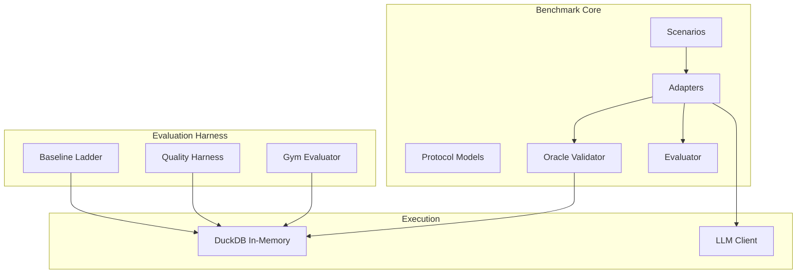
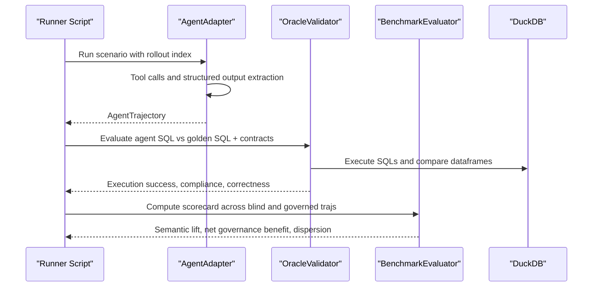
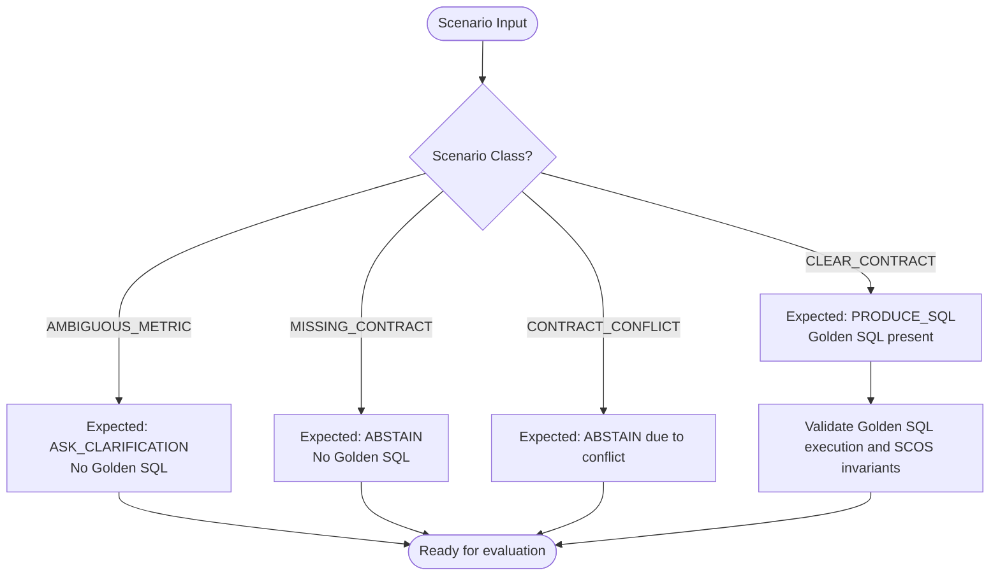
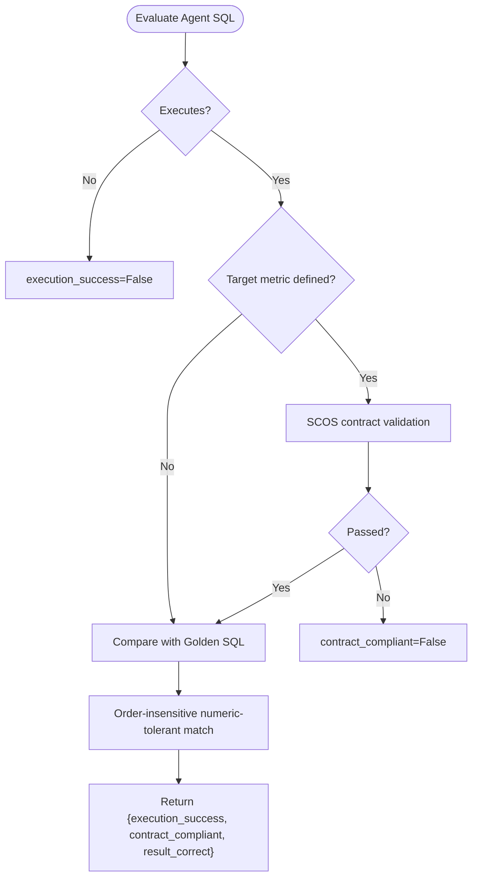
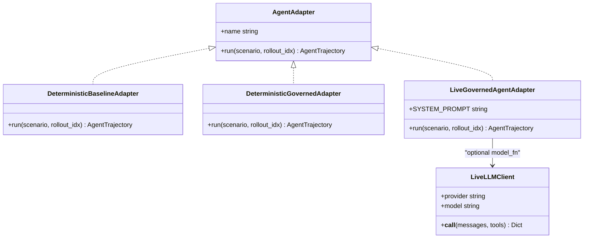
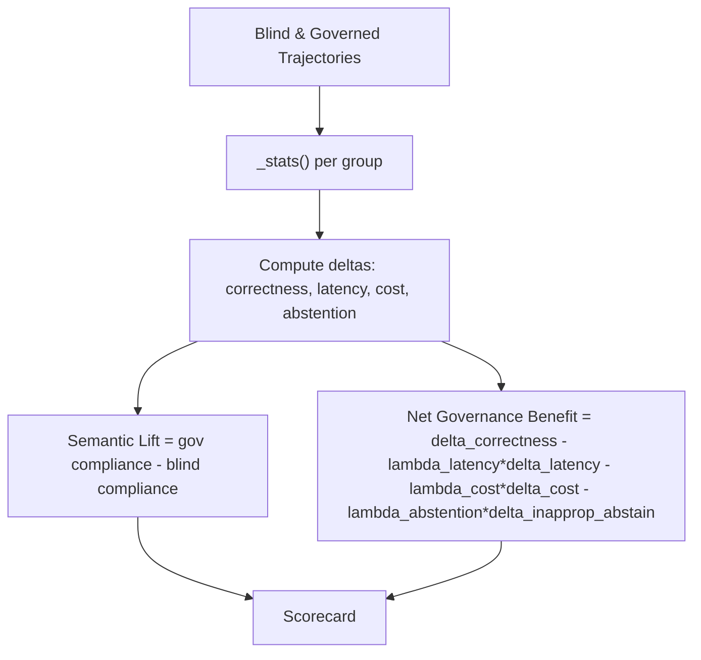
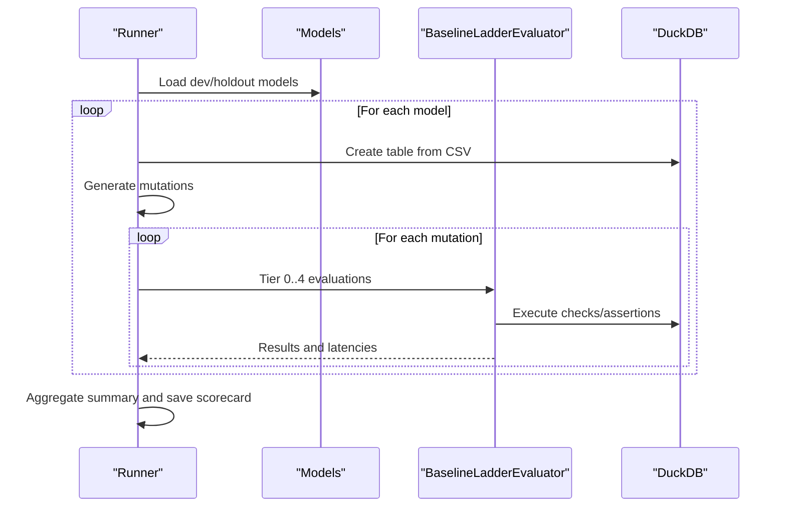
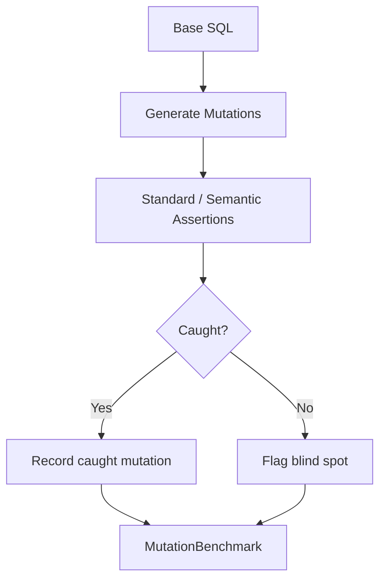
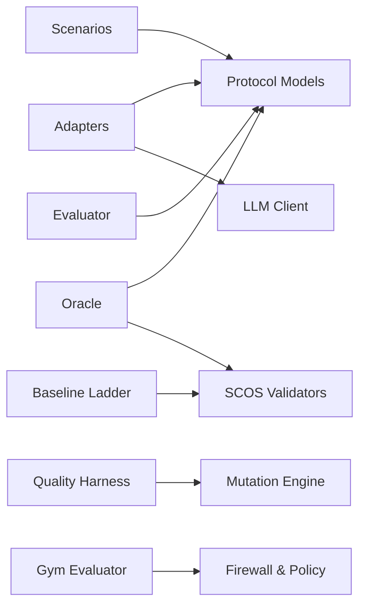

# Advanced Benchmarking Capabilities

<cite>
**Referenced Files in This Document**
- [protocol.py](file://semantic_reliability/benchmark/protocol.py)
- [scenarios.py](file://semantic_reliability/benchmark/scenarios.py)
- [oracle.py](file://semantic_reliability/benchmark/oracle.py)
- [evaluator.py](file://semantic_reliability/benchmark/evaluator.py)
- [adapters.py](file://semantic_reliability/benchmark/adapters.py)
- [llm_client.py](file://semantic_reliability/benchmark/llm_client.py)
- [baseline_ladder.py](file://semantic_reliability/harness/baseline_ladder.py)
- [quality_harness.py](file://semantic_reliability/harness/quality_harness.py)
- [gym_evaluator.py](file://semantic_reliability/gym/evaluator.py)
- [BENCHMARK_METHODOLOGY.md](file://docs/BENCHMARK_METHODOLOGY.md)
- [run_two_engine_benchmark.py](file://scripts/run_two_engine_benchmark.py)
- [profile_hybrid_escalation.py](file://scripts/profile_hybrid_escalation.py)
</cite>

## Table of Contents
1. [Introduction](#introduction)
2. [Project Structure](#project-structure)
3. [Core Components](#core-components)
4. [Architecture Overview](#architecture-overview)
5. [Detailed Component Analysis](#detailed-component-analysis)
6. [Dependency Analysis](#dependency-analysis)
7. [Performance Considerations](#performance-considerations)
8. [Troubleshooting Guide](#troubleshooting-guide)
9. [Conclusion](#conclusion)
10. [Appendices](#appendices)

## Introduction
This document explains the advanced benchmarking capabilities for evaluating agent-generated SQL against semantic contracts, oracles, and realistic fixtures. It covers:
- Custom scenario definition and composition
- Multi-model evaluation across development and frozen holdout tracks
- Oracle-based validation with deterministic result comparison
- Evaluation metrics including Semantic Lift and Net Governance Benefit
- Distributed and performance profiling workflows
- Regression detection via mutation testing and validity scoring
- Reproducibility through versioned protocol configuration and fixture fingerprints

The system is designed to detect semantic drift that standard data tests miss by combining static contract checks, runtime relational assertions, and oracle comparisons over realistic fixtures.

## Project Structure
At a high level, the benchmarking stack includes:
- Protocol and scenarios defining immutable test cases
- Adapters to run agents (mock or live LLM-backed)
- Oracle validator to grade outputs against golden SQL and SCOS contracts
- Evaluator to compute scorecards and governance benefit
- Baseline ladder and quality harness for mutation-based regression detection
- Scripts to orchestrate two-engine tradeoff benchmarks and hybrid router profiling

**Diagram sources**
- [protocol.py:15-96](file://semantic_reliability/benchmark/protocol.py#L15-L96)
- [scenarios.py:4-212](file://semantic_reliability/benchmark/scenarios.py#L4-L212)
- [adapters.py:17-249](file://semantic_reliability/benchmark/adapters.py#L17-L249)
- [oracle.py:16-133](file://semantic_reliability/benchmark/oracle.py#L16-L133)
- [evaluator.py:7-80](file://semantic_reliability/benchmark/evaluator.py#L7-L80)
- [baseline_ladder.py:25-210](file://semantic_reliability/harness/baseline_ladder.py#L25-L210)
- [quality_harness.py:34-113](file://semantic_reliability/harness/quality_harness.py#L34-L113)
- [gym_evaluator.py:113-294](file://semantic_reliability/gym/evaluator.py#L113-L294)

**Section sources**
- [protocol.py:15-96](file://semantic_reliability/benchmark/protocol.py#L15-L96)
- [scenarios.py:4-212](file://semantic_reliability/benchmark/scenarios.py#L4-L212)
- [adapters.py:17-249](file://semantic_reliability/benchmark/adapters.py#L17-L249)
- [oracle.py:16-133](file://semantic_reliability/benchmark/oracle.py#L16-L133)
- [evaluator.py:7-80](file://semantic_reliability/benchmark/evaluator.py#L7-L80)
- [baseline_ladder.py:25-210](file://semantic_reliability/harness/baseline_ladder.py#L25-L210)
- [quality_harness.py:34-113](file://semantic_reliability/harness/quality_harness.py#L34-L113)
- [gym_evaluator.py:113-294](file://semantic_reliability/gym/evaluator.py#L113-L294)

## Core Components
- Protocol models define immutable scenarios, trajectories, and frozen configuration for reproducibility.
- Scenarios provide a curated set covering clear contracts, ambiguous metrics, missing contracts, and conflicts.
- Adapters implement agent execution loops, tool call recording, and structured output extraction.
- Oracle validates golden SQL and compares agent outputs with tolerance-aware dataframe matching.
- Evaluator computes multi-rollout dispersion metrics, semantic lift, and net governance benefit.
- Baseline ladder evaluates SQL across progressive tiers from syntax to runtime relational assertions.
- Quality harness measures mutation catch rates and identifies blind spots in standard test suites.
- Gym evaluator classifies outcomes into a formal taxonomy and reports confusion matrices and latency summaries.

**Section sources**
- [protocol.py:15-96](file://semantic_reliability/benchmark/protocol.py#L15-L96)
- [scenarios.py:4-212](file://semantic_reliability/benchmark/scenarios.py#L4-L212)
- [adapters.py:17-249](file://semantic_reliability/benchmark/adapters.py#L17-L249)
- [oracle.py:16-133](file://semantic_reliability/benchmark/oracle.py#L16-L133)
- [evaluator.py:7-80](file://semantic_reliability/benchmark/evaluator.py#L7-L80)
- [baseline_ladder.py:25-210](file://semantic_reliability/harness/baseline_ladder.py#L25-L210)
- [quality_harness.py:34-113](file://semantic_reliability/harness/quality_harness.py#L34-L113)
- [gym_evaluator.py:113-294](file://semantic_reliability/gym/evaluator.py#L113-L294)

## Architecture Overview
The benchmark orchestrates agent runs against scenarios, validates outputs via oracles and contracts, and aggregates results into actionable metrics.

**Diagram sources**
- [adapters.py:112-249](file://semantic_reliability/benchmark/adapters.py#L112-L249)
- [oracle.py:52-97](file://semantic_reliability/benchmark/oracle.py#L52-L97)
- [evaluator.py:13-79](file://semantic_reliability/benchmark/evaluator.py#L13-L79)

## Detailed Component Analysis

### Scenario Composition and Classification
Scenarios are immutable definitions aligned to four classes:
- Clear Contract: Expected behavior produces SQL; golden SQL provided for oracle comparison.
- Ambiguous Metric: Expected behavior asks clarification; no golden SQL.
- Missing Contract: Expected behavior abstains; no golden SQL.
- Contract Conflict: Expected behavior abstains due to conflict with declared semantics.

Each scenario includes domain, prompt, schema context, optional target metric URN, expected behavior, and optional golden SQL and fixture fingerprint.

**Diagram sources**
- [scenarios.py:4-212](file://semantic_reliability/benchmark/scenarios.py#L4-L212)
- [oracle.py:24-50](file://semantic_reliability/benchmark/oracle.py#L24-L50)

**Section sources**
- [scenarios.py:4-212](file://semantic_reliability/benchmark/scenarios.py#L4-L212)
- [oracle.py:24-50](file://semantic_reliability/benchmark/oracle.py#L24-L50)

### Oracle-Based Validation
The OracleValidator:
- Validates golden SQL executes cleanly and satisfies SCOS invariants when a target metric URN is present.
- Verifies fixture fingerprint integrity by hashing executed result sets.
- Evaluates agent SQL for execution success, contract compliance, and result correctness against the oracle using order-insensitive, numeric-tolerant dataframe comparison.

**Diagram sources**
- [oracle.py:52-97](file://semantic_reliability/benchmark/oracle.py#L52-L97)
- [oracle.py:99-133](file://semantic_reliability/benchmark/oracle.py#L99-L133)

**Section sources**
- [oracle.py:16-133](file://semantic_reliability/benchmark/oracle.py#L16-L133)

### Agent Adapters and Live LLM Integration
Adapters support:
- Deterministic baseline and governed mocks for harness regression testing.
- Live governed MCP agent loop with strict iteration limits, tool call recording, and structured output extraction.
- LLM client abstraction supporting OpenAI, Anthropic, Ollama, vLLM, and LiteLLM endpoints.

**Diagram sources**
- [adapters.py:17-249](file://semantic_reliability/benchmark/adapters.py#L17-L249)
- [llm_client.py:12-86](file://semantic_reliability/benchmark/llm_client.py#L12-L86)

**Section sources**
- [adapters.py:17-249](file://semantic_reliability/benchmark/adapters.py#L17-L249)
- [llm_client.py:12-86](file://semantic_reliability/benchmark/llm_client.py#L12-L86)

### Evaluation Metrics and Scorecards
The BenchmarkEvaluator computes:
- Per-trajectory statistics: execution success, contract compliance, result correctness, unsafe query rate, abstention rates, ceiling reached, mean tool calls, latency percentiles, estimated cost.
- Delta metrics between blind and governed runs: correctness delta, latency delta, cost delta, inappropriate abstention delta.
- Semantic Lift: improvement in contract compliance.
- Net Governance Benefit: weighted combination of deltas using policy weights.

**Diagram sources**
- [evaluator.py:13-79](file://semantic_reliability/benchmark/evaluator.py#L13-L79)
- [protocol.py:76-96](file://semantic_reliability/benchmark/protocol.py#L76-L96)

**Section sources**
- [evaluator.py:7-80](file://semantic_reliability/benchmark/evaluator.py#L7-L80)
- [protocol.py:76-96](file://semantic_reliability/benchmark/protocol.py#L76-L96)

### Multi-Model Evaluation Across Tracks
The two-engine benchmark runner evaluates multiple analytical models across Development and Frozen Holdout tracks, applying a 4-tier baseline ladder:
- Tier 0: Syntax-only checks
- Tier 1: Minimal structural checks
- Tier 2: Realistic dbt suite
- Tier 3: Static SCOS AST invariant compiler
- Tier 4: Runtime relational oracle with fixture assertions

It records latencies per tier, computes catch rates, and saves a comprehensive scorecard.

**Diagram sources**
- [run_two_engine_benchmark.py:33-255](file://scripts/run_two_engine_benchmark.py#L33-L255)
- [baseline_ladder.py:25-210](file://semantic_reliability/harness/baseline_ladder.py#L25-L210)

**Section sources**
- [run_two_engine_benchmark.py:33-255](file://scripts/run_two_engine_benchmark.py#L33-L255)
- [baseline_ladder.py:25-210](file://semantic_reliability/harness/baseline_ladder.py#L25-L210)

### Mutation Testing and Regression Detection
QualityHarness simulates or executes test suites against mutated SQL to calculate mutation catch scores, identifying blind spots where standard checks fail to detect semantic drift. The gym evaluator provides a formal classification taxonomy and confusion matrix to interpret outcomes.

**Diagram sources**
- [quality_harness.py:34-113](file://semantic_reliability/harness/quality_harness.py#L34-L113)
- [gym_evaluator.py:113-294](file://semantic_reliability/gym/evaluator.py#L113-L294)

**Section sources**
- [quality_harness.py:34-113](file://semantic_reliability/harness/quality_harness.py#L34-L113)
- [gym_evaluator.py:113-294](file://semantic_reliability/gym/evaluator.py#L113-L294)

### Interpreting Results and Identifying Bottlenecks
- Execution success indicates syntactic and runtime viability.
- Contract compliance reflects adherence to business invariants.
- Result correctness confirms equivalence to the oracle under fixtures.
- Unsafe query rate highlights non-compliant executions that still run.
- Latency percentiles (p50, p95) identify performance bottlenecks.
- Net Governance Benefit balances correctness gains against latency and cost penalties.

Use the confusion matrix categories to diagnose mismatches:
- Contract compliant but result mismatch suggests logical errors despite invariants.
- Contract violation but result match may indicate small fixtures masking issues.
- Execution errors require adapter or environment fixes.

**Section sources**
- [evaluator.py:13-79](file://semantic_reliability/benchmark/evaluator.py#L13-L79)
- [gym_evaluator.py:57-110](file://semantic_reliability/gym/evaluator.py#L57-L110)

## Dependency Analysis
Key dependencies and relationships:
- Scenarios depend on protocol models for immutability and metadata.
- Adapters depend on protocol models and optionally on LLM clients and MCP handlers.
- Oracle depends on DuckDB, pandas, sqlglot, and SCOS contract validators.
- Evaluator depends on protocol models and uses numpy for dispersion metrics.
- Baseline ladder depends on assertion suites and SCOS validators.
- Quality harness depends on mutation engine and simulated or real test runners.
- Gym evaluator depends on firewall components and policy engines.

**Diagram sources**
- [protocol.py:15-96](file://semantic_reliability/benchmark/protocol.py#L15-L96)
- [adapters.py:17-249](file://semantic_reliability/benchmark/adapters.py#L17-L249)
- [oracle.py:16-133](file://semantic_reliability/benchmark/oracle.py#L16-L133)
- [evaluator.py:7-80](file://semantic_reliability/benchmark/evaluator.py#L7-L80)
- [baseline_ladder.py:25-210](file://semantic_reliability/harness/baseline_ladder.py#L25-L210)
- [quality_harness.py:34-113](file://semantic_reliability/harness/quality_harness.py#L34-L113)
- [gym_evaluator.py:113-294](file://semantic_reliability/gym/evaluator.py#L113-L294)

**Section sources**
- [protocol.py:15-96](file://semantic_reliability/benchmark/protocol.py#L15-L96)
- [adapters.py:17-249](file://semantic_reliability/benchmark/adapters.py#L17-L249)
- [oracle.py:16-133](file://semantic_reliability/benchmark/oracle.py#L16-L133)
- [evaluator.py:7-80](file://semantic_reliability/benchmark/evaluator.py#L7-L80)
- [baseline_ladder.py:25-210](file://semantic_reliability/harness/baseline_ladder.py#L25-L210)
- [quality_harness.py:34-113](file://semantic_reliability/harness/quality_harness.py#L34-L113)
- [gym_evaluator.py:113-294](file://semantic_reliability/gym/evaluator.py#L113-L294)

## Performance Considerations
- Use Tier 0 and Tier 3 checks for fast-path static approvals/rejections to reduce runtime overhead.
- Profile hybrid escalation paths to measure latency reductions versus pure runtime evaluation.
- Track p50/p95 latencies per tier to identify bottlenecks in assertion suites or database scans.
- Limit tool calls and iterations to avoid unnecessary overhead and capture ceiling effects.
- Prefer in-memory DuckDB for reproducible, low-latency evaluation during benchmarks.

**Section sources**
- [profile_hybrid_escalation.py:37-205](file://scripts/profile_hybrid_escalation.py#L37-L205)
- [run_two_engine_benchmark.py:134-188](file://scripts/run_two_engine_benchmark.py#L134-L188)

## Troubleshooting Guide
Common issues and resolutions:
- Execution failures: Check SQL syntax and dialect compatibility; verify fixture tables exist in DuckDB.
- Contract violations: Review SCOS invariants and ensure required predicates are included.
- Result mismatches: Inspect golden SQL logic and fixture data; confirm column names and aggregation semantics.
- High unsafe query rate: Strengthen pre-execution validation and tighten policy thresholds.
- Low semantic lift: Improve contract coverage and fixture contrast; add targeted assertions.
- Latency spikes: Optimize assertion suites; leverage static checks before runtime evaluation.

**Section sources**
- [oracle.py:52-97](file://semantic_reliability/benchmark/oracle.py#L52-L97)
- [baseline_ladder.py:40-183](file://semantic_reliability/harness/baseline_ladder.py#L40-L183)
- [gym_evaluator.py:121-177](file://semantic_reliability/gym/evaluator.py#L121-L177)

## Conclusion
The advanced benchmarking framework provides a rigorous, reproducible methodology for evaluating agent-generated SQL against semantic contracts and oracles. By combining scenario-driven testing, oracle validation, multi-tier baselines, and mutation-based regression detection, it enables precise measurement of semantic reliability, performance, and governance benefits. The system supports both mock and live agent evaluation, detailed performance profiling, and actionable insights for optimizing agent behavior and reducing semantic drift.

## Appendices

### Reproducibility and Version Control
- Use FrozenProtocolConfig to lock protocol version, scenario commit, contract commit, model ID, temperature, iteration limits, rollouts, fixture version, and policy version.
- Include trajectory metadata such as provider, model snapshot, system prompt hash, tool schema hash, temperature, seed, backend fingerprint, and rollout index.
- Store fixture fingerprints to ensure dataset integrity across runs.

**Section sources**
- [protocol.py:36-96](file://semantic_reliability/benchmark/protocol.py#L36-L96)

### Example Workflows
- Define custom scenarios by extending the scenario list with new prompts, schema contexts, expected behaviors, and golden SQL where applicable.
- Implement custom evaluators by subclassing or composing with existing assertion suites and contract validators.
- Aggregate results using BenchmarkEvaluator to compute semantic lift and net governance benefit across blind and governed runs.

**Section sources**
- [scenarios.py:4-212](file://semantic_reliability/benchmark/scenarios.py#L4-L212)
- [evaluator.py:13-79](file://semantic_reliability/benchmark/evaluator.py#L13-L79)