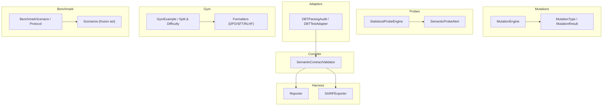
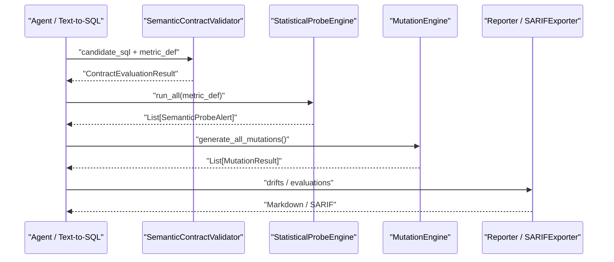
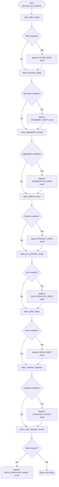
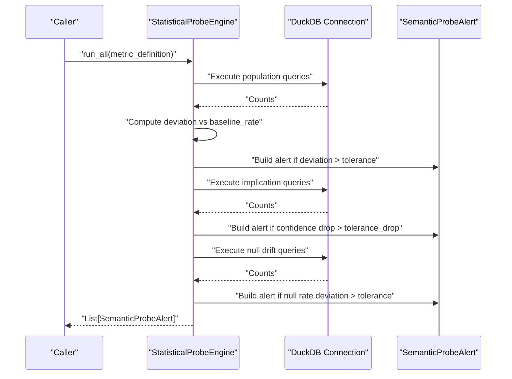
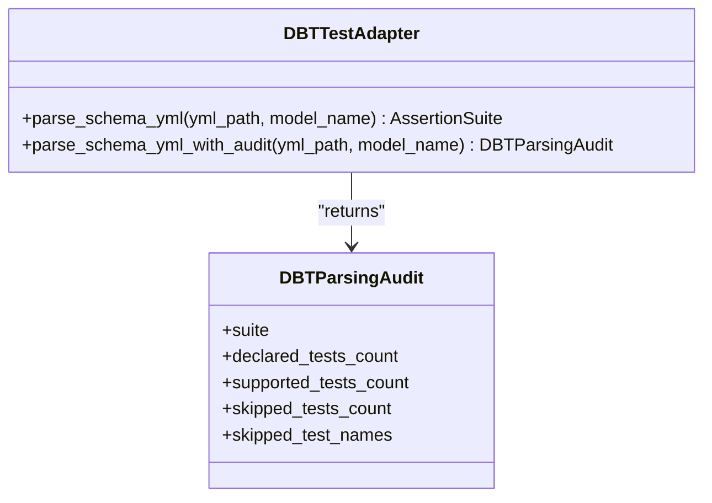
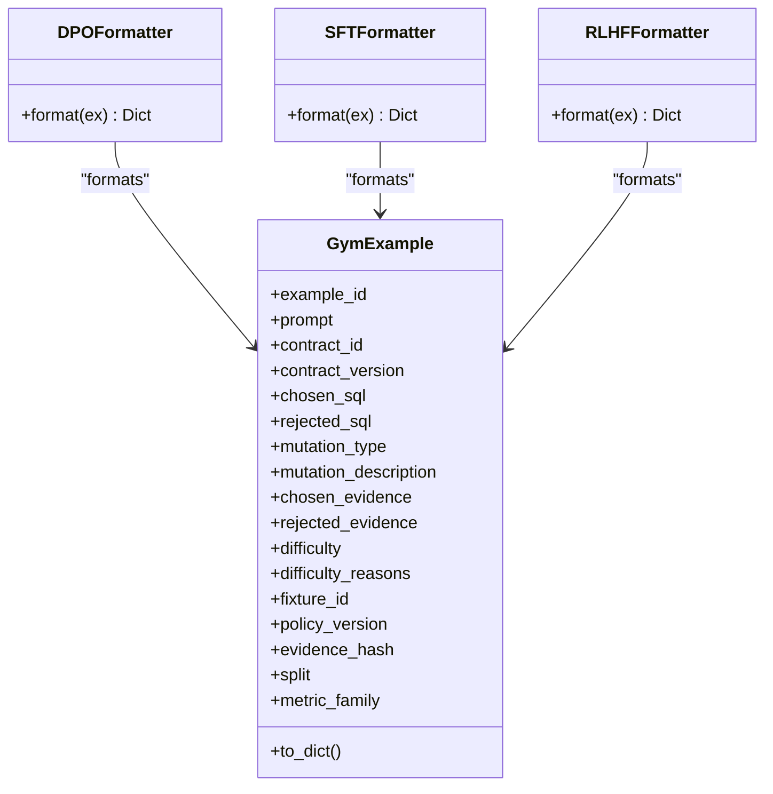
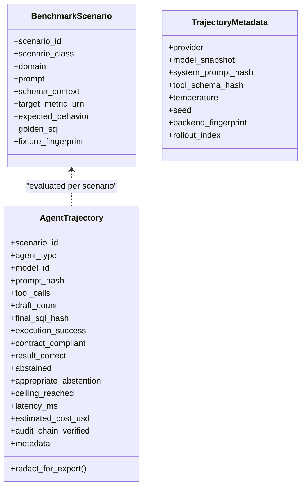
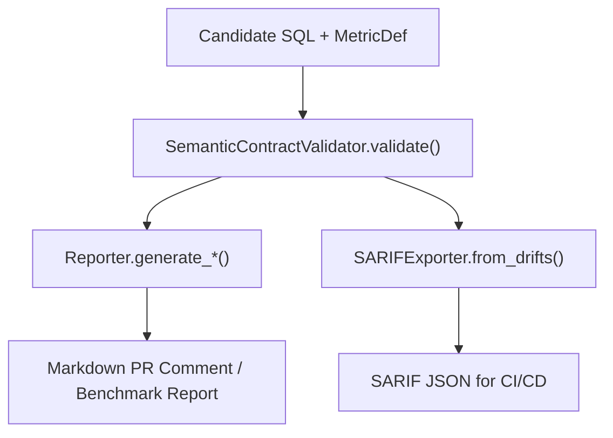
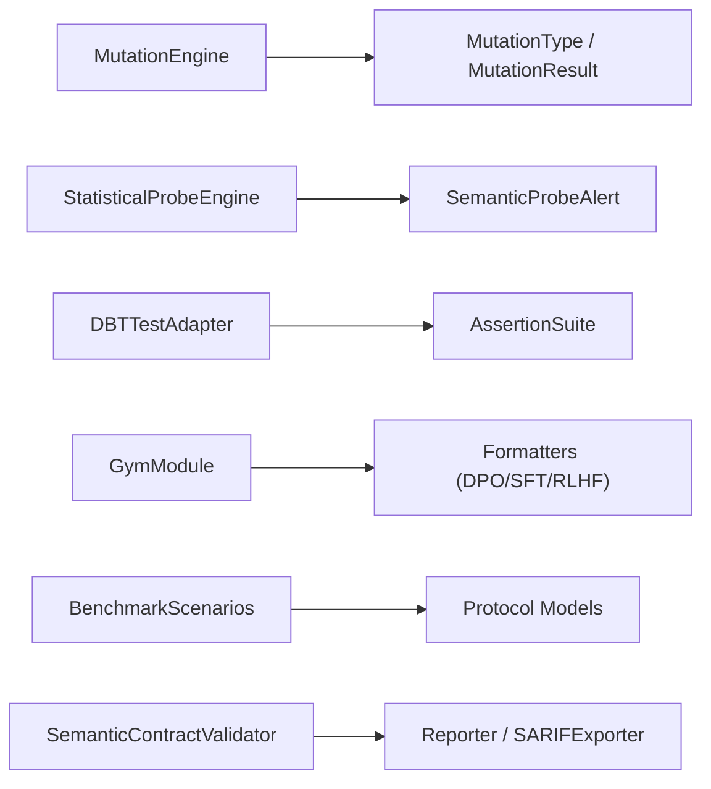

# Advanced Features

<cite>
**Referenced Files in This Document**
- [README.md](file://README.md)
- [gym/__init__.py](file://semantic_reliability/gym/__init__.py)
- [gym/models.py](file://semantic_reliability/gym/models.py)
- [gym/formatters.py](file://semantic_reliability/gym/formatters.py)
- [testing/mutations/engine.py](file://semantic_reliability/testing/mutations/engine.py)
- [testing/mutations/mutators.py](file://semantic_reliability/testing/mutations/mutators.py)
- [probes/engine.py](file://semantic_reliability/probes/engine.py)
- [probes/signals.py](file://semantic_reliability/probes/signals.py)
- [adapters/dbt_adapter.py](file://semantic_reliability/adapters/dbt_adapter.py)
- [benchmark/scenarios.py](file://semantic_reliability/benchmark/scenarios.py)
- [benchmark/protocol.py](file://semantic_reliability/benchmark/protocol.py)
- [compiler/contracts.py](file://semantic_reliability/compiler/contracts.py)
- [harness/reporter.py](file://semantic_reliability/harness/reporter.py)
- [harness/sarif_exporter.py](file://semantic_reliability/harness/sarif_exporter.py)
</cite>

## Table of Contents
1. Introduction
2. Project Structure
3. Core Components
4. Architecture Overview
5. Detailed Component Analysis
6. Dependency Analysis
7. Performance Considerations
8. Troubleshooting Guide
9. Conclusion
10. Appendices

## Introduction
This document explains advanced capabilities for extending and operating the Semantic Reliability Engine (SRE). It focuses on:
- Custom mutator development for SQL AST-level mutations
- Statistical probe implementation to detect data drift and decoupling from contracts
- Adapter extensions, including a DBT adapter that maps dbt tests to SRE assertions
- The gym module for dataset formatting and training data generation across DPO, SFT, and RLHF formats
- Advanced benchmarking with scenario definitions and protocol metadata
- Extension points for custom validation logic and reporting formats
- Complex use cases, integration patterns, performance optimization, configuration options, and contribution guidance

The repository’s README provides high-level context about the problem space, architecture, quickstart usage, CLI/MCP server, and testing coverage.

**Section sources**
- [README.md:22-46](file://README.md#L22-L46)
- [README.md:49-112](file://README.md#L49-L112)
- [README.md:130-145](file://README.md#L130-L145)

## Project Structure
At a high level, advanced features are organized into:
- Mutations: AST-level mutation engine and types
- Probes: Statistical probes against live or snapshot data
- Adapters: Mapping external test definitions (e.g., dbt) to SRE assertions
- Gym: Dataset generation and formatters for AI training pipelines
- Benchmark: Scenario definitions and protocol models for agent evaluation
- Compiler: Contract-based semantic invariant validation
- Harness: Reporting and SARIF export for CI/CD

**Diagram sources**
- [testing/mutations/engine.py:8-52](file://semantic_reliability/testing/mutations/engine.py#L8-L52)
- [testing/mutations/mutators.py:8-27](file://semantic_reliability/testing/mutations/mutators.py#L8-L27)
- [probes/engine.py:11-38](file://semantic_reliability/probes/engine.py#L11-L38)
- [probes/signals.py:5-17](file://semantic_reliability/probes/signals.py#L5-L17)
- [adapters/dbt_adapter.py:20-137](file://semantic_reliability/adapters/dbt_adapter.py#L20-L137)
- [gym/models.py:8-88](file://semantic_reliability/gym/models.py#L8-L88)
- [gym/formatters.py:5-78](file://semantic_reliability/gym/formatters.py#L5-L78)
- [benchmark/protocol.py:8-96](file://semantic_reliability/benchmark/protocol.py#L8-L96)
- [benchmark/scenarios.py:4-213](file://semantic_reliability/benchmark/scenarios.py#L4-L213)
- [compiler/contracts.py:26-135](file://semantic_reliability/compiler/contracts.py#L26-L135)
- [harness/reporter.py:8-129](file://semantic_reliability/harness/reporter.py#L8-L129)
- [harness/sarif_exporter.py:9-100](file://semantic_reliability/harness/sarif_exporter.py#L9-L100)

**Section sources**
- [gym/__init__.py:1-45](file://semantic_reliability/gym/__init__.py#L1-L45)

## Core Components
- Custom Mutators: AST-level mutation operators that simulate common SQL logic bugs (filter drops, boundary shifts, aggregation swaps, join predicate drops, grain changes, coalesce bypasses, math operator inversions, distinct drops).
- Statistical Probes: Declarative checks over population rates, implication confidence, and null drift against live connections or snapshots.
- DBT Adapter: Parses dbt schema.yml tests and maps them to SRE structural assertions with audit tracking.
- Gym Module: Generates paired examples (chosen vs rejected SQL) with evidence hashing, difficulty assignment, and deterministic splits; exports to DPO, SFT, and RLHF formats.
- Benchmark Scenarios: Frozen scenarios aligned with corpus metrics, covering clear contracts, ambiguous metrics, missing contracts, and contract conflicts.
- Contract Validation: Enforces population filters, grouping dimensions, aggregation components, and timezone constraints.
- Reporting: Human-readable PR comments and SARIF outputs for CI/CD integration.

**Section sources**
- [testing/mutations/engine.py:8-52](file://semantic_reliability/testing/mutations/engine.py#L8-L52)
- [probes/engine.py:11-38](file://semantic_reliability/probes/engine.py#L11-L38)
- [adapters/dbt_adapter.py:30-137](file://semantic_reliability/adapters/dbt_adapter.py#L30-L137)
- [gym/models.py:20-88](file://semantic_reliability/gym/models.py#L20-L88)
- [benchmark/scenarios.py:4-213](file://semantic_reliability/benchmark/scenarios.py#L4-L213)
- [compiler/contracts.py:26-135](file://semantic_reliability/compiler/contracts.py#L26-L135)
- [harness/reporter.py:8-129](file://semantic_reliability/harness/reporter.py#L8-L129)
- [harness/sarif_exporter.py:9-100](file://semantic_reliability/harness/sarif_exporter.py#L9-L100)

## Architecture Overview
The system evaluates generated SQL by combining contract-aware validation, statistical probing, and mutation-based robustness checks. Reports integrate into CI/CD via markdown and SARIF.

**Diagram sources**
- [compiler/contracts.py:26-135](file://semantic_reliability/compiler/contracts.py#L26-L135)
- [probes/engine.py:11-38](file://semantic_reliability/probes/engine.py#L11-L38)
- [testing/mutations/engine.py:8-52](file://semantic_reliability/testing/mutations/engine.py#L8-L52)
- [harness/reporter.py:8-129](file://semantic_reliability/harness/reporter.py#L8-L129)
- [harness/sarif_exporter.py:9-100](file://semantic_reliability/harness/sarif_exporter.py#L9-L100)

## Detailed Component Analysis

### Custom Mutator Development
- Purpose: Inject precise AST-level logical mutations to stress-test assertion suites and reveal blind spots.
- Key classes:
  - MutationEngine: Orchestrates multiple injectors for filter drop, boundary shift, aggregation swap, distinct drop, join predicate drop, grain drop, coalesce bypass, and math operator invert.
  - MutationType and MutationResult: Enumerates mutation categories and captures original/mutated SQL plus target node and category.
- Extensibility: Add new mutation methods following the existing pattern (parse AST, locate nodes, mutate, return MutationResult).

**Diagram sources**
- [testing/mutations/engine.py:16-52](file://semantic_reliability/testing/mutations/engine.py#L16-L52)
- [testing/mutations/engine.py:54-269](file://semantic_reliability/testing/mutations/engine.py#L54-L269)
- [testing/mutations/mutators.py:8-27](file://semantic_reliability/testing/mutations/mutators.py#L8-L27)

**Section sources**
- [testing/mutations/engine.py:8-269](file://semantic_reliability/testing/mutations/engine.py#L8-L269)
- [testing/mutations/mutators.py:8-27](file://semantic_reliability/testing/mutations/mutators.py#L8-L27)

### Statistical Probe Implementation
- Purpose: Detect decoupling between empirical data reality and contract assumptions using declarative probes.
- Capabilities:
  - Population rate checks with tolerance thresholds
  - Implication confidence decay detection
  - Null drift monitoring
- Output: Structured alerts with baseline/current values, relative change, confidence, and likely causes.

**Diagram sources**
- [probes/engine.py:11-138](file://semantic_reliability/probes/engine.py#L11-L138)
- [probes/signals.py:5-17](file://semantic_reliability/probes/signals.py#L5-L17)

**Section sources**
- [probes/engine.py:11-138](file://semantic_reliability/probes/engine.py#L11-L138)
- [probes/signals.py:5-17](file://semantic_reliability/probes/signals.py#L5-L17)

### Adapter Extensions (DBT Integration)
- Purpose: Translate dbt schema.yml tests into SRE assertions with audit tracking for supported vs skipped tests.
- Supported mappings include not_null, unique, accepted_values, accepted_range, relationships, unique combinations, and row_count_bounds.
- Audit output includes declared, supported, and skipped counts plus names of skipped tests.

**Diagram sources**
- [adapters/dbt_adapter.py:20-137](file://semantic_reliability/adapters/dbt_adapter.py#L20-L137)

**Section sources**
- [adapters/dbt_adapter.py:20-137](file://semantic_reliability/adapters/dbt_adapter.py#L20-L137)

### Gym Module: Dataset Formatting and Training Data Generation
- Models:
  - RejectionReason: Enumerates reasons for rejecting candidate SQL pairs.
  - SPLIT_RULES: Deterministic mapping of mutation families to train/validation/holdout splits.
  - assign_split: Hash-based deterministic split assignment based on metric family.
  - assign_difficulty: Multi-factor heuristic assigning easy/medium/hard with reasons.
  - compute_evidence_hash: SHA256 hash over canonical JSON payload for reproducibility.
  - GymExample: Core record containing prompt, contract info, chosen/rejected SQL, evidence, difficulty, fixture, policy version, evidence hash, split, and metric family.
- Formatters:
  - DPOFormatter: Produces prompt/chosen/rejected with metadata for preference learning.
  - SFTFormatter: Produces instruction-completion pairs with reason codes and metadata.
  - RLHFFormatter: Produces reward modeling pairs with multi-component reward breakdowns.
- Export: get_formatter selects formatter by name.

**Diagram sources**
- [gym/models.py:8-88](file://semantic_reliability/gym/models.py#L8-L88)
- [gym/formatters.py:5-78](file://semantic_reliability/gym/formatters.py#L5-L78)

**Section sources**
- [gym/models.py:8-88](file://semantic_reliability/gym/models.py#L8-L88)
- [gym/formatters.py:5-78](file://semantic_reliability/gym/formatters.py#L5-L78)
- [gym/__init__.py:1-45](file://semantic_reliability/gym/__init__.py#L1-L45)

### Advanced Benchmarking: Scenario Definition and Protocol
- Scenarios: Frozen set of 20 scenarios across four classes: CLEAR_CONTRACT, AMBIGUOUS_METRIC, MISSING_CONTRACT, CONTRACT_CONFLICT. Each includes domain, prompt, schema context, expected behavior, and optional golden SQL.
- Protocol: Defines immutable scenario definitions, tool call records, trajectory metadata, agent trajectories, net governance policy weights, and frozen protocol configuration for reproducibility.

**Diagram sources**
- [benchmark/scenarios.py:4-213](file://semantic_reliability/benchmark/scenarios.py#L4-L213)
- [benchmark/protocol.py:8-96](file://semantic_reliability/benchmark/protocol.py#L8-L96)

**Section sources**
- [benchmark/scenarios.py:4-213](file://semantic_reliability/benchmark/scenarios.py#L4-L213)
- [benchmark/protocol.py:8-96](file://semantic_reliability/benchmark/protocol.py#L8-L96)

### Extension Points: Custom Validation Logic and Reporting Formats
- Custom Validation: Implement additional checks in the compiler layer by extending invariant rules (population filters, grain dimensions, aggregation components, timezone constraints). Use sqlglot AST parsing to validate candidate SQL against metric definitions.
- Reporting Formats:
  - Reporter: Generates human-readable markdown for PR comments and benchmark reports.
  - SARIFExporter: Converts drifts into standard SARIF 2.1.0 JSON for GitHub Code Scanning.

**Diagram sources**
- [compiler/contracts.py:26-135](file://semantic_reliability/compiler/contracts.py#L26-L135)
- [harness/reporter.py:8-129](file://semantic_reliability/harness/reporter.py#L8-L129)
- [harness/sarif_exporter.py:9-100](file://semantic_reliability/harness/sarif_exporter.py#L9-L100)

**Section sources**
- [compiler/contracts.py:26-135](file://semantic_reliability/compiler/contracts.py#L26-L135)
- [harness/reporter.py:8-129](file://semantic_reliability/harness/reporter.py#L8-L129)
- [harness/sarif_exporter.py:9-100](file://semantic_reliability/harness/sarif_exporter.py#L9-L100)

## Dependency Analysis
Key dependencies and relationships:
- MutationEngine depends on sqlglot AST nodes and returns MutationResult instances typed by MutationType.
- StatisticalProbeEngine executes DuckDB queries and emits SemanticProbeAlert objects.
- DBTTestAdapter parses YAML and constructs AssertionSuite entries mapped to structural assertions.
- Gym module composes GymExample with deterministic splitting/difficulty and exports via formatters.
- Benchmark scenarios reference protocol models for consistent evaluation and replay.
- Compiler validates candidate SQL against metric definitions and feeds reporters/exporters.

**Diagram sources**
- [testing/mutations/engine.py:8-52](file://semantic_reliability/testing/mutations/engine.py#L8-L52)
- [testing/mutations/mutators.py:8-27](file://semantic_reliability/testing/mutations/mutators.py#L8-L27)
- [probes/engine.py:11-38](file://semantic_reliability/probes/engine.py#L11-L38)
- [probes/signals.py:5-17](file://semantic_reliability/probes/signals.py#L5-L17)
- [adapters/dbt_adapter.py:20-137](file://semantic_reliability/adapters/dbt_adapter.py#L20-L137)
- [gym/formatters.py:5-78](file://semantic_reliability/gym/formatters.py#L5-L78)
- [benchmark/scenarios.py:4-213](file://semantic_reliability/benchmark/scenarios.py#L4-L213)
- [benchmark/protocol.py:8-96](file://semantic_reliability/benchmark/protocol.py#L8-L96)
- [compiler/contracts.py:26-135](file://semantic_reliability/compiler/contracts.py#L26-L135)
- [harness/reporter.py:8-129](file://semantic_reliability/harness/reporter.py#L8-L129)
- [harness/sarif_exporter.py:9-100](file://semantic_reliability/harness/sarif_exporter.py#L9-L100)

**Section sources**
- [testing/mutations/engine.py:8-269](file://semantic_reliability/testing/mutations/engine.py#L8-L269)
- [probes/engine.py:11-138](file://semantic_reliability/probes/engine.py#L11-L138)
- [adapters/dbt_adapter.py:20-137](file://semantic_reliability/adapters/dbt_adapter.py#L20-L137)
- [gym/formatters.py:5-78](file://semantic_reliability/gym/formatters.py#L5-L78)
- [benchmark/scenarios.py:4-213](file://semantic_reliability/benchmark/scenarios.py#L4-L213)
- [benchmark/protocol.py:8-96](file://semantic_reliability/benchmark/protocol.py#L8-L96)
- [compiler/contracts.py:26-135](file://semantic_reliability/compiler/contracts.py#L26-L135)
- [harness/reporter.py:8-129](file://semantic_reliability/harness/reporter.py#L8-L129)
- [harness/sarif_exporter.py:9-100](file://semantic_reliability/harness/sarif_exporter.py#L9-L100)

## Performance Considerations
- AST Parsing: Use dialect-aware parsing to minimize overhead and ensure compatibility across SQL engines.
- Query Efficiency: In probes, prefer targeted COUNT/CASE queries and avoid full table scans where possible.
- Determinism: Leverage deterministic hashing for evidence and split assignments to enable reproducible runs and caching strategies.
- Concurrency: When running many mutations or probes, consider batching queries and parallelizing independent checks while respecting connection limits.
- Reporting: Generate concise reports and SARIF outputs only when needed to reduce I/O overhead in CI/CD.

[No sources needed since this section provides general guidance]

## Troubleshooting Guide
Common issues and diagnostics:
- Mutation failures: Inspect MutationResult descriptions and target nodes to identify which AST component was mutated and whether it is valid for your metric definition.
- Probe errors: Check SemanticProbeAlert fields (baseline/current/relative_change/confidence/likely_causes) and logs for failed queries or unexpected data distributions.
- DBT mapping gaps: Review skipped_test_names in DBTParsingAudit to understand unsupported tests and extend mappings as needed.
- Contract violations: Use ContractEvaluationResult.violations to pinpoint missing filters, incorrect grouping, omitted aggregation components, or timezone mismatches.
- Reporting discrepancies: Validate drift severity mapping and ensure file paths in SARIF match repository structure.

**Section sources**
- [testing/mutations/mutators.py:19-27](file://semantic_reliability/testing/mutations/mutators.py#L19-L27)
- [probes/engine.py:40-138](file://semantic_reliability/probes/engine.py#L40-L138)
- [adapters/dbt_adapter.py:30-137](file://semantic_reliability/adapters/dbt_adapter.py#L30-L137)
- [compiler/contracts.py:26-135](file://semantic_reliability/compiler/contracts.py#L26-L135)
- [harness/sarif_exporter.py:9-100](file://semantic_reliability/harness/sarif_exporter.py#L9-L100)

## Conclusion
The advanced features provide a comprehensive toolkit for ensuring business-semantic correctness in AI-generated SQL:
- Robust mutation testing exposes blind spots in assertion suites
- Statistical probes detect subtle data drift and decoupling from contracts
- DBT adapter bridges existing test ecosystems into SRE
- Gym enables scalable dataset generation and training format exports
- Benchmark scenarios and protocol support reproducible agent evaluation
- Contract validation and reporting integrate seamlessly into CI/CD workflows

These capabilities together form an extensible framework for maintaining reliability as data and models evolve.

[No sources needed since this section summarizes without analyzing specific files]

## Appendices

### Complex Use Cases and Integration Patterns
- End-to-end guardrailing: Wrap agent tools with SRE to intercept queries, enforce contracts, and feed back corrections before execution.
- CI/CD integration: Run mutation benchmarks and statistical probes in pull requests; publish SARIF reports to code scanning tabs.
- Training pipelines: Use gym formatters to produce DPO/SFT/RLHF datasets from validated SQL pairs for fine-tuning text-to-SQL models.

[No sources needed since this section provides general guidance]

### Contribution Guidelines and Compatibility
- Follow existing patterns for adding new mutation types, probe checks, and report formats.
- Maintain deterministic behavior for splits and hashes to preserve reproducibility.
- Ensure compatibility with multiple SQL dialects via sqlglot read/write parameters.
- Keep documentation and tests updated alongside feature changes.

[No sources needed since this section provides general guidance]