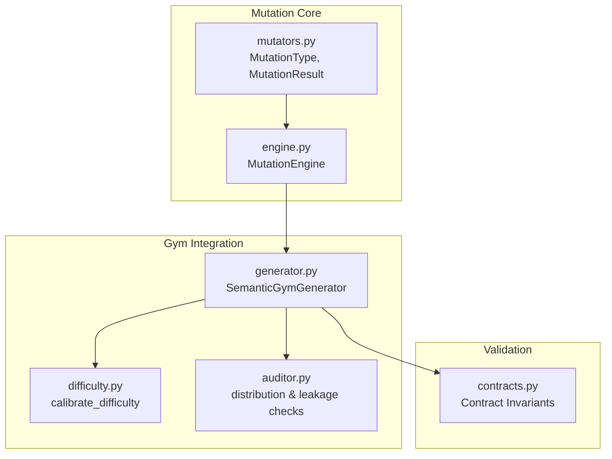
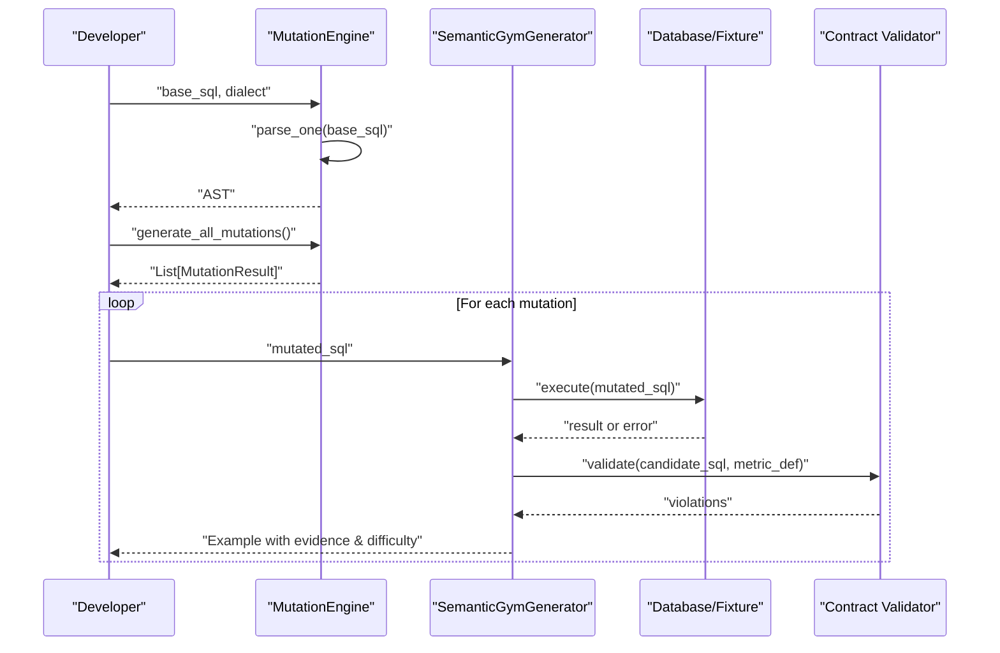
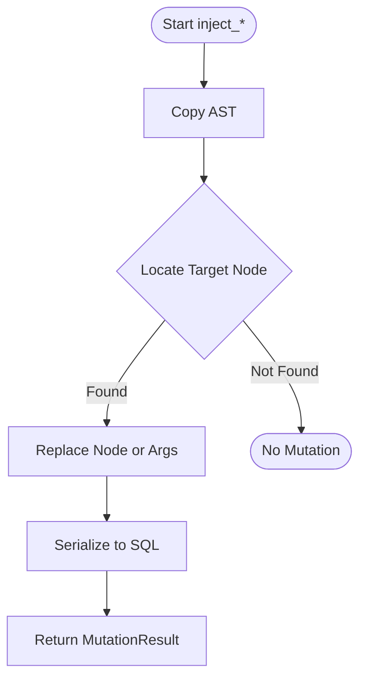
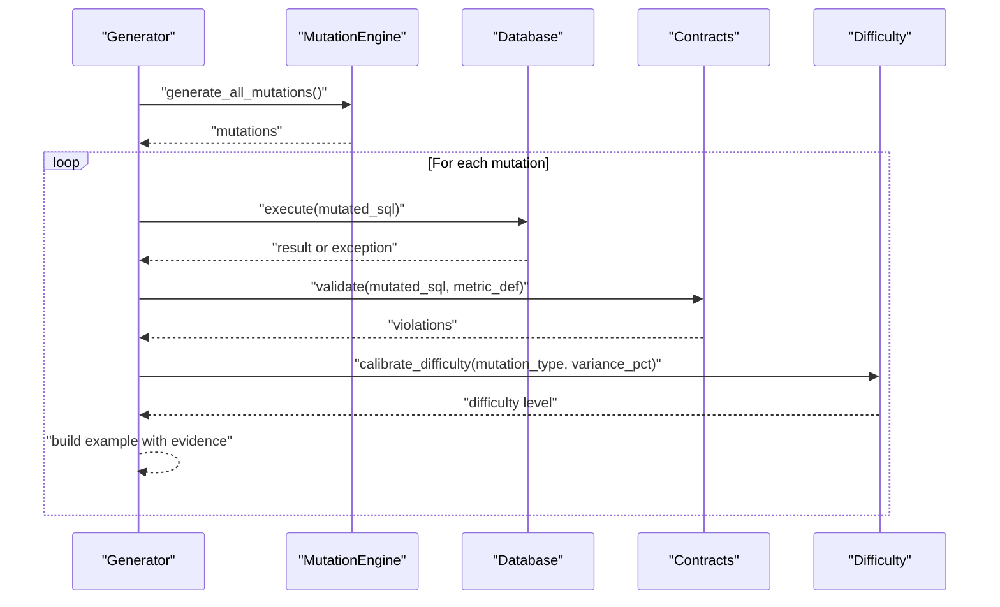
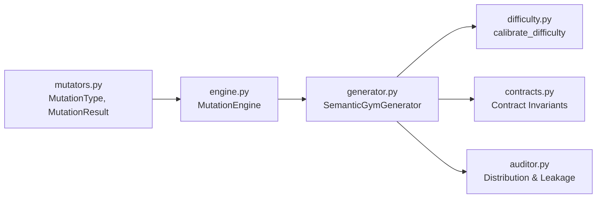

# Custom Mutator Development

<cite>
**Referenced Files in This Document**
- [engine.py](file://semantic_reliability/testing/mutations/engine.py)
- [mutators.py](file://semantic_reliability/testing/mutations/mutators.py)
- [generator.py](file://semantic_reliability/gym/generator.py)
- [difficulty.py](file://semantic_reliability/gym/difficulty.py)
- [auditor.py](file://semantic_reliability/gym/auditor.py)
- [contracts.py](file://semantic_reliability/compiler/contracts.py)
- [test_mutations.py](file://tests/test_mutations.py)
</cite>

## Table of Contents
1. Introduction
2. Project Structure
3. Core Components
4. Architecture Overview
5. Detailed Component Analysis
6. Dependency Analysis
7. Performance Considerations
8. Troubleshooting Guide
9. Conclusion
10. Appendices

## Introduction
This document explains how to develop custom SQL mutators for the Semantic Reliability Engine. It covers the mutation interface, operator patterns, AST manipulation techniques, and how to create domain-specific mutations for business logic testing. You will learn how to implement complex operators targeting JOINs, aggregations, and window functions; classify mutation severity; generate test cases; integrate with the mutation engine; and ensure compatibility across SQL dialects while maintaining performance and correctness.

## Project Structure
The mutation system is centered around a small set of modules:
- Mutation types and result model define the contract between mutators and consumers.
- The mutation engine orchestrates AST-based mutations using sqlglot.
- The gym generator integrates mutations into end-to-end evaluation flows, executing mutated SQL against fixtures and validating contracts.
- Difficulty calibration assigns severity levels based on mutation type and observed variance.
- Auditing tracks distribution and leakage constraints for training data integrity.
- Contract validation ensures candidate SQL adheres to declared invariants.

**Diagram sources**
- [mutators.py:8-26](file://semantic_reliability/testing/mutations/mutators.py#L8-L26)
- [engine.py:8-52](file://semantic_reliability/testing/mutations/engine.py#L8-L52)
- [generator.py:92-198](file://semantic_reliability/gym/generator.py#L92-L198)
- [difficulty.py:3-26](file://semantic_reliability/gym/difficulty.py#L3-L26)
- [auditor.py:111-137](file://semantic_reliability/gym/auditor.py#L111-L137)
- [contracts.py:92-113](file://semantic_reliability/compiler/contracts.py#L92-L113)

**Section sources**
- [mutators.py:8-26](file://semantic_reliability/testing/mutations/mutators.py#L8-L26)
- [engine.py:8-52](file://semantic_reliability/testing/mutations/engine.py#L8-L52)
- [generator.py:92-198](file://semantic_reliability/gym/generator.py#L92-L198)
- [difficulty.py:3-26](file://semantic_reliability/gym/difficulty.py#L3-L26)
- [auditor.py:111-137](file://semantic_reliability/gym/auditor.py#L111-L137)
- [contracts.py:92-113](file://semantic_reliability/compiler/contracts.py#L92-L113)

## Core Components
- MutationType enumerates supported mutation categories (e.g., FILTER_DROP, BOUNDARY_SHIFT, AGGREGATION_SWAP).
- MutationResult models each applied mutation with metadata such as original SQL, mutated SQL, target node, and category.
- MutationEngine parses SQL into an AST and provides inject_* methods that perform targeted AST manipulations and return MutationResult instances.
- Gym integration executes mutated SQL against fixtures, compares results to baseline, validates contracts, and assigns difficulty/severity.

Key responsibilities:
- Define stable mutation taxonomy via MutationType.
- Provide deterministic, reversible AST mutations via inject_* methods.
- Integrate with execution and validation to produce meaningful test cases.

**Section sources**
- [mutators.py:8-26](file://semantic_reliability/testing/mutations/mutators.py#L8-L26)
- [engine.py:8-52](file://semantic_reliability/testing/mutations/engine.py#L8-L52)
- [generator.py:92-198](file://semantic_reliability/gym/generator.py#L92-L198)

## Architecture Overview
The mutation pipeline transforms base SQL into multiple semantically altered variants, then evaluates them against fixtures and contracts to identify divergences and violations.

**Diagram sources**
- [engine.py:11-52](file://semantic_reliability/testing/mutations/engine.py#L11-L52)
- [generator.py:92-198](file://semantic_reliability/gym/generator.py#L92-L198)
- [contracts.py:92-113](file://semantic_reliability/compiler/contracts.py#L92-L113)

## Detailed Component Analysis

### Mutation Interface and Result Model
- MutationType defines the canonical set of mutation categories used throughout the system.
- MutationResult captures the essential metadata for each mutation, enabling downstream consumers to log, filter, and analyze changes.

Best practices:
- Use descriptive mutation_category values to group related mutations.
- Keep descriptions concise and actionable for debugging.

**Section sources**
- [mutators.py:8-26](file://semantic_reliability/testing/mutations/mutators.py#L8-L26)

### MutationEngine: AST Manipulation Patterns
The engine implements several injection methods that demonstrate common AST manipulation patterns:
- Filter drop: remove a WHERE conjunct or entire WHERE clause.
- Boundary shift: mutate comparison operators (>, <, =).
- Aggregation swap: replace SUM/AVG/COUNT with another aggregation.
- Distinct drop: remove DISTINCT modifier from COUNT(DISTINCT ...).
- Join predicate drop: remove ON condition to simulate Cartesian explosion risk.
- Grain drop: remove a column from GROUP BY to over-aggregate.
- Coalesce bypass: replace COALESCE(col, default) with col to expose NULL propagation.
- Math operator invert: flip + to - or - to +.

Implementation notes:
- Always work on a copy of the AST to avoid mutating the original query.
- Use find/find_all to locate specific nodes and replace() to apply changes.
- Serialize back to SQL with pretty formatting for readability.

**Diagram sources**
- [engine.py:54-268](file://semantic_reliability/testing/mutations/engine.py#L54-L268)

**Section sources**
- [engine.py:54-268](file://semantic_reliability/testing/mutations/engine.py#L54-L268)

### Gym Integration: Execution, Validation, and Severity
The gym generator:
- Invokes MutationEngine to produce mutations.
- Executes mutated SQL against fixtures and computes variance vs baseline.
- Validates mutated SQL against semantic contracts to detect invariant violations.
- Assigns difficulty/severity using calibrate_difficulty.
- Produces structured examples with chosen/rejected evidence and mutation metadata.

**Diagram sources**
- [generator.py:92-198](file://semantic_reliability/gym/generator.py#L92-L198)
- [difficulty.py:3-26](file://semantic_reliability/gym/difficulty.py#L3-L26)
- [contracts.py:92-113](file://semantic_reliability/compiler/contracts.py#L92-L113)

**Section sources**
- [generator.py:92-198](file://semantic_reliability/gym/generator.py#L92-L198)
- [difficulty.py:3-26](file://semantic_reliability/gym/difficulty.py#L3-L26)
- [contracts.py:92-113](file://semantic_reliability/compiler/contracts.py#L92-L113)

### Severity Classification and Leakage Controls
- Difficulty calibration maps mutation types and observed variance to severity levels (easy, medium, hard, expert).
- Auditor enforces split rules to prevent holdout mutation families from leaking into training splits and tracks distributions.

Practical guidance:
- Use calibrate_difficulty to consistently label severity when adding new mutation types.
- Ensure new mutations are not inadvertently included in restricted splits unless intended.

**Section sources**
- [difficulty.py:3-26](file://semantic_reliability/gym/difficulty.py#L3-L26)
- [auditor.py:111-137](file://semantic_reliability/gym/auditor.py#L111-L137)

### Contract Validation and Business Logic Testing
- Contract validation checks invariants such as required positive/negative components in net aggregations.
- Mutations should be evaluated against these invariants to ensure they remain semantically valid or intentionally violate contracts for testing.

**Section sources**
- [contracts.py:92-113](file://semantic_reliability/compiler/contracts.py#L92-L113)

### Example Implementations and Test Coverage
- Unit tests verify that each inject_* method produces a valid MutationResult and that mutated SQL remains parseable.
- Tests assert expected behaviors like boundary shifts producing >= operators and coalesce bypass removing COALESCE.

**Section sources**
- [test_mutations.py:1-64](file://tests/test_mutations.py#L1-L64)

## Dependency Analysis
The following diagram shows key dependencies among core modules:

**Diagram sources**
- [mutators.py:8-26](file://semantic_reliability/testing/mutations/mutators.py#L8-L26)
- [engine.py:8-52](file://semantic_reliability/testing/mutations/engine.py#L8-L52)
- [generator.py:92-198](file://semantic_reliability/gym/generator.py#L92-L198)
- [difficulty.py:3-26](file://semantic_reliability/gym/difficulty.py#L3-L26)
- [contracts.py:92-113](file://semantic_reliability/compiler/contracts.py#L92-L113)
- [auditor.py:111-137](file://semantic_reliability/gym/auditor.py#L111-L137)

**Section sources**
- [mutators.py:8-26](file://semantic_reliability/testing/mutations/mutators.py#L8-L26)
- [engine.py:8-52](file://semantic_reliability/testing/mutations/engine.py#L8-L52)
- [generator.py:92-198](file://semantic_reliability/gym/generator.py#L92-L198)
- [difficulty.py:3-26](file://semantic_reliability/gym/difficulty.py#L3-L26)
- [contracts.py:92-113](file://semantic_reliability/compiler/contracts.py#L92-L113)
- [auditor.py:111-137](file://semantic_reliability/gym/auditor.py#L111-L137)

## Performance Considerations
- AST operations: Prefer targeted find/find_all calls and minimal replacements to reduce traversal overhead.
- Query execution: Execute only necessary mutated queries; skip identical outputs early to avoid redundant computation.
- Dialect parsing: Pass dialect to parser to avoid re-parsing or fallback costs.
- Fixture size: Use representative but compact fixtures to speed up execution during mutation sweeps.
- Concurrency: If integrating with external runners, consider batching executions and limiting concurrent database connections.

[No sources needed since this section provides general guidance]

## Troubleshooting Guide
Common issues and remedies:
- Unexecutable mutated SQL: Catch exceptions during execution and reject such mutations; inspect target_node and description to understand which AST change caused failure.
- Identical output: Skip mutations that do not alter SQL string semantics; track rejection reasons to improve coverage.
- No divergence detected: Verify fixture sensitivity and baseline comparability; adjust variance thresholds or include more diverse fixtures.
- Contract violations: Review violated invariants and remediation hints to align candidate SQL with business definitions.

Operational tips:
- Log mutation_category and target_node for quick triage.
- Use unit tests to validate new inject_* methods before integration.
- Validate mutated SQL parses cleanly before execution.

**Section sources**
- [generator.py:92-198](file://semantic_reliability/gym/generator.py#L92-L198)
- [test_mutations.py:1-64](file://tests/test_mutations.py#L1-L64)

## Conclusion
The Semantic Reliability Engine’s mutation system provides a robust foundation for chaos engineering in data pipelines. By leveraging AST-level manipulations, contract validation, and severity classification, teams can systematically stress-test SQL logic, uncover subtle defects, and strengthen reliability. Extending the system with custom mutators follows a clear pattern: define a new MutationType, implement an inject_* method, integrate with the gym flow, and validate through tests and audits.

[No sources needed since this section summarizes without analyzing specific files]

## Appendices

### How to Create a Custom Mutator
Steps:
1. Add a new MutationType value in the mutation types module.
2. Implement a new inject_* method in the mutation engine:
   - Copy the AST.
   - Locate the target node(s) using find/find_all.
   - Apply a precise replacement or argument change.
   - Serialize to SQL and return a MutationResult with clear metadata.
3. Wire the new injector into generate_all_mutations so it participates in the full sweep.
4. Add unit tests asserting:
   - Non-null result when applicable.
   - Correct mutation_type and description.
   - Mutated SQL parses cleanly.
5. Integrate with gym to execute against fixtures, validate contracts, and assign difficulty.
6. Update auditor rules if the mutation belongs to a restricted family or split policy.

**Section sources**
- [mutators.py:8-26](file://semantic_reliability/testing/mutations/mutators.py#L8-L26)
- [engine.py:8-52](file://semantic_reliability/testing/mutations/engine.py#L8-L52)
- [generator.py:92-198](file://semantic_reliability/gym/generator.py#L92-L198)
- [difficulty.py:3-26](file://semantic_reliability/gym/difficulty.py#L3-L26)
- [auditor.py:111-137](file://semantic_reliability/gym/auditor.py#L111-L137)
- [test_mutations.py:1-64](file://tests/test_mutations.py#L1-L64)

### Examples of Complex Operators
- JOINs: Remove or weaken ON predicates to simulate accidental Cartesian products; alternatively, add spurious join conditions to restrict rows incorrectly.
- Aggregations: Swap SUM/AVG/COUNT or alter DISTINCT modifiers; introduce conditional aggregation misplacements.
- Window functions: Shift partition/order clauses, change frame bounds, or alter ranking functions to alter row attribution.
- Filters and boundaries: Drop critical AND conjuncts; shift inequality boundaries; bypass null safety with COALESCE removal.
- Arithmetic: Invert operators (+/-) or reorder operands to change results subtly.

For implementation patterns, refer to existing inject_* methods as templates for AST traversal and replacement.

**Section sources**
- [engine.py:54-268](file://semantic_reliability/testing/mutations/engine.py#L54-L268)

### Ensuring Compatibility Across SQL Dialects
- Always pass the correct dialect to the parser to ensure accurate AST construction.
- Avoid dialect-specific syntax in mutations unless explicitly supported by the target dialect.
- Validate mutated SQL by parsing it back with the same dialect before execution.
- When in doubt, prefer standard SQL constructs recognized across major engines.

**Section sources**
- [engine.py:11-14](file://semantic_reliability/testing/mutations/engine.py#L11-L14)