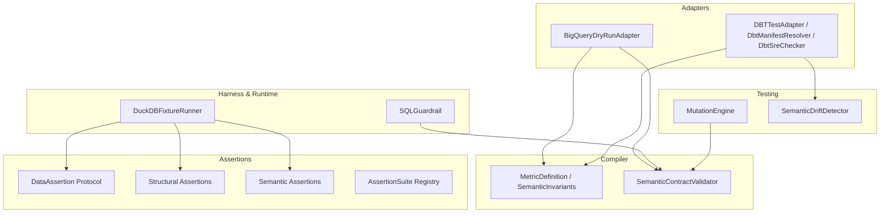
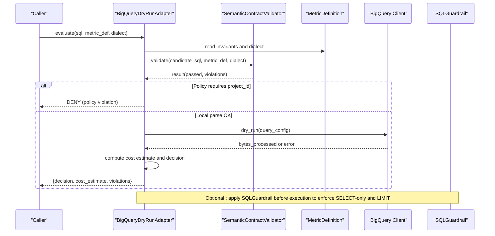
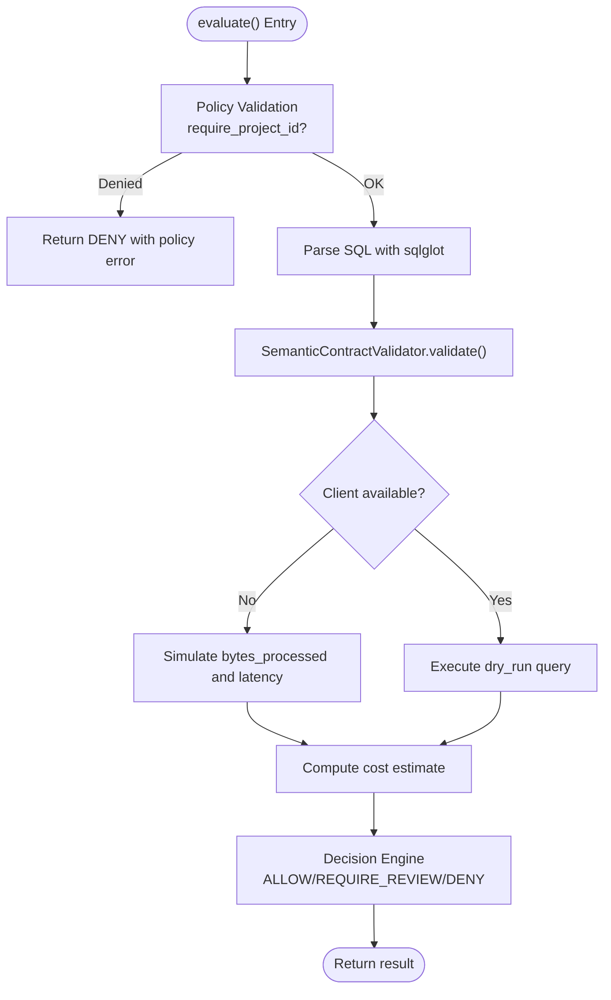
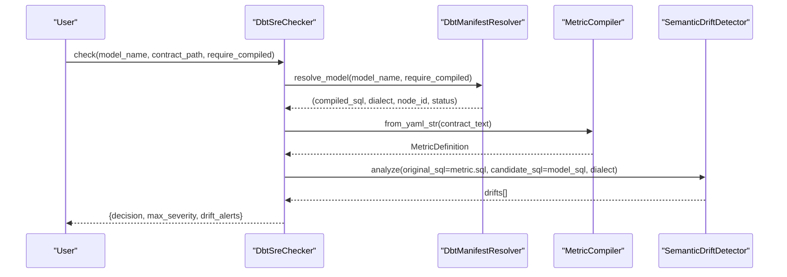
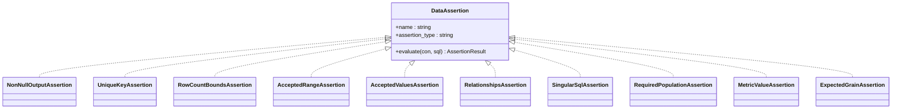
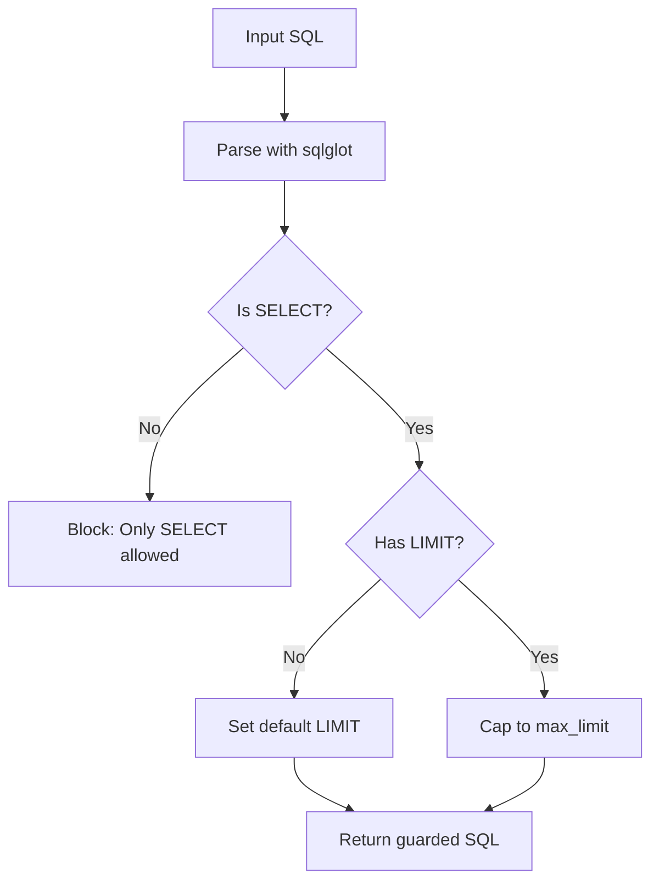
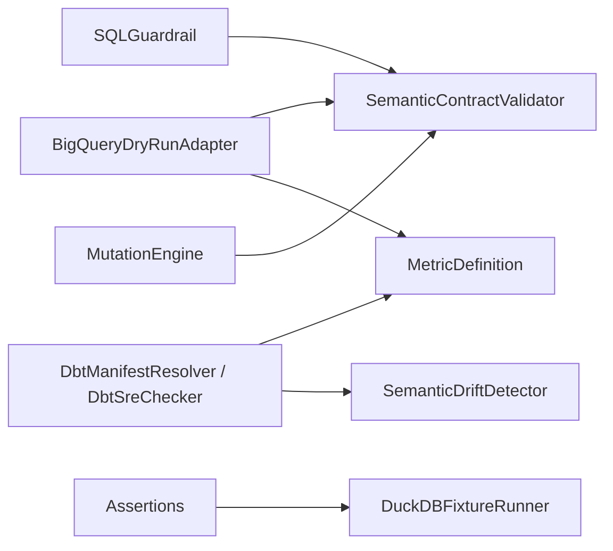

# Database Adapter Extensions

<cite>
**Referenced Files in This Document**
- [adapters/__init__.py](file://semantic_reliability/adapters/__init__.py)
- [bigquery.py](file://semantic_reliability/adapters/bigquery.py)
- [dbt_adapter.py](file://semantic_reliability/adapters/dbt_adapter.py)
- [dbt_integration.py](file://semantic_reliability/adapters/dbt_integration.py)
- [schema.py](file://semantic_reliability/compiler/schema.py)
- [contracts.py](file://semantic_reliability/compiler/contracts.py)
- [base.py](file://semantic_reliability/assertions/base.py)
- [structural.py](file://semantic_reliability/assertions/structural.py)
- [semantic.py](file://semantic_reliability/assertions/semantic.py)
- [registry.py](file://semantic_reliability/assertions/registry.py)
- [duckdb_runner.py](file://semantic_reliability/harness/duckdb_runner.py)
- [engine.py](file://semantic_reliability/testing/mutations/engine.py)
- [sql_guardrail.py](file://semantic_reliability/runtime/sql_guardrail.py)
- [detector.py](file://semantic_reliability/testing/drift/detector.py)
</cite>

## Table of Contents
1. Introduction
2. Project Structure
3. Core Components
4. Architecture Overview
5. Detailed Component Analysis
6. Dependency Analysis
7. Performance Considerations
8. Troubleshooting Guide
9. Conclusion
10. Appendices

## Introduction
This document explains how to extend database adapter support for additional platforms and SQL dialects within the framework. It covers the adapter interface, connection management patterns, query execution flows, and strategies for implementing new adapters while preserving compatibility with the core components. It also provides guidance on dialect-specific optimizations, connection pooling, error handling, metadata extraction, schema discovery, performance tuning, testing across multiple versions, platform-specific features, security considerations, and credential management for production deployments.

## Project Structure
The repository organizes adapter-related functionality under semantic_reliability/adapters, with supporting infrastructure in compiler, assertions, harness, runtime guardrails, and testing utilities:
- Adapters: BigQuery dry-run adapter and dbt integration/parsing utilities
- Compiler: Metric definitions, semantic invariants, and contract validation
- Assertions: Structural and semantic checks executed against a DuckDB connection or DataFrame
- Harness: In-memory execution and benchmarking via DuckDB
- Runtime: AST-based guardrails to enforce safe execution
- Testing: Mutation engine and drift detection for robustness and semantic stability

**Diagram sources**
- [bigquery.py:23-178](file://semantic_reliability/adapters/bigquery.py#L23-L178)
- [dbt_adapter.py:20-137](file://semantic_reliability/adapters/dbt_adapter.py#L20-L137)
- [dbt_integration.py:21-118](file://semantic_reliability/adapters/dbt_integration.py#L21-L118)
- [schema.py:83-98](file://semantic_reliability/compiler/schema.py#L83-L98)
- [contracts.py:26-135](file://semantic_reliability/compiler/contracts.py#L26-L135)
- [base.py:16-24](file://semantic_reliability/assertions/base.py#L16-L24)
- [structural.py:9-597](file://semantic_reliability/assertions/structural.py#L9-L597)
- [semantic.py:8-167](file://semantic_reliability/assertions/semantic.py#L8-L167)
- [registry.py:22-160](file://semantic_reliability/assertions/registry.py#L22-L160)
- [duckdb_runner.py:56-256](file://semantic_reliability/harness/duckdb_runner.py#L56-L256)
- [sql_guardrail.py:71-101](file://semantic_reliability/runtime/sql_guardrail.py#L71-L101)
- [engine.py:8-269](file://semantic_reliability/testing/mutations/engine.py#L8-L269)
- [detector.py:35-231](file://semantic_reliability/testing/drift/detector.py#L35-L231)

**Section sources**
- [adapters/__init__.py:1-14](file://semantic_reliability/adapters/__init__.py#L1-L14)
- [bigquery.py:23-178](file://semantic_reliability/adapters/bigquery.py#L23-L178)
- [dbt_adapter.py:20-137](file://semantic_reliability/adapters/dbt_adapter.py#L20-L137)
- [dbt_integration.py:21-118](file://semantic_reliability/adapters/dbt_integration.py#L21-L118)
- [schema.py:83-98](file://semantic_reliability/compiler/schema.py#L83-L98)
- [contracts.py:26-135](file://semantic_reliability/compiler/contracts.py#L26-L135)
- [base.py:16-24](file://semantic_reliability/assertions/base.py#L16-L24)
- [structural.py:9-597](file://semantic_reliability/assertions/structural.py#L9-L597)
- [semantic.py:8-167](file://semantic_reliability/assertions/semantic.py#L8-L167)
- [registry.py:22-160](file://semantic_reliability/assertions/registry.py#L22-L160)
- [duckdb_runner.py:56-256](file://semantic_reliability/harness/duckdb_runner.py#L56-L256)
- [sql_guardrail.py:71-101](file://semantic_reliability/runtime/sql_guardrail.py#L71-L101)
- [engine.py:8-269](file://semantic_reliability/testing/mutations/engine.py#L8-L269)
- [detector.py:35-231](file://semantic_reliability/testing/drift/detector.py#L35-L231)

## Core Components
- BigQueryDryRunAdapter: Validates SQL using local AST parsing and optional BigQuery dry-run API; enforces policy (budgets, project requirements), computes cost estimates, and returns decisions (ALLOW/REQUIRE_REVIEW/DENY).
- DBTTestAdapter: Parses dbt schema.yml tests into an AssertionSuite, tracking supported vs skipped tests.
- DbtManifestResolver and DbtSreChecker: Extract compiled SQL and dialect from dbt manifest; compare candidate model SQL against metric contracts and detect semantic drift.
- MetricDefinition and SemanticInvariants: Declarative contract schema defining grain, population, aggregation, units, time, and probes.
- SemanticContractValidator: Enforces invariants by parsing SQL into AST and checking required filters, grouping dimensions, aggregation components, and timezone constraints.
- DataAssertion Protocol and Implementations: Standardized interface for running structural and semantic assertions against a DuckDB connection or DataFrame.
- DuckDBFixtureRunner: Executes baseline and mutated queries in-memory, compares results, and evaluates assertion suites to classify mutations.
- SQLGuardrail: AST-based enforcement that blocks non-SELECT statements and caps LIMIT for safety.
- MutationEngine and SemanticDriftDetector: Generate precise AST-level mutations and detect semantic drift between baseline and candidate SQL.

**Section sources**
- [bigquery.py:23-178](file://semantic_reliability/adapters/bigquery.py#L23-L178)
- [dbt_adapter.py:20-137](file://semantic_reliability/adapters/dbt_adapter.py#L20-L137)
- [dbt_integration.py:21-118](file://semantic_reliability/adapters/dbt_integration.py#L21-L118)
- [schema.py:83-98](file://semantic_reliability/compiler/schema.py#L83-L98)
- [contracts.py:26-135](file://semantic_reliability/compiler/contracts.py#L26-L135)
- [base.py:16-24](file://semantic_reliability/assertions/base.py#L16-L24)
- [structural.py:9-597](file://semantic_reliability/assertions/structural.py#L9-L597)
- [semantic.py:8-167](file://semantic_reliability/assertions/semantic.py#L8-L167)
- [registry.py:22-160](file://semantic_reliability/assertions/registry.py#L22-L160)
- [duckdb_runner.py:56-256](file://semantic_reliability/harness/duckdb_runner.py#L56-L256)
- [sql_guardrail.py:71-101](file://semantic_reliability/runtime/sql_guardrail.py#L71-L101)
- [engine.py:8-269](file://semantic_reliability/testing/mutations/engine.py#L8-L269)
- [detector.py:35-231](file://semantic_reliability/testing/drift/detector.py#L35-L231)

## Architecture Overview
The system composes adapters with contract validation, assertion evaluation, and safety guardrails to ensure reliable metric computation across dialects. The BigQuery adapter demonstrates a pattern for integrating vendor APIs with local AST checks and policy enforcement. The dbt integration bridges compiled models and contracts to detect semantic drift. Assertions run against DuckDB provide fast, deterministic checks. Guardrails protect execution surfaces.

**Diagram sources**
- [bigquery.py:48-178](file://semantic_reliability/adapters/bigquery.py#L48-L178)
- [contracts.py:26-135](file://semantic_reliability/compiler/contracts.py#L26-L135)
- [schema.py:83-98](file://semantic_reliability/compiler/schema.py#L83-L98)
- [sql_guardrail.py:71-101](file://semantic_reliability/runtime/sql_guardrail.py#L71-L101)

## Detailed Component Analysis

### BigQuery Dry-Run Adapter
- Purpose: Validate SQL against BigQuery without scanning data; enforce budgets and policies; compute cost estimates; return decisions.
- Key behaviors:
  - Local AST parsing and contract validation using sqlglot and SemanticContractValidator.
  - Optional dry-run API call to obtain bytes processed; fallback simulation when client unavailable.
  - Cost calculation based on configurable pricing policy and free tier.
  - Decision engine: ALLOW, REQUIRE_REVIEW, or DENY based on contract compliance and budget limits.
- Extensibility points:
  - Add new policy checks (e.g., maximum rows returned, forbidden functions).
  - Integrate with other vendors’ dry-run endpoints following the same flow.
  - Extend cost estimation logic for different billing models.

**Diagram sources**
- [bigquery.py:48-178](file://semantic_reliability/adapters/bigquery.py#L48-L178)
- [contracts.py:26-135](file://semantic_reliability/compiler/contracts.py#L26-L135)

**Section sources**
- [bigquery.py:23-178](file://semantic_reliability/adapters/bigquery.py#L23-L178)
- [contracts.py:26-135](file://semantic_reliability/compiler/contracts.py#L26-L135)

### DBT Test Adapter and Manifest Integration
- DBTTestAdapter:
  - Parses dbt schema.yml tests into an AssertionSuite.
  - Tracks declared, supported, and skipped tests; maps common dbt tests to internal assertions.
- DbtManifestResolver:
  - Reads dbt manifest.json to extract compiled SQL and dialect per node.
  - Supports requiring compiled SQL or falling back to raw code.
- DbtSreChecker:
  - Orchestrates drift checking by comparing candidate model SQL against ground-truth metric SQL from contracts.
  - Uses SemanticDriftDetector to identify semantic changes and severity.

**Diagram sources**
- [dbt_adapter.py:20-137](file://semantic_reliability/adapters/dbt_adapter.py#L20-L137)
- [dbt_integration.py:21-118](file://semantic_reliability/adapters/dbt_integration.py#L21-L118)
- [detector.py:35-231](file://semantic_reliability/testing/drift/detector.py#L35-L231)

**Section sources**
- [dbt_adapter.py:20-137](file://semantic_reliability/adapters/dbt_adapter.py#L20-L137)
- [dbt_integration.py:21-118](file://semantic_reliability/adapters/dbt_integration.py#L21-L118)
- [detector.py:35-231](file://semantic_reliability/testing/drift/detector.py#L35-L231)

### Assertions and Execution Harness
- DataAssertion Protocol:
  - Defines a uniform interface for evaluating assertions against a DuckDB connection or DataFrame.
- Structural Assertions:
  - Non-null checks, uniqueness, row count bounds, accepted ranges/values, relationships, and singular SQL tests.
- Semantic Assertions:
  - Required population filters, metric value expectations, and expected grain enforcement.
- DuckDBFixtureRunner:
  - Loads fixtures, executes baseline and mutated SQL, compares outputs, runs assertion suites, and classifies mutation outcomes.

**Diagram sources**
- [base.py:16-24](file://semantic_reliability/assertions/base.py#L16-L24)
- [structural.py:9-597](file://semantic_reliability/assertions/structural.py#L9-L597)
- [semantic.py:8-167](file://semantic_reliability/assertions/semantic.py#L8-L167)

**Section sources**
- [base.py:16-24](file://semantic_reliability/assertions/base.py#L16-L24)
- [structural.py:9-597](file://semantic_reliability/assertions/structural.py#L9-L597)
- [semantic.py:8-167](file://semantic_reliability/assertions/semantic.py#L8-L167)
- [registry.py:22-160](file://semantic_reliability/assertions/registry.py#L22-L160)
- [duckdb_runner.py:56-256](file://semantic_reliability/harness/duckdb_runner.py#L56-L256)

### Safety and Mutation Testing
- SQLGuardrail:
  - Ensures only SELECT statements execute and enforces a maximum LIMIT for safety.
- MutationEngine:
  - Generates precise AST-level mutations (filter drops, boundary shifts, aggregation swaps, distinct drops, join predicate drops, grain drops, coalesce bypasses, math operator inversions).
- SemanticDriftDetector:
  - Compares baseline and candidate SQL to detect semantic drift across WHERE clauses, joins, GROUP BY, null handling, HAVING, and source tables.

**Diagram sources**
- [sql_guardrail.py:71-101](file://semantic_reliability/runtime/sql_guardrail.py#L71-L101)

**Section sources**
- [sql_guardrail.py:71-101](file://semantic_reliability/runtime/sql_guardrail.py#L71-L101)
- [engine.py:8-269](file://semantic_reliability/testing/mutations/engine.py#L8-L269)
- [detector.py:35-231](file://semantic_reliability/testing/drift/detector.py#L35-L231)

## Dependency Analysis
- Adapters depend on compiler contracts and schemas for invariant enforcement and dialect resolution.
- Assertions rely on a DuckDB connection protocol; implementations are decoupled from execution context.
- Harness orchestrates execution and comparison, leveraging assertions and fixtures.
- Runtime guardrails wrap execution to prevent unsafe operations.
- Testing utilities generate mutations and detect drift to validate robustness.

**Diagram sources**
- [bigquery.py:48-178](file://semantic_reliability/adapters/bigquery.py#L48-L178)
- [contracts.py:26-135](file://semantic_reliability/compiler/contracts.py#L26-L135)
- [schema.py:83-98](file://semantic_reliability/compiler/schema.py#L83-L98)
- [dbt_integration.py:21-118](file://semantic_reliability/adapters/dbt_integration.py#L21-L118)
- [detector.py:35-231](file://semantic_reliability/testing/drift/detector.py#L35-L231)
- [base.py:16-24](file://semantic_reliability/assertions/base.py#L16-L24)
- [duckdb_runner.py:56-256](file://semantic_reliability/harness/duckdb_runner.py#L56-L256)
- [sql_guardrail.py:71-101](file://semantic_reliability/runtime/sql_guardrail.py#L71-L101)
- [engine.py:8-269](file://semantic_reliability/testing/mutations/engine.py#L8-L269)

**Section sources**
- [bigquery.py:48-178](file://semantic_reliability/adapters/bigquery.py#L48-L178)
- [contracts.py:26-135](file://semantic_reliability/compiler/contracts.py#L26-L135)
- [schema.py:83-98](file://semantic_reliability/compiler/schema.py#L83-L98)
- [dbt_integration.py:21-118](file://semantic_reliability/adapters/dbt_integration.py#L21-L118)
- [detector.py:35-231](file://semantic_reliability/testing/drift/detector.py#L35-L231)
- [base.py:16-24](file://semantic_reliability/assertions/base.py#L16-L24)
- [duckdb_runner.py:56-256](file://semantic_reliability/harness/duckdb_runner.py#L56-L256)
- [sql_guardrail.py:71-101](file://semantic_reliability/runtime/sql_guardrail.py#L71-L101)
- [engine.py:8-269](file://semantic_reliability/testing/mutations/engine.py#L8-L269)

## Performance Considerations
- Prefer dry-run or simulated execution paths where possible to avoid scanning large datasets.
- Use AST-based validations (contracts and guardrails) to short-circuit expensive operations early.
- Configure budgets and limits to cap resource usage and costs.
- Leverage in-memory DuckDB for fast assertion evaluation during development and CI.
- Minimize dialect-specific transformations by relying on sqlglot’s cross-dialect parsing where feasible.
[No sources needed since this section provides general guidance]

## Troubleshooting Guide
- Parse failures:
  - If SQL cannot be parsed by sqlglot, the adapter returns a parse_failed state with details.
- Dry-run failures:
  - When vendor API calls fail, the adapter records dry_run_failed and denies execution.
- Budget exceeded:
  - If estimated bytes exceed configured maximum_bytes_billed, the decision is DENY with a descriptive error.
- Missing parent tables in relationships checks:
  - Relationship assertions skip gracefully if target tables are not present in the catalog.
- Column presence issues:
  - Many assertions skip when columns are absent, returning passed with a description rather than failing hard.

**Section sources**
- [bigquery.py:77-178](file://semantic_reliability/adapters/bigquery.py#L77-L178)
- [structural.py:374-491](file://semantic_reliability/assertions/structural.py#L374-L491)
- [semantic.py:8-167](file://semantic_reliability/assertions/semantic.py#L8-L167)

## Conclusion
The framework provides a robust foundation for extending database adapter support across platforms and SQL dialects. By combining AST-based validation, declarative contracts, assertion suites, and safety guardrails, it ensures consistent behavior and reliability. The BigQuery dry-run adapter exemplifies a pattern for integrating vendor APIs with policy enforcement and cost estimation. The dbt integration enables drift detection and contract alignment. Assertions and harness tools facilitate rapid iteration and testing. Following the guidelines here will help you implement new adapters safely and efficiently while maintaining compatibility with the core framework.

## Appendices

### How to Implement a New Adapter
- Define a class similar to BigQueryDryRunAdapter with:
  - Initialization accepting credentials, client, and policy configuration.
  - An evaluate method that:
    - Performs local AST parsing and contract validation.
    - Optionally calls vendor APIs (dry-run or metadata endpoints).
    - Computes cost/resource estimates and enforces budgets.
    - Returns a structured result including decision, errors, and metrics.
- Reuse SemanticContractValidator and MetricDefinition for invariant enforcement.
- Integrate with SQLGuardrail to enforce safe execution boundaries.
- Provide tests using DuckDBFixtureRunner and AssertionSuite to validate behavior across dialects.

**Section sources**
- [bigquery.py:23-178](file://semantic_reliability/adapters/bigquery.py#L23-L178)
- [contracts.py:26-135](file://semantic_reliability/compiler/contracts.py#L26-L135)
- [schema.py:83-98](file://semantic_reliability/compiler/schema.py#L83-L98)
- [sql_guardrail.py:71-101](file://semantic_reliability/runtime/sql_guardrail.py#L71-L101)
- [duckdb_runner.py:56-256](file://semantic_reliability/harness/duckdb_runner.py#L56-L256)

### Connection Management and Pooling Guidance
- For production adapters:
  - Manage connections explicitly and close them after use to avoid leaks.
  - Consider connection pooling at the driver level (vendor-provided pools) to reduce overhead.
  - Cache clients where appropriate but ensure thread-safety and credential scoping.
- For dry-run or metadata-only operations:
  - Avoid long-lived connections; create ephemeral clients per operation.
  - Mock or simulate responses in tests to avoid network dependencies.

[No sources needed since this section provides general guidance]

### Metadata Extraction and Schema Discovery
- Use dbt manifest to extract compiled SQL and dialect per node for accurate analysis.
- For vendor-specific metadata:
  - Query information schemas or catalog endpoints to discover tables/columns/types.
  - Normalize metadata to a common representation for downstream processing.
- Integrate with drift detection to flag schema changes that may affect semantics.

**Section sources**
- [dbt_integration.py:21-118](file://semantic_reliability/adapters/dbt_integration.py#L21-L118)
- [detector.py:35-231](file://semantic_reliability/testing/drift/detector.py#L35-L231)

### Testing Across Multiple Versions and Platforms
- Use DuckDBFixtureRunner to run assertions against fixture data for fast, deterministic tests.
- Parameterize tests by dialect and version to cover differences in behavior.
- Employ MutationEngine to verify that assertions catch realistic defects.
- Use DbtSreChecker to validate that model changes do not introduce critical drift relative to contracts.

**Section sources**
- [duckdb_runner.py:56-256](file://semantic_reliability/harness/duckdb_runner.py#L56-L256)
- [engine.py:8-269](file://semantic_reliability/testing/mutations/engine.py#L8-L269)
- [dbt_integration.py:71-118](file://semantic_reliability/adapters/dbt_integration.py#L71-L118)

### Security Considerations and Credential Management
- Enforce SELECT-only execution and limit sizes via SQLGuardrail.
- Store credentials securely (environment variables, secret managers) and never hardcode them.
- Apply strict policies (project_id requirements, byte budgets) to prevent misuse.
- Log minimal sensitive information; sanitize errors and responses.

**Section sources**
- [sql_guardrail.py:71-101](file://semantic_reliability/runtime/sql_guardrail.py#L71-L101)
- [bigquery.py:12-21](file://semantic_reliability/adapters/bigquery.py#L12-L21)