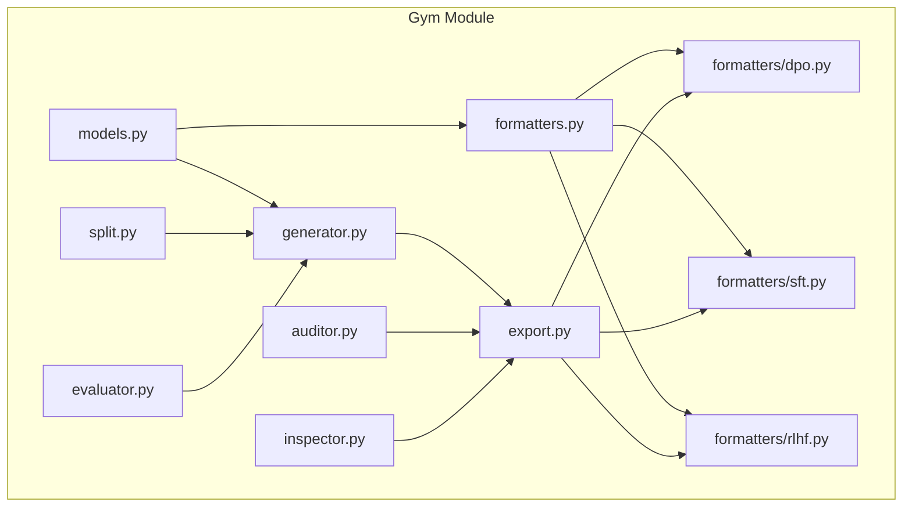
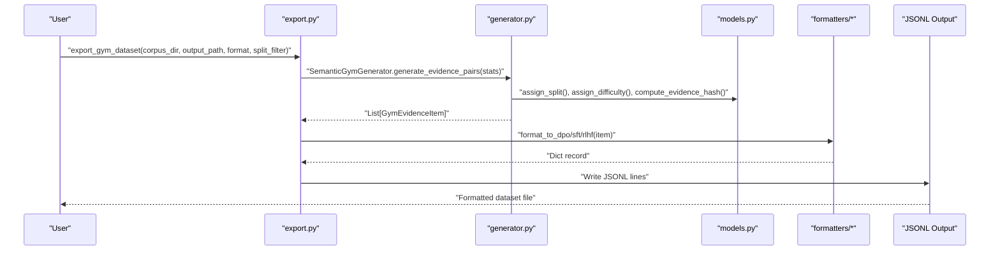
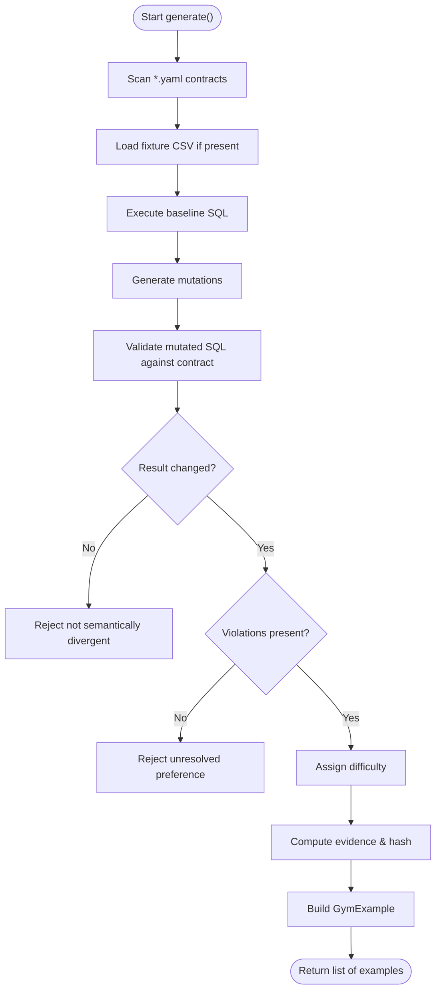
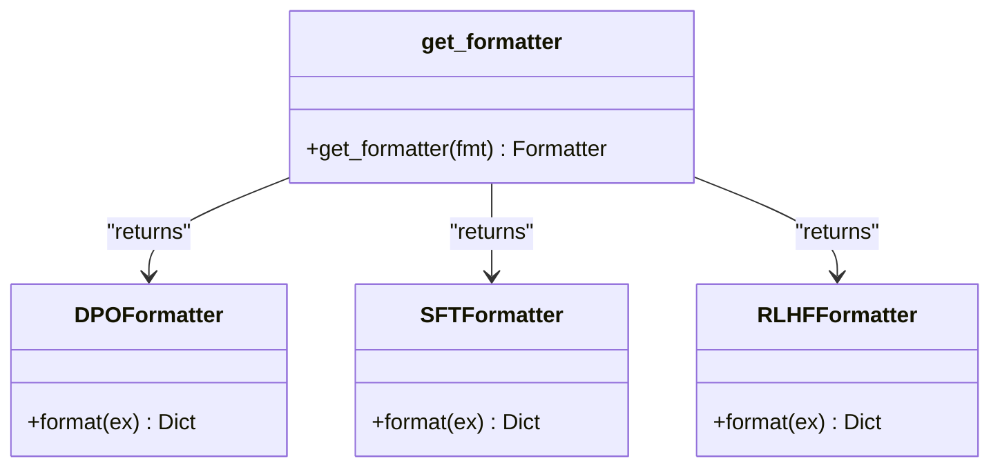
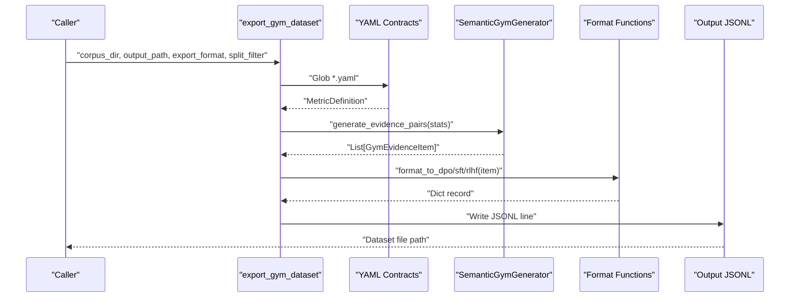
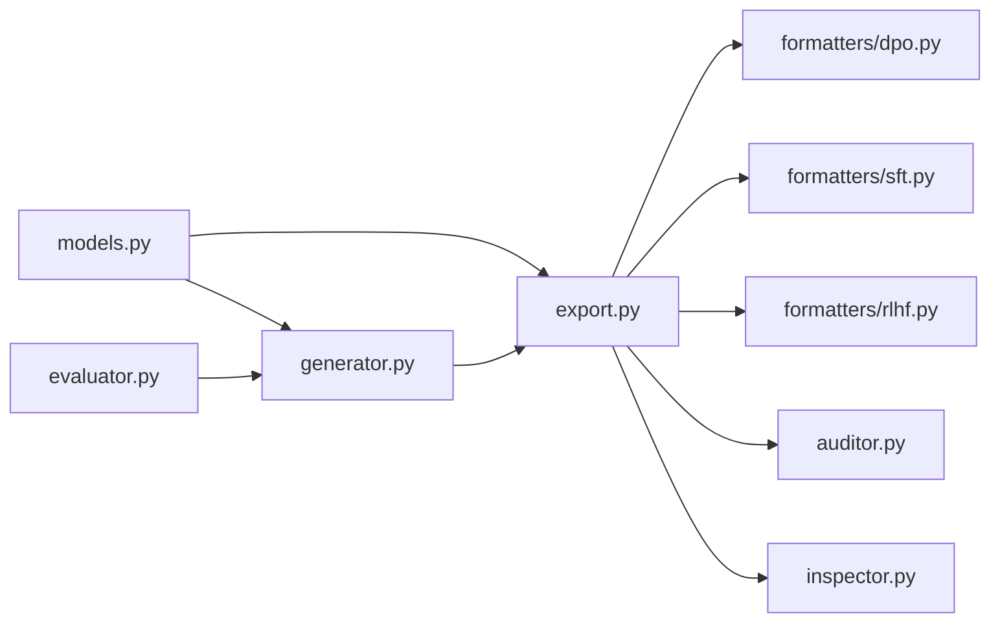

# Gym Framework for Training Data Generation

<cite>
**Referenced Files in This Document**
- [README.md](file://README.md)
- [gym/__init__.py](file://semantic_reliability/gym/__init__.py)
- [gym/models.py](file://semantic_reliability/gym/models.py)
- [gym/generator.py](file://semantic_reliability/gym/generator.py)
- [gym/formatters.py](file://semantic_reliability/gym/formatters.py)
- [gym/formatters/dpo.py](file://semantic_reliability/gym/formatters/dpo.py)
- [gym/formatters/sft.py](file://semantic_reliability/gym/formatters/sft.py)
- [gym/formatters/rlhf.py](file://semantic_reliability/gym/formatters/rlhf.py)
- [gym/export.py](file://semantic_reliability/gym/export.py)
- [gym/auditor.py](file://semantic_reliability/gym/auditor.py)
- [gym/split.py](file://semantic_reliability/gym/split.py)
- [gym/inspector.py](file://semantic_reliability/gym/inspector.py)
- [gym/evaluator.py](file://semantic_reliability/gym/evaluator.py)
</cite>

## Table of Contents
1. Introduction
2. Project Structure
3. Core Components
4. Architecture Overview
5. Detailed Component Analysis
6. Dependency Analysis
7. Performance Considerations
8. Troubleshooting Guide
9. Conclusion
10. Appendices

## Introduction
This document explains the Gym framework used to generate training datasets and format data for AI agent training in the Semantic Reliability Engine. It covers the generator architecture, formatter plugins, export capabilities, difficulty scaling, data splitting strategies, auditing, quality assurance, and integration into automated pipelines. It also provides guidance on creating custom formatters for SFT, DPO, and RLHF outputs and addresses privacy and compliance considerations when generating synthetic training data.

The Gym module produces preference pairs (chosen vs rejected SQL) grounded in semantic contracts and fixtures, ensuring that generated examples are semantically meaningful, auditable, and suitable for downstream model training across multiple ML frameworks.

**Section sources**
- [README.md:1-152](file://README.md#L1-L152)

## Project Structure
The Gym framework is organized under semantic_reliability/gym with clear separation of concerns:
- Models and utilities define core types, split rules, difficulty assignment, and evidence hashing.
- Generator scans metric contracts and fixtures, applies mutation-based generation, and enforces scientific validity gates.
- Formatters convert internal records into standard formats for DPO, SFT, and RLHF.
- Export orchestrates scanning, generation, filtering by split, and writing JSONL outputs.
- Auditor inspects exported datasets for integrity, leakage, and distribution balance.
- Inspector provides a quick summary view of dataset distributions.
- Evaluator provides a baseline evaluation harness for agent-generated SQL against contracts and fixtures.

**Diagram sources**
- [gym/models.py:1-88](file://semantic_reliability/gym/models.py#L1-L88)
- [gym/generator.py:1-206](file://semantic_reliability/gym/generator.py#L1-L206)
- [gym/formatters.py:1-78](file://semantic_reliability/gym/formatters.py#L1-L78)
- [gym/formatters/dpo.py:1-26](file://semantic_reliability/gym/formatters/dpo.py#L1-L26)
- [gym/formatters/sft.py:1-24](file://semantic_reliability/gym/formatters/sft.py#L1-L24)
- [gym/formatters/rlhf.py:1-30](file://semantic_reliability/gym/formatters/rlhf.py#L1-L30)
- [gym/export.py:1-76](file://semantic_reliability/gym/export.py#L1-L76)
- [gym/auditor.py:1-138](file://semantic_reliability/gym/auditor.py#L1-L138)
- [gym/inspector.py:1-32](file://semantic_reliability/gym/inspector.py#L1-L32)
- [gym/split.py:1-21](file://semantic_reliability/gym/split.py#L1-L21)
- [gym/evaluator.py:1-294](file://semantic_reliability/gym/evaluator.py#L1-L294)

**Section sources**
- [gym/__init__.py:1-45](file://semantic_reliability/gym/__init__.py#L1-L45)

## Core Components
- GymExample and related models encapsulate prompt, chosen/rejected SQL, evidence, difficulty, split, and metadata. They provide deterministic hashing and structured fields for traceability.
- GymGenerator scans corpus directories for metric contracts and fixtures, generates mutations, validates semantics via contract checks, computes variance, assigns difficulty, and filters by split.
- Formatters transform GymEvidenceItem or GymExample into standardized JSONL records for DPO, SFT, and RLHF training.
- Export aggregates items from all contracts, optionally filters by split, and writes formatted JSONL files.
- Auditor performs static and statistical checks on exported datasets to ensure integrity, absence of leakage, and balanced distributions.
- Inspector prints high-level statistics and sample metadata for quick inspection.
- Evaluator provides a baseline evaluation pipeline to assess agent-generated SQL against contracts and fixtures, producing formal reports.

**Section sources**
- [gym/models.py:1-88](file://semantic_reliability/gym/models.py#L1-L88)
- [gym/generator.py:1-206](file://semantic_reliability/gym/generator.py#L1-L206)
- [gym/formatters.py:1-78](file://semantic_reliability/gym/formatters.py#L1-L78)
- [gym/export.py:1-76](file://semantic_reliability/gym/export.py#L1-L76)
- [gym/auditor.py:1-138](file://semantic_reliability/gym/auditor.py#L1-L138)
- [gym/inspector.py:1-32](file://semantic_reliability/gym/inspector.py#L1-L32)
- [gym/evaluator.py:1-294](file://semantic_reliability/gym/evaluator.py#L1-L294)

## Architecture Overview
The Gym framework follows a pipeline:
1. Contract discovery and parsing from YAML files.
2. Fixture loading and execution to establish baselines.
3. Mutation generation and validation against contracts.
4. Evidence computation and hashing for provenance.
5. Difficulty assignment and split determination.
6. Formatting into target output schemas (DPO/SFT/RLHF).
7. Export to JSONL with optional split filtering.
8. Auditing and inspection for quality assurance.

**Diagram sources**
- [gym/export.py:1-76](file://semantic_reliability/gym/export.py#L1-L76)
- [gym/generator.py:1-206](file://semantic_reliability/gym/generator.py#L1-L206)
- [gym/models.py:1-88](file://semantic_reliability/gym/models.py#L1-L88)
- [gym/formatters/dpo.py:1-26](file://semantic_reliability/gym/formatters/dpo.py#L1-L26)
- [gym/formatters/sft.py:1-24](file://semantic_reliability/gym/formatters/sft.py#L1-L24)
- [gym/formatters/rlhf.py:1-30](file://semantic_reliability/gym/formatters/rlhf.py#L1-L30)

## Detailed Component Analysis

### Generator Architecture
The generator scans metric contracts, loads fixtures, executes baseline queries, generates mutations, validates them against contracts, computes variance, and constructs preference pairs with rich evidence. It enforces strict scientific gates:
- Rejects identical pairs and unexecutable SQL.
- Ensures semantic divergence between chosen and rejected.
- Excludes unresolved preferences that diverge but violate no known contract.
- Assigns difficulty based on mutation type and contract complexity.
- Computes deterministic evidence hashes for provenance.

**Diagram sources**
- [gym/generator.py:34-202](file://semantic_reliability/gym/generator.py#L34-L202)
- [gym/models.py:20-57](file://semantic_reliability/gym/models.py#L20-L57)

**Section sources**
- [gym/generator.py:1-206](file://semantic_reliability/gym/generator.py#L1-L206)
- [gym/models.py:1-88](file://semantic_reliability/gym/models.py#L1-L88)

### Formatter Plugins
Formatters convert internal records into standardized formats:
- DPO: Prompt with chosen and rejected SQL plus metadata for preference learning.
- SFT: Instruction-tuning format including rationale and negative example.
- RLHF: Reward modeling pair with per-completion reward signals and evidence.

A registry function selects the appropriate formatter by name.

**Diagram sources**
- [gym/formatters.py:5-78](file://semantic_reliability/gym/formatters.py#L5-L78)

**Section sources**
- [gym/formatters.py:1-78](file://semantic_reliability/gym/formatters.py#L1-L78)
- [gym/formatters/dpo.py:1-26](file://semantic_reliability/gym/formatters/dpo.py#L1-L26)
- [gym/formatters/sft.py:1-24](file://semantic_reliability/gym/formatters/sft.py#L1-L24)
- [gym/formatters/rlhf.py:1-30](file://semantic_reliability/gym/formatters/rlhf.py#L1-L30)

### Export Capabilities
Export scans all contracts, generates evidence pairs, filters by split, and writes JSONL lines in the requested format. It supports:
- dpo: Preference pairs for direct preference optimization.
- sft: Instruction-tuning with rationale and negative examples.
- rlhf: Reward modeling pairs with per-completion rewards and evidence.
- evidence: Raw GymEvidenceItem records for debugging and analysis.

**Diagram sources**
- [gym/export.py:14-76](file://semantic_reliability/gym/export.py#L14-L76)
- [gym/formatters/dpo.py:5-26](file://semantic_reliability/gym/formatters/dpo.py#L5-L26)
- [gym/formatters/sft.py:5-24](file://semantic_reliability/gym/formatters/sft.py#L5-L24)
- [gym/formatters/rlhf.py:5-30](file://semantic_reliability/gym/formatters/rlhf.py#L5-L30)

**Section sources**
- [gym/export.py:1-76](file://semantic_reliability/gym/export.py#L1-L76)

### Custom Formatters
To create a custom formatter:
- Implement a function that accepts a GymEvidenceItem and returns a dictionary conforming to your target schema.
- Include prompt, response(s), and metadata fields such as example_id, metric_id, difficulty, evidence_hash, and policy_version.
- Integrate with export by adding a branch in the export loop or extending the formatter registry.

Guidance:
- For SFT: Provide instruction, input context, output SQL, negative example, and semantic rationale.
- For DPO: Provide prompt, chosen SQL, rejected SQL, and rich metadata for preference learning.
- For RLHF: Provide prompt and completions array with per-completion reward, compliance flag, and evidence.

**Section sources**
- [gym/formatters/dpo.py:1-26](file://semantic_reliability/gym/formatters/dpo.py#L1-L26)
- [gym/formatters/sft.py:1-24](file://semantic_reliability/gym/formatters/sft.py#L1-L24)
- [gym/formatters/rlhf.py:1-30](file://semantic_reliability/gym/formatters/rlhf.py#L1-L30)
- [gym/export.py:14-76](file://semantic_reliability/gym/export.py#L14-L76)

### Generating Synthetic Training Data
Steps:
- Place metric contracts (YAML) and corresponding fixtures (CSV) in a corpus directory.
- Run export with desired format and optional split filter.
- Use inspector to review distributions and sample metadata.
- Use auditor to validate dataset integrity and detect leakage.

Quality gates:
- Contracts must be complete and executable.
- Fixtures must produce non-empty baselines.
- Mutations must change results and satisfy or violate contracts deterministically.
- Evidence hashes ensure reproducibility and deduplication.

**Section sources**
- [gym/generator.py:34-202](file://semantic_reliability/gym/generator.py#L34-L202)
- [gym/inspector.py:7-32](file://semantic_reliability/gym/inspector.py#L7-L32)
- [gym/auditor.py:41-138](file://semantic_reliability/gym/auditor.py#L41-L138)

### Auditing Generated Content
Auditing checks:
- Duplicate example IDs and evidence hashes.
- Conflicting preference labels for the same prompt.
- Identical chosen and rejected SQL.
- Missing metadata and evidence.
- Leakage: holdout mutation types or domains appearing in train split.
- Distribution metrics for mutation types, difficulty levels, and splits.

Use the audit report to gate dataset acceptance in CI/CD pipelines.

**Section sources**
- [gym/auditor.py:10-138](file://semantic_reliability/gym/auditor.py#L10-L138)

### Difficulty Scaling
Difficulty is assigned using deterministic heuristics based on mutation type and contract complexity:
- Easy: Direct AST mutations like filter drops and aggregation swaps.
- Medium: Boundary shifts, distinct drops, coalesce bypasses.
- Hard: Grain alterations, subtle variance, temporal attribution issues.
- Expert: Multi-component deduction omissions, relational join drops.

Calibration can incorporate variance thresholds and predicate subtlety flags.

**Section sources**
- [gym/models.py:38-57](file://semantic_reliability/gym/models.py#L38-L57)
- [gym/difficulty.py:1-27](file://semantic_reliability/gym/difficulty.py#L1-L27)

### Data Splitting Strategies
Split assignment prevents leakage:
- Train: Core filter and aggregation changes.
- Validation: Boundary and null-related mutations.
- Holdout: Multi-relational and domain-specific models; reserved for final evaluation.

Deterministic assignment uses metric family hashing and explicit mutation/domain rules.

**Section sources**
- [gym/models.py:20-35](file://semantic_reliability/gym/models.py#L20-L35)
- [gym/split.py:1-21](file://semantic_reliability/gym/split.py#L1-L21)

### Quality Assurance Processes
- Pre-execution firewall checks ensure semantic compliance before running SQL.
- Execution success and result matching against reference queries validate correctness.
- Formal classification taxonomy categorizes outcomes into compliant/mismatch/violation/error/unresolved.
- Latency summaries capture performance characteristics for benchmarking.

**Section sources**
- [gym/evaluator.py:16-294](file://semantic_reliability/gym/evaluator.py#L16-L294)

## Dependency Analysis
Key dependencies and relationships:
- Generator depends on models for types, split rules, difficulty assignment, and evidence hashing.
- Export depends on generator and formatters to produce JSONL outputs.
- Auditor depends on models for split rules and inspects exported datasets.
- Inspector reads exported datasets and summarizes distributions.
- Evaluator integrates with firewall components to evaluate agent-generated SQL.

**Diagram sources**
- [gym/models.py:1-88](file://semantic_reliability/gym/models.py#L1-L88)
- [gym/generator.py:1-206](file://semantic_reliability/gym/generator.py#L1-L206)
- [gym/export.py:1-76](file://semantic_reliability/gym/export.py#L1-L76)
- [gym/formatters/dpo.py:1-26](file://semantic_reliability/gym/formatters/dpo.py#L1-L26)
- [gym/formatters/sft.py:1-24](file://semantic_reliability/gym/formatters/sft.py#L1-L24)
- [gym/formatters/rlhf.py:1-30](file://semantic_reliability/gym/formatters/rlhf.py#L1-L30)
- [gym/auditor.py:1-138](file://semantic_reliability/gym/auditor.py#L1-L138)
- [gym/inspector.py:1-32](file://semantic_reliability/gym/inspector.py#L1-L32)
- [gym/evaluator.py:1-294](file://semantic_reliability/gym/evaluator.py#L1-L294)

**Section sources**
- [gym/__init__.py:1-45](file://semantic_reliability/gym/__init__.py#L1-L45)

## Performance Considerations
- In-memory DuckDB execution reduces overhead during generation and evaluation.
- Deterministic hashing avoids redundant computations and enables efficient deduplication.
- Split filtering at export time minimizes dataset size for targeted training runs.
- Baseline comparisons use order-insensitive, numeric-tolerant row canonicalization to avoid false mismatches.
- Latency tracking helps identify bottlenecks in evaluation loops.

[No sources needed since this section provides general guidance]

## Troubleshooting Guide
Common issues and resolutions:
- Incomplete contracts: Ensure YAML contains required fields (metric, sql, dialect).
- Unexecutable SQL: Verify syntax and dialect compatibility; check table names and fixture registration.
- Equivalent on fixture: Adjust fixtures or mutation parameters to achieve meaningful divergence.
- Unresolved preference: Add or refine contract invariants to resolve ambiguity.
- Leakage detected: Review split rules and ensure holdout mutations/domains do not appear in train.
- Duplicate evidence hashes: Investigate duplicate prompts or identical evidence payloads.

Use inspector and auditor outputs to diagnose distribution imbalances and integrity failures.

**Section sources**
- [gym/generator.py:34-202](file://semantic_reliability/gym/generator.py#L34-L202)
- [gym/auditor.py:41-138](file://semantic_reliability/gym/auditor.py#L41-L138)
- [gym/inspector.py:7-32](file://semantic_reliability/gym/inspector.py#L7-L32)

## Conclusion
The Gym framework provides a robust, auditable pipeline for generating synthetic training data grounded in semantic contracts and fixtures. Its modular design supports multiple output formats, rigorous quality assurance, and safe splitting strategies to prevent leakage. By integrating generators, formatters, exporters, auditors, and evaluators, teams can build reliable training datasets for SFT, DPO, and RLHF while maintaining transparency and reproducibility.

[No sources needed since this section summarizes without analyzing specific files]

## Appendices

### Integrating into Automated Training Pipelines
- CI/CD steps:
  - Generate datasets with export and split filters.
  - Run auditor to enforce dataset quality gates.
  - Inspect distributions to confirm balance.
  - Publish artifacts for downstream training jobs.
- Model-specific optimizations:
  - For DPO: Emphasize metadata fields like variance and violations to guide preference learning.
  - For SFT: Include semantic rationale to improve instruction-following behavior.
  - For RLHF: Use per-completion rewards and evidence to train reward models effectively.

**Section sources**
- [gym/export.py:14-76](file://semantic_reliability/gym/export.py#L14-L76)
- [gym/auditor.py:41-138](file://semantic_reliability/gym/auditor.py#L41-L138)
- [gym/formatters/dpo.py:5-26](file://semantic_reliability/gym/formatters/dpo.py#L5-L26)
- [gym/formatters/sft.py:5-24](file://semantic_reliability/gym/formatters/sft.py#L5-L24)
- [gym/formatters/rlhf.py:5-30](file://semantic_reliability/gym/formatters/rlhf.py#L5-L30)

### Privacy and Compliance Considerations
- Synthetic data generation should avoid embedding sensitive identifiers; prefer anonymized or synthetic fixtures.
- Apply data minimization principles: include only necessary fields in metadata and evidence.
- Enforce access controls around corpus directories and exported datasets.
- Maintain audit trails via evidence hashes and policy versions for compliance reporting.
- Align with organizational policies regarding domain-specific data (e.g., healthcare, infrastructure, risk) and restrict their inclusion in training splits where prohibited.

[No sources needed since this section provides general guidance]