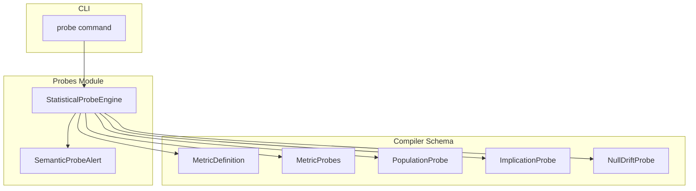
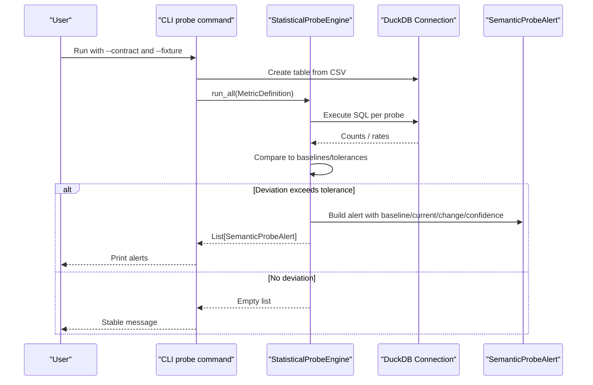
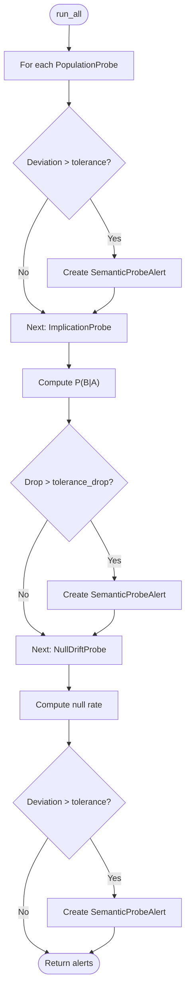
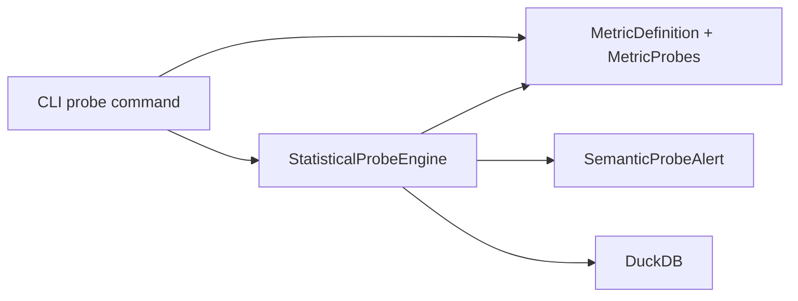

# Statistical Probes Implementation

<cite>
**Referenced Files in This Document**
- [engine.py](file://semantic_reliability/probes/engine.py)
- [signals.py](file://semantic_reliability/probes/signals.py)
- [schema.py](file://semantic_reliability/compiler/schema.py)
- [cli.py](file://semantic_reliability/cli.py)
- [test_probes.py](file://tests/test_probes.py)
</cite>

## Table of Contents
1. [Introduction](#introduction)
2. [Project Structure](#project-structure)
3. [Core Components](#core-components)
4. [Architecture Overview](#architecture-overview)
5. [Detailed Component Analysis](#detailed-component-analysis)
6. [Dependency Analysis](#dependency-analysis)
7. [Performance Considerations](#performance-considerations)
8. [Troubleshooting Guide](#troubleshooting-guide)
9. [Conclusion](#conclusion)
10. [Appendices](#appendices)

## Introduction
This document explains how to implement and use custom statistical probes to validate data quality and semantic correctness at runtime. It covers the probe interface, signal types, and built-in validation methods (population rate checks, implication confidence decay, and null drift). It also provides guidance for creating domain-specific probes, configuring thresholds, interpreting results, integrating into evaluation pipelines, handling edge cases, and optimizing performance for large datasets.

## Project Structure
The statistical probes subsystem is implemented as a small, focused module with clear separation between:
- Declarative schema definitions for probes
- An execution engine that runs probes against a DuckDB connection
- A structured alert model for consistent signaling
- CLI integration for running probes from contracts and fixtures

**Diagram sources**
- [engine.py:11-38](file://semantic_reliability/probes/engine.py#L11-L38)
- [schema.py:39-69](file://semantic_reliability/compiler/schema.py#L39-L69)
- [signals.py:5-17](file://semantic_reliability/probes/signals.py#L5-L17)
- [cli.py:586-629](file://semantic_reliability/cli.py#L586-L629)

**Section sources**
- [engine.py:11-38](file://semantic_reliability/probes/engine.py#L11-L38)
- [schema.py:39-69](file://semantic_reliability/compiler/schema.py#L39-L69)
- [signals.py:5-17](file://semantic_reliability/probes/signals.py#L5-L17)
- [cli.py:586-629](file://semantic_reliability/cli.py#L586-L629)

## Core Components
- StatisticalProbeEngine: Executes declarative probes against a DuckDB connection and returns alerts when deviations exceed configured tolerances.
- SemanticProbeAlert: Structured result carrying baseline, current values, relative change, confidence level, likely causes, and required actions.
- Probe schemas: PopulationProbe, ImplicationProbe, NullDriftProbe define what to check and how sensitive the check should be.

Key responsibilities:
- PopulationProbe: Ensures a filter predicate selects an expected proportion of rows.
- ImplicationProbe: Ensures conditional relationships hold within a tolerance (e.g., “active” implies “revenue > 0”).
- NullDriftProbe: Monitors unexpected increases in null rates for critical columns.

**Section sources**
- [engine.py:11-38](file://semantic_reliability/probes/engine.py#L11-L38)
- [signals.py:5-17](file://semantic_reliability/probes/signals.py#L5-L17)
- [schema.py:39-69](file://semantic_reliability/compiler/schema.py#L39-L69)

## Architecture Overview
The probe pipeline integrates with the CLI to load a metric contract YAML, read fixture CSVs into DuckDB, execute probes, and report alerts.

**Diagram sources**
- [cli.py:586-629](file://semantic_reliability/cli.py#L586-L629)
- [engine.py:18-38](file://semantic_reliability/probes/engine.py#L18-L38)
- [engine.py:40-137](file://semantic_reliability/probes/engine.py#L40-L137)
- [signals.py:5-17](file://semantic_reliability/probes/signals.py#L5-L17)

## Detailed Component Analysis

### StatisticalProbeEngine
- Entry point: run_all iterates over population, implications, and null_drift probes and collects alerts.
- Population checks: Computes observed rate for a target value or null condition and compares to baseline_rate using absolute tolerance; computes relative change and confidence.
- Implication checks: Computes P(implication | condition) and alerts if it drops below baseline_confidence by more than tolerance_drop.
- Null drift checks: Computes null rate and alerts on absolute deviation beyond tolerance.

**Diagram sources**
- [engine.py:18-38](file://semantic_reliability/probes/engine.py#L18-L38)
- [engine.py:40-137](file://semantic_reliability/probes/engine.py#L40-L137)

**Section sources**
- [engine.py:18-38](file://semantic_reliability/probes/engine.py#L18-L38)
- [engine.py:40-137](file://semantic_reliability/probes/engine.py#L40-L137)

### Signal Model: SemanticProbeAlert
- Fields include signal_type, contract identifier, baseline, current, relative_change, confidence, likely_causes, and action_required.
- Provides a stable, machine-readable output format for downstream systems (dashboards, CI gates, SARIF exporters).

**Section sources**
- [signals.py:5-17](file://semantic_reliability/probes/signals.py#L5-L17)

### Probe Schemas
- PopulationProbe: column, optional target_value, baseline_rate, tolerance.
- ImplicationProbe: condition_column/value, implication_column/operator/value, baseline_confidence, tolerance_drop.
- NullDriftProbe: column, baseline_null_rate, tolerance.
- MetricProbes: container for lists of each probe type.
- MetricDefinition: includes probes alongside other metric metadata.

**Section sources**
- [schema.py:39-69](file://semantic_reliability/compiler/schema.py#L39-L69)
- [schema.py:83-98](file://semantic_reliability/compiler/schema.py#L83-L98)

### CLI Integration
- The probe command loads a metric contract YAML, reads a CSV fixture into DuckDB, executes StatisticalProbeEngine.run_all, and prints alerts with severity coloring and details.
- Supports fail-on-critical exit codes for CI gating.

**Section sources**
- [cli.py:586-629](file://semantic_reliability/cli.py#L586-L629)

### Example Usage and Validation
- Unit tests demonstrate healthy metrics, drifted populations, implication decay, and null drift detection.
- Tests show how to construct MetricDefinition with probes and assert expected alerts and fields.

**Section sources**
- [test_probes.py:31-80](file://tests/test_probes.py#L31-L80)
- [test_probes.py:82-118](file://tests/test_probes.py#L82-L118)
- [test_probes.py:121-150](file://tests/test_probes.py#L121-L150)
- [test_probes.py:153-184](file://tests/test_probes.py#L153-L184)

## Dependency Analysis
- StatisticalProbeEngine depends on:
  - DuckDB connection for query execution
  - Probe schemas from compiler.schema
  - SemanticProbeAlert for results
- CLI depends on:
  - MetricDefinition parsing from YAML
  - StatisticalProbeEngine for execution
  - Rich console for reporting

**Diagram sources**
- [cli.py:586-629](file://semantic_reliability/cli.py#L586-L629)
- [engine.py:1-6](file://semantic_reliability/probes/engine.py#L1-L6)
- [signals.py:1-17](file://semantic_reliability/probes/signals.py#L1-L17)
- [schema.py:39-69](file://semantic_reliability/compiler/schema.py#L39-L69)

**Section sources**
- [engine.py:1-6](file://semantic_reliability/probes/engine.py#L1-L6)
- [cli.py:586-629](file://semantic_reliability/cli.py#L586-L629)
- [schema.py:39-69](file://semantic_reliability/compiler/schema.py#L39-L69)
- [signals.py:1-17](file://semantic_reliability/probes/signals.py#L1-L17)

## Performance Considerations
- Use aggregate queries directly in DuckDB to compute counts and rates; avoid loading entire tables into memory when possible.
- For very large datasets:
  - Prefer sampling strategies (e.g., stratified samples) if exact rates are not required.
  - Pre-filter tables to relevant partitions or time windows before probing.
  - Cache intermediate aggregates where repeated probes share filters.
- Keep tolerances realistic to reduce false positives and unnecessary re-runs.
- Batch multiple probes into single scans when feasible to minimize I/O.

[No sources needed since this section provides general guidance]

## Troubleshooting Guide
Common issues and resolutions:
- Query errors during probe execution: Exceptions are caught and logged; verify column names, table name, and SQL dialect compatibility.
- Unexpected alerts:
  - Population rate shift: Check upstream mappings or cohort filters; adjust baseline_rate or tolerance if business context changed.
  - Implication decay: Validate business rules; ensure condition/implication definitions match current semantics.
  - Null drift: Investigate upstream ETL failures or schema changes; consider adding defaulting logic or stricter ingestion checks.
- Interpreting confidence:
  - “high” indicates deviation significantly exceeds tolerance; “medium” indicates moderate deviation.
- CI gating:
  - Use fail-on-critical to block pipelines on high-confidence alerts.

**Section sources**
- [engine.py:40-137](file://semantic_reliability/probes/engine.py#L40-L137)
- [cli.py:586-629](file://semantic_reliability/cli.py#L586-L629)

## Conclusion
The statistical probes system provides a concise, declarative way to enforce data quality and semantic integrity at runtime. By defining baselines and tolerances for population distributions, conditional relationships, and null rates, teams can detect silent upstream changes early. The CLI integration enables easy execution against fixtures or live snapshots, while structured alerts support automation and reporting. With careful configuration and performance-aware usage, probes become a robust layer of observability for data pipelines.

[No sources needed since this section summarizes without analyzing specific files]

## Appendices

### Creating Domain-Specific Probes
- Extend the existing patterns:
  - Define new probe types in schema.py if you need additional checks beyond population, implication, and null drift.
  - Implement corresponding checks in StatisticalProbeEngine._check_* methods.
  - Emit SemanticProbeAlert with meaningful signal_type, likely_causes, and action_required.
- Example domains:
  - Probability-based validations: Monitor P(status = 'active' | region = 'NA') and alert on significant drops.
  - Distribution analysis: Track percentiles or variance of key numeric columns and alert on shifts beyond tolerance.
  - Anomaly detection: Flag sudden spikes/drops in null rates or rare category frequencies.

[No sources needed since this section provides conceptual guidance]

### Configuration and Threshold Setting
- Baseline rates and null rates should be derived from stable historical periods.
- Tolerances should reflect acceptable operational variability; start conservative and tune based on observed noise.
- Confidence levels help prioritize remediation; treat “high” as urgent.

[No sources needed since this section provides conceptual guidance]

### Integrating Into Evaluation Pipelines
- Use the CLI probe command in CI to run against fixtures or staging snapshots.
- Combine with assertion suites and drift detection for comprehensive coverage.
- Export results to JSON/SARIF for dashboards and audit trails.

**Section sources**
- [cli.py:586-629](file://semantic_reliability/cli.py#L586-L629)

### Handling Edge Cases
- Zero denominators: When computing rates, guard against division by zero; the engine handles empty sets by returning zero rates.
- Mixed types: Ensure comparison operators and values match column types; string vs numeric mismatches can cause errors.
- Missing columns: Validate schema before running probes; add preflight checks in your harness.

**Section sources**
- [engine.py:40-137](file://semantic_reliability/probes/engine.py#L40-L137)

### Statistical Significance Testing
- Current implementation uses absolute and relative thresholds rather than formal hypothesis tests.
- For rigorous significance testing:
  - Incorporate confidence intervals around estimated rates.
  - Apply tests such as two-proportion z-test or chi-squared tests for categorical shifts.
  - Adjust p-value thresholds based on multiple testing corrections if running many probes.

[No sources needed since this section provides conceptual guidance]