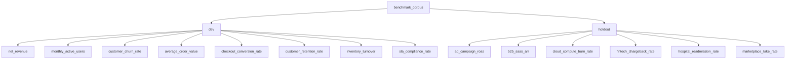
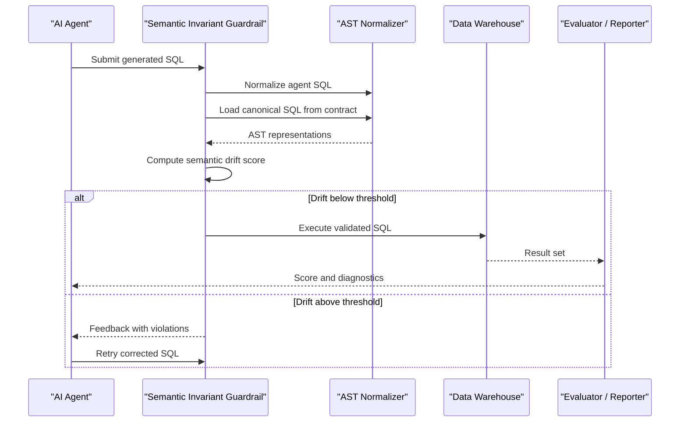
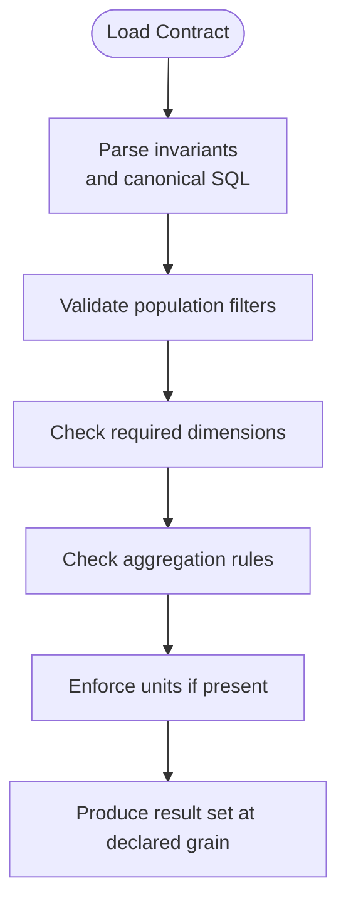
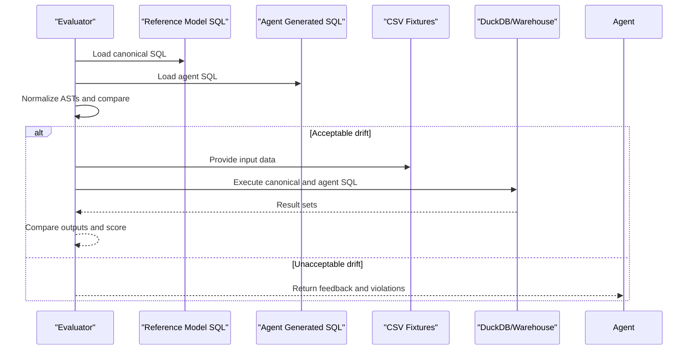
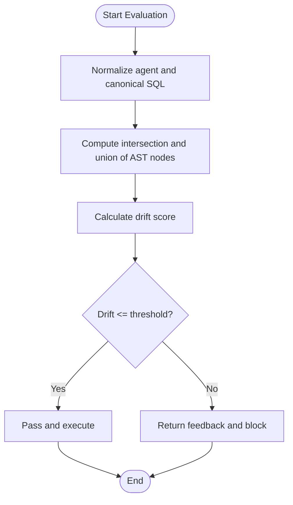
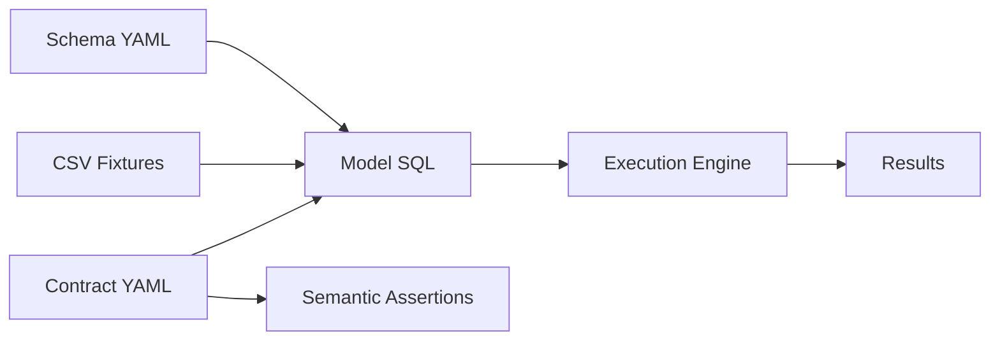

# Benchmark Corpus

<cite>
**Referenced Files in This Document**
- [README.md](file://README.md)
- [holdout_protocol.yaml](file://benchmark_corpus/holdout/holdout_protocol.yaml)
- [net_revenue_contract.yaml](file://benchmark_corpus/dev/net_revenue/contract.yaml)
- [monthly_active_users_contract.yaml](file://benchmark_corpus/dev/monthly_active_users/contract.yaml)
- [customer_churn_rate_contract.yaml](file://benchmark_corpus/dev/customer_churn_rate/contract.yaml)
- [average_order_value_contract.yaml](file://benchmark_corpus/dev/average_order_value/contract.yaml)
- [checkout_conversion_rate_contract.yaml](file://benchmark_corpus/dev/checkout_conversion_rate/contract.yaml)
- [customer_retention_rate_contract.yaml](file://benchmark_corpus/dev/customer_retention_rate/contract.yaml)
- [inventory_turnover_contract.yaml](file://benchmark_corpus/dev/inventory_turnover/contract.yaml)
- [sla_compliance_rate_contract.yaml](file://benchmark_corpus/dev/sla_compliance_rate/contract.yaml)
- [ad_campaign_roas_contract.yaml](file://benchmark_corpus/holdout/ad_campaign_roas/contract.yaml)
- [b2b_saas_arr_contract.yaml](file://benchmark_corpus/holdout/b2b_saas_arr/contract.yaml)
- [cloud_compute_burn_rate_contract.yaml](file://benchmark_corpus/holdout/cloud_compute_burn_rate/contract.yaml)
- [fintech_chargeback_rate_contract.yaml](file://benchmark_corpus/holdout/fintech_chargeback_rate/contract.yaml)
- [hospital_readmission_rate_contract.yaml](file://benchmark_corpus/holdout/hospital_readmission_rate/contract.yaml)
- [marketplace_take_rate_contract.yaml](file://benchmark_corpus/holdout/marketplace_take_rate/contract.yaml)
- [transactions.csv](file://benchmark_corpus/dev/net_revenue/transactions.csv)
- [user_logins.csv](file://benchmark_corpus/dev/monthly_active_users/user_logins.csv)
- [subscriptions.csv](file://benchmark_corpus/dev/customer_churn_rate/subscriptions.csv)
- [orders.csv](file://benchmark_corpus/dev/average_order_value/orders.csv)
- [checkout_events.csv](file://benchmark_corpus/dev/checkout_conversion_rate/checkout_events.csv)
- [retention_cohorts.csv](file://benchmark_corpus/dev/customer_retention_rate/retention_cohorts.csv)
- [inventory_movements.csv](file://benchmark_corpus/dev/inventory_turnover/inventory_movements.csv)
- [support_tickets.csv](file://benchmark_corpus/dev/sla_compliance_rate/support_tickets.csv)
- [ad_campaign_performance.csv](file://benchmark_corpus/holdout/ad_campaign_roas/ad_campaign_performance.csv)
- [saas_contracts.csv](file://benchmark_corpus/holdout/b2b_saas_arr/saas_contracts.csv)
- [cloud_instance_usage.csv](file://benchmark_corpus/holdout/cloud_compute_burn_rate/cloud_instance_usage.csv)
- [settled_payments.csv](file://benchmark_corpus/holdout/fintech_chargeback_rate/settled_payments.csv)
- [hospital_discharges.csv](file://benchmark_corpus/holdout/hospital_readmission_rate/hospital_discharges.csv)
- [marketplace_orders.csv](file://benchmark_corpus/holdout/marketplace_take_rate/marketplace_orders.csv)
- [net_revenue_model.sql](file://benchmark_corpus/dev/net_revenue/model_net_revenue.sql)
- [monthly_active_users_model.sql](file://benchmark_corpus/dev/monthly_active_users/model_monthly_active_users.sql)
- [customer_churn_rate_model.sql](file://benchmark_corpus/dev/customer_churn_rate/model_customer_churn_rate.sql)
- [average_order_value_model.sql](file://benchmark_corpus/dev/average_order_value/model_average_order_value.sql)
- [checkout_conversion_rate_model.sql](file://benchmark_corpus/dev/checkout_conversion_rate/model_checkout_conversion_rate.sql)
- [customer_retention_rate_model.sql](file://benchmark_corpus/dev/customer_retention_rate/model_customer_retention_rate.sql)
- [inventory_turnover_model.sql](file://benchmark_corpus/dev/inventory_turnover/model_inventory_turnover.sql)
- [sla_compliance_rate_model.sql](file://benchmark_corpus/dev/sla_compliance_rate/model_sla_compliance_rate.sql)
- [ad_campaign_roas_model.sql](file://benchmark_corpus/holdout/ad_campaign_roas/model_ad_campaign_roas.sql)
- [b2b_saas_arr_model.sql](file://benchmark_corpus/holdout/b2b_saas_arr/model_b2b_saas_arr.sql)
- [cloud_compute_burn_rate_model.sql](file://benchmark_corpus/holdout/cloud_compute_burn_rate/model_cloud_compute_burn_rate.sql)
- [fintech_chargeback_rate_model.sql](file://benchmark_corpus/holdout/fintech_chargeback_rate/model_fintech_chargeback_rate.sql)
- [hospital_readmission_rate_model.sql](file://benchmark_corpus/holdout/hospital_readmission_rate/model_hospital_readmission_rate.sql)
- [marketplace_take_rate_model.sql](file://benchmark_corpus/holdout/marketplace_take_rate/model_marketplace_take_rate.sql)
- [net_revenue_schema.yml](file://benchmark_corpus/dev/net_revenue/schema.yml)
- [monthly_active_users_schema.yml](file://benchmark_corpus/dev/monthly_active_users/schema.yml)
- [customer_churn_rate_schema.yml](file://benchmark_corpus/dev/customer_churn_rate/schema.yml)
- [average_order_value_schema.yml](file://benchmark_corpus/dev/average_order_value/schema.yml)
- [checkout_conversion_rate_schema.yml](file://benchmark_corpus/dev/checkout_conversion_rate/schema.yml)
- [customer_retention_rate_schema.yml](file://benchmark_corpus/dev/customer_retention_rate/schema.yml)
- [inventory_turnover_schema.yml](file://benchmark_corpus/dev/inventory_turnover/schema.yml)
- [sla_compliance_rate_schema.yml](file://benchmark_corpus/dev/sla_compliance_rate/schema.yml)
- [ad_campaign_roas_schema.yml](file://benchmark_corpus/holdout/ad_campaign_roas/schema.yml)
- [b2b_saas_arr_schema.yml](file://benchmark_corpus/holdout/b2b_saas_arr/schema.yml)
- [cloud_compute_burn_rate_schema.yml](file://benchmark_corpus/holdout/cloud_compute_burn_rate/schema.yml)
- [fintech_chargeback_rate_schema.yml](file://benchmark_corpus/holdout/fintech_chargeback_rate/schema.yml)
- [hospital_readmission_rate_schema.yml](file://benchmark_corpus/holdout/hospital_readmission_rate/schema.yml)
- [marketplace_take_rate_schema.yml](file://benchmark_corpus/holdout/marketplace_take_rate/schema.yml)
- [net_revenue_assertions.yaml](file://benchmark_corpus/dev/net_revenue/semantic_assertions.yaml)
- [monthly_active_users_assertions.yaml](file://benchmark_corpus/dev/monthly_active_users/semantic_assertions.yaml)
- [customer_churn_rate_assertions.yaml](file://benchmark_corpus/dev/customer_churn_rate/semantic_assertions.yaml)
- [average_order_value_assertions.yaml](file://benchmark_corpus/dev/average_order_value/semantic_assertions.yaml)
- [checkout_conversion_rate_assertions.yaml](file://benchmark_corpus/dev/checkout_conversion_rate/semantic_assertions.yaml)
- [customer_retention_rate_assertions.yaml](file://benchmark_corpus/dev/customer_retention_rate/semantic_assertions.yaml)
- [inventory_turnover_assertions.yaml](file://benchmark_corpus/dev/inventory_turnover/semantic_assertions.yaml)
- [sla_compliance_rate_assertions.yaml](file://benchmark_corpus/dev/sla_compliance_rate/semantic_assertions.yaml)
- [ad_campaign_roas_assertions.yaml](file://benchmark_corpus/holdout/ad_campaign_roas/semantic_assertions.yaml)
- [b2b_saas_arr_assertions.yaml](file://benchmark_corpus/holdout/b2b_saas_arr/semantic_assertions.yaml)
- [cloud_compute_burn_rate_assertions.yaml](file://benchmark_corpus/holdout/cloud_compute_burn_rate/semantic_assertions.yaml)
- [fintech_chargeback_rate_assertions.yaml](file://benchmark_corpus/holdout/fintech_chargeback_rate/semantic_assertions.yaml)
- [hospital_readmission_rate_assertions.yaml](file://benchmark_corpus/holdout/hospital_readmission_rate/semantic_assertions.yaml)
- [marketplace_take_rate_assertions.yaml](file://benchmark_corpus/holdout/marketplace_take_rate/semantic_assertions.yaml)
- [agent.py](file://demo/agent.py)
- [BENCHMARK_METHODOLOGY.md](file://docs/BENCHMARK_METHODOLOGY.md)
</cite>

## Table of Contents
1. Introduction
2. Project Structure
3. Core Components
4. Architecture Overview
5. Detailed Component Analysis
6. Dependency Analysis
7. Performance Considerations
8. Troubleshooting Guide
9. Conclusion
10. Appendices

## Introduction
This document describes the frozen benchmark corpus used to evaluate AI agents that generate SQL for business metrics. The corpus contains 14 business metrics split across two tracks:
- Development track: 8 metrics for iterative development and debugging.
- Holdout track: 6 metrics locked behind an immutable freeze protocol for final evaluation.

Each metric is defined by a contract, a model SQL file, sample data fixtures, schema definitions, and semantic assertions. The evaluation protocol enforces deterministic scoring based on semantic invariants rather than only structural checks.

The repository README explains the problem statement, architecture, quickstart usage, CLI commands, and key artifacts. It also documents how semantic drift is measured using AST normalization and invariant matching.

**Section sources**
- [README.md:1-152](file://README.md#L1-L152)

## Project Structure
The benchmark corpus is organized under benchmark_corpus with two top-level splits:
- dev: Development metrics for building and validating agent behavior.
- holdout: Frozen metrics for final assessment, governed by a protocol file.

Each metric directory typically includes:
- contract.yaml: Defines metric name, owner, grain, invariants (population filters, required dimensions, aggregation rules), units, and canonical SQL.
- model_*.sql: Reference implementation SQL for the metric.
- *.csv: Sample fixture data used for execution and verification.
- schema.yml: Structural schema for the source tables referenced by the metric.
- semantic_assertions.yaml: Assertions used to validate outputs or intermediate results.

**Diagram sources**
- [holdout_protocol.yaml:1-11](file://benchmark_corpus/holdout/holdout_protocol.yaml#L1-L11)

**Section sources**
- [holdout_protocol.yaml:1-11](file://benchmark_corpus/holdout/holdout_protocol.yaml#L1-L11)

## Core Components
The core components of each metric are:
- Metric Contract: Declares business semantics including population filters, grain, aggregation constraints, units, and canonical SQL.
- Model SQL: Reference implementation that computes the metric from source tables.
- Sample Data Fixtures: CSV files providing reproducible inputs for execution and validation.
- Schema Definitions: Structural descriptions of source tables referenced by the metric.
- Semantic Assertions: Rules to verify correctness beyond structure, such as value ranges or logical properties.

Examples of contracts include:
- Net revenue: Filters active enterprise users in NA; aggregates invoices minus refunds per customer-month.
- Monthly active users: Counts distinct active authenticated users per month excluding bots.
- Customer churn rate: Proportion of cancellations among non-trial subscriptions grouped by plan.
- Average order value: Mean order amount for completed, non-fraudulent orders per customer.
- Checkout conversion rate: Ratio of completed checkouts to total sessions excluding internal IPs.
- Customer retention rate: Percentage of active cohort members returning next period.
- Inventory turnover: COGS divided by stock value per warehouse excluding obsolete items.
- SLA compliance rate: Percentage of tickets resolved within SLA window by priority excluding spam.
- Ad campaign ROAS: Attributed revenue divided by ad spend per channel excluding test campaigns.
- B2B SaaS ARR: Annual recurring revenue per active customer excluding internal accounts.
- Cloud compute burn rate: Net compute cost per team after spot credits excluding benchmark runs.
- Fintech chargeback rate: Proportion of settled payments flagged disputed per merchant excluding sandbox.
- Hospital readmission rate: Percentage of discharges readmitted within 30 days excluding planned readmissions and deceased patients.
- Marketplace take rate: Revenue share captured by marketplace per order.

Expected outputs:
- Each metric produces a result set aligned to its declared grain (e.g., customer-month, monthly, plan, aggregate, cohort, warehouse, priority, channel, customer, team, merchant, department).
- Values must satisfy unit constraints where specified (e.g., currency USD).
- Results should be reproducible given the provided fixtures and canonical SQL.

**Section sources**
- [net_revenue_contract.yaml:1-19](file://benchmark_corpus/dev/net_revenue/contract.yaml#L1-L19)
- [monthly_active_users_contract.yaml:1-13](file://benchmark_corpus/dev/monthly_active_users/contract.yaml#L1-L13)
- [customer_churn_rate_contract.yaml:1-11](file://benchmark_corpus/dev/customer_churn_rate/contract.yaml#L1-L11)
- [average_order_value_contract.yaml:1-12](file://benchmark_corpus/dev/average_order_value/contract.yaml#L1-L12)
- [checkout_conversion_rate_contract.yaml:1-11](file://benchmark_corpus/dev/checkout_conversion_rate/contract.yaml#L1-L11)
- [customer_retention_rate_contract.yaml:1-12](file://benchmark_corpus/dev/customer_retention_rate/contract.yaml#L1-L12)
- [inventory_turnover_contract.yaml:1-11](file://benchmark_corpus/dev/inventory_turnover/contract.yaml#L1-L11)
- [sla_compliance_rate_contract.yaml:1-12](file://benchmark_corpus/dev/sla_compliance_rate/contract.yaml#L1-L12)
- [ad_campaign_roas_contract.yaml:1-14](file://benchmark_corpus/holdout/ad_campaign_roas/contract.yaml#L1-L14)
- [b2b_saas_arr_contract.yaml:1-20](file://benchmark_corpus/holdout/b2b_saas_arr/contract.yaml#L1-L20)
- [cloud_compute_burn_rate_contract.yaml:1-20](file://benchmark_corpus/holdout/cloud_compute_burn_rate/contract.yaml#L1-L20)
- [fintech_chargeback_rate_contract.yaml:1-16](file://benchmark_corpus/holdout/fintech_chargeback_rate/contract.yaml#L1-L16)
- [hospital_readmission_rate_contract.yaml:1-17](file://benchmark_corpus/holdout/hospital_readmission_rate/contract.yaml#L1-L17)
- [marketplace_take_rate_contract.yaml:1-16](file://benchmark_corpus/holdout/marketplace_take_rate/contract.yaml#L1-L16)

## Architecture Overview
The evaluation pipeline uses SCOS contracts to enforce semantic invariants before executing generated SQL. The process normalizes both the agent’s SQL and the canonical SQL into ASTs, then compares them to detect semantic drift. If drift is detected, the system can block execution or provide feedback for self-correction.

**Diagram sources**
- [README.md:22-46](file://README.md#L22-L46)

**Section sources**
- [README.md:22-46](file://README.md#L22-L46)

## Detailed Component Analysis

### Metric Contracts and Expected Outputs
Each metric contract defines:
- metric: Identifier for the business KPI.
- owner: Team responsible for the metric.
- grain: Dimensionality of the output (e.g., customer_month, monthly, plan, aggregate, cohort, warehouse, priority, channel, customer, team, merchant, department).
- invariants: Population filters, required dimensions, aggregation constraints, and units.
- sql: Canonical SQL implementing the metric.
- description: Plain-language definition of the KPI.

Expected outputs:
- A result table aligned to the declared grain.
- Values consistent with units (when specified).
- Reproducible results given the provided fixtures.

**Diagram sources**
- [net_revenue_contract.yaml:1-19](file://benchmark_corpus/dev/net_revenue/contract.yaml#L1-L19)
- [b2b_saas_arr_contract.yaml:1-20](file://benchmark_corpus/holdout/b2b_saas_arr/contract.yaml#L1-L20)
- [cloud_compute_burn_rate_contract.yaml:1-20](file://benchmark_corpus/holdout/cloud_compute_burn_rate/contract.yaml#L1-L20)

**Section sources**
- [net_revenue_contract.yaml:1-19](file://benchmark_corpus/dev/net_revenue/contract.yaml#L1-L19)
- [monthly_active_users_contract.yaml:1-13](file://benchmark_corpus/dev/monthly_active_users/contract.yaml#L1-L13)
- [customer_churn_rate_contract.yaml:1-11](file://benchmark_corpus/dev/customer_churn_rate/contract.yaml#L1-L11)
- [average_order_value_contract.yaml:1-12](file://benchmark_corpus/dev/average_order_value/contract.yaml#L1-L12)
- [checkout_conversion_rate_contract.yaml:1-11](file://benchmark_corpus/dev/checkout_conversion_rate/contract.yaml#L1-L11)
- [customer_retention_rate_contract.yaml:1-12](file://benchmark_corpus/dev/customer_retention_rate/contract.yaml#L1-L12)
- [inventory_turnover_contract.yaml:1-11](file://benchmark_corpus/dev/inventory_turnover/contract.yaml#L1-L11)
- [sla_compliance_rate_contract.yaml:1-12](file://benchmark_corpus/dev/sla_compliance_rate/contract.yaml#L1-L12)
- [ad_campaign_roas_contract.yaml:1-14](file://benchmark_corpus/holdout/ad_campaign_roas/contract.yaml#L1-L14)
- [b2b_saas_arr_contract.yaml:1-20](file://benchmark_corpus/holdout/b2b_saas_arr/contract.yaml#L1-L20)
- [cloud_compute_burn_rate_contract.yaml:1-20](file://benchmark_corpus/holdout/cloud_compute_burn_rate/contract.yaml#L1-L20)
- [fintech_chargeback_rate_contract.yaml:1-16](file://benchmark_corpus/holdout/fintech_chargeback_rate/contract.yaml#L1-L16)
- [hospital_readmission_rate_contract.yaml:1-17](file://benchmark_corpus/holdout/hospital_readmission_rate/contract.yaml#L1-L17)
- [marketplace_take_rate_contract.yaml:1-16](file://benchmark_corpus/holdout/marketplace_take_rate/contract.yaml#L1-L16)

### Sample Data Files and Schema Definitions
Each metric directory includes:
- CSV fixtures: Representative rows for source tables used during evaluation.
- schema.yml: Structural definitions for tables referenced by the metric.

These ensure reproducibility and allow execution without external dependencies.

Examples:
- Transactions, user logins, subscriptions, orders, checkout events, retention cohorts, inventory movements, support tickets.
- Holdout fixtures: ad campaign performance, SaaS contracts, cloud instance usage, settled payments, hospital discharges, marketplace orders.

**Section sources**
- [transactions.csv](file://benchmark_corpus/dev/net_revenue/transactions.csv)
- [user_logins.csv](file://benchmark_corpus/dev/monthly_active_users/user_logins.csv)
- [subscriptions.csv](file://benchmark_corpus/dev/customer_churn_rate/subscriptions.csv)
- [orders.csv](file://benchmark_corpus/dev/average_order_value/orders.csv)
- [checkout_events.csv](file://benchmark_corpus/dev/checkout_conversion_rate/checkout_events.csv)
- [retention_cohorts.csv](file://benchmark_corpus/dev/customer_retention_rate/retention_cohorts.csv)
- [inventory_movements.csv](file://benchmark_corpus/dev/inventory_turnover/inventory_movements.csv)
- [support_tickets.csv](file://benchmark_corpus/dev/sla_compliance_rate/support_tickets.csv)
- [ad_campaign_performance.csv](file://benchmark_corpus/holdout/ad_campaign_roas/ad_campaign_performance.csv)
- [saas_contracts.csv](file://benchmark_corpus/holdout/b2b_saas_arr/saas_contracts.csv)
- [cloud_instance_usage.csv](file://benchmark_corpus/holdout/cloud_compute_burn_rate/cloud_instance_usage.csv)
- [settled_payments.csv](file://benchmark_corpus/holdout/fintech_chargeback_rate/settled_payments.csv)
- [hospital_discharges.csv](file://benchmark_corpus/holdout/hospital_readmission_rate/hospital_discharges.csv)
- [marketplace_orders.csv](file://benchmark_corpus/holdout/marketplace_take_rate/marketplace_orders.csv)
- [net_revenue_schema.yml](file://benchmark_corpus/dev/net_revenue/schema.yml)
- [monthly_active_users_schema.yml](file://benchmark_corpus/dev/monthly_active_users/schema.yml)
- [customer_churn_rate_schema.yml](file://benchmark_corpus/dev/customer_churn_rate/schema.yml)
- [average_order_value_schema.yml](file://benchmark_corpus/dev/average_order_value/schema.yml)
- [checkout_conversion_rate_schema.yml](file://benchmark_corpus/dev/checkout_conversion_rate/schema.yml)
- [customer_retention_rate_schema.yml](file://benchmark_corpus/dev/customer_retention_rate/schema.yml)
- [inventory_turnover_schema.yml](file://benchmark_corpus/dev/inventory_turnover/schema.yml)
- [sla_compliance_rate_schema.yml](file://benchmark_corpus/dev/sla_compliance_rate/schema.yml)
- [ad_campaign_roas_schema.yml](file://benchmark_corpus/holdout/ad_campaign_roas/schema.yml)
- [b2b_saas_arr_schema.yml](file://benchmark_corpus/holdout/b2b_saas_arr/schema.yml)
- [cloud_compute_burn_rate_schema.yml](file://benchmark_corpus/holdout/cloud_compute_burn_rate/schema.yml)
- [fintech_chargeback_rate_schema.yml](file://benchmark_corpus/holdout/fintech_chargeback_rate/schema.yml)
- [hospital_readmission_rate_schema.yml](file://benchmark_corpus/holdout/hospital_readmission_rate/schema.yml)
- [marketplace_take_rate_schema.yml](file://benchmark_corpus/holdout/marketplace_take_rate/schema.yml)

### Model SQL Files and Execution Flow
Each metric includes a reference model SQL file that implements the canonical logic. These files serve as ground truth for comparison and execution.

Execution flow:
- Load contract and canonical SQL.
- Normalize agent-generated SQL and canonical SQL into ASTs.
- Compare ASTs to compute semantic drift.
- If acceptable, execute against fixtures or warehouse.
- Report results and diagnostics.

**Diagram sources**
- [net_revenue_model.sql](file://benchmark_corpus/dev/net_revenue/model_net_revenue.sql)
- [monthly_active_users_model.sql](file://benchmark_corpus/dev/monthly_active_users/model_monthly_active_users.sql)
- [customer_churn_rate_model.sql](file://benchmark_corpus/dev/customer_churn_rate/model_customer_churn_rate.sql)
- [average_order_value_model.sql](file://benchmark_corpus/dev/average_order_value/model_average_order_value.sql)
- [checkout_conversion_rate_model.sql](file://benchmark_corpus/dev/checkout_conversion_rate/model_checkout_conversion_rate.sql)
- [customer_retention_rate_model.sql](file://benchmark_corpus/dev/customer_retention_rate/model_customer_retention_rate.sql)
- [inventory_turnover_model.sql](file://benchmark_corpus/dev/inventory_turnover/model_inventory_turnover.sql)
- [sla_compliance_rate_model.sql](file://benchmark_corpus/dev/sla_compliance_rate/model_sla_compliance_rate.sql)
- [ad_campaign_roas_model.sql](file://benchmark_corpus/holdout/ad_campaign_roas/model_ad_campaign_roas.sql)
- [b2b_saas_arr_model.sql](file://benchmark_corpus/holdout/b2b_saas_arr/model_b2b_saas_arr.sql)
- [cloud_compute_burn_rate_model.sql](file://benchmark_corpus/holdout/cloud_compute_burn_rate/model_cloud_compute_burn_rate.sql)
- [fintech_chargeback_rate_model.sql](file://benchmark_corpus/holdout/fintech_chargeback_rate/model_fintech_chargeback_rate.sql)
- [hospital_readmission_rate_model.sql](file://benchmark_corpus/holdout/hospital_readmission_rate/model_hospital_readmission_rate.sql)
- [marketplace_take_rate_model.sql](file://benchmark_corpus/holdout/marketplace_take_rate/model_marketplace_take_rate.sql)

**Section sources**
- [net_revenue_model.sql](file://benchmark_corpus/dev/net_revenue/model_net_revenue.sql)
- [monthly_active_users_model.sql](file://benchmark_corpus/dev/monthly_active_users/model_monthly_active_users.sql)
- [customer_churn_rate_model.sql](file://benchmark_corpus/dev/customer_churn_rate/model_customer_churn_rate.sql)
- [average_order_value_model.sql](file://benchmark_corpus/dev/average_order_value/model_average_order_value.sql)
- [checkout_conversion_rate_model.sql](file://benchmark_corpus/dev/checkout_conversion_rate/model_checkout_conversion_rate.sql)
- [customer_retention_rate_model.sql](file://benchmark_corpus/dev/customer_retention_rate/model_customer_retention_rate.sql)
- [inventory_turnover_model.sql](file://benchmark_corpus/dev/inventory_turnover/model_inventory_turnover.sql)
- [sla_compliance_rate_model.sql](file://benchmark_corpus/dev/sla_compliance_rate/model_sla_compliance_rate.sql)
- [ad_campaign_roas_model.sql](file://benchmark_corpus/holdout/ad_campaign_roas/model_ad_campaign_roas.sql)
- [b2b_saas_arr_model.sql](file://benchmark_corpus/holdout/b2b_saas_arr/model_b2b_saas_arr.sql)
- [cloud_compute_burn_rate_model.sql](file://benchmark_corpus/holdout/cloud_compute_burn_rate/model_cloud_compute_burn_rate.sql)
- [fintech_chargeback_rate_model.sql](file://benchmark_corpus/holdout/fintech_chargeback_rate/model_fintech_chargeback_rate.sql)
- [hospital_readmission_rate_model.sql](file://benchmark_corpus/holdout/hospital_readmission_rate/model_hospital_readmission_rate.sql)
- [marketplace_take_rate_model.sql](file://benchmark_corpus/holdout/marketplace_take_rate/model_marketplace_take_rate.sql)

### Evaluation Protocol and Scoring Methodology
The evaluation protocol emphasizes deterministic semantic checking:
- AST normalization transforms SQL into comparable forms.
- Semantic drift is computed as a normalized difference between agent and canonical ASTs.
- A drift score near zero indicates strict adherence to business invariants; higher scores trigger feedback or blocking.
- The README outlines the formula and guardrail behavior.

Scoring methodology:
- Compare normalized ASTs to compute intersection and union sizes.
- Derive drift score from these sizes.
- Use thresholds to decide pass/fail or to provide corrective feedback.

**Diagram sources**
- [README.md:40-46](file://README.md#L40-L46)

**Section sources**
- [README.md:40-46](file://README.md#L40-L46)

### Separation Between Development and Holdout Tracks
- Development track: Used for iterative development, debugging, and testing. Metrics here are not frozen and may evolve.
- Holdout track: Frozen via a protocol file that locks versions and ensures reproducibility. This track is intended for final assessment and cannot be altered during evaluation.

Purpose:
- Dev track enables rapid iteration and validation of agent capabilities.
- Holdout track provides a stable, immutable benchmark for fair comparison across agents and runs.

**Section sources**
- [holdout_protocol.yaml:1-11](file://benchmark_corpus/holdout/holdout_protocol.yaml#L1-L11)

### Interpreting Benchmark Results and Comparing Agent Performance
Interpretation guidance:
- Lower drift scores indicate better semantic alignment with business definitions.
- Consistent performance across metrics suggests robust understanding of invariants.
- Variability across metrics may indicate domain-specific weaknesses.

Comparison practices:
- Compare agents on the same frozen holdout set to ensure fairness.
- Track drift scores and pass/fail rates per metric.
- Use trajectory replay to analyze agent behavior over multiple attempts.

**Section sources**
- [README.md:105-112](file://README.md#L105-L112)

### Extending the Corpus with New Metrics
To add a new metric:
- Create a new directory under dev or holdout.
- Define contract.yaml with metric, owner, grain, invariants, units, and canonical SQL.
- Add model SQL implementing the metric.
- Include CSV fixtures for source tables.
- Provide schema.yml for structural definitions.
- Add semantic_assertions.yaml for additional validations.
- For holdout, ensure the protocol remains frozen; do not modify existing metrics.

Reproducibility standards:
- Pin versions in the protocol for holdout metrics.
- Keep fixtures minimal but representative.
- Maintain clear descriptions and owners for traceability.

**Section sources**
- [net_revenue_contract.yaml:1-19](file://benchmark_corpus/dev/net_revenue/contract.yaml#L1-L19)
- [b2b_saas_arr_contract.yaml:1-20](file://benchmark_corpus/holdout/b2b_saas_arr/contract.yaml#L1-L20)
- [holdout_protocol.yaml:1-11](file://benchmark_corpus/holdout/holdout_protocol.yaml#L1-L11)

## Dependency Analysis
Metric directories depend on:
- Contract definitions for semantic invariants.
- Model SQL for canonical computation.
- CSV fixtures for execution.
- Schema definitions for structural validation.
- Semantic assertions for deeper validation.

**Diagram sources**
- [net_revenue_contract.yaml:1-19](file://benchmark_corpus/dev/net_revenue/contract.yaml#L1-L19)
- [net_revenue_model.sql](file://benchmark_corpus/dev/net_revenue/model_net_revenue.sql)
- [net_revenue_schema.yml](file://benchmark_corpus/dev/net_revenue/schema.yml)
- [net_revenue_assertions.yaml](file://benchmark_corpus/dev/net_revenue/semantic_assertions.yaml)
- [transactions.csv](file://benchmark_corpus/dev/net_revenue/transactions.csv)

**Section sources**
- [net_revenue_contract.yaml:1-19](file://benchmark_corpus/dev/net_revenue/contract.yaml#L1-L19)
- [net_revenue_model.sql](file://benchmark_corpus/dev/net_revenue/model_net_revenue.sql)
- [net_revenue_schema.yml](file://benchmark_corpus/dev/net_revenue/schema.yml)
- [net_revenue_assertions.yaml](file://benchmark_corpus/dev/net_revenue/semantic_assertions.yaml)
- [transactions.csv](file://benchmark_corpus/dev/net_revenue/transactions.csv)

## Performance Considerations
- Use fixtures to minimize compute costs during evaluation.
- Prefer DuckDB or lightweight engines for local runs.
- Avoid unnecessary joins or aggregations in agent SQL to reduce drift and improve performance.
- Cache normalized ASTs when evaluating multiple agent attempts.

[No sources needed since this section provides general guidance]

## Troubleshooting Guide
Common issues:
- Missing population filters: Ensure all required filters are present in agent SQL.
- Incorrect grain: Verify grouping dimensions match the declared grain.
- Aggregation mismatches: Confirm required functions and component signs align with the contract.
- Unit violations: Check currency and numeric types where specified.

Debugging steps:
- Review semantic assertions for failing conditions.
- Inspect drift diagnostics returned by the guardrail.
- Compare agent SQL to canonical SQL using AST normalization.
- Re-run with fixtures to isolate environment issues.

**Section sources**
- [README.md:51-65](file://README.md#L51-L65)
- [net_revenue_assertions.yaml](file://benchmark_corpus/dev/net_revenue/semantic_assertions.yaml)
- [monthly_active_users_assertions.yaml](file://benchmark_corpus/dev/monthly_active_users/semantic_assertions.yaml)
- [customer_churn_rate_assertions.yaml](file://benchmark_corpus/dev/customer_churn_rate/semantic_assertions.yaml)
- [average_order_value_assertions.yaml](file://benchmark_corpus/dev/average_order_value/semantic_assertions.yaml)
- [checkout_conversion_rate_assertions.yaml](file://benchmark_corpus/dev/checkout_conversion_rate/semantic_assertions.yaml)
- [customer_retention_rate_assertions.yaml](file://benchmark_corpus/dev/customer_retention_rate/semantic_assertions.yaml)
- [inventory_turnover_assertions.yaml](file://benchmark_corpus/dev/inventory_turnover/semantic_assertions.yaml)
- [sla_compliance_rate_assertions.yaml](file://benchmark_corpus/dev/sla_compliance_rate/semantic_assertions.yaml)
- [ad_campaign_roas_assertions.yaml](file://benchmark_corpus/holdout/ad_campaign_roas/semantic_assertions.yaml)
- [b2b_saas_arr_assertions.yaml](file://benchmark_corpus/holdout/b2b_saas_arr/semantic_assertions.yaml)
- [cloud_compute_burn_rate_assertions.yaml](file://benchmark_corpus/holdout/cloud_compute_burn_rate/semantic_assertions.yaml)
- [fintech_chargeback_rate_assertions.yaml](file://benchmark_corpus/holdout/fintech_chargeback_rate/semantic_assertions.yaml)
- [hospital_readmission_rate_assertions.yaml](file://benchmark_corpus/holdout/hospital_readmission_rate/semantic_assertions.yaml)
- [marketplace_take_rate_assertions.yaml](file://benchmark_corpus/holdout/marketplace_take_rate/semantic_assertions.yaml)

## Conclusion
The frozen benchmark corpus provides a rigorous, contract-driven evaluation framework for AI agents generating SQL for business metrics. By enforcing semantic invariants through AST normalization and maintaining a frozen holdout track, it ensures reproducible and fair comparisons. Teams can extend the corpus with new metrics while adhering to established standards for contracts, fixtures, schemas, and assertions.

[No sources needed since this section summarizes without analyzing specific files]

## Appendices

### Appendix A: Metric Catalog Summary
- Development metrics: net revenue, monthly active users, customer churn rate, average order value, checkout conversion rate, customer retention rate, inventory turnover, SLA compliance rate.
- Holdout metrics: ad campaign ROAS, B2B SaaS ARR, cloud compute burn rate, fintech chargeback rate, hospital readmission rate, marketplace take rate.

**Section sources**
- [net_revenue_contract.yaml:1-19](file://benchmark_corpus/dev/net_revenue/contract.yaml#L1-L19)
- [monthly_active_users_contract.yaml:1-13](file://benchmark_corpus/dev/monthly_active_users/contract.yaml#L1-L13)
- [customer_churn_rate_contract.yaml:1-11](file://benchmark_corpus/dev/customer_churn_rate/contract.yaml#L1-L11)
- [average_order_value_contract.yaml:1-12](file://benchmark_corpus/dev/average_order_value/contract.yaml#L1-L12)
- [checkout_conversion_rate_contract.yaml:1-11](file://benchmark_corpus/dev/checkout_conversion_rate/contract.yaml#L1-L11)
- [customer_retention_rate_contract.yaml:1-12](file://benchmark_corpus/dev/customer_retention_rate/contract.yaml#L1-L12)
- [inventory_turnover_contract.yaml:1-11](file://benchmark_corpus/dev/inventory_turnover/contract.yaml#L1-L11)
- [sla_compliance_rate_contract.yaml:1-12](file://benchmark_corpus/dev/sla_compliance_rate/contract.yaml#L1-L12)
- [ad_campaign_roas_contract.yaml:1-14](file://benchmark_corpus/holdout/ad_campaign_roas/contract.yaml#L1-L14)
- [b2b_saas_arr_contract.yaml:1-20](file://benchmark_corpus/holdout/b2b_saas_arr/contract.yaml#L1-L20)
- [cloud_compute_burn_rate_contract.yaml:1-20](file://benchmark_corpus/holdout/cloud_compute_burn_rate/contract.yaml#L1-L20)
- [fintech_chargeback_rate_contract.yaml:1-16](file://benchmark_corpus/holdout/fintech_chargeback_rate/contract.yaml#L1-L16)
- [hospital_readmission_rate_contract.yaml:1-17](file://benchmark_corpus/holdout/hospital_readmission_rate/contract.yaml#L1-L17)
- [marketplace_take_rate_contract.yaml:1-16](file://benchmark_corpus/holdout/marketplace_take_rate/contract.yaml#L1-L16)

### Appendix B: Quickstart and CLI Usage
- Validate contracts and launch MCP server.
- Run live agent benchmark and trajectory replay.
- Use demo agent for integration examples.

**Section sources**
- [README.md:93-112](file://README.md#L93-L112)
- [agent.py](file://demo/agent.py)

### Appendix C: Methodology Reference
- Consult the benchmark methodology document for detailed evaluation procedures and scoring guidelines.

**Section sources**
- [BENCHMARK_METHODOLOGY.md](file://docs/BENCHMARK_METHODOLOGY.md)