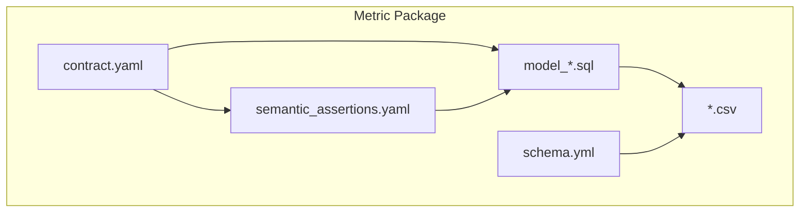
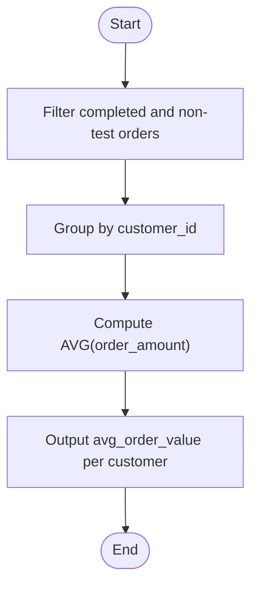
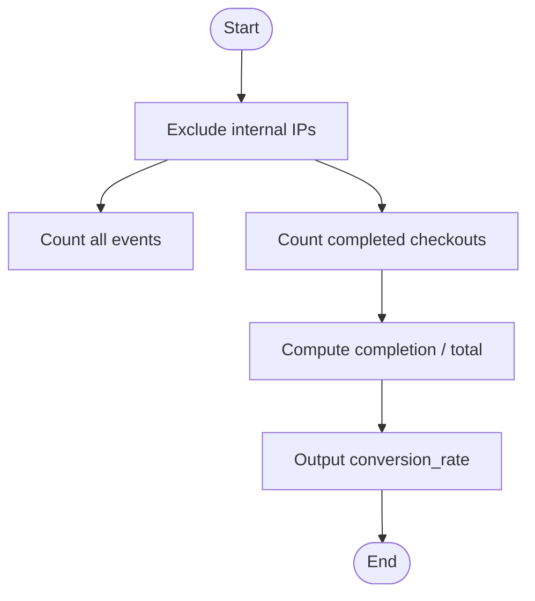
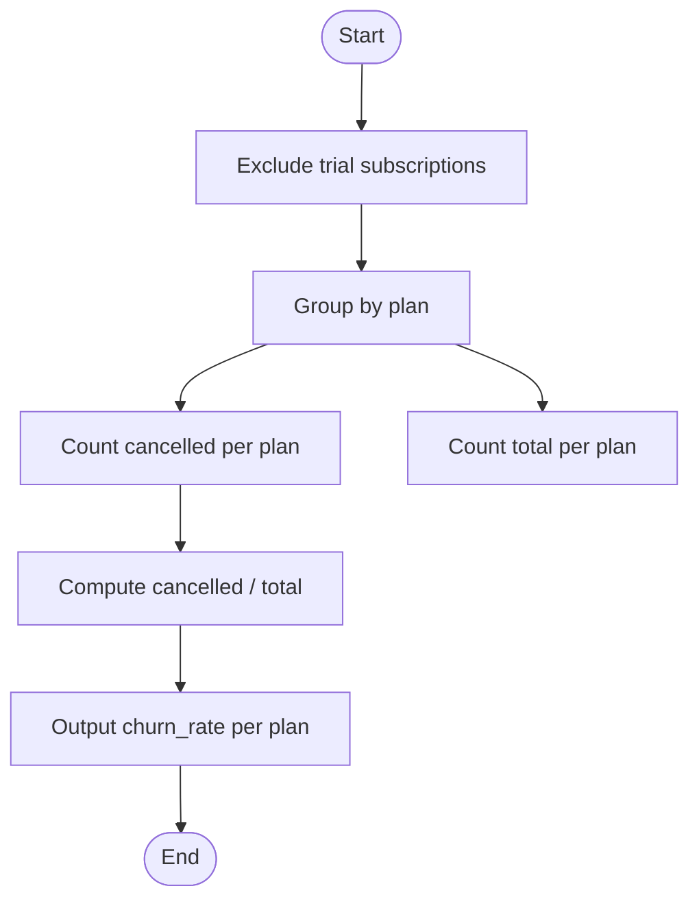
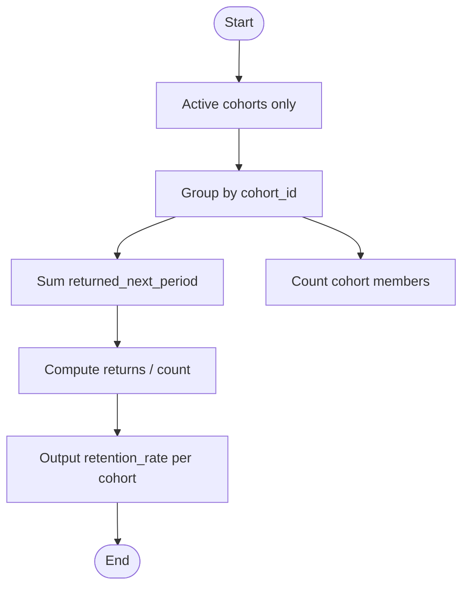
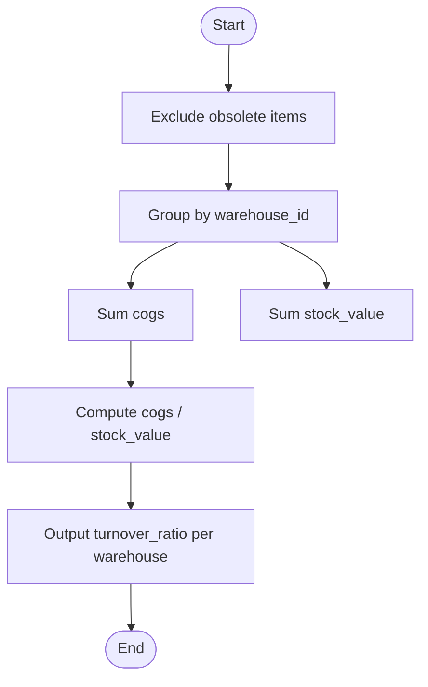
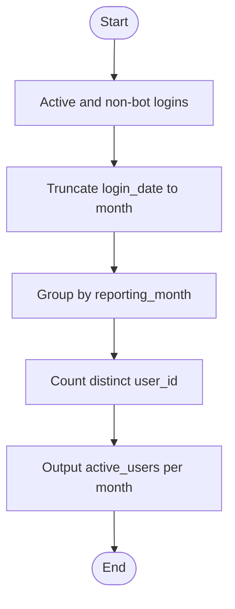
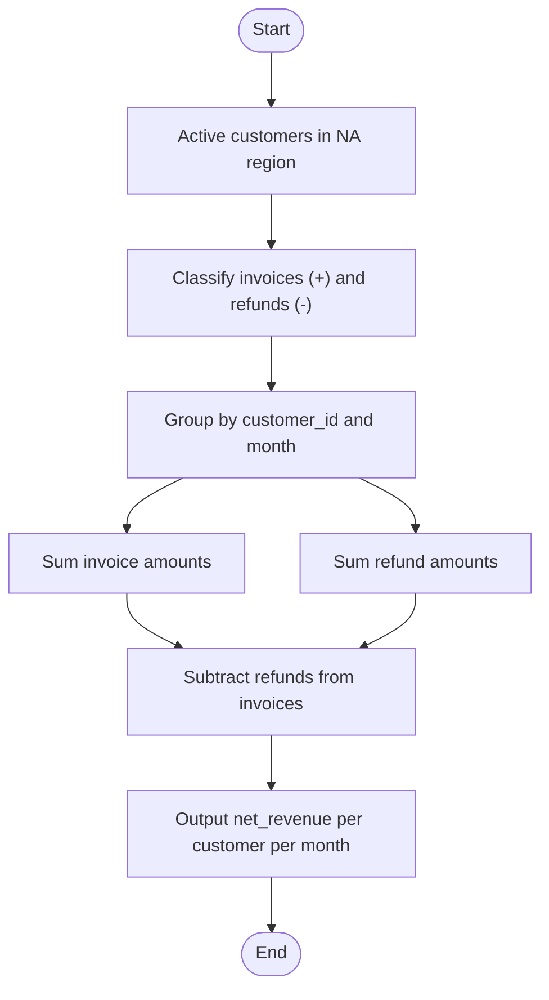
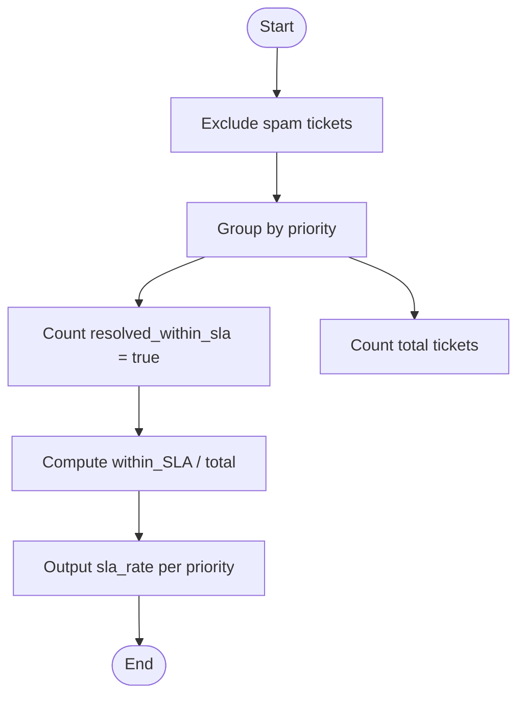
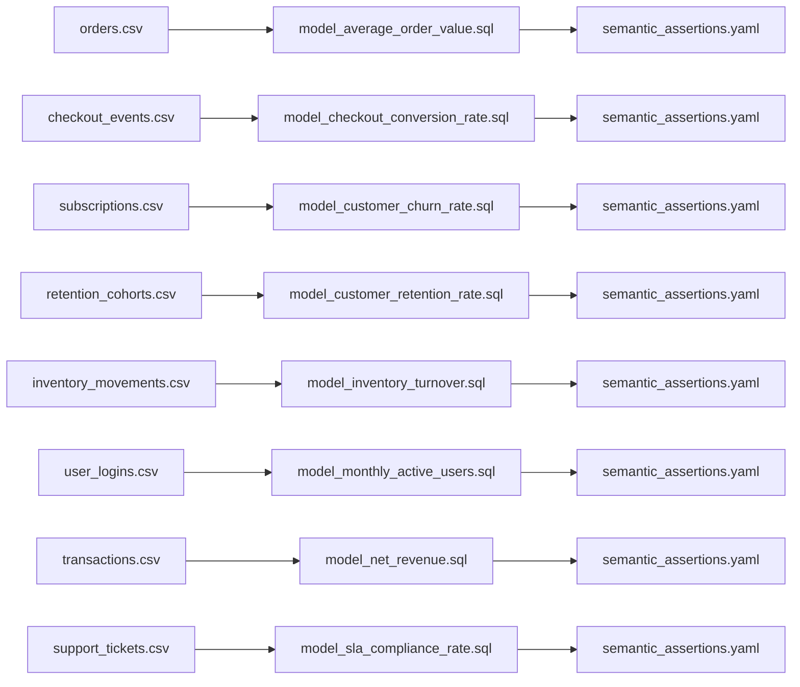

# Development Track

<cite>
**Referenced Files in This Document**
- [contract.yaml](file://benchmark_corpus/dev/average_order_value/contract.yaml)
- [model_average_order_value.sql](file://benchmark_corpus/dev/average_order_value/model_average_order_value.sql)
- [orders.csv](file://benchmark_corpus/dev/average_order_value/orders.csv)
- [schema.yml](file://benchmark_corpus/dev/average_order_value/schema.yml)
- [semantic_assertions.yaml](file://benchmark_corpus/dev/average_order_value/semantic_assertions.yaml)
- [contract.yaml](file://benchmark_corpus/dev/checkout_conversion_rate/contract.yaml)
- [model_checkout_conversion_rate.sql](file://benchmark_corpus/dev/checkout_conversion_rate/model_checkout_conversion_rate.sql)
- [checkout_events.csv](file://benchmark_corpus/dev/checkout_conversion_rate/checkout_events.csv)
- [schema.yml](file://benchmark_corpus/dev/checkout_conversion_rate/schema.yml)
- [semantic_assertions.yaml](file://benchmark_corpus/dev/checkout_conversion_rate/semantic_assertions.yaml)
- [contract.yaml](file://benchmark_corpus/dev/customer_churn_rate/contract.yaml)
- [model_customer_churn_rate.sql](file://benchmark_corpus/dev/customer_churn_rate/model_customer_churn_rate.sql)
- [subscriptions.csv](file://benchmark_corpus/dev/customer_churn_rate/subscriptions.csv)
- [schema.yml](file://benchmark_corpus/dev/customer_churn_rate/schema.yml)
- [semantic_assertions.yaml](file://benchmark_corpus/dev/customer_churn_rate/semantic_assertions.yaml)
- [contract.yaml](file://benchmark_corpus/dev/customer_retention_rate/contract.yaml)
- [model_customer_retention_rate.sql](file://benchmark_corpus/dev/customer_retention_rate/model_customer_retention_rate.sql)
- [retention_cohorts.csv](file://benchmark_corpus/dev/customer_retention_rate/retention_cohorts.csv)
- [schema.yml](file://benchmark_corpus/dev/customer_retention_rate/schema.yml)
- [semantic_assertions.yaml](file://benchmark_corpus/dev/customer_retention_rate/semantic_assertions.yaml)
- [contract.yaml](file://benchmark_corpus/dev/inventory_turnover/contract.yaml)
- [model_inventory_turnover.sql](file://benchmark_corpus/dev/inventory_turnover/model_inventory_turnover.sql)
- [inventory_movements.csv](file://benchmark_corpus/dev/inventory_turnover/inventory_movements.csv)
- [schema.yml](file://benchmark_corpus/dev/inventory_turnover/schema.yml)
- [semantic_assertions.yaml](file://benchmark_corpus/dev/inventory_turnover/semantic_assertions.yaml)
- [contract.yaml](file://benchmark_corpus/dev/monthly_active_users/contract.yaml)
- [model_monthly_active_users.sql](file://benchmark_corpus/dev/monthly_active_users/model_monthly_active_users.sql)
- [user_logins.csv](file://benchmark_corpus/dev/monthly_active_users/user_logins.csv)
- [schema.yml](file://benchmark_corpus/dev/monthly_active_users/schema.yml)
- [semantic_assertions.yaml](file://benchmark_corpus/dev/monthly_active_users/semantic_assertions.yaml)
- [contract.yaml](file://benchmark_corpus/dev/net_revenue/contract.yaml)
- [model_net_revenue.sql](file://benchmark_corpus/dev/net_revenue/model_net_revenue.sql)
- [transactions.csv](file://benchmark_corpus/dev/net_revenue/transactions.csv)
- [schema.yml](file://benchmark_corpus/dev/net_revenue/schema.yml)
- [semantic_assertions.yaml](file://benchmark_corpus/dev/net_revenue/semantic_assertions.yaml)
- [contract.yaml](file://benchmark_corpus/dev/sla_compliance_rate/contract.yaml)
- [model_sla_compliance_rate.sql](file://benchmark_corpus/dev/sla_compliance_rate/model_sla_compliance_rate.sql)
- [support_tickets.csv](file://benchmark_corpus/dev/sla_compliance_rate/support_tickets.csv)
- [schema.yml](file://benchmark_corpus/dev/sla_compliance_rate/schema.yml)
- [semantic_assertions.yaml](file://benchmark_corpus/dev/sla_compliance_rate/semantic_assertions.yaml)
</cite>

## Table of Contents
1. Introduction
2. Project Structure
3. Core Components
4. Architecture Overview
5. Detailed Component Analysis
6. Dependency Analysis
7. Performance Considerations
8. Troubleshooting Guide
9. Conclusion

## Introduction
This document describes the development track benchmark corpus for eight business metrics. It explains how each metric is defined and evaluated, including contract structure, SQL model implementations, sample data files, and semantic assertions. It also covers the evaluation methodology used during development to assess agent performance, guidance on interpreting results, comparing agents, and using these metrics for iterative development and testing.

## Project Structure
The development track organizes each metric as a self-contained package with consistent artifacts:
- Contract definition (YAML): declares metric identity, owner, grain, population filters, aggregation rules, and the canonical SQL query.
- SQL model implementation: a standalone SELECT that computes the metric from source tables.
- Sample data: CSV fixtures representing realistic inputs for execution and validation.
- Schema definitions: column types and constraints for source tables.
- Semantic assertions: declarative checks validating correctness, ranges, and relationships.



**Diagram sources**
- [contract.yaml:1-19](file://benchmark_corpus/dev/net_revenue/contract.yaml#L1-L19)
- [model_net_revenue.sql:1-8](file://benchmark_corpus/dev/net_revenue/model_net_revenue.sql#L1-L8)
- [transactions.csv](file://benchmark_corpus/dev/net_revenue/transactions.csv)
- [schema.yml](file://benchmark_corpus/dev/net_revenue/schema.yml)
- [semantic_assertions.yaml](file://benchmark_corpus/dev/net_revenue/semantic_assertions.yaml)

**Section sources**
- [contract.yaml:1-19](file://benchmark_corpus/dev/net_revenue/contract.yaml#L1-L19)
- [model_net_revenue.sql:1-8](file://benchmark_corpus/dev/net_revenue/model_net_revenue.sql#L1-L8)
- [schema.yml](file://benchmark_corpus/dev/net_revenue/schema.yml)
- [semantic_assertions.yaml](file://benchmark_corpus/dev/net_revenue/semantic_assertions.yaml)

## Core Components
Each metric package includes:
- Contract YAML: defines metric name, owner, grain, required filters, optional aggregation semantics, and canonical SQL.
- SQL Model: implements the metric computation over source tables with explicit filters and grouping.
- Sample Data: CSVs providing representative rows for deterministic runs.
- Schema: column definitions ensuring type safety and referential clarity.
- Semantic Assertions: domain-specific expectations (e.g., non-negative rates, plausible ranges, consistency across dimensions).

Key responsibilities by file:
- contract.yaml: authoritative specification of what the metric means and how it is computed.
- model_*.sql: executable logic that must match the contract’s SQL intent.
- *.csv: input fixtures enabling reproducible evaluation.
- schema.yml: structural contract for source tables.
- semantic_assertions.yaml: behavioral contract for outputs.

**Section sources**
- [contract.yaml:1-12](file://benchmark_corpus/dev/average_order_value/contract.yaml#L1-L12)
- [model_average_order_value.sql:1-6](file://benchmark_corpus/dev/average_order_value/model_average_order_value.sql#L1-L6)
- [orders.csv](file://benchmark_corpus/dev/average_order_value/orders.csv)
- [schema.yml](file://benchmark_corpus/dev/average_order_value/schema.yml)
- [semantic_assertions.yaml](file://benchmark_corpus/dev/average_order_value/semantic_assertions.yaml)

## Architecture Overview
The development track follows a declarative-to-executable pipeline:
- Contracts define intent and constraints.
- Models implement the computation.
- Fixtures provide deterministic inputs.
- Assertions validate outputs semantically.

```mermaid
sequenceDiagram
participant Dev as "Developer"
participant Contract as "contract.yaml"
participant Model as "model_*.sql"
participant Data as "*.csv"
participant Schema as "schema.yml"
participant Assert as "semantic_assertions.yaml"
Dev->>Contract : Define metric, grain, filters, SQL
Dev->>Model : Implement SELECT matching contract
Dev->>Data : Provide sample rows
Dev->>Schema : Declare columns/types
Dev->>Assert : Specify expected behaviors/ranges
Note over Model,Assert : Execution uses Data and Schema; Assert validates Model output
```

**Diagram sources**
- [contract.yaml:1-19](file://benchmark_corpus/dev/net_revenue/contract.yaml#L1-L19)
- [model_net_revenue.sql:1-8](file://benchmark_corpus/dev/net_revenue/model_net_revenue.sql#L1-L8)
- [transactions.csv](file://benchmark_corpus/dev/net_revenue/transactions.csv)
- [schema.yml](file://benchmark_corpus/dev/net_revenue/schema.yml)
- [semantic_assertions.yaml](file://benchmark_corpus/dev/net_revenue/semantic_assertions.yaml)

## Detailed Component Analysis

### Average Order Value
- Purpose: Compute the average order value per customer for completed, non-test orders.
- Contract highlights:
  - Grain: customer
  - Population filters: completed orders and non-test flags
  - SQL aggregates order amounts per customer
- Model: Aggregates order_amount by customer_id with appropriate filters.
- Data: orders.csv provides order-level records.
- Assertions: Expect non-negative values and reasonable averages per customer.



**Diagram sources**
- [contract.yaml:1-12](file://benchmark_corpus/dev/average_order_value/contract.yaml#L1-L12)
- [model_average_order_value.sql:1-6](file://benchmark_corpus/dev/average_order_value/model_average_order_value.sql#L1-L6)

**Section sources**
- [contract.yaml:1-12](file://benchmark_corpus/dev/average_order_value/contract.yaml#L1-L12)
- [model_average_order_value.sql:1-6](file://benchmark_corpus/dev/average_order_value/model_average_order_value.sql#L1-L6)
- [orders.csv](file://benchmark_corpus/dev/average_order_value/orders.csv)
- [schema.yml](file://benchmark_corpus/dev/average_order_value/schema.yml)
- [semantic_assertions.yaml](file://benchmark_corpus/dev/average_order_value/semantic_assertions.yaml)

### Checkout Conversion Rate
- Purpose: Measure the ratio of completed checkouts to total checkout sessions.
- Contract highlights:
  - Grain: aggregate
  - Population filter: exclude internal IPs
  - SQL counts completion events vs total events
- Model: Computes conversion rate from checkout_events with filtering.
- Data: checkout_events.csv contains event-level records.
- Assertions: Expect a rate between 0 and 1; stable under small perturbations.



**Diagram sources**
- [contract.yaml:1-11](file://benchmark_corpus/dev/checkout_conversion_rate/contract.yaml#L1-L11)
- [model_checkout_conversion_rate.sql:1-4](file://benchmark_corpus/dev/checkout_conversion_rate/model_checkout_conversion_rate.sql#L1-L4)

**Section sources**
- [contract.yaml:1-11](file://benchmark_corpus/dev/checkout_conversion_rate/contract.yaml#L1-L11)
- [model_checkout_conversion_rate.sql:1-4](file://benchmark_corpus/dev/checkout_conversion_rate/model_checkout_conversion_rate.sql#L1-L4)
- [checkout_events.csv](file://benchmark_corpus/dev/checkout_conversion_rate/checkout_events.csv)
- [schema.yml](file://benchmark_corpus/dev/checkout_conversion_rate/schema.yml)
- [semantic_assertions.yaml](file://benchmark_corpus/dev/checkout_conversion_rate/semantic_assertions.yaml)

### Customer Churn Rate
- Purpose: Proportion of active subscription cancellations per plan.
- Contract highlights:
  - Grain: plan
  - Population filter: exclude trials
  - SQL calculates cancellation ratio per plan
- Model: Groups subscriptions by plan and computes churn_rate.
- Data: subscriptions.csv holds plan-level subscription records.
- Assertions: Expect rates within [0,1]; consistent across plans.



**Diagram sources**
- [contract.yaml:1-11](file://benchmark_corpus/dev/customer_churn_rate/contract.yaml#L1-L11)
- [model_customer_churn_rate.sql:1-6](file://benchmark_corpus/dev/customer_churn_rate/model_customer_churn_rate.sql#L1-L6)

**Section sources**
- [contract.yaml:1-11](file://benchmark_corpus/dev/customer_churn_rate/contract.yaml#L1-L11)
- [model_customer_churn_rate.sql:1-6](file://benchmark_corpus/dev/customer_churn_rate/model_customer_churn_rate.sql#L1-L6)
- [subscriptions.csv](file://benchmark_corpus/dev/customer_churn_rate/subscriptions.csv)
- [schema.yml](file://benchmark_corpus/dev/customer_churn_rate/schema.yml)
- [semantic_assertions.yaml](file://benchmark_corpus/dev/customer_churn_rate/semantic_assertions.yaml)

### Customer Retention Rate
- Purpose: Percentage of active cohort members returning in the next period.
- Contract highlights:
  - Grain: cohort
  - Population filter: active status
  - SQL sums returns and divides by cohort size
- Model: Groups retention_cohorts by cohort_id and computes retention_rate.
- Data: retention_cohorts.csv contains cohort membership and return flags.
- Assertions: Expect rates in [0,1]; monotonicity or stability expectations may apply.



**Diagram sources**
- [contract.yaml:1-12](file://benchmark_corpus/dev/customer_retention_rate/contract.yaml#L1-L12)
- [model_customer_retention_rate.sql:1-6](file://benchmark_corpus/dev/customer_retention_rate/model_customer_retention_rate.sql#L1-L6)

**Section sources**
- [contract.yaml:1-12](file://benchmark_corpus/dev/customer_retention_rate/contract.yaml#L1-L12)
- [model_customer_retention_rate.sql:1-6](file://benchmark_corpus/dev/customer_retention_rate/model_customer_retention_rate.sql#L1-L6)
- [retention_cohorts.csv](file://benchmark_corpus/dev/customer_retention_rate/retention_cohorts.csv)
- [schema.yml](file://benchmark_corpus/dev/customer_retention_rate/schema.yml)
- [semantic_assertions.yaml](file://benchmark_corpus/dev/customer_retention_rate/semantic_assertions.yaml)

### Inventory Turnover
- Purpose: Ratio of cost of goods sold to inventory value per warehouse.
- Contract highlights:
  - Grain: warehouse
  - Population filter: exclude obsolete items
  - SQL computes turnover_ratio via aggregated COGS and stock value
- Model: Groups inventory_movements by warehouse_id and calculates turnover_ratio.
- Data: inventory_movements.csv includes movement records with COGS and stock values.
- Assertions: Expect positive ratios; outliers flagged by assertions.



**Diagram sources**
- [contract.yaml:1-11](file://benchmark_corpus/dev/inventory_turnover/contract.yaml#L1-L11)
- [model_inventory_turnover.sql:1-6](file://benchmark_corpus/dev/inventory_turnover/model_inventory_turnover.sql#L1-L6)

**Section sources**
- [contract.yaml:1-11](file://benchmark_corpus/dev/inventory_turnover/contract.yaml#L1-L11)
- [model_inventory_turnover.sql:1-6](file://benchmark_corpus/dev/inventory_turnover/model_inventory_turnover.sql#L1-L6)
- [inventory_movements.csv](file://benchmark_corpus/dev/inventory_turnover/inventory_movements.csv)
- [schema.yml](file://benchmark_corpus/dev/inventory_turnover/schema.yml)
- [semantic_assertions.yaml](file://benchmark_corpus/dev/inventory_turnover/semantic_assertions.yaml)

### Monthly Active Users
- Purpose: Unique count of active authenticated users engaging within a month.
- Contract highlights:
  - Grain: monthly
  - Population filters: active status and non-bot users
  - SQL truncates login_date to month and counts distinct users
- Model: Groups user_logins by reporting month and counts unique user_id.
- Data: user_logins.csv contains login events with timestamps and user identifiers.
- Assertions: Expect non-negative counts; plausible growth patterns.



**Diagram sources**
- [contract.yaml:1-13](file://benchmark_corpus/dev/monthly_active_users/contract.yaml#L1-L13)
- [model_monthly_active_users.sql:1-6](file://benchmark_corpus/dev/monthly_active_users/model_monthly_active_users.sql#L1-L6)

**Section sources**
- [contract.yaml:1-13](file://benchmark_corpus/dev/monthly_active_users/contract.yaml#L1-L13)
- [model_monthly_active_users.sql:1-6](file://benchmark_corpus/dev/monthly_active_users/model_monthly_active_users.sql#L1-L6)
- [user_logins.csv](file://benchmark_corpus/dev/monthly_active_users/user_logins.csv)
- [schema.yml](file://benchmark_corpus/dev/monthly_active_users/schema.yml)
- [semantic_assertions.yaml](file://benchmark_corpus/dev/monthly_active_users/semantic_assertions.yaml)

### Net Revenue
- Purpose: Recognized revenue minus refunds for active enterprise users in NA region.
- Contract highlights:
  - Grain: customer_month
  - Population filters: active status and NA region
  - Aggregation: positive components (invoices), negative components (refunds)
  - SQL sums invoices and subtracts refunds per customer per month
- Model: Computes net_revenue grouped by customer_id and reporting_month.
- Data: transactions.csv includes invoice and refund entries with amounts and dates.
- Assertions: Expect non-negative net revenue where applicable; consistent totals.



**Diagram sources**
- [contract.yaml:1-19](file://benchmark_corpus/dev/net_revenue/contract.yaml#L1-L19)
- [model_net_revenue.sql:1-8](file://benchmark_corpus/dev/net_revenue/model_net_revenue.sql#L1-L8)

**Section sources**
- [contract.yaml:1-19](file://benchmark_corpus/dev/net_revenue/contract.yaml#L1-L19)
- [model_net_revenue.sql:1-8](file://benchmark_corpus/dev/net_revenue/model_net_revenue.sql#L1-L8)
- [transactions.csv](file://benchmark_corpus/dev/net_revenue/transactions.csv)
- [schema.yml](file://benchmark_corpus/dev/net_revenue/schema.yml)
- [semantic_assertions.yaml](file://benchmark_corpus/dev/net_revenue/semantic_assertions.yaml)

### SLA Compliance Rate
- Purpose: Percentage of support tickets resolved within contracted SLA window by priority.
- Contract highlights:
  - Grain: priority
  - Population filter: exclude spam tickets
  - SQL computes ratio of within-SLA resolutions to total tickets per priority
- Model: Groups support_tickets by priority and calculates sla_rate.
- Data: support_tickets.csv includes ticket resolution flags and priorities.
- Assertions: Expect rates in [0,1]; higher priorities may have different targets.



**Diagram sources**
- [contract.yaml:1-12](file://benchmark_corpus/dev/sla_compliance_rate/contract.yaml#L1-L12)
- [model_sla_compliance_rate.sql:1-6](file://benchmark_corpus/dev/sla_compliance_rate/model_sla_compliance_rate.sql#L1-L6)

**Section sources**
- [contract.yaml:1-12](file://benchmark_corpus/dev/sla_compliance_rate/contract.yaml#L1-L12)
- [model_sla_compliance_rate.sql:1-6](file://benchmark_corpus/dev/sla_compliance_rate/model_sla_compliance_rate.sql#L1-L6)
- [support_tickets.csv](file://benchmark_corpus/dev/sla_compliance_rate/support_tickets.csv)
- [schema.yml](file://benchmark_corpus/dev/sla_compliance_rate/schema.yml)
- [semantic_assertions.yaml](file://benchmark_corpus/dev/sla_compliance_rate/semantic_assertions.yaml)

## Dependency Analysis
- Each metric depends on its own set of source tables defined in schema.yml and populated by *.csv fixtures.
- The contract YAML constrains the SQL model’s behavior through population filters and aggregation semantics.
- Semantic assertions depend on the model’s output shape and domain expectations.



**Diagram sources**
- [orders.csv](file://benchmark_corpus/dev/average_order_value/orders.csv)
- [model_average_order_value.sql:1-6](file://benchmark_corpus/dev/average_order_value/model_average_order_value.sql#L1-L6)
- [checkout_events.csv](file://benchmark_corpus/dev/checkout_conversion_rate/checkout_events.csv)
- [model_checkout_conversion_rate.sql:1-4](file://benchmark_corpus/dev/checkout_conversion_rate/model_checkout_conversion_rate.sql#L1-L4)
- [subscriptions.csv](file://benchmark_corpus/dev/customer_churn_rate/subscriptions.csv)
- [model_customer_churn_rate.sql:1-6](file://benchmark_corpus/dev/customer_churn_rate/model_customer_churn_rate.sql#L1-L6)
- [retention_cohorts.csv](file://benchmark_corpus/dev/customer_retention_rate/retention_cohorts.csv)
- [model_customer_retention_rate.sql:1-6](file://benchmark_corpus/dev/customer_retention_rate/model_customer_retention_rate.sql#L1-L6)
- [inventory_movements.csv](file://benchmark_corpus/dev/inventory_turnover/inventory_movements.csv)
- [model_inventory_turnover.sql:1-6](file://benchmark_corpus/dev/inventory_turnover/model_inventory_turnover.sql#L1-L6)
- [user_logins.csv](file://benchmark_corpus/dev/monthly_active_users/user_logins.csv)
- [model_monthly_active_users.sql:1-6](file://benchmark_corpus/dev/monthly_active_users/model_monthly_active_users.sql#L1-L6)
- [transactions.csv](file://benchmark_corpus/dev/net_revenue/transactions.csv)
- [model_net_revenue.sql:1-8](file://benchmark_corpus/dev/net_revenue/model_net_revenue.sql#L1-L8)
- [support_tickets.csv](file://benchmark_corpus/dev/sla_compliance_rate/support_tickets.csv)
- [model_sla_compliance_rate.sql:1-6](file://benchmark_corpus/dev/sla_compliance_rate/model_sla_compliance_rate.sql#L1-L6)

**Section sources**
- [contract.yaml:1-19](file://benchmark_corpus/dev/net_revenue/contract.yaml#L1-L19)
- [model_net_revenue.sql:1-8](file://benchmark_corpus/dev/net_revenue/model_net_revenue.sql#L1-L8)
- [schema.yml](file://benchmark_corpus/dev/net_revenue/schema.yml)
- [semantic_assertions.yaml](file://benchmark_corpus/dev/net_revenue/semantic_assertions.yaml)

## Performance Considerations
- Filtering early: Apply population filters in WHERE clauses to reduce dataset size before aggregation.
- Efficient grouping: Use appropriate grains (customer, cohort, monthly) to minimize large cross joins.
- Aggregation choices: Prefer SUM/COUNT/DISTINCT operations that align with database optimizations.
- Fixture size: Keep CSVs representative but minimal to speed up iteration cycles.
- Assertion scope: Focus assertions on critical paths to reduce overhead while maintaining confidence.

[No sources needed since this section provides general guidance]

## Troubleshooting Guide
Common issues and remedies:
- Mismatched filters: Ensure model filters match contract population requirements (e.g., excluding test/internal/spam records).
- Incorrect grain: Verify GROUP BY keys align with contract grain (e.g., monthly truncation for MAU).
- Division by zero: Guard against empty groups when computing rates; handle edge cases in assertions.
- Type mismatches: Confirm schema.yml types match CSV content and SQL expectations.
- Assertion failures: Review semantic_assertions.yaml thresholds and update fixtures if necessary.

**Section sources**
- [contract.yaml:1-19](file://benchmark_corpus/dev/net_revenue/contract.yaml#L1-L19)
- [model_net_revenue.sql:1-8](file://benchmark_corpus/dev/net_revenue/model_net_revenue.sql#L1-L8)
- [schema.yml](file://benchmark_corpus/dev/net_revenue/schema.yml)
- [semantic_assertions.yaml](file://benchmark_corpus/dev/net_revenue/semantic_assertions.yaml)

## Conclusion
The development track provides a robust, repeatable framework for defining, implementing, and validating business metrics. By adhering to contracts, models, schemas, fixtures, and semantic assertions, teams can iteratively develop and test agents with clear evaluation criteria. Results enable direct comparison across agents and guide targeted improvements based on assertion outcomes and metric behavior.

[No sources needed since this section summarizes without analyzing specific files]