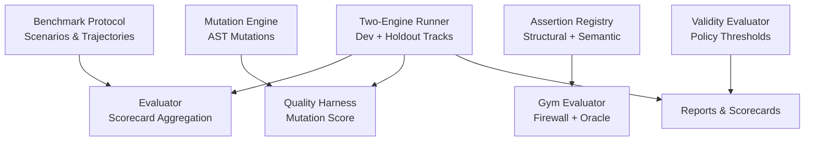
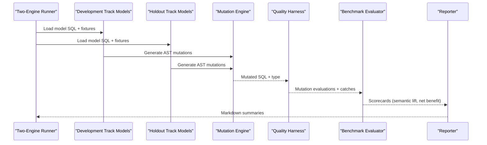
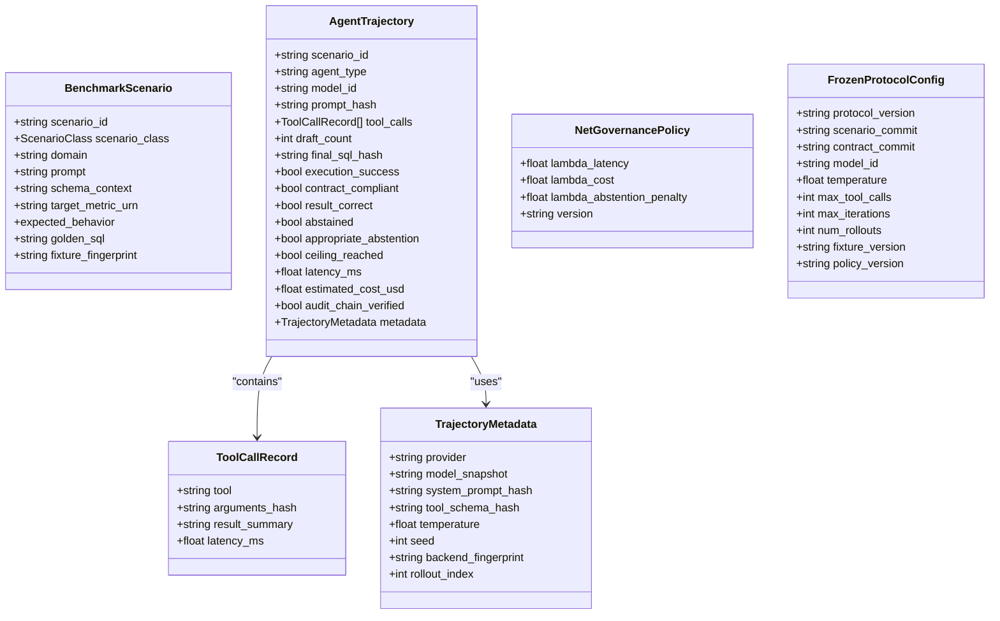
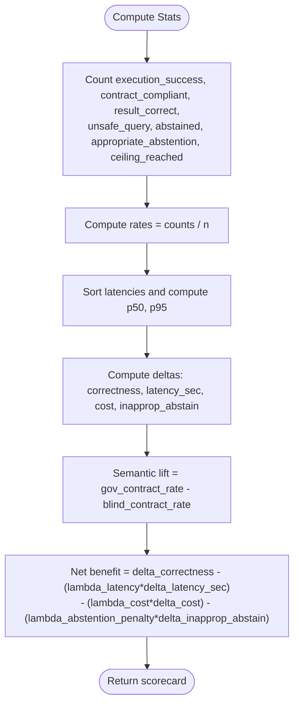
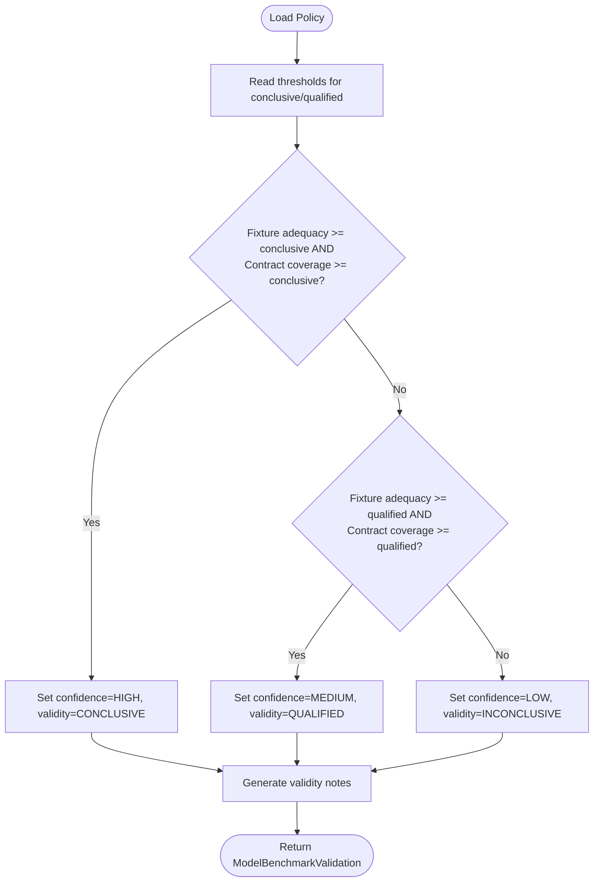
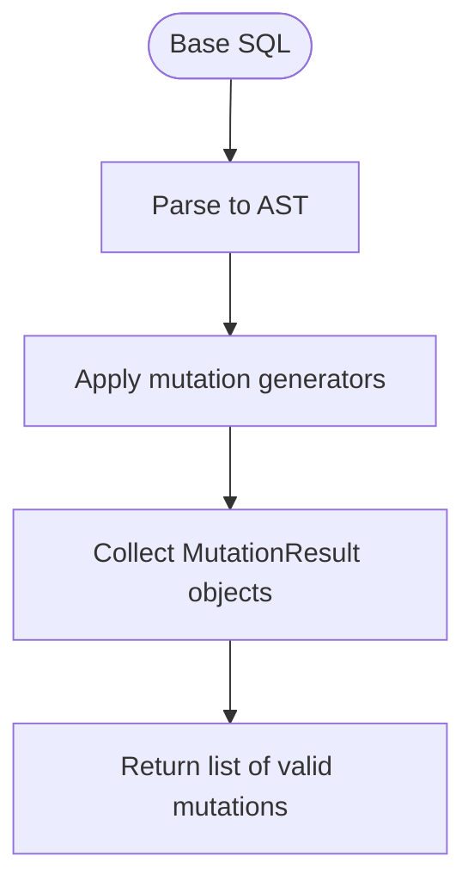
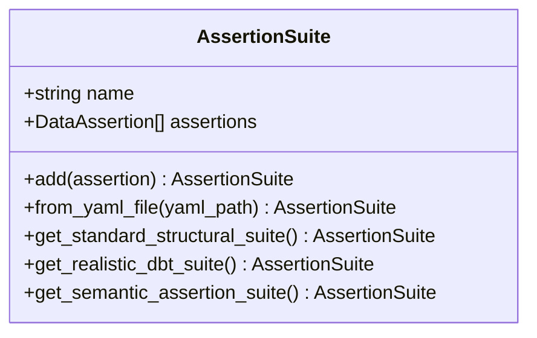
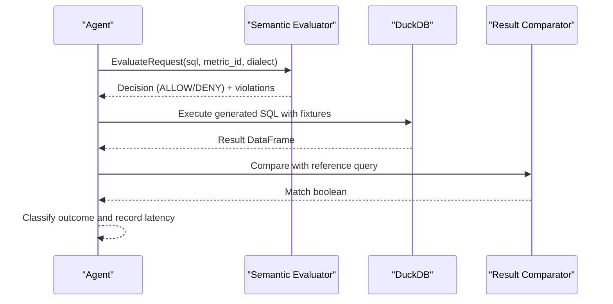
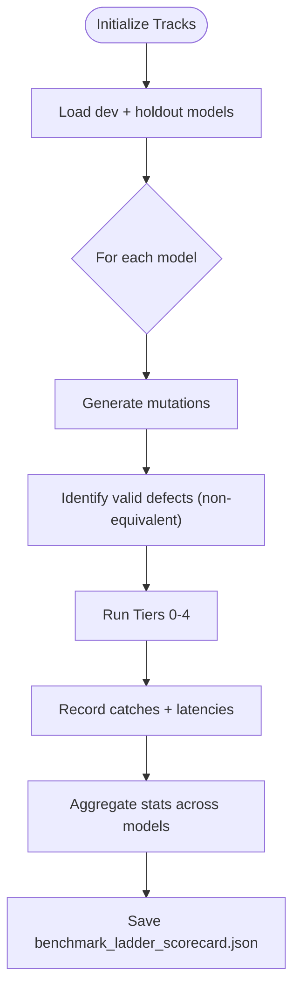
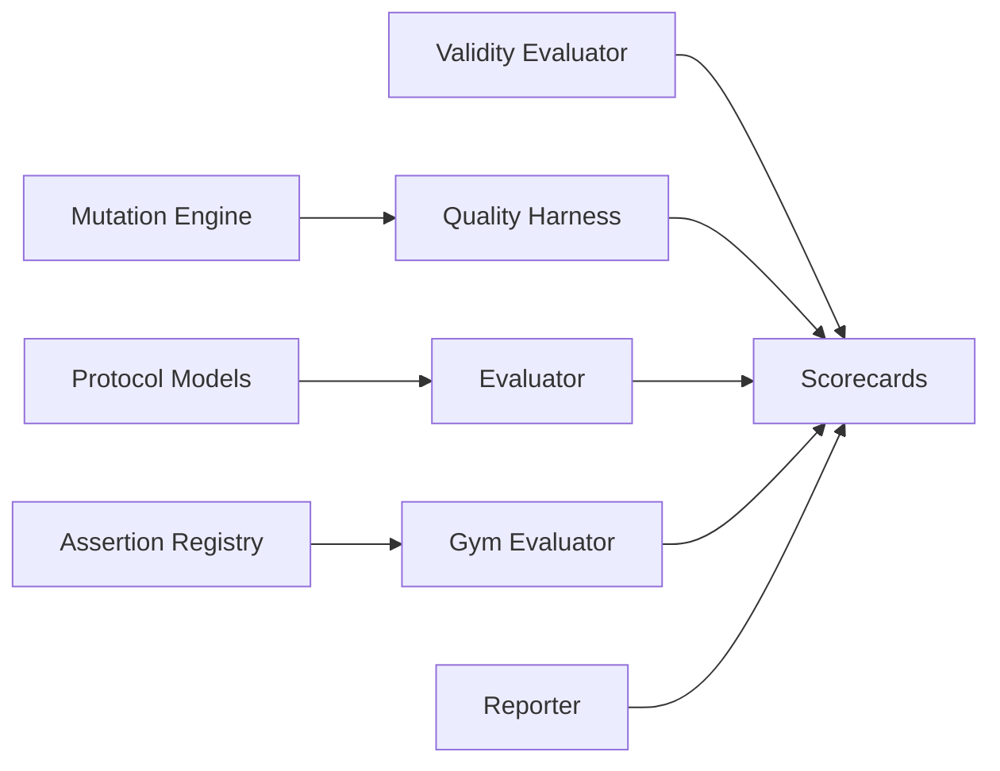

# Evaluation Protocol

<cite>
**Referenced Files in This Document**
- [protocol.py](file://semantic_reliability/benchmark/protocol.py)
- [evaluator.py](file://semantic_reliability/benchmark/evaluator.py)
- [quality_harness.py](file://semantic_reliability/harness/quality_harness.py)
- [engine.py](file://semantic_reliability/testing/mutations/engine.py)
- [mutators.py](file://semantic_reliability/testing/mutations/mutators.py)
- [registry.py](file://semantic_reliability/assertions/registry.py)
- [validity.py](file://semantic_reliability/harness/validity.py)
- [validity_policy.yaml](file://semantic_reliability/harness/validity_policy.yaml)
- [reporter.py](file://semantic_reliability/harness/reporter.py)
- [gym_evaluator.py](file://semantic_reliability/gym/evaluator.py)
- [run_two_engine_benchmark.py](file://scripts/run_two_engine_benchmark.py)
- [benchmark_scorecard.json](file://benchmark_scorecard.json)
- [dev_results.json](file://dev_results.json)
- [holdout_results.json](file://holdout_results.json)
- [corpus_results.json](file://corpus_results.json)
- [benchmark_ladder_scorecard.json](file://benchmark_ladder_scorecard.json)
- [hybrid_escalation_scorecard.json](file://hybrid_escalation_scorecard.json)
- [replay_scorecard.json](file://replay_scorecard.json)
</cite>

## Table of Contents
1. Introduction
2. Project Structure
3. Core Components
4. Architecture Overview
5. Detailed Component Analysis
6. Dependency Analysis
7. Performance Considerations
8. Troubleshooting Guide
9. Conclusion
10. Appendices

## Introduction
This document explains the benchmark evaluation protocol and scoring methodology used to assess agent performance across development and holdout tracks. It covers:
- Multi-model cross-evaluation framework
- Scoring algorithms, normalization techniques, and statistical aggregation
- Validity policy enforcement for confidence and conclusiveness
- Mutation operator testing and assertion registry validation
- Scorecard generation and interpretation
- Reproducibility standards and version control for benchmark integrity

The system evaluates both a “blind” baseline and a “governed” path (with semantic contracts and runtime checks), enabling measurement of semantic lift and net governance benefit while controlling for latency, cost, and inappropriate abstention.

## Project Structure
The evaluation pipeline spans several modules:
- Benchmark protocol and trajectory models define immutable scenarios, tool call records, metadata, and frozen configuration for reproducibility.
- Evaluator aggregates per-trajectory metrics into scorecards with semantic lift and net governance benefit.
- Mutation engine injects AST-level logical mutations; quality harness simulates or executes tests against mutated SQL to compute mutation scores.
- Assertion registry loads structural and semantic assertions from YAML and provides standard suites.
- Validity evaluator applies a versioned policy to classify results as conclusive, qualified, or inconclusive based on fixture adequacy and contract coverage.
- Reporter generates human-readable markdown reports for drift and mutation benchmarks.
- Gym evaluator runs agent-generated SQL through a firewall and compares outputs against reference queries using fixtures.
- Script orchestrates a two-engine ladder benchmark across development and holdout tracks and persists aggregated scorecards.

**Diagram sources**
- [protocol.py:15-96](file://semantic_reliability/benchmark/protocol.py#L15-L96)
- [evaluator.py:7-80](file://semantic_reliability/benchmark/evaluator.py#L7-L80)
- [engine.py:8-53](file://semantic_reliability/testing/mutations/engine.py#L8-L53)
- [quality_harness.py:34-113](file://semantic_reliability/harness/quality_harness.py#L34-L113)
- [registry.py:22-160](file://semantic_reliability/assertions/registry.py#L22-L160)
- [gym_evaluator.py:113-294](file://semantic_reliability/gym/evaluator.py#L113-L294)
- [validity.py:47-127](file://semantic_reliability/harness/validity.py#L47-L127)
- [run_two_engine_benchmark.py:33-255](file://scripts/run_two_engine_benchmark.py#L33-L255)

**Section sources**
- [protocol.py:15-96](file://semantic_reliability/benchmark/protocol.py#L15-L96)
- [evaluator.py:7-80](file://semantic_reliability/benchmark/evaluator.py#L7-L80)
- [engine.py:8-53](file://semantic_reliability/testing/mutations/engine.py#L8-L53)
- [quality_harness.py:34-113](file://semantic_reliability/harness/quality_harness.py#L34-L113)
- [registry.py:22-160](file://semantic_reliability/assertions/registry.py#L22-L160)
- [validity.py:47-127](file://semantic_reliability/harness/validity.py#L47-L127)
- [run_two_engine_benchmark.py:33-255](file://scripts/run_two_engine_benchmark.py#L33-L255)

## Core Components
- Benchmark protocol defines immutable scenario definitions, tool call records, trajectory metadata, and frozen configuration to ensure reproducibility across runs.
- Benchmark evaluator computes normalized rates (execution success, contract compliance, result correctness, unsafe query rate, abstention rates), latency percentiles, and composite metrics (semantic lift, net governance benefit).
- Mutation engine performs precise AST-level mutations (filter drop, boundary shift, aggregation swap, distinct drop, join predicate drop, grain drop, coalesce bypass, math operator invert).
- Quality harness evaluates test suite robustness by running standard or custom checks against mutated SQL and computing mutation catch percentages.
- Assertion registry builds suites of structural and semantic assertions from YAML, including non-null, unique key, row count bounds, accepted ranges/values, relationships, singular SQL, required population, metric value, and expected grain.
- Validity evaluator classifies benchmark validity and confidence using thresholds from a versioned policy file based on fixture adequacy and contract coverage.
- Gym evaluator enforces pre-execution policy via a semantic firewall, executes candidate SQL against fixtures, compares results to ground truth, and classifies outcomes into a formal taxonomy.
- Reporter produces markdown summaries for drift alerts and mutation benchmarks.

**Section sources**
- [protocol.py:15-96](file://semantic_reliability/benchmark/protocol.py#L15-L96)
- [evaluator.py:7-80](file://semantic_reliability/benchmark/evaluator.py#L7-L80)
- [engine.py:8-269](file://semantic_reliability/testing/mutations/engine.py#L8-L269)
- [mutators.py:8-27](file://semantic_reliability/testing/mutations/mutators.py#L8-L27)
- [quality_harness.py:34-113](file://semantic_reliability/harness/quality_harness.py#L34-L113)
- [registry.py:22-160](file://semantic_reliability/assertions/registry.py#L22-L160)
- [validity.py:47-127](file://semantic_reliability/harness/validity.py#L47-L127)
- [gym_evaluator.py:113-294](file://semantic_reliability/gym/evaluator.py#L113-L294)
- [reporter.py:8-129](file://semantic_reliability/harness/reporter.py#L8-L129)

## Architecture Overview
The multi-model cross-evaluation framework runs both blind and governed agents across development and holdout tracks, collecting trajectories and aggregating metrics into scorecards. The runner executes a five-tier ladder (syntax-only, minimal structural, realistic dbt suite, static SCOS AST linter, runtime relational oracle) to measure detection capabilities and latency trade-offs.

**Diagram sources**
- [run_two_engine_benchmark.py:33-255](file://scripts/run_two_engine_benchmark.py#L33-L255)
- [engine.py:8-53](file://semantic_reliability/testing/mutations/engine.py#L8-L53)
- [quality_harness.py:66-113](file://semantic_reliability/harness/quality_harness.py#L66-L113)
- [evaluator.py:13-80](file://semantic_reliability/benchmark/evaluator.py#L13-L80)
- [reporter.py:87-129](file://semantic_reliability/harness/reporter.py#L87-L129)

## Detailed Component Analysis

### Benchmark Protocol and Frozen Configuration
- ScenarioClass enumerates scenario types (clear contract, ambiguous metric, missing contract, contract conflict).
- BenchmarkScenario captures scenario identity, domain, prompt, schema context, target metric URN, expected behavior, golden SQL, and fixture fingerprint.
- ToolCallRecord stores privacy-preserving invocation details with hashed arguments and latency.
- TrajectoryMetadata records provider, model snapshot, prompt/tool schema hashes, temperature, seed, backend fingerprint, and rollout index for reproducibility.
- AgentTrajectory records full execution path, flags for execution success, contract compliance, result correctness, abstention, appropriate abstention, ceiling reached, latency, estimated cost, and audit chain verification.
- NetGovernancePolicy defines weights for latency, cost, and abstention penalty used in net benefit calculation.
- FrozenProtocolConfig locks protocol version, commits, model ID, temperature, max tool calls, iterations, rollouts, fixture version, and policy version.

**Diagram sources**
- [protocol.py:8-96](file://semantic_reliability/benchmark/protocol.py#L8-L96)

**Section sources**
- [protocol.py:8-96](file://semantic_reliability/benchmark/protocol.py#L8-L96)

### Scoring Algorithms and Normalization
- Rates are computed as counts divided by total evaluations, rounded to four decimal places.
- Latency percentiles (p50, p95) are derived from sorted latencies across trajectories.
- Semantic lift is the difference in contract compliance rates between governed and blind baselines.
- Net governance benefit combines delta correctness, latency penalty, cost penalty, and inappropriate abstention penalty using policy weights.

**Diagram sources**
- [evaluator.py:13-80](file://semantic_reliability/benchmark/evaluator.py#L13-L80)

**Section sources**
- [evaluator.py:13-80](file://semantic_reliability/benchmark/evaluator.py#L13-L80)

### Validity Policy Enforcement
- Versioned policy defines thresholds for conclusive and qualified classifications based on fixture adequacy and contract coverage.
- Confidence levels: HIGH (conclusive), MEDIUM (qualified), LOW (inconclusive).
- Incremental gain is computed as semantic catch minus standard catch.
- Validity notes explain whether thresholds are met or not.

**Diagram sources**
- [validity.py:47-127](file://semantic_reliability/harness/validity.py#L47-L127)
- [validity_policy.yaml:1-17](file://semantic_reliability/harness/validity_policy.yaml#L1-L17)

**Section sources**
- [validity.py:47-127](file://semantic_reliability/harness/validity.py#L47-L127)
- [validity_policy.yaml:1-17](file://semantic_reliability/harness/validity_policy.yaml#L1-L17)

### Mutation Operator Testing
- MutationEngine parses base SQL into an AST and applies targeted mutations:
  - Filter drop: remove right conjunct or entire WHERE clause
  - Boundary shift: change > to >=, < to <=, = to !=
  - Aggregation swap: swap SUM/AVG/COUNT
  - Distinct drop: remove DISTINCT modifier in COUNT(DISTINCT)
  - Join predicate drop: remove ON condition causing Cartesian product risk
  - Grain drop: remove a column from GROUP BY
  - Coalesce bypass: replace COALESCE(col, default) with col
  - Math operator invert: flip + to - or - to +
- Each mutation returns structured results with original and mutated SQL, target node, and category.

**Diagram sources**
- [engine.py:8-53](file://semantic_reliability/testing/mutations/engine.py#L8-L53)
- [mutators.py:8-27](file://semantic_reliability/testing/mutations/mutators.py#L8-L27)

**Section sources**
- [engine.py:8-269](file://semantic_reliability/testing/mutations/engine.py#L8-L269)
- [mutators.py:8-27](file://semantic_reliability/testing/mutations/mutators.py#L8-L27)

### Assertion Registry Validation
- AssertionSuite constructs collections of data quality and semantic assertions from YAML configurations.
- Supports structural checks (non-null, unique keys, row count bounds, accepted ranges/values, relationships, singular SQL) and semantic checks (required population, metric values, expected grain).
- Provides standard suites mimicking minimal and realistic dbt test sets, plus comprehensive semantic reliability suites.

**Diagram sources**
- [registry.py:22-160](file://semantic_reliability/assertions/registry.py#L22-L160)

**Section sources**
- [registry.py:22-160](file://semantic_reliability/assertions/registry.py#L22-L160)

### Agent Evaluation Workflow (Gym Evaluator)
- Pre-execution firewall check enforces policy before running generated SQL.
- Execution against DuckDB with fixtures determines success and result match against reference query.
- Classification taxonomy includes compliant matches, compliant mismatches, violation matches/mismatches, unresolved contracts, and execution errors.
- Aggregates confusion matrix, latency summary, domain compliance, and detailed records.

**Diagram sources**
- [gym_evaluator.py:113-294](file://semantic_reliability/gym/evaluator.py#L113-L294)

**Section sources**
- [gym_evaluator.py:113-294](file://semantic_reliability/gym/evaluator.py#L113-L294)

### Two-Engine Ladder Benchmark Runner
- Orchestrates evaluation across Development and Frozen Holdout tracks.
- For each model:
  - Loads SQL and CSV fixtures into DuckDB
  - Generates mutations and identifies valid defects (non-equivalent outputs)
  - Runs five tiers: syntax-only, minimal structural, realistic dbt suite, static SCOS AST linter, runtime relational oracle
  - Records catches and latencies per tier
- Aggregates summary statistics and saves scorecard JSON.

**Diagram sources**
- [run_two_engine_benchmark.py:33-255](file://scripts/run_two_engine_benchmark.py#L33-L255)

**Section sources**
- [run_two_engine_benchmark.py:33-255](file://scripts/run_two_engine_benchmark.py#L33-L255)

## Dependency Analysis
- Benchmark evaluator depends on protocol models and policy weights to compute normalized metrics and composite benefits.
- Mutation engine depends on sqlglot AST parsing and mutator definitions to produce structured mutation results.
- Quality harness depends on mutation engine output and either simulated or custom test runners to compute mutation scores.
- Assertion registry composes structural and semantic assertions from YAML and provides reusable suites.
- Gym evaluator integrates firewall policy, DuckDB execution, and result comparison to classify agent outputs.
- Validity evaluator depends on a versioned policy file to enforce thresholds for confidence and validity classification.
- Reporter consumes drift and mutation benchmark outputs to generate markdown summaries.

**Diagram sources**
- [protocol.py:15-96](file://semantic_reliability/benchmark/protocol.py#L15-L96)
- [evaluator.py:7-80](file://semantic_reliability/benchmark/evaluator.py#L7-L80)
- [engine.py:8-53](file://semantic_reliability/testing/mutations/engine.py#L8-L53)
- [quality_harness.py:34-113](file://semantic_reliability/harness/quality_harness.py#L34-L113)
- [registry.py:22-160](file://semantic_reliability/assertions/registry.py#L22-L160)
- [gym_evaluator.py:113-294](file://semantic_reliability/gym/evaluator.py#L113-L294)
- [validity.py:47-127](file://semantic_reliability/harness/validity.py#L47-L127)
- [reporter.py:8-129](file://semantic_reliability/harness/reporter.py#L8-L129)

**Section sources**
- [protocol.py:15-96](file://semantic_reliability/benchmark/protocol.py#L15-L96)
- [evaluator.py:7-80](file://semantic_reliability/benchmark/evaluator.py#L7-L80)
- [engine.py:8-53](file://semantic_reliability/testing/mutations/engine.py#L8-L53)
- [quality_harness.py:34-113](file://semantic_reliability/harness/quality_harness.py#L34-L113)
- [registry.py:22-160](file://semantic_reliability/assertions/registry.py#L22-L160)
- [gym_evaluator.py:113-294](file://semantic_reliability/gym/evaluator.py#L113-L294)
- [validity.py:47-127](file://semantic_reliability/harness/validity.py#L47-L127)
- [reporter.py:8-129](file://semantic_reliability/harness/reporter.py#L8-L129)

## Performance Considerations
- Latency percentiles (p50, p95) provide distribution-aware performance insights beyond means.
- Net governance benefit penalizes increases in latency and cost while rewarding correctness improvements and discouraging inappropriate abstentions.
- Tiered evaluation enables identifying where fast-path static checks suffice versus when runtime oracle checks are necessary.
- In-memory DuckDB execution reduces overhead during benchmarking but may differ from production environments; consider scaling fixtures and backends accordingly.

[No sources needed since this section provides general guidance]

## Troubleshooting Guide
- If execution success is low, verify fixture loading and table registration in DuckDB and ensure dialect compatibility.
- If contract compliance is unexpectedly low, review firewall policy strictness and assertion coverage; adjust acceptance ranges or relationships as needed.
- If mutation scores are low, expand test suites (accepted ranges/values, relationships, singular SQL) and ensure fixtures provide contrastive data.
- If validity is inconclusive, increase fixture adequacy (positive/negative cohort rows) and improve contract coverage (define required semantic dimensions).
- Use reporter outputs to identify drift severity and remediation steps; inspect AST differences and business impact.

**Section sources**
- [gym_evaluator.py:113-294](file://semantic_reliability/gym/evaluator.py#L113-L294)
- [quality_harness.py:34-113](file://semantic_reliability/harness/quality_harness.py#L34-L113)
- [validity.py:47-127](file://semantic_reliability/harness/validity.py#L47-L127)
- [reporter.py:8-129](file://semantic_reliability/harness/reporter.py#L8-L129)

## Conclusion
The evaluation protocol provides a rigorous, reproducible framework for assessing agent performance across development and holdout tracks. By combining multi-tier mutation testing, assertion-driven validation, and policy-weighted scoring, it yields interpretable metrics such as semantic lift and net governance benefit. Validity policies ensure that results are classified with appropriate confidence, while reporters and scorecards facilitate actionable insights and continuous improvement.

[No sources needed since this section summarizes without analyzing specific files]

## Appendices

### Scorecard Interpretation
- benchmark_scorecard.json contains per-agent metrics (blind baseline vs governed MCP), semantic lift, net governance benefit, and policy version.
- dev_results.json and holdout_results.json provide per-model catch rates, incremental gains, contract coverage, fixture adequacy, confidence, and validity.
- corpus_results.json aggregates both tracks for combined analysis.
- benchmark_ladder_scorecard.json summarizes tier-wise catch rates and latencies across all models.
- hybrid_escalation_scorecard.json documents fast-path static approvals/rejections, escalation rates, and latency comparisons.
- replay_scorecard.json includes trajectory-level details for reproducibility and auditability.

**Section sources**
- [benchmark_scorecard.json:1-42](file://benchmark_scorecard.json#L1-L42)
- [dev_results.json:1-138](file://dev_results.json#L1-L138)
- [holdout_results.json:1-104](file://holdout_results.json#L1-L104)
- [corpus_results.json:1-240](file://corpus_results.json#L1-L240)
- [benchmark_ladder_scorecard.json:1-213](file://benchmark_ladder_scorecard.json#L1-L213)
- [hybrid_escalation_scorecard.json:1-142](file://hybrid_escalation_scorecard.json#L1-L142)
- [replay_scorecard.json:1-800](file://replay_scorecard.json#L1-L800)

### Reproducibility Standards and Version Control
- FrozenProtocolConfig locks protocol version, scenario and contract commits, model ID, temperature, max tool calls, iterations, rollouts, fixture version, and policy version.
- TrajectoryMetadata records provider, model snapshot, prompt/tool schema hashes, temperature, seed, backend fingerprint, and rollout index.
- AgentTrajectory redacts raw SQL for export while preserving hashes and metadata for auditability.
- Policy versions are embedded in scorecards and validity outputs to ensure traceability across runs.

**Section sources**
- [protocol.py:36-96](file://semantic_reliability/benchmark/protocol.py#L36-L96)
- [evaluator.py:73-80](file://semantic_reliability/benchmark/evaluator.py#L73-L80)
- [validity.py:107-127](file://semantic_reliability/harness/validity.py#L107-L127)