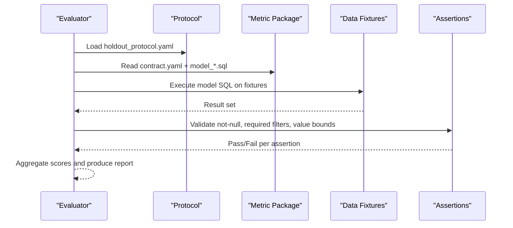
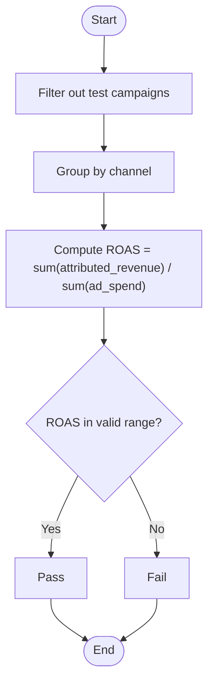
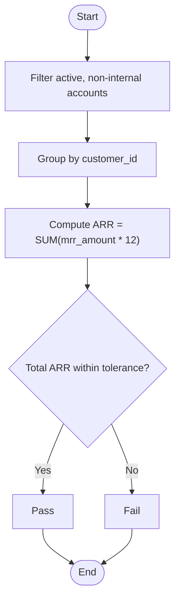
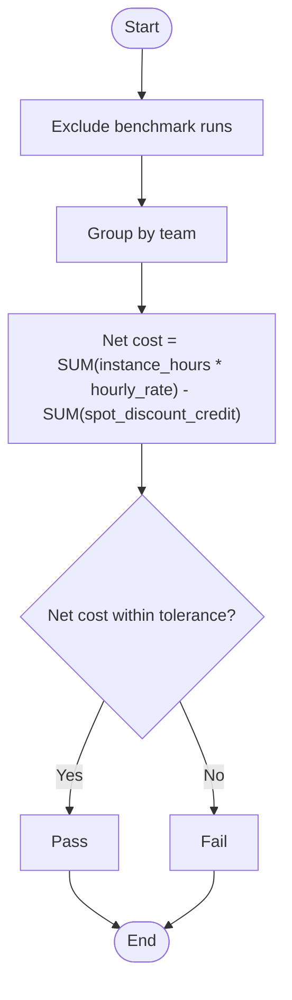
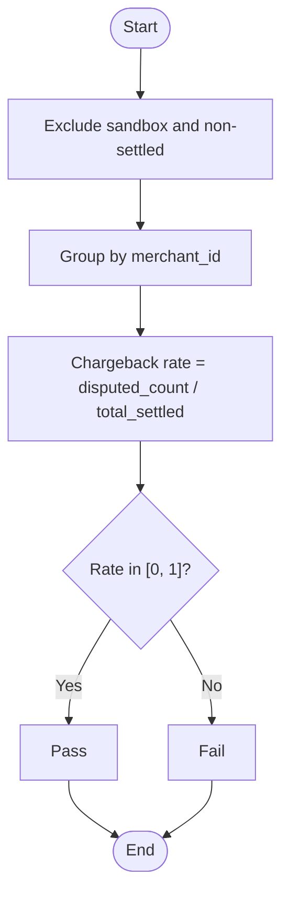
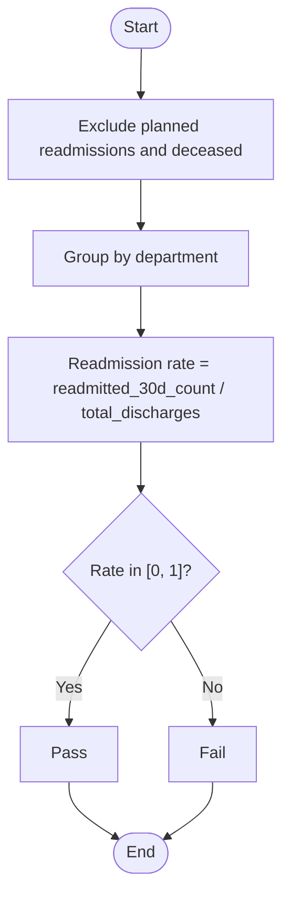
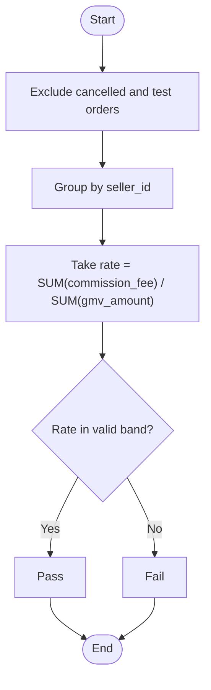
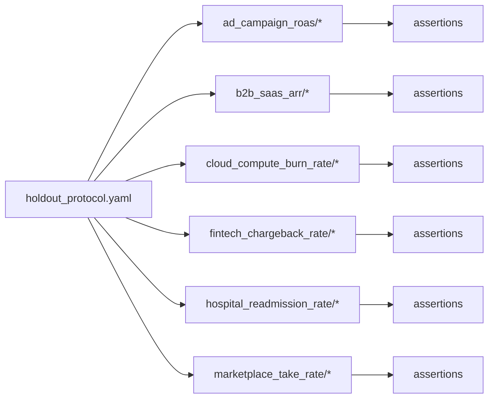

# Holdout Track

<cite>
**Referenced Files in This Document**
- [holdout_protocol.yaml](file://benchmark_corpus/holdout/holdout_protocol.yaml)
- [ad_campaign_roas_contract.yaml](file://benchmark_corpus/holdout/ad_campaign_roas/contract.yaml)
- [ad_campaign_roas_model.sql](file://benchmark_corpus/holdout/ad_campaign_roas/model_ad_campaign_roas.sql)
- [ad_campaign_roas_assertions.yaml](file://benchmark_corpus/holdout/ad_campaign_roas/semantic_assertions.yaml)
- [b2b_saas_arr_contract.yaml](file://benchmark_corpus/holdout/b2b_saas_arr/contract.yaml)
- [b2b_saas_arr_model.sql](file://benchmark_corpus/holdout/b2b_saas_arr/model_b2b_saas_arr.sql)
- [b2b_saas_arr_assertions.yaml](file://benchmark_corpus/holdout/b2b_saas_arr/semantic_assertions.yaml)
- [cloud_compute_burn_rate_contract.yaml](file://benchmark_corpus/holdout/cloud_compute_burn_rate/contract.yaml)
- [cloud_compute_burn_rate_model.sql](file://benchmark_corpus/holdout/cloud_compute_burn_rate/model_cloud_compute_burn_rate.sql)
- [cloud_compute_burn_rate_assertions.yaml](file://benchmark_corpus/holdout/cloud_compute_burn_rate/semantic_assertions.yaml)
- [fintech_chargeback_rate_contract.yaml](file://benchmark_corpus/holdout/fintech_chargeback_rate/contract.yaml)
- [fintech_chargeback_rate_model.sql](file://benchmark_corpus/holdout/fintech_chargeback_rate/model_fintech_chargeback_rate.sql)
- [fintech_chargeback_rate_assertions.yaml](file://benchmark_corpus/holdout/fintech_chargeback_rate/semantic_assertions.yaml)
- [hospital_readmission_rate_contract.yaml](file://benchmark_corpus/holdout/hospital_readmission_rate/contract.yaml)
- [hospital_readmission_rate_model.sql](file://benchmark_corpus/holdout/hospital_readmission_rate/model_hospital_readmission_rate.sql)
- [hospital_readmission_rate_assertions.yaml](file://benchmark_corpus/holdout/hospital_readmission_rate/semantic_assertions.yaml)
- [marketplace_take_rate_contract.yaml](file://benchmark_corpus/holdout/marketplace_take_rate/contract.yaml)
- [marketplace_take_rate_model.sql](file://benchmark_corpus/holdout/marketplace_take_rate/model_marketplace_take_rate.sql)
- [marketplace_take_rate_assertions.yaml](file://benchmark_corpus/holdout/marketplace_take_rate/semantic_assertions.yaml)
</cite>

## Table of Contents
1. Introduction
2. Project Structure
3. Core Components
4. Architecture Overview
5. Detailed Component Analysis
6. Dependency Analysis
7. Performance Considerations
8. Troubleshooting Guide
9. Conclusion

## Introduction
This document describes the frozen holdout track used for final agent evaluation. It contains six business metrics that are intentionally reserved and immutable to ensure reproducible, production-grade assessment. The holdout track is separated from the development track to prevent leakage and to provide a stable benchmark surface for validating agent capabilities across diverse domains: performance marketing, finance/SaaS, FinOps, risk/compliance, clinical quality, and marketplace operations.

The freeze protocol pins the corpus version, commit, and tag so that every evaluation run uses the exact same definitions, data, and assertions. Strict evaluation criteria and scoring methodology are enforced via semantic assertions and contract invariants defined per metric.

## Project Structure
The holdout track is organized as one directory per metric. Each metric includes:
- A contract defining the metric name, owner, grain, population filters, required dimensions, aggregation rules, units, and canonical SQL
- A model SQL file implementing the metric computation
- A semantic assertions file specifying validation checks (e.g., not-null, required population filters, value ranges or expected values with tolerance)
- Data fixtures (CSV files) providing the source tables used by the models

```mermaid
graph TB
subgraph "Holdout Corpus"
H["holdout_protocol.yaml"]
A["ad_campaign_roas/"]
B["b2b_saas_arr/"]
C["cloud_compute_burn_rate/"]
D["fintech_chargeback_rate/"]
E["hospital_readmission_rate/"]
F["marketplace_take_rate/"]
end
subgraph "Metric Package"
A --> A1["contract.yaml"]
A --> A2["model_*.sql"]
A --> A3["semantic_assertions.yaml"]
A --> A4["data/*.csv"]
B --> B1["contract.yaml"]
B --> B2["model_*.sql"]
B --> B3["semantic_assertions.yaml"]
B --> B4["data/*.csv"]
C --> C1["contract.yaml"]
C --> C2["model_*.sql"]
C --> C3["semantic_assertions.yaml"]
C --> C4["data/*.csv"]
D --> D1["contract.yaml"]
D --> D2["model_*.sql"]
D --> D3["semantic_assertions.yaml"]
D --> D4["data/*.csv"]
E --> E1["contract.yaml"]
E --> E2["model_*.sql"]
E --> E3["semantic_assertions.yaml"]
E --> E4["data/*.csv"]
F --> F1["contract.yaml"]
F --> F2["model_*.sql"]
F --> F3["semantic_assertions.yaml"]
F --> F4["data/*.csv"]
end
H --> A
H --> B
H --> C
H --> D
H --> E
H --> F
```

**Diagram sources**
- [holdout_protocol.yaml:1-11](file://benchmark_corpus/holdout/holdout_protocol.yaml#L1-L11)
- [ad_campaign_roas_contract.yaml:1-14](file://benchmark_corpus/holdout/ad_campaign_roas/contract.yaml#L1-L14)
- [ad_campaign_roas_model.sql:1-6](file://benchmark_corpus/holdout/ad_campaign_roas/model_ad_campaign_roas.sql#L1-L6)
- [ad_campaign_roas_assertions.yaml:1-11](file://benchmark_corpus/holdout/ad_campaign_roas/semantic_assertions.yaml#L1-L11)

**Section sources**
- [holdout_protocol.yaml:1-11](file://benchmark_corpus/holdout/holdout_protocol.yaml#L1-L11)

## Core Components
Each holdout metric is a self-contained component composed of three artifacts:
- Contract: declares semantics (grain, population filters, required dimensions, aggregation, units) and canonical SQL
- Model: implements the metric computation over the provided fixtures
- Assertions: enforce correctness through not-null checks, required population filters, and value bounds or expected values with tolerances

Evaluation enforces:
- Population invariants must be satisfied before computing the metric
- Required dimensions must be present at the output grain
- Output values must satisfy declared ranges or expected values within tolerance
- All rows must be non-null on key columns

These constraints ensure agents cannot “game” results by altering populations, aggregations, or rounding behavior beyond allowed tolerances.

**Section sources**
- [ad_campaign_roas_contract.yaml:1-14](file://benchmark_corpus/holdout/ad_campaign_roas/contract.yaml#L1-L14)
- [b2b_saas_arr_contract.yaml:1-20](file://benchmark_corpus/holdout/b2b_saas_arr/contract.yaml#L1-L20)
- [cloud_compute_burn_rate_contract.yaml:1-20](file://benchmark_corpus/holdout/cloud_compute_burn_rate/contract.yaml#L1-L20)
- [fintech_chargeback_rate_contract.yaml:1-16](file://benchmark_corpus/holdout/fintech_chargeback_rate/contract.yaml#L1-L16)
- [hospital_readmission_rate_contract.yaml:1-17](file://benchmark_corpus/holdout/hospital_readmission_rate/contract.yaml#L1-L17)
- [marketplace_take_rate_contract.yaml:1-16](file://benchmark_corpus/holdout/marketplace_take_rate/contract.yaml#L1-L16)

## Architecture Overview
The holdout evaluation pipeline reads the frozen protocol, loads each metric’s contract, executes the model against the fixtures, and validates outputs using semantic assertions. Results are aggregated into a scorecard that reflects pass/fail status and numeric accuracy where applicable.

**Diagram sources**
- [holdout_protocol.yaml:1-11](file://benchmark_corpus/holdout/holdout_protocol.yaml#L1-L11)
- [ad_campaign_roas_model.sql:1-6](file://benchmark_corpus/holdout/ad_campaign_roas/model_ad_campaign_roas.sql#L1-L6)
- [ad_campaign_roas_assertions.yaml:1-11](file://benchmark_corpus/holdout/ad_campaign_roas/semantic_assertions.yaml#L1-L11)

## Detailed Component Analysis

### Ad Campaign ROAS
- Business meaning: Measures return on ad spend by channel using attributed revenue relative to ad spend.
- Grain and ownership: Channel-level metric owned by performance marketing.
- Population and dimensions: Excludes test campaigns; groups by channel.
- Computation: Aggregates attributed revenue and ad spend per channel and computes the ratio.
- Validation: Ensures both channel and roas are non-null and that roas falls within a realistic range.

**Diagram sources**
- [ad_campaign_roas_contract.yaml:1-14](file://benchmark_corpus/holdout/ad_campaign_roas/contract.yaml#L1-L14)
- [ad_campaign_roas_model.sql:1-6](file://benchmark_corpus/holdout/ad_campaign_roas/model_ad_campaign_roas.sql#L1-L6)
- [ad_campaign_roas_assertions.yaml:1-11](file://benchmark_corpus/holdout/ad_campaign_roas/semantic_assertions.yaml#L1-L11)

**Section sources**
- [ad_campaign_roas_contract.yaml:1-14](file://benchmark_corpus/holdout/ad_campaign_roas/contract.yaml#L1-L14)
- [ad_campaign_roas_model.sql:1-6](file://benchmark_corpus/holdout/ad_campaign_roas/model_ad_campaign_roas.sql#L1-L6)
- [ad_campaign_roas_assertions.yaml:1-11](file://benchmark_corpus/holdout/ad_campaign_roas/semantic_assertions.yaml#L1-L11)

### B2B SaaS ARR
- Business meaning: Normalizes annual recurring revenue across active enterprise subscriptions.
- Grain and ownership: Customer-level metric owned by finance/revops.
- Population and dimensions: Includes only active, non-internal accounts; groups by customer_id; aggregates using SUM.
- Computation: Multiplies monthly recurring amount by 12 and sums per customer.
- Validation: Enforces not-null on keys, required population filters, and an expected total ARR within a specified tolerance.

**Diagram sources**
- [b2b_saas_arr_contract.yaml:1-20](file://benchmark_corpus/holdout/b2b_saas_arr/contract.yaml#L1-L20)
- [b2b_saas_arr_model.sql:1-6](file://benchmark_corpus/holdout/b2b_saas_arr/model_b2b_saas_arr.sql#L1-L6)
- [b2b_saas_arr_assertions.yaml:1-17](file://benchmark_corpus/holdout/b2b_saas_arr/semantic_assertions.yaml#L1-L17)

**Section sources**
- [b2b_saas_arr_contract.yaml:1-20](file://benchmark_corpus/holdout/b2b_saas_arr/contract.yaml#L1-L20)
- [b2b_saas_arr_model.sql:1-6](file://benchmark_corpus/holdout/b2b_saas_arr/model_b2b_saas_arr.sql#L1-L6)
- [b2b_saas_arr_assertions.yaml:1-17](file://benchmark_corpus/holdout/b2b_saas_arr/semantic_assertions.yaml#L1-L17)

### Cloud Compute Burn Rate
- Business meaning: Net compute cost per team after accounting for spot instance credits.
- Grain and ownership: Team-level metric owned by FinOps.
- Population and dimensions: Excludes benchmark runs; groups by team; positive and negative components are explicitly declared.
- Computation: Computes net cost as instance hours times hourly rate minus spot discount credits.
- Validation: Ensures not-null on team and net cost, and verifies the aggregate net cost within tolerance.

**Diagram sources**
- [cloud_compute_burn_rate_contract.yaml:1-20](file://benchmark_corpus/holdout/cloud_compute_burn_rate/contract.yaml#L1-L20)
- [cloud_compute_burn_rate_model.sql:1-6](file://benchmark_corpus/holdout/cloud_compute_burn_rate/model_cloud_compute_burn_rate.sql#L1-L6)
- [cloud_compute_burn_rate_assertions.yaml:1-11](file://benchmark_corpus/holdout/cloud_compute_burn_rate/semantic_assertions.yaml#L1-L11)

**Section sources**
- [cloud_compute_burn_rate_contract.yaml:1-20](file://benchmark_corpus/holdout/cloud_compute_burn_rate/contract.yaml#L1-L20)
- [cloud_compute_burn_rate_model.sql:1-6](file://benchmark_corpus/holdout/cloud_compute_burn_rate/model_cloud_compute_burn_rate.sql#L1-L6)
- [cloud_compute_burn_rate_assertions.yaml:1-11](file://benchmark_corpus/holdout/cloud_compute_burn_rate/semantic_assertions.yaml#L1-L11)

### Fintech Chargeback Rate
- Business meaning: Proportion of settled transactions flagged as disputed or fraudulent per merchant.
- Grain and ownership: Merchant-level metric owned by risk/compliance.
- Population and dimensions: Excludes sandbox and non-settled payments; groups by merchant_id.
- Computation: Ratio of disputed count to total settled transactions per merchant.
- Validation: Ensures not-null on merchant_id and chargeback_rate, enforces required population filters, and constrains rate to [0, 1].

**Diagram sources**
- [fintech_chargeback_rate_contract.yaml:1-16](file://benchmark_corpus/holdout/fintech_chargeback_rate/contract.yaml#L1-L16)
- [fintech_chargeback_rate_model.sql:1-6](file://benchmark_corpus/holdout/fintech_chargeback_rate/model_fintech_chargeback_rate.sql#L1-L6)
- [fintech_chargeback_rate_assertions.yaml:1-15](file://benchmark_corpus/holdout/fintech_chargeback_rate/semantic_assertions.yaml#L1-L15)

**Section sources**
- [fintech_chargeback_rate_contract.yaml:1-16](file://benchmark_corpus/holdout/fintech_chargeback_rate/contract.yaml#L1-L16)
- [fintech_chargeback_rate_model.sql:1-6](file://benchmark_corpus/holdout/fintech_chargeback_rate/model_fintech_chargeback_rate.sql#L1-L6)
- [fintech_chargeback_rate_assertions.yaml:1-15](file://benchmark_corpus/holdout/fintech_chargeback_rate/semantic_assertions.yaml#L1-L15)

### Hospital Readmission Rate
- Business meaning: Percentage of discharged inpatients readmitted within 30 days, excluding planned readmissions and deceased patients.
- Grain and ownership: Department-level metric owned by clinical quality.
- Population and dimensions: Excludes planned readmissions and deceased patients; groups by department.
- Computation: Ratio of 30-day readmissions to total discharges per department.
- Validation: Ensures not-null on department and readmission_rate, and constrains rate to [0, 1].

**Diagram sources**
- [hospital_readmission_rate_contract.yaml:1-17](file://benchmark_corpus/holdout/hospital_readmission_rate/contract.yaml#L1-L17)
- [hospital_readmission_rate_model.sql:1-6](file://benchmark_corpus/holdout/hospital_readmission_rate/model_hospital_readmission_rate.sql#L1-L6)
- [hospital_readmission_rate_assertions.yaml:1-11](file://benchmark_corpus/holdout/hospital_readmission_rate/semantic_assertions.yaml#L1-L11)

**Section sources**
- [hospital_readmission_rate_contract.yaml:1-17](file://benchmark_corpus/holdout/hospital_readmission_rate/contract.yaml#L1-L17)
- [hospital_readmission_rate_model.sql:1-6](file://benchmark_corpus/holdout/hospital_readmission_rate/model_hospital_readmission_rate.sql#L1-L6)
- [hospital_readmission_rate_assertions.yaml:1-11](file://benchmark_corpus/holdout/hospital_readmission_rate/semantic_assertions.yaml#L1-L11)

### Marketplace Take Rate
- Business meaning: Platform commission revenue as a proportion of Gross Merchandise Value per seller.
- Grain and ownership: Seller-level metric owned by marketplace operations.
- Population and dimensions: Excludes cancelled and test orders; groups by seller_id.
- Computation: Ratio of commission fees to GMV per seller.
- Validation: Ensures not-null on seller_id and take_rate, and constrains rate to a realistic band.

**Diagram sources**
- [marketplace_take_rate_contract.yaml:1-16](file://benchmark_corpus/holdout/marketplace_take_rate/contract.yaml#L1-L16)
- [marketplace_take_rate_model.sql:1-6](file://benchmark_corpus/holdout/marketplace_take_rate/model_marketplace_take_rate.sql#L1-L6)
- [marketplace_take_rate_assertions.yaml:1-11](file://benchmark_corpus/holdout/marketplace_take_rate/semantic_assertions.yaml#L1-L11)

**Section sources**
- [marketplace_take_rate_contract.yaml:1-16](file://benchmark_corpus/holdout/marketplace_take_rate/contract.yaml#L1-L16)
- [marketplace_take_rate_model.sql:1-6](file://benchmark_corpus/holdout/marketplace_take_rate/model_marketplace_take_rate.sql#L1-L6)
- [marketplace_take_rate_assertions.yaml:1-11](file://benchmark_corpus/holdout/marketplace_take_rate/semantic_assertions.yaml#L1-L11)

## Dependency Analysis
Each metric depends on:
- The frozen protocol to guarantee reproducibility
- Its contract to define population, grain, and aggregation rules
- Its model SQL to compute the metric
- Its semantic assertions to validate correctness

**Diagram sources**
- [holdout_protocol.yaml:1-11](file://benchmark_corpus/holdout/holdout_protocol.yaml#L1-L11)
- [ad_campaign_roas_assertions.yaml:1-11](file://benchmark_corpus/holdout/ad_campaign_roas/semantic_assertions.yaml#L1-L11)
- [b2b_saas_arr_assertions.yaml:1-17](file://benchmark_corpus/holdout/b2b_saas_arr/semantic_assertions.yaml#L1-L17)
- [cloud_compute_burn_rate_assertions.yaml:1-11](file://benchmark_corpus/holdout/cloud_compute_burn_rate/semantic_assertions.yaml#L1-L11)
- [fintech_chargeback_rate_assertions.yaml:1-15](file://benchmark_corpus/holdout/fintech_chargeback_rate/semantic_assertions.yaml#L1-L15)
- [hospital_readmission_rate_assertions.yaml:1-11](file://benchmark_corpus/holdout/hospital_readmission_rate/semantic_assertions.yaml#L1-L11)
- [marketplace_take_rate_assertions.yaml:1-11](file://benchmark_corpus/holdout/marketplace_take_rate/semantic_assertions.yaml#L1-L11)

**Section sources**
- [holdout_protocol.yaml:1-11](file://benchmark_corpus/holdout/holdout_protocol.yaml#L1-L11)

## Performance Considerations
- Keep models efficient by filtering early (population constraints) and grouping only on required dimensions.
- Use integer arithmetic where appropriate and cast to floating point only for ratios to avoid truncation.
- Avoid unnecessary joins; prefer direct aggregations on fact tables when possible.
- Ensure fixtures are sized appropriately for testing while remaining representative of production distributions.

[No sources needed since this section provides general guidance]

## Troubleshooting Guide
Common failure modes and how to diagnose them:
- Nulls in key columns: Verify not-null assertions and confirm filters exclude invalid records.
- Wrong population: Confirm required filters match the contract (e.g., sandbox exclusion, settlement status).
- Out-of-range values: Check ratio computations and denominators; ensure no division by zero and correct casting.
- Expected value mismatches: For metrics with expected totals (e.g., ARR), verify aggregation logic and tolerance settings.

Remediation steps:
- Re-run the model against fixtures and inspect intermediate counts to locate filter misalignment.
- Compare computed aggregates with fixture summaries to identify discrepancies.
- Adjust model logic to align with contract-defined grain and aggregation rules.

**Section sources**
- [ad_campaign_roas_assertions.yaml:1-11](file://benchmark_corpus/holdout/ad_campaign_roas/semantic_assertions.yaml#L1-L11)
- [b2b_saas_arr_assertions.yaml:1-17](file://benchmark_corpus/holdout/b2b_saas_arr/semantic_assertions.yaml#L1-L17)
- [cloud_compute_burn_rate_assertions.yaml:1-11](file://benchmark_corpus/holdout/cloud_compute_burn_rate/semantic_assertions.yaml#L1-L11)
- [fintech_chargeback_rate_assertions.yaml:1-15](file://benchmark_corpus/holdout/fintech_chargeback_rate/semantic_assertions.yaml#L1-L15)
- [hospital_readmission_rate_assertions.yaml:1-11](file://benchmark_corpus/holdout/hospital_readmission_rate/semantic_assertions.yaml#L1-L11)
- [marketplace_take_rate_assertions.yaml:1-11](file://benchmark_corpus/holdout/marketplace_take_rate/semantic_assertions.yaml#L1-L11)

## Conclusion
The frozen holdout track provides a stable, reproducible benchmark surface for final agent evaluation across six distinct business domains. By pinning the corpus via the freeze protocol and enforcing strict contracts and semantic assertions, it ensures that agent performance is measured consistently and comparably over time. Results should be interpreted as a comprehensive capability assessment: passing all metrics indicates robust understanding of population scoping, correct aggregation, and adherence to domain-specific constraints.

[No sources needed since this section summarizes without analyzing specific files]