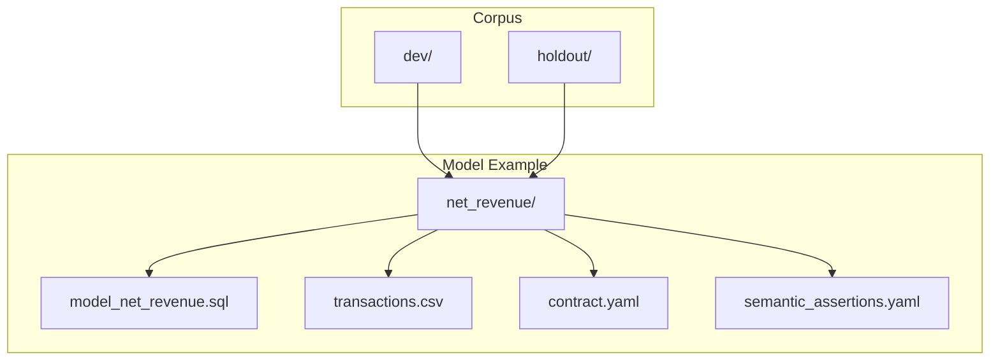
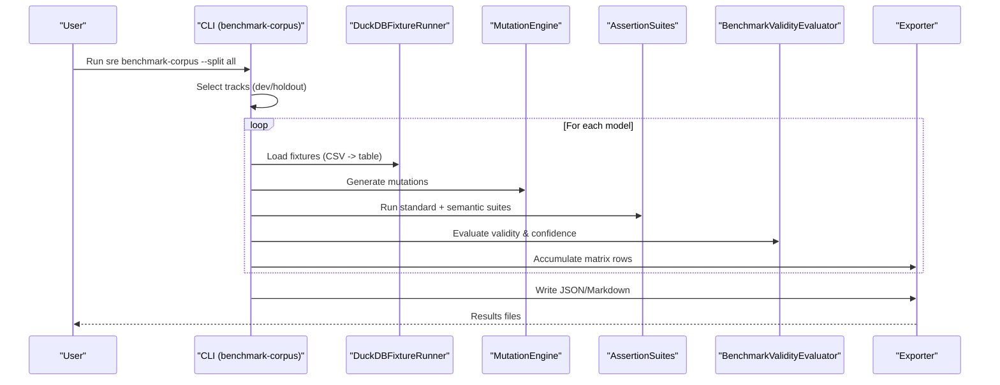
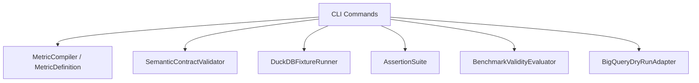

# Benchmarking Commands

<cite>
**Referenced Files in This Document**
- [cli.py](file://semantic_reliability/cli.py)
- [agent_eval.py](file://semantic_reliability/evaluation/agent_eval.py)
- [bigquery.py](file://semantic_reliability/adapters/bigquery.py)
- [validity.py](file://semantic_reliability/harness/validity.py)
- [BENCHMARK_METHODOLOGY.md](file://docs/BENCHMARK_METHODOLOGY.md)
- [contract.yaml](file://benchmark_corpus/dev/net_revenue/contract.yaml)
- [test_benchmark_corpus.py](file://tests/test_benchmark_corpus.py)
- [test_holdout_corpus.py](file://tests/test_holdout_corpus.py)
</cite>

## Table of Contents
1. Introduction
2. Project Structure
3. Core Components
4. Architecture Overview
5. Detailed Component Analysis
6. Dependency Analysis
7. Performance Considerations
8. Troubleshooting Guide
9. Conclusion
10. Appendices

## Introduction
This document provides detailed, practical guidance for three benchmarking CLI commands:
- sre benchmark-corpus: multi-model evaluation across Development and Frozen Holdout tracks with scientific validity assessment and exportable results.
- sre evaluate-agent: agent-generated SQL evaluation against semantic contracts, fixture testing, assertion validation, and verdict reporting.
- sre bq-evaluate: BigQuery dry-run integration with project configuration and semantic contract validation.

It includes corpus navigation, track selection (dev/holdout/all), result interpretation, and comprehensive examples to run benchmarks and interpret outcomes.

## Project Structure
The benchmarking commands operate over a structured corpus under benchmark_corpus with two primary tracks:
- dev: Development models used to design operators and assertions.
- holdout: Frozen holdout models with realistic fixtures to prevent circular benchmarking.

Each model directory typically contains:
- A model SQL file (model_*.sql)
- A test fixture CSV (used as a DuckDB table)
- A semantic contract YAML (contract.yaml) defining business invariants
- A schema or assertions file (schema.yml and/or semantic_assertions.yaml)

**Diagram sources**
- [cli.py:286-331](file://semantic_reliability/cli.py#L286-L331)
- [contract.yaml:1-19](file://benchmark_corpus/dev/net_revenue/contract.yaml#L1-L19)

**Section sources**
- [cli.py:286-331](file://semantic_reliability/cli.py#L286-L331)
- [BENCHMARK_METHODOLOGY.md:74-80](file://docs/BENCHMARK_METHODOLOGY.md#L74-L80)

## Core Components
- sre benchmark-corpus: Orchestrates cross-evaluation across multiple models, runs mutation-based testing, evaluates standard vs semantic assertion suites, assesses scientific validity, and exports results.
- sre evaluate-agent: Evaluates agent-generated SQL against declared metric contracts, optional fixtures, and assertion suites; reports verdicts and risks.
- sre bq-evaluate: Performs BigQuery dry-run validation and semantic contract checks, returning decisions and cost estimates.

Key capabilities:
- Corpus navigation and track selection (dev/holdout/all).
- Multi-model evaluation matrix with standard catch, semantic catch, incremental gain, contract coverage, fixture adequacy, and validity/confidence badges.
- Scientific validity assessment using versioned policy thresholds.
- Result export formats: JSON matrix rows and Markdown report.
- Agent SQL evaluation pipeline: syntax check, contract invariant validation, execution on fixtures, assertion suite validation, risk classification, and verdict.
- BigQuery dry-run integration: AST parsing, contract validation, dry-run API call (or simulated fallback), cost estimation, budget enforcement, and decision engine.

**Section sources**
- [cli.py:286-487](file://semantic_reliability/cli.py#L286-L487)
- [cli.py:489-541](file://semantic_reliability/cli.py#L489-L541)
- [cli.py:706-734](file://semantic_reliability/cli.py#L706-L734)
- [agent_eval.py:35-134](file://semantic_reliability/evaluation/agent_eval.py#L35-L134)
- [bigquery.py:23-178](file://semantic_reliability/adapters/bigquery.py#L23-L178)
- [validity.py:47-127](file://semantic_reliability/harness/validity.py#L47-L127)

## Architecture Overview
The benchmarking workflow integrates several components:
- Corpus loader and track selector choose which models to evaluate.
- For each model:
  - Load SQL, fixtures, contract, and assertions.
  - Generate mutations and run standard and semantic assertion suites.
  - Evaluate scientific validity based on fixture adequacy and contract coverage.
  - Aggregate results into a matrix and export.

Agent evaluation follows a deterministic pipeline:
- Parse SQL and validate against the metric contract.
- Execute on fixtures if provided and run assertions.
- Compute semantic risk and verdict.

BigQuery dry-run evaluation:
- Local AST parse and contract validation.
- Dry-run API call (with mock/simulated fallback).
- Cost estimation and budget enforcement.
- Decision output (ALLOW, REQUIRE_REVIEW, DENY).

**Diagram sources**
- [cli.py:286-487](file://semantic_reliability/cli.py#L286-L487)
- [validity.py:47-127](file://semantic_reliability/harness/validity.py#L47-L127)

## Detailed Component Analysis

### sre benchmark-corpus
Purpose:
- Execute multi-model cross-evaluation across Development and Frozen Holdout tracks.
- Provide a benchmark matrix comparing standard vs semantic assertion suites.
- Assess scientific validity and confidence per model.
- Export machine-readable JSON and Markdown reports.

Corpus structure navigation:
- Tracks are selected via --split: dev, holdout, or all.
- If dev exists, it is included when split is dev or all.
- If holdout exists, it is included when split is holdout or all.
- Fallback to flat corpus if neither subdirectory exists.

Track selection behavior:
- dev: Evaluates models under benchmark_corpus/dev.
- holdout: Evaluates models under benchmark_corpus/holdout.
- all: Evaluates both tracks sequentially.

Multi-model evaluation matrix:
- Columns include: Model/Metric, Mutations (Valid), Standard Catch %, Semantic Catch %, Incremental Gain (%), Contract Coverage (%), Fixture Adequacy (%), Validity & Confidence badge.
- Per model:
  - Loads SQL and first CSV fixture.
  - Audits fixture adequacy.
  - Computes contract coverage from contract.yaml if present.
  - Generates mutations and runs standard and semantic assertion suites.
  - Evaluates scientific validity using thresholds from validity_policy.yaml.
  - Aggregates row data for export.

Scientific validity assessment:
- Uses versioned policy thresholds for fixture adequacy and contract coverage.
- Classifies validity as CONCLUSIVE (HIGH), QUALIFIED (MEDIUM), or INCONCLUSIVE (LOW).
- Reports confidence level alongside validity.

Result export formats:
- JSON: Machine-readable matrix rows written to --json-out path.
- Markdown: Summary table written to --report path.

Error analysis:
- Optional --error-analysis flag prints surviving defect root-cause taxonomy and remediation recommendations.

Examples:
- Run all tracks:
  - sre benchmark-corpus --corpus benchmark_corpus --split all --json-out corpus_results.json --report corpus_matrix.md
- Run development track only:
  - sre benchmark-corpus --corpus benchmark_corpus --split dev --report dev_report.md
- Run frozen holdout track only:
  - sre benchmark-corpus --corpus benchmark_corpus --split holdout --json-out holdout_results.json

Interpretation:
- Standard Catch %: Percentage of valid defects detected by standard structural tests.
- Semantic Catch %: Percentage of valid defects detected by semantic assertions.
- Incremental Gain: Net improvement of semantic assertions over standard tests.
- Contract Coverage: Extent to which metric invariants are declared.
- Fixture Adequacy: Empirical contrast quality of fixtures.
- Validity & Confidence: Whether results are conclusive, qualified, or inconclusive based on policy thresholds.

**Section sources**
- [cli.py:286-487](file://semantic_reliability/cli.py#L286-L487)
- [validity.py:47-127](file://semantic_reliability/harness/validity.py#L47-L127)
- [BENCHMARK_METHODOLOGY.md:43-70](file://docs/BENCHMARK_METHODOLOGY.md#L43-L70)
- [test_benchmark_corpus.py:9-27](file://tests/test_benchmark_corpus.py#L9-L27)
- [test_holdout_corpus.py:9-22](file://tests/test_holdout_corpus.py#L9-L22)

### sre evaluate-agent
Purpose:
- Evaluate agent-generated SQL against declared business semantic contracts and optional assertion suites.
- Perform fixture-based execution and assertion validation.
- Report verdicts, semantic risk, violations, and unsupported assumptions.

Evaluation pipeline:
- Syntax and transpilation check using SQLGlot.
- Contract invariant validation against MetricDefinition.
- Execution on fixtures (if provided) and assertion suite validation.
- Risk determination and verdict assignment.

Verdicts and risk levels:
- Verdicts include ACCEPTED_SEMANTICALLY_COMPLIANT, REJECTED_SYNTAX_ERROR, REJECTED_EXECUTION_FAILURE, REJECTED_SEMANTIC_DEFECT_DETECTED, SILENT_SEMANTIC_BREACH_SURVIVED_TESTS.
- Semantic risk levels: CRITICAL, HIGH, MEDIUM, LOW.

Fixture testing:
- If a fixture CSV is provided, SQL executes against DuckDB with the fixture loaded as a table.
- Assertion failures are collected and reported.

Contract compliance:
- Violations are derived from contract invariants (population filters, grain, aggregation components).
- Unsupported assumptions are flagged when agents omit required filters or change grain/arithmetic.

Examples:
- Evaluate agent SQL with contract and fixture:
  - sre evaluate-agent --sql agent_generated.sql --contract benchmark_corpus/dev/net_revenue/contract.yaml --fixture benchmark_corpus/dev/net_revenue/transactions.csv --assertions benchmark_corpus/dev/net_revenue/semantic_assertions.yaml
- Evaluate without fixture (contract-only):
  - sre evaluate-agent --sql agent_generated.sql --contract benchmark_corpus/dev/net_revenue/contract.yaml

Interpretation:
- execution_success: Whether SQL executed successfully on fixtures.
- contract_compliant: Whether SQL satisfies declared invariants.
- violations: List of contract invariant breaches.
- assertion_failures: Failures from assertion suite.
- unsupported_assumptions: Agent assumptions not supported by contract.
- semantic_risk: Risk level based on execution and contract status.
- verdict: Final decision for the agent’s SQL.

**Section sources**
- [cli.py:489-541](file://semantic_reliability/cli.py#L489-L541)
- [agent_eval.py:35-134](file://semantic_reliability/evaluation/agent_eval.py#L35-L134)
- [contract.yaml:1-19](file://benchmark_corpus/dev/net_revenue/contract.yaml#L1-L19)

### sre bq-evaluate
Purpose:
- Evaluate SQL against BigQuery dry-run and semantic contract.
- Integrate project configuration and enforce budgets.
- Return decisions and cost estimates.

Integration points:
- BigQueryDryRunAdapter performs local AST parsing and contract validation before calling BigQuery dry-run API.
- Supports optional project_id and credentials; falls back to simulated dry-run if client unavailable.
- Applies configurable pricing policy and byte budget limits.

Project configuration:
- project_id: Optional GCP Project ID passed via --project-id.
- Policy fields (internal): billing_unit, price_per_tib_usd, monthly_free_tib, region, maximum_bytes_billed, require_project_id, allow_execution.

Semantic contract validation:
- Uses MetricDefinition from contract.yaml to validate invariants locally before dry-run.

Decision engine:
- ALLOW: Query passes contract and budget constraints.
- REQUIRE_REVIEW: Contract non-compliant but no fatal errors.
- DENY: Parse failure, dry-run failure, or budget exceeded.

Examples:
- Evaluate SQL with contract and project:
  - sre bq-evaluate --sql agent_generated.sql --contract benchmark_corpus/dev/net_revenue/contract.yaml --project-id my-gcp-project
- Evaluate inline SQL string:
  - sre bq-evaluate --sql "SELECT ... FROM ..." --contract benchmark_corpus/dev/net_revenue/contract.yaml

Interpretation:
- execution_mode: dry_run, dry_run_failed, parse_failed, budget_exceeded, policy_denied, dry_run_simulated.
- bytes_processed and cost_estimate: Estimated compute usage and cost.
- contract_compliant and violations: Contract validation outcome.
- decision: Final go/no-go decision for execution.

**Section sources**
- [cli.py:706-734](file://semantic_reliability/cli.py#L706-L734)
- [bigquery.py:23-178](file://semantic_reliability/adapters/bigquery.py#L23-L178)
- [contract.yaml:1-19](file://benchmark_corpus/dev/net_revenue/contract.yaml#L1-L19)

## Dependency Analysis
The three commands share common dependencies:
- MetricCompiler and MetricDefinition for contract parsing.
- SemanticContractValidator for invariant checks.
- DuckDBFixtureRunner for fixture-based execution.
- AssertionSuite for running structural and semantic assertions.
- BenchmarkValidityEvaluator for scientific validity assessment.

**Diagram sources**
- [cli.py:286-487](file://semantic_reliability/cli.py#L286-L487)
- [cli.py:489-541](file://semantic_reliability/cli.py#L489-L541)
- [cli.py:706-734](file://semantic_reliability/cli.py#L706-L734)
- [agent_eval.py:35-134](file://semantic_reliability/evaluation/agent_eval.py#L35-L134)
- [bigquery.py:23-178](file://semantic_reliability/adapters/bigquery.py#L23-L178)
- [validity.py:47-127](file://semantic_reliability/harness/validity.py#L47-L127)

**Section sources**
- [cli.py:286-734](file://semantic_reliability/cli.py#L286-L734)

## Performance Considerations
- Mutation generation scales with SQL complexity; large models may increase runtime.
- Fixture size impacts execution time and memory usage in DuckDB.
- BigQuery dry-run latency depends on network and API availability; simulated mode avoids external calls.
- Budget enforcement prevents excessive scanning; configure maximum_bytes_billed to cap costs.
- Use --split to limit scope (e.g., holdout only) for faster iterations.

[No sources needed since this section provides general guidance]

## Troubleshooting Guide
Common issues and resolutions:
- Missing contract or fixture paths: Ensure --contract and --fixture point to existing files.
- Non-existent corpus tracks: Verify --corpus path and presence of dev/holdout directories.
- BigQuery dry-run failures: Check project_id and credentials; fall back to simulated mode if client unavailable.
- Budget exceeded: Adjust maximum_bytes_billed or optimize SQL to reduce scanned bytes.
- Contract violations: Review invariants in contract.yaml and adjust agent SQL accordingly.
- Assertion failures: Inspect semantic_assertions.yaml and update assertions to match expected semantics.

**Section sources**
- [cli.py:286-734](file://semantic_reliability/cli.py#L286-L734)
- [agent_eval.py:35-134](file://semantic_reliability/evaluation/agent_eval.py#L35-L134)
- [bigquery.py:23-178](file://semantic_reliability/adapters/bigquery.py#L23-L178)

## Conclusion
The benchmarking commands provide a robust framework for evaluating AI-generated SQL against business semantics:
- sre benchmark-corpus offers multi-model evaluation with scientific validity and exportable results.
- sre evaluate-agent ensures agent SQL adheres to contracts and assertions, with clear verdicts and risk levels.
- sre bq-evaluate integrates BigQuery dry-run for pre-execution validation and cost control.

Use these tools to build reliable, contract-grounded analytics pipelines and to measure the effectiveness of semantic assertions over standard structural tests.

[No sources needed since this section summarizes without analyzing specific files]

## Appendices

### Examples Across Corpus Tracks
- Development track:
  - sre benchmark-corpus --corpus benchmark_corpus --split dev --report dev_report.md
- Frozen holdout track:
  - sre benchmark-corpus --corpus benchmark_corpus --split holdout --json-out holdout_results.json
- All tracks:
  - sre benchmark-corpus --corpus benchmark_corpus --split all --json-out corpus_results.json --report corpus_matrix.md

### Interpreting Evaluation Results
- High semantic catch with low standard catch indicates semantic assertions add value.
- Low fixture adequacy or contract coverage reduces validity; improve fixtures and invariants.
- Incremental gain quantifies the benefit of semantic assertions over standard tests.
- BigQuery decision DENY indicates critical issues; REQUIRE_REVIEW suggests review before execution.

**Section sources**
- [cli.py:286-487](file://semantic_reliability/cli.py#L286-L487)
- [cli.py:706-734](file://semantic_reliability/cli.py#L706-L734)
- [BENCHMARK_METHODOLOGY.md:43-70](file://docs/BENCHMARK_METHODOLOGY.md#L43-L70)