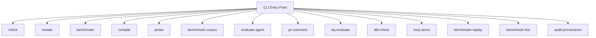
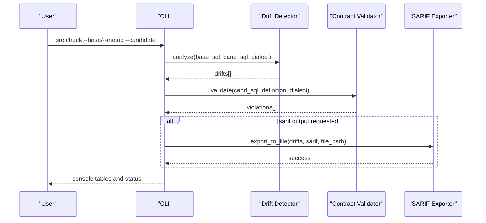
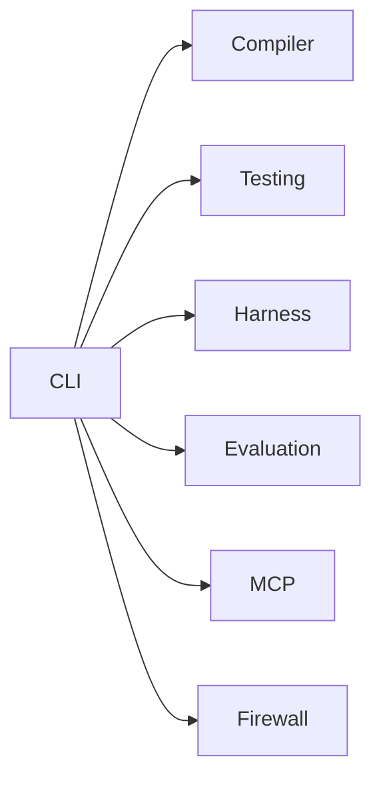

# CLI Reference

<cite>
**Referenced Files in This Document**
- [cli.py](file://semantic_reliability/cli.py)
- [README.md](file://README.md)
- [server.py](file://semantic_reliability/mcp/server.py)
- [net_revenue.yaml](file://examples/metrics/net_revenue.yaml)
- [contract.yaml](file://benchmark_corpus/dev/net_revenue/contract.yaml)
- [docker-compose.yml](file://demo/docker-compose.yml)
- [test_cli.py](file://tests/test_cli.py)
</cite>

## Table of Contents
1. Introduction
2. Project Structure
3. Core Components
4. Architecture Overview
5. Detailed Component Analysis
6. Dependency Analysis
7. Performance Considerations
8. Troubleshooting Guide
9. Conclusion
10. Appendices

## Introduction
This document is a comprehensive CLI reference for the Semantic Reliability Engine (SRE). It covers all available commands with parameter descriptions, usage examples, output formats, configuration options, environment variables, file path specifications, exit codes, error messages, debugging techniques, and integration patterns for CI/CD and automation.

The SRE CLI provides:
- Contract validation and compilation
- Drift detection between baseline and candidate SQL
- Mutation testing and assertion benchmarking
- Live agent evaluation and trajectory replay
- A read-only Model Context Protocol (MCP) server for contract access and validation

## Project Structure
The CLI is implemented as a Click-based command group. Each command is defined as a subcommand under the main entry point. The MCP server command starts a JSON-RPC 2.0 server that exposes tools to list metrics, retrieve contracts, and validate SQL against semantic contracts.

**Diagram sources**
- [cli.py:36-1025](file://semantic_reliability/cli.py#L36-L1025)

**Section sources**
- [cli.py:36-1025](file://semantic_reliability/cli.py#L36-L1025)

## Core Components
- Command group and version option are defined at the CLI entry point.
- Each command registers its own parameters via Click decorators.
- Commands orchestrate underlying modules such as drift detection, mutation engine, assertion suites, DuckDB runner, SARIF exporter, and MCP server.

Key responsibilities:
- check: Compare baseline or metric-defined SQL with candidate SQL; optionally fail on critical drift.
- mutate: Generate AST mutations for a target SQL file and write them to an output directory with a manifest.
- benchmark: Run assertion suite catch rate against injected mutations; optional comparative mode and Markdown report.
- compile: Compile a metric YAML into standard SQL for a target dialect.
- probe: Execute statistical probes against a fixture to detect upstream data reality shifts.
- benchmark-corpus: Multi-model cross-evaluation across development and frozen holdout tracks.
- evaluate-agent: Evaluate agent-generated SQL against contracts and assertions.
- pr-comment: Generate GitHub PR review markdown comment from drift analysis.
- bq-evaluate: Dry-run evaluation against BigQuery and semantic contract.
- dbt-check: Check compiled dbt model for semantic drift against a metric contract.
- mcp-serve: Start SCOS MCP server over stdio with contract registry.
- benchmark-replay: Replay recorded trajectories against active contracts.
- benchmark-live: Run live agent benchmark with paired blind and governed conditions.
- audit-provenance: Mechanically audit external provenance claims.

**Section sources**
- [cli.py:43-132](file://semantic_reliability/cli.py#L43-L132)
- [cli.py:134-172](file://semantic_reliability/cli.py#L134-L172)
- [cli.py:175-283](file://semantic_reliability/cli.py#L175-L283)
- [cli.py:286-486](file://semantic_reliability/cli.py#L286-L486)
- [cli.py:489-540](file://semantic_reliability/cli.py#L489-L540)
- [cli.py:543-568](file://semantic_reliability/cli.py#L543-L568)
- [cli.py:571-585](file://semantic_reliability/cli.py#L571-L585)
- [cli.py:586-629](file://semantic_reliability/cli.py#L586-L629)
- [cli.py:706-734](file://semantic_reliability/cli.py#L706-L734)
- [cli.py:737-786](file://semantic_reliability/cli.py#L737-L786)
- [cli.py:789-808](file://semantic_reliability/cli.py#L789-L808)
- [cli.py:811-849](file://semantic_reliability/cli.py#L811-L849)
- [cli.py:851-949](file://semantic_reliability/cli.py#L851-L949)
- [cli.py:950-1022](file://semantic_reliability/cli.py#L950-L1022)

## Architecture Overview
The CLI orchestrates multiple subsystems:
- Drift detection compares baseline or metric-derived SQL with candidate SQL using AST normalization.
- Mutation engine generates AST-level perturbations to test assertion coverage.
- Assertion suites run against fixtures to measure defect detection rates.
- MCP server exposes contract listing, retrieval, and SQL validation via JSON-RPC 2.0.
- Benchmarking runs live or replayed evaluations comparing blind vs governed agent outputs.

**Diagram sources**
- [cli.py:43-132](file://semantic_reliability/cli.py#L43-L132)

**Section sources**
- [cli.py:43-132](file://semantic_reliability/cli.py#L43-L132)

## Detailed Component Analysis

### sre compile
Compiles a canonical metric definition into standard SQL.

Parameters:
- --metric: Path to metric YAML file (required).
- --target-dialect: Target transpilation dialect (optional).

Usage examples:
- sre compile --metric examples/metrics/net_revenue.yaml
- sre compile --metric benchmark_corpus/dev/net_revenue/contract.yaml --target-dialect snowflake

Output format:
- Console panel showing metric name, owner, grain, and dialect.

Configuration and paths:
- Metric YAML must exist; see example files for structure.

Exit codes:
- 0 on success.

Error messages:
- Missing required --metric will cause Click to print an error and exit non-zero.

Debugging tips:
- Validate YAML schema before running.
- Use --target-dialect to match your warehouse dialect.

**Section sources**
- [cli.py:571-585](file://semantic_reliability/cli.py#L571-L585)
- [net_revenue.yaml:1-22](file://examples/metrics/net_revenue.yaml#L1-L22)
- [contract.yaml:1-19](file://benchmark_corpus/dev/net_revenue/contract.yaml#L1-L19)

### sre check
Detects semantic drift between baseline/metric and candidate SQL.

Parameters:
- --base: Baseline SQL file (alternative to --metric).
- --candidate: Candidate SQL file (required).
- --metric: Ground-truth metric YAML (alternative to --base).
- --dialect: SQL dialect (optional).
- --sarif: Output path for SARIF JSON (optional).
- --fail-on-drift/--no-fail: Exit non-zero if critical drift detected (default false).

Usage examples:
- sre check --base examples/models/fct_net_revenue_baseline.sql --candidate examples/models/fct_net_revenue_drifted.sql
- sre check --metric benchmark_corpus/dev/net_revenue/contract.yaml --candidate examples/models/fct_net_revenue_drifted.sql --fail-on-drift

Output format:
- Console panels and tables summarizing drift anomalies and invariant contract violations.
- Optional SARIF report saved to specified path.

Configuration and paths:
- Provide either --base or --metric; both cannot be omitted.

Exit codes:
- 0 when no drift or when drift severity does not meet failure threshold.
- 1 when --fail-on-drift is enabled and critical/high/fatal drift or contract violations are present.

Error messages:
- If neither --base nor --metric is provided, prints an error and exits non-zero.

Debugging tips:
- Use --dialect to match your warehouse.
- Inspect SARIF output for machine-readable results.

**Section sources**
- [cli.py:43-132](file://semantic_reliability/cli.py#L43-L132)
- [test_cli.py:17-28](file://tests/test_cli.py#L17-L28)

### sre mutate
Generates AST chaos mutations for data pipeline testing.

Parameters:
- --sql: Target SQL file to mutate (required).
- --output-dir: Directory to save mutated SQL files (default mutations_output).
- --dialect: SQL dialect (optional).

Usage examples:
- sre mutate --sql examples/models/fct_net_revenue_baseline.sql --output-dir ./mutations

Output format:
- Console panel indicating number of mutations generated.
- Individual mutation lines printed per injection.
- Manifest written to mutations_manifest.json describing each mutation.

Configuration and paths:
- Output directory is created if it does not exist.

Exit codes:
- 0 on success.

Error messages:
- Missing required --sql will cause Click to print an error and exit non-zero.

Debugging tips:
- Review mutations_manifest.json to map mutation IDs to types and categories.

**Section sources**
- [cli.py:134-172](file://semantic_reliability/cli.py#L134-L172)
- [test_cli.py:31-37](file://tests/test_cli.py#L31-L37)

### sre benchmark
Runs assertion suite catch rate against injected AST mutations. Supports comparative mode and Markdown reports.

Parameters:
- --sql: Target SQL model to evaluate (required).
- --assertions: YAML assertions suite file (optional; defaults to standard structural suite if omitted).
- --compare/--no-compare: Head-to-head comparison between standard dbt checks and semantic suite (default false).
- --dialect: SQL dialect (optional).
- --report: Optional Markdown report output file (optional).

Usage examples:
- sre benchmark --sql examples/models/fct_net_revenue_baseline.sql --report ./benchmark_report.md
- sre benchmark --sql examples/models/fct_net_revenue_baseline.sql --compare --assertions examples/assertions/semantic_assertions.yaml

Output format:
- Console panel summarizing total mutations, equivalent mutations, valid defects, detected by assertions, surviving defects, and effective catch score.
- Table of evaluated mutations with classification, row delta, variance percentage, and summary.
- Optional Markdown report saved to specified path.

Configuration and paths:
- Assertions YAML must exist if provided.

Exit codes:
- 0 on success.

Error messages:
- Missing required --sql will cause Click to print an error and exit non-zero.

Debugging tips:
- Use --compare to identify gaps in standard tests versus semantic assertions.
- Save Markdown report for historical tracking.

**Section sources**
- [cli.py:175-283](file://semantic_reliability/cli.py#L175-L283)
- [test_cli.py:40-46](file://tests/test_cli.py#L40-L46)

### sre benchmark-corpus
Executes multi-model cross-evaluation across Development and Frozen Holdout benchmark tracks.

Parameters:
- --corpus: Path to benchmark corpus directory (default benchmark_corpus).
- --split: Corpus track to evaluate: all, dev, holdout (default all).
- --error-analysis: Display surviving defect root-cause error analysis (flag).
- --json-out: Machine-readable JSON output path (optional).
- --report: Markdown report output path (optional).

Usage examples:
- sre benchmark-corpus --corpus benchmark_corpus --split dev
- sre benchmark-corpus --corpus benchmark_corpus --split holdout --error-analysis --json-out corpus_results.json --report corpus_matrix.md

Output format:
- Console panel with corpus root, track selection, freeze integrity status, and scientific policy.
- Per-track matrix table including valid mutations, standard catch, semantic catch, incremental gain, contract coverage, fixture adequacy, and validity & confidence.
- Optional error analysis table with taxonomy and remediation recommendations.
- Optional JSON and Markdown reports.

Configuration and paths:
- Corpus directory should contain model directories with SQL and CSV fixtures.

Exit codes:
- 0 on success.

Error messages:
- Missing or invalid corpus path will cause Click to print an error and exit non-zero.

Debugging tips:
- Use --split to focus on specific tracks.
- Enable --error-analysis to understand surviving defects.

**Section sources**
- [cli.py:286-486](file://semantic_reliability/cli.py#L286-L486)
- [test_benchmark_corpus.py:9-27](file://tests/test_benchmark_corpus.py#L9-L27)

### sre evaluate-agent
Evaluates agent-generated SQL against declared business semantic contracts and assertion test suites.

Parameters:
- --sql: Path to agent-generated SQL file (required).
- --contract: Path to semantic metric contract YAML (required).
- --fixture: Path to test fixture CSV (optional).
- --assertions: Path to semantic assertions YAML (optional).

Usage examples:
- sre evaluate-agent --sql agent_output.sql --contract benchmark_corpus/dev/net_revenue/contract.yaml --fixture benchmark_corpus/dev/net_revenue/transactions.csv

Output format:
- Console panel showing metric ID, verdict, semantic risk, execution success, row count, and contract compliance.
- Lists of contract invariant violations, assertion failures, and unsupported assumptions if present.

Configuration and paths:
- Contract YAML must exist; fixture and assertions are optional.

Exit codes:
- 0 on success.

Error messages:
- Missing required --sql or --contract will cause Click to print an error and exit non-zero.

Debugging tips:
- Provide assertions to strengthen evaluation beyond contract compliance.
- Use fixtures to ensure execution context matches expected data.

**Section sources**
- [cli.py:489-540](file://semantic_reliability/cli.py#L489-L540)

### sre pr-comment
Generates GitHub PR review bot markdown comment from drift analysis.

Parameters:
- --base: Baseline SQL file (alternative to --metric).
- --candidate: Candidate / PR SQL file (required).
- --metric: Metric YAML file (alternative to --base).
- --output: Output markdown path (default pr_comment.md).

Usage examples:
- sre pr-comment --base examples/models/fct_net_revenue_baseline.sql --candidate examples/models/fct_net_revenue_drifted.sql --output pr_review.md

Output format:
- Markdown file containing drift alert summaries suitable for GitHub PR comments.

Configuration and paths:
- Provide either --base or --metric; both cannot be omitted.

Exit codes:
- 0 on success.

Error messages:
- If neither --base nor --metric is provided, prints an error and exits non-zero.

Debugging tips:
- Use this command in CI to automatically generate PR comments based on drift detection.

**Section sources**
- [cli.py:543-568](file://semantic_reliability/cli.py#L543-L568)
- [test_cli.py:49-55](file://tests/test_cli.py#L49-L55)

### sre probe
Executes declarative statistical probes to detect silent upstream data reality shifts.

Parameters:
- --contract: Metric YAML definition with declarative probes (required).
- --fixture: CSV fixture or DuckDB snapshot table (required).
- --table-name: Database table name (default transactions).
- --fail-on-critical/--no-fail: Exit non-zero on CRITICAL probe signal (default false).

Usage examples:
- sre probe --contract benchmark_corpus/dev/net_revenue/contract.yaml --fixture benchmark_corpus/dev/net_revenue/transactions.csv

Output format:
- Console panel indicating stable state or alerts with baseline, current rate, relative change, action required, and likely causes.

Configuration and paths:
- Contract YAML must include probe definitions; fixture must be readable by DuckDB.

Exit codes:
- 0 on success or when no critical signals.
- 1 when --fail-on-critical is enabled and CRITICAL probe signals are present.

Error messages:
- Missing required --contract or --fixture will cause Click to print an error and exit non-zero.

Debugging tips:
- Adjust table_name if your fixture uses a different table identifier.

**Section sources**
- [cli.py:586-629](file://semantic_reliability/cli.py#L586-L629)

### sre bq-evaluate
Evaluates SQL against BigQuery dry-run and semantic contract.

Parameters:
- --sql: Path to SQL file or raw SQL string (required).
- --contract: Metric contract YAML (required).
- --project-id: GCP Project ID (optional).

Usage examples:
- sre bq-evaluate --sql examples/models/fct_net_revenue_drifted.sql --contract benchmark_corpus/dev/net_revenue/contract.yaml --project-id my-gcp-project

Output format:
- JSON result printed to stdout.

Configuration and paths:
- Contract YAML must exist; project-id is optional.

Exit codes:
- 0 when decision is ACCEPT.
- 1 when decision is DENY.
- 2 when decision is REQUIRE_REVIEW.

Error messages:
- Missing required --sql or --contract will cause Click to print an error and exit non-zero.

Debugging tips:
- Use this command in CI to gate deployments based on BigQuery dry-run and semantic compliance.

**Section sources**
- [cli.py:706-734](file://semantic_reliability/cli.py#L706-L734)

### sre dbt-check
Checks a compiled dbt model for semantic drift against a metric contract.

Parameters:
- --manifest: Path to target/manifest.json (required).
- --model: dbt model name to check (required).
- --contract: Metric contract YAML (required).
- --fail-on: Threshold for blocking CI: critical, high, any (default critical).
- --output-json: Optional JSON report output path (optional).
- --output-sarif: Optional SARIF report output path (optional).

Usage examples:
- sre dbt-check --manifest target/manifest.json --model fct_net_revenue --contract benchmark_corpus/dev/net_revenue/contract.yaml --fail-on high --output-json dbt_check.json --output-sarif dbt_check.sarif

Output format:
- Console message indicating compliance or CI block reason.
- Optional JSON and SARIF reports saved to specified paths.

Configuration and paths:
- Manifest must correspond to a compiled dbt project; contract YAML must exist.

Exit codes:
- 0 when drift severity is below threshold.
- 1 when drift severity meets or exceeds threshold.

Error messages:
- Missing required parameters will cause Click to print an error and exit non-zero.

Debugging tips:
- Use --fail-on to tune sensitivity in CI pipelines.
- Export SARIF for IDE integration and code scanning.

**Section sources**
- [cli.py:737-786](file://semantic_reliability/cli.py#L737-L786)

### sre mcp-serve
Starts the standard JSON-RPC 2.0 SCOS Model Context Protocol (MCP) Server.

Parameters:
- --contracts: Path to SCOS contracts directory (default benchmark_corpus).

Usage examples:
- sre mcp-serve --contracts benchmark_corpus/dev
- docker run -v $(pwd)/benchmark_corpus:/contracts sre-image sre mcp-serve --contracts /contracts

Output format:
- Stdio loop processing JSON-RPC requests; responses written to stdout.

Configuration and paths:
- Contracts directory is scanned recursively for YAML files and registered into the contract registry.

Environment variables:
- SRE_AUDIT_SIGNING_KEY: Optional signing secret for audit checkpoints; falls back to random token if not set.

Exit codes:
- Runs indefinitely until process termination.

Error messages:
- Invalid JSON-RPC requests return standardized error codes (-32700 parse error, -32600 invalid request, -32601 method not found, -32602 invalid params).

Debugging tips:
- Use allowed_domains to scope access to specific tenant domains.
- Verify audit chain and create signed checkpoints for tamper-evident logs.

Integration patterns:
- Docker Compose example demonstrates exposing the MCP server on localhost port 8000 with resource limits and security options.

**Section sources**
- [cli.py:789-808](file://semantic_reliability/cli.py#L789-L808)
- [server.py:16-49](file://semantic_reliability/mcp/server.py#L16-L49)
- [server.py:50-70](file://semantic_reliability/mcp/server.py#L50-L70)
- [server.py:222-256](file://semantic_reliability/mcp/server.py#L222-L256)
- [docker-compose.yml:8-30](file://demo/docker-compose.yml#L8-L30)

### sre benchmark-replay
Replays recorded agent trajectories against active SCOS contracts.

Parameters:
- --trajectories: Path to input JSONL trajectories file (required).
- --contracts: Path to SCOS contracts directory (default benchmark_corpus).
- --artifacts-dir: Path to local raw SQL artifacts directory (default artifacts/benchmark).
- --output: Optional output JSON scorecard file (optional).

Usage examples:
- sre benchmark-replay --trajectories runs/trajectories.jsonl --contracts benchmark_corpus --output replay_scorecard.json

Output format:
- Console messages indicating total replayed trajectories, unreplayable artifacts count, and scorecard metrics (semantic lift, net governance benefit).
- Optional JSON scorecard saved to specified path.

Configuration and paths:
- Trajectories file must exist; contracts directory is scanned for YAML files.

Exit codes:
- 0 on success.

Error messages:
- Missing required --trajectories will cause Click to print an error and exit non-zero.

Debugging tips:
- Ensure artifacts directory contains raw SQL artifacts referenced by trajectories for full replay fidelity.

**Section sources**
- [cli.py:811-849](file://semantic_reliability/cli.py#L811-L849)

### sre benchmark-live
Runs agent benchmark with paired blind and governed conditions across stochastic rollouts.

Parameters:
- --contracts: Path to SCOS contracts directory (default benchmark_corpus).
- --output: Path for output scorecard JSON (default benchmark_scorecard.json).
- --trajectories-out: Path for exported JSONL trajectories (default runs/trajectories.jsonl).
- --artifacts-dir: Local directory to store raw SQL artifacts (default artifacts/benchmark).
- --provider: LLM provider: mock, openai, anthropic, ollama, vllm (default mock).
- --model: Model identifier (e.g., gpt-4o, claude-3-5-sonnet, llama3) (default gpt-4o).
- --api-key: API key for LLM provider (or via env var) (optional).
- --api-base: Base URL for LLM endpoint (optional).
- --rollouts: Number of rollouts per scenario per condition (default 3).

Usage examples:
- sre benchmark-live --provider mock --rollouts 3 --output benchmark_scorecard.json --trajectories-out runs/trajectories.jsonl
- sre benchmark-live --provider openai --model gpt-4o --api-key $OPENAI_API_KEY --rollouts 5

Output format:
- Console panel indicating run mode (synthetic simulation or live model evaluation), provider, model, semantic lift, and completion summary.
- Scorecard JSON written to specified output path.
- Trajectories exported to JSONL with privacy redaction and local artifact preservation.

Configuration and paths:
- Contracts directory is scanned for YAML files; artifacts directory stores raw SQL artifacts.

Exit codes:
- 0 on success.

Error messages:
- Missing required parameters will cause Click to print an error and exit non-zero.

Debugging tips:
- Use provider=mock to validate harness logic without external LLM calls.
- Increase rollouts for more robust evaluation; monitor artifacts for detailed traces.

**Section sources**
- [cli.py:851-949](file://semantic_reliability/cli.py#L851-L949)

### sre audit-provenance
Mechanically audits external repository provenance claims against ground-truth upstream repos.

Parameters:
- --target-dir: Target directory with schemas / contracts (default benchmark_corpus).
- --audit-citations: Optional LaTeX paper file to audit citations (optional).
- --strict/--no-strict: Fail with non-zero exit code if any provenance claim fails verification (default true).

Usage examples:
- sre audit-provenance --target-dir benchmark_corpus --strict
- sre audit-provenance --target-dir docs --audit-citations paper/main.tex --no-strict

Output format:
- Console panel and tables summarizing verification status for claimed repositories, files, columns, and test symbols.
- Optional LaTeX bibliography citation audit with validity and missing declarations.

Configuration and paths:
- Target directory should contain files referencing external repositories; optional LaTeX file for citation consistency.

Exit codes:
- 0 when all verifications pass or when strict mode is disabled and failures exist.
- 1 when strict mode is enabled and any verification fails.

Error messages:
- Missing required parameters will cause Click to print an error and exit non-zero.

Debugging tips:
- Use --no-strict to inspect failures without failing CI.
- Provide --audit-citations to ensure bibliography completeness.

**Section sources**
- [cli.py:950-1022](file://semantic_reliability/cli.py#L950-L1022)

## Dependency Analysis
The CLI depends on several internal modules:
- Compiler: Metric compilation and contract validation.
- Testing: Drift detection and mutation generation.
- Harness: Fixture execution, assertion benchmarking, reporting, and SARIF export.
- Evaluation: Agent evaluation and provenance auditing.
- MCP: Server, handlers, models, and security utilities.
- Firewalls: Contract registry and policy enforcement.

**Diagram sources**
- [cli.py:21-33](file://semantic_reliability/cli.py#L21-L33)
- [cli.py:789-808](file://semantic_reliability/cli.py#L789-L808)

**Section sources**
- [cli.py:21-33](file://semantic_reliability/cli.py#L21-L33)

## Performance Considerations
- Mutation generation scales with SQL complexity; limit output directory size and review manifests selectively.
- Benchmarking with large corpora can be CPU-intensive; consider splitting tracks and limiting rollouts.
- MCP server processes JSON-RPC requests synchronously; constrain payload sizes and scope domains to reduce overhead.
- Use --dialect to avoid unnecessary transpilation costs during drift detection and compilation.

[No sources needed since this section provides general guidance]

## Troubleshooting Guide
Common issues and resolutions:
- Missing required parameters: Click prints an error and exits non-zero; verify flags like --base/--metric, --sql, --contract.
- Drift detection failures: Ensure dialect matches warehouse; use --sarif to capture machine-readable diagnostics.
- Mutation manifest missing: Confirm output directory permissions and re-run mutate command.
- MCP server errors: Check JSON-RPC request format; inspect error codes (-32700, -32600, -32601, -32602); verify allowed_domains scoping.
- BigQuery dry-run denials: Review contract constraints and adjust SQL to satisfy invariants; use --project-id if required.
- dbt-check blocks: Tune --fail-on threshold; export SARIF for IDE integration.

Exit codes summary:
- check: 0 (no drift or below threshold), 1 (critical/high/fatal drift or contract violations with --fail-on-drift).
- bq-evaluate: 0 (ACCEPT), 1 (DENY), 2 (REQUIRE_REVIEW).
- dbt-check: 0 (compliant), 1 (blocked by threshold).
- audit-provenance: 0 (pass or non-strict), 1 (strict failure).

Debugging techniques:
- Use --sarif and --output-json to persist diagnostics.
- Enable --error-analysis in benchmark-corpus to understand surviving defects.
- For MCP, create signed checkpoints and verify audit chains to ensure integrity.

**Section sources**
- [cli.py:43-132](file://semantic_reliability/cli.py#L43-L132)
- [cli.py:706-734](file://semantic_reliability/cli.py#L706-L734)
- [cli.py:737-786](file://semantic_reliability/cli.py#L737-L786)
- [cli.py:950-1022](file://semantic_reliability/cli.py#L950-L1022)
- [server.py:50-70](file://semantic_reliability/mcp/server.py#L50-L70)
- [server.py:222-256](file://semantic_reliability/mcp/server.py#L222-L256)

## Conclusion
The SRE CLI provides a comprehensive toolkit for validating semantic contracts, detecting drift, generating mutations, benchmarking assertion suites, evaluating agents, and operating a secure MCP server. By combining deterministic AST analysis with assertion-driven testing and auditable protocol interactions, teams can integrate robust semantic reliability checks into CI/CD pipelines and production workflows.

[No sources needed since this section summarizes without analyzing specific files]

## Appendices

### Practical Workflows
- Contract validation:
  - sre compile --metric examples/metrics/net_revenue.yaml
  - sre dbt-check --manifest target/manifest.json --model fct_net_revenue --contract benchmark_corpus/dev/net_revenue/contract.yaml
- Mutation testing:
  - sre mutate --sql examples/models/fct_net_revenue_baseline.sql --output-dir ./mutations
  - sre benchmark --sql examples/models/fct_net_revenue_baseline.sql --compare
- Agent evaluation:
  - sre evaluate-agent --sql agent_output.sql --contract benchmark_corpus/dev/net_revenue/contract.yaml --fixture benchmark_corpus/dev/net_revenue/transactions.csv
  - sre benchmark-live --provider mock --rollouts 3 --output benchmark_scorecard.json
- Trajectory replay:
  - sre benchmark-replay --trajectories runs/trajectories.jsonl --contracts benchmark_corpus --output replay_scorecard.json

### Integration Patterns with CI/CD
- Pre-commit:
  - sre check --base <baseline> --candidate <candidate> --fail-on-drift
- Pull request reviews:
  - sre pr-comment --base <baseline> --candidate <candidate> --output pr_comment.md
- Build gates:
  - sre bq-evaluate --sql <sql> --contract <contract.yaml> --project-id <project>
  - sre dbt-check --manifest target/manifest.json --model <model> --contract <contract.yaml> --fail-on high
- Continuous benchmarking:
  - sre benchmark-corpus --corpus benchmark_corpus --split all --json-out corpus_results.json --report corpus_matrix.md
  - sre benchmark-live --provider openai --model gpt-4o --rollouts 5 --output benchmark_scorecard.json

### Environment Variables
- SRE_AUDIT_SIGNING_KEY: Optional signing secret for MCP audit checkpoints; used if not explicitly provided.

**Section sources**
- [server.py:43-49](file://semantic_reliability/mcp/server.py#L43-L49)