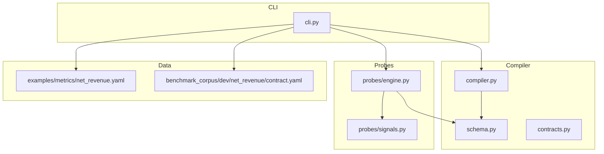
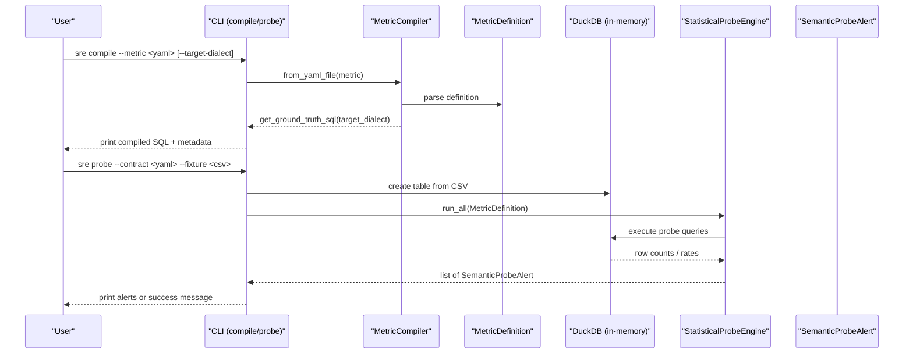
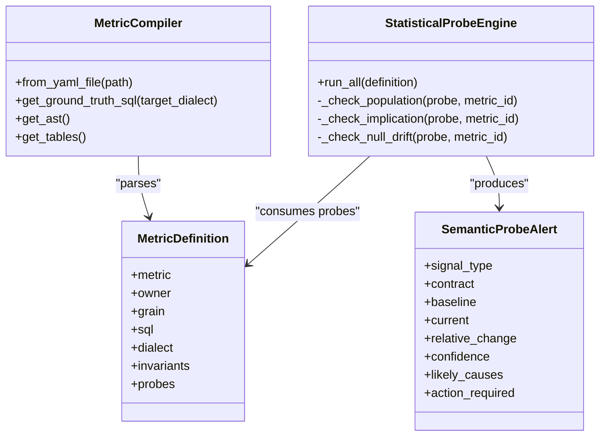

# Contract Management Commands

<cite>
**Referenced Files in This Document**
- [cli.py](file://semantic_reliability/cli.py)
- [compiler.py](file://semantic_reliability/compiler/compiler.py)
- [contracts.py](file://semantic_reliability/compiler/contracts.py)
- [schema.py](file://semantic_reliability/compiler/schema.py)
- [engine.py](file://semantic_reliability/probes/engine.py)
- [signals.py](file://semantic_reliability/probes/signals.py)
- [net_revenue.yaml](file://examples/metrics/net_revenue.yaml)
- [contract.yaml (dev net_revenue)](file://benchmark_corpus/dev/net_revenue/contract.yaml)
- [sarif_exporter.py](file://semantic_reliability/harness/sarif_exporter.py)
</cite>

## Table of Contents
1. [Introduction](#introduction)
2. [Project Structure](#project-structure)
3. [Core Components](#core-components)
4. [Architecture Overview](#architecture-overview)
5. [Detailed Component Analysis](#detailed-component-analysis)
6. [Dependency Analysis](#dependency-analysis)
7. [Performance Considerations](#performance-considerations)
8. [Troubleshooting Guide](#troubleshooting-guide)
9. [Conclusion](#conclusion)
10. [Appendices](#appendices)

## Introduction
This document explains the contract management CLI commands sre compile and sre probe, focusing on how to:
- Compile SCOS contracts into executable SQL with dialect transpilation
- Run semantic reality probes against test fixtures
- Interpret outputs, exit codes, and integrate these commands into CI/CD pipelines

The commands operate over YAML metric contracts that define canonical SQL, business invariants, and optional statistical probes. The compile command produces standard SQL for a target dialect; the probe command loads a contract, ingests fixture data, executes statistical checks, and reports alerts.

## Project Structure
At a high level:
- CLI entry points are defined in the CLI module
- Compilation logic lives under the compiler package
- Probing logic is implemented in the probes package
- Contracts follow a schema that supports invariants and probes
- Example contracts and benchmark corpus provide realistic usage patterns

**Diagram sources**
- [cli.py:571-630](file://semantic_reliability/cli.py#L571-L630)
- [compiler.py:10-72](file://semantic_reliability/compiler/compiler.py#L10-L72)
- [schema.py:83-98](file://semantic_reliability/compiler/schema.py#L83-L98)
- [engine.py:11-38](file://semantic_reliability/probes/engine.py#L11-L38)
- [signals.py:5-18](file://semantic_reliability/probes/signals.py#L5-L18)

**Section sources**
- [cli.py:571-630](file://semantic_reliability/cli.py#L571-L630)
- [compiler.py:10-72](file://semantic_reliability/compiler/compiler.py#L10-L72)
- [schema.py:83-98](file://semantic_reliability/compiler/schema.py#L83-L98)
- [engine.py:11-38](file://semantic_reliability/probes/engine.py#L11-L38)
- [signals.py:5-18](file://semantic_reliability/probes/signals.py#L5-L18)

## Core Components
- sre compile
  - Reads a metric YAML contract
  - Parses and validates the canonical SQL
  - Optionally transpiles to a target SQL dialect
  - Prints compiled SQL metadata and output
- sre probe
  - Loads a metric YAML contract (including probes)
  - Loads CSV fixture into an in-memory database
  - Executes population, implication, and null drift probes
  - Reports structured alerts with confidence and likely causes

Key supporting components:
- MetricDefinition schema defines contract fields including sql, dialect, invariants, and probes
- StatisticalProbeEngine runs declarative probes against a DuckDB connection
- SemanticContractValidator enforces policy-driven invariants on candidate SQL (used by other commands)

**Section sources**
- [cli.py:571-630](file://semantic_reliability/cli.py#L571-L630)
- [compiler.py:10-72](file://semantic_reliability/compiler/compiler.py#L10-L72)
- [schema.py:83-98](file://semantic_reliability/compiler/schema.py#L83-L98)
- [engine.py:11-38](file://semantic_reliability/probes/engine.py#L11-L38)
- [contracts.py:26-135](file://semantic_reliability/compiler/contracts.py#L26-L135)

## Architecture Overview
The compile and probe commands share a common contract model but diverge in execution:

**Diagram sources**
- [cli.py:571-630](file://semantic_reliability/cli.py#L571-L630)
- [compiler.py:18-47](file://semantic_reliability/compiler/compiler.py#L18-L47)
- [engine.py:11-38](file://semantic_reliability/probes/engine.py#L11-L38)
- [signals.py:5-18](file://semantic_reliability/probes/signals.py#L5-L18)

## Detailed Component Analysis

### sre compile
Purpose:
- Convert a SCOS metric contract into standard SQL
- Support transpilation to a target SQL dialect
- Print useful metadata about the compiled metric

Options:
- --metric: Path to a YAML metric contract file
- --target-dialect: Optional target SQL dialect for transpilation

Behavior:
- Loads the metric YAML and parses it into a MetricDefinition
- Generates formatted SQL from the canonical query
- If a target dialect differs from the source dialect, transpiles using the underlying AST
- Prints a summary panel with metric name, owner, grain, and effective dialect

Output formatting:
- Rich console panel displays key metadata
- Compiled SQL is returned programmatically via the compiler; the CLI prints metadata and can be extended to emit SQL to stdout or files

Exit codes:
- On successful compilation, exits with code 0
- On invalid YAML or unparseable SQL, raises a ValueError during parsing; this results in a non-zero exit code in typical CLI usage

Practical example:
- Compile a metric contract into Postgres-formatted SQL
- Transpile the same contract to Snowflake for deployment

Integration tips:
- Use the compiled SQL as ground truth in downstream tests or deployments
- Combine with invariant validation to ensure candidate SQL adheres to declared semantics

**Section sources**
- [cli.py:571-585](file://semantic_reliability/cli.py#L571-L585)
- [compiler.py:18-47](file://semantic_reliability/compiler/compiler.py#L18-L47)
- [schema.py:83-98](file://semantic_reliability/compiler/schema.py#L83-L98)

### sre probe
Purpose:
- Load a metric contract with declarative probes
- Ingest fixture data into an in-memory database
- Execute statistical probes to detect shifts between baseline assumptions and current data
- Report alerts with confidence levels and likely causes

Options:
- --contract: Path to a YAML metric contract that includes probes
- --fixture: Path to a CSV fixture or snapshot table
- --table-name: Name of the table created in memory (default: transactions)
- --fail-on-critical: Exit non-zero if any CRITICAL-level probe signal is detected

Processing flow:
- Parse the contract into a MetricDefinition
- Create an in-memory DuckDB connection and load the CSV into a table
- Initialize StatisticalProbeEngine with the connection and table name
- Run all configured probes:
  - Population probes: check whether a column’s value distribution matches expected baseline rates within tolerance
  - Implication probes: verify conditional relationships hold at expected confidence levels
  - Null drift probes: monitor unexpected increases in null rates for critical columns
- For each alert, compute baseline vs current values, relative change, confidence, and likely causes

Output formatting:
- If no alerts: prints a success message indicating stable semantic reality
- If alerts exist: prints a panel per alert with baseline, current rate, relative change, action required, and likely causes

Exit codes:
- Without --fail-on-critical: exits 0 even if alerts are present
- With --fail-on-critical: exits non-zero when any CRITICAL-level signal is detected

Practical example:
- Run probes against a sample transactions fixture to validate population and null-drift expectations

CI/CD integration:
- Gate merges or deployments based on probe outcomes
- Export structured alerts for dashboards or alerting systems

**Section sources**
- [cli.py:586-630](file://semantic_reliability/cli.py#L586-L630)
- [engine.py:11-38](file://semantic_reliability/probes/engine.py#L11-L38)
- [engine.py:40-71](file://semantic_reliability/probes/engine.py#L40-L71)
- [engine.py:73-110](file://semantic_reliability/probes/engine.py#L73-L110)
- [engine.py:112-137](file://semantic_reliability/probes/engine.py#L112-L137)
- [signals.py:5-18](file://semantic_reliability/probes/signals.py#L5-L18)

### Contract loading and schema
Contracts are defined by MetricDefinition, which includes:
- metric, description, owner, grain, sql, dialect
- tags, dimensions, metadata
- invariants: policy-driven rules enforced on candidate SQL
- probes: declarative statistical checks executed at runtime

Example contracts:
- examples/metrics/net_revenue.yaml shows a simple metric without invariants or probes
- benchmark_corpus/dev/net_revenue/contract.yaml demonstrates invariants such as required filters and aggregation components

**Section sources**
- [schema.py:5-37](file://semantic_reliability/compiler/schema.py#L5-L37)
- [schema.py:39-70](file://semantic_reliability/compiler/schema.py#L39-L70)
- [schema.py:83-98](file://semantic_reliability/compiler/schema.py#L83-L98)
- [net_revenue.yaml:1-22](file://examples/metrics/net_revenue.yaml#L1-L22)
- [contract.yaml (dev net_revenue):1-19](file://benchmark_corpus/dev/net_revenue/contract.yaml#L1-L19)

### Invariant validation (related capability)
While not invoked directly by sre compile or sre probe, the system includes a SemanticContractValidator that checks candidate SQL against declared invariants:
- Population invariants enforce required/forbidden filters
- Grain invariants enforce required grouping dimensions
- Aggregation invariants enforce inclusion of positive/negative components
- Timezone invariants enforce UTC alignment where required

This capability is used by other commands (e.g., drift inspection) to block changes that violate business semantics.

**Section sources**
- [contracts.py:26-135](file://semantic_reliability/compiler/contracts.py#L26-L135)

## Dependency Analysis
Compile and probe commands depend on shared abstractions:

**Diagram sources**
- [compiler.py:10-72](file://semantic_reliability/compiler/compiler.py#L10-L72)
- [schema.py:83-98](file://semantic_reliability/compiler/schema.py#L83-L98)
- [engine.py:11-38](file://semantic_reliability/probes/engine.py#L11-L38)
- [signals.py:5-18](file://semantic_reliability/probes/signals.py#L5-L18)

**Section sources**
- [compiler.py:10-72](file://semantic_reliability/compiler/compiler.py#L10-L72)
- [schema.py:83-98](file://semantic_reliability/compiler/schema.py#L83-L98)
- [engine.py:11-38](file://semantic_reliability/probes/engine.py#L11-L38)
- [signals.py:5-18](file://semantic_reliability/probes/signals.py#L5-L18)

## Performance Considerations
- Fixture size: Larger CSVs increase probe query time; consider sampling or partitioning for very large datasets
- Probe complexity: Multiple implication probes can multiply query cost; batch or limit scope in CI
- Dialect transpilation: Transpiling complex SQL may add overhead; prefer compiling once and caching results when possible
- In-memory database: All probing uses an in-memory DuckDB instance; avoid excessive concurrent runs to prevent memory pressure

[No sources needed since this section provides general guidance]

## Troubleshooting Guide
Common issues and resolutions:
- Invalid YAML or missing fields: Ensure the contract conforms to MetricDefinition schema; missing required fields will cause parsing errors
- Unparseable canonical SQL: The compiler raises a ValueError if the SQL cannot be parsed; fix syntax or dialect mismatch
- Probe failures: Exceptions during probe execution are logged; check fixture schema and column names match contract expectations
- No alerts despite expected drift: Verify baseline_rate, tolerance, and baseline_confidence settings align with actual data distributions
- CI gating unexpectedly passing: When using --fail-on-critical, ensure your thresholds and tolerances trigger the intended severity

Integration artifacts:
- SARIF export: Other commands support exporting drift findings to SARIF for GitHub Code Scanning; while not part of sre probe, you can combine outputs in CI

**Section sources**
- [compiler.py:37-47](file://semantic_reliability/compiler/compiler.py#L37-L47)
- [engine.py:48-71](file://semantic_reliability/probes/engine.py#L48-L71)
- [engine.py:88-110](file://semantic_reliability/probes/engine.py#L88-L110)
- [engine.py:114-137](file://semantic_reliability/probes/engine.py#L114-L137)
- [sarif_exporter.py:36-65](file://semantic_reliability/harness/sarif_exporter.py#L36-L65)

## Conclusion
The sre compile and sre probe commands enable robust contract-driven development and testing:
- Compile converts business-defined metrics into deployable SQL across dialects
- Probe validates that live or fixture data remains consistent with baseline assumptions
- Together, they form a practical gate for CI/CD to catch semantic drift early

Adopt these commands to:
- Standardize metric definitions and ensure cross-dialect correctness
- Detect upstream data shifts before they impact analytics
- Integrate automated quality gates with clear exit codes and reporting

[No sources needed since this section summarizes without analyzing specific files]

## Appendices

### Practical Examples

Compile a metric contract into Postgres SQL:
- Command: sre compile --metric examples/metrics/net_revenue.yaml
- Output: Panel showing metric metadata; compiled SQL available via the compiler

Transpile to Snowflake:
- Command: sre compile --metric examples/metrics/net_revenue.yaml --target-dialect snowflake
- Output: Same panel; generated SQL adapted to Snowflake dialect

Run semantic reality probes against a fixture:
- Command: sre probe --contract benchmark_corpus/dev/net_revenue/contract.yaml --fixture examples/fixtures/transactions.csv
- Output: Success message if stable; otherwise panels for each alert with baseline/current rates and likely causes

CI/CD integration patterns:
- Add sre compile to build steps to validate and generate dialect-specific SQL artifacts
- Add sre probe to test steps to fail builds on critical semantic drift
- Use --fail-on-critical to enforce strict gates; capture logs and alerts for dashboards

Exit codes reference:
- sre compile: 0 on success; non-zero on parse/validation errors
- sre probe: 0 unless --fail-on-critical triggers on CRITICAL signals

**Section sources**
- [cli.py:571-630](file://semantic_reliability/cli.py#L571-L630)
- [compiler.py:18-47](file://semantic_reliability/compiler/compiler.py#L18-L47)
- [engine.py:11-38](file://semantic_reliability/probes/engine.py#L11-L38)