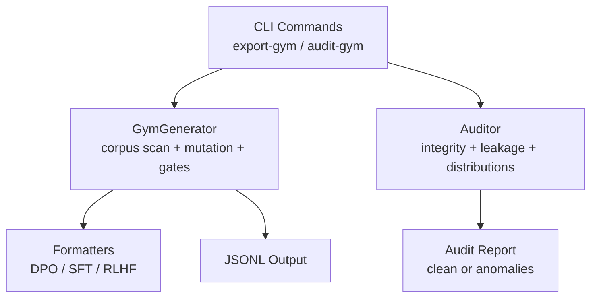
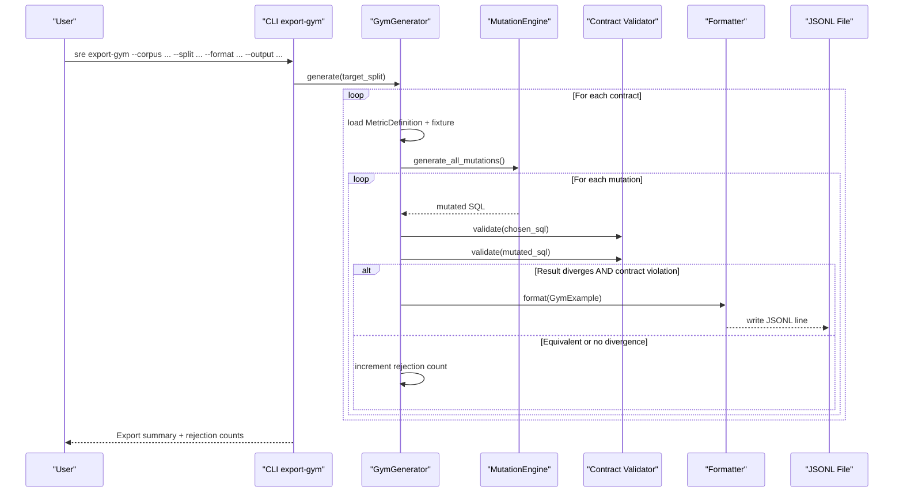
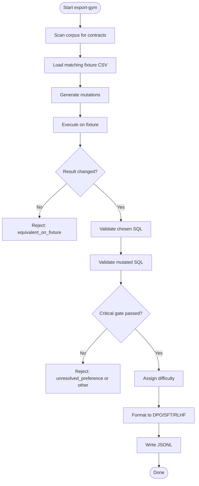
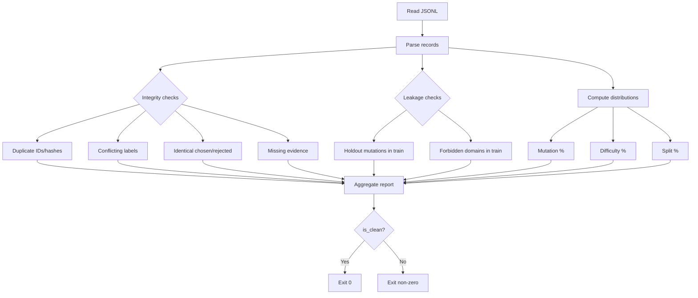
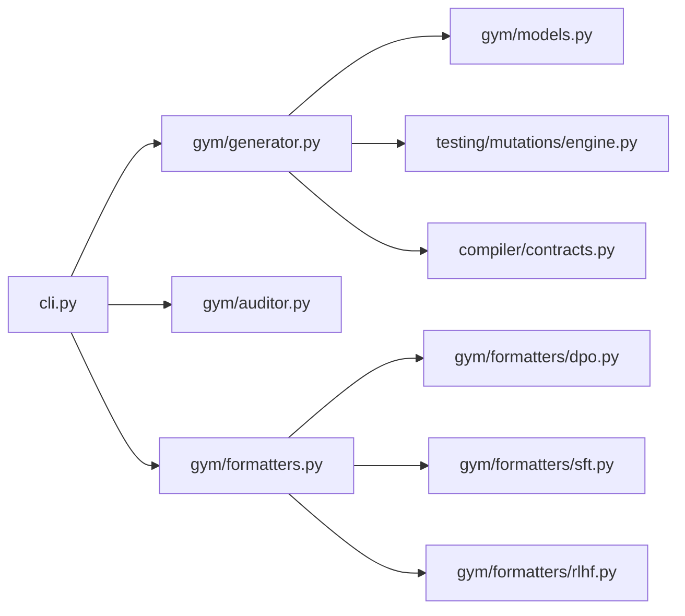

# Dataset & Gym Commands

<cite>
**Referenced Files in This Document**
- [cli.py](file://semantic_reliability/cli.py)
- [generator.py](file://semantic_reliability/gym/generator.py)
- [models.py](file://semantic_reliability/gym/models.py)
- [formatters.py](file://semantic_reliability/gym/formatters.py)
- [dpo.py](file://semantic_reliability/gym/formatters/dpo.py)
- [sft.py](file://semantic_reliability/gym/formatters/sft.py)
- [rlhf.py](file://semantic_reliability/gym/formatters/rlhf.py)
- [auditor.py](file://semantic_reliability/gym/auditor.py)
- [test_gym.py](file://tests/test_gym.py)
</cite>

## Table of Contents
1. [Introduction](#introduction)
2. [Project Structure](#project-structure)
3. [Core Components](#core-components)
4. [Architecture Overview](#architecture-overview)
5. [Detailed Component Analysis](#detailed-component-analysis)
6. [Dependency Analysis](#dependency-analysis)
7. [Performance Considerations](#performance-considerations)
8. [Troubleshooting Guide](#troubleshooting-guide)
9. [Conclusion](#conclusion)
10. [Appendices](#appendices)

## Introduction
This document explains the dataset management CLI commands for generating and auditing preference datasets used to train AI agents that produce business-correct SQL. It focuses on:
- sre export-gym: corpus scanning, split filtering, training dataset format selection (dpo/sft/rlhf), and output generation.
- sre audit-gym: dataset integrity validation, leakage detection, distribution analysis, and quality assurance checks.

It also provides examples for generating preference datasets for agent training and auditing exported datasets against semantic reliability standards, including rejection reasons, quality metrics, and remediation guidance for failed audits.

## Project Structure
The dataset management functionality is implemented under the gym module and exposed via CLI commands:
- CLI entry points: sre export-gym and sre audit-gym are defined in the CLI module.
- Generation pipeline: scans metric contracts, applies scientific validity gates, and produces structured preference pairs.
- Formatting: supports DPO, SFT, and RLHF formats.
- Auditing: validates integrity, detects leakage, and reports distributions.

**Diagram sources**
- [cli.py:631-703](file://semantic_reliability/cli.py#L631-L703)
- [generator.py:26-206](file://semantic_reliability/gym/generator.py#L26-L206)
- [formatters.py:5-78](file://semantic_reliability/gym/formatters.py#L5-L78)
- [auditor.py:10-138](file://semantic_reliability/gym/auditor.py#L10-L138)

**Section sources**
- [cli.py:631-703](file://semantic_reliability/cli.py#L631-L703)
- [generator.py:26-206](file://semantic_reliability/gym/generator.py#L26-L206)
- [formatters.py:5-78](file://semantic_reliability/gym/formatters.py#L5-L78)
- [auditor.py:10-138](file://semantic_reliability/gym/auditor.py#L10-L138)

## Core Components
- GymGenerator: Scans a corpus directory for metric contracts, loads fixtures, runs mutations, applies scientific validity gates, and emits GymExample objects with evidence and metadata.
- Formatters: Convert GymExample into standard formats:
  - DPO: prompt/chosen/rejected with rich metadata.
  - SFT: instruction/completion with reason codes.
  - RLHF: reward modeling pairs with evidence.
- Auditor: Reads JSONL dataset, performs integrity checks, leakage detection, and computes distributions for mutation types, difficulty levels, and splits.

Key data structures:
- RejectionReason: Enumerates why a candidate pair is rejected during generation.
- SPLIT_RULES: Maps allowed mutation types per split to prevent leakage.
- GymExample: Captures chosen/rejected SQL, evidence, difficulty, split, and hashes.

**Section sources**
- [generator.py:26-206](file://semantic_reliability/gym/generator.py#L26-L206)
- [models.py:8-88](file://semantic_reliability/gym/models.py#L8-L88)
- [formatters.py:5-78](file://semantic_reliability/gym/formatters.py#L5-L78)
- [auditor.py:10-138](file://semantic_reliability/gym/auditor.py#L10-L138)

## Architecture Overview
The export pipeline transforms contract-grounded corpora into training-ready preference datasets with strict scientific gates. The audit pipeline ensures dataset quality and compliance.

**Diagram sources**
- [cli.py:631-656](file://semantic_reliability/cli.py#L631-L656)
- [generator.py:34-202](file://semantic_reliability/gym/generator.py#L34-L202)
- [formatters.py:5-78](file://semantic_reliability/gym/formatters.py#L5-L78)

## Detailed Component Analysis

### sre export-gym
Purpose: Generate preference datasets from a corpus of metric contracts and fixtures, filtered by split and formatted for downstream training.

Key behaviors:
- Corpus scanning: Recursively finds YAML contracts, skipping assertion files and policy files. Loads MetricDefinition and discovers matching CSV fixtures.
- Split filtering: Uses deterministic assignment based on metric family; filters by target split if specified.
- Mutation and gating: Generates AST mutations, executes against fixtures, compares results, validates contracts, and enforces critical gates to ensure only grounded, semantically divergent pairs are included.
- Output generation: Writes JSONL lines using selected formatter (dpo/sft/rlhf).

Split rules and allowed mutations:
- Train: FILTER_DROP, AGGREGATION_SWAP, COALESCE_BYPASS
- Validation: BOUNDARY_SHIFT, DISTINCT_DROP
- Holdout: GRAIN_DROP, MATH_OPERATOR_INVERT, JOIN_PREDICATE_DROP

Training dataset formats:
- DPO: Standard preference pairs with metadata including example_id, metric_id, domain, split, mutation_type, difficulty, variance_pct, violations, evidence_hash, policy_version.
- SFT: Instruction-tuning format with completion and reason codes derived from evidence.
- RLHF: Reward modeling pairs with explicit reward components and evidence.

Examples:
- Generate DPO dataset for all splits:
  - Command: sre export-gym --corpus benchmark_corpus --split all --format dpo --output datasets/train_dpo.jsonl
- Generate SFT dataset for train split only:
  - Command: sre export-gym --corpus benchmark_corpus --split train --format sft --output datasets/train_sft.jsonl
- Generate RLHF dataset for holdout split:
  - Command: sre export-gym --corpus benchmark_corpus --split holdout --format rlhf --output datasets/holdout_rlhf.jsonl

Rejection reasons tracked during generation:
- equivalent_on_fixture: Mutation did not change result on fixture.
- unexecutable: Mutation could not be executed.
- chosen_contract_failure: Baseline query violates its own contract.
- insufficient_fixture_contrast: Fixture yields empty or invalid baseline.
- incomplete_contract: Contract file missing required fields.
- rejected_not_semantically_divergent: Mutation does not diverge meaningfully.
- unresolved_preference: Diverges but violates no known contract (excluded from DPO).
- malformed_sql: Invalid SQL produced by mutation.
- identical_pair: Mutation did not alter SQL string.

Quality metrics reported by CLI:
- Total exported pairs.
- Rejection counts per reason.

**Section sources**
- [cli.py:631-656](file://semantic_reliability/cli.py#L631-L656)
- [generator.py:34-202](file://semantic_reliability/gym/generator.py#L34-L202)
- [models.py:8-35](file://semantic_reliability/gym/models.py#L8-L35)
- [formatters.py:5-78](file://semantic_reliability/gym/formatters.py#L5-L78)
- [dpo.py:5-26](file://semantic_reliability/gym/formatters/dpo.py#L5-L26)
- [sft.py:5-24](file://semantic_reliability/gym/formatters/sft.py#L5-L24)
- [rlhf.py:5-30](file://semantic_reliability/gym/formatters/rlhf.py#L5-L30)

#### Data Flow for export-gym

**Diagram sources**
- [generator.py:34-202](file://semantic_reliability/gym/generator.py#L34-L202)

### sre audit-gym
Purpose: Validate exported datasets for integrity, detect leakage, analyze distributions, and provide quality assurance.

Checks performed:
- Integrity:
  - Duplicate example IDs.
  - Duplicate evidence hashes.
  - Conflicting preference labels for same prompt.
  - Identical chosen and rejected outputs.
  - Missing evidence/metadata.
- Leakage detection:
  - Mutation-family leakage: Train split must not contain holdout mutation types (GRAIN_DROP, MATH_OPERATOR_INVERT, JOIN_PREDICATE_DROP).
  - Domain leakage: Train split must not contain forbidden domains (healthcare, infrastructure, risk).
- Distribution analysis:
  - Mutation type percentages.
  - Difficulty level percentages.
  - Split distribution percentages.

Output:
- Console report with status (PASSED/FAILED), counts, and distributions.
- Optional JSON report saved to path.

Exit behavior:
- Non-zero exit code when anomalies are detected.

Examples:
- Audit a DPO dataset and print report:
  - Command: sre audit-gym --dataset datasets/train_dpo.jsonl
- Save JSON audit report:
  - Command: sre audit-gym --dataset datasets/train_dpo.jsonl --output datasets/audit_report.json

Quality metrics in audit report:
- total_records
- duplicate_example_ids
- duplicate_evidence_hashes
- conflicting_preference_labels
- chosen_rejected_identical
- missing_evidence
- mutation_family_leakage
- metric_family_leakage
- domain_leakage
- mutation_distribution
- difficulty_distribution
- split_distribution

Remediation guidance for failed audits:
- If duplicate_example_ids > 0: Deduplicate by example_id before training.
- If duplicate_evidence_hashes > 0: Ensure unique evidence payloads; recompute hashes.
- If conflicting_preference_labels > 0: Resolve multiple different chosen outputs for the same prompt.
- If chosen_rejected_identical > 0: Remove identical pairs; ensure meaningful contrast.
- If missing_evidence > 0: Enforce presence of example_id and evidence_hash in metadata.
- If mutation_family_leakage > 0: Move holdout mutations out of train split; enforce SPLIT_RULES.
- If domain_leakage > 0: Exclude forbidden domains from train split; apply domain policy.
- If metric_family_leakage > 0: Investigate cross-metric contamination; ensure separation by metric family.

**Section sources**
- [cli.py:658-703](file://semantic_reliability/cli.py#L658-L703)
- [auditor.py:10-138](file://semantic_reliability/gym/auditor.py#L10-L138)

#### Audit Flow

**Diagram sources**
- [auditor.py:41-138](file://semantic_reliability/gym/auditor.py#L41-L138)

## Dependency Analysis
The CLI commands depend on core modules within the gym package:
- cli.py invokes GymGenerator and formatters for export-gym, and auditor for audit-gym.
- generator.py depends on MutationEngine, SemanticContractValidator, and models for split/difficulty/evidence hashing.
- formatters convert GymExample into standardized formats.
- auditor reads JSONL and computes statistics and leakage flags.

**Diagram sources**
- [cli.py:631-703](file://semantic_reliability/cli.py#L631-L703)
- [generator.py:11-21](file://semantic_reliability/gym/generator.py#L11-L21)
- [formatters.py:1-78](file://semantic_reliability/gym/formatters.py#L1-L78)
- [auditor.py:1-138](file://semantic_reliability/gym/auditor.py#L1-138)

**Section sources**
- [cli.py:631-703](file://semantic_reliability/cli.py#L631-L703)
- [generator.py:11-21](file://semantic_reliability/gym/generator.py#L11-L21)
- [formatters.py:1-78](file://semantic_reliability/gym/formatters.py#L1-L78)
- [auditor.py:1-138](file://semantic_reliability/gym/auditor.py#L1-L138)

## Performance Considerations
- Fixture execution: Each mutation is executed against DuckDB in-memory; large fixtures may increase runtime. Consider splitting corpus or limiting splits.
- Mutation volume: Number of generated mutations scales with SQL complexity; filter by split to reduce workload.
- Formatting overhead: Minimal; JSON serialization is linear in number of examples.
- Audit performance: Linear scan over JSONL; efficient for typical dataset sizes.

[No sources needed since this section provides general guidance]

## Troubleshooting Guide
Common issues and resolutions:
- No examples exported:
  - Check that corpus contains valid metric contracts with required fields.
  - Verify fixtures exist and yield non-empty results.
  - Inspect rejection_counts printed by CLI for reasons like incomplete_contract, unexecutable, or insufficient_fixture_contrast.
- High duplicate_example_ids or duplicate_evidence_hashes:
  - Ensure deterministic example_id and evidence_hash generation; deduplicate prior to training.
- Conflicting preference labels:
  - Resolve prompts with multiple different chosen outputs; keep one canonical chosen per prompt.
- Chosen/rejected identical:
  - Remove identical pairs; ensure meaningful contrast between chosen and rejected.
- Missing evidence:
  - Enforce presence of example_id and evidence_hash in metadata; regenerate if missing.
- Mutation-family leakage:
  - Move holdout mutations out of train split; enforce SPLIT_RULES during generation.
- Domain leakage:
  - Exclude forbidden domains from train split; apply domain policy consistently.
- Unresolved preference:
  - These pairs are intentionally excluded from DPO; consider alternative training strategies or refine contracts.

Exit codes:
- export-gym: Exits 0 on success; prints rejection summary.
- audit-gym: Exits non-zero if anomalies detected; otherwise 0.

**Section sources**
- [cli.py:631-703](file://semantic_reliability/cli.py#L631-L703)
- [generator.py:34-202](file://semantic_reliability/gym/generator.py#L34-L202)
- [auditor.py:41-138](file://semantic_reliability/gym/auditor.py#L41-L138)

## Conclusion
The sre export-gym and sre audit-gym commands provide a robust pipeline for generating and validating preference datasets grounded in semantic contracts. They enforce scientific validity through mutation-based divergence and contract validation, support multiple training formats, and deliver comprehensive audits to ensure dataset integrity and compliance. Use these tools to build reliable training sets for AI agents that produce business-correct SQL.

[No sources needed since this section summarizes without analyzing specific files]

## Appendices

### Example Workflows
- Generate preference datasets for AI agent training:
  - DPO: sre export-gym --corpus benchmark_corpus --split all --format dpo --output datasets/train_dpo.jsonl
  - SFT: sre export-gym --corpus benchmark_corpus --split train --format sft --output datasets/train_sft.jsonl
  - RLHF: sre export-gym --corpus benchmark_corpus --split holdout --format rlhf --output datasets/holdout_rlhf.jsonl
- Audit exported datasets for compliance:
  - sre audit-gym --dataset datasets/train_dpo.jsonl
  - sre audit-gym --dataset datasets/train_dpo.jsonl --output datasets/audit_report.json

### Quality Metrics Summary
- Export:
  - Total pairs exported.
  - Rejection counts per reason.
- Audit:
  - Integrity counts (duplicates, conflicts, identical pairs, missing evidence).
  - Leakage counts (mutation-family, metric-family, domain).
  - Distributions (mutation type, difficulty, split).

### Remediation Guidance
- Deduplicate identifiers and evidence hashes.
- Resolve conflicting preferences per prompt.
- Remove identical pairs and ensure meaningful contrast.
- Enforce split rules and domain policies to prevent leakage.
- Regenerate datasets after fixing contracts or fixtures.

**Section sources**
- [test_gym.py:95-124](file://tests/test_gym.py#L95-L124)
- [cli.py:631-703](file://semantic_reliability/cli.py#L631-L703)
- [auditor.py:10-138](file://semantic_reliability/gym/auditor.py#L10-L138)